# aclnnMaxUnpool2d 算子设计文档

## 一、需求背景

### 1.1 需求来源

通过社区任务完成开源仓算子贡献，补充完善 Ascend C 算子库能力。当前 `aclnnMaxUnpool2d` 算子的 `self` 输入不支持 `BFLOAT16` 数据类型，本任务需要在现有代码基础上增强 `aclnnMaxUnpool2d`，使 `self/out` 支持 `BFLOAT16`，并保证 `indices` 支持 `INT32/INT64`。

### 1.2 背景介绍

`aclnnMaxUnpool2d` 是 2D 最大池化的逆运算。算子根据 `outputSize` 决定输出 `out` 的 H、W 空间大小，并根据 `indices` 中记录的位置，把 `self` 中的元素写入输出张量，未被写入的位置填充为 0。

输入为 3 维时，各维度依次表示 C、H、W：

$$
out[C][indices[C][i]] = self[C][i]
$$

输入为 4 维时，各维度依次表示 N、C、H、W：

$$
out[N][C][indices[N][C][i]] = self[N][C][i]
$$

其中 `self`、`indices` 和 `out` 在计算前会将最后两个空间轴 H、W 合并成一个线性轴，`i ∈ [0, H * W)`。

### 1.3 当前支持情况

当前 `aclnnMaxUnpool2d` 已支持 Atlas A2 训练系列产品 / Atlas A3 系列产品，已有实现为 ACLNN 组合算子，底层复用 `ScatterElements` 完成按索引写入。现有接口已经支持 `indices` 为 `INT32/INT64`，但 `self/out` 数据类型未放开 `BFLOAT16`。

## 二、需求分析

### 2.1 外部组件依赖

不涉及外部组件依赖。

### 2.2 内部适配模块

本任务主要适配 ACLNN 接口实现和接口文档。`aclnnMaxUnpool2d` 没有新增独立 AICore kernel，核心计算复用已有 `ScatterElements` L0 能力。

### 2.3 算子原型

| 参数名 | 输入/输出 | 描述 | 使用说明 | 数据类型 | 数据格式 | 维度 | 非连续 Tensor |
| --- | --- | --- | --- | --- | --- | --- | --- |
| self | 输入 | 待还原的 MaxPool2d 输出值 | 数据类型与 out 一致，shape 与 indices 一致；3 维为 C,H,W，4 维为 N,C,H,W | FLOAT、FLOAT16、BFLOAT16、INT16、INT32、INT64、INT8、UINT8、DOUBLE | ND/NCHW | 3-4 | 支持 |
| indices | 输入 | self 中每个元素在输出空间中的线性索引 | shape 与 self 一致，索引范围在输出 H*W 内 | INT32、INT64 | ND/NCHW | 3-4 | 支持 |
| outputSize | 输入 | 输出结果在 H、W 维度上的空间大小 | Host 侧 aclIntArray，size 为 2，乘积需大于等于 self 的 H*W | - | - | - | - |
| out | 输出 | 还原后的输出张量 | 数据类型与 self 一致；H、W 与 outputSize 一致 | FLOAT、FLOAT16、BFLOAT16、INT16、INT32、INT64、INT8、UINT8、DOUBLE | ND/NCHW | 3-4 | 支持 |

## 三、需求详细设计

### 3.1 使能方式

| 上层框架 | 是否涉及 |
| --- | --- |
| TF 训练/推理 |  |
| PyTorch 训练/推理 |  |
| ATC 推理 |  |
| ACLNN 直调 | √ |
| OPAT 调优 |  |
| SGAT 子图切分 |  |

### 3.2 详细设计

本次任务是在现有代码基础上做增量增强，主要修改 `op_api` 和文档，不新增独立 kernel。

#### 3.2.1 op_api 设计

在 `op_api/aclnn_max_unpool2d.cpp` 中放开 `BFLOAT16` 支持：

1. `DTYPE_SUPPORT_LIST` 增加 `DT_BF16`。
2. 参数校验保持 `self` 与 `out` 数据类型一致，`indices` 支持 `INT32/INT64`。
3. 保留原有空指针、shape、outputSize 合法性校验。

`BFLOAT16` 与非 `BFLOAT16` 类型复用同一套 ACLNN 组合路径：

```text
Contiguous -> Reshape -> ZerosLike -> ScatterElements -> Reshape -> ViewCopy
```

本次适配在 `DTYPE_SUPPORT_LIST` 中增加 `DT_BF16`，计算流程复用现有组合路径。

#### 3.2.2 op_host 设计

无需新增 op_host 侧 kernel tiling 逻辑。该算子为 ACLNN 组合接口，内部通过 L0 算子完成连续化、reshape、清零和 scatter 写入。

#### 3.2.3 op_kernel 设计

无需新增 `MaxUnpool2d` 专用 AICore kernel。底层按索引写入能力由 `ScatterElements` 提供，`aclnnMaxUnpool2d` 负责组合调度。

### 3.3 运行流程图

```mermaid
graph TD
    A[调用 aclnnMaxUnpool2dGetWorkspaceSize] --> B[OP_CHECK_COMM_INPUT<br/>检查 workspaceSize 和 executor]
    B --> C[L2_DFX_PHASE_1<br/>记录 self/indices/outputSize/outRef]
    C --> D[CREATE_EXECUTOR 创建 uniqueExecutor]
    D --> E{uniqueExecutor 是否创建成功}
    E -->|否| F[返回 ACLNN_ERR_INNER_CREATE_EXECUTOR]
    E -->|是| G[CheckParams 参数校验]

    G --> G1[CheckNotNull<br/>self/indices/outputSize/outRef 非空]
    G1 --> G2[CheckDtypeValid<br/>self 在 DTYPE_SUPPORT_LIST<br/>outRef dtype 等于 self dtype<br/>indices 为 INT32 或 INT64]
    G2 --> G3[CheckShape<br/>self 为 3D 或 4D<br/>self 与 indices 维度数相同<br/>self 与 indices shape 相同]
    G3 --> G4[CheckInpuNullTensor<br/>从第 1 维开始检查空间维度大于 0]
    G4 --> G5[CheckOutputSize<br/>outputSize 长度为 2<br/>H/W 均大于 0<br/>outH*outW 大于等于 dimH*dimW]
    G5 --> H{CheckParams 是否成功}
    H -->|否| I[返回对应错误码]
    H -->|是| J{self IsEmpty}

    J -->|是| K[workspaceSize 置 0]
    K --> L[uniqueExecutor.ReleaseTo executor]
    L --> M[返回 ACLNN_SUCCESS]

    J -->|否| N[读取 selfDimNum/outH/outW]
    N --> O[按 CHW 初始化<br/>dimN=1, dimC=C, dimH=H, dimW=W]
    O --> P{selfDimNum 是否为 NCHW}
    P -->|是| Q[按 NCHW 更新<br/>dimN=N, dimC=C, dimH=H, dimW=W]
    P -->|否| R[保持 CHW 解析结果]
    Q --> S[Contiguous self<br/>CHECK_RET selfContiguous 非空]
    R --> S
    S --> T[Contiguous indices<br/>CHECK_RET indicesContiguous 非空]
    T --> U[Contiguous outRef<br/>CHECK_RET outRefContiguous 非空]

    U --> V[CalcMaxUnpool2dInputNewShape<br/>inputNewShape 为 dimN, dimC, dimH*dimW<br/>CHECK_RET inputNewShapeArray 非空]
    V --> W[CalcMaxUnpool2dInputNewShape<br/>outNewShape 为 dimN, dimC, outH*outW<br/>CHECK_RET outNewShapeArray 非空]
    W --> X[Reshape selfContiguous 到 selfReshape<br/>CHECK_RET selfReshape 非空]
    X --> Y[Reshape indicesContiguous 到 indicesReshape<br/>CHECK_RET indicesReshape 非空]
    Y --> Z[Reshape outRefContiguous 到 outRefReshape<br/>CHECK_RET outRefReshape 非空]

    Z --> AA[ZerosLike outRefReshape 得到 zeroOut<br/>CHECK_RET zeroOut 非空]
    AA --> AB[设置 reductionCurr = none]
    AB --> AC[ScatterElements<br/>zeroOut, indicesReshape, selfReshape, AXIS=2, reductionCurr<br/>CHECK_RET scatterRes 非空]
    AC --> AD[Reshape scatterRes<br/>shape 使用 outRef GetViewShape<br/>CHECK_RET outReshape2 非空]
    AD --> AE[ViewCopy<br/>outReshape2 写入 outRef<br/>CHECK_RET viewCopyResult 非空]
    AE --> AF[workspaceSize 设置为 uniqueExecutor GetWorkspaceSize]
    AF --> AG[uniqueExecutor.ReleaseTo executor]
    AG --> AH[返回 ACLNN_SUCCESS]

    AH --> AI[调用 aclnnMaxUnpool2d]
    AI --> AJ[L2_DFX_PHASE_2]
    AJ --> AK[CommonOpExecutorRun<br/>workspace, workspaceSize, executor, stream]
```



### 3.4 支持硬件

支持 Atlas A2 训练系列产品 / Atlas A3 系列产品，对应 `ascend910b` 及 `ascend910_93`。

## 四、验收及可维可测标准

### 4.1 精度标准

使用 AscendOpTest 或 ACLNN 样例进行验证，`BFLOAT16` 输出需满足默认精度阈值，结果与 CPU golden 计算一致。

### 4.2 性能标准

`BFLOAT16` 复用原有组合路径；`indices` 使用 `INT32` 与 `INT64` 时功能均需正确，性能不低于可接受基线。

### 4.3 测试覆盖

测试需覆盖：

- `self/out` 为 `BFLOAT16`。
- `indices` 为 `INT32` 和 `INT64`。
- 3 维 CHW 与 4 维 NCHW 输入。
- `outputSize` 大于输入 H/W 和等于输入 H/W 的场景。
- 常规场景和边界场景。

