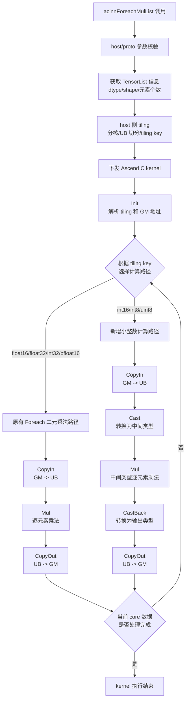

# 需求背景（required）

## 需求来源

通过社区任务完成开源仓算子贡献的需求，补充完善 Ascend C 算子库，为现有的 `aclnnForeachMulList` 算子增加对 `DT_INT16`、`DT_INT8`、`DT_UINT8` 数据类型的支持。

## 背景介绍

### ForeachMulList 算子功能说明

ForeachMulList 算子用于对两个输入 TensorList 中相同位置的 Tensor 执行逐元素乘法，并将计算结果写入输出 TensorList。

输入：`x1`、`x2`

输出：`y`

计算公式如下：

$$
y_i = x1_i * x2_i,\quad i = 0, 1, ..., n-1
$$

其中，`x1_i`、`x2_i`、`y_i` 表示 TensorList 中第 `i` 个 Tensor。`x1_i` 和 `x2_i` 的数据类型、数据格式和 shape 需要一致。

### ForeachMulList 算子现有实现分析

ForeachMulList 在 `ops-nn` 仓库中已有 Ascend C 实现，本次开发是在现有算子基础上补充数据类型支持，不涉及算子接口变更。

当前 ForeachMulList 支持能力如下：

| 参数 | 参数含义 | 数据类型 | 当前支持数据类型 | 约束 | 形状 |
| --- | --- | --- | --- | --- | --- |
| x1 | 第一个输入 TensorList | TensorList | float16, float32, int32, bfloat16 | TensorList 内所有 Tensor 数据类型一致 | 每个 Tensor 支持 0-8 维 |
| x2 | 第二个输入 TensorList | TensorList | float16, float32, int32, bfloat16 | TensorList 长度、数据类型、数据格式和 shape 与 x1 一致 | 每个 Tensor 支持 0-8 维 |
| y | 输出 TensorList | TensorList | float16, float32, int32, bfloat16 | TensorList 长度、数据类型、数据格式与 x1 一致 | 每个 Tensor 支持 0-8 维 |

### ForeachMulList 算子新增类型分析

任务要求新增支持的数据类型为 `DT_INT16`、`DT_INT8`、`DT_UINT8`。Foreach 通用 dtype 工具中已包含新增类型的 tiling key 映射，可在现有 Foreach 通用 tiling 流程上扩展对应类型分支。

| 数据类型 | tiling key |
| --- | --- |
| DT_INT16 | 5 |
| DT_INT8 | 7 |
| DT_UINT8 | 8 |

对新增类型进行编译和仿真验证后，`DT_INT8`、`DT_UINT8` 不能直接复用现有 `Mul` 模板，底层 `vmul` 不支持 8 bit 整数 LocalTensor 直接参与乘法计算；`DT_INT16` 直接复用现有模板在本地仿真运行中存在稳定性限制。为保证三类新增整数类型具备统一、可验证的计算路径，本次设计采用小整数计算方案：输入搬入 UB 后先转换为支持乘法计算的中间类型，完成逐元素乘法，再转换回目标输出类型。

# 需求分析（required）

## 需求描述

基于现有 ForeachMulList Ascend C 实现，补充 `DT_INT16`、`DT_INT8`、`DT_UINT8` 数据类型支持，使 `aclnnForeachMulList` 能够处理新增类型的合法 TensorList 输入，并满足任务书中泛化场景、精度验证和文档交付要求。

## 需求拆解

1. 扩展算子 host 侧和 proto 侧数据类型注册。
1. 扩展 kernel 侧新增数据类型分支。
1. 为新增整数类型实现中间类型计算路径。
1. 补充测试和文档

# 详细设计（required）

## 算子分析

### 数学公式

$$
y_i = x1_i * x2_i,\quad i = 0, 1, ..., n-1
$$

### 支持数据类型

本次开发后，ForeachMulList 支持数据类型如下：

| 数据类型 | 支持情况 |
| --- | --- |
| float16 | 已支持 |
| float32 | 已支持 |
| int32 | 已支持 |
| bfloat16 | 已支持 |
| int16 | 本次新增 |
| int8 | 本次新增 |
| uint8 | 本次新增 |

### 支持形状

支持 TensorList 输入，TensorList 中每个 Tensor 支持 0-8 维。

## 算子实现

### 实现方案

#### 3.2.1 host侧设计：

host 侧复用现有 Foreach 通用 tiling 流程，不新增独立 tiling 结构。

需要修改的内容如下：

1. 在 `foreach_mul_list_def.cpp` 中扩展输入输出支持的数据类型。
1. 在 `foreach_mul_list_proto.h` 中扩展图原型支持的数据类型。
1. 在 binary 配置文件中补充 `int16`、`int8`、`uint8` 编译配置。
1. 复用 `foreach_utils` 中已有 dtype 到 tiling key 的映射关系。

##### 1. 分核策略：

优先使用满核原则。host 侧根据 TensorList 总元素数、32 字节 block 大小和平台可用 AIV core 数计算实际使用 core 数。

如果数据块可以在核间均分，各 core 处理相同数量的数据块；如果不能均分，将余出的数据块分配给前若干个 core。kernel 侧通过 tiling 数据获取当前 core 需要处理的 Tensor 下标范围和起始 offset。

##### 2. 数据分块和内存优化策略：

复用 Foreach 通用 UB 切分策略。UB 空间用于输入 `x1`、输入 `x2`、输出 `y` 以及新增整数类型所需的中间计算缓冲。

对尾块和非 32 字节对齐数据，沿用现有 Foreach 尾块处理逻辑，保证不同 Tensor 数量、不同 shape 和空 Tensor 场景均可进入统一处理流程。

##### 3. tilingkey 规划策略：

新增类型使用 Foreach 通用 dtype tiling key，不改变原有数据类型分支。

| tiling key | 数据类型 | 说明 |
| --- | --- | --- |
| 1 | DT_FLOAT16 | 原有分支 |
| 2 | DT_FLOAT | 原有分支 |
| 3 | DT_INT32 | 原有分支 |
| 4 | DT_BF16 | 原有分支 |
| 5 | DT_INT16 | 本次新增 |
| 7 | DT_INT8 | 本次新增 |
| 8 | DT_UINT8 | 本次新增 |

#### 3.2.2 kernel侧设计：

kernel 侧整体沿用现有 Foreach 二元 TensorList 算子的处理流程，包括 Init、Process、CopyIn、Compute、CopyOut 等阶段。

原有 `float16`、`float32`、`int32`、`bfloat16` 数据类型保持现有实现不变；新增 `DT_INT16`、`DT_INT8`、`DT_UINT8` 通过新增 tiling key 分支进入小整数计算路径。

新增整数类型的 kernel 计算流程如下：

1. 将 `x1`、`x2` 的输入分片从 GM 搬入 UB。
1. 将输入数据转换为支持乘法计算的中间类型。
1. 使用中间类型执行逐元素乘法。
1. 将计算结果转换回目标输出类型。
1. 将输出分片从 UB 搬回 GM。

`DT_INT16` 使用 `float` 作为中间类型，避免 `half` 中间类型在 int16 有效结果范围内出现整数舍入误差。`DT_INT8`、`DT_UINT8` 使用 `half` 作为中间类型，规避 8 bit 整数类型不能直接参与 `Mul` 计算的问题；对于结果仍落在 8 bit 可表示范围内的场景，`half` 可以精确表示对应整数值。

该方案不改变算子接口，不影响原有数据类型的计算路径，仅为新增整数类型补充独立计算分支。

Ascend C 的 ForeachMulList 算子流程见下图。

## 支持硬件

| 支持的芯片版本 | 涉及勾选 |
| --- | --- |
| Atlas A2 训练系列产品 | √ |
| Atlas A3 系列产品 | √ |

## 算子约束限制

1. `x1`、`x2`、`y` 不能为空指针。
1. `x1`、`x2`、`y` 的 TensorList 长度一致。
1. TensorList 内所有 Tensor 的数据类型一致。
1. `x1[i]` 与 `x2[i]` 的数据类型、数据格式和 shape 一致。
1. 每个 Tensor 维度不超过 8 维。
1. 不支持广播。

# 可维可测分析

## 精度标准/性能标准

| 验收标准 | 描述(不涉及说明原因) | 标准来源 |
| --- | --- | --- |
| 精度标准 | 满足 AscendOpTest 工具默认阈值 | ForeachMulList 算子开发任务书 |
| 性能标准 | 无性能要求 | ForeachMulList 算子开发任务书 |

测试覆盖：

1. 常规 TensorList 乘法场景。
1. 多 Tensor 输入场景。
1. 空 Tensor 场景。
1. 非 32 字节对齐 shape 场景。
1. `int16`、`int8`、`uint8` 边界值场景。
1. 原有数据类型回归场景。

## 兼容性分析

本任务为已有算子新增数据类型支持，不改变算子接口、输入输出数量和原有数据类型计算逻辑。
