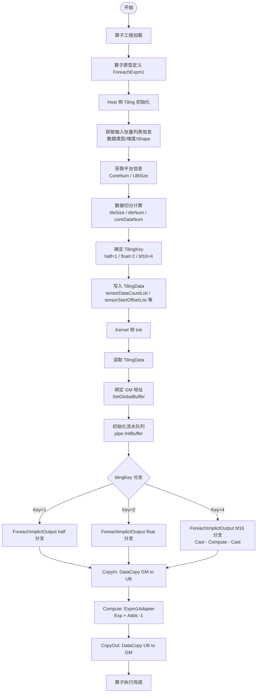
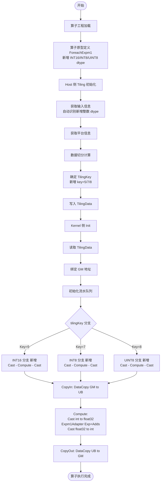

# ForeachExpm1 算子设计方案

## 一、基本信息

### 1.1 需求来源

ForeachExpm1 算子是 PyTorch `torch._foreach_expm1` API 对应的昇腾算子实现，核心语义为：对输入张量列表中的每个张量逐元素执行 `y = e^x - 1` 运算，返回结果张量列表。该算子广泛应用于深度学习中的数值稳定计算场景，特别是处理接近零的小数值时，`expm1` 相比直接计算 `exp(x) - 1` 具有更高的数值精度。

本方案基于昇腾算子开源仓（ops-nn）中已有的 ForeachExpm1 算子实现，扩展 INT16（int16_t）、INT8（int8_t）、UINT8（uint8_t）三种整数数据类型的支持，并完成算子泛化适配，最终合入昇腾算子开源仓。

### 1.2 背景介绍

#### 1.2.1 现有 ForeachExpm1 算子实现分析

当前 aclnnForeachExpm1 算子仅支持浮点数据类型（FLOAT16、FLOAT32、BFLOAT16），不支持整数数据类型。任务要求在现有代码基础上再开发，新增 INT16、INT8、UINT8 支持，使算子覆盖整数数据类型场景。

**现有实现路径**：`https://gitcode.com/cann/ops-nn/tree/master/foreach/foreach_expm1`

#### 1.2.2 现有版本支持能力

| 参数 | 参数含义 | 数据类型 | 支持数据类型 | 约束 | 形状 |
| --- | --- | --- | --- | --- | --- |
| x | 输入张量列表 | aclTensorList* | FLOAT32、FLOAT16、BFLOAT16 | 列表中所有 Tensor 数据类型一致 | 0-8 维 ND |
| y | 输出张量列表 | aclTensorList* | 与 x 一致 | shape size ≥ x 的 shape size | 0-8 维 ND |

#### 1.2.3 现有核心计算逻辑

计算公式：

$$
x = [{x_0}, {x_1}, ... {x_{n-1}}]\\
y = [{y_0}, {y_1}, ... {y_{n-1}}]
$$

$$
{y_i}=e^{x_i}-1 \quad (i=0,1,...n-1)
$$

**Kernel 侧核心计算流程**：

```C++
template <typename T>
__aicore__ void Expm1Adapter(const LocalTensor<T>& dstLocal,
 const LocalTensor<T>& srcLocal,
 const int32_t& uValue)
{
 T scalarVal = T(-1);
 PipeBarrier<PIPE_V>();
 Exp(dstLocal, srcLocal, uValue); // 第一步：指数运算
 PipeBarrier<PIPE_V>();
 Adds(dstLocal, srcLocal, scalarVal, uValue); // 第二步：减 1
}
```

对于浮点类型（FLOAT16、FLOAT32），dstLocal 和 srcLocal 指向同一块数据，Exp 先将其更新为 `e^x`，然后 Adds 在结果上减 1，最终得到 `e^x - 1`。

对于 BFLOAT16 类型，通过 `InnerComputer<bfloat16_t, float>` 特化处理：
1. `Cast(bfloat16 → float32)` — 类型提升
2. `Exp + Adds(-1)` — 在 float32 下计算
3. `Cast(float32 → bfloat16)` — 类型还原

#### 1.2.4 现有 Tiling Key 规划

| Tiling Key | 对应数据类型 | 内核模板实例化 |
|---|---|---|
| 1 (TILING_KEY_HALF) | FLOAT16 | `ForeachImplictOutput<half, half, Expm1Adapter<half>>` |
| 2 (TILING_KEY_FLOAT) | FLOAT32 | `ForeachImplictOutput<float, float, Expm1Adapter<float>>` |
| 4 (TILING_KEY_BF16) | BFLOAT16 | `ForeachImplictOutput<bfloat16_t, float, Expm1Adapter<float>>` |

#### 1.2.5 现有实现流程图



---

## 二、需求分析

### 2.1 外部组件依赖

- 新增类型依赖 AscendC Cast API 对 `int8_t ↔ float`、`uint8_t ↔ float`、`int16_t ↔ float` 的类型转换支持；
- 依赖现有 foreach_utils 公共框架（ForeachImplictOutput 模板、ForeachCommonTiling 分核策略）；
- 不引入额外的外部组件依赖。

### 2.2 内部适配模块

| 模块 | 变更项 | 说明 |
|---|---|---|
| **op_host** | `foreach_expm1_def.cpp` | 扩展 `tensor_dtype_list`，新增 DT_INT16/DT_INT8/DT_UINT8 |
| **op_host** | 各架构 `foreach_expm1_binary.json` | 新增三种整数类型的 JSON 配置条目 |
| **op_host** | `foreach_expm1_simplified_key.ini` | 必要时更新简化 key 配置 |
| **op_kernel** | `foreach_expm1.cpp` | 新增 TILING_KEY_INT16(5)/INT8(7)/UINT8(8) 分支 |
| **op_kernel** | `foreach_implict_output.h` | 新增 InnerComputer 对 int16_t/float、int8_t/float、uint8_t/float 的特化 |
| **docs** | `aclnnForeachExpm1.md` | 更新支持数据类型列表 |
| **README** | `README.md` | 更新支持数据类型说明 |
| **examples** | `test_aclnn_foreach_expm1.cpp` | 新增整数类型测试用例 |
| **tests** | UT 文件 | 新增整数类型单元测试 |

适配 Aclnn 接口和图模式调用，与原算子接口完全对齐。

---

## 三、需求模块设计

### 3.1 使能方式

| 框架 | 是否支持 |
|---|---|
| Aclnn 直调 | **√** |
| 图模式（IR 构图） | **√** |

### 3.2 算子原型定义（变更后）

#### 算子原型

| 名称 | 类别 | dtype | format | shape | 介绍 |
|---|---|---|---|---|---|
| x | 输入 | FLOAT16/FLOAT32/BFLOAT16/INT16/INT8/UINT8 | ND | 0-8 维 | 输入张量列表，列表中所有 Tensor 数据类型一致 |
| y | 输出 | 与 x 一致 | ND | shape size ≥ x | 输出张量列表，结果 `y_i = e^{x_i} - 1` |

**文件路径**：`op_host/foreach_expm1_def.cpp`

**核心变更**：

```C++
// 变更前：仅支持浮点类型
std::vector<ge::DataType> tensor_dtype_list = {
 ge::DT_FLOAT16, ge::DT_FLOAT, ge::DT_BF16
};

// 变更后：新增三种整数类型
std::vector<ge::DataType> tensor_dtype_list = {
 ge::DT_FLOAT16, ge::DT_FLOAT, ge::DT_BF16,
 ge::DT_INT16, ge::DT_INT8, ge::DT_UINT8
};
```

对应的 `format_list` 同步扩展为 6 个 `ge::FORMAT_ND`。

### 3.3 详细设计

#### 3.3.1 Host 侧设计

##### 3.3.1.1 分核策略

沿用现有 `ForeachCommonTiling` 的分核策略，无需改动：

| 参数 | 计算公式 | 说明 |
|---|---|---|
| usedCoreNum | min(coreNum, totalTensorCount) | 按张量列表的张量数量分配核心 |
| tensorDataCountList[i] | 各张量元素数 | 每个张量的独立大小 |

该策略已在现有框架中完成多核均衡分配，新增数据类型不改变分核逻辑。

##### 3.3.1.2 UB 内存计算

整数类型的数据大小不同于浮点：

| 类型 | 字节宽度 | 数据对齐因子 |
|---|---|---|
| INT16 | 2 byte | 16 (= 32/2) |
| INT8 | 1 byte | 32 (= 32/1) |
| UINT8 | 1 byte | 32 (= 32/1) |

这些已在 `common_dtype.h` 的 `GetDataTypeSize()` 中定义，现有框架自动适配，无需额外变更。

##### 3.3.1.3 TilingKey 规划策略（扩展后）

| Tiling Key | 对应数据类型 | 内核模板 T/P 类型 | 计算方式 |
|---|---|---|---|
| 1 (TILING_KEY_HALF) | FLOAT16 | T=half, P=half | 直接计算 |
| 2 (TILING_KEY_FLOAT) | FLOAT32 | T=float, P=float | 直接计算 |
| 4 (TILING_KEY_BF16) | BFLOAT16 | T=bfloat16_t, P=float | Cast→Compute→Cast |
| **5 (TILING_KEY_INT16)** | **INT16（新增）** | **T=int16_t, P=float** | **Cast→Compute→Cast** |
| **7 (TILING_KEY_INT8)** | **INT8（新增）** | **T=int8_t, P=float** | **Cast→Compute→Cast** |
| **8 (TILING_KEY_UINT8)** | **UINT8（新增）** | **T=uint8_t, P=float** | **Cast→Compute→Cast** |

TilingKey 的分配已在 `common_dtype.h` 的 `GetTilingKeyByDtypeOnly()` 中预定义（TILING_KEY_INT16=5, TILING_KEY_INT8=7, TILING_KEY_UINT8=8），无需新增枚举值。现有 `foreach_tiling_func.cpp` 中的通用 Tiling 流程自动支持，无需修改。

#### 3.3.2 Kernel 侧设计

##### 3.3.2.1 新增 TilingKey 分支

在 `foreach_expm1.cpp` 的核函数中新增三个分支：

```C++
extern "C" __global__ __aicore__ void foreach_expm1(
 GM_ADDR x, GM_ADDR y, GM_ADDR workspace, GM_ADDR tiling)
{
 GET_TILING_DATA(tilingData, tiling);
 GM_ADDR userWS = nullptr;

 if (TILING_KEY_IS(1)) {
 // FLOAT16 - 已有
 ForeachImplictOutput<half, half, Expm1Adapter<half>, 2, 1> op;
 op.Init(x, y, userWS, &tilingData);
 op.Process();
 } else if (TILING_KEY_IS(2)) {
 // FLOAT32 - 已有
 ForeachImplictOutput<float, float, Expm1Adapter<float>, 2, 1> op;
 op.Init(x, y, userWS, &tilingData);
 op.Process();
#if __CCE_AICORE__ >= 220
 } else if (TILING_KEY_IS(4)) {
 // BFLOAT16 - 已有
 ForeachImplictOutput<bfloat16_t, float, Expm1Adapter<float>, 2, 1> op;
 op.Init(x, y, userWS, &tilingData);
 op.Process();
#endif
 // === 以下为新增分支 ===
 } else if (TILING_KEY_IS(5)) {
 // INT16 - 新增
 ForeachImplictOutput<int16_t, float, Expm1Adapter<float>, 2, 1> op;
 op.Init(x, y, userWS, &tilingData);
 op.Process();
 } else if (TILING_KEY_IS(7)) {
 // INT8 - 新增
 ForeachImplictOutput<int8_t, float, Expm1Adapter<float>, 2, 1> op;
 op.Init(x, y, userWS, &tilingData);
 op.Process();
 } else if (TILING_KEY_IS(8)) {
 // UINT8 - 新增
 ForeachImplictOutput<uint8_t, float, Expm1Adapter<float>, 2, 1> op;
 op.Init(x, y, userWS, &tilingData);
 op.Process();
 }
}
```

##### 3.3.2.2 InnerComputer 整数类型特化设计

整数类型不能直接参与 Exp/Adds 浮点运算，需通过 `InnerComputer` 模板特化实现类型转换。设计新增三种特化，逻辑与现有 `InnerComputer<bfloat16_t, float>` 完全一致：

**特化逻辑流程**：
1. **Cast 整数 → float32**：将输入整数数据转换为 float32 精度
2. **Expm1Adapter\<float\> 计算**：在 float32 下执行 Exp + Adds(-1)
3. **Cast float32 → 整数**：将计算结果四舍五入后转换回整数类型

```C++
// 示例：InnerComputer<int16_t, float> 特化（pattern 与 bf16 一致）
template <ImplictOutputOp<float>* op, uint8_t paramsCount>
class InnerComputer<int16_t, float, op, paramsCount>
{
public:
 __aicore__ inline void Compute(
 LocalTensor<int16_t>& dataLocal,
 LocalTensor<float>& float32Tensor,
 uint32_t maxCastDataCount,
 int64_t dataCount)
 {
 uint32_t castTimes = dataCount / maxCastDataCount;
 uint32_t castTimesRemainder = dataCount % maxCastDataCount;
 for (uint32_t i = 0; i < castTimes; i++) {
 ComputePerCast(dataLocal, float32Tensor,
 maxCastDataCount, i, maxCastDataCount);
 }
 if (castTimesRemainder > 0) {
 ComputePerCast(dataLocal, float32Tensor,
 maxCastDataCount, castTimes, castTimesRemainder);
 }
 }

private:
 __aicore__ inline void ComputePerCast(
 LocalTensor<int16_t>& dataLocal,
 LocalTensor<float>& float32Tensor,
 uint32_t maxCastDataCount,
 uint32_t index,
 int64_t dataCount)
 {
 PipeBarrier<PIPE_V>();
 Cast(float32Tensor,
 dataLocal[index * maxCastDataCount],
 RoundMode::CAST_NONE, dataCount); // int16→float32
 PipeBarrier<PIPE_V>();
 uint32_t offset = (paramsCount == 1) ? 0 : maxCastDataCount;
 op(float32Tensor[offset], float32Tensor, dataCount); // Exp+Adds(-1)
 PipeBarrier<PIPE_V>();
 Cast(dataLocal[index * maxCastDataCount],
 float32Tensor[offset],
 RoundMode::CAST_RINT, dataCount); // float32→int16
 PipeBarrier<PIPE_V>();
 }
};
```

`int8_t` 和 `uint8_t` 的特化结构完全相同，仅替换类型名。

##### 3.3.2.3 数值行为说明

对于整数输入，`expm1(x)` 具有以下数值特性：

| 输入范围 | expm1 结果 | 整数输出行为 |
|---|---|---|
| x ≤ 0 | 结果 ∈ (-1, 0] | 四舍五入后可能为 -1 或 0 |
| x = 1 | ≈ 1.71828 | 四舍五入后为 2 |
| x = 10 | ≈ 22025.47 | > INT8/UINT8 范围，饱和截断 |
| x > 88 (FLOAT32 max) | 溢出为 +INF | Cast 回整数时饱和（max 值） |

对于 UINT8（范围 0-255），输入 ≤ 0 时 `expm1` 结果 < 0，Cast 回 UINT8 时产生下溢饱和为 0。这些数值行为与 PyTorch `torch._foreach_expm1` 在 CPU 上的行为一致。

##### 3.3.2.4 变更后完整流程图



##### 3.3.2.5 与现有浮点实现的差异

| 差异项 | 浮点实现 (已有) | 整数实现 (新增) |
|---|---|---|
| **存储类型 T** | half / float / bfloat16_t | int16_t / int8_t / uint8_t |
| **计算类型 P** | half / float / float | float（统一） |
| **类型转换** | 仅 BF16 需要 Cast | **全部需要 Cast**（整数→float32→整数） |
| **Inline Computer 特化** | InnerComputer\<bfloat16_t, float\> | 新增 InnerComputer\<int16_t, float\> 等三组特化 |
| **下溢/上溢处理** | 浮点自然处理 | Cast 回整数时自动饱和截断 |

### 3.4 支持硬件

| 芯片版本 | 是否支持 |
|---|---|
| Atlas A2 训练系列产品 | **√** |
| Atlas A3 训练系列产品 | **√** |

### 3.5 算子约束

- **数据类型一致性**：张量列表中所有 Tensor 的数据类型必须一致；
- **数据类型互通性**：输入 x 与输出 y 的数据类型必须一致；
- **Shape 约束**：输出张量的 shape size 必须 ≥ 对应输入张量的 shape size；
- **维度约束**：输入张量维度 0-8 维；
- **泛化支持**：支持所有合法输入场景，适配泛化数据验收要求。

---

## 四、验收标准

| 验收标准 | 描述 |
|---|---|
| **功能标准** | 算子正确计算 INT16/INT8/UINT8 输入的 `expm1`，输出类型与输入一致 |
| **精度标准** | 严格符合 AscendOpTest 工具默认阈值。整数类型的精度验证：将输入转换为 float64 用参考实现计算 expm1，四舍五入到整数作为期望值，与算子输出逐元素对比 |
| **泛化标准** | 支持 0-8 维、各类合法 shape 组合的泛化输入 |
| **测试标准** | 测试用例覆盖常规场景（单张量/多张量/空张量）、边界场景（0维/最大维度/极值） |
| **文档标准** | README 和 API 文档完整更新，补充新数据类型的支持说明 |

---

## 五、可维可测

### 5.1 精度标准/性能标准

| 验收标准 | 描述 |
|---|---|
| 精度标准 | 严格符合 AscendOpTest 工具默认阈值。整数类型的精度验证通过以下方式：(1) 将输入转换为 float64 用参考实现计算 expm1，(2) 四舍五入到整数作为期望值，(3) 与算子输出逐元素对比 |
| 性能标准 | 无额外性能要求。整数类型分支的执行时间不高于同规模 BFLOAT16 分支的 2 倍（因都需要 Cast→Compute→Cast 三阶段） |

### 5.2 兼容性分析

- **向后兼容**：对已有浮点类型接口完全向后兼容，不改变现有调用方的行为；
- **新增类型**：INT16/INT8/UINT8 为纯新增功能，不影响已有功能；
- **无破坏性变更**：不修改已有公共头文件接口（`common_dtype.h` 中 TilingKey 枚举已预定义，无需新增）。

---

## 六、版本信息

| 项目 | 版本 |
|---|---|
| 算子版本 | v2.0（新增整数类型支持） |
| CANN 版本 | 算子开源仓指定版本 |
| 目标硬件 | Atlas A2/A3 训练系列产品 |
| 开发语言 | Ascend C |

---

## 七、代码仓库

**上游开源仓地址**：[https://gitcode.com/cann/ops-nn](https://gitcode.com/cann/ops-nn)

**目标修改目录**：[https://gitcode.com/cann/ops-nn/tree/master/foreach/foreach_expm1](https://gitcode.com/cann/ops-nn/tree/master/foreach/foreach_expm1)

**任务编号**：04-19

**设计文档提交位置**：[https://gitcode.com/cann/cann-competitions/tree/master/04_tasks/01_community-task-2026/tasklist](https://gitcode.com/cann/cann-competitions/tree/master/04_tasks/01_community-task-2026/tasklist)

---

## 八、变更文件清单

| 序号 | 文件路径（相对于 foreach/foreach_expm1/） | 变更类型 | 变更说明 |
|---|---|---|---|
| 1 | `op_host/foreach_expm1_def.cpp` | **修改** | tensor_dtype_list 新增 INT16/INT8/UINT8 |
| 2 | `op_kernel/foreach_expm1.cpp` | **修改** | 新增 TILING_KEY_IS(5/7/8) 三个分支 |
| 3 | `../foreach_utils/op_kernel/foreach_implict_output.h` | **修改** | 新增 InnerComputer<int16_t,float>、InnerComputer<int8_t,float>、InnerComputer<uint8_t,float> 三个模板特化 |
| 4 | `op_host/config/ascend910b/foreach_expm1_binary.json` | **修改** | 新增 int16/int8/uint8 三种 dtype 的配置条目 |
| 5 | `op_host/config/ascend910_93/foreach_expm1_binary.json` | **修改** | 同上 |
| 6 | `README.md` | **修改** | 更新支持的数据类型列表 |
| 7 | `docs/aclnnForeachExpm1.md` | **修改** | 更新数据类型说明，新增 INT16/INT8/UINT8 |
| 8 | `examples/test_aclnn_foreach_expm1.cpp` | **修改** | 新增整数类型测试用例 |
| 9 | `tests/` 相关 UT 文件 | **修改** | 新增整数类型单元测试 |
