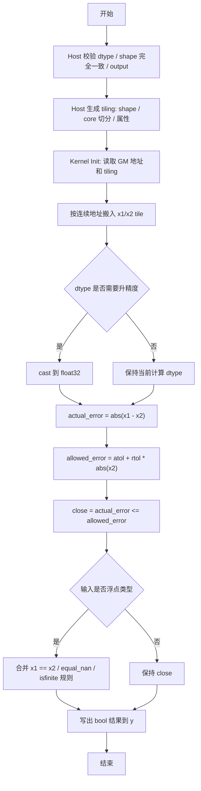

## 需求背景

### 需求来源

- 通过社区任务完成开源仓算子贡献的需求

### 背景介绍

`IsClose` 是逐元素近似相等判断算子，用于判断两个输入张量在给定容差范围内是否足够接近。算子支持广播语义，输出为布尔结果。

计算公式如下：

```text
y = abs(x1 - x2) <= atol + rtol * abs(x2)
```

当 `equal_nan=True` 时，两个输入对应位置均为 `NaN` 的场景也认为相等。

1. `is_close` 算子实现信息
   - kernel 实现：
      - `/usr/local/Ascend/ascend-toolkit/latest/opp/built-in/op_impl/ai_core/tbe/impl/ops_legacy/dynamic/is_close.py`
   - 算子原型：
      - `/usr/local/Ascend/ascend-toolkit/latest/opp/built-in/op_proto/inc/elewise_calculation_ops.h`
   - 算子信息库：
      - `/usr/local/Ascend/ascend-toolkit/latest/opp/built-in/op_impl/ai_core/tbe/config/ascend910b/aic-ascend910b-ops-info.json`

2. `is_close` 算子现状分析
   1. TBE 算子支持的数据类型和数据格式
      - 输入 `x1/x2` 支持 `float16`、`float32`、`int32`、`bfloat16`。
      - 输出 `y` 为 bool 语义，TBE 构建配置中 `bool_storage_as_1bit=False`，实际按非 1 bit 布尔存储处理。
      - 支持 `x1/x2` 广播，输出 shape 为两个输入 shape 的广播结果。
      - 动态 shape 场景通过 `classify([x1, x2], OpPatternMode.ELEWISE_WITH_BROADCAST)` 归类。

   2. TBE 算子实现描述
      1. 注册与参数校验阶段
         - 通过 `@register_operator_compute("IsClose", op_mode="dynamic", support_fusion=True)` 注册动态 shape compute。
         - 通过 `@register_operator("IsClose")` 注册算子入口。
         - 校验 `x1/x2/output_y/rtol/atol/equal_nan/kernel_name` 参数。
         - 校验输入 shape 合法，输入 dtype 属于 `float16/float32/int32/bfloat16`。
      2. 动态 shape 与广播处理阶段
         - 使用 `classify([x1, x2], OpPatternMode.ELEWISE_WITH_BROADCAST)` 对广播场景分类。
         - 使用 `shape_util.variable_shape([_x1, _x2])` 获取当前分组 shape。
         - 使用 `shape_util.broadcast_shapes(...)` 推导两个输入的对齐 shape 和输出广播 shape。
         - 若两个输入末维和广播末维均为 1，则去掉末维，减少无效计算维度。
      3. 占位符与类型转换阶段
         - 根据当前分组 shape 创建 `data_1`、`data_2` 两个 TVM placeholder。
         - 当输入 dtype 为 `float16/bfloat16/int32` 时，先将输入转换为 `float32` 后再进入 `is_close_compute`。
         - 当输入 dtype 为 `float32` 时，直接进入 `is_close_compute`。
      4. 核心计算阶段
         - 对 `x1/x2` 执行广播到 `shape_broad`。
         - 若平台不支持当前 dtype 的 `vabs`，则将输入转换为 `float16`。
         - 根据平台能力选择比较中间 dtype：优先 `float32`，若 `vsel/vcmp/vcmpsel` 不支持 `float32` 则退回 `float16`。
         - 计算 `actual_error = abs(x1 - x2)`。
         - 计算 `allowed_error = atol + rtol * abs(x2)`。
         - 普通路径返回 `actual_error <= allowed_error`。
         - `after_v200()` 且输入为浮点类型时，额外处理：
            - `x1 == x2` 的精确相等路径。
            - `equal_nan=True` 时，两个输入均为 `NaN` 的位置返回 true。
            - 使用 `Inf` 比较构造 `isfinite(actual_error)`，避免无穷差值误判。
            - 将比较结果合并后转换为 `int8` 输出。
      5. 调度与构建阶段
         - 调用 `tbe.auto_schedule(res)` 生成调度。
         - 将每组 `[dt_x1, dt_x2, res]` 加入 tensor list。
         - 使用 `{"name": kernel_name, "tensor_list": tensors, "bool_storage_as_1bit": False}` 调用 `tbe.build(...)` 完成构建。

   3. TBE 算子实现流程图

```mermaid
graph TD
    A["入口 is_close(x1, x2, output_y, rtol, atol, equal_nan, kernel_name)"] --> B["校验 kernel_name / shape / dtype"]
    B --> C["classify([x1, x2], ELEWISE_WITH_BROADCAST)"]
    C --> D["初始化 schedules / tensors"]
    D --> E{"遍历每个广播分组"}
    E -->|当前分组| F["进入 tbe.compute()"]
    F --> G["variable_shape 获取 shape_x1 / shape_x2"]
    G --> H["broadcast_shapes 推导 shape_x1 / shape_x2 / shape_broad"]
    H --> I{"shape_x1[-1]、shape_x2[-1]、shape_broad[-1] 是否均为 1"}
    I -->|是| J["若 rank > 1，则 shape_x1/shape_x2 去掉末维"]
    I -->|否| K["保留 shape_x1/shape_x2"]
    J --> L["创建 data_1 / data_2 placeholder，dtype=input_data_type"]
    K --> L
    L --> M{"input_data_type 是否 float16/bfloat16/int32"}
    M -->|是| N["dt_x1/dt_x2 cast 到 float32"]
    M -->|否 float32| O["保持 dt_x1/dt_x2 为 float32"]
    N --> P["调用 is_close_compute"]
    O --> P

    P --> Q["broadcast_shapes(input_x1.shape, input_x2.shape)"]
    Q --> R["广播 input_x1/input_x2 到 shape_broad"]
    R --> S["记录 input_dtype = input_x1.dtype"]
    S --> T{"vabs 是否支持 input_dtype"}
    T -->|否| U["input_x1/input_x2 cast 到 float16"]
    T -->|是| V["保持 input_x1/input_x2"]
    U --> W["cast_dtype 默认 float32"]
    V --> W
    W --> X{"vsel/vcmp/vcmpsel 是否均支持 float32"}
    X -->|否| Y["cast_dtype = float16"]
    X -->|是| Z["cast_dtype = float32"]
    Y --> AA["actual_error = abs(input_x1 - input_x2)"]
    Z --> AA
    AA --> AB["rtol_sca = get_attr_by_cls(rtol, cast_dtype)"]
    AB --> AC["temp = abs(input_x2 * rtol_sca)"]
    AC --> AD["atol_sca = get_attr_by_cls(atol, cast_dtype)"]
    AD --> AE["allowed_error = temp + atol_sca"]
    AE --> AF{"vcmp 是否支持 input_dtype"}
    AF -->|否| AG["actual_error/allowed_error cast 到 float16"]
    AF -->|是| AH["保持 actual_error/allowed_error"]
    AG --> AI{"after_v200 且 input_dtype 属于 float16/float32/bfloat16"}
    AH --> AI
    AI -->|否| AJ["返回 vcmp(actual_error, allowed_error, le)"]
    AI -->|是| AK["lval = cast(vcmp(input_x1, input_x2, eq), cast_dtype)"]
    AK --> AL{"equal_nan 是否为 True"}
    AL -->|是| AM["分别计算 input_x1==input_x1、input_x2==input_x2"]
    AM --> AN["两者相加后等于 0 的位置为双 NaN"]
    AN --> AO["lval += cast(双 NaN 结果, cast_dtype)"]
    AL -->|否| AP["跳过 NaN 相等处理"]
    AO --> AQ["is_less_loss = actual_error <= allowed_error"]
    AP --> AQ
    AQ --> AR["构造 positive_infs / negative_infs"]
    AR --> AS["actual_error == -inf 的位置替换为 +inf"]
    AS --> AT["isfinite_res = actual_error != +inf"]
    AT --> AU["isfinite_res 与 is_less_loss cast 到 int32 后 vand"]
    AU --> AV["data_and cast 到 cast_dtype"]
    AV --> AW["vcmpsel(lval + data_and == 0, 0, 1) 后 cast 到 int8"]
    AJ --> AX["auto_schedule(res)"]
    AW --> AX
    AX --> AY["tensors.append([dt_x1, dt_x2, res])"]
    AY --> E
    E -->|遍历完成| AZ["config = {name, tensor_list, bool_storage_as_1bit=False}"]
    AZ --> BA["tbe.build(schedules, config) 生成 CCE kernel"]
```



## 需求详细设计

### 使能方式

创建并注册 `IsClose` AscendC kernel，通过 `aclnnIsClose` 接口调用该算子。AscendC 实现仅支持 `x1/x2/y` shape 完全一致的逐元素计算，不支持广播；支持 `rtol/atol/equal_nan` 属性和输出 bool 语义。

### 需求总体设计

#### host 侧设计

1. 参数解析与校验
   - 输入：`x1`、`x2`，必选张量。
   - 输出：`y`，必选张量。
   - 属性：`rtol`，可选浮点属性，默认值 `1e-05`。
   - 属性：`atol`，可选浮点属性，默认值 `1e-08`。
   - 属性：`equal_nan`，可选 bool 属性，默认值 `False`。
   - 校验 `x1/x2/y` 非空。
   - 校验 `x1.dtype == x2.dtype`。
   - 支持 dtype：`BFLOAT16/FLOAT16/FLOAT32/INT32`。
   - 校验 `x1.shape == x2.shape == y.shape`，AscendC 实现不支持广播。
   - 输出按 bool 语义处理，落地实现中建议明确为 `BOOL` 或与训练仓既有 bool 存储约定保持一致。

2. shape 校验
   - `x1/x2/y` 的 rank 必须一致。
   - `x1/x2/y` 的每一维大小必须一致。
   - 若三者 shape 不完全一致，host 侧直接返回参数错误。
   - 空 tensor 允许进入空执行路径，不需要 workspace。

3. tiling 策略
   - `IsClose` 的主体是同 shape 双输入逐元素计算，可复用普通 elementwise tiling。
   - tiling 数据建议包含：
      - 输出元素总量。
      - `x1/x2/y` 的 rank、shape。
      - 每个 core 负责的起始元素和元素数量。
      - 每个 tile 的元素数量。
      - `rtol`、`atol`、`equal_nan`。
   - 对连续 ND 场景按线性地址切分，`x1/x2/y` 连续读取写出。
   - 空 tensor 直接走空执行路径，不需要 workspace。

4. tilingKey 规划策略
   - `tilingKey = 0`：同 shape 连续 ND 场景，`x1/x2/y` 连续读取写出。
   - `tilingKey` 可叠加 dtype 模板信息，区分 `float16/bfloat16/float32/int32` 的计算路径。

#### kernel 侧设计

1. kernel 侧实现描述
   - `Init`：读取 `x1/x2/y` GM 地址、tiling 数据和属性。
   - `Process`：按 core 和 tile 处理输出元素区间，整体流程为 `CopyIn -> Compute -> CopyOut`。
   - 按连续地址从 GM 搬入 `x1/x2`。
   - 在 UB 中完成 `abs(x1 - x2)`、`atol + rtol * abs(x2)`、比较与布尔结果生成。
   - 将结果写回 `y`。

2. dtype 计算策略
   - `float32`：直接使用 `float32` 计算误差和阈值。
   - `float16`：建议转换到 `float32` 计算后生成 bool 结果，与 TBE 中先升精度的入口行为对齐。
   - `bfloat16`：建议转换到 `float32` 计算，避免低精度误差影响容差判断。
   - `int32`：建议转换到 `float32` 计算 `abs(x1 - x2)` 和 `rtol * abs(x2)`，与 TBE 入口升精度行为对齐。

3. `NaN/Inf` 语义处理
   - 普通容差判断为 `abs(x1 - x2) <= atol + rtol * abs(x2)`。
   - 若 `x1 == x2`，结果应为 true，可覆盖 `+Inf == +Inf`、`-Inf == -Inf` 场景。
   - 若 `equal_nan=True`，且 `x1` 和 `x2` 同时为 `NaN`，结果应为 true。
   - 若 `actual_error` 为非有限值且不满足精确相等或 `equal_nan` 规则，结果应为 false。
   - `int32` 输入不涉及 `NaN/Inf`，只需要执行容差比较。

4. AscendC 实现流程图



#### AscendC 实现与 TBE 实现差异点和原因

1. TBE 使用 `classify + variable_shape + broadcast_shapes + auto_schedule` 自动处理动态 shape、广播和调度；AscendC 方案暂不支持广播，仅在 host 侧校验 `x1/x2/y` shape 完全一致，并生成分核和 tile 信息。
2. TBE 中对 `float16/bfloat16/int32` 在入口处统一转换到 `float32` 再计算；AscendC 侧应保持同样的升精度策略，以降低容差判断的精度差异。
3. TBE 在 `after_v200()` 浮点路径中对 `NaN/Inf` 做了额外处理；AscendC 侧需要显式实现精确相等、`equal_nan` 和非有限值过滤，避免仅依赖普通比较导致语义不一致。
4. TBE 输出配置为 `bool_storage_as_1bit=False`；AscendC 侧需要与训练仓 bool tensor 的实际存储规范对齐，通常按 byte 级 bool 写出。

### 支持硬件

| 产品                                    | 是否支持 |
| :-------------------------------------- | :------: |
| Atlas A2 训练系列产品/Atlas A3 系列产品 |    √     |

### 算子约束限制

| 参数名    | 类别     | 描述               | 数据类型                           | 数据格式 |
| :-------- | :------- | :----------------- | :--------------------------------- | :------- |
| x1        | 输入张量 | 第一个输入张量。   | BFLOAT16、FLOAT16、FLOAT32、INT32 | ND       |
| x2        | 输入张量 | 第二个输入张量。   | BFLOAT16、FLOAT16、FLOAT32、INT32 | ND       |
| y         | 输出张量 | 近似相等判断结果。 | BOOL                               | ND       |
| rtol      | 属性     | 相对容差。         | FLOAT                              | -        |
| atol      | 属性     | 绝对容差。         | FLOAT                              | -        |
| equal_nan | 属性     | NaN 是否视为相等。 | BOOL                               | -        |

1. `x1` 与 `x2` 的 dtype 必须一致。
2. AscendC 实现中，`x1`、`x2` 与 `y` 的 shape 必须完全一致，不支持广播。
3. 若 `x1/x2/y` 的 rank 或任一维大小不一致，host 侧应返回参数错误。
4. `rtol` 和 `atol` 建议使用非负值；若框架层允许负容差，需要与上游语义保持一致。
5. 输出为 bool 语义，底层存储方式需要与训练仓算子规范保持一致。

### 精度标准/性能标准

1. 精度不低于 TBE 实现。
2. 所有核参与计算场景下，性能不低于原 TBE 算子的 95%


