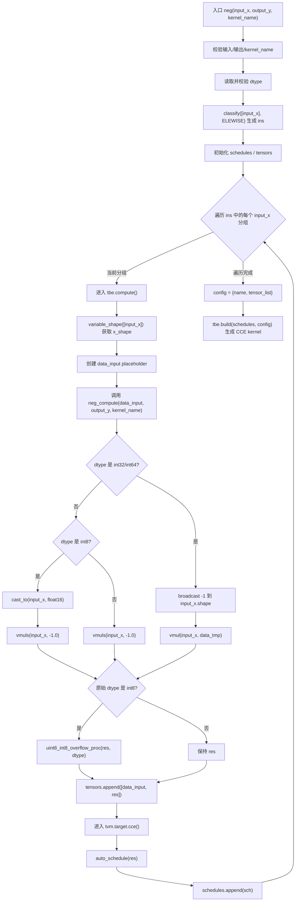
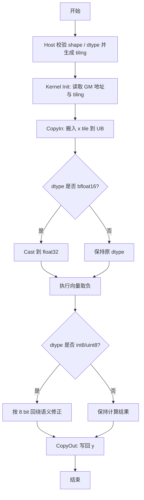

## 需求背景

### 需求来源

- 通过社区任务完成开源仓算子贡献的需求

### 背景介绍

`Neg` 是逐元素取相反数算子，对输入张量的每个元素执行如下计算：

```text
y[i] = -x[i]
```

该算子没有属性参数，输出 `shape` 与输入保持一致，输出 `dtype` 与输入保持一致。

1. `neg` 算子实现信息
   - kernel 实现：
      - `/usr/local/Ascend/ascend-toolkit/latest/opp/built-in/op_impl/ai_core/tbe/impl/ops_legacy/dynamic/neg.py`
   - 算子原型：
      - `/usr/local/Ascend/ascend-toolkit/latest/opp/built-in/op_proto/inc/elewise_calculation_ops.h`
   - 算子信息库：
      - `/usr/local/Ascend/ascend-toolkit/latest/opp/built-in/op_impl/ai_core/tbe/config/ascend910b/aic-ascend910b-ops-info.json`

2. `neg` 算子现状分析
   1. TBE 算子支持的数据类型和数据格式
      - 当前 TBE 实现支持 `bfloat16`、`float16`、`float32`、`int32`、`int8`、`int64`。
      - 本次开发需要在现有类型基础上新增 `int16`、`uint8` 输入输出支持。
      - 输出数据类型与输入保持一致，数据格式按 `ND` 逐元素语义处理。
      - 动态 shape 场景通过 `classify([input_x], OpPatternMode.ELEWISE)` 归类。

   2. TBE 算子实现描述
      1. 注册与参数校验阶段
         - 通过 `@register_operator_compute("Neg", op_mode="dynamic", support_fusion=True, support_bfp16=True)` 注册动态 shape compute。
         - 通过 `@register_operator("Neg")` 注册算子入口。
         - 校验输入、输出和 `kernel_name`，并检查 dtype 是否在支持范围内。
      2. 数据分类与占位符创建阶段
         - 按 `ELEWISE` 模式对输入做动态 shape 分类。
         - 通过 `shape_util.variable_shape([input_x])` 获取当前分组 shape。
         - 创建 `data_input` 占位符作为计算输入。
      3. 核心计算阶段
         - `int32/int64`：通过 `tbe.broadcast(-1, input_x.shape, input_x.dtype)` 生成同 shape 常量，再调用 `tbe.vmul` 实现取负。
         - `int8`：先转为 `float16`，执行 `tbe.vmuls(input_x, -1.0)` 后，再通过 `uint8_int8_overflow_proc` 按 8 bit 整数回绕语义转回 `int8`。
         - `bfloat16/float16/float32`：直接执行标量乘 `-1.0`。
      4. 调度与构建阶段
         - 调用 `tbe.auto_schedule(res)` 生成调度。
         - 调用 `tbe.build(...)` 完成编译构建。

   3. TBE 算子实现流程图



## 需求详细设计

### 使能方式

创建并注册 `Neg` AscendC kernel，通过 GE 图或 `aclnnNeg` / `aclnnInplaceNeg` 接口调用该算子。算子功能与 TBE 动态实现保持一致：输入输出 shape 一致、dtype 一致，逐元素计算相反数。

### 需求总体设计

#### host 侧设计

1. 参数解析与校验
   - 输入：`x`，必选张量。
   - 输出：`y`，必选张量。
   - 校验 `x/y` 非空。
   - 校验 `x.dtype == y.dtype`。
   - 校验 `x.shape == y.shape`。
   - AICore 路径支持 `BFLOAT16/FLOAT16/FLOAT32/INT8/UINT8/INT16/INT32/INT64`，其中 `INT16/UINT8` 为本次新增支持类型。

2. tiling 策略
   - `Neg` 是无属性、无广播的一元逐元素算子，可复用通用逐元素 tiling。
   - tiling 输入只需要元素总量、dtype size、UB 大小、AIV core 数等基础信息。
   - 按元素总量切分 core 任务，并在单 core 内按 UB 容量继续切分 tile。
   - 空 tensor 直接走空执行路径，不需要额外 workspace。

3. tilingKey 规划策略
   - `tilingKey` 用于区分调度模式和 dtype 模板。
   - 浮点类型走直接取负路径，`bfloat16` 可使用 `float32` 中间计算后转回。
   - `int8/uint8` 需要保留与 TBE 一致的低 bit 整数回绕语义。

#### kernel 侧设计

1. kernel 侧实现描述
   - 进行 `Init` 和 `Process` 两个阶段，其中 `Process` 包括搬入、计算、搬出。
   - 从 GM 搬入 `x` 到 UB。
   - 根据 dtype 选择计算路径：
      - `float16/float32/int16/int32/int64`：直接执行向量取负。
      - `bfloat16`：转换为 `float32` 取负，再转回 `bfloat16`。
      - `int8`：按有符号 8 bit 回绕语义处理，重点验证 `-128`。
      - `uint8`：按无符号 8 bit 回绕语义处理，等价于 `(-x) mod 256`。
   - 将 UB 中的结果搬出到 GM。

2. AscendC 实现流程图



#### AscendC 实现与 TBE 实现差异点和原因

1. TBE 使用 `classify + variable_shape + auto_schedule` 自动处理动态 shape；AscendC 需要在 host tiling 中显式完成元素数统计、分核和 tile 大小规划。
2. TBE 中 `int32/int64` 通过乘以 `-1` 实现；扩展 `int16` 时也应保持整数回绕语义。
3. TBE 中 `int8` 经过 `float16` 中间计算和溢出修正；扩展 `uint8` 时同样需要按 `uint8` 取模语义修正，避免饱和转换导致结果不一致。
4. `bfloat16` 建议在 AscendC 侧使用 `float32` 中间计算再转回，避免不同后端对直接 bf16 取负的支持差异。

### 支持硬件

| 产品                                    | 是否支持 |
| :-------------------------------------- | :------: |
| Atlas A2 训练系列产品/Atlas A3 系列产品 |    √     |

### 算子约束限制

| 参数名 | 类别     | 描述       | 数据类型                                                     | 数据格式 |
| :----- | :------- | :--------- | :----------------------------------------------------------- | :------- |
| x      | 输入张量 | 输入张量。 | BFLOAT16、FLOAT16、FLOAT32、INT8、UINT8、INT16、INT32、INT64 | ND       |
| y      | 输出张量 | 输出张量。 | BFLOAT16、FLOAT16、FLOAT32、INT8、UINT8、INT16、INT32、INT64 | ND       |

1. 输入和输出 dtype 必须一致。
2. 输入和输出 shape 必须一致。
3. `Neg` 没有广播语义，不需要处理多输入 shape 对齐。

### 精度标准/性能标准

1. 精度不低于 TBE 实现。
2. 性能不低于 TBE 自动调度实现。
