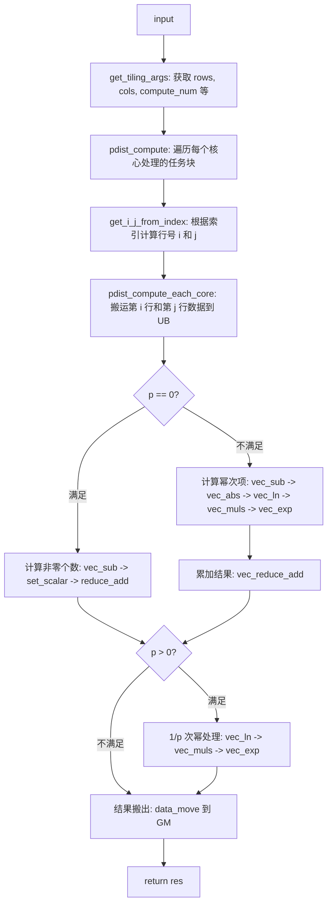
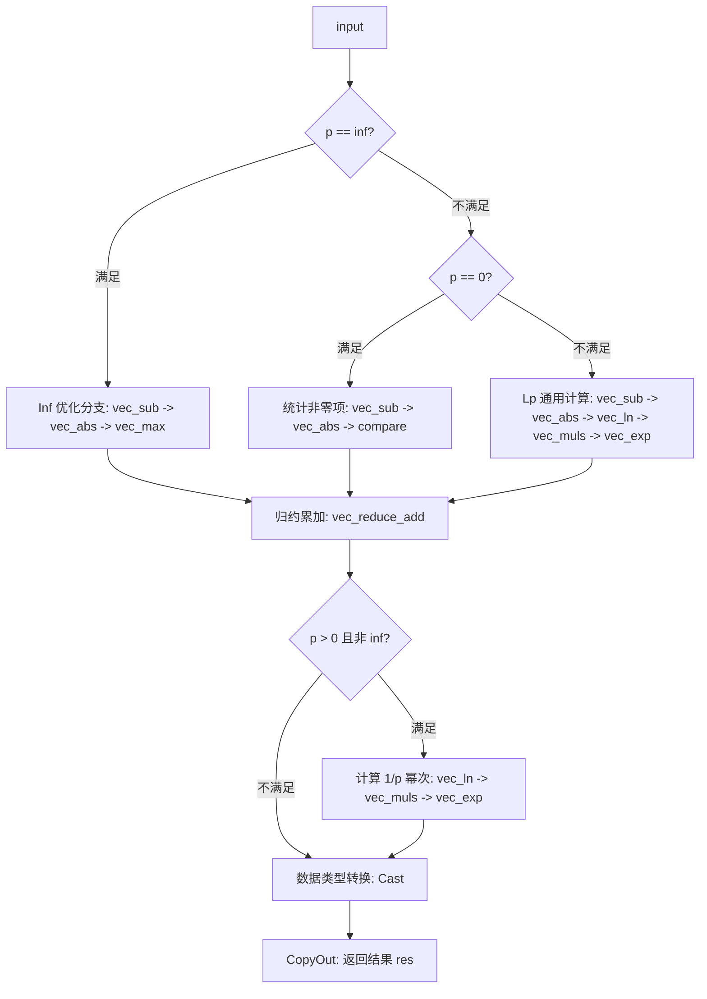

# Pdist 算子设计方案

## 1 需求背景

### 1.1 需求来源

本项目来源于昇腾算子开源仓任务，旨在基于 Ascend C 编程语言实现 `aclnnPdist` 算子，完成从 TBE 到 Ascend C 的架构优化迁移。

### 1.2 背景介绍

#### 1.2.1 Pdist 算子实现优化

基于 Pdist 算子历史 TBE 版本使用 Ascend C 编程语言进行优化。

* **Pdist 算子（TBE）实现路径**：`/usr/local/Ascend/ascend-toolkit/latest/opp/built-in/op_impl/ai_core/tbe/impl/pdist.py`。
* **相关 API 路径**：`/usr/local/Ascend/ascend-toolkit/latest/python/site-packages/tbe/dsl`。

#### 1.2.2 Pdist 算子现状分析

通过对 Pdist 算子 TBE 版本的功能分析，当前支持的能力如下：

1. **数据类型**：`input_x` 支持 `float16`、`float32` 格式的输入。
2. **计算逻辑**：计算输入矩阵中每两行向量之间的 $L_p$ 距离，数学表达式为：$y = (\sum_{k=1}^{M} |x_{i,k} - x_{j,k}|^p)^{1/p}$。
3. **实现链路**：通过输出索引映射到输入行索引 $i$ 和 $j$，依次调用 `vec_sub`、`vec_abs`、`vec_ln`、`vec_muls` 和 `vec_exp` 实现幂运算累加。

**Pdist 算子 TBE 版本整体流程图：**

---

## 2 需求分析

### 2.1 外部组件依赖

不涉及外部组件依赖 。

### 2.2 内部适配模块

适配 Aclnn 接口和图模式调用 。

### 2.3 需求模块设计

#### 2.3.1 算子原型

1. **原型设计**
| 名称 | 类别 | dtype | format | shape | 介绍 |
| :--- | :--- | :--- | :--- | :--- | :--- |
| x | 输入 | fp16/fp32 | ND | (N, M) | 输入矩阵 |
| p | 属性 | float | - | - | 范数阶数 |
| y | 输出 | fp16/fp32 | ND | (N*(N-1)/2,) | 结果向量 |
2. **相关约束**
Atlas A2 训练系列产品支持 `float16`、`float32`。

---

## 3 需求详细设计

### 3.1 使能方式

| 上层框架 | 涉及的框架勾选 |
| --- | --- |
| ATC 推理 | √ |
| Aclnn 直调 | √ |

### 3.2 需求总体设计

#### 3.2.1 host 侧设计

**tiling 策略**：

* 
**任务分配**：总输出元素为 $N(N-1)/2$，Host 侧将其视为一维向量，通过 `coreNum` 根据输入长度动态调整，确保每个核心处理的任务对数量均匀 。

* **索引映射优化**：由于计算涉及平方根操作，Host 侧将预计算行偏移等参数通过 `TilingData` 传给 Kernel，以减少 Device 侧标量开销。

1) **分核策略**：优先使用满核原则，将计算任务分配到前几个核上以保证负载均衡 。
2) **内存优化策略**：充分使用 UB 空间，开启 `double buffer` 以掩盖数据搬运与计算的开销 。

#### 3.2.2 kernel 侧设计

进行 Init 和 Process 两个阶段。

1. **计算优化**：针对 $p = \infty$ 场景，不再使用 `ln`/`exp` 模拟，改为直接调用 `vec_max` 接口，解决原 TBE 版本的溢出及精度问题。
2) **精度控制**：`float16` 输入会先 `Cast` 为 `float32` 进行高精度中间累加，最后转回原类型输出 。

**Ascend C 版本的 Pdist 算子流程：**

### 3.3 支持硬件

| 支持的芯片版本 | 涉及勾选 |
| --- | --- |
| Atlas 800I/T A2 | √ |

### 3.4 算子约束限制

不支持广播逻辑 。

---

## 4 特性交叉分析

不涉及复杂特性交叉。

---

## 5 可维可测分析

### 5.1 精度标准/性能标准

| 验收标准 | 描述 | 标准来源 |
| --- | --- | --- |
| 精度标准 | 不低于 TBE 版本，且修复 $p=\infty$ 场景精度问题 | Pdist 任务书 |
| 性能标准 | 所有核参与计算场景下，不低于 TBE 版本的 95% | Pdist 任务书 |

### 5.2 兼容性分析

新算子，不涉及兼容性分析 。