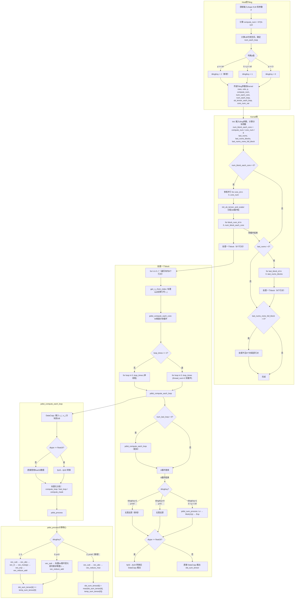

# 需求背景（required）

## 需求来源

昇腾社区任务：aclnnPdist算子Ascend C开发

## 背景介绍

### Pdist算子实现优化

基于Pdist算子历史TBE版本使用Ascend C编程语言进行优化，并修复p=inf场景存在的精度问题。

Pdist算子（TBE）实现路径和相关API路径

Pdist算子实现路径为：/usr/local/Ascend/ascend-toolkit/latest/opp/built-in/op_impl/ai_core/tbe/impl/dynamic/

Pdist算子原型路径：/usr/local/Ascend/ascend-toolkit/latest/opp/built-in/op_proto/inc/

Pdist算子信息库路径：/usr/local/Ascend/ascend-toolkit/latest/opp/built-in/op_impl/ai_core/tbe/config/ascend910b

### Pdist算子TBE实现现状分析

通过对Pdist算子TBE版本的功能分析，当前支持的能力如下：

| 参数 | 参数含义 | 数据类型 | 支持数据类型 | 约束 | 形状 |
| --- | --- | --- | --- | --- | --- |
| x | 输入tensor | tensor | float16, float32 | N>=2 | (N, M) |
| p | 距离参数 | scalar | float | p>=0 | 标量 |
| output | 输出tensor | tensor | float16, float32 | 无 | (N*(N-1)/2,) |

计算公式：$output[k] = \left( \sum_{m=0}^{M-1} |x[r][m] - x[c][m]|^p \right)^{1/p}$，其中 $k$ 为上三角索引，$r < c$ 为行对索引。

TBE版本有两个计算分支：p=0时标量逐元素判断非零后求和；p>0时统一走 Sub → Abs → Ln → Muls(p) → Exp → ReduceSum → Ln → Muls(1/p) → Exp 通用路径。p=inf时该通用路径会产生NaN，存在精度问题。

#### TBE实现流程图

```mermaid
flowchart TD
    subgraph Host侧Tiling
        H1["self.rows = input_x.get('shape')[0]<br/>self.cols = input_x.get('shape')[1]<br/>self.p = p"] --> H2["self.compute_num = int(self.rows * (self.rows - 1) / 2)<br/>self.num_each_core = self.cols"]
        H2 --> H3["self.num_each_loop = self.ub_size_bytes // 2 // 4 // 8 * 8<br/>self.ub_tensor_each_loop = self.num_each_loop"]
        H3 --> H4["tiling_gm传递Tiling参数到Kernel<br/>[rows, cols, compute_num,<br/>num_each_core, num_each_loop,<br/>ub_tensor_each_loop, core_num_var, p]"]
    end

    subgraph Kernel侧
        H4 --> K1["get_tiling_args():<br/>data_move(tiling_ub, tiling_gm, ...)<br/>rows, cols, compute_num, ... ← tiling_ub[idx]<br/><br/>num_block_each_core = compute_num // core_num_var // data_each_block<br/>last_nums = compute_num % (data_each_block * core_num_var)<br/>last_nums_blocks = last_nums // data_each_block<br/>last_nums_none_full_block = last_nums % data_each_block"]

        K1 --> A1{"if_scope(num_block_each_core > 0)"}
        A1 -->|是| A2["for_range(0, core_num_var,<br/>block_num=core_num_var) core_id:"]
        A2 --> A3["init_ub_tensor_and_scalar():<br/>src1_ub = Tensor('float32', (ub_tensor_each_loop,))<br/>src2_ub = Tensor('float32', (ub_tensor_each_loop,))<br/>work_tensor = Tensor('float32', (256,))<br/>temp_sum_tensor = Tensor('float32', (8,))<br/>dst_sum_tensor = Tensor('float32', (8,))<br/>p_reciprocal = Scalar('float32', 1.0/p)"]
        A3 --> A4["for_range(0, num_block_each_core) block_num_id:"]
        A4 --> BLK["处理一个block（data_each_block=8个行对）"]

        A1 -->|否| B1{"if_scope(last_nums > 0)"}
        A4 -->|块循环结束| B1
        B1 -->|是| B2["for_range(0, last_nums_blocks) last_block_id:"]
        B2 --> B2A["init_ub_tensor_and_scalar()"]
        B2A --> BLK2["处理一个block（8个行对）"]
        BLK2 --> B3{"if_scope(last_nums_none_full_block > 0)"}
        B1 -->|否| B3
        B3 -->|是| B3A["new_stmt_scope()<br/>init_ub_tensor_and_scalar()"]
        B3A --> BLK3["处理不足8个的尾部行对"]
        B3 -->|否| DONE[完成]
        BLK3 --> DONE
    end

    subgraph 处理一个block
        BLK --> C1["for_range(0, data_each_block) k:"]
        C1 --> C2["get_i_j_from_index(index_id, k):<br/>i_minus_half = rows_float - 0.5<br/>expr_squared = i_minus_half**2 - 2*out_index_float - 2*k<br/>scalar_sqrt(squared_sqrt, squared_sqrt)<br/>i_int = floor(i_minus_half - squared_sqrt)<br/>j_int = index_id + k - rows*i_int + i_int*(i_int+1)/2 + i_int + 1"]
        C2 --> C3["pdist_compute_each_core(i_int*num_each_core,<br/>j_int*num_each_core, k):<br/>loop_times = num_each_core // num_each_loop<br/>num_last_loop = num_each_core - num_each_loop*loop_times<br/>dst_sum_tensor[k] = 0.0"]
        C3 --> C4{"if_scope(loop_times < 2)"}
        C4 -->|是| C6["for_range(0, loop_times) loop:<br/>（单线程）"]
        C4 -->|否| C5["for_range(0, loop_times, thread_num=2) loop:<br/>（双缓冲）"]
        C5 --> C7["pdist_compute_each_loop(<br/>src_offset1 + loop*num_each_loop,<br/>src_offset2 + loop*num_each_loop,<br/>num_each_loop, k)"]
        C6 --> C7
        C7 --> C8{"if_scope(num_last_loop > 0)"}
        C8 -->|是| C9["pdist_compute_each_loop（尾块）"]
        C8 -->|否| C1K["k循环继续"]
        C9 --> C1K
        C1K -->|k循环结束| C10{"if_scope(p > 0)"}
        C10 -->|是| C11["pdist_sum_process(8, 0, 1):<br/>vec_ln(8, dst_sum_tensor, dst_sum_tensor, 1, 8, 8)<br/>vec_muls(8, dst_sum_tensor, dst_sum_tensor, p_reciprocal, 1, 8, 8)<br/>vec_exp(8, dst_sum_tensor, dst_sum_tensor, 1, 8, 8)"]
        C10 -->|否| C12["p=0 无需还原"]
        C11 --> C13{"dtype == float16?"}
        C12 --> C13
        C13 -->|是| C14["pdist_convert(dst_sum_fp16, dst_sum_tensor, 8, 'float32')<br/>data_move(output_y_gm[index], dst_sum_fp16_tensor, ...)"]
        C13 -->|否| C15["data_move(output_y_gm[index], dst_sum_tensor, ...)"]
    end

    subgraph pdist_compute_each_loop
        C7 --> D1["burst_len = ceil(move_num / data_each_block)<br/>data_move(src1_ub, input_x_gm[src_offset1], ...)<br/>data_move(src2_ub, input_x_gm[src_offset2], ...)"]
        D1 --> D2{"dtype == float16?"}
        D2 -->|是| D3["data_move(src_temp_fp16, input_x_gm[src_offset1])<br/>pdist_convert(src1_ub, src_temp_fp16, move_num, 'float16')<br/>data_move(src_temp_fp16, input_x_gm[src_offset2])<br/>pdist_convert(src2_ub, src_temp_fp16, move_num, 'float16')"]
        D2 -->|否| D4["直接使用float32数据"]
        D3 --> D5A{"compute_loop = move_num // 64 // 255<br/>if_scope(compute_loop > 0)"}
        D4 --> D5A
        D5A -->|是| D5B["for_range(0, compute_loop) index:<br/>pdist_process(64, offset, offset, 255,<br/>255*64, index_id)"]
        D5A -->|否| D5D{"last_loop = move_num % (64*255) // 64<br/>if_scope(last_loop > 0)"}
        D5B --> D5D
        D5D -->|是| D5E["pdist_process(64, offset, offset,<br/>last_loop, last_loop*64, index_id)"]
        D5D -->|否| D5F{"compute_mask = move_num % 64<br/>if_scope(compute_mask > 0)"}
        D5E --> D5F
        D5F -->|是| D5G["pdist_process(compute_mask, offset, offset,<br/>1, compute_mask, index_id)"]
        D5F -->|否| D6[返回]
        D5G --> D6
    end

    subgraph pdist_process计算核心
        D5B --> E1{"if_scope(p == 0.0)"}
        E1 -->|是| E2["vec_sub(mask, src1_ub, src1_ub, src2_ub, repeat, 8, 8, 8)<br/>for_range(0, count_num) k:<br/>  if_scope(src1_ub[k] == 0.0): src1_ub[k] = 0.0<br/>  else: src1_ub[k] = 1.0<br/>vec_reduce_add(mask, temp_sum, src1_ub, work, repeat, 8)"]
        E1 -->|否| E3["vec_sub(mask, src1_ub, src1_ub, src2_ub, repeat, 8, 8, 8)<br/>vec_abs(mask, src1_ub, src1_ub, repeat, 8, 8)<br/>vec_ln(mask, src1_ub, src1_ub, repeat, 8, 8)<br/>vec_muls(mask, src1_ub, src1_ub, p, repeat, 8, 8)<br/>vec_exp(mask, src1_ub, src1_ub, repeat, 8, 8)<br/>vec_reduce_add(mask, temp_sum, src1_ub, work, repeat, 8)"]
        E2 --> E4["scalar_sum = Scalar('float32', dst_sum_tensor[index_id])<br/>vec_adds(1, temp_sum, temp_sum, scalar_sum, 1, 8, 8)<br/>dst_sum_tensor[index_id] = temp_sum[0]"]
        E3 --> E4
    end
```



### Pdist算子功能分析

Pdist算子功能：计算输入矩阵各行之间的p范数成对距离。

输入：x（二维tensor，形状为(N, M)），p（距离参数，标量）

输出：output（一维tensor，形状为(N*(N-1)/2,)）

支持数据类型：float16、float32

支持的p值场景：
- p = 0：汉明距离（非零元素计数）
- 0 < p < inf：闵可夫斯基距离（包含p=1曼哈顿距离、p=2欧几里得距离等）
- p = inf：切比雪夫距离（取最大绝对差值）

# 需求分析（required）

## 需求描述

使用Ascend C编程语言实现Pdist算子，支持float16、float32数据类型，支持所有合法p值场景（p>=0，包括inf），并修复原TBE实现中p=inf场景的精度问题。

## 需求拆解

1. 支持float16、float32数据类型
2. 支持p=0、0<p<inf、p=inf等各种距离计算场景
3. 修复p=inf场景精度问题
4. 实现算子泛化功能，满足任意合法(N, M)形状输入
5. 性能不低于TBE版本的95%

# 详细设计（required）

## 算子分析

### 数学公式

$$
\text{dist}(i, j) =
\begin{cases}
\left( \sum_{k=0}^{M-1} |x_{ik} - x_{jk}|^p \right)^{1/p} & 0 < p < \infty \\
\sum_{k=0}^{M-1} \mathbb{1}(x_{ik} \neq x_{jk}) & p = 0 \\
\max_{k=0}^{M-1} |x_{ik} - x_{jk}| & p = \infty
\end{cases}
$$

输出为一维tensor，长度为 $N(N-1)/2$，按上三角行优先顺序排列。

### 支持数据类型

float16、float32

### 支持形状

输入：(N, M)，N >= 2，M >= 1

输出：(N*(N-1)/2,)

## 算子实现

### 实现方案

#### 3.2.1 host侧设计：

tiling策略：

严格参照TBE实现逻辑。host侧获取输入shape(N, M)和距离参数p，将输出视为一维向量（长度为N*(N-1)/2），按输出索引均分到各核心。每核每次处理8个行对（data_each_block = 32B / 4B = 8个float32），根据UB空间大小计算M维度的分块参数。

##### 1. 分核策略：

按输出索引均分到各核心（与TBE一致）：

```
compute_num = N * (N - 1) / 2
num_block_each_core = compute_num / core_num_var / data_each_block
last_nums = compute_num % (data_each_block * core_num_var)
last_nums_blocks = last_nums / data_each_block
last_nums_none_full_block = last_nums % data_each_block
```

各核心按core_id分配对应的输出索引段，尾块由前若干核心或单独核心处理。

##### 2. 数据分块和内存优化策略：

UB空间划分（与TBE一致）：

```
src1_ub             : ub_tensor_each_loop * 4B    // x[i]数据（float32）
src2_ub             : ub_tensor_each_loop * 4B    // x[j]数据（float32）
work_tensor         : 256 * 4B                    // Reduce工作空间
temp_sum_tensor     : 8 * 4B                      // 临时求和
dst_sum_tensor      : 8 * 4B                      // 8个行对累加结果
src_temp_fp16       : ub_tensor_each_loop * 2B    // fp16临时缓冲（仅fp16时分配）
dst_sum_fp16        : 8 * 2B                      // fp16输出缓冲（仅fp16时分配）
```

M维度分块：当M > ub_tensor_each_loop时，对M维度循环处理，每次处理num_each_loop个元素，M维度分块循环中使用thread_num=2做简单双缓冲（与TBE一致）。

##### 3. tilingKey规划策略：

在TBE两分支（p=0、p>0）的基础上，新增p=inf分支以修复精度问题：

| tilingKey | 条件 | 说明 |
| --- | --- | --- |
| 0 | p == 0 | 与TBE一致 |
| 1 | 0 < p < inf | 与TBE一致 |
| 2 | p == inf | 新增分支，修复精度 |

host侧根据p值设置tilingKey，传递到kernel侧走对应分支。

#### 3.2.2 kernel侧设计：

进行Init和Process两个阶段。

1. Init阶段：从tiling_gm搬入tiling参数（rows, cols, p, compute_num, num_each_core, num_each_loop, ub_tensor_each_loop, core_num_var），分配UB缓冲区，计算分块参数。float16输入额外分配fp16临时缓冲用于精度转换。

2. Process阶段包括三层循环结构（与TBE一致）：

   - 外层：遍历本核分配的行对块，每块8个行对
   - 中层：遍历块内8个行对k=0~7，对每个行对通过标量sqrt反算行号(i, j)，然后对M维度分块循环
   - 内层：CopyIn搬入x[i]和x[j]的M分块 → fp16转fp32 → 按tilingKey计算 → 累加部分和

3. 索引反算（与TBE一致）：从输出索引k反算(i, j)：$i = \lfloor (N-0.5) - \sqrt{(N-0.5)^2 - 2k} \rfloor$，$j = k - Ni + i(i+1)/2 + i + 1$，含边界修正。

4. 三个tilingKey的计算逻辑：

   - tilingKey=0（p=0，与TBE一致）：Sub → 标量逐元素判断非零置1 → ReduceSum → 累加
   - tilingKey=1（0<p<inf，与TBE一致）：Sub → Abs → Ln → Muls(p) → Exp → ReduceSum → 累加，块内8个行对完成后做最终还原 Ln → Muls(1/p) → Exp
   - tilingKey=2（p=inf，新增修复）：Sub → Abs → ReduceMax → 更新最大值，无需最终还原

5. CopyOut（与TBE一致）：块内8个行对计算完成后，若为float16则将dst_sum_tensor从fp32转回fp16，然后DataCopy搬出到GM。

#### Ascend C实现流程图



## 支持硬件

| 支持的芯片版本 | 涉及勾选 |
| --- | --- |
| Atlas A2 训练系列产品 | √ |
| Atlas A3 系列产品 | √ |

## 算子约束限制

1. 输入tensor必须为二维，形状为(N, M)，N >= 2，M >= 1
2. p值必须 >= 0（包括inf）
3. 输出tensor形状为(N*(N-1)/2,)
4. 输入输出数据类型必须一致

# 可维可测分析

## 精度标准/性能标准

| 验收标准 | 描述 | 标准来源 |
| --- | --- | --- |
| 精度标准 | 满足AscendOpTest工具默认阈值，修复p=inf场景精度问题 | 任务书要求 |
| 性能标准 | 所有核参与计算场景下，不低于TBE版本的95% | 任务书要求 |

## 兼容性分析

Ascend C实现替换原TBE版本，接口与原aclnnPdist保持一致，不涉及兼容性问题。
