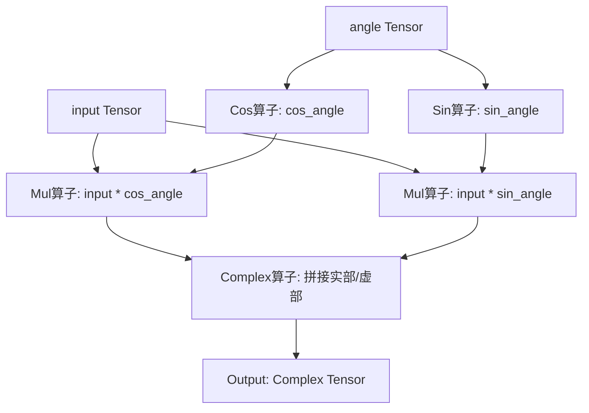
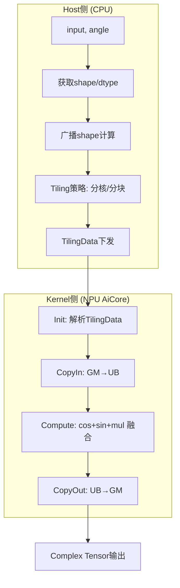
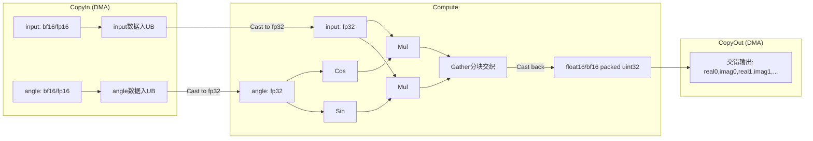

# 需求背景（required）

## 需求来源

本任务来源于昇腾CANN训练营第二季社区任务（任务序号04-5），要求基于Ascend C编程语言实现aclnnPolar算子，替代现有的TBE小算子拼接实现方案，并新增广播功能支持。

## 背景介绍

### Polar算子实现优化

基于Polar算子历史TBE版本，使用Ascend C编程语言进行重构和优化。

Polar算子（TBE）实现路径和相关API路径：

- Polar算子TBE实现路径：`/usr/local/Ascend/ascend-toolkit/latest/opp/built-in/op_impl/ai_core/tbe/impl`
- Polar算子TBE实现所在仓：https://gitcode.com/cann/ops-math/blob/master/math/complex/op_host/op_api/aclnn_polar.cpp
- 开源仓地址：https://gitcode.com/cann/ops-math

### Polar算子TBE实现现状分析

通过对Polar算子TBE版本的功能分析，当前支持的能力如下：

① 输入input（模长tensor）、angle（幅角tensor），输出为复数tensor。
② 支持float32格式输入，输出为COMPLEX64。
③ 数据格式为ND格式，支持非连续Tensor。
④ 计算逻辑通过小算子拼接实现：先对input/angle做Contiguous处理，再依次调用Sin/Cos → Mul → Complex等小算子，多个独立kernel完成计算。
⑤ 广播通过l0op框架支持，由每个小算子独立处理广播语义。

当前TBE版本存在的核心问题：

**小算子拼接导致多次kernel启动和GM↔UB搬运**：TBE将计算拆成Contiguous→Sin→Cos→Mul→Complex等独立小算子，每个kernel启动有调度开销，各kernel的输入输出必须经过GM↔UB搬运（Sin/Cos结果写回GM、Mul再从GM读入）。合计5次计算kernel启动、≥10次GM↔UB搬运，小shape场景下kernel启动延迟远超计算时间，访存带宽浪费严重。

Ascend C可以通过单kernel融合解决此问题：利用TPipe流水线和TQue数据搬运机制，CopyIn阶段将angle一次性从GM搬入UB，Compute阶段在VECCALC buffer上链式完成Cos→Sin→Mul向量计算，中间结果全部驻留UB不写回GM，最后CopyOut一次性写出。整个计算只有1次kernel启动、2次GM↔UB搬运（1次CopyIn + 1次CopyOut）。广播逻辑在单kernel内的CopyIn阶段完成，无需每个小算子独立处理。

**TBE版本整体流程如下图所示：**



### 算子功能规格

| 规格项 | 描述 |
|--------|------|
| 算子名称 | aclnnPolar |
| 数学公式 | $output = input \cdot \cos(angle) + i \cdot input \cdot \sin(angle)$ |
| 输入1 | input (Tensor)：模长（abs），支持float32 / float16 / bfloat16 |
| 输入2 | angle (Tensor)：幅角（弧度），数据类型必须与input一致 |
| 输出 | result (Complex Tensor)：fp32→COMPLEX64; fp16/bf16→COMPLEX32 |

### 算子原型

| 名称 | 类别 | dtype | format | 介绍 |
|------|------|-------|--------|------|
| input | 输入 | fp32 | ND | 极坐标模长（radius） |
| angle | 输入 | fp32 | ND | 极坐标幅角（弧度），dtype须与input一致 |
| out | 输出 | COMPLEX64 | ND | 复数tensor |

### 相关约束

相比TBE算子，Ascend C实现新增以下能力：

| 对比项 | TBE | Ascend C |
|--------|-----|----------|
| 输入dtype | float32 | float32 / float16 / bfloat16 |
| 输出dtype | complex64 | complex64 / complex32 |
| 广播 | l0op框架逐算子处理 | 单kernel内CopyIn阶段完成 |

约束限制：

- Atlas A2 训练系列产品 / Atlas A3 系列产品
- input和angle的dtype必须一致
- 最大支持8维tensor
- angle输入为弧度值，范围无限制（cos/sin周期函数）
- 支持空Tensor和非连续Tensor

---

# 需求分析（required）

## 外部组件依赖

不涉及外部组件依赖。

## 内部适配模块

适配Aclnn接口和图模式调用。

## 需求描述

使用Ascend C编程语言实现Polar算子，将cos、sin、mul融合为单个kernel完成，减少GM↔UB搬运次数和kernel启动开销；新增NumPy广播语义支持；扩展支持float16和bfloat16数据类型。

## 需求拆解

1. 实现cos + sin + mul的全融合kernel，消除TBE小算子拼接的多次kernel启动和GM搬运瓶颈
2. 广播支持迁移到Kernel侧：在host侧完成广播shape计算和stride推导，kernel侧通过重复填充或索引映射完成广播数据的加载，将TBE小算子各自处理广播的方式统一为单kernel内CopyIn阶段完成
3. 扩展数据类型：新增float16和bfloat16支持。Compute阶段先将输入Cast为fp32计算cos/sin/mul，最终结果Cast回原类型写入输出；fp32输入路径不涉及Cast
4. 性能不低于TBE参考实现的95%；精度满足AscendOpTest工具默认阈值

---

# 详细设计（required）

## 算子分析

### 数学公式

$$output_i = input_i \cdot \cos(angle_i) + i \cdot input_i \cdot \sin(angle_i)$$

### 算子特性

- **逐元素操作**：每个输出元素仅依赖对应位置的input和angle，各元素计算独立，天然适合多核并行
- **确定性计算**：不涉及Reduce/Scatter等跨元素聚合操作，计算结果确定可复现
- **计算访存比**：每个输出元素需2次三角函数计算（Cos/Sin）+ 2次乘法 = 4次浮点运算，读取2个输入（input + angle），属于计算密集型
- **无数据依赖**：输出元素间无依赖，无需跨核同步（SyncAll/SetFlag），单核内流水线可满排

### 支持数据类型

float16、float32、bfloat16

## 算子实现

### 整体架构

算子分为Host侧和Kernel侧两部分：



- **Host侧**：负责参数校验、广播shape计算、Tiling策略计算（分核/UB切分）、TilingKey确定，最终将TilingData下发到Device。
- **Kernel侧（NPU AiCore）**：遵循Ascend C标准编程范式，分为Init和Process两个阶段，Process阶段包含CopyIn（数据搬入）→ Compute（融合计算）→ CopyOut（结果搬出）三个步骤。

#### Host侧设计

**1. 广播Shape计算**

当input和angle的shape不一致时，遵循NumPy广播规则：
- 右对齐维度，缺失的输入在首部补1扩充
- 逐维度比较：各维度相等或其中之一为1，否则广播失败
- 广播shape每维度取max值

示例：input shape `[3,1,4]` + angle shape `[2,4]` → 广播shape `[3,2,4]`

**2. 分核策略**

优先使用满核的原则。若核间能均分，无大小核区分；若不能均分，余出的数据块分配到前几个核上。核数根据输入长度和UB空间动态调整。

**3. 数据分块和内存优化策略**

充分使用UB空间的原则。综合考虑不同硬件的UB大小、kernel侧计算过程中所需临时变量空间（cos/sin/mul计算fp32中间结果），确定单核内Tile块大小。批量搬运策略将连续小数据块合并为一次DMA搬运，减少搬运指令下发次数。尾块处理确保数据完整性。

tileLen 计算（所有dtype统一）：

```text
bytesPerElem = typeSize×2 + sizeof(float)×4 + outElemSize
             = (fp32: 32B, fp16/bf16: 24B)

tileLen = availUB / bytesPerElem
tileLen = tileLen / alignNum * alignNum         (32B对齐)

while tileLen >= alignNum:                      (所有dtype适用)
    usedUB = inputSize + f32BufSize + outSize
    availForTmp = ubSize - usedUB
    if tmpBufSize <= availForTmp: break
    tileLen -= alignNum
```

Gather交织scratch（固定3KB，复用Sin/Cos完成后的tmpBuf）：

```text
┌─────────────┬─────────────┬─────────────┐
│ srcConcat   │ indexU32    │ interResult │
│ 2T×4B (1KB) │ 2T×4B (1KB) │ 2T×4B (1KB) │  (T=128)
└─────────────┴─────────────┴─────────────┘
```

**UB Buffer布局（fp32，单tile N元素）：**

```text
┌──────────┬──────────┬──────────┬──────────┬──────────┬──────────┬──────────┐
│ UB_abs   │ UB_angle │ UB_sin   │ UB_cos   │ UB_imag  │ UB_out   │ UB_tmp   │
│ N×4B     │ N×4B     │ N×4B     │ N×4B     │ N×4B     │ N×8B     │ ~35KB    │
│ (VECIN)  │ (VECIN)  │(VECCALC) │(VECCALC) │(VECCALC) │ (VECOUT) │(VECCALC) │
└──────────┴──────────┴──────────┴──────────┴──────────┴──────────┴──────────┘
总计: N×32 + max(SinCosWorkspace, GatherScratch)
```

**4. TilingKey规划策略**

本算子未使用传统 TilingKey 枚举方式，而是通过 C++ 编译期模板机制 `if constexpr (std::is_same<T, float>::value)` 在编译期选择 fp32 / fp16-bf16 两条执行路径，避免运行时分支开销。广播模式通过 TilingData 中的 absBroadcast / angleBroadcast / absRepeatLen 等标志位在 CopyIn 阶段区分处理逻辑。

**5. Tiling参数传递**

广播信息通过 TilingData 传递给 kernel：

| 字段 | 类型 | 说明 |
|------|------|------|
| totalLength | uint32 | 输出总元素数 |
| tileLen | uint32 | 单tile元素数 |
| formerNum / tailNum | uint32 | 大核/小核数量 |
| formerLength / tailLength | uint32 | 大核/小核分块长度 |
| alignNum | uint32 | 对齐粒度 |
| tmpBufferSize | uint32 | Sin/Cos临时空间大小 |
| absBroadcast / angleBroadcast | uint32 | 标量广播标志 |
| absRepeatLen / angleRepeatLen | uint32 | 平铺重复长度 |
| absGroupStride / angleGroupStride | uint32 | 多维度广播步长 |
| absInnerSize / angleInnerSize | uint32 | 多维度广播内维度大小 |

#### Kernel侧设计

进行Init和Process两个阶段，其中Process包括数据搬入（CopyIn）、计算（Compute）、搬出（CopyOut）三个阶段。

- **CopyIn**：非广播场景下直接连续DMA搬运input和angle数据；广播场景下通过重复填充（RepeatPattern）或逐元素SetValue完成数据加载。
- **Compute**：全融合计算——先将input和angle统一转为fp32，调用Cos/Sin向量指令计算三角函数，再调用Mul向量指令完成逐元素乘法得到real和imag，最后将结果通过Gather分块交织写入输出缓冲区`[real0, imag0, real1, imag1, ...]`。
  - float32输入：直接使用fp32向量指令计算。
  - float16/bfloat16输入：先Cast为fp32计算（CAST_NONE），Gather交织后Cast回half（CAST_NONE）。

**fp32路径（PolarCompute）—— Gather分块交织：**

```text
CopyIn:
  广播标量: ScalarBroadcast
  平铺广播: RepeatPattern DataCopy
  常规:     Linear DataCopy

Compute:
  1. Sin(UB_sin, UB_angle, UB_tmp)
  2. PipeBarrier<PIPE_V>()
  3. Cos(UB_cos, UB_angle, UB_tmp)
  4. PipeBarrier<PIPE_V>()
  5. Mul(UB_real, UB_abs, UB_cos)
  6. Mul(UB_imag, UB_abs, UB_sin)
  7. PipeBarrier<PIPE_V>()
  8. 构建Gather index表 (BATCH_T=128, 只构建一次):
     for i = 0..127:
         index[2*i]   = i × sizeof(float)
         index[2*i+1] = (128 + i) × sizeof(float)
  9. 分块Gather交织:
     for b = 0; b < count; b += 128:
         DataCopy(src[0:128], UB_real[b:128+b])
         DataCopy(src[128:256], UB_imag[b:128+b])
         PipeBarrier<PIPE_V>()
         Gather(inter, src, index, 0, curT×2)
         PipeBarrier<PIPE_V>()
         DataCopy(UB_out[b×2], inter, curT×2)

CopyOut:
  DataCopy GM_out ← UB_out  (len×2 floats)
```

**fp16/bf16路径（PolarComputeXFp32）—— Cast + Gather + Cast：**

```text
CopyIn → Cast(abs→f32) → Cast(angle→f32) →
Compute(Cos,Sin,Mul → Gather float交织 → Cast f32→half) →
CopyOut(half packed as uint32)
```



**交织方案选型：**

| 方案 | 结果 | 原因 |
|------|------|------|
| Copy<float,true> mask | ❌ | dav_c220 mask同时作用于src和dst |
| Transpose<float> NCHW2NHWC | ✅→慢 | 占kernel 88.5% |
| vintlv / AscendC::Interleave | ❌ | dav_c310+独有，dav_c220不支持 |
| DataCopyPad MTE stride | ❌ | VECOUT读32B粒度，逐4B不可行 |
| **分块Gather** | **✅** | 向量指令，BATCH_T=128，index表2KB，11x加速 |

**AscendC实现与TBE实现的差异点及原因：**

| 差异点 | TBE | Ascend C | 原因 |
|--------|-----|----------|------|
| Kernel数量 | 5个独立小算子（Contiguous/Sin/Cos/Mul/Complex） | 1个融合kernel | 减少kernel启动开销和GM搬运次数 |
| 中间结果存储 | GM（各小算子间） | UB（片上VECCALC） | 消除GM↔UB冗余搬运 |
| 广播处理 | 每个小算子独立通过l0op框架处理 | 单kernel内CopyIn阶段统一完成 | 简化广播逻辑，减少重复计算 |
| 交织方式 | Complex小算子 | Gather分块交织 | 向量指令性能远超小算子拼接 |
| 数据类型支持 | float32→complex64 | 新增float16/bf16→complex32 | 扩展泛化能力 |

**融合优势对比：**

| 指标 | TBE小算子拼接 | Ascend C融合实现 |
|------|-------------|----------------|
| Kernel启动次数 | 5次（Sin/Cos/Mul×2/Complex） | 1次 |
| GM↔UB搬运次数 | ≥10次 | 2次（CopyIn + CopyOut） |
| 中间结果暂存 | Global Memory | Unified Buffer（片上缓存） |
| Cos/Sin复用 | 无法复用（独立kernel） | angle一次读入，cos+sin并行计算 |

## 支持硬件

| 支持的芯片版本 | 涉及勾选 |
| --- | --- |
| Atlas A2 训练系列产品 | √ |
| Atlas A3 系列产品 | √ |

## 使能方式

| 上层框架 | 涉及勾选 |
| --- | :---: |
| TF训练/推理 | |
| Pytorch训练/推理 | |
| ATC推理 | √ |
| Aclnn直调 | √ |
| OPAT调优 | |
| SGAT子图切分 | |

## 算子约束限制

- input和angle的dtype必须一致，shape需满足NumPy广播语义
- 最大支持8维tensor
- 输出为复数tensor，real和imag交替存储

## 特性交叉分析

本算子是逐元素计算，输出仅依赖对应位置的输入，不涉及跨元素聚合（Reduce/Scatter）、不涉及数据搬移（Reshape/Transpose）、不涉及量化（Quant），与现有特性无冲突。

---

# 可维可测分析

## 精度标准/性能标准

| 验收标准 | 描述 | 标准来源 |
| --- | --- | --- |
| 精度标准 | 满足AscendOpTest默认阈值：fp32→complex64（max_abs=0.0001, rate=0.0001）；fp16→complex32（max_abs=0.001, rate=0.001）；bf16→complex32（max_abs=0.004, rate=0.004） | AscendOpTest默认阈值 |
| 性能标准 | 所有核参与计算场景下，性能 ≥ TBE参考实现的95%；小shape场景（<10us）提供性能仿真分析 | 社区任务要求 |

**精度保障措施**：fp16/bf16统一转为fp32进行cos/sin/mul计算，减小累积误差；仅最终输出时转回原类型。

## 兼容性分析

aclnn接口遵循CANN标准算子接口规范，与框架无缝集成。提供与PyTorch `torch.polar` 等效功能，支持模型迁移。
