# 需求背景（required）

## 需求来源

通过 CANN 2026 社区任务（任务编号 04-5 Polar）完成开源仓算子贡献：基于 Ascend C 实现 `aclnnPolar` 算子，功能与开源仓参考实现一致，并新增广播能力，验收通过后合入 `ops-math/experimental/math`。

## 背景介绍

`torch.polar(abs, angle)` 由极坐标构造复数张量：`out = input·(cos(angle) + i·sin(angle))`，即 `out.real = input·cos(angle)`、`out.imag = input·sin(angle)`。

### Polar 算子实现优化

> **说明**：本算子**无 TBE 历史实现**（任务书原文："该算子当前暂时没有 tbe 实现，和 `aclnn_polar.cpp` 对齐即可"）。故本文档以**开源仓 l0 拼接参考实现**为对齐基准（亦为性能基线）。

参考实现路径（含文件名）：`cann/ops-math` 仓 `math/complex/op_host/op_api/aclnn_polar.cpp`；依赖 l0 API：`math/{sin,cos,mul}/op_api/*.h`、`math/complex/op_host/op_api/complex.h`（`l0op::Complex` 为已注册设备算子）。系统 `libopapi.so` 已导出 `aclnnPolar`/`aclnnPolarGetWorkspaceSize`（即对齐 aclnn 接口，确认参考文件正确）。

### Polar 参考（l0）实现现状分析

| 参数 | 参数含义 | 数据类型 | 支持数据类型 | 约束 | 形状 |
| --- | --- | --- | --- | --- | --- |
| input | 极坐标模长 abs | tensor | float32 | 与 angle 同 dtype | (N,…) ≤8维 |
| angle | 极坐标角度(弧度) | tensor | float32 | 与 input 同 dtype | (N,…) ≤8维，可与 input 广播 |
| out | 复数结果 | tensor | complex64 | dtype 恒 complex64 | broadcast(input, angle) |

计算公式：`out = input · (cos(angle) + i·sin(angle))`

参考实现为纯 host 端 l0 拼接：`Contiguous(input/angle) → Sin/Cos(angle) → Mul(angleSin,input)=虚部 / Mul(angleCos,input)=实部 → Complex(实,虚) → ViewCopy`。约束 `DTYPE_SUPPORT_LIST={DT_FLOAT}`、`OUTPUT_DTYPE={DT_COMPLEX64}`、`OP_CHECK_DTYPE_NOT_MATCH(input,angle)`、`MAX_DIM_LEN=8`、广播经 `OP_CHECK_BROADCAST_AND_INFER_SHAPE`。

### Polar 算子功能分析

- 功能：`out = input·(cos(angle)+i·sin(angle))`
- 输入：input（abs）、angle；输出：out（复数）
- 支持数据类型：input/angle = float32，out = complex64
- 支持广播：支持（input 与 angle 维度可不一致，numpy 广播规则；任务新增功能点）

# 需求分析（required）

## 需求描述

使用 Ascend C 实现 Polar 算子，支持 float32 输入、complex64 输出，**新增并原生实现广播功能**，性能不低于参考（l0）实现的 95%，精度满足 AscendOpTest 工具默认阈值。

## 需求拆解

1. fp32(input/angle) → complex64(out)，与参考功能一致
2. 原生实现 numpy 广播（input.dim 与 angle.dim 可不一致），≤8 维
3. 精度满足 AscendOpTest 默认阈值
4. 性能不低于参考 l0 实现 95%（"所有核参与场景"为核心验收）

# 详细设计（required）

## 算子分析

### 数学公式

`out.real = input · cos(angle)`，`out.imag = input · sin(angle)`

### 支持数据类型

input、angle：float32（须同 dtype）；out：complex64（与 input dtype 无关，恒 complex64）。

### 支持形状

ND，≤8 维；input 与 angle 满足 numpy 广播规则，out.shape = broadcast(input, angle)。

## 算子实现

总体思路：将参考实现的 6 个串接 l0 设备算子**融合为单个 Ascend C 算子**，一趟 UB 内完成 `Cos/Sin + Mul×2 + 复数交织`，消除中间 HBM 往返与多次 dispatch（性能提升来源）。

### 实现方案

#### 3.2.1 host 侧设计：

InferShape：numpy 广播规则推导 out shape（右对齐各轴取 max），对齐参考 `OP_CHECK_BROADCAST_AND_INFER_SHAPE`。InferDataType：out 恒置 `DT_COMPLEX64`。

tiling 策略：推导 broadcast 输出 numel；对 input、angle 分别计算其在**各输出轴**的元素 stride（广播轴或不存在轴 = 0）；判定全形 `操作数 numel == out numel ⟺ 未广播`（连续快路径标志）。传 kernel：`totalLen, tileLen, 分核参数, outRank, outDims[8], inStr[8], anStr[8], inFull, anFull, inNumel, anNumel`。

##### 1. 分核策略：
优先满核。取平台 AIV 核数；**小 case 少核**（每核至少 `MIN_PER_CORE=2048` 元素，降 launch/同步开销）；**强制偶数核**（vector core 两两绑定，奇数更差，>2 时下取偶）。big/small 均分：`per=totalLen/coreNum`，前 `rem` 个核各 `per+1`，其余 `per`（余数块分到前几核）。

##### 2. 数据分块和内存优化策略：
充分利用 UB（910B：192KB）。`BUFFER_NUM=1`；8 个 LocalMemory buffer：qAbs/qAng(各 `tileLen·4`)、qOut/bufPacked/bufOff(各 `2·tileLen·4`)、bufInFull/bufAnFull(广播操作数 numel·4，全形时 32B)、bufBC(`5·tileLen·4`，矢量化 unravel scratch)。固定部分 `≈52·tileLen` 字节，取 **`tileLen=2048`**（≈104KB，余量留广播操作数载入，满足 ≤192KB）。tile 循环 `while(done<coreLen){n=min(coreLen-done,tileLen);…}`，尾块同路径（DataCopyPad 任意字节，无碎片）。complex64 经 ReinterpretCast 视作 2N 个交织 fp32（910B vector 不支持 complex64 dtype）。

##### 3. tilingkey 规划策略：
**单 kernel 全路径**，全形/广播分支按 tiling 的 `inFull/anFull` **运行期判断**，**不设多 tilingkey**（统一 0）。原因：避免多 funcEntry 编译/维护成本，分支为轻量运行期判断无性能损失。数据检测：仅 fp32→complex64，OpDef 已限定 dtype，无 bf16 兜底需求。

#### 3.2.2 kernel 侧设计：

单 kernel，Init + Process（CopyIn/Compute/CopyOut 三段式），全程 fp32。

- **Init**：按 blockIdx 算本核区间；`BuildOffsetTable()` 纯 int32 矢量构造交织静态偏移表 `off[j]=4·(j>>1)+(j&1)·4T`（一次性，全 tile 复用）；广播操作数经 `LoadFull` 整块载入 UB。
- **CopyIn（FetchOperand 取 abs/angle）**：全形操作数 → 连续 DataCopyPad 快路径（元素序号=输出序号）；广播操作数 → **矢量化 unravel**：对 tile 内连续输出线性 idx，逐输出轴 `Muls(1/D)+Floor` 求商 + 两次 `CompareScalar+Select` 精确修正算坐标，累加偏移 → `Cast` int32 → `Gather` 从 UB 整块操作数取数。
- **Compute**：`Cos/Sin(angle)` 写 packed 实/虚部区 → 原地 `Mul` ×abs 得实部/虚部 → `Gather` 用静态偏移表交织为 `(r,i,r,i,…)`。
- **CopyOut**：`DataCopyPad` 写 complex64 输出 GM（视作 2n fp32 大块对齐）。

关键点：复数交织用 Gather + 静态偏移表（规避 strided DataCopyPad 小块 MTE 灾难、Transpose 16×16 约束）；广播 offset 全矢量化，热路径无逐元素标量。

Ascend C 的 Polar 算子流程见下图：

```mermaid
flowchart TD
    S["polar() entry: GET_TILING_DATA; TPipe; op.Init(); op.Process()"] --> I1["Init: read TilingData (dims, broadcast stride, core split)"]
    I1 --> I2["Init: compute this core output range (big/small split)"]
    I2 --> I3["Init: InitBuffer (8 UB buffers)"]
    I3 --> I4["Init: BuildOffsetTable (int32 vectorized interleave table, once)"]
    I4 --> I5{"input needs broadcast?"}
    I5 -->|"Yes"| I6["LoadFull: load whole input into UB"]
    I5 -->|"No"| I7{"angle needs broadcast?"}
    I6 --> I7
    I7 -->|"Yes"| I8["LoadFull: load whole angle into UB"]
    I7 -->|"No"| L0["Process: tile loop (ProcessTile)"]
    I8 --> L0
    L0 --> CI0["CopyIn: FetchOperand for abs / angle"]
    CI0 --> B1{"operand same shape as output?"}
    B1 -->|"Yes (fast path)"| F1["DataCopyPad contiguous load"]
    B1 -->|"No (broadcast)"| U1["CreateVecIndex: tile output linear index"]
    U1 --> U2["per output axis: Muls/Floor -> quotient"]
    U2 --> U3["CompareScalar + Select: 2x +/-1 correction -> coord"]
    U3 --> U4["offset += coord * axis stride"]
    U4 --> U5{"more axes?"}
    U5 -->|"Yes"| U2
    U5 -->|"No"| U6["Cast offset to int32 bytes; Gather from UB"]
    F1 --> CM1["Compute: Cos(angle) -> packed real region"]
    U6 --> CM1
    CM1 --> CM2["Compute: Sin(angle) -> packed imag region"]
    CM2 --> CM3["Compute: Mul real = real region * abs"]
    CM3 --> CM4["Compute: Mul imag = imag region * abs"]
    CM4 --> CM5["Compute: Gather via static offset table -> interleave (r,i,r,i)"]
    CM5 --> CO1["CopyOut: DataCopyPad write complex64 output GM"]
    CO1 --> CK{"all tiles of this core done?"}
    CK -->|"No"| L0
    CK -->|"Yes"| E["End"]
```

参考（l0）实现流程对比（差异点及原因）：

| # | 参考 l0 实现 | 本 Ascend C 实现 | 原因 |
|---|---|---|---|
| 1 | 6 个独立设备算子串接，各一次 HBM 往返+dispatch | 单 kernel 融合 | 省 5 次中间 HBM + 多 dispatch（核心场景快 1.78×） |
| 2 | `l0op::Complex` 设备算子构造复数 | Gather + 静态偏移表交织 | 910B vector 不支持 complex64；规避 strided/Transpose 约束 |
| 3 | 广播由 l0 Mul 内部处理 | host 算 broadcast stride + kernel 矢量化 unravel | 原生融合需自实现广播；全矢量避免逐元素标量 |
| 4 | Contiguous+ViewCopy 处理非连续 | 框架传连续 GM，无需 | aclnn/测试输入连续，省额外拷贝 |

## 支持硬件

| 支持的芯片版本 | 涉及勾选 |
| --- | --- |
| Atlas A2 训练系列 / Atlas 800I A2 | √ |
| Atlas A3 系列 | √ |

## 算子约束限制

- 数据类型：input、angle 仅 float32（须同 dtype）；out 仅 complex64。不支持 fp16/bf16/fp64/complex128（任务范围外，参考亦不支持）。
- 维度 ≤8；input/angle 须满足 numpy 广播规则。
- 广播操作数 numel 需可整体载入 UB（验收 shape 量级满足；超大广播待分块优化）。
- 无属性（attr）。

# 可维可测分析

## 精度标准/性能标准

| 验收标准 | 描述 | 标准来源 |
| --- | --- | --- |
| 精度标准 | 满足 AscendOpTest 默认阈值（不低于参考） | AscendOpTest（HIT1920/AscendOpTest）|
| 性能标准 | 不低于参考（l0）实现 95% | 《算子任务书》|

**精度细化与实测**：complex64 在 AscendOpTest `accuracy_config` 无内置默认 → 用例 JSON 显式配 `err_threshold=[1e-4,1e-4]`（fp32 分量默认，[绝对偏差,错误率]）；`compare_complex` 为实/虚部各自纯绝对误差判定。**官方 AscendOpTest 实跑 6 用例（同 shape 小/16M + 广播低→高/标量/双向 + 高维非对齐）全 pass**（含 16M）。

**性能实测**（vs 系统 l0 参考基线，官方 AscendOpTest msprof / 每调用设备时）：

| 场景 | l0 参考基线 | 本算子 | 结论 |
|---|---:|---:|---|
| 小 [2,6,10] | 14.25 µs | 12.52 µs | 更快 ✓ |
| **16M [4096,4096]（所有核参与）** | **1665 µs** | **937.98 µs** | **快 1.78×，核心验收达标** ✓✓ |
| 广播 [4,1,8]×[4,5,8] | 15.17 µs | 14.92 µs | 更快 ✓ |

全场景优于 l0 参考，远超 ≥95% 要求。

## 兼容性分析

新算子（昇腾仓原无 Ascend C 原生 Polar，亦无 TBE），不涉及历史版本兼容性分析。
