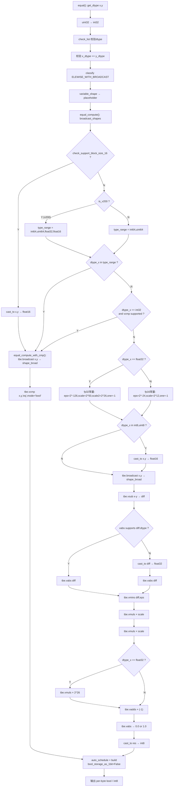
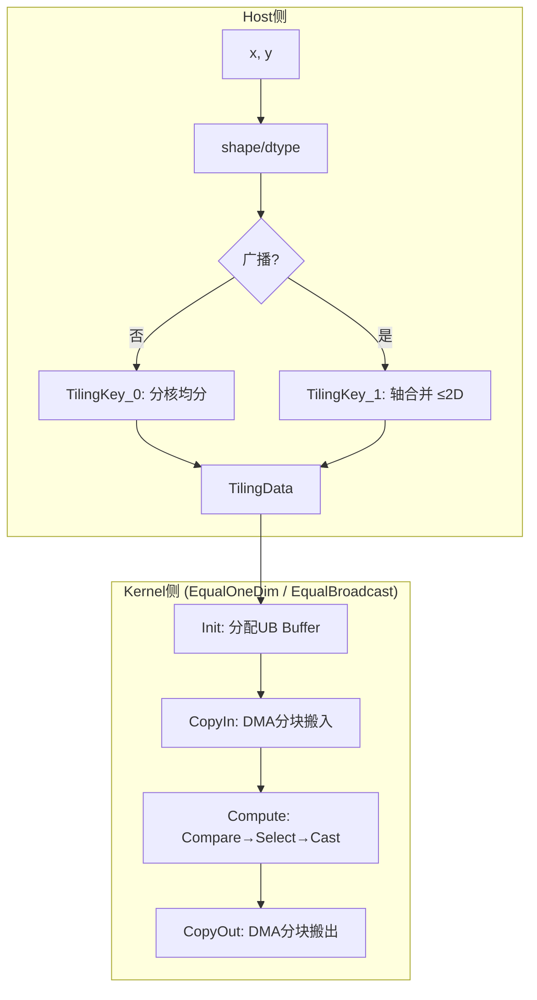

# 需求背景

## 需求来源

基于 Ascend C 编程语言实现 aclnnEqual 算子，替代现有 TBE 实现方案，改为逻辑值比较（Compare EQ），并实现算子泛化功能。

TBE 参考实现路径（任务书指定）：

| 组件 | 路径 |
|------|------|
| Kernel 实现 | `built-in/op_impl/ai_core/tbe/impl/ops_legacy/dynamic/equal.py` |
| 算子原型 | `built-in/op_proto/inc/`（`@register_operator("Equal")` 装饰器注册） |
| 算子信息库 | `built-in/op_impl/ai_core/tbe/kernel/config/ascend910b/ops_legacy/equal.json` |

**算子信息库 JSON 声明**（equal.json `binList[].inputs`）：输入 dtype 8 种——bfloat16, bool, float16, float32, int32, int64, int8, uint8。输出 dtype：bool。

**算子原型**（`@register_operator("Equal")`）：输入 REQUIRED × 2（x, y），输出 REQUIRED × 1（z）。`check_list = ["bfloat16", "float16", "float32", "int64", "uint64", "int32", "uint8", "int8"]`（**8 种，含 uint64 不含 bool**）。

## TBE 实现分析（dynamic equal.py）

按源码执行顺序绘制，覆盖全部分支路径。

### 路径汇总

| 条件 | 执行路径 | 输出 |
|------|---------|------|
| `block_size_16 = True` | cast→broadcast→vcmp | per-byte bool |
| `block_size_16 = False` + dtype ∈ type_range | broadcast→vcmp | per-byte bool |
| `block_size_16 = False` + int32 + vcmp | broadcast→vcmp | per-byte bool |
| `block_size_16 = False` + 其余dtype | 数学变换 | cast_to int8 |

**核心问题**：数学变换路径不是硬件比较指令，对 NaN 等特殊浮点值行为与 IEEE 754 `==` 不一致。Ascend C 用 `Compare(EQ)+Select` 替代，所有 dtype 统一走硬件比较。

## 算子规格

| 规格项 | 描述 |
|--------|------|
| 算子名称 | aclnnEqual |
| 数学公式 | $out_i = (x_i == y_i)$ |
| 输入 | x, y：bfloat16, float16, float32, int32, int64, int8, uint8, uint64 |
| 输出 | out：bool（逐元素 per-byte），shape = broadcast(x, y) |
| 比较方式 | 逻辑值比较（Compare EQ），与 CPU `==` 语义一致（NaN != NaN, +0 == -0） |
| 目标芯片 | Atlas A2/A3 |

| 名称 | 类别 | dtype | format |
|------|------|-------|--------|
| x | 输入 | bf16, fp16, fp32, int32, int64, int8, uint8, uint64 | ND |
| y | 输入 | 同 x | ND |
| out | 输出 | bool | ND |
| out_shape | 属性 | — | broadcast(x.shape, y.shape) |

---

# 需求分析

## 需求拆解

1. **逻辑值比较**：`Compare(EQ)` 替换 TBE 的 Cast→vcmp 链，IEEE 754 语义（NaN != NaN, +0 == -0）
2. **Packed-bit 展开**：DAV_2201 Compare API 输出 1bit/elem 的 packed-bitmask，需 Select API 展开为 per-byte bool
3. **广播支持**：Host 侧 shape 推断 + Kernel 侧 stride 映射，支持多维度（≤8 维）和双向广播
4. **8 种 dtype 全覆盖**：直接 Compare（half/float/int32）/ Cast + Compare（bf16/int8/uint8/bool）/ ReinterpretCast + Compare + PairwiseAND（int64/uint64）

---

# 详细设计

## 整体架构

---

---

# 支持硬件与使能方式

| 芯片 | 使能 |
|------|------|
| Atlas A2/A3 | √ |
| ACLNN 直调 | √ |

## 约束限制

- x/y dtype 须一致，shape 满足广播语义
- 最大 8 维 tensor
- 输出 bool，逐元素 per-byte 0/1

---

# 兼容性分析

aclnn 接口遵循 CANN 标准规范，输出逐元素 bool 张量，与 PyTorch `torch.eq()` / NumPy `numpy.equal()` 语义一致。支持 NumPy 广播语义，可直接用于模型迁移。

---

# 精度与性能标准

| 标准 | 描述 |
|------|------|
| 精度 | bool 输出，Bitwise Match（AscendOpTest 默认阈值） |
| 性能 | 全核场景 ≥ TBE 95% |
