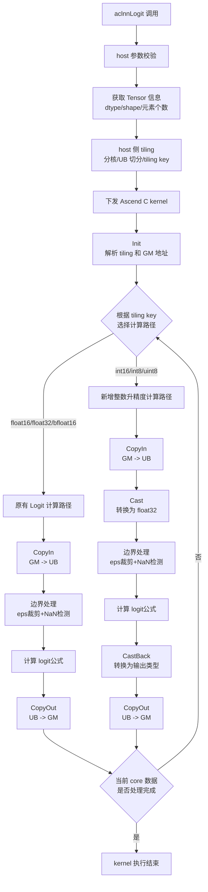

# 需求背景（required）

## 需求来源

通过社区任务完成开源仓算子贡献的需求，补充完善 Ascend C 算子库，为现有的 `aclnnLogit` 算子增加对 `DT_INT16`、`DT_INT8`、`DT_UINT8` 数据类型的支持。

## 背景介绍

### Logit 算子功能说明

Logit 算子实现概率到对数几率（log-odds）的转换，常用于概率值的反变换。

输入：`x`、`eps`

输出：`y`

计算公式如下：

$$
y_i = \ln \left( \frac{z_i}{1 - z_i} \right)
$$

其中：

$$
z_i = 
\begin{cases} 
\text{eps}, & \text{if } x_i < \text{eps} \\
x_i, & \text{if } \text{eps} \leq x_i \leq 1 - \text{eps} \\
1 - \text{eps}, & \text{if } x_i > 1 - \text{eps}
\end{cases}
$$

### Logit 算子现有实现分析

Logit 在 `ops-nn` 仓库中已有 Ascend C 实现，本次开发是在现有算子基础上补充数据类型支持，不涉及算子接口变更。

当前 Logit 支持能力如下：

| 参数 | 参数含义 | 数据类型 | 当前支持数据类型 | 约束 | 形状 |
| --- | --- | --- | --- | --- | --- |
| input | 输入张量 | Tensor | float16, float32, bfloat16 | - | 支持 0-8 维，支持空 Tensor |
| eps | epsilon 边界值 | double | double | 建议值 -1 | 标量 |
| out | 输出张量 | Tensor | float16, float32, bfloat16 | 数据类型、格式、shape 与 input 一致 | 支持 0-8 维 |

### Logit 算子新增类型分析

任务要求新增支持的数据类型为 `DT_INT16`、`DT_INT8`、`DT_UINT8`。为保证新增整数类型具备可验证的计算路径，本次设计采用整数升精度计算方案：输入搬入 UB 后先转换为 float32，完成边界处理和 ln(x/(1-x)) 计算，再转换回目标输出类型。

| 数据类型 | tiling key |
| --- | --- |
| DT_INT16 | 4 |
| DT_INT8 | 5 |
| DT_UINT8 | 6 |

# 需求分析（required）

## 需求描述

基于现有 Logit Ascend C 实现，补充 `DT_INT16`、`DT_INT8`、`DT_UINT8` 数据类型支持，使 `aclnnLogit` 能够处理新增类型的合法 Tensor 输入，并满足任务书中泛化场景、精度验证和文档交付要求。

## 需求拆解

1. 扩展算子 host 侧数据类型注册。
2. 扩展 kernel 侧新增数据类型分支。
3. 为新增整数类型实现升精度计算路径。
4. 补充测试和文档。

# 详细设计（required）

## 算子分析

### 数学公式

$$
y_i = \ln \left( \frac{z_i}{1 - z_i} \right)
$$

其中：

$$
z_i = 
\begin{cases} 
\text{eps}, & \text{if } x_i < \text{eps} \\
x_i, & \text{if } \text{eps} \leq x_i \leq 1 - \text{eps} \\
1 - \text{eps}, & \text{if } x_i > 1 - \text{eps}
\end{cases}
$$

### 支持数据类型

本次开发后，Logit 支持数据类型如下：

| 数据类型 | 支持情况 |
| --- | --- |
| float16 | 已支持 |
| float32 | 已支持 |
| bfloat16 | 已支持 |
| int16 | 本次新增 |
| int8 | 本次新增 |
| uint8 | 本次新增 |

### 支持形状

支持 Tensor 输入，每个 Tensor 支持 0-8 维，支持空 Tensor。

## 算子实现

### 实现方案

#### host 侧设计

host 侧复用现有 Logit tiling 流程，不新增独立 tiling 结构。

需要修改的内容如下：

1. 在 `logit_tiling.cpp` 中扩展输入输出支持的数据类型。
2. 在 `logit_infershape.cpp` 中扩展图原型支持的数据类型。
3. 在 binary 配置文件中补充 `int16`、`int8`、`uint8` 编译配置。

##### 1. 分核策略

优先使用满核原则。host 侧根据总元素数、32 字节 block 大小和平台可用 AIV core 数计算实际使用 core 数。

每个核最多处理 8K 元素，通过 Ping-Pong 流水实现数据搬运与计算重叠。核数计算公式：

```cpp
constexpr int64_t MAX_ELEMENT_NUM_EACH_CORE = 8 * 1024;
int64_t needCoreNum = (elementNum + MAX_ELEMENT_NUM_EACH_CORE - 1) / MAX_ELEMENT_NUM_EACH_CORE;
if (needCoreNum == 0) needCoreNum = 1;
if (needCoreNum >= coreNumPlatform) needCoreNum = coreNumPlatform;
```

##### 2. 数据分块和内存优化策略

复用 Logit 通用 UB 切分策略。UB 空间用于输入 `x`、输出 `y` 以及新增整数类型所需的中间计算缓冲。

**Ping-Pong 模式 UB 分配（总UB = 192KB）**：

每个 Ping/Pong 区域使用 96KB (MAX_UB_SIZE / 2)

| Buffer名称 | 大小(字节) | 用途 | 数量 | 总大小 |
|-----------|-----------|------|------|--------|
| x1Tensor (Ping) | 8K * dtypeSize | 输入/输出缓冲 | 1 | 8K * dtypeSize |
| x2Tensor (Ping) | 8K * 4 | float32计算缓冲 | 1 | 32KB |
| x1Tmp (Ping) | 8K * dtypeSize | 临时缓冲 | 1 | 8K * dtypeSize |
| selMaskOne (Ping) | 8K * 1 | 比较掩码1 | 1 | 8KB |
| selMaskTwo (Ping) | 8K * 1 | 比较掩码2 | 1 | 8KB |
| selMaskThree (Ping) | 8K * 1 | 比较掩码3 | 1 | 8KB |
| **单区域总计** | - | - | - | **约56KB** |
| **双区域总计(Ping+Pong)** | - | - | - | **约112KB** |

对尾块和非 32 字节对齐数据，沿用现有 Logit 尾块处理逻辑。

##### 3. tilingkey 规划策略

新增类型使用独立 tiling key，不改变原有数据类型分支。

| tiling key | 数据类型 | 说明 |
| --- | --- | --- |
| 1 | DT_FLOAT16 | 原有分支 |
| 2 | DT_FLOAT | 原有分支 |
| 3 | DT_BF16 | 原有分支 |
| 4 | DT_INT16 | 本次新增 |
| 5 | DT_INT8 | 本次新增 |
| 6 | DT_UINT8 | 本次新增 |

#### kernel 侧设计

kernel 侧整体沿用现有 Logit 单输入 Tensor 算子的处理流程，包括 Init、Process、CopyIn、Compute、CopyOut 等阶段。

原有 `float16`、`float32`、`bfloat16` 数据类型保持现有实现不变；新增 `DT_INT16`、`DT_INT8`、`DT_UINT8` 通过新增 tiling key 分支进入整数升精度计算路径。

新增整数类型的 kernel 计算流程如下：

1. 将 `x` 的输入分片从 GM 搬入 UB。
2. 将输入数据转换为 float32。
3. 如果 eps >= 0，执行边界裁剪和 NaN 处理。
4. 执行 ln(x/(1-x)) 计算。
5. 将计算结果转换回目标输出类型。
6. 将输出分片从 UB 搬回 GM。

新增类型统一使用 `float` 作为中间类型，保证计算精度。对于结果仍落在整数可表示范围内的场景，`float` 可以精确表示对应整数值。

该方案不改变算子接口，不影响原有数据类型的计算路径，仅为新增整数类型补充独立计算分支。

Ascend C 的 Logit 算子流程见下图。



#### AscendC API 调用伪代码

**CopyInAndCast**（整数类型升精度）：
```cpp
// 从GM搬运数据到UB
// 如果是 fp16/bf16/int16/int8/uint8，先搬运到临时buffer
// 然后Cast到float32进行计算
DataCopyPad(x1Tmp, inputGm[inputOffset], dataCopyParams, padParams);
Cast(x1TensorFp32, x1Tmp, RoundMode::CAST_NONE, dataCount);
```

**ComputeStepOne**（eps边界处理）：
```cpp
// 1. 检测NaN: x == x ?
Compare(selMaskThree, x1TensorFp32, x1TensorFp32, CMPMODE::EQ, tmpDataCount);

// 2. 检测 x >= eps
CompareScalar(selMaskOne, x1TensorFp32, eps, CMPMODE::GE, tmpDataCount);

// 3. 检测 x <= 1-eps
CompareScalar(selMaskTwo, x1TensorFp32, 1-eps, CMPMODE::LE, tmpDataCount);

// 4. 裁剪到 [eps, 1-eps] 区间
Select(x1TensorFp32, selMaskTwo, x1TensorFp32, 1-eps, SELMODE::VSEL_TENSOR_SCALAR_MODE, dataCount);
Select(x1TensorFp32, selMaskOne, x1TensorFp32, eps, SELMODE::VSEL_TENSOR_SCALAR_MODE, dataCount);

// 5. 处理NaN
Select(x1TensorFp32, selMaskThree, x1TensorFp32, NaN, SELMODE::VSEL_TENSOR_SCALAR_MODE, dataCount);
```

**ComputeStepTwo**（计算ln(x/(1-x))）：
```cpp
// tmp = -x
Muls(x2TensorFp32, x1TensorFp32, -1.0, dataCount);
// tmp = 1 - x
Adds(x2TensorFp32, x2TensorFp32, 1.0, dataCount);
// result = x / (1-x)
Div(x1TensorFp32, x1TensorFp32, x2TensorFp32, dataCount);
// output = ln(x / (1-x))
Ln(x1TensorFp32, x1TensorFp32, dataCount);
```

**CastAndCopyOut**（整数类型降精度）：
```cpp
// 如果是 fp16/bf16/int16/int8/uint8，降精度
if (fp16) {
    Cast(x1Tensor, x1TensorFp32, RoundMode::CAST_NONE, dataCount);
} else if (bf16 || int16 || int8 || uint8) {
    Cast(x1Tensor, x1TensorFp32, RoundMode::CAST_RINT, dataCount);
}
// 写回到GM
DataCopyPad(outputGm[outputOffset], x1Tensor, dataCopyParams);
```

## 支持硬件

| 支持的芯片版本 | 涉及勾选 |
| --- | --- |
| Atlas A2 训练系列产品 | √ |
| Atlas A3 系列产品 | √ |

## 算子约束限制

1. `input`、`out` 不能为空指针。
2. `out` 的数据类型、数据格式和 shape 与 `input` 一致。
3. Tensor 维度不超过 8 维。
4. Logit 要求输入值在 [0, 1] 区间，否则需要 eps 参数进行边界裁剪。

# 可维可测分析

## 精度标准/性能标准

| 验收标准 | 描述(不涉及说明原因) | 标准来源 |
| --- | --- | --- |
| 精度标准 | 满足 AscendOpTest 工具默认阈值 | Logit 算子开发任务书 |
| 性能标准 | 无性能要求 | Logit 算子开发任务书 |

测试覆盖：

1. 常规 Tensor logit 计算场景。
2. 多 shape 输入场景。
3. 空 Tensor 场景。
4. 非 32 字节对齐 shape 场景。
5. `int16`、`int8`、`uint8` 边界值场景（x=0, x=1, x<eps, x>1-eps, NaN）。
6. 原有数据类型回归场景。

## 兼容性分析

本任务为已有算子新增数据类型支持，不改变算子接口、输入输出数量和原有数据类型计算逻辑。
