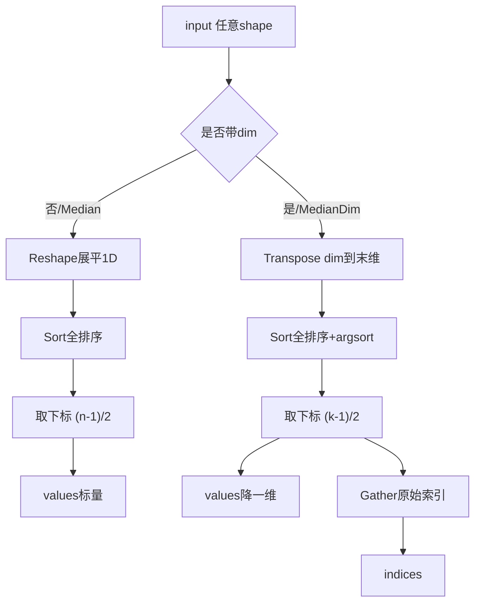
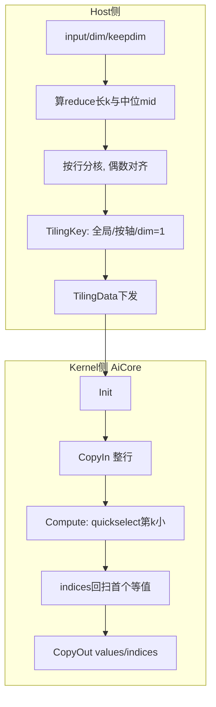

# 需求背景（required）

## 需求来源

本任务来源于昇腾CANN社区任务2026（任务序号04-9），要求参考`torch.median`功能，基于Ascend C编程语言在昇腾NPU上实现功能一致的Median算子，对齐`aclnnMedian`与`aclnnMedianDim`所有走入aicore的数据类型，替代现有小算子拼接实现，验收通过后合入昇腾算子开源仓 `ops-nn/experimental/index`。

## 背景介绍

### Median算子实现优化

基于Median算子历史小算子拼接版本，使用Ascend C编程语言进行重构和优化。

- 对标接口：`torch.median(input)` / `torch.median(input, dim, keepdim)`
- 参考实现：https://gitcode.com/cann/ops-nn/blob/master/index/gather_v2/op_api/aclnn_median.cpp
- 开源仓地址：https://gitcode.com/cann/ops-nn

### Median算子拼接版本现状分析

`torch.median`有两种调用形态，官方均通过小算子拼接实现：

① **aclnnMedian（全局中位数）**：`torch.median(input)`，将输入展平为1D后整体排序，取下中位数（n个元素排序后下标 `(n-1)/2`），返回标量。
② **aclnnMedianDim（按轴中位数）**：`torch.median(input, dim)`，沿dim轴排序，取下中位数及其原始索引，返回`(values, indices)`。需特别支持dim轴维度为1的退化场景。
③ 偶数长度取下中位数（lower median），与NumPy取均值语义不同，须严格对齐PyTorch。
④ 拼接路径：Contiguous → 转dim到末维 → Sort（全排序+argsort）→ Gather/Slice取中点与索引，多个独立kernel完成。

当前拼接版本存在的核心问题：

**全量Sort + 中间张量落盘导致访存冗余**：取中位数仅需第k小，拼接版却做O(n·log n)全排序；Sort的values/indices两份中间张量写回GM再Gather取一行，HBM往返多、kernel启动多。reduce长度小、batch多时kernel启动延迟主导，带宽浪费严重。

Ascend C可通过单kernel融合解决：CopyIn一次性把一条reduce段搬入UB，Compute用quickselect只求第k小，免全排序、中间结果驻留UB，CopyOut一次写出；indices回扫匹配首个等值下标。整体1次kernel、2次GM↔UB搬运。

**拼接版整体流程如下图所示：**

### 算子功能规格

| 规格项 | 描述 |
|--------|------|
| 算子名称 | aclnnMedian / aclnnMedianDim |
| 全局中位数 | 展平排序取下标 `(n-1)/2`，输出标量 |
| 按轴中位数 | 沿dim取下中位数，输出values与首个匹配indices |
| 输入 | input (Tensor)：支持fp16/fp32/bf16/int16/int32/int64/uint8/int8 |
| 属性 | dim (int)、keepdim (bool)（MedianDim专用） |
| 输出 | values（同input dtype）、indices（int64，仅MedianDim） |

### 算子原型

| 名称 | 类别 | dtype | format | 介绍 |
|------|------|-------|--------|------|
| input | 输入 | fp16/fp32/bf16/int系列 | ND | 任意shape |
| dim | 属性 | int | - | 归约轴，MedianDim |
| keepdim | 属性 | bool | - | 是否保留轴 |
| values | 输出 | 同input | ND | 全局标量/降一维 |
| indices | 输出 | int64 | ND | 下中位数原始下标（首个） |

### 相关约束

- Atlas A2 训练系列产品 / Atlas A3 系列产品
- 偶数长度取下中位数，与PyTorch一致；indices取首个等值
- 须支持dim轴维度=1；支持泛化各类合法shape

---

# 需求分析（required）

## 外部组件依赖

不涉及外部组件依赖。

## 内部适配模块

适配aclnnMedian/aclnnMedianDim接口及图模式调用。

## 需求描述

使用Ascend C实现Median，全局与按轴两形态，对齐torch.median下中位语义；用单kernel选第k小替代全排序+Gather拼接，降低kernel启动与GM搬运；扩展并对齐所有走aicore的数据类型。

## 需求拆解

1. 全局Median：展平选第`(n-1)/2`小，输出标量
2. 按轴MedianDim：沿dim选下中位数+首个索引，支持keepdim与dim=1
3. quickselect免全排序，bf16核内Cast fp32比较再回写
4. 精度满足AscendOpTest默认阈值；性能不劣于小算子拼接版

---

# 详细设计（required）

## 算子分析

### 数学公式

$$\text{median} = \text{sorted}(x)_{\lfloor (n-1)/2 \rfloor},\quad \text{MedianDim: } y_{...} = \text{sorted}(x_{...,\,dim})_{\lfloor (k-1)/2 \rfloor}$$

### 算子特性

- **归约/选择**：输出依赖整条reduce段，非逐元素；适合一核处理整行
- **下中位**：偶数取下标`(k-1)/2`，indices取首个等值，确定可复现
- **免全排序**：只求第k小，O(n)选择优于O(n·log n)排序
- **无跨行依赖**：行间独立，按行分核无需跨核同步

### 支持数据类型

fp16、fp32、bf16、int16、int32、int64、uint8、int8（bf16核内转fp32）

## 算子实现

### 整体架构

#### Host侧设计

1. **mid计算**：`mid=(k-1)/2`，k为全局总数或dim长度
2. **分核**：按输出行数均分，core偶数对齐；行超UB走workspace分块
3. **TilingKey**：0=全局，1=MedianDim带indices，2=dim=1直通
4. **TilingData**：totalRows/redLen/mid/tileLen/formerNum/tailNum

#### Kernel侧设计

- **CopyIn**：一次搬入整行；bf16先Cast fp32
- **Compute**：quickselect求第k小=values
- **indices**：再扫一遍取首个等值下标
- **CopyOut**：写values（+indices）

**官方拼接 vs 我方融合差异：**

| 差异点 | 拼接版 | Ascend C | 原因 |
|--------|--------|----------|------|
| 算法 | 全排序O(nlogn) | 选第k小O(n) | 中位只需k-th |
| 中间张量 | sort+argsort落GM | UB驻留 | 免HBM往返 |
| kernel | Sort+Gather多次 | 1次融合 | 减启动 |
| dim=1 | 仍排序 | 直通 | 退化优化 |

## 支持硬件

| 支持的芯片版本 | 涉及勾选 |
| --- | --- |
| Atlas A2 训练系列产品 | √ |
| Atlas A3 系列产品 | √ |

## 使能方式

| 上层框架 | 涉及勾选 |
| --- | :---: |
| Pytorch训练/推理 | √ |
| Aclnn直调 | √ |

## 算子约束限制

- dim须支持维度1；偶数取下中位；indices取首个等值；超大行经workspace

## 特性交叉分析

归约/选择算子，行间独立，不涉及广播/量化冲突。

---

# 可维可测分析

## 精度标准/性能标准

| 验收标准 | 描述 | 标准来源 |
| --- | --- | --- |
| 精度标准 | 满足AscendOpTest默认阈值；int全等，fp16/bf16 rtol≈1e-3，fp32≈1e-4 | AscendOpTest |
| 性能标准 | 不劣于aclnnMedian/MedianDim小算子拼接版 | 社区任务要求 |

## 兼容性分析

提供与PyTorch `torch.median` 等效功能，aclnn接口遵循CANN规范，新算子不涉及兼容性问题。
