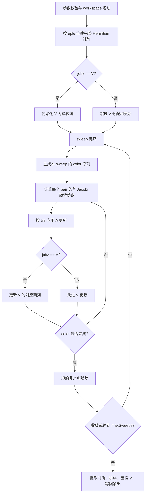

# aclsolverCheevj 算子设计文档

## 一、需求背景

### 1.1 需求来源

社区任务 `aclsolverCheevj_task_doc` 要求参考 cuSOLVER `cusolverDnCheevj` 的核心语义，在昇腾 NPU 上基于 Ascend C 实现 complex64 Hermitian 矩阵 Jacobi 特征分解算子，覆盖算子设计、开发、测试和交付验收。

参考 cuSOLVER 库中的 `cusolverDnCheevj` 接口（[https://docs.nvidia.com/cuda/cusolver/index.html#cuSOLVER-function-cheevj），在昇腾](https://link.gitcode.com/?target=https%3A%2F%2Fdocs.nvidia.com%2Fcuda%2Fcusolver%2Findex.html%23cuSOLVER-function-cheevj%EF%BC%89%EF%BC%8C%E5%9C%A8%E6%98%87%E8%85%BE&from=https%3A%2F%2Fgitcode.com%2Fcann%2Fcann-ops-competitions%2Fblob%2Fmaster%2F04_tasks%2F01_community-task-2026%2Fdocs%2F202605%2FaclsolverCheevj_task_doc.md&lang=zh&theme=white) NPU 上基于 Ascend C 编程语言实现功能一致的算子，完成算子设计、开发、测试全流程工作，验收通过后将算子提交至昇腾算子开源仓。

### 1.2 设计目标

`aclsolverCheevj` 面向单矩阵 Hermitian 标准特征分解：

$$
A V = V \operatorname{diag}(w)
$$

其中 `A` 为 complex64 Hermitian 矩阵，`w` 为 float32 特征值，`V` 为 complex64 特征向量矩阵。设计目标如下：

| 项 | 设计要求 |
| --- | --- |
| 数据类型 | 输入矩阵 complex64，特征值 float32，特征向量 complex64 |
| 矩阵性质 | Hermitian，输入只承诺 `uplo` 指定的三角有效 |
| 数据布局 | column-major，`lda >= max(1, n)` |
| 计算模式 | `jobz='N'` 仅计算特征值；`jobz='V'` 计算特征值和特征向量 |
| 三角模式 | `uplo='U'` 读取上三角；`uplo='L'` 读取下三角 |
| 算法 | cyclic Jacobi sweep，支持 tolerance 和 max sweeps 控制 |
| 输出 | 特征值升序；`jobz='V'` 时特征向量列与特征值同步排序 |
| 收敛标识 | `info=0` 成功，`info<0` 参数错误，`info>0` 未收敛 |
| 性能目标 | 功能正确性通过后，在 910B 上对齐任务书 0.8x A100 目标 |

### 1.3 设计边界

本文档只描述算子开发方案。运行资源准备、调试过程和进度盘点不进入设计正文。

允许保留的工程信息仅限于文末“建议交付结构”，用于说明建议提交哪些算子源码、测试和用户文档。

## 二、算子语义

### 2.1 输入矩阵解释

外部输入 `a` 使用 column-major 布局，矩阵元素索引为：

$$
A_{row,col} = a[row + col \cdot lda]
$$

根据 `uplo` 只读取一个三角：

| `uplo` | 输入读取规则 | 内部 Hermitian 重建规则 |
| --- | --- | --- |
| `U` | 读取 `row <= col` | `A[col,row] = conj(A[row,col])` |
| `L` | 读取 `row >= col` | `A[col,row] = conj(A[row,col])` |

对角元素按 Hermitian 约束处理，对角虚部在内部计算中置 0。

### 2.2 输出语义

| `jobz` | `w` 输出 | `a` 输出 |
| --- | --- | --- |
| `N` | 长度为 `n` 的升序特征值 | 输入矩阵不作为有效输出 |
| `V` | 长度为 `n` 的升序特征值 | column-major 特征向量矩阵，列 `k` 对应 `w[k]` |

特征值排序必须与特征向量列置换保持一致。对重复或近重复特征值，特征向量基不唯一，正确性以残差和正交性为准。

### 2.3 收敛语义

Jacobi 迭代以非对角 Frobenius 残差作为收敛判据：

$$
residual = \sqrt{\sum_{i \ne j}|A_{ij}|^2}
$$

停止条件为：

$$
residual \le tolerance \cdot \max(1, \|A_0\|_F)
$$

或达到 `maxSweeps`。当达到最大 sweep 数仍未满足收敛条件时，输出迭代所得的特征值和可选特征向量，并设置 `info > 0`。建议使用 `info = n + 1` 表示未收敛，以区别参数错误。

## 三、接口设计

### 3.1 执行接口

执行接口遵循任务书中的 `Cheevj` 参数语义，并与 `ops-solver` 已有算子一致，将 `aclsolverHandle_t` 作为首个参数传入。`handle` 由 `aclsolverCreate` 创建；其绑定的 stream 由 `aclsolverSetStream` 设置，算子在该 stream 上执行。文档中的 `complex64_t` 表示任务书 `cuComplex` 的 Ascend 侧等价表示，即两个连续 float32：

```c
void aclsolverCheevj(
    aclsolverHandle_t handle,
    const char *jobz,
    const char *uplo,
    int n,
    complex64_t *a,
    int lda,
    float *w,
    complex64_t *work,
    int lwork,
    float *rwork,
    int *info,
    const syevjInfo_t params);
```

参数含义如下：

| 参数 | 输入输出 | 约束与含义 |
| --- | --- | --- |
| `handle` | 输入 | 由 `aclsolverCreate` 创建的有效 solver handle；用于获取执行 stream 和关联运行时资源 |
| `jobz` | 输入 | 指向字符 `N` 或 `V` |
| `uplo` | 输入 | 指向字符 `U` 或 `L` |
| `n` | 输入 | 矩阵阶数，`n >= 0` |
| `a` | 输入/输出 | complex64 column-major 矩阵，长度至少为 `lda * n` |
| `lda` | 输入 | 前导维度，`lda >= max(1, n)` |
| `w` | 输出 | float32 特征值数组，长度至少为 `n` |
| `work` | 输入/输出 | complex64 工作空间 |
| `lwork` | 输入 | `work` 可用 complex64 元素个数 |
| `rwork` | 输入/输出 | float32 工作空间，用于残差、排序、旋转参数等辅助数据 |
| `info` | 输出 | 计算结果标识 |
| `params` | 输入/输出 | Jacobi 参数，包含容忍度、最大 sweep 数和可选统计字段 |

### 3.2 workspace 查询接口

为避免调用方猜测工作空间大小，建议配套提供 workspace 查询接口：

```c
void aclsolverCheevj_bufferSize(
    const char *jobz,
    int n,
    int lda,
    int *lwork,
    int *lrwork);
```

查询接口只计算 `work` 和 `rwork` 所需元素数，不执行数值计算。执行接口负责校验实际传入的 `lwork` 是否满足查询结果。

### 3.3 Jacobi 参数结构

`syevjInfo_t` 建议包含以下字段：

| 字段 | 方向 | 含义 |
| --- | --- | --- |
| `tolerance` | 输入 | 相对残差阈值；小于等于 0 时使用默认值 |
| `maxSweeps` | 输入 | 最大 sweep 数；小于等于 0 时使用默认值 |
| `sortEig` | 输入 | 是否输出升序特征值；本算子固定按升序输出 |
| `executedSweeps` | 输出 | 实际执行 sweep 数 |
| `residual` | 输出 | 停止时的残差 |

默认参数建议为 `tolerance=1e-6`、`maxSweeps=100`。性能调优阶段可基于精度测试结果调整默认值，但不能放宽任务验收所需的数值正确性。

## 四、参数校验

### 4.1 校验规则

参数检查在 host 侧完成，数值 kernel 启动前必须完成所有可判定的非法输入拦截。调用方须先通过 `aclsolverCreate` 创建 `handle`，并按需使用 `aclsolverSetStream` 绑定执行 stream；`handle` 不参与 `info` 的 LAPACK 风格参数序号编码。

| 场景 | `info` 建议值 | 处理方式 |
| --- | --- | --- |
| `handle == nullptr` | 无法启动计算 | 不启动计算；按 `ops-solver` 的 handle 管理语义返回 handle 无效状态 |
| `info == nullptr` | 无法写入 | 若上层 ABI 支持返回错误码，则返回参数错误；否则由调用约束禁止 |
| `jobz == nullptr` 或 `*jobz` 非 `N/V` | `-1` | 不启动计算 |
| `uplo == nullptr` 或 `*uplo` 非 `U/L` | `-2` | 不启动计算 |
| `n < 0` | `-3` | 不启动计算 |
| `a == nullptr && n > 0` | `-4` | 不启动计算 |
| `lda < max(1, n)` | `-5` | 不启动计算 |
| `w == nullptr && n > 0` | `-6` | 不启动计算 |
| `work == nullptr && lworkRequired > 0` | `-7` | 不启动计算 |
| `lwork < lworkRequired` | `-8` | 不启动计算 |
| `rwork == nullptr && rworkRequired > 0` | `-9` | 不启动计算 |
| `params` 中 tolerance、maxSweeps 不可解析 | `-11` | 不启动计算 |

`n == 0` 作为合法空矩阵处理，直接设置 `info=0` 并返回。`n == 1` 直接输出对角实部；`jobz='V'` 时输出单位特征向量。

### 4.2 参数归一化

计算启动前统一完成以下归一化：

1. 将 `jobz/uplo` 字符转换为内部枚举。
2. 将 `tolerance <= 0` 替换为默认容忍度。
3. 将 `maxSweeps <= 0` 替换为默认最大 sweep 数。
4. 将输入三角重建为完整 Hermitian 紧凑矩阵。
5. 将对角虚部置 0，避免输入误差破坏 Hermitian 假设。

## 五、算法选择

### 5.1 选择 Jacobi 的原因

任务要求对齐 `Cheevj` 语义，`j` 表示 Jacobi 路线。Jacobi 方法适合本算子的主要原因如下：

1. 对 Hermitian 矩阵具有稳定的正交特征向量输出，适合 `jobz='V'`。
2. 每个 sweep 可拆分为多组互不共享行列的旋转 pair，具备 device 并行空间。
3. 收敛过程可通过残差与 sweep 数控制，便于对齐 `syevjInfo_t` 参数。
4. 对 `jobz='N'` 可跳过特征向量更新，形成明确的性能快路径。

### 5.2 sweep 与 pair 调度

采用 round-robin cyclic schedule 生成 Jacobi pair：

1. 若 `n` 为偶数，每个 color 包含 `n/2` 个互不共享行列的 pair，共 `n-1` 个 color。
2. 若 `n` 为奇数，补一个虚拟索引，每个 color 中包含虚拟索引的 pair 跳过。
3. 一个 sweep 依次执行全部 color。
4. 同一 color 内的旋转参数可并行计算，矩阵更新使用 tile 化 out-of-place 方案避免写冲突。

流程如下：



### 5.3 分阶段实施计划

| 阶段 | 目标 | 通过条件 |
| --- | --- | --- |
| P1 小规模正确性 | 打通参数、布局、Hermitian 重建、Jacobi sweep、排序和 `info` 语义 | 小矩阵全 `jobz/uplo` 组合通过 Python reference 校验 |
| P2 大规模正确性 | 扩展到 `n=512/1024/2048`，完善残差规约和特征向量正交性校验 | 任务规模随机矩阵、对角矩阵、重复特征值矩阵均通过 |
| P3 性能基线 | 在功能 gate 通过后记录四组任务性能用例 | 记录 kernel 口径、端到端口径、sweep 数和残差 |
| P4 性能优化 | 面向瓶颈 kernel 优化 tile、访存、融合和 `jobz=N` 快路径 | 达到 0.8x A100 折算目标，且不回退功能正确性 |

## 六、复 Hermitian Jacobi 旋转公式

### 6.1 2x2 子问题

对 pair `(p, q)`，取 2x2 Hermitian 子矩阵：

$$
\begin{bmatrix}
a & b \\
\bar{b} & d
\end{bmatrix}
$$

其中：

$$
a = \operatorname{real}(A_{p,p}), \quad
d = \operatorname{real}(A_{q,q}), \quad
b = A_{p,q}, \quad
r = |b|
$$

若 `r <= eps`，取 `c=1`、`s=0`，该 pair 不需要旋转。否则：

$$
\tau = \frac{d-a}{2r}
$$

$$
t = \frac{\operatorname{sign}(\tau)}{|\tau| + \sqrt{1+\tau^2}}
$$

其中 `sign(0)` 取 1。再计算：

$$
c = \frac{1}{\sqrt{1+t^2}}, \quad
\phi = \frac{b}{r}, \quad
s = \phi \cdot t \cdot c
$$

对应 unitary 旋转为：

$$
G =
\begin{bmatrix}
c & s \\
-\bar{s} & c
\end{bmatrix}
$$

对矩阵执行：

$$
A' = G^H A G
$$

该旋转将 `A[p,q]` 消为 0，并保持 Hermitian 性质。

### 6.2 对角和非对角更新

对角更新可使用稳定形式：

$$
A'_{p,p} = a - t r
$$

$$
A'_{q,q} = d + t r
$$

$$
A'_{p,q} = A'_{q,p} = 0
$$

对任意 `k != p, q`，设：

$$
x = A_{k,p}, \quad y = A_{k,q}
$$

则：

$$
A'_{k,p} = c x - \bar{s} y
$$

$$
A'_{k,q} = s x + c y
$$

并显式维护：

$$
A'_{p,k} = \overline{A'_{k,p}}, \quad
A'_{q,k} = \overline{A'_{k,q}}
$$

### 6.3 特征向量更新

当 `jobz='V'` 时，特征向量矩阵按相同右乘旋转更新。对每个行索引 `k`：

$$
V'_{k,p} = c V_{k,p} - \bar{s} V_{k,q}
$$

$$
V'_{k,q} = s V_{k,p} + c V_{k,q}
$$

计算结束后，`V` 的列按特征值排序结果同步置换，保证列 `k` 与 `w[k]` 对应。

## 七、数据布局

### 7.1 外部布局

| 数据 | 布局 | 说明 |
| --- | --- | --- |
| `a` 输入 | column-major，leading dimension 为 `lda` | 只读取 `uplo` 指定三角 |
| `a` 输出 | column-major，leading dimension 为 `lda` | `jobz='V'` 时写回特征向量 |
| `w` | 连续 float32 | 长度为 `n`，升序 |
| complex64 | 连续两个 float32 | `real` 在前，`imag` 在后 |

### 7.2 内部布局

| 数据 | 布局 | 用途 |
| --- | --- | --- |
| `A0` | 紧凑 column-major，leading dimension 为 `n` | sweep 输入矩阵 |
| `A1` | 紧凑 column-major，leading dimension 为 `n` | out-of-place tile 更新输出矩阵 |
| `V` | 紧凑 column-major，leading dimension 为 `n` | `jobz='V'` 的特征向量累积 |
| `rot` | 按 pair 连续存储 | 每个 pair 的 `c` 和 complex `s` |
| `diag` | 连续 float32 | 排序前后的特征值 |
| `perm` | 连续 int32 | 特征值排序置换 |
| `residualBlocks` | 连续 float32 | 分块残差规约输出 |

内部重建完整 Hermitian 矩阵后，Jacobi sweep 不再按 `uplo` 分支。`lda > n` 的 padding 区域不参与计算，输出写回时只写 `0 <= row < n` 且 `0 <= col < n` 的有效区域。

## 八、Tiling 与内存规划

### 8.1 workspace 规划

baseline 方案采用完整矩阵工作区，先保证并行更新无写冲突，再在性能优化阶段减少双缓冲和中间写回。

| workspace | `jobz='N'` | `jobz='V'` | 元素规模 | 说明 |
| --- | --- | --- | --- | --- |
| `A0` | 必需 | 必需 | `n*n` complex64 | Hermitian 工作矩阵 |
| `A1` | 必需 | 必需 | `n*n` complex64 | out-of-place 更新缓冲 |
| `V` | 不需要 | 必需 | `n*n` complex64 | 特征向量工作矩阵 |
| `rot` | 必需 | 必需 | `ceil(n/2)` records | 单个 color 的旋转参数 |
| `diag` | 必需 | 必需 | `n` float32 | 对角提取和排序 |
| `perm` | 必需 | 必需 | `n` int32 | 特征值排序置换 |
| `residualBlocks` | 必需 | 必需 | `numBlocks` float32 | 残差规约 |

complex64 单元素为 8 bytes。以 `n=2048` 估算，单个完整 complex64 矩阵约 32 MiB；`jobz='V'` baseline 峰值主要由 `A0/A1/V` 三个矩阵组成。性能优化阶段可评估以下降内存与带宽：

1. 将部分 color 的矩阵更新由全量 out-of-place 改为 panel 级更新。
2. 将旋转参数计算与应用融合，减少 `rot` 写回。
3. 在 `jobz='N'` 下跳过 `V` 和所有向量列更新。
4. 对排序后的向量置换使用分块 copy，避免大矩阵随机访存。

### 8.2 tile 更新策略

同一 color 内的 pair 两两不共享行列，但完整矩阵元素可能同时受到行旋转和列旋转影响。为避免并行写冲突，矩阵更新按 tile 计算：

1. 将矩阵划分为 `TILE_M x TILE_N` 的二维 tile。
2. 每个 tile 根据行索引和列索引所属 pair，应用对应的 1x1、1x2、2x1 或 2x2 变换。
3. 输入从 `A0` 读取，输出写入 `A1`。
4. 一个 color 完成后交换 `A0/A1` 角色。
5. 每轮更新后显式清理对角虚部，保证 Hermitian 约束。

`TILE_M/TILE_N` 由 910B 上的片上缓冲容量、向量宽度和访存对齐约束共同决定。初始取值以稳定正确为优先，性能阶段通过 profiling 调整。

### 8.3 kernel 划分

建议 kernel 序列如下：

| kernel | 输入 | 输出 | 职责 |
| --- | --- | --- | --- |
| `InitHermitian` | `a, lda, uplo` | `A0` | 重建完整 Hermitian 矩阵 |
| `InitVectors` | `jobz` | `V` | `jobz='V'` 时初始化单位阵 |
| `BuildRotations` | `A0, pair list` | `rot` | 计算每个 pair 的 `c/s` |
| `ApplyMatrixTiles` | `A0, rot` | `A1` | tile 化应用 `A' = G^H A G` |
| `ApplyVectorColumns` | `V, rot` | `V` | 更新特征向量列 |
| `ReduceResidual` | `A0` | `residualBlocks` | 规约非对角残差 |
| `ExtractSort` | `A0` | `w, perm` | 提取对角并升序排序 |
| `PermuteVectors` | `V, perm` | `a` | `jobz='V'` 时按置换写回特征向量 |

## 九、Host / Device 分工

| 阶段 | Host 职责 | Device 职责 |
| --- | --- | --- |
| 参数入口 | 校验参数，归一化 `jobz/uplo/params` | 无 |
| workspace | 查询并切分 `work/rwork` | 使用传入 workspace |
| 初始化 | 生成 tiling 参数和调度元数据 | 重建 Hermitian 矩阵，初始化 `V` |
| sweep 控制 | 控制 sweep/color 循环，读取残差标量并判断停止 | 计算旋转、更新矩阵、更新向量、规约残差 |
| 排序输出 | 触发排序和输出写回 kernel | 提取特征值、排序、置换特征向量 |
| 返回标识 | 写入 `info`、`executedSweeps`、`residual` | 产出必要标量结果 |

性能计时需区分两类口径：

1. kernel 口径：输入和 workspace 已准备后，只统计 Cheevj device 计算序列。
2. 端到端口径：统计执行接口从入参校验到输出可用的整体耗时。

## 十、功能正确性测试计划

### 10.1 测试原则

功能正确性是性能测试和优化的前置 gate。只有目标功能场景满足 `info`、排序、特征值误差、残差和正交性要求后，才进入性能计时。

参考结果使用 Python 实现生成，优先采用 `numpy.linalg.eigh`。由于复数特征向量存在相位不唯一性，`jobz='V'` 不做逐元素硬比较，改用线性代数不变量校验。

### 10.2 功能用例矩阵

| 场景 | `n` | `jobz` | `uplo` | 重点校验 |
| --- | --- | --- | --- | --- |
| 空矩阵 | 0 | N/V | U/L | `info=0`，无越界写 |
| 一阶矩阵 | 1 | N/V | U/L | 特征值为对角实部，`V=I` |
| 小随机 Hermitian | 2/3/8/16/32 | N/V | U/L | 与 Python reference 对齐 |
| 中等随机 Hermitian | 64/128/256 | N/V | U/L | 排序、残差、正交性 |
| 任务规模 | 512/1024/2048 | N/V | U/L | 大规模正确性 gate |
| 对角矩阵 | 1/32/512 | N/V | U/L | 特征值等于对角并升序 |
| 重复特征值 | 8/64/512 | V | U/L | 残差和正交性，不比较固定基 |
| 近重复特征值 | 16/128 | V | U/L | 稳定性和收敛 |
| 尺度差异矩阵 | 16/128/512 | N/V | U/L | 残差归一化有效 |
| `lda > n` | 8/64/512 | N/V | U/L | padding 不参与计算 |
| 非法参数 | 不适用 | 不适用 | 不适用 | `info<0` 与参数序号一致 |
| 非收敛控制 | 32/128 | N/V | U/L | 小 `maxSweeps` 触发 `info>0` |

### 10.3 校验指标

| 指标 | 检查方式 | 建议阈值 |
| --- | --- | --- |
| `info` | 成功用例为 0，非法参数为负数，非收敛为正数 | 必须满足 |
| 特征值排序 | `w[i] <= w[i+1]` | `atol=1e-5` |
| 特征值误差 | 与 Python reference 比较 | `rtol=5e-3, atol=5e-3` |
| 分解残差 | `||A0 V - V diag(w)||_F / max(1, ||A0||_F)` | `<= 1e-2` |
| 正交性 | `||V^H V - I||_F / n` | `<= 1e-2` |
| `jobz='N'` 快路径 | 不写回特征向量，特征值正确 | 必须满足 |

阈值可随调优收紧，但不得为追求性能放宽到掩盖数值错误。

## 十一、性能测试与优化计划

### 11.1 功能 gate

性能测试必须在功能正确性 gate 之后执行。gate 条件如下：

1. `jobz='N'/'V'` 和 `uplo='U'/'L'` 全组合通过。
2. `n=512/1024/2048` 任务规模通过随机、对角、重复特征值和 `lda > n` 用例。
3. 所有成功用例 `info=0`，特征值升序。
4. `jobz='V'` 用例满足残差和正交性阈值。
5. 非法参数和非收敛控制用例的 `info` 行为符合接口设计。

未通过上述 gate 时，不记录性能达标结论，只记录瓶颈分析和修复计划。

### 11.2 性能目标折算

任务书要求算子整体性能与 0.8x A100 持平。折算口径如下：

$$
GFLOPS_{target} = 0.8 \times GFLOPS_{A100}
$$

若按同一工作量折算耗时，则：

$$
Time_{target} = \frac{Time_{A100}}{0.8}
$$

| N | jobz | uplo | A100 耗时(ms) | A100 GFLOPS | 910B 目标耗时上限(ms) | 910B 目标 GFLOPS 下限 |
| --- | --- | --- | --- | --- | --- | --- |
| 512 | V | U | 21.130 | 16.9 | 26.413 | 13.5 |
| 1024 | V | U | 87.717 | 32.6 | 109.646 | 26.1 |
| 2048 | V | L | 483.208 | 47.4 | 604.010 | 37.9 |
| 1024 | N | U | 8.293 | 172.6 | 10.366 | 138.1 |

### 11.3 计时与记录项

每组性能用例至少记录：

1. `n/jobz/uplo/lda/tolerance/maxSweeps`。
2. kernel 口径平均耗时、最小耗时、最大耗时。
3. 端到端口径平均耗时。
4. 实际 sweep 数、最终 residual、`info`。
5. `jobz='V'` 的残差和正交性。
6. workspace 峰值占用。
7. 各主要 kernel 耗时占比。

### 11.4 优化方向

| 优化项 | 目标 | 正确性约束 |
| --- | --- | --- |
| `jobz='N'` 快路径 | 跳过 `V` 分配、向量更新和置换 | 特征值排序与残差仍需通过 |
| tile 尺寸搜索 | 提升矩阵更新吞吐 | 不引入并行写冲突 |
| 旋转参数融合 | 减少 `rot` 写回和读取 | `c/s` 公式保持一致 |
| residual 规约优化 | 降低每 sweep 收敛判断开销 | 残差计算口径不变 |
| 特征向量列更新优化 | 降低 `jobz='V'` 带宽压力 | `V^H V` 正交性不回退 |
| 排序和置换优化 | 降低尾部 kernel 开销 | `w[k]` 与 `V[:,k]` 必须对应 |
| 双缓冲削减 | 降低内存和写带宽 | 只在证明无写冲突后采用 |

每个优化项都必须先在功能测试矩阵上回归，再进入性能对比。

## 十二、风险与应对

| 风险 | 影响 | 应对 |
| --- | --- | --- |
| Jacobi 算法复杂度高 | 大规模 `jobz='V'` 可能受矩阵更新和向量更新限制 | 采用 color 并行、tile 化更新、`jobz='N'` 快路径和 kernel profiling 分阶段优化 |
| 复 Hermitian 旋转公式实现错误 | 破坏 Hermitian 性、残差不收敛 | 以 2x2 case、随机小矩阵和 Python reference 做单元级校验 |
| 同一 color 并行写冲突 | 输出矩阵不满足数学变换 | baseline 使用 out-of-place tile 更新，优化为 in-place 前必须完成冲突证明 |
| 重复特征值导致特征向量不唯一 | 逐元素比较产生误判 | 测试以残差、正交性和子空间正确性为主 |
| 收敛阈值过松或过紧 | 过松影响精度，过紧影响性能或触发未收敛 | tolerance 默认值经功能矩阵确认，性能阶段记录 sweep 数和 residual |
| `jobz='V'` workspace 占用大 | `n=2048` 峰值内存和带宽压力较高 | 先用完整 workspace 保证正确性，再评估 panel 化、融合和双缓冲削减 |
| 特征值排序与向量置换不一致 | 输出列与特征值错配 | 排序阶段生成 `perm`，向量写回只使用同一置换 |
| 接口参数与评审期望不一致 | 影响验收调用 | 保持任务书参数语义，必要时提供字符接口 wrapper 和 workspace 查询接口 |
