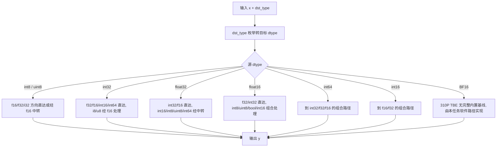
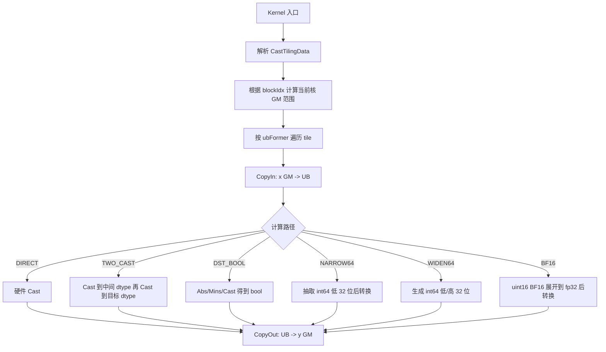

# Cast 算子设计文档

## 1. 需求来源

### 1.1 任务算子

本设计文档对应社区任务 `20260529-4` 中的 `Cast` 算子。目标是在 Atlas 300V Pro（`ascend310p`，dav_m200）上基于 Ascend C 实现与内置 TBE `Cast` 核心语义一致的算子，并在任务书要求范围内新增 **BF16 输入** 支持。

`Cast` 为逐元素类型转换算子：

```text
y[i] = cast<dst_type>(x[i])
```

输入输出 shape 一致，不涉及广播、归约或跨元素依赖。

### 1.2 TBE 源码获取路径

TBE 参考实现来自 CANN 内置算子包：

```text
opp/built-in/op_impl/ai_core/tbe/impl/ops_legacy/cast.py
opp/built-in/op_impl/ai_core/tbe/impl/ops_legacy/dynamic/cast.py
python/site-packages/tbe/dsl/compute/util.py
```

其中 `dynamic/cast.py` 负责动态 shape 下的 dtype 分发和 TBE 计算图构建，`util.py` 中的 `cast_to` 支持表用于确认 `ascend310p` 上可作为内置 TBE 基线的转换链路。

### 1.3 仓内参考文件

仓内 `ops-math/math/cast` 可作为功能语义参考，但其配置面向 `ascend950`，kernel 使用 arch35/regbase MicroAPI，不可直接作为 dav_m200 交付实现。本任务的交付实现位于：

```text
ops-transformer/experimental/math/cast/
```

## 2. 背景介绍

`Cast` 是模型前后处理、混合精度训练/推理和算子间 dtype 适配的基础算子。Atlas 300V Pro 上内置 `aclnnCast` 对 BF16 输入会在 L2 dtype 校验阶段拒绝，因此本任务需要补齐 310P 上的 Ascend C 实现并支持 BF16 输入。

本设计关注以下目标：

1. 与任务书列出的 TBE Cast 数据类型、shape 和边界语义对齐。
2. 在 dav_m200 向量指令能力范围内设计可审计的直达、两段转换、bool、int64 和 BF16 软件路径。
3. 对 BF16 输入采用明确的软件展开策略，并单独说明性能风险。
4. Host tiling、kernel 分支和测试矩阵保持同一组 dtype/path 分类，便于评审和复现。

## 3. TBE 算子支持范围

### 3.1 数据类型和格式

| 参数 | 输入/输出/属性 | dtype | format |
| --- | --- | --- | --- |
| `x` | 输入 | BOOL / FLOAT16 / FLOAT / INT8 / UINT8 / INT16 / INT32 / INT64 / BF16 | ND |
| `dst_type` | 属性 | 目标 dtype 枚举 | - |
| `y` | 输出 | BOOL / FLOAT16 / FLOAT / INT8 / UINT8 / INT16 / INT32 / INT64 | ND |

任务书要求 BF16 作为输入新增支持，输出 dtype 不包含 BF16，因此本设计不注册“任意类型转 BF16”路径。

### 3.2 交付 dtype 对

| 源 dtype | 目标 dtype |
| --- | --- |
| FLOAT16 | FLOAT32、INT32、INT8、UINT8、INT16、BOOL |
| FLOAT32 | FLOAT16、INT32、INT16、INT8、UINT8、BOOL、INT64 |
| INT32 | FLOAT32、FLOAT16、INT16、INT8、UINT8、BOOL、INT64 |
| INT8 | FLOAT16、FLOAT32、INT32、UINT8 |
| UINT8 | FLOAT16、FLOAT32、INT32、INT8 |
| INT16 | FLOAT16、FLOAT32 |
| BOOL | FLOAT16、FLOAT32、INT32、UINT8 |
| INT64 | INT32、FLOAT32、FLOAT16 |
| BF16 | FLOAT32、FLOAT16、INT32、INT8、UINT8、BOOL、INT16、INT64 |

### 3.3 Shape 约束

| 项 | 约束 |
| --- | --- |
| 维度 | ND，支持动态 shape |
| shape 关系 | `y.shape == x.shape` |
| 广播 | 不支持 |
| 非连续 Tensor | 由 aclnn/op_api 层处理为连续访问，kernel 侧按连续 GM buffer 设计 |

## 4. TBE 算子实现描述

TBE `Cast` 的核心逻辑是按源 dtype 和目标 dtype 选择直达 `cast_to` 或中转链路。结合 `ascend310p` 支持表，310P 可闭环的主流程如下：



需要特别区分：TBE 源码中存在部分 BF16 或 v220 分支，但 `ascend310p` 的 `cast_to` 支持表没有 BF16 直达转换闭环，也不支持 `float16/bfloat16 -> int64` 的 v220 条件路径。因此这些分支不能写作 310P 内置 TBE 可用基线；本任务 BF16 输入能力属于新增软件路径。

## 5. dav_m200 硬件能力前提

设计基于 dav_m200 Ascend C 能力约束，不依赖 910B/950 专属低阶能力。

| 能力类别 | 结论 | 对设计的影响 |
| --- | --- | --- |
| 硬件 vconv 直达 | 支持 f16/f32/i32/i16/i8/u8/bool 中的部分组合 | 普通路径优先使用 `AscendC::Cast` |
| BF16 vconv | dav_m200 无 BF16 原生转换能力 | BF16 输入需要按 `uint16_t` 位模式展开为 FP32 |
| 64 bit 整数转换 | 多数 int64 相关 vconv 不直达 | 采用低 32 位抽取或符号扩展的软件路径 |
| ShiftLeft/ShiftRight | dav_m200 不支持 | BF16 展开不能依赖 16 位左移向量指令 |
| DataCopyPad | GM 与 UB 双向不支持 | CopyIn/CopyOut 必须使用 32B 对齐的数据块设计 |
| 可用组合能力 | GatherMask、Duplicate、Muls/Adds、And/Or、Transpose、SetValue/GetValue 等 | 用于 bool、int64、BF16 等软件路径 |

## 6. 外部组件依赖

| 组件 | 用途 |
| --- | --- |
| CANN 算子开发基础设施 | op_host、op_kernel、op_api 构建与注册 |
| aclnn 两段式接口 | 对外 API，负责 workspace 查询和 kernel 执行 |
| Ascend C `kernel_operator.h` | dav_m200 kernel 开发接口 |
| AscendOpTest | 精度与性能自验证工具 |

## 7. Ascend C 算子原型

| 参数名 | 输入/输出/属性 | 描述 | 使用说明 | 数据类型 | 数据格式 | 维度(shape) | 非连续 Tensor |
| --- | --- | --- | --- | --- | --- | --- | --- |
| self | 输入 | 待进行 Cast 计算的 Tensor | shape 需要与 out 一致；执行后原 Tensor 内存不覆盖 | BOOL、FLOAT16、FLOAT、INT8、UINT8、INT16、INT32、INT64、BFLOAT16 | ND | 0-8 | 支持 |
| dtype | 属性 | 目标数据类型枚举 | 与 out 数据类型保持一致 | INT | - | - | - |
| out | 输出 | Cast 计算结果 Tensor | shape 需要与 self 一致；输出 dtype 由 dtype 指定 | BOOL、FLOAT16、FLOAT、INT8、UINT8、INT16、INT32、INT64 | ND | 0-8 | 支持 |

`dtype` 为目标 dtype 枚举。第一段接口完成参数合法性校验、tiling 生成和 kernel launch 准备；第二段接口按 executor 下发 kernel。Kernel 侧由编译期 dtype 宏注入输入输出类型，通过编译期分支选择具体计算路径，运行期 tiling 只描述分核、UB 切分和尾块信息。

## 8. Ascend C 算子相关约束

| 约束项 | 说明 |
| --- | --- |
| 浮点转整型 NaN | NaN 转 0，对齐 TBE/硬件 vconv 行为 |
| 8bit 整型输出 | `int8` 饱和到 `[-128, 127]`，`uint8` 饱和到 `[0, 255]` |
| `int32 -> int8` | 任务书约束范围 `(-2048, 1920)` 内保证精度无误差 |
| `float32 -> int64/uint8` | 按任务书和 TBE 约束，仅在可表示范围内保证无误差 |
| `int64 -> float32` | `[-2147483648, 2147483647]` 范围内保证精度无误差 |
| BF16 输入 | 先按 BF16 数值语义展开为 FP32，再进入目标 dtype 转换链 |
| 空 Tensor | 第一段接口可短路，不下发无意义 kernel |
| 输出 BF16 | 不属于任务书交付范围 |

## 9. 使用方式

```cpp
uint64_t workspaceSize = 0;
aclOpExecutor *executor = nullptr;

aclError ret = aclnnCastGetWorkspaceSize(x, dstType, y, &workspaceSize, &executor);
if (ret != ACL_SUCCESS) {
    return ret;
}

void *workspace = nullptr;
if (workspaceSize > 0) {
    aclrtMalloc(&workspace, workspaceSize, ACL_MEM_MALLOC_HUGE_FIRST);
}

ret = aclnnCast(workspace, workspaceSize, executor, stream);
aclrtSynchronizeStream(stream);
```

## 10. Host 侧设计

### 10.1 参数检查

Host 侧完成以下检查：

1. `x`、`y`、shape 指针和 executor 指针非空。
2. `x.dtype` 与 `dst_type` 落在支持矩阵内。
3. `y.dtype` 与 `dst_type` 一致。
4. `y.shape == x.shape`。
5. 空 Tensor 直接返回成功，不申请私有 workspace。

### 10.2 分核策略

Cast 是纯逐元素带宽型算子，按元素总数切分：

```text
shapeSize   = x.numel()
coreNum     = min(platformCoreNum, ceil(shapeSize * inputBytes / 4096))
blockFormer = ceil(shapeSize / coreNum) 向上按 256 元素对齐
blockNum    = ceil(shapeSize / blockFormer)
blockTail   = shapeSize - (blockNum - 1) * blockFormer
```

小 shape 减少参与核数，避免过度启动开销；大 shape 使用最多 8 个 AI Core 提升带宽。

### 10.3 UB 切分策略

由于 dav_m200 不支持 GM/UB `DataCopyPad`，统一使用 32B 对齐的 CopyIn/CopyOut 块。UB 元素数按输入、输出和中间 buffer 预算计算：

```text
BUFFER_NUM    = 2
UB_ELEM_ALIGN = 256
bytesPerElem  = BUFFER_NUM * (inputBytes + outputBytes) + middleBytes
ubFormer      = floor((ubSize - reserveBytes) / bytesPerElem) 向下按 256 元素对齐
```

`middleBytes` 由计算路径决定：直达路径为 0，两段转换和 bool 路径需要 f16 中间 buffer，BF16 和 int64 软件路径需要更大的中间 buffer。

### 10.4 tilingKey 规划

| tilingKey | 路径类别 | 覆盖范围 | 说明 |
| --- | --- | --- | --- |
| `0` | DIRECT | dav_m200 vconv 可直达的 dtype 对 | 一跳 `AscendC::Cast` |
| `1` | TWO_CAST | 需要 f16/f32 中转的普通 dtype 对 | 两段 `Cast` 串接，中间加 `PipeBarrier` |
| `2` | DST_BOOL | 目标 dtype 为 bool | 按 `ceil(min(abs(x), 1))` 语义实现 |
| `3` | NARROW64 | `int64 -> int32/float32/float16` | 低 32 位 lane 抽取后进入普通转换链 |
| `4` | WIDEN64 | `int32/float32/BF16 -> int64` | 低 32 位写入并做符号扩展 |
| `5` | BF16_TO_F32 | `BF16 -> FLOAT` | BF16 高 16 位展开为 FP32 bit layout |
| `6` | BF16_TO_OTHER | `BF16 ->` 其它非 BF16 输出 | 先展开到 FP32，再接目标 dtype 路径 |

## 11. Kernel 侧设计

### 11.1 总体流程



### 11.2 关键路径说明

| 路径 | 实现要点 |
| --- | --- |
| DIRECT | 使用 `AscendC::Cast`，浮点到整型按 TBE 对应 round mode，溢出按 Memory Cast 饱和语义处理 |
| TWO_CAST | 对硬件不支持的一跳组合使用 f16 或 f32 中转，避免手写逐元素标量转换 |
| DST_BOOL | 非零转 true，零转 false；对浮点、整型均按绝对值和 1 的最小值归一化后取整 |
| NARROW64 | 将 `int64` 视作 32 位 lane，抽取低 32 位后再进入普通路径 |
| WIDEN64 | 先得到 32 位整数结果，再根据符号生成高 32 位 |
| BF16_TO_F32 | 将每个 BF16 halfword 放入 FP32 高 16 位，低 16 位补零，保留 NaN/Inf 比特语义 |
| BF16_TO_OTHER | BF16 展开为 FP32 后复用已有 FP32 到目标 dtype 转换链 |

### 11.3 同步与队列

kernel 使用 `TQue` 管理输入输出双缓冲：

```text
CopyIn -> Compute -> CopyOut
```

多段向量指令之间用 `PipeBarrier<PIPE_V>` 保证依赖顺序。各核处理不重叠 GM 区间，除普通写回外无跨核同步需求。

## 12. 测试标准

### 12.1 精度测试

精度测试使用 AscendOpTest 默认阈值，覆盖：

1. 所有交付 dtype 对。
2. 标量、小 shape、非 32B 对齐尾块、大 shape、多维 shape。
3. NaN、Inf、零、负数、饱和边界、`int64` 边界和 BF16 特殊值。
4. `int32 -> int8`、`int64 -> float32` 等任务书明确约束范围。

BF16 golden 需先按 BF16 输入量化，再执行目标 dtype 转换，避免将 FP32 原值直接作为 BF16 输入参考。

### 12.2 性能测试

性能口径按任务书执行：

| 类别 | 对标口径 |
| --- | --- |
| 非 BF16 输入 | 与现有 TBE Cast 同 shape、同 dtype 对比，性能不低于 95% |
| BF16 输入 | 与 FP32 输入转相同目标 dtype、相同 shape 对比，性能达到 90% 以上 |
| 小 shape | 10us 以下场景如差异超过 3us，提供仿真图和瓶颈分析 |

### 12.3 模型接入验证

按任务书接入 InternVL，数据集为 `flickr30k_entities`，与指定基线平台对比 train loss 差异不超过 0.1。

## 13. 风险与评审确认项

| 风险项 | 说明 | 处理方式 |
| --- | --- | --- |
| BF16 性能 | dav_m200 无 BF16 原生 vconv，BF16 输入必须先做 halfword 到 FP32 的软件展开，性能与 FP32 直达路径存在天然差异 | 单独提供同场性能数据和瓶颈分析；如无法满足 90% 规则，需任务评审确认例外或提供可用 BF16 primitive |
| int64 软件路径 | dav_m200 缺少多数组合的 int64 直达转换 | 明确支持范围和数值约束，测试覆盖边界 |
| DataCopy 对齐 | 无 `DataCopyPad`，尾块处理必须避免越界读写 | Host tiling 和 kernel CopyIn/CopyOut 统一 32B 对齐设计 |

本文件描述设计方案和测试口径。最终通过情况以绑定代码提交、安装包、原始日志、性能 CSV 和模型验证报告的自验证材料为准。
