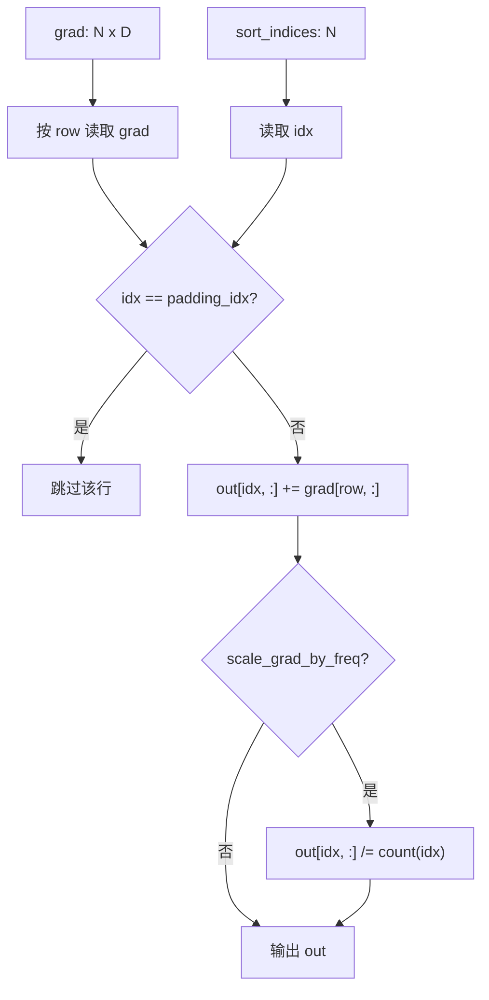
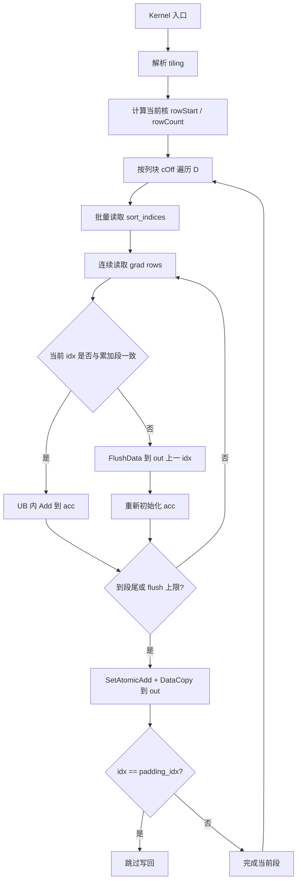
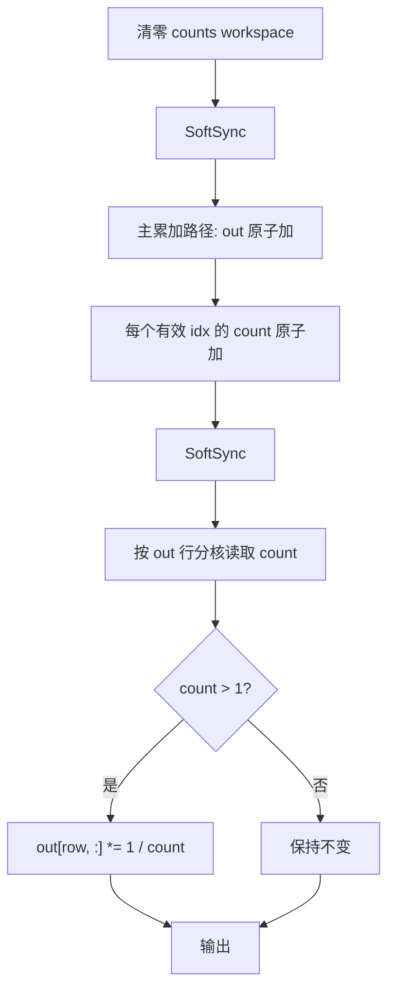

# EmbeddingDenseGrad 算子设计文档

## 1. 需求来源

### 1.1 任务算子

本设计文档对应社区任务 `20260529-4` 中的 `EmbeddingDenseGrad` 算子。目标是在 Atlas 300V Pro（`ascend310p`，dav_m200）上基于 Ascend C 实现 Embedding 反向计算，与参考算子核心语义保持一致。

算子语义为：将 `grad` 中每一行按 `sort_indices` 指定的权重行累加到输出 `out`，支持 padding 行清零和可选频次缩放。

```text
out = zeros([num_weights, D])
counts = zeros([num_weights])
for k in range(N):
    idx = sort_indices[k]
    if idx != padding_idx:
        out[idx, :] += grad[k, :]
        counts[idx] += 1

if scale_grad_by_freq:
    for idx in range(num_weights):
        if counts[idx] > 1:
            out[idx, :] /= counts[idx]
```

其中 `grad` 合轴后视为 `[N, D]`，输出 `out` 为 `[num_weights, D]`。

### 1.2 参考实现路径

任务书参考 `ops-nn` 中的 `embedding_dense_grad_v2`：

```text
ops-nn/index/embedding_dense_grad_v2/
```

该参考实现主要作为功能语义参考。其 README 中不覆盖 Atlas 300V Pro 交付形态，因此本任务在 `experimental/index/embedding_dense_grad/` 下新增 310P Ascend C 实现。

### 1.3 交付目录

```text
ops-nn/experimental/index/embedding_dense_grad/
```

## 2. 背景介绍

Embedding 层前向会按 token id 从权重表中取行。反向阶段需要把每个 token 对应的梯度累加回权重梯度表。如果同一个 id 在一个 batch 中出现多次，多行 `grad` 需要累加到同一个 `out[idx]`。`EmbeddingDenseGrad` 就是这一 dense 输出形式的反向累加算子。

本任务输入已经提供排序后的 `sort_indices`，相同 index 的行在逻辑上连续，这使 kernel 可以在 UB 内做段内累加，再通过 GM 原子加处理跨核边界冲突。

## 3. 支持范围

### 3.1 数据类型和格式

| 参数 | 输入/输出/属性 | dtype | format |
| --- | --- | --- | --- |
| `grad` | 输入 | FLOAT | ND |
| `sort_indices` | 输入 | INT32 | ND |
| `out` | 输出 | FLOAT | ND |
| `num_weights` | 属性 | Int | - |
| `padding_idx` | 可选属性，默认 `-1` | Int | - |
| `scale_grad_by_freq` | 可选属性，默认 `false` | Bool | - |

### 3.2 Shape 约束

| 参数 | 约束 |
| --- | --- |
| `grad` | ND，合轴成二维 `[N, D]` |
| `sort_indices` | 元素个数等于 `N` |
| `out` | `[num_weights, D]` |
| `num_weights` | 大于 0，且任务书高精度/高性能范围内不超过 INT32_MAX |
| `padding_idx` | `< 0` 表示不清零；`0 <= padding_idx < num_weights` 表示对应行保持 0 |

### 3.3 计算语义



## 4. dav_m200 硬件能力前提

| 能力类别 | 结论 | 对设计的影响 |
| --- | --- | --- |
| `SetAtomicAdd<float>` | dav_m200 支持 fp32 GM 原子加 | 跨核同一 index 可正确累加 |
| DataCopyPad | GM/UB 双向不支持 | 主路径要求 `D` 按 32B 对齐，非对齐走功能兜底 |
| 硬件 `SyncAll()` | dav_m200 不支持裸硬同步 | `scale_grad_by_freq` 使用 GM workspace 软同步 |
| fp32 向量加法 | 支持 | 段内多行 grad 可在 UB 中累加 |
| 标量 GetValue/SetValue | 支持 | 非对齐 fallback 用于功能正确性兜底 |

## 5. 外部组件依赖

| 组件 | 用途 |
| --- | --- |
| CANN 算子开发基础设施 | op_host、op_kernel、op_api 构建与注册 |
| aclnn 两段式接口 | 对外 API，负责 workspace 查询和 kernel 执行 |
| Ascend C `kernel_operator.h` | dav_m200 kernel 开发接口 |
| AscendOpTest | 精度与性能自验证工具 |

## 6. Ascend C 算子原型

| 参数名 | 输入/输出/属性 | 描述 | 使用说明 | 数据类型 | 数据格式 | 维度(shape) | 非连续 Tensor |
| --- | --- | --- | --- | --- | --- | --- | --- |
| grad | 输入 | 表示数据的原始梯度 Tensor | 合轴后按 `[N, D]` 处理；第一维与 sort_indices 元素数一致 | FLOAT | ND | 1-8 | 支持 |
| sort_indices | 输入 | 表示 grad 输入对应的索引 Tensor | 合轴后元素数为 N；相同 index 连续时走高性能段内累加路径 | INT32 | ND | 1-8 | 支持 |
| numWeights | 属性 | 输出 Tensor 首轴大小 | out shape 为 `[numWeights, D]` | INT | - | - | - |
| padding_idx | 属性 | 指定需要清零的 padding 行 | 小于 0 时不启用 padding 跳过；默认值为 -1 | INT | - | - | - |
| scale_grad_by_freq | 属性 | 是否按词频缩放梯度 | true 时功能支持但不保证高性能；默认值为 false | BOOL | - | - | - |
| out | 输出 | 梯度求和结果 Tensor | shape 为 `[numWeights, D]`；输出在累加前按 InitValue(0) 语义清零 | FLOAT | ND | 2-8 | 支持 |

kernel 使用 `KernelMode::MIX_MODE`，避免在 dav_m200 上因派发模式不匹配导致 kernel 未实际执行。

## 7. Ascend C 算子相关约束

| 约束项 | 说明 |
| --- | --- |
| `grad` dtype | 仅 FLOAT |
| `sort_indices` dtype | 仅 INT32 |
| 输出初始化 | `out` 由框架或 kernel 入口按 `InitValue(0)` 语义清零后累加 |
| `sort_indices` 排序 | 相同 index 连续，便于段内 UB 累加 |
| `D` 对齐 | `D % 8 == 0`（fp32 32B 对齐）走高性能主路径 |
| 非对齐 `D` | 走单核标量 fallback，保证功能，不作为高性能路径 |
| `scale_grad_by_freq` | 需要 counts workspace 和软同步，功能支持但性能不作为主路径口径 |
| 超大 shape | `N` 或 `num_weights` 超过任务书限制时，不保证高精度/高性能 |

## 8. 使用方式

```cpp
uint64_t workspaceSize = 0;
aclOpExecutor *executor = nullptr;

aclError ret = aclnnEmbeddingDenseGradGetWorkspaceSize(
    grad, sortIndices, numWeights, paddingIdx, scaleGradByFreq,
    out, &workspaceSize, &executor);
if (ret != ACL_SUCCESS) {
    return ret;
}

void *workspace = nullptr;
if (workspaceSize > 0) {
    aclrtMalloc(&workspace, workspaceSize, ACL_MEM_MALLOC_HUGE_FIRST);
}

ret = aclnnEmbeddingDenseGrad(workspace, workspaceSize, executor, stream);
aclrtSynchronizeStream(stream);
```

## 9. Host 侧设计

### 9.1 参数检查

Host 侧完成以下检查：

1. `grad`、`sort_indices`、`out`、shape 指针和 executor 指针非空。
2. `grad.dtype == FLOAT`，`sort_indices.dtype == INT32`，`out.dtype == FLOAT`。
3. `num_weights > 0`。
4. `sort_indices.numel == grad` 合轴后的第一维 `N`。
5. `out.shape == [num_weights, D]`。
6. `padding_idx < num_weights`；负数表示不启用 padding 跳过。

### 9.2 行分核策略

主路径按 `grad` 行切分，每个核处理一段连续 row：

```text
gradRow       = N
embeddingDim  = D
usedCoreNum   = min(platformCoreNum, gradRow)
formerRowNum  = ceil(gradRow / usedCoreNum)
tailRowNum    = floor(gradRow / usedCoreNum)
```

相同 index 在核内可段内累加；若相同 index 跨越两个核边界，最终通过 `SetAtomicAdd<float>` 在 GM 上归约，保证数学语义正确。

### 9.3 列切策略

当 `D` 较大时按列切块，单次处理一段连续 embedding dim：

```text
formerEmbeddingDim = min(D, 4096)
formerDimRepTime   = D / formerEmbeddingDim
tailEmbeddingDim   = D % formerEmbeddingDim
```

列切只改变单次 UB 处理宽度，不改变累加数学语义。

### 9.4 workspace 规划

| 区域 | 用途 |
| --- | --- |
| system workspace | CANN 调度保留 |
| counts workspace | `scale_grad_by_freq=true` 时记录每个 index 的出现次数 |
| sync workspace | scale 路径软同步使用 |
| UB buffer | index 批量搬入、grad tile、acc 累加 buffer、临时结果 |

`scale_grad_by_freq=false` 的默认主路径不需要 counts 二阶段除法。

### 9.5 tilingKey 规划

| tilingKey | 分支 | 触发条件 | 说明 |
| --- | --- | --- | --- |
| `0` | 默认原子累加路径 | `scale_grad_by_freq == false` | 高性能主路径 |
| `1` | 频次缩放路径 | `scale_grad_by_freq == true` | 累加后按频次除法，需要 counts 和软同步 |

## 10. Kernel 侧设计

### 10.1 默认路径（tilingKey 0）



设计要点：

1. `grad` 行连续读取，减少 GM 访存离散度。
2. 相同 idx 的连续段在 UB 内先累加，降低 GM 原子写次数。
3. 段长超过上限时分段 flush，避免过长累加导致 UB 占用和精度漂移风险。
4. 跨核边界同 idx 冲突由 GM fp32 原子加处理。
5. `padding_idx` 行跳过写回，保持输出初始化后的 0。

### 10.2 非对齐 D fallback

当 `D % 8 != 0` 时，32B 对齐 DataCopy 难以覆盖尾列而不引入越界风险。fallback 采用单核标量方式：

```text
for row in range(N):
    idx = sort_indices[row]
    for col in range(D):
        out[idx, col] += grad[row, col]
```

该路径用于功能兜底，不作为高性能验收路径。

### 10.3 scale 路径（tilingKey 1）



dav_m200 不支持裸 `SyncAll()`，因此 scale 路径使用 GM workspace 的 `SyncAll<false>` 软同步，保证 counts 累加完成后再进入除法阶段。

## 11. 测试标准

### 11.1 精度测试

精度测试使用 AscendOpTest 默认阈值，golden 采用 numpy 参考：

```python
out = np.zeros((num_weights, D), dtype=np.float32)
count = np.zeros((num_weights,), dtype=np.int32)
for row, idx in enumerate(sort_indices):
    if idx != padding_idx:
        out[idx] += grad[row]
        count[idx] += 1
if scale_grad_by_freq:
    for idx in range(num_weights):
        if count[idx] > 1:
            out[idx] /= count[idx]
```

覆盖场景包括：

1. `D` 32B 对齐主路径和非对齐 fallback。
2. 单行、多行、长段重复 index、跨核边界重复 index。
3. `padding_idx < 0`、`padding_idx == 0`、中间行 padding、尾行 padding。
4. `scale_grad_by_freq=false/true`。
5. `num_weights` 大于实际出现 index 的稀疏输出场景。
6. 2D/3D/更高维 `grad` 合轴场景。

### 11.2 性能测试

任务书性能口径为：

```text
theory_time = input_shape_bytes * 2 / (204GB/s * 0.5)
actual_time <= 1.1 * theory_time
```

性能主判定聚焦 `D % 8 == 0` 且 `scale_grad_by_freq=false` 的主路径。非对齐 `D` 与 `scale_grad_by_freq=true` 属于任务书已声明“不保证高性能”的 explain-only 场景。

参考实现 `embedding_dense_grad_v2` 不提供 310P 同场内置基线，因此性能评估以任务书理论带宽口径为准。

### 11.3 模型接入验证

按任务书接入 CLIP，数据集为 `flickr30k_entities`，与指定基线平台对比 train loss 差异不超过 0.1。

## 12. 风险与评审确认项

| 风险项 | 说明 | 处理方式 |
| --- | --- | --- |
| 非对齐 `D` 性能 | dav_m200 无 `DataCopyPad`，非 32B 对齐难以使用高效块搬运 | 保留标量 fallback，性能按 explain-only 说明 |
| scale 路径性能 | 需要 counts、软同步和二阶段除法 | 功能覆盖，性能不作为主路径口径 |
| 跨核重复 index | 相同 index 可能跨核边界 | 通过 `SetAtomicAdd<float>` 保证正确性 |
| 输出初始化 | 反向累加依赖 out 初值为 0 | op_host/op_api 与 kernel 入口保持 `InitValue(0)` 语义一致 |

本文件描述设计方案和测试口径。最终通过情况以绑定代码提交、安装包、原始日志、性能 CSV 和模型验证报告的自验证材料为准。
