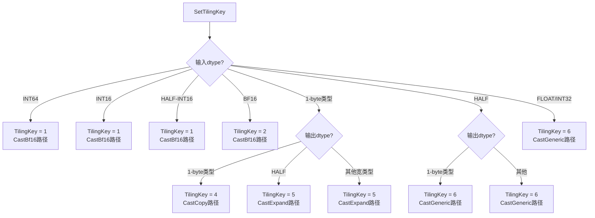
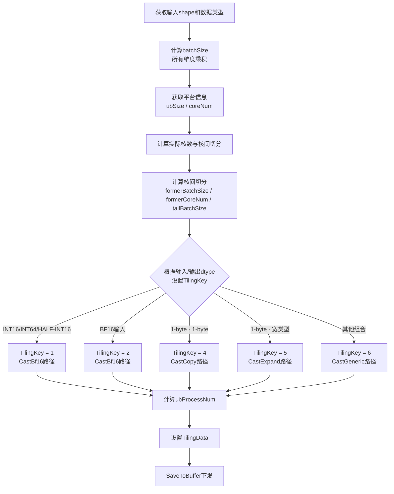
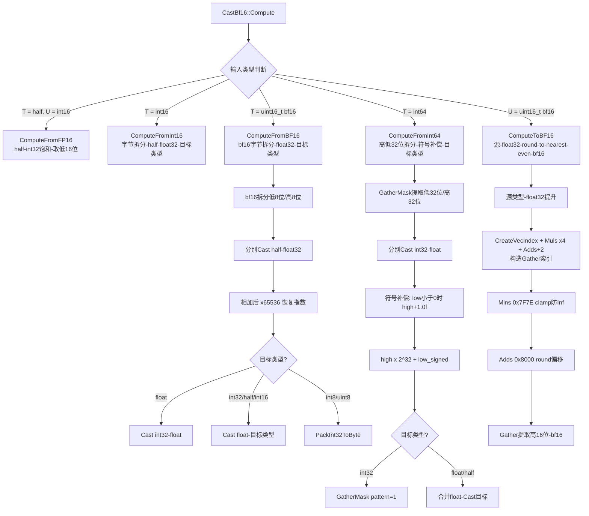

# 需求背景（required）

## 需求来源

Atlas 300V Pro Cast算子开发社区任务。

## 背景介绍

基于昇腾版本内置Cast算子的TBE实现，在昇腾NPU上使用Ascend C编程语言实现功能一致的算子，并新增支持BF16数据类型输入。

Cast算子（TBE）实现路径：`/usr/local/Ascend/ascend-toolkit/latest/opp/built-in/op_impl/ai_core/tbe/impl`

参考开源仓已有Ascend C实现：`https://gitcode.com/cann/ops-transformer/tree/master/experimental/math/cast`

### Cast算子TBE实现现状分析

通过对Cast算子TBE版本的功能分析，当前支持的能力如下：

| 参数   | 参数含义                  | 数据类型   | 支持数据类型                                          | 约束 | 形状 |
| ---- | --------------------- | ------ | ----------------------------------------------- | -- | -- |
| self | 输入tensor，待进行cast计算的入参 | tensor | BOOL、FLOAT16、FLOAT、INT8、UINT8、INT16、INT32、INT64 | 无  | ND |
| out  | 输出tensor，cast计算的出参    | tensor | BOOL、FLOAT16、FLOAT、INT8、UINT8、INT16、INT32、INT64 | 无  | ND |

计算公式：`out = cast(self, dst_type)`，即将输入tensor从一种数据类型转换为另一种数据类型。

本次任务需在TBE版本基础上新增支持BF16数据类型输入，并适配Atlas 300V Pro硬件平台。

### Cast算子TBE实现流程图

TBE版本的Cast算子采用按源数据类型分派的处理方式，`cast_compute`根据输入dtype调用对应的处理函数。以下为310P AICore TBE实际支持的类型组合及处理流程（不含BF16，BF16及其他未列出组合走AICPU）：

**310P AICore TBE支持的Cast类型组合（共40组）：**

|   源类型   |                       目标类型                      |         TBE处理函数        | 关键处理逻辑                               |
| :-----: | :---------------------------------------------: | :--------------------: | :----------------------------------- |
|   bool  |   float16, float32, int32, int8, uint8, int64   |       bool→int8等价      | bool重解释为int8后走int8路径                 |
|   int8  |          float16, float32, int32, bool          | \_int8\_uint8\_process | fp16中转或直接cast\_to                    |
|  uint8  |          float16, float32, int32, int64         | \_int8\_uint8\_process | fp16中转或直接cast\_to                    |
|  int16  |                     float32                     |    \_int16\_process    | 310P: cast\_to int32 → cast\_to fp32 |
|  int32  |    float16, float32, int8, uint8, bool, int64   |    \_int32\_process    | 直接转换或vmod溢出处理                        |
|  int64  |       float16, float32, int32, uint8, bool      |    \_int64\_process    | round或cast\_to直接转换                   |
| float16 |        float32, int32, uint8, int8, bool        |   \_float16\_process   | 直接转换或vand+vmod溢出处理                   |
| float32 | float16, int32, int64, int16, int8, uint8, bool |   \_float32\_process   | 直接转换或trunc/vcmp+vsel                 |

**TBE Cast算子整体流程图：**

```mermaid
flowchart TD
    A["cast_compute<br>src_type判断"] --> B{"src_data_type?"}

    B -->|"int8 / uint8"| C["_int8_uint8_process"]
    B -->|float32| D["_float32_process"]
    B -->|float16| E["_float16_process"]
    B -->|int32| F["_int32_process"]
    B -->|int64| G["_int64_process"]
    B -->|int16| H["_int16_process"]

    C --> C1{"dst_type?"}
    C1 -->|"float16"| C2["cast_to fp16"]
    C1 -->|float32| C3["cast_to fp16 → cast_to fp32"]
    C1 -->|int32| C4["cast_to fp16 → cast_to int32"]
    C1 -->|bool| C5["cast_to fp16 → vabs → vmin(1.0) → cast_to int8"]
    C1 -->|uint8| C6["cast_to fp16 → vabs → cast_to uint8"]
    C1 -->|int64| C7["cast_to int32 → _int32_process(int64)"]

    D --> D1{"dst_type?"}
    D1 -->|float16| D2["cast_to fp16"]
    D1 -->|int32| D3["cast_to int32"]
    D1 -->|int64| D4["trunc int64"]
    D1 -->|int16| D5["cast_to int32 → _int32_process(int16)"]
    D1 -->|int8| D6["cast_to int32 → int16 → _int16_process(int8)"]
    D1 -->|uint8| D7["trunc int64 → _int64_process(uint8) 或 vmod(256) → uint8"]
    D1 -->|bool| D8["vcmp(eq 0.0) → vsel(0/1) → vcmp(ne 0.0)"]

    E --> E1{"dst_type?"}
    E1 -->|"float32 / int32"| E2["cast_to直接转换"]
    E1 -->|uint8| E3["cast_to int32 → cast_to fp32 → uint8溢出处理"]
    E1 -->|int8| E4["cast_to int32 → vand(0xFF) → cast_to fp16 → int8溢出处理"]
    E1 -->|bool| E5["vcmp(eq 0.0) → vsel(0/1) → vcmp(ne 0.0)"]

    F --> F1{"dst_type?"}
    F1 -->|"float32 / float16"| F2["cast_to直接转换"]
    F1 -->|int8| F3["cast_to fp16 → vmod(256) → vadds(-128) → cast_to int8"]
    F1 -->|uint8| F4["cast_to fp16 → vmod(256) → cast_to uint8"]
    F1 -->|bool| F5["cast_to fp16 → vabs → vmin(1.0) → cast_to int8"]
    F1 -->|int64| F6["cast_to int64"]

    G --> G1{"dst_type?"}
    G1 -->|float32| G2["round fp32"]
    G1 -->|float16| G3["cast_to fp16"]
    G1 -->|int32| G4["cast_to int32"]
    G1 -->|uint8| G5["cast_to int32 → fp16 → _float16_process(uint8)"]
    G1 -->|bool| G6["round fp32 → vabs → vmin(1.0) → cast_to int8"]

    H --> H1{"dst_type?"}
    H1 -->|float32| H2["310P: cast_to int32 → cast_to fp32"]
```

# 需求分析（required）

## 需求描述

使用Ascend C编程语言实现Cast算子，支持BOOL、FLOAT16、FLOAT、INT8、UINT8、INT16、INT32、INT64、BF16数据类型之间的互转，对齐PyTorch `torch.Tensor.to(dtype)` 语义，并适配Atlas 300V Pro硬件平台。

## 需求拆解

1. 支持BOOL、FLOAT16、FLOAT、INT8、UINT8、INT16、INT32、INT64、BF16数据类型互转
2. 新增BF16数据类型输入支持
3. 对齐PyTorch cast语义：int→窄整数采用截断（取低位）而非饱和；→bool采用非零即True；浮点转整型时NaN转0
4. 性能要求：BF16转其他类型性能接近FP32输入性能（相同shape对比，90%以上），其他格式数据转换性能与TBE实现不劣化（不低于95%）
5. 精度满足AscendOpTest工具默认阈值

# 详细设计（required）

## 算子分析

将输入tensor的每个元素从源数据类型转换为目标数据类型。关键语义对齐：

- **浮点→整型**：NaN转换为0；截断小数部分（CAST\_TRUNC）
- **整型→窄整型**：取低位字节（modulo-wrap），对齐PyTorch行为
- **→bool**：非零即True（`bool(x) = (x != 0)`）
- **int64→float/half**：拆分高低32位分别转换，通过符号补偿修正精度

### 支持数据类型

输入：BOOL、FLOAT16、FLOAT、INT8、UINT8、INT16、INT32、INT64、BF16

输出：BOOL、FLOAT16、FLOAT、INT8、UINT8、INT16、INT32、INT64

### 支持形状

ND格式，输入输出shape相同。

## 算子实现

### Host侧设计

算子计算过程不涉及数据的维度信息，故在host侧将数据视为一维向量，仅考虑数据个数，不考虑数据维度信息。

**Tiling数据结构：**

| 字段              | 类型        | 含义              |
| --------------- | --------- | --------------- |
| tailBatchSize   | uint64\_t | 尾核处理的数据量        |
| formerCoreNum   | uint64\_t | 首核数量（多分配数据的核数量） |
| formerBatchSize | uint64\_t | 首核处理的数据量        |
| batchSize       | int32\_t  | 输入元素总数          |
| ubProcessNum    | int32\_t  | 单次UB处理元素数       |

**1. 分核策略：** 优先使用满核，根据输入数据总元素数计算实际需要的核数；核间不能均分时，将余出的数据块分配到前几个核上。

**2. 数据分块和内存优化策略：** 充分使用UB空间，根据UB大小、输入/输出数据类型字节数、double buffer及各tiling key路径所需的临时buffer大小，计算单次UB处理元素数。

**3. Tiling Key规划策略：**

根据输入/输出数据类型组合选择不同的kernel实现路径，以优化特定类型转换的性能：

**Cast Tiling Key决策流程图：**

| Tiling Key | 输入类型                       | 输出类型     | Kernel类     | 说明                        |
| :--------: | -------------------------- | -------- | ----------- | ------------------------- |
|      1     | INT16 / INT64 / HALF→INT16 | 任意       | CastBf16    | 16-bit中心路径，使用字节拆分/重组      |
|      2     | BF16                       | 任意       | CastBf16    | BF16输入路径，通过float32中转      |
|      4     | 1-byte类型                   | 1-byte类型 | CastCopy    | 同宽1-byte重解释，无需Compute阶段   |
|      5     | 1-byte类型                   | 宽类型      | CastExpand  | 1-byte→宽类型扩展，通过half中间类型转换 |
|      6     | 任意                         | 任意       | CastGeneric | 通用数据类型转换路径                |

#### Host侧Tiling流程图

### Kernel侧设计

Kernel侧进行Init和Process两个阶段，其中Process包括数据搬入（CopyIn）、计算（Compute）、搬出（CopyOut）三个阶段。

**Cast算子整体流程图：**

```mermaid
flowchart TD
    A["Kernel入口 cast"] --> B["GET_TILING_DATA"]
    B --> C{"TILING_KEY_IS?"}
    C -->|1| D1["CastBf16 T,U<br>INT16/INT64/HALF-INT16"]
    C -->|2| D2["CastBf16 uint16_t,U<br>BF16输入"]
    C -->|4| D4["CastCopy<br>1-byte同宽重解释"]
    C -->|5| D5["CastExpand T,U<br>1-byte-宽类型"]
    C -->|6| D6["CastGeneric T,U<br>通用路径"]

    D1 --> E["Init: InitParams + SetGmAddr + InitIoBuffers"]
    D2 --> E
    D4 --> E2["Init: InitParams + SetGmAddr + InitBuffers"]
    D5 --> E
    D6 --> E

    E --> F["Process: RunProcess"]
    E2 --> F2["Process: 逐tile CopyIn-CopyOut"]

    F --> G["循环: loops = batchSize / ubProcessNum"]
    G --> H["CopyIn: GM-UB<br>DataCopy xGm-xLocal"]
    H --> I["Compute: 子类实现<br>类型转换逻辑"]
    I --> J["CopyOut: UB-GM<br>DataCopy yLocal-yGm"]
    J --> K{"还有数据?"}
    K -->|是| G
    K -->|否| L["尾块处理"]
    L --> M["完成"]
```

**基类设计（CastBase）：** CastBase为所有kernel类的基类，提供通用的CopyIn/CopyOut/RunProcess流水线框架，采用CRTP模式调用子类的Compute。

**各Kernel类设计：**

- **CastCopy（Tiling Key 4）**：同宽1-byte重解释路径，无需Compute阶段，直接按uint8拷贝。
- **CastExpand（Tiling Key 5）**：1-byte→宽类型扩展路径，通过half中间类型转换。
- **CastBf16（Tiling Key 1/2）**：16-bit中心路径，处理bf16/int16/half↔int16/int64等需要字节级操作的类型转换。

**CastBf16路径分支流程图：**

- **CastGeneric（Tiling Key 6）**：通用数据类型转换路径，处理float/half/int32/int64→任意类型的转换，是兜底路径。

## 支持硬件

| 支持的芯片版本        | 涉及勾选 |
| -------------- | ---- |
| Atlas 300V Pro | √    |

## 算子约束限制

- 针对数据类型从浮点数转换为整型的场景：输入数据中存在nan，则将nan转换为0
- 针对数据类型从INT32转换为INT8的场景：只能保证输入数据在(-2048, 1920)范围内精度无误差
- 针对数据类型从FLOAT64/COMPLEX64/COMPLEX128转换为UINT8的场景：只能保证输入数据为非负数精度无误差
- 针对数据类型从INT64转换为FLOAT32的场景：只能保证输入数据在(-2147483648, 2147483647)范围内精度无误差
- int16→bool：AICore的CompareScalar不支持int16输入，回退到Abs+Mins路径，INT16\_MIN (0x8000)会被误判为0而非True（已知硬件限制）
- NaN→bool：AICore CompareScalar对half的NaN比较返回False（PyTorch期望True），属于硬件限制
- int64→float/half：大整数（>2^53）可能丢失精度，属于float表示范围限制

# 可维可测分析

## 精度标准/性能标准

| 验收标准 | 描述                                                                 | 标准来源 |
| ---- | ------------------------------------------------------------------ | ---- |
| 精度标准 | 满足AscendOpTest工具默认阈值                                               | 任务书  |
| 性能标准 | BF16转其他类型性能接近FP32输入性能（相同shape对比，90%以上）；其他格式数据转换性能与TBE实现不劣化（不低于95%） | 任务书  |

## 模型验证

- 验证模型：InternVL
- 验证数据集：flickr30k\_entities
- 精度标准：与Atlas 800T A2对比，train loss不超过0.1

