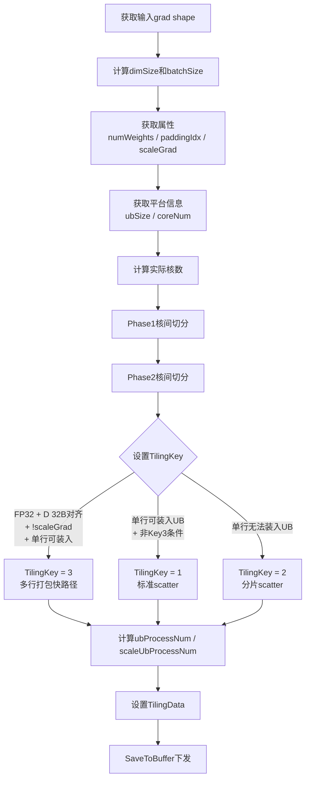
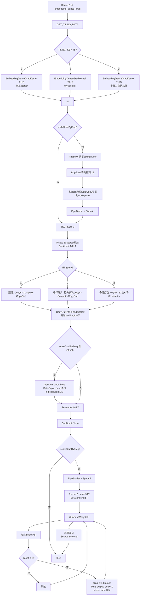
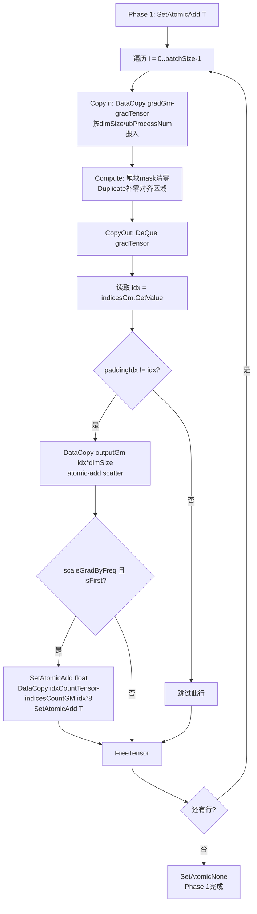
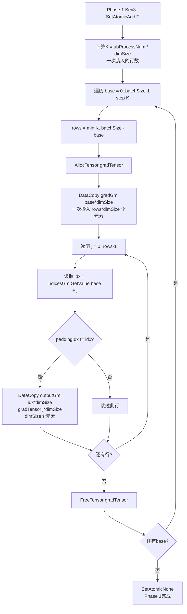
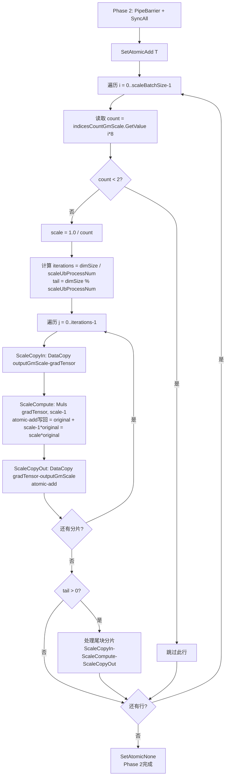

# 需求背景（required）

## 需求来源

Atlas 300V Pro EmbeddingDenseGrad算子开发社区任务。

## 背景介绍

参考 `https://gitcode.com/cann/ops-nn/blob/master/index/embedding_dense_grad_v2/README.md` 实现，在昇腾NPU上使用Ascend C编程语言实现功能一致的算子。

参考开源仓已有Ascend C实现：`https://gitcode.com/cann/ops-nn/tree/master/experimental/index/embedding_dense_grad`

### EmbeddingDenseGrad算子参考实现分析

EmbeddingDenseGrad算子实现Embedding的反向计算，将相同索引`indices`对应grad的一行累加到out上。

| 参数                    | 参数含义                                 | 数据类型   | 支持数据类型 | 约束 | 形状 |
| --------------------- | ------------------------------------ | ------ | ------ | -- | -- |
| grad                  | 输入，表示数据的原始梯度                         | tensor | FLOAT  | 无  | ND |
| sort\_indices         | 输入，表示grad输入对应的索引值                    | tensor | INT32  | 无  | ND |
| out                   | 输出，表示梯度求和的结果输出                       | tensor | FLOAT  | 无  | ND |
| numWeights            | 属性，表示输出tensor的首轴大小                   | attr   | Int    | -  | -  |
| padding\_idx          | 可选属性，将输出tensor中第paddingIdx行填充成0，默认-1 | attr   | Int    | -  | -  |
| scale\_grad\_by\_freq | 可选属性，是否根据单词出现频率对梯度进行缩放，默认false       | attr   | Bool   | -  | -  |

计算公式：`out[indices[i]] += grad[i]`，即按照indices索引将grad中对应行累加到输出tensor的对应行上。

# 需求分析（required）

## 需求描述

使用Ascend C编程语言实现EmbeddingDenseGrad算子，支持FLOAT/FP16 grad与INT32/INT64 indices输入，实现Embedding反向计算中的梯度累加功能，支持padding\_idx和scale\_grad\_by\_freq属性，适配Atlas 300V Pro硬件平台。

## 需求拆解

1. 支持FLOAT/FP16 grad与INT32/INT64 indices输入
2. 实现scatter累加：`out[indices[i]] += grad[i]`
3. 支持padding\_idx属性：将输出tensor中第paddingIdx行填充成0
4. 支持scale\_grad\_by\_freq属性：根据单词出现频率对梯度进行缩放
5. 性能要求：实际耗时不超过理论耗时（输入shape*2 / (204GB*0.5显存带宽)）的1.1倍
6. 精度满足AscendOpTest工具默认阈值

# 详细设计（required）

## 算子分析

按照indices索引将grad中对应行累加到输出tensor的对应行上，即 `out[indices[i]][j] += grad[i][j]`，其中 i ∈ [0, N)，j ∈ [0, D)，N为indices的元素总数（grad合轴后的首轴大小），D为grad的末轴大小。

当`scale_grad_by_freq=True`时，对输出按索引出现频率缩放：`out[k] = (1/count[k]) * Σ grad[i]`（对所有 indices[i]=k 的 i 求和），其中 `count[k]` 为索引k出现的次数。

当`padding_idx >= 0`时，`out[padding_idx]`行置零。

### 支持数据类型

| 输入/输出   | 数据类型          |
| ------- | ------------- |
| grad    | FLOAT、FLOAT16 |
| indices | INT32、INT64   |
| out     | FLOAT、FLOAT16 |

### 支持形状

grad：ND格式，合轴后为`[N, D]`

indices：ND格式，合轴后为`[N]`

out：`[numWeights, D]`

## 算子实现

### Host侧设计

Host侧负责算子注册、shape推导、tiling计算、分核规划和tiling key设置。

**EmbeddingDenseGrad Host侧Tiling流程图：**

**Shape推导策略：** 输出shape为`[numWeights, D]`，其中D为grad输入的最后一维大小，numWeights从属性中获取。

**Tiling数据结构：**

| 字段                   | 类型        | 含义              |
| -------------------- | --------- | --------------- |
| dimSize              | uint64\_t | grad的末轴大小D      |
| numWeights           | int32\_t  | 输出tensor的首轴大小   |
| paddingIdx           | int32\_t  | 填充索引，-1表示不处理    |
| scaleGradByFreq      | int32\_t  | 是否按频率缩放梯度       |
| formerBatchSize      | uint64\_t | 首核处理的行数         |
| tailBatchSize        | uint64\_t | 尾核处理的行数         |
| formerCoreNum        | uint64\_t | 首核数量            |
| scaleFormerCoreNum   | uint64\_t | scale阶段首核数量     |
| scaleFormerBatchSize | uint64\_t | scale阶段首核处理行数   |
| scaleTailBatchSize   | uint64\_t | scale阶段尾核处理行数   |
| ubProcessNum         | int64\_t  | Phase1单次UB处理元素数 |
| scaleUbProcessNum    | uint64\_t | Phase2单次UB处理元素数 |

**1. 分核策略：** Phase 1（scatter累加）按grad的行数分核；Phase 2（scale缩放）按numWeights分核，独立tiling。核间不能均分时，前几个核多处理一行。

**2. 数据分块和内存优化策略：** 根据一行数据是否能完整装入UB选择不同tiling key路径。本算子禁用double buffer，因为算子是MTE3-bound的scatter操作，double buffer反而会争抢DRAM总线带宽。

**3. Tiling Key规划策略：**

| Tiling Key | 条件                                  | 说明                                      |
| :--------: | ----------------------------------- | --------------------------------------- |
|      1     | 单行可装入UB + 非Key 3条件                  | 标准scatter路径：逐行CopyIn→Compute→CopyOut    |
|      2     | 单行无法装入UB                            | 分片scatter路径：一行分多次CopyIn→Compute→CopyOut |
|      3     | FP32 + D 32B对齐 + !scaleGrad + 单行可装入 | 多行打包scatter快路径：一次MTE2装入K行，减少MTE2调用数     |

**4. Workspace规划：** 需要workspace用于scale\_grad\_by\_freq时的count buffer（记录每个索引出现次数）和多核同步slot。

### Kernel侧设计

Kernel侧采用三阶段设计：Phase 0（清零count buffer）→ Phase 1（scatter累加）→ Phase 2（scale缩放）。

**EmbeddingDenseGrad Kernel整体流程图：**

**Init阶段：** 从tiling数据初始化参数，根据blockIdx计算当前核的batchSize和globalOffset，初始化buffer并设置GM地址。

**Phase 0：清零count buffer（仅scaleGradByFreq=True时执行）** 各block协作清零count buffer区域，通过PipeBarrier + SyncAll确保所有核完成清零后才进入Phase 1。

**Phase 1：scatter累加** 整体设置`SetAtomicAdd<T>()`，将scatter写操作变为原子累加，跳过paddingIdx对应的行。

**Key 1/2 scatter路径详细流程图：**

**Key 3多行打包scatter路径详细流程图：**

**Phase 2：scale缩放（仅scaleGradByFreq=True时执行）** Phase 1完成后，PipeBarrier + SyncAll确保所有核的scatter完成。对每个权重行读取count，若count ≥ 2则按1/count缩放输出行。

**Phase 2 scale缩放流程图：**

## 支持硬件

| 支持的芯片版本        | 涉及勾选 |
| -------------- | ---- |
| Atlas 300V Pro | √    |

## 算子约束限制

- grad合轴成二维shape后，第一个维度超过INT32\_MAX(2147483647)时，输出无法保证高精度
- numWeights超过INT32\_MAX(2147483647)时，输出无法保证高精度
- sort\_indices合轴后维度超过INT32\_INF(2139095040)时，无法保证高性能
- grad合轴成二维shape后第二个维度（D）需要32字节对齐，否则无法保证高性能
- scale\_grad\_by\_freq为True时，对梯度进行缩放，无法保证高性能

# 可维可测分析

## 精度标准/性能标准

| 验收标准 | 描述                                            | 标准来源 |
| ---- | --------------------------------------------- | ---- |
| 精度标准 | 满足AscendOpTest工具默认阈值                          | 任务书  |
| 性能标准 | 实际耗时不超过理论耗时（输入shape*2 / (204GB*0.5显存带宽)）的1.1倍 | 任务书  |

## 模型验证

- 验证模型：Clip
- 验证数据集：flickr30k\_entities
- 精度标准：与Atlas 800T A2对比，train loss不超过0.1
