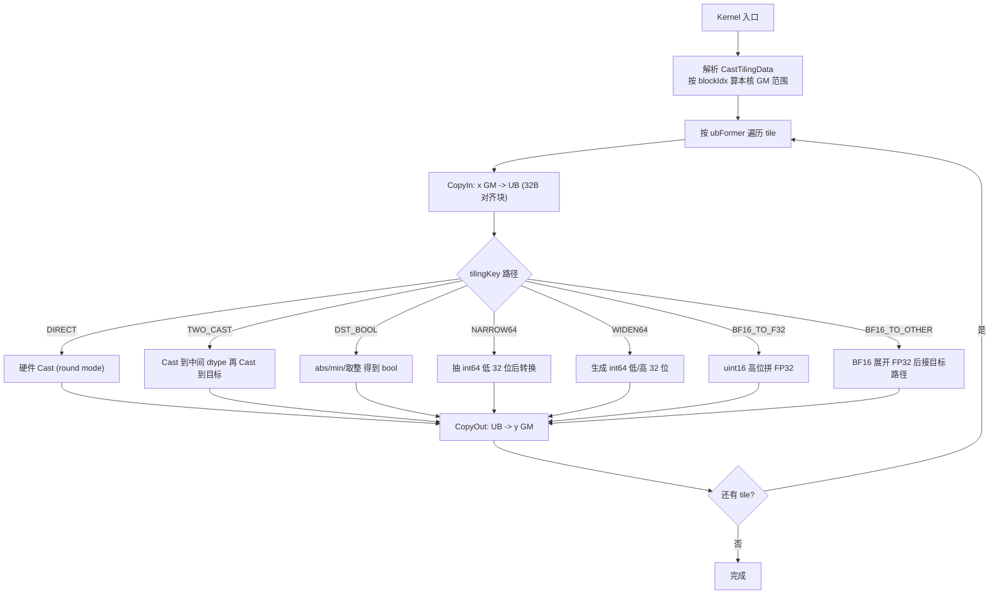
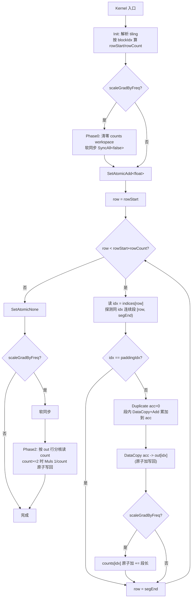

# Cast 算子设计文档
# 一、需求背景
## 1.1 需求来源
参考昇腾版本内置 Cast 算子的 TBE 实现，在昇腾 NPU 上基于 Ascend C 编程语言实现功能一致的算子，并新增支持 BF16 数据类型输入。

## 1.2 背景介绍
**1.2.1 Cast 算子概述**

Cast 算子执行数据类型转换，将输入张量 self 的每个元素从源数据类型转换为目标数据类型，输出相同形状的张量 out。其数学表达式为：

out[i] = (DstType) self[i],   for i = 0, 1, ..., N-1
Cast 算子是深度学习模型中的基础算子，广泛应用于精度切换、算子输入类型适配等场景。

**1.2.2 Cast 算子现状分析**

1.2.2.1 TBE 算子支持的数据类型和数据格式


1.2.2.2 TBE 算子实现描述

TBE Cast 算子核心逻辑路径：/usr/local/Ascend/ascend-toolkit/latest/opp/built-in/op_impl/ai_core/tbe/impl/cast.py

Cast 是逐元素单输入单输出类型转换算子，实现流程如下：

参数校验：校验输入、输出、kernel_name 合法性，校验源数据类型和目标数据类型是否在白名单内

特殊转换处理：

浮点数 → 整型：输入中存在 NaN 则转换为 0

INT32 → INT8：数据在 (-2048, 1920) 范围内保证精度无误差

FLOAT64 → UINT8：输入为非负数保证精度无误差

INT64 → FLOAT32：数据在 (-2147483648, 2147483647) 范围内保证精度无误差

核心计算：调用 tbe.cast 指令完成类型转换

编译生成：自动生成调度，编译输出可执行 kernel

TBE 算子实现策略：


1.2.2.3 TBE 算子实现流程图

-- 整体调度流程：


-- int8_uint8_process：


-- int32_process：


-- uint32_process：


-- float32_process：


-- float16_process：


-- bfloat16_process：


-- int64_process：


-- uint1_process：


-- int16_process：


-- uint16_process：


# 二、需求分析
## 2.1 外部组件依赖

不涉及外部组件依赖。

## 2.2 内部适配模块

适配 Aclnn 接口，支持常规调用模式。

## 2.3 需求模块设计

2.3.1 AscendC 算子原型

> 参数定义与任务书《参数说明》保持一致。

| 参数名 | 输入/输出/属性 | 描述 | 数据类型 | 数据格式 |
| --- | --- | --- | --- | --- |
| self | 输入 | 待进行 cast 计算的入参。 | BOOL、FLOAT16、FLOAT、INT8、UINT8、INT16、INT32、INT64、BF16 | ND |
| out | 输出 | cast 计算的出参。 | BOOL、FLOAT16、FLOAT、INT8、UINT8、INT16、INT32、INT64 | ND |

> 说明：目标数据类型经 aclnn 接口的 dst_type 属性传入，与 out 的 dtype 一致；BF16 仅作为 self 输入支持，输出不含 BF16；self 与 out 的 shape 一致。

**2.3.2 AscendC 算子相关约束**

> 对外约束以任务书《约束说明》为唯一口径（见 3.4 的 4 条精度约束）。本节列出的是**工程实现假设/支持范围**，不属于任务书新增的对外约束，仅用于界定实现与测试覆盖：

- 输入输出 shape 相同（Cast 不改变形状）；支持空 Tensor（第一段接口短路、不下发 kernel）。
- 支持的张量维数范围与底层 ND 张量一致（不额外收窄；如需声明上限以底层框架为准）。
- 支持非连续 Tensor。
- BF16 仅作为源数据类型输入支持，输出不扩展至 BF16（与 TBE 版本一致，已在参数表/3.4 体现）。

数据类型转换的对外精度约束与任务书《约束说明》一致（详见 3.4），在 kernel 侧保证

# 三、需求详细设计
## 3.1 使能方式

## 3.2 需求总体设计

**3.2.1 host 侧设计**

3.2.1.0 目标硬件能力前提（dav_m200）

| 能力 | 结论 | 对设计的影响 |
| --- | --- | --- |
| 硬件 vconv 直达 | 支持 f16/f32/i32/i16/i8/u8/bool 间部分组合 | 普通路径优先 `AscendC::Cast` |
| BF16 vconv | dav_m200 无 BF16 原生转换 | BF16 输入按 uint16 位模式展开为 FP32 |
| ShiftLeft/ShiftRight | 不支持 | BF16 展开不能依赖 16 位移位向量指令 |
| 64bit 整数转换 | 多数不直达 | int64 走低 32 位抽取 / 符号扩展软件路径 |
| DataCopyPad（GM↔UB） | 不支持 | CopyIn/CopyOut 必须 32B 对齐块 |

3.2.1.0.1 交付 dtype 对矩阵（源 → 目标）

> 交付范围对齐原 TBE Cast 注册的完整转换集（参考 `ops-math/experimental/math/cast/op_host/cast_def.cpp`），即覆盖参考支持的全部源→目标组合，**仅排除"任意类型 → BF16"输出**（任务书 out 不含 BF16，输出暂不扩展至 BF16）。下表已据此补全，不缩减原算子能力。

| 源 \ 目标 | 交付目标 dtype |
| --- | --- |
| FLOAT16 | FLOAT32, INT32, INT16, INT8, UINT8, BOOL |
| FLOAT32 | FLOAT16, INT32, INT16, INT8, UINT8, BOOL, INT64 |
| INT32 | FLOAT32, FLOAT16, INT16, INT8, UINT8, BOOL, INT64 |
| INT8 | FLOAT16, FLOAT32, INT32, INT16, UINT8, BOOL, INT64 |
| UINT8 | FLOAT16, FLOAT32, INT32, INT8, INT16, INT64 |
| INT16 | FLOAT16, FLOAT32, INT32, INT8, UINT8, INT64 |
| BOOL | FLOAT16, FLOAT32, INT32, INT8, UINT8, INT64 |
| INT64 | FLOAT16, FLOAT32, INT32, INT8, UINT8, INT16, BOOL |
| BF16（新增源） | FLOAT32, FLOAT16, INT32, INT16, INT8, UINT8, BOOL, INT64 |

> 说明：参考 `cast_def.cpp` 的 BF16 源仅注册 BF16→{F16, F32, I32, I8, U8, BOOL}；本设计额外交付 **BF16→INT16、BF16→INT64** 两对（经 BF16→FP32 展开后复用 FP32→目标链实现），其精度沿用对应 FP32→INT16/INT64 路径的约束（见 3.4），不弱于参考的等价两跳。

3.2.1.1 分核策略

根据输出张量总元素数 totalElements 和 AI Core 数量进行均分

数据总量不能被核数整除时，前 remainder 个核心各多处理一个数据块

获取平台核心数量：通过 GetCoreNum() 获取 Atlas 300V Pro 的 AI Core 数量

3.2.1.2 数据分块和内存优化策略

UB 容量适配：CopyIn 缓冲（SrcT）与 CopyOut 缓冲（DstT）在 UB 中同时存在，且部分路径需要中间 buffer，故按"源 + 目标 + 中间"之和预算，而非取较大值：

```text
BUFFER_NUM   = 2
bytesPerElem = BUFFER_NUM × (sizeof(SrcT) + sizeof(DstT)) + middleBytes
单 Tile 处理元素数 ubFormer = floor((UB_SIZE - reserve) / bytesPerElem) 向下按 256 元素对齐
```

其中 middleBytes 由路径决定：DIRECT = 0；TWO_CAST / DST_BOOL 需 f16/f32 中间 buffer；BF16、int64 软件路径需更大的中间 buffer。

> 早期版本用 `UB / (2 × max(sizeof(SrcT), sizeof(DstT)))` 估算单 Tile 大小是错误的：源/目标缓冲同时占 UB，用 max 会低估占用、导致 tile 过大溢出 UB。

内存对齐：因 dav_m200 无 DataCopyPad，CopyIn/CopyOut 统一使用 32 字节对齐数据块，tile 与尾块均按 32B/256 元素对齐设计，避免越界读写。

3.2.1.3 tilingKey 规划策略

tilingKey 按 3.2.2.1 的**路径类别**取值（0 DIRECT / 1 TWO_CAST / 2 DST_BOOL / 3 NARROW64 / 4 WIDEN64 / 5 BF16_TO_F32 / 6 BF16_TO_OTHER / 7 SAMEWIDTH_8BIT / 8 NARROW8），由 host 依据源/目标 dtype 对查表确定。输入/输出 dtype 在 kernel 侧由编译期宏注入，运行期 tiling 只描述分核与 UB 切分。

host 侧维护三张 `[N][N]`（按 dtype 枚举索引）真值表，对齐参考 `cast_tiling.cpp` 的 `tilingKeyMap`/`ubDataNumMap`/`minDataTypeLengthMap` 工程模式，避免运行期逐对 if 判断、也避免漏配：

- `pathClassMap[src][dst]` → 上述 0–8 路径类别（即 tilingKey）；
- `middleBytesMap[src][dst]` → 该对所需中间 buffer 字节数（DIRECT/SAMEWIDTH_8BIT=0，TWO_CAST/DST_BOOL 需 1 块，BF16/int64 软件路径需更大），供 3.2.1.2 的 UB 预算精确取值；
- `roundModeMap[src][dst]` → 该对的 round mode（规则见 3.2.2.1）。

将 tiling 参数（totalElements、coreNum、ubFormer、tileNum、lastTileSize、roundMode）封装到 CastTilingData 结构体中。

**3.2.2 kernel 侧设计**
3.2.2.1 kernel 侧实现描述

Cast 算子 kernel 侧由编译期 dtype 宏注入输入/输出类型，按源/目标 dtype 对选择以下路径（tilingKey 即路径类别）。所有路径共享 CopyIn → Compute → CopyOut 主框架，因 dav_m200 无 DataCopyPad，CopyIn/CopyOut 统一按 32 字节对齐块设计。

| tilingKey | 路径 | 覆盖 dtype 对 | 实现要点 |
| --- | --- | --- | --- |
| 0 | DIRECT | dav_m200 vconv 可直达组合（f16/f32/i32/i16/i8/u8/bool 间的部分组合） | 一跳 `AscendC::Cast`，浮点转整按对应 round mode（见下"round mode 逐对规则"）；窄整型输出按 mod-256 回绕处理（见 NARROW8） |
| 1 | TWO_CAST | 需中转的普通组合 | 经 f16/f32 两段 `Cast` 串接，中间加 `PipeBarrier<PIPE_V>` |
| 2 | DST_BOOL | 目标 dtype 为 bool | 按 `ceil(min(abs(x),1))` 归一化语义实现（`Abs → Mins(1) → Cast(CAST_CEIL)`） |
| 3 | NARROW64 | int64 → 低位/窄类型 | 抽取 int64 低 32 位 lane 后进入普通转换链 |
| 4 | WIDEN64 | int32/float32/BF16 → int64 | 先得 32 位结果，再按符号生成高 32 位 |
| 5 | BF16_TO_F32 | BF16 → FLOAT | BF16 halfword 放入 FP32 高 16 位、低 16 位补零，保留 NaN/Inf 比特语义 |
| 6 | BF16_TO_OTHER | BF16 → 其它非 BF16 输出 | 先展开为 FP32，再复用 FP32→目标 dtype 路径 |
| 7 | SAMEWIDTH_8BIT | bool ↔ int8 ↔ uint8（同宽 8bit 互转） | 位等价，用 `TQueBind<VECIN,VECOUT>` 做 GM→UB→GM 零 `Cast` 直搬（对齐参考 key8），不走转换链，是性能最优路径 |
| 8 | NARROW8 | 任意 → int8/uint8（窄整型输出） | **mod-256 回绕**，非真饱和：`And(x, 0xFF)` 取低 8 位得 uint8 语义；int8 再 `Adds(+128) → And(0xFF) → Adds(-128)` 把 [0,255] 映回 [-128,127]。这解释了 3.4 中 INT32→INT8 仅在 (-2048,1920) 无误差——超窗即回绕 |

> **round mode 逐对规则**（对齐参考 `cast.h` 0TBuf 段）：浮点→整 = `CAST_TRUNC`（NaN 由硬件 vconv 截断为 0）；int64→float = `CAST_ROUND`；→bf16 = `CAST_RINT`；→bool = `CAST_CEIL`；其余等宽/扩宽 = `CAST_NONE`。host 侧用 `roundModeMap[src][dst]` 真值表逐对落定，避免运行期判断。

Cast 计算核心（DIRECT 路径示意）：

```cpp
template <typename SrcT, typename DstT>
__aicore__ void CastKernel::Compute(int32_t tileIdx) {
    LocalTensor<SrcT> srcBuf = srcQueue.DeQue<SrcT>();
    LocalTensor<DstT> dstBuf = dstQueue.AllocTensor<DstT>();
    // round_mode: CAST_RINT / CAST_FLOOR / CAST_CEIL / CAST_ROUND / CAST_TRUNC，按 TBE 对应模式
    Cast(dstBuf, srcBuf, roundMode, curTileLen);
    dstQueue.EnQue(dstBuf);
    srcQueue.FreeTensor(srcBuf);
}
```

**BF16 处理（dav_m200 关键约束）：** dav_m200 **无 BF16 原生 vconv**，且**无 ShiftLeft/ShiftRight 向量指令**，因此不能用移位展开。BF16 输入按 `uint16_t` 位模式处理：将每个 BF16 halfword 作为高 16 位、低 16 位补零，拼成 FP32 的 bit layout（保留 NaN/Inf 语义），得到等值 FP32 后再进入目标 dtype 转换链。输出 dtype 不包含 BF16，故不注册"任意类型 → BF16"路径。

**int64 处理：** dav_m200 多数 int64 相关 vconv 不直达，采用低 32 位抽取（NARROW64）或符号扩展（WIDEN64）的软件路径，仅在任务书约束范围内保证精度。

特殊转换约束处理：

| 约束项 | 说明 |
| --- | --- |
| 浮点 → 整型 NaN | NaN 转 0，对齐 TBE / 硬件 vconv 行为 |
| 8bit 整型输出 | **mod-256 回绕（非饱和）**：uint8 取低 8 位（`And 0xFF`），int8 经 `+128 → &0xFF → -128` 映回 [-128,127]。与 TBE 一致 |
| INT32 → INT8 | 仅保证输入在 (-2048, 1920) 范围内精度无误差（超窗即回绕，故有此精度窗口） |
| INT64 → FLOAT32 | 仅保证输入在 (-2147483648, 2147483647) 范围内精度无误差 |
| 空 Tensor | 第一段接口短路，不下发 kernel |
| 输出 BF16 | 不属于任务书交付范围 |

3.2.2.2 AscendC 实现流程图



3.2.2.3 AscendC 实现流程图与 TBE 流程图存在的差异点和原因

| 差异点 | TBE 实现 | AscendC 实现 | 原因 |
| --- | --- | --- | --- |
| 数据类型支持 | BOOL/F16/F32/I8/U8/I16/I32/I64 | 新增 BF16 源数据类型输入 | 任务要求；dav_m200 无 BF16 原生 vconv，按 uint16 位模式软件展开为 FP32 |
| 计算指令 | tbe.cast | AscendC::Cast 高阶 API | API 差异 |
| 数据格式 | ND | ND | 保持一致 |
| 类型转换路径 | 直接 cast 或中间类型 | 按 dtype 对分 DIRECT/TWO_CAST/DST_BOOL/NARROW64/WIDEN64/BF16 路径 | 适配 dav_m200 能力，路径化分派 |
| 尾块搬运 | 依赖 pad 拷贝 | 32B 对齐块 + 尾块对齐处理 | dav_m200 无 DataCopyPad |
## 3.3 支持硬件
| 支持的芯片版本 | 涉及勾选 |
| --- | --- |
| Atlas 300V Pro | √ |
## 3.4 算子约束限制

以下对外约束与任务书《约束说明》一致：

- 针对数据类型从浮点数转换为整型的场景：输入数据中存在 nan，则将 nan 转换为 0。
- 针对数据类型从 INT32 转换为 INT8 的场景：只能保证输入数据在 (-2048, 1920) 范围内精度无误差。
- 针对数据类型从 FLOAT64/COMPLEX64/COMPLEX128 转换为 UINT8 的场景：只能保证输入数据为非负数精度无误差。
- 针对数据类型从 INT64 转换为 FLOAT32 的场景：只能保证输入数据在 (-2147483648, 2147483647) 范围内精度无误差。

工程实现约束（不改变上述对外语义）：

- self 与 out 的 shape 必须一致；BF16 仅作为 self 输入支持，输出不含 BF16。

INT32 → INT8 仅保证输入在 (-2048, 1920) 范围内精度无误差

INT64 → FLOAT32 仅保证输入在 (-2147483648, 2147483647) 范围内精度无误差

所有核参与场景下，性能不低于 TBE 算子的 95%（BF16 相关转换不低于 FP32 输入性能的 90%）

# 四、特性交叉分析
本算子为独立类型转换算子，不涉及与其他算子的特性交叉。新增 BF16 源数据类型不影响已有类型组合的行为。

# 五、可维可测分析
## 5.1 精度标准/性能标准
精度标准：

- **验收主口径（任务书）**：算子计算精度需满足 [AscendOpTest](https://gitcode.com/HIT1920/AscendOpTest) 工具默认阈值。
- 自测补充标准（不替代主口径，仅用于开发自验）：整型转换结果须与参考逐元素完全一致；BF16 相关转换以 PyTorch `tensor.to()` 为 CPU 标杆逐元素比对；整体以 TBE 算子输出为基准对照。

性能标准（与任务书一致）：

- BF16 → 其他数据类型性能接近 FP32 输入性能（相同 shape 对比，≥ FP32 性能的 90%）。
- 其他格式数据转换性能与现有 TBE 实现不劣化（≥ 现有实现的 95%）。
- 如小 shape 无法达标（10μs 以下场景相差 3μs 以上），提供性能仿真图和分析结论，证明 Ascend C 实现与 TBE 完全一致或优于 TBE 实现。

## 5.2 兼容性分析
向后兼容：完全兼容 TBE 算子已支持的数据类型和格式

扩展支持：新增 BF16 源数据类型输入

调用模式：支持常规计算，接口与 TBE 版本一致

## 5.3 测试用例设计

| 维度 | 覆盖用例 |
| --- | --- |
| dtype 对 | 3.2.1.0.1 矩阵中全部交付源→目标对 |
| shape | 标量、小 shape、非 32B 对齐尾块、大 shape、多维 shape |
| 特殊值 | NaN、Inf、0、负数、int8/uint8 回绕边界（±128/256 附近）、int64 边界 |
| 约束边界 | INT32→INT8 的 (-2048,1920)、INT64→FLOAT32 的 (±2147483648) |
| BF16 | golden 先按 BF16 量化再转目标 dtype，不能直接用 FP32 原值当 BF16 参考 |

## 5.4 风险与评审确认项

| 风险项 | 说明 | 处理方式 |
| --- | --- | --- |
| BF16 性能 | dav_m200 无 BF16 原生 vconv，需 halfword→FP32 软件展开（且无移位指令），与 FP32 直达有天然差异 | 优先通过优化满足任务书 90% 要求；确无法达标时按任务书规则提供性能仿真图与分析结论证明已接近 dav_m200 能力极限，不写"申请例外" |
| BF16 位拼接（无移位） | 无 ShiftLeft/ShiftRight，halfword→FP32 高半字拼接不能用移位 | 按 4 字节 lane 视图清零低半字 + 字节重排 DataCopy 实现高 16 位写入；列为 BF16 路径主要实现风险 |
| int64 软件路径 | 缺多数组合直达转换 | NARROW64/WIDEN64 按 32 位 lane 抽取/符号扩展，明确支持范围与数值约束，测试覆盖边界 |
| DataCopy 对齐 | 无 DataCopyPad，尾块须避免越界 | host tiling 与 kernel CopyIn/CopyOut 统一 32B 对齐（参考实现亦未用 DataCopyPad，可借鉴其对齐 tiling） |

## 5.5 算子接入模型验证

| 项 | 内容 |
| --- | --- |
| 验证模型 | InternVL |
| 验证数据集 | flickr30k_entities（https://github.com/BryanPlummer/flickr30k_entities） |
| 模型精度 | 与 Atlas 800T A2 对比，train loss 不超过 0.1 |

# EmbeddingDenseGrad 算子设计文档
# 一、需求背景
## 1.1 需求来源
参考开源仓 embedding_dense_grad_v2 算子实现，在昇腾 NPU 上基于 Ascend C 编程语言实现功能一致的算子，完成算子设计、开发、测试全流程工作，验收通过后将算子提交至昇腾算子开源仓。

## 1.2 背景介绍
**1.2.1 EmbeddingDenseGrad 算子概述**
EmbeddingDenseGrad 是 Embedding 层的反向传播算子。前向按 token id 从权重表取行，反向需把每个 token 对应的梯度累加回权重梯度表；同一个 id 在一个 batch 中可能出现多次，因此对应的多行 grad 需累加到同一个 out 行。grad 合轴后视为 [N, D]，sort_indices 元素数为 N，输出 out 形状为 [numWeights, D]。数学表达为：

对每个权重行 k ∈ [0, numWeights)：

out[k, :] = Σ_{ i : sort_indices[i] == k } grad[i, :]

即按索引把 grad 中对应行累加到输出行（scatter-add）。

若 scale_grad_by_freq = True，则按该索引出现频次 count[k] 缩放（仅 count[k] ≥ 2 时缩放）：

out[k, :] = ( 1 / count[k] ) · Σ_{ i : sort_indices[i] == k } grad[i, :]

若 padding_idx ≥ 0，则 out[padding_idx, :] 保持为 0（跳过累加）。

`sort_indices` 的有序性来自 **aclnn 调用链而非任务书口头约定**：`aclnnEmbeddingDenseBackward` 在下发本算子前调用 `l0op::Sort` 对 indices 升序排序并返回排序后的 `sort_indices` 与原始行号 `posIdx`（参考 `ops-nn/index/embedding_dense_grad_v2/op_api/aclnn_embedding_dense_backward.cpp:277`）；参考算子 kernel 据此用 `currentId != lastIndices` 做段累加（`op_kernel/embedding_dense_grad_v2.h:259-279`）。故同一 index 的行在 `sort_indices` 中连续，kernel 可在 UB 内对连续段先做段内累加再写回 GM，显著降低对输出的离散写次数。该算子在推荐系统、自然语言处理等 Embedding 层反向传播中广泛使用。

## 1.2.2 EmbeddingDenseGrad 算子现状分析

1.2.2.1 参考算子支持的数据类型和数据格式


1.2.2.2 参考算子实现描述

参考算子实现路径：https://gitcode.com/cann/ops-nn/blob/master/index/embedding_dense_grad_v2/README.md

核心实现逻辑：

将 grad 和 indices 合轴（reshape）为一维形式

grad_flat shape: [total_rows, dim]

indices_flat shape: [total_rows]

out_flat shape: [numWeights, dim]

遍历 indices，将 grad 对应行累加到 out 的对应行

支持按频率缩放和 padding 行填充 0

1.2.2.3 tbe算子实现流程图


# 二、需求分析
## 2.1 外部组件依赖

不涉及外部组件依赖。

## 2.2 内部适配模块

适配 Aclnn 接口，支持常规调用模式。

## 2.3 需求模块设计

## 2.3.1 AscendC 算子原型

> 参数定义与任务书《参数说明》保持一致。

| 参数名 | 输入/输出/属性 | 描述 | 数据类型 | 数据格式 |
| --- | --- | --- | --- | --- |
| grad | 输入 | 表示数据的原始梯度。 | FLOAT | ND |
| sort_indices | 输入 | 表示 grad 输入对应的索引值。 | INT32 | ND |
| out | 输出 | 表示梯度求和的结果输出。 | FLOAT | ND |
| numWeights | 属性 | 表示输出 tensor 的首轴大小。 | Int | - |
| padding_idx | 可选属性 | 将输出 tensor 中第 paddingIdx 行填充成 0，如果 paddingIdx 为负数则不进行处理。默认值为 -1。 | Int | - |
| scale_grad_by_freq | 可选属性 | 根据单词出现的频率，是否对梯度进行缩放。默认值为 false。 | Bool | - |

> 说明：grad 合轴后按 [N, D] 处理，out 为 [numWeights, D]（D = grad.shape[-1]），累加前清零；sort_indices 已排序、元素数为 N。

**2.3.2 AscendC 算子相关约束**

grad 和 sort_indices 必须长度匹配（grad.shape[0] == indices.shape[0] 合轴后）

out 形状为 [numWeights, dim]，其中 dim = grad.shape[-1]

grad 合轴成二维后，第二维度需 32 字节对齐

支持空 indices（total_rows = 0）

支持非连续 Tensor

# 三、需求详细设计
## 3.1 使能方式


## 3.2 需求总体设计

**3.2.1 host 侧设计**

3.2.1.0 目标硬件能力前提（dav_m200）

本设计基于 Atlas 300V Pro（ascend310p，dav_m200）的 Ascend C 能力，关键前提如下，后续 host/kernel 设计据此展开：

| 能力 | 结论 | 对设计的影响 |
| --- | --- | --- |
| SetAtomicAdd\<float\> | 支持 fp32 GM 原子加 | 同一 index 跨核累加正确性由原子加保证 |
| DataCopyPad（GM↔UB） | 不支持 | CopyIn/CopyOut 必须按 32 字节对齐块设计，非对齐 D 走标量兜底 |
| 裸 SyncAll() | 不支持 | scale 路径用 GM workspace 软同步 |
| KernelMode | 使用 MIX_MODE | 避免 dav_m200 上派发模式不匹配导致 kernel 未执行 |

3.2.1.1 分核策略

主路径按 grad 的行数 N 在多个 AI Core 间切分，每核处理一段连续 row 区间：

```text
gradRow      = N（grad 合轴后的首轴）
usedCoreNum  = min(platformCoreNum, gradRow)
formerRowNum = ceil(gradRow / usedCoreNum)   // 前几个核各多处理一行
tailRowNum   = floor(gradRow / usedCoreNum)
```

由于 sort_indices 已排序（见 1.2.1 的依据），相同 index 在核内连续，可在核内做段内累加；若同一 index 跨越两个核的边界，最终由 GM 上的 SetAtomicAdd\<float\> 归约保证数学语义正确。平台核数通过 GetCoreNum() 获取。

> grad 行寻址说明：参考算子 `l0op::Sort` 同时返回排序后的 `sort_indices` 与原始行号 `posIdx`，**grad 本身不物理重排**，kernel 用 `posIdx[i] × D` 间接 gather 第 i 个排序位对应的 grad 行、用 `sort_indices[i]` 定位写回的 out 行（参考 `embedding_dense_grad_v2.h:241`）。本设计同样按"排序序 i"遍历：若实现选择接收 `posIdx` 做间接寻址，则与参考一致；若选择让调用方把 grad 随 indices 一起重排后顺序读取，则需在接口约束中显式声明该前提。下文伪码以"排序序的 grad 行"为输入抽象，不预设物理布局。

3.2.1.2 数据分块和内存优化策略

- 当 D 较大、单行无法一次装入 UB 时，按列切分（单次处理一段连续 embedding dim，如 min(D, 4096)），列切只改变单次 UB 处理宽度，不改变累加语义。
- 因 dav_m200 无 DataCopyPad，CopyIn/CopyOut 统一按 32 字节对齐块设计；D 非 32B 对齐时走标量兜底路径（仅保证功能，不作为高性能口径）。
- 本算子为 MTE3-bound 的 scatter 写操作，**禁用 double buffer**：双缓冲会额外占用 UB 并加剧 DRAM 总线带宽争抢，反而降低吞吐。
- UB 大小通过 GetCoreMemSize(CoreMemType::UB) 获取。

3.2.1.3 tilingKey 规划策略

| tilingKey | 触发条件 | 说明 |
| --- | --- | --- |
| 0 | scale_grad_by_freq == false | 默认高性能主路径：段内累加 + 边界原子加 |
| 1 | scale_grad_by_freq == true | 累加后按频次除法，需 counts workspace 与软同步（任务书声明不保证高性能） |

频次缩放不通过 tiling 传 freq 数组（numWeights 可能很大，不可行），而是用 GM workspace 的 counts 缓冲在 kernel 内统计。tiling 参数（dimSize、numWeights、paddingIdx、scaleGradByFreq、formerRowNum、tailRowNum、formerCoreNum、ubProcessNum 等）封装到 EmbeddingDenseGradTilingData 结构体中。

workspace 规划（对齐参考 fp32 路径口径）：

- **system 保留区**：16MB（系统固定保留）。
- **counts 缓冲**（仅 scale 路径）：`align(numWeights) × 4B`（每 index 一个 float 频次计数；参考 `embedding_dense_grad_v2_tiling.cpp:244-245` 中 fp32 路径 workspace = 系统区 + counts，无其它分量）。
- **软同步 slot**：极小常量区，替代 dav_m200 缺失的裸 `SyncAll()`（参考用 `SyncAll`，本设计用 GM workspace 标志位软同步）。

> 参考实现还为 fp16/bf16 主路径分配 `outStage`、为 small-dim 非 fp32 分配整张 `numWeights×D` 的 `outCasted` 中转区；本设计**仅交付 FP32、且不走 cast 中转/整表物化**，故无这两类 workspace，也无参考 small-dim 的 `numWeights ≤ 16777216`、`D ≤ 512` 上限。

**3.2.2 kernel 侧设计**

3.2.2.1 kernel 侧实现描述

EmbeddingDenseGrad 算子 kernel 侧采用模板化设计，按 tilingKey 选择两种实现：

KernelEmbeddingDenseGrad：默认版本（tilingKey 0），无频率缩放，纯 scatter 累加

KernelEmbeddingDenseGradWithFreq：频率缩放版本（tilingKey 1），在默认累加基础上叠加 counts 统计与二阶段缩放

两者共享 Init（解析 tiling、按 blockIdx 计算本核 rowStart/rowCount、设置 GM 地址）。输出 out 在累加前按 InitValue(0) 语义清零（由 op_host/op_api 与 kernel 入口保持一致），padding 行因被跳过而保持 0。

**默认路径（tilingKey 0）计算逻辑：** 全程设置 SetAtomicAdd\<float\>()，把对 out 的写变为 GM 原子累加，从而无需核间同步即可处理跨核同 index 冲突。利用 sort_indices 已排序的性质，在 UB 内对连续同 index 的多行先做向量累加（段内累加），再整段原子写回，降低 GM 原子写次数：

```cpp
// 伪代码：T = float。按列块 cOff 遍历 D，列块宽度 cLen 32B 对齐
SetAtomicAdd<float>();
uint32_t row = rowStart;
while (row < rowStart + rowCount) {
    int32_t idx = indicesGm.GetValue(row);
    uint32_t segEnd = row;
    while (segEnd < rowStart + rowCount && indicesGm.GetValue(segEnd) == idx) ++segEnd; // 同 idx 连续段
    if (idx != paddingIdx) {
        // 段内累加：把 grad[row..segEnd) 的对应列块累加进 UB 的 acc，再原子写回 out[idx]
        Duplicate(acc, 0, cLen);
        for (uint32_t r = row; r < segEnd; ++r) {
            DataCopy(gradTile, gradGm[r * D + cOff], cLen);   // 32B 对齐块搬入
            Add(acc, acc, gradTile, cLen);                     // 向量累加
        }
        DataCopy(outGm[idx * D + cOff], acc, cLen);            // 原子加写回（已 SetAtomicAdd）
    }
    row = segEnd;
}
SetAtomicNone();
```

设计要点：① grad 行连续读取，降低 GM 访存离散度；② 同 idx 连续段在 UB 内先累加，减少 GM 原子写；③ 跨核边界的同 idx 冲突由 fp32 原子加兜底；④ padding_idx 行直接跳过写回；⑤ 无 double buffer（MTE3-bound）。

**非对齐 D 兜底：** 当 D % 8 != 0（fp32 非 32B 对齐）时，对齐块 DataCopy 无法安全覆盖尾列且 dav_m200 无 DataCopyPad，改用标量 GetValue/SetValue 逐元素累加的功能兜底路径，仅保证正确性，不作为高性能验收口径。

**频率缩放路径（tilingKey 1）：** 三阶段 —— Phase0 清零 counts workspace 并软同步；Phase1 在默认累加的同时，对每个有效 idx 用原子加把 count 累加到 counts workspace；Phase2 软同步后按 out 行分核读取 count，对 count ≥ 2 的行用 Muls 实现 out[k] *= 1/count[k]（以原子加形式写回）。dav_m200 无裸 SyncAll()，阶段间使用 GM workspace 的软同步保证 counts 累加完成后再进入缩放。

3.2.2.2 AscendC 实现流程图
                                     


> 注：非对齐 D（D % 8 != 0）走标量 GetValue/SetValue 兜底路径，不在上图高性能主路径内。
                                     
3.2.2.3 AscendC 实现流程图与参考算子流程图存在的差异点和原因
                                     
| 差异点 | 参考算子（embedding_dense_grad_v2） | 本 AscendC 实现 | 原因 |
| --- | --- | --- | --- |
| 交付硬件 | 未覆盖 Atlas 300V Pro 形态 | 面向 ascend310p / dav_m200 | 任务要求新增 310P 交付 |
| 数据搬运 | 通用语义参考 | CopyIn/CopyOut 按 32B 对齐块，非对齐 D 走标量兜底 | dav_m200 无 DataCopyPad |
| 同 index 累加 | 按索引累加（语义） | 段内 UB 向量累加 + 边界 SetAtomicAdd\<float\> | 利用已排序 sort_indices 降低 GM 原子写 |
| 跨核同步 | 通用同步 | scale 路径用 GM workspace 软同步 | dav_m200 无裸 SyncAll() |
| 派发模式 | — | KernelMode::MIX_MODE | 避免 dav_m200 上 kernel 未实际执行 |
| 缓冲策略 | — | 禁用 double buffer | scatter 为 MTE3-bound，双缓冲加剧 DRAM 带宽争抢 |
                                     
## 3.3 支持硬件
                                     
| 支持的芯片版本 | 涉及勾选 |
| --- | --- |
| Atlas 300V Pro | √ |
                                     
## 3.4 算子约束限制

以下约束与任务书《约束说明》一致：

- 在参数 shape 超过以下限制时，输出无法保证高精度，若开启了确定性计算，也无法保证高性能：
  - grad 合轴成二维 shape 后，第一个维度超过 INT32_MAX(2147483647)；
  - numWeights 超过 INT32_MAX(2147483647)。
- sort_indices 合轴后维度超过 INT32_INF(2139095040) 时，无法保证高性能。
- grad 合轴成二维 shape 后第二个维度（D）需要 32 字节对齐，否则无法保证高性能。
- scale_grad_by_freq 为 True 时，对梯度进行缩放，无法保证高性能。

scale_grad_by_freq 为 True 时无法保证高性能

实际耗时不得超过理论耗时（输入 shape × 2 ÷ (204GB × 0.5)）的 1.1 倍
                                     
## 3.5 算子精度和性能要求
                                     
### 性能要求

1. 理论耗时按访存口径计算：`theory_time = input_bytes × 2 / (204GB/s × 0.5)`，其中 ×2 表示一读一写（grad 读入 + out 写出），×0.5 为显存带宽利用系数（有效带宽约 102GB/s）。算子实际耗时不得超过理论耗时的 **1.1 倍**。
2. 性能主判定聚焦 **D 为 32 字节对齐且 scale_grad_by_freq = false** 的主路径；非对齐 D 与 scale_grad_by_freq = true 属任务书已声明"不保证高性能"的 explain-only 场景。
3. 如小 shape 无法达标（100μs 以下场景超过理论耗时 30% 以上），提供性能仿真图和瓶颈分析，证明 Ascend C 实现已接近硬件极限。

### 精度要求

1. golden 参考：以 numpy 标杆实现为基准（按 `out[idx] += grad[i]`，scale 时再除以 count），等价于参考算子 `embedding_dense_grad_v2` 的反向语义。
2. 验收阈值：算子计算精度需满足 [AscendOpTest](https://gitcode.com/HIT1920/AscendOpTest) 工具 fp32 默认阈值。
3. 模型级验收：接入 CLIP，数据集 flickr30k_entities，与 Atlas 800T A2 对比 train loss 偏差不超过 0.1。                                    

# 四、特性交叉分析
                                     
本算子为 Embedding 层的反向传播算子，与 Embedding 正向算子和优化器算子配合使用。不涉及与其他算子的直接特性交叉。

# 五、可维可测分析

## 5.1 精度标准/性能标准

| 验收标准 | 描述 | 标准来源 |
| --- | --- | --- |
| 精度标准 | golden 采用 numpy 参考实现，满足 AscendOpTest fp32 默认阈值 | 任务书 |
| 性能标准 | 实际耗时 ≤ 理论耗时（input_bytes×2 / (204GB/s×0.5)）的 1.1 倍 | 任务书 |
| 模型级标准 | CLIP + flickr30k_entities，与 Atlas 800T A2 对比 train loss 偏差 ≤ 0.1 | 任务书 |

## 5.2 测试用例设计

| 维度 | 覆盖用例 |
| --- | --- |
| D 对齐 | D % 8 == 0 主路径；D 非 32B 对齐的标量兜底路径 |
| 索引分布 | 单行；多行不重复；长段重复同 index；跨核边界重复同 index |
| padding_idx | padding_idx < 0（不处理）；padding_idx == 0；中间行 padding；尾行 padding |
| scale_grad_by_freq | false（主路径）；true（含 count == 1 不缩放、count ≥ 2 缩放） |
| 稀疏输出 | numWeights 远大于实际出现 index，存在大量全 0 输出行 |
| 维度 | 2D / 3D / 更高维 grad 合轴场景 |

## 5.3 风险与评审确认项

| 风险项 | 说明 | 处理方式 |
| --- | --- | --- |
| 非对齐 D 性能 | dav_m200 无 DataCopyPad，非 32B 对齐难以高效块搬运 | 保留标量兜底，性能按 explain-only 说明 |
| scale 路径性能 | 需 counts、软同步与二阶段除法 | 功能覆盖，性能不作为主路径口径 |
| 跨核重复 index | 同 index 可能跨核边界 | 由 SetAtomicAdd\<float\> 保证累加正确 |
| 输出初始化 | 反向累加依赖 out 初值为 0 | op_host/op_api 与 kernel 入口统一保持 InitValue(0) 语义 |
| 确定性计算（不实现，范围声明） | 参考有独立 determinist 路径（倒序遍历 + standIdice 固定跨核原子加求和序），依赖 DataCopyPad 读单 index | dav_m200 无 DataCopyPad，且任务未要求高性能确定性计算；本实现不交付该路径，确定性场景回退到原子加默认序 |
| small-dim 路径（不实现，范围声明） | 参考有 small-dim 路径（kernel 内 `Sort` + 批量段扫描，并对非 fp32 物化整张 `numWeights×D` cast 中转） | 本设计靠 host 端已排序的 sort_indices，无需 kernel 内 Sort；仅 fp32、不物化整表，故不引入该路径及其 `D≤512 / numWeights≤16777216` 上限 |

## 5.4 兼容性分析

- 数据类型：grad/out 为 FLOAT，sort_indices 为 INT32，与参考算子语义一致。
- 调用方式：aclnn 两段式接口，与现有调用模式兼容。
- 硬件：面向 Atlas 300V Pro（ascend310p / dav_m200），不依赖 910B/950 专属低阶能力。
