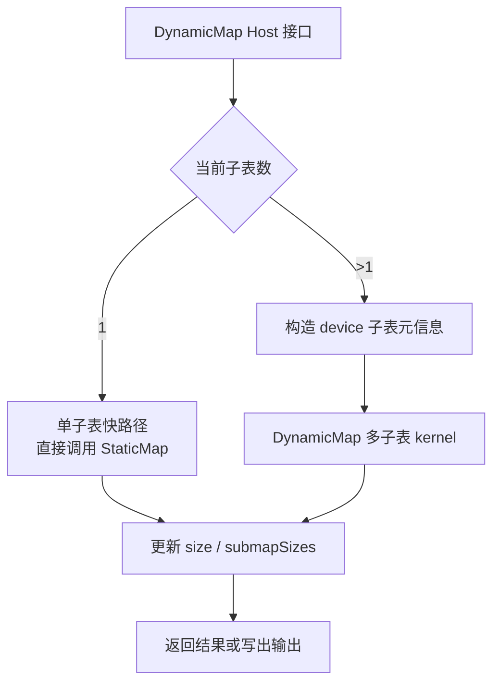
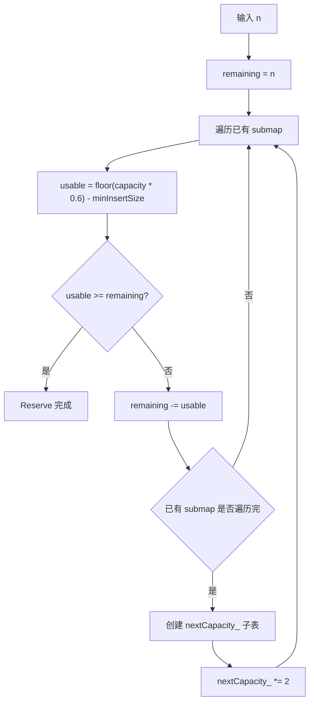
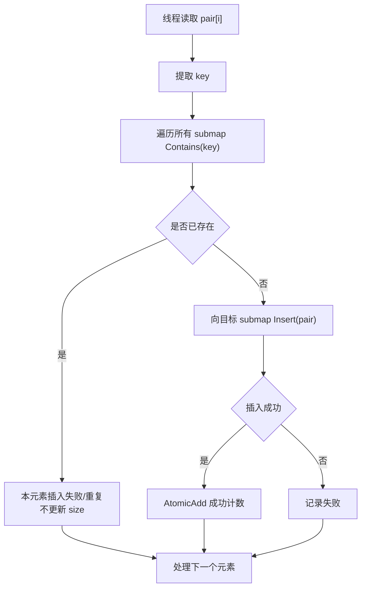
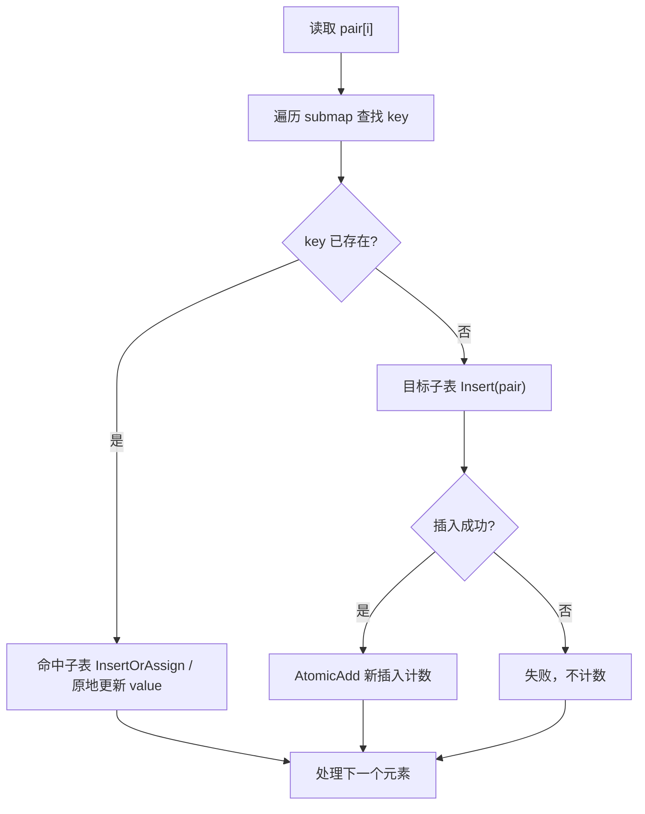
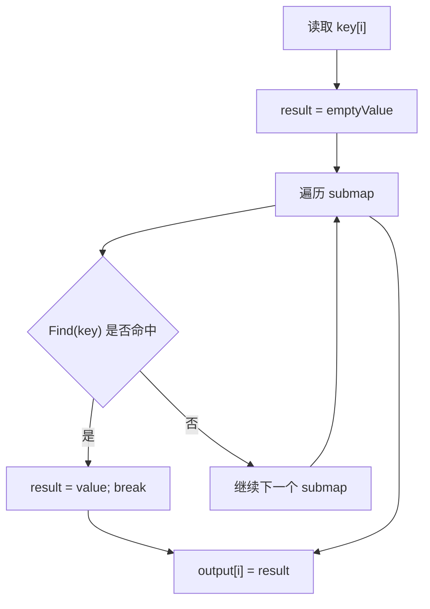
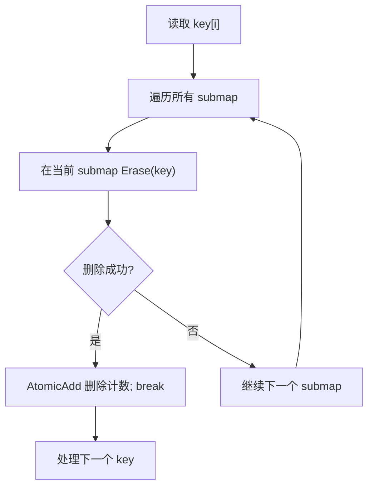

# DynamicMap 容器设计文档

# 需求背景（required）

## 需求来源

本任务来源于 CANN 社区任务 2026 的 5 月任务 `dynamicMap_task_doc`，任务编号为 `20260529-5`，团队名称为 `Dryoung`，目标容器为 `DynamicMap`。任务要求参考 NVIDIA cuCollections 中的 `dynamic_map` 容器，在昇腾 NPU 上基于 Ascend C / C++ 实现功能一致的动态哈希表容器及相关算子，完成容器设计、开发、测试与性能验证，并在验收通过后提交至昇腾算子开源仓。

任务基础信息如下：

| 项目 | 内容 |
| --- | --- |
| 技术标签 | 算子开发、框架开发 |
| 任务编号 | `20260529-5` |
| 团队名称 | `Dryoung` |
| 容器名称 | `DynamicMap` |
| 适配硬件 | Atlas 950 系列产品 |
| 目标开源仓 | `https://gitcode.com/cann/ops-collections` |
| 开发语言 | Ascend C、C++ |
| 对齐对象 | cuCollections `dynamic_map` |

## 背景介绍

`DynamicMap` 是一种支持动态增长的并发哈希表容器，用于在 device 侧存储唯一 key 对应的 value。与定容的 `StaticMap` 不同，`DynamicMap` 需要在插入数据规模增长时自动扩容，并保证 `Find`、`Contains`、`Erase`、`InsertOrAssign` 等操作在扩容前后保持一致语义。

cuCollections 的 `dynamic_map` 并不是在单表上原地 rehash，而是在 host 侧维护多个 `static_map` 子表。当已有子表达到设定负载阈值时追加新的子表，查询和删除时跨所有子表进行查找。该结构适合复用 ops-collections 仓库中已有的 `StaticMap`、开放寻址实现与 device kernel。

本设计采用“多 StaticMap 子表 + host 编排 + device 跨表核函数”的方案：

1. 底层复用 ops-collections 已有 `StaticMap` 的开放寻址哈希表能力。
2. `DynamicMap` 在 host 侧维护多个子表、容量增长策略、元素数量和子表元信息。
3. 多子表场景下，新增 DynamicMap device kernel 完成跨子表查找、插入、更新、删除与结果合并。
4. 通过 `Reserve` 控制容量增长，不对已有数据做迁移，降低扩容开销。

## 现有实现分析

ops-collections 仓库中已有 `StaticMap` 相关实现，主要包括：

| 模块 | 典型文件 | 作用 |
| --- | --- | --- |
| 容器接口 | `include/static_map.h` | 提供 `StaticMap` host 侧接口 |
| device 引用 | `include/static_map_ref.h` | 在 kernel 中操作单张哈希表 |
| 开放寻址实现 | `include/detail/open_addressing/open_addressing_ref_impl.h` | 单表 `Insert` / `Find` / `Contains` / `Erase` 等核心逻辑 |
| kernel 启动 | `include/detail/open_addressing/kernels.h` | AIV 核并行执行插入、查询、删除等操作 |
| 功能测试 | `tests/static_map/` | static_map 精度与功能验证 |
| 性能测试 | `tests/performance/static_map/` | static_map 性能基线 |

`StaticMap` 已经支持模板化 key/value 类型、hash、比较器、探测策略和存储策略。本任务的主要新增内容是 `DynamicMap` 的扩容管理和跨子表操作，而不是重写单表哈希表。

# 需求分析（required）

## 需求描述

实现 `DynamicMap<Key, Value>` 容器，使其在 Atlas 950 系列产品上支持如下能力：

1. 支持构造、析构、`Insert`、`Erase`、`Find`、`Contains`、`Reserve`、`InsertOrAssign`。
2. key 与 value 支持 `uint16`、`uint32`、`uint64`、`float32`。
3. 接口入参顺序与 cuCollections 保持一致；当前 Ascend C 缺少 device iterator，因此用 `void* 起始地址 + Extent 元素个数` 替代 `[first, last)`。
4. 支持泛化合法输入，包括空输入、小规模输入、大规模输入、重复 key、跨批次扩容、不同命中率查询和删除。
5. 精度结果与 host 侧预期实现、ops-collections `tests/static_map` 的测试口径一致。
6. 性能达到任务书要求：I32 / I16 场景整体性能达到 0.7 倍 A100 基线，I64 场景整体性能达到 0.5 倍 A100 基线。

## 需求拆解

| 编号 | 需求项 | 设计拆解 |
| --- | --- | --- |
| 1 | 动态容量增长 | host 侧维护 `submaps_`，按负载阈值追加新的 `StaticMap` 子表 |
| 2 | 插入唯一 key | 单子表复用 `StaticMap::Insert`；多子表先跨表查重，再插入目标子表 |
| 3 | 查询 value | 跨所有子表查找，找到后写出 value，未找到写出 `emptyValue` |
| 4 | 判断存在性 | 跨所有子表查询，任一子表命中则输出 true |
| 5 | 删除 key | 跨所有子表删除，最多删除一个匹配 key；删除后不缩容 |
| 6 | 插入或更新 | 命中已有 key 时更新 value；不存在时插入目标子表 |
| 7 | erase 正确性 | 引入 `erasedKey` tombstone 语义，避免开放寻址删除后破坏探测链 |
| 8 | size 维护 | host 侧维护总元素数量和各子表元素数量 |
| 9 | dtype 覆盖 | 模板化实现并补齐 `uint16_t` / `uint32_t` / `uint64_t` / `float` 测试 |
| 10 | 性能达标 | 单子表快路径、多子表 device 合并、批处理和低负载探测控制 |

## 接口设计

`DynamicMap` 接口遵循 ops-collections 现有风格，使用 `void*` 表示 device 数据起始地址，使用 `Extent` 表示元素个数，使用 `aclrtStream` 表示执行流。

```cpp
template <class Key,
          class T,
          class Extent = aclco::Extent<size_t>,
          class KeyEqual = aclco::EqualTo<Key>,
          class ProbingScheme = aclco::LinearProbing<aclco::murmurhash3_32<Key>>,
          class Storage = aclco::Storage<defaultMapBucketSize>>
class DynamicMap {
 public:
  using SizeType = typename Extent::ValueType;
  using KeyType = Key;
  using MappedType = T;
  using ValueType = aclco::Pair<Key, T>;

  DynamicMap(Extent initialCapacity,
             Key emptyKey,
             T emptyValue,
             Key erasedKey,
             KeyEqual const& pred = {},
             ProbingScheme const& probingScheme = {},
             Storage storage = {},
             aclrtStream stream = nullptr);

  SizeType Insert(void *values, Extent valueNum, aclrtStream stream);
  SizeType Erase(void *keys, Extent keyNum, aclrtStream stream);
  void Find(void *keys, void *outputValues, Extent keyNum, aclrtStream stream);
  void Contains(void *keys, void *outputValues, Extent keyNum, aclrtStream stream);
  void Reserve(SizeType n, aclrtStream stream);
  SizeType InsertOrAssign(void *values, Extent valueNum, aclrtStream stream);

  SizeType Size() const noexcept;
  SizeType Capacity() const noexcept;
};
```

返回值语义按任务书与 cuCollections 口径设计：

| 接口 | 返回值 |
| --- | --- |
| `Insert` | 新插入成功的元素个数 |
| `Erase` | 成功删除的 key 个数 |
| `InsertOrAssign` | 新插入的元素个数；更新已有 key 不计入新增数量 |
| `Find` | 无返回值，结果写入 `outputValues` |
| `Contains` | 无返回值，结果写入 bool / uint8 输出 |
| `Reserve` | 无返回值 |

注意：ops-collections 当前 `StaticMap::Insert` 返回失败个数，`DynamicMap` 对外接口会在 host 侧转换为成功个数，以满足任务书要求。

# 详细设计（required）

## 算子分析

### 数据结构

`DynamicMap` 使用多个定容 `StaticMap` 子表组成一个逻辑 map。

```text
DynamicMap
├── submap[0]: StaticMap(capacity = C)
├── submap[1]: StaticMap(capacity = 2C)
├── submap[2]: StaticMap(capacity = 4C)
└── ...
```

Host 侧状态：

| 字段 | 含义 |
| --- | --- |
| `submaps_` | `StaticMap` 子表数组 |
| `submapSizes_` | 各子表当前元素数量 |
| `size_` | 全局元素数量 |
| `capacity_` | 全部子表容量总和或下一个子表容量管理值 |
| `nextCapacity_` | 下一次新增子表的容量 |
| `maxLoadFactor_` | 子表最大负载因子，默认 0.60 |
| `minInsertSize_` | 预留插入余量，默认 10000，对齐 cuCollections |
| `emptyKey_` | 空槽 key 哨兵 |
| `emptyValue_` | 空 value 哨兵 |
| `erasedKey_` | 删除槽 tombstone 哨兵 |

Device 侧子表描述：

```cpp
template <typename Value>
struct DynamicMapSubmapView {
  __gm__ Value *table;
  uint32_t capacity;
};
```

多子表 kernel 启动前，host 将所有子表的 `Data()` 和 `Capacity()` 写入 device 侧连续数组。kernel 根据 `DynamicMapSubmapView` 构造 `BucketStorageRef` / `StaticMapRef`，完成跨子表操作。

### 设计约束

1. `emptyKey` 和 `erasedKey` 必须不同。
2. 插入数据不得包含 `emptyKey` 或 `erasedKey`。
3. `emptyValue` 用于 `Find` 未命中输出，不作为有效 value 推荐值。
4. key/value 类型大小均不超过 8 字节，继承 `StaticMap` 约束。
5. 对 `float32` key，比较语义沿用 ops-collections 的 `EqualTo<float>` 和已有 hash 行为。

## 算子实现

### 总体方案



单子表快路径尽量保持与 `StaticMap` 相同性能；多子表路径通过一个 kernel 完成跨表查找或合并，避免多次 host/device 往返。

### Reserve 设计

`Reserve(n)` 保证逻辑 map 至少能容纳 `n` 个有效元素。采用 cuCollections 同类策略：已有容量不足时追加新子表，新子表容量按 2 倍增长，不迁移旧数据。



`Reserve` 不改变已有数据的位置，因此已有 device 指针在子表生命周期内保持有效。删除操作不会触发缩容。

### Insert 设计

#### 单子表

当 `submaps_.size() == 1` 时：

1. 调用 `Reserve(size_ + valueNum)`，保证容量充足。
2. 若仍为单子表，直接调用 `StaticMap::Insert`。
3. 将 `StaticMap` 的失败数转换为成功数。
4. 更新 `size_` 与 `submapSizes_[0]`。

#### 多子表

多子表场景必须防止同一个 key 在不同子表中重复存在。设计为跨子表插入 kernel：



为了保证目标子表负载可控，host 侧先调用 `Reserve(size_ + valueNum)`，再按目标子表的剩余可用容量切分批次。若一批数据超过当前活跃子表剩余可用容量，则拆分到后续子表。

### InsertOrAssign 设计

`InsertOrAssign` 需要区分更新和新插入：

1. 跨所有子表查询 key。
2. 如果 key 已存在，直接在命中子表更新 value，不增加 `size_`。
3. 如果 key 不存在，插入目标子表，新插入成功后计入 `size_`。



返回值为新插入数量，不包含更新已有 key 的数量。

### Find 设计

`Find(keys, outputValues, keyNum, stream)` 对每个输入 key 查找其对应 value：

1. 未命中时输出 `emptyValue`。
2. 命中时输出命中子表中的 value。
3. 按子表顺序查找，找到即停止。



单子表时直接调用 `StaticMap::Find`；多子表时使用 DynamicMap `FindKernel`，单个线程负责一个或多个 key，内部遍历子表，避免多次临时 buffer 合并。

### Contains 设计

`Contains(keys, outputValues, keyNum, stream)` 输出每个 key 是否存在。

输出类型建议使用 `bool` 或 `uint8_t`，与 ops-collections 当前 `StaticMap::Contains` 的测试输出约定保持一致。

多子表 kernel 对每个 key 遍历子表，只要任意子表命中即输出 true。

### Erase 设计

开放寻址哈希表删除不能简单把槽位改回 empty，否则会截断探测链，导致同一探测链后续元素无法被查找到。因此 `DynamicMap` 设计中必须支持 `erasedKey` tombstone：

1. 删除命中 key 时将 key 写为 `erasedKey`，value 写为 `emptyValue` 或保持无效值。
2. `Find` / `Contains` 遇到 `erasedKey` 时继续探测，不能提前结束。
3. `Insert` 遇到 `erasedKey` 时允许复用该槽。
4. `emptyKey` 仍表示从未使用过的空槽，查询遇到 `emptyKey` 可以提前结束。



若当前 `StaticMap` 仅支持 empty sentinel 删除，则需要扩展 `OpenAddressingRefImpl` 的比较逻辑，使其同时识别 `emptyKey` 和 `erasedKey`，并在删除、插入、查询路径中分别处理。

### 构造与析构

构造流程：

1. 校验 `initialCapacity > 0`。
2. 校验 `emptyKey != erasedKey`。
3. 根据 `initialCapacity` 创建第一个 `StaticMap` 子表。
4. 初始化 `size_ = 0`，`submapSizes_[0] = 0`。
5. 初始化增长参数：`maxLoadFactor_ = 0.60f`，`minInsertSize_ = 10000`，`growthFactor = 2`。

析构流程：

1. `submaps_` 使用 `unique_ptr` 管理，析构时自动释放 device 内存。
2. device 侧临时元信息 buffer 使用 RAII 封装，避免泄漏。
3. 不额外启动 kernel。

### Host 侧设计

Host 侧主要职责：

1. 参数校验：空指针、元素个数为 0、容量溢出、哨兵冲突。
2. 容量管理：按 `maxLoadFactor_` 和 `minInsertSize_` 判断是否需要新增子表。
3. 批次切分：当一次输入跨越多个子表剩余容量时拆分。
4. 子表元信息准备：将 `Data()` / `Capacity()` / `emptyValue` / `erasedKey` 等 kernel 所需信息写入 device buffer。
5. 计数维护：根据 kernel 返回的成功数或删除数更新 `size_` 和 `submapSizes_`。
6. stream 同步：同步接口在返回前调用 `aclrtSynchronizeStream`，异步接口可作为后续扩展。

### Kernel 侧设计

Kernel 侧使用 SIMT 风格并行，每个线程处理多个输入元素：

```cpp
for (uint32_t i = globalThreadIdx; i < valueNum; i += totalThreadNum) {
  // per-element operation
}
```

核心 kernel：

| kernel | 功能 |
| --- | --- |
| `DynamicMapInsertKernel` | 跨表查重后插入目标子表 |
| `DynamicMapInsertOrAssignKernel` | 跨表查找，命中更新，未命中插入 |
| `DynamicMapFindKernel` | 跨表查找 value |
| `DynamicMapContainsKernel` | 跨表判断 key 是否存在 |
| `DynamicMapEraseKernel` | 跨表删除，使用 tombstone |
| `InitSubmapViews` 或 host memcpy | 初始化 device 子表元信息 |

kernel 中复用 `StaticMapRef` / `OpenAddressingRefImpl`，避免重复实现哈希探测细节。

### 支持硬件

| 支持的芯片版本 | 涉及勾选 |
| --- | --- |
| Atlas 950 系列产品 | √ |

## 算子约束限制

| 项目 | 约束 |
| --- | --- |
| key dtype | `uint16`、`uint32`、`uint64`、`float32` |
| value dtype | `uint16`、`uint32`、`uint64`、`float32` |
| key/value 大小 | 单个 key 与 value 大小均不超过 8 字节 |
| 哨兵 | `emptyKey`、`erasedKey` 不得与有效 key 冲突，且二者不相等 |
| 输入布局 | `values` 为 device 上连续 `Pair<Key, Value>` 数组；`keys` 为 device 上连续 key 数组 |
| 输出布局 | `Find` 输出连续 value 数组；`Contains` 输出连续 bool / uint8 数组 |
| 扩容 | `Reserve` 只增加子表，不迁移旧元素，不缩容 |
| 并发 | 同一个 `DynamicMap` 上并发执行多个修改类接口时需由调用者保证 stream 顺序 |
| 返回语义 | `Insert` / `Erase` / `InsertOrAssign` 返回成功数或新插入数 |

# 可维可测分析

## 精度标准/性能标准

| 验收标准 | 描述 | 标准来源 |
| --- | --- | --- |
| 精度标准 | `Find` / `Contains` / `Erase` / `InsertOrAssign` 结果与 host 侧 `std::unordered_map` 金标准一致 | 任务书与 `tests/static_map` 测试口径 |
| 功能标准 | 覆盖构造、析构、`Insert`、`Erase`、`Find`、`Contains`、`Reserve`、`InsertOrAssign` | 任务书 |
| 泛化标准 | 覆盖常规、边界、重复 key、多子表扩容、不同命中率等合法输入 | 任务书 |
| 性能标准 | I32 / I16 场景整体性能达到 0.7 倍 A100，I64 场景达到 0.5 倍 A100 | 任务书性能表 |

## 测试方案

### 功能测试

计划新增 `tests/dynamic_map/` 目录，按接口拆分测试：

| 测试文件 | 覆盖场景 |
| --- | --- |
| `create_test.cpp` | 构造、容量对齐、哨兵合法性 |
| `destroy_test.cpp` | 析构释放、重复创建销毁 |
| `reserve_test.cpp` | 小于当前容量、等于当前容量、大于当前容量、多次扩容 |
| `insert_test.cpp` | 唯一 key、重复 key、空输入、满载、跨子表插入 |
| `insert_or_assign_test.cpp` | 仅插入、仅更新、插入更新混合、重复 key |
| `find_test.cpp` | 全命中、全不命中、部分命中、跨子表命中 |
| `contains_test.cpp` | 全命中、全不命中、部分命中、跨子表 OR |
| `erase_test.cpp` | 删除存在 key、删除不存在 key、重复删除、删除后再插入 |

dtype 覆盖：

| Key | Value |
| --- | --- |
| `uint16_t` | `uint16_t` |
| `uint32_t` | `uint32_t` |
| `uint64_t` | `uint64_t` |
| `float` | `float` |

必要时增加混合 key/value 组合，验证模板泛化。

### 边界测试

1. `valueNum == 0` / `keyNum == 0`。
2. `values == nullptr` / `keys == nullptr` / `output == nullptr`。
3. `initialCapacity` 很小，强制创建多个子表。
4. 插入元素等于 `emptyKey` 或 `erasedKey` 的非法场景。
5. 删除后探测链仍可查找后续冲突元素。
6. `uint16_t` key 空间较小场景下生成数据不足时跳过或降低规模。

### 金标准比对

host 侧使用 `std::unordered_map<Key, Value>` 维护预期状态：

1. `Insert`：不存在时插入，已存在时保持原 value。
2. `InsertOrAssign`：不存在时插入，已存在时更新 value。
3. `Erase`：存在时删除，不存在时无影响。
4. `Find`：存在输出 value，不存在输出 `emptyValue`。
5. `Contains`：存在输出 true，否则 false。

每个 device 结果拷回 host 后与金标准逐项比对。

## 性能测试方案

计划新增 `tests/performance/dynamic_map/`，按任务书表格参数注册性能测试。

核心场景：

| 接口 | 主要参数 |
| --- | --- |
| `Insert` | `NumInputs = 80000000`，`BatchSize = 800000`，`InitSize = 40000000 / 160000000` |
| `Erase` | `InitSize = 40000000`，`MatchingRate = 0.1 / 0.5 / 1.0` |
| `Find` | `InitSize = 40000000`，`MatchingRate = 0.1 / 0.5 / 1.0` |
| `Contains` | `InitSize = 40000000`，`MatchingRate = 0.1 / 0.5 / 1.0` |
| `Reserve` | `NumInputs = 80000000`，`BatchSize = 800000`，`InitSize = 40000000 / 80000000` |
| `InsertOrAssign` | `NumInputs = 80000000`，`BatchSize = 800000`，`InitSize = 40000000 / 160000000` |
| 创建 / 销毁 | `InitSize = 40000000` |

性能优化关注点：

1. 单子表场景直接复用 `StaticMap`，减少 DynamicMap 额外开销。
2. 多子表场景用一个 kernel 跨表查找，减少临时 buffer 和多次 kernel 启动。
3. 控制 `maxLoadFactor`，降低开放寻址长探测链。
4. `uint16_t` 使用 32-bit packed CAS 路径，提高 I16 场景吞吐。
5. 对 80M 数据按 800K batch 批处理，避免一次性临时资源过大。

## 兼容性分析

本方案对现有 `StaticMap` 的公开接口保持兼容。`DynamicMap` 作为新增容器加入 `include/dynamic_map.h`，功能测试和性能测试分别新增目录，不影响已有 `static_map` / `static_set` 用例。

若实现 `erasedKey` tombstone 需要扩展底层 `OpenAddressingRefImpl`，应保持原 `StaticMap` 构造接口兼容：未显式传入 `erasedKey` 的旧路径可继续使用原行为；DynamicMap 使用带 `erasedKey` 的路径以保证删除后探测链正确。

## 风险与规避措施

| 风险 | 影响 | 规避措施 |
| --- | --- | --- |
| 删除写回 empty 导致探测链断裂 | `Find` / `Contains` 删除后结果错误 | 引入 `erasedKey` tombstone，补充碰撞链回归测试 |
| `StaticMap` 返回失败数而任务书要求成功数 | 接口语义不一致 | DynamicMap 对外统一返回成功数，并在 README 中说明 |
| 多子表跨表查重开销高 | 插入和更新性能下降 | 单子表快路径；多子表仅在扩容后启用；子表数按 2 倍增长控制 |
| `uint16_t` key 空间有限 | 80M unique 无法由 uint16 key 单独表达 | 性能场景按任务书 I16 数据生成规则执行；功能测试中对 unique 数量做合法上限处理 |
| float key 比较语义 | NaN、哨兵、精度比较可能不稳定 | 沿用仓库 `EqualTo<float>` 和 hash 语义，测试中避免使用 NaN 作为有效 key |
| device 子表元信息管理 | 临时内存泄漏或同步错误 | 使用 RAII device buffer，所有同步接口返回前同步 stream |

## 自验证交付计划

设计评审通过后，按以下顺序完成交付：

1. 提交 `DynamicMap` 容器与 kernel 实现。
2. 补齐 `tests/dynamic_map/` 功能用例并全部通过。
3. 补齐 `tests/performance/dynamic_map/` 性能用例，输出与 A100 基线对比结果。
4. 编写 README，包含接口、参数、返回值、约束、示例和构建测试说明。
5. 编写自验证报告，包含功能日志、整体测试通过截图、性能数据截图和复现命令。
