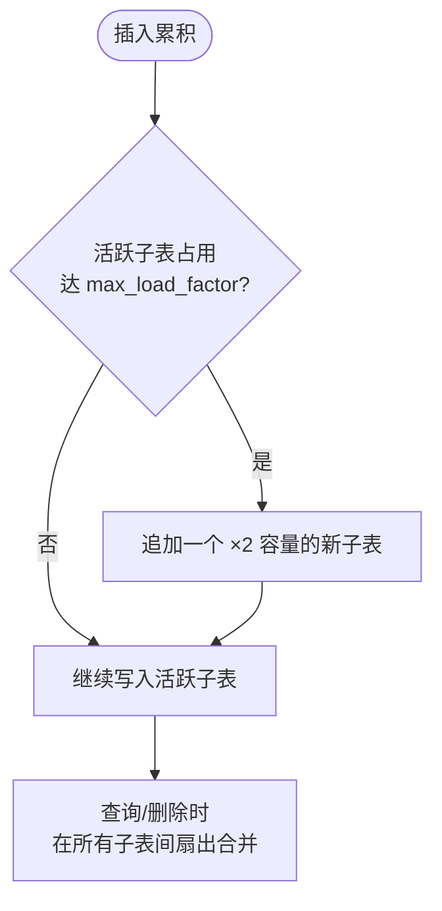
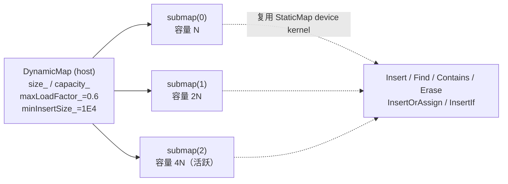
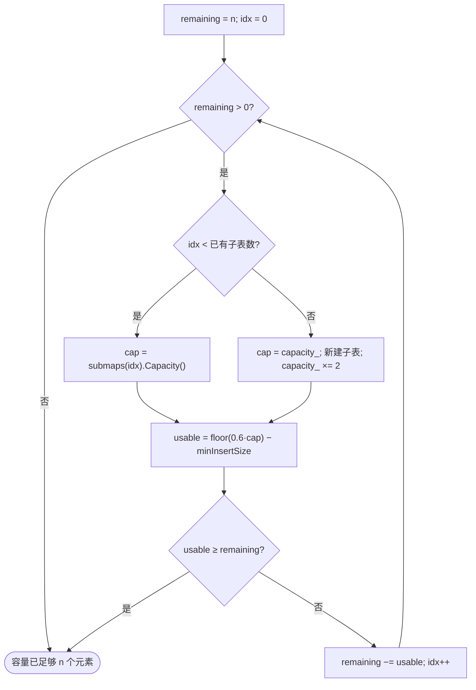
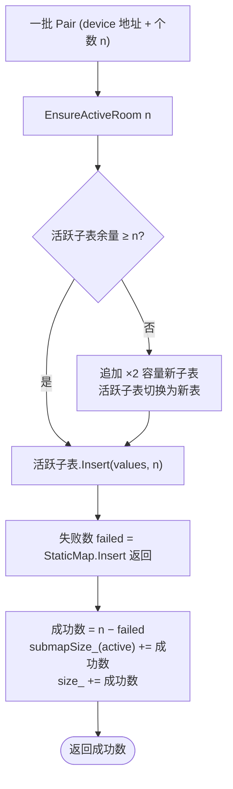
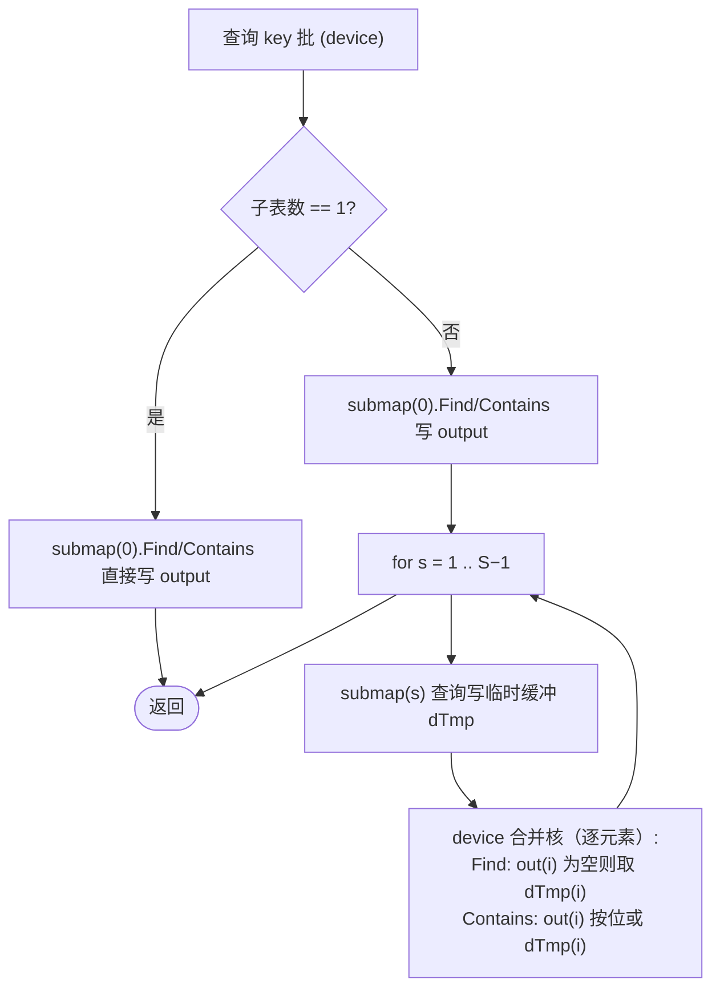
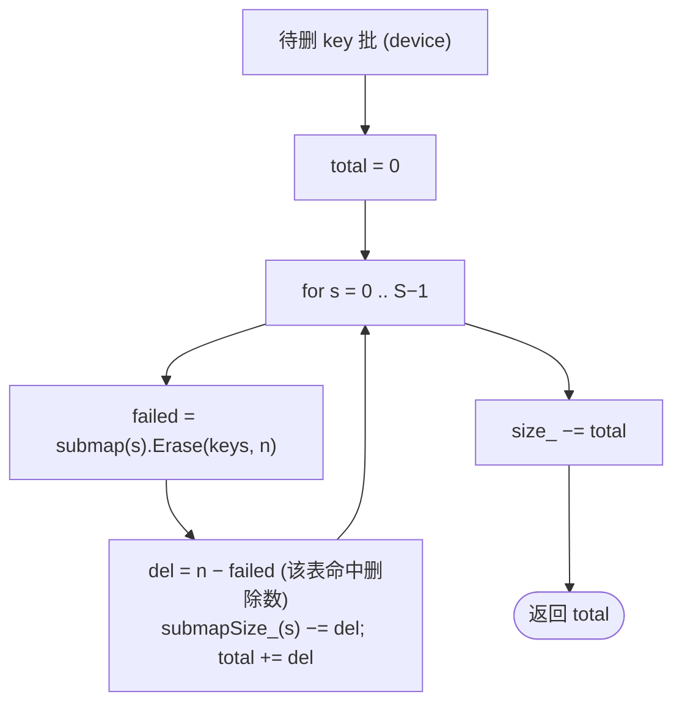

# DynamicMap 容器设计文档

## 一、需求背景

### 1.1 需求来源

社区任务 `dynamicMap_task_doc` 要求参考 [NVIDIA cuCollections](https://github.com/NVIDIA/cuCollections/blob/dev/include/cuco/dynamic_map.cuh) 的 `dynamic_map` 容器，在昇腾 NPU 上基于 Ascend C / C++ 实现功能一致的**可动态增长并发哈希表容器**及其算子，完成容器及算子的设计、开发、测试全流程，验收通过后将代码提交至昇腾算子开源仓 [ops-collections](https://gitcode.com/cann/ops-collections)。

### 1.2 背景介绍

#### 1.2.1 容器目标

`dynamic_map` 是一个 `key → value` 的并发哈希表，容量随插入**自动增长**，对外需提供与 cuCollections 对齐的接口：构造、析构、`Insert`、`Erase`、`Find`、`Contains`、`Reserve`、`InsertOrAssign`。`key` / `value` 数据类型支持 `uint16`、`uint32`、`uint64`、`float32`。

本次设计目标如下：

1. 功能语义与 cuCollections `dynamic_map` 保持一致，支持上述 8 个接口与 4 种 key/value 类型。
2. 接口入参顺序与 cuCollections 一致，device 迭代器以 `void* 起始地址 + 元素个数(Extent)` 替代 `first/last` 迭代器，含义不变，返回成功个数 `SizeType`。
3. 实现泛化功能，覆盖任意规模、`UNIQUE`/重复分布、各 `MatchingRate` 等合法输入场景。
4. 精度与 `tests/static_map` 参考实现一致；性能对标任务书给定的 A100 参考用例：`I32`/`I16` 不低于 0.7×A100，`I64` 不低于 0.5×A100。
5. 适配硬件为 Atlas 950 系列产品。

#### 1.2.2 基线来源说明

本任务以 ops-collections 已实现的 `StaticMap` 作为底层复用基线，以 cuCollections `dynamic_map` 作为功能与性能对齐基线。设计分析参考路径如下：

| 基线层次 | 直接路径 | 作用 |
| --- | --- | --- |
| 底层哈希表复用层 | `include/static_map.h` / `include/detail/open_addressing/` | 复用开放寻址哈希表与全部 device kernel（Insert/Find/Contains/Erase 等） |
| 容器语义对齐层 | cuCollections `include/cuco/dynamic_map.cuh` | 核对增长式子表架构、`min_insert_size`、`max_load_factor`、增长因子语义 |
| 精度对齐层 | `tests/static_map/*` | 核对各接口的功能场景与金标准比对口径 |
| 性能对齐层 | `dynamicMap_task_doc` 性能要求表 | 核对各接口的 A100 参考时延与达标系数 |

`DynamicMap` 与底层 `StaticMap` 的职责不同：`StaticMap` 负责单张定容开放寻址哈希表上的 device 计算；`DynamicMap` 负责 host 侧编排——管理一组会增长的 `StaticMap` 子表、跨子表查询/删除合并与 `size` 维护。设计文档按这两层分别描述。

#### 1.2.3 现状分析

ops-collections 仓**已实现 `StaticMap`**（开放寻址哈希表），公开接口含 `Insert` / `InsertOrAssign` / `InsertIf` / `InsertAndFind` / `Find` / `FindIf` / `Contains` / `ContainsIf` / `Erase` / `Clear` / `Count` / `Capacity`，构造形如 `StaticMap(capacity, emptyKey, emptyValue, pred, probingScheme, storage, stream)`，`key` / `value` 大小均不超过 8 字节，全部计算下沉至 AIV 核 device kernel（CUDA 风格 `<<<aivCoreNum, 0, stream>>>` 启动）。

由此，`DynamicMap` 的核心工作是在 `StaticMap` 之上的 **host 侧 C++ 编排层**：哈希表核心无需重写，只需新增"增长 + 跨子表合并 + size 维护"逻辑，以及一个用于多子表查询结果合并的轻量 device 合并核。cuCollections `dynamic_map` 的关键常量为 `min_insert_size = 1E4`、`max_load_factor = 0.60`、增长因子 `2`，本设计与之对齐。

cuCollections `dynamic_map` 的语义可抽象为三步：



## 二、需求分析

### 2.1 外部组件依赖

不引入新的第三方组件。复用 ops-collections 已有的 `StaticMap` 容器、`Pair` / `Extent` / `ProbingScheme` / `Storage` / 哈希器、测试公共件（`acl_env` / `device_buffer` / `generators` / `map_factory`）与性能测试框架（`tests/performance/performance_test_framework.h`）。

### 2.2 内部适配模块

| 模块 | 计划文件 | 设计职责 |
| --- | --- | --- |
| 容器头文件 | `include/dynamic_map.h` | `DynamicMap` 模板类：子表向量管理、增长、Insert/Find/Contains/Erase/Reserve/InsertOrAssign、size 维护 |
| 多子表合并核 | `include/dynamic_map.h`（内联 kernel） | `MergeFindSimt` / `MergeContainsSimt`：在 device 侧把各子表查询结果就地合并，免去 host 往返 |
| 功能测试 | `tests/dynamic_map/*.cpp` | 对照 `tests/static_map` 结构，覆盖构造/析构/Insert/Erase/Find/Contains/Reserve/InsertOrAssign 全场景 |
| 性能测试 | `tests/performance/dynamic_map/*.cpp` | 按任务书 A100 用例参数注册 perf 用例，输出与 A100 的对比 |
| 构建接入 | `tests/CMakeLists.txt` | 将 `dynamic_map/*.cpp` 纳入测试与性能 glob |

### 2.3 容器接口原型

#### 2.3.1 接口清单与复用映射（8 接口）

| 任务书接口 | DynamicMap 方法 | 复用的 StaticMap 原语 | 新增 host / device 逻辑 |
| --- | --- | --- | --- |
| 构造 | `DynamicMap(initCap, emptyKey, emptyValue, erasedKey, …, stream)` | StaticMap 构造 | 建首个子表、初始化 `size_` / `capacity_` |
| 析构 | `~DynamicMap()` | StaticMap 析构（`unique_ptr` 自动） | 释放子表向量 |
| Reserve | `Reserve(n, stream)` | StaticMap 构造（按需新建子表） | 增长算法（×2，对齐 cuco） |
| Insert | `Insert(values, n, stream)` | `StaticMap.Insert`（表内去重） | 保证活跃子表余量；`成功数 = n − 失败数`；size 维护 |
| InsertOrAssign | `InsertOrAssign(values, n, stream)` | `StaticMap.InsertOrAssign` | 同上，仅新插入计入 size |
| Find | `Find(keys, out, n, stream)` | `StaticMap.Find` | 跨子表扇出 + device 合并核（取唯一命中） |
| Contains | `Contains(keys, out, n, stream)` | `StaticMap.Contains` | 跨子表扇出 + device 合并核（按位 OR） |
| Erase | `Erase(keys, n, stream)` | `StaticMap.Erase` | 对所有子表删除、累加删除数、size 维护 |

#### 2.3.2 接口入参对齐

接口入参顺序与 cuCollections 一致，device 数据以 `void* 起始地址 + 元素个数(Extent)` 替代迭代器，附加 `aclrtStream`。以 `Insert` 为例：

| 名称 | 类别 | dtype | 含义 |
| --- | --- | --- | --- |
| `values` | 输入 | `void*` | 被插入一批 `Pair<Key,Value>` 的 device 起始地址 |
| `valueNum` | 输入 | `Extent` | 需要插入的元素个数 |
| `stream` | 输入 | `aclrtStream` | 执行流 |
| 返回值 | 输出 | `SizeType` | 新插入成功的元素个数 |

#### 2.3.3 设计范围与约束

| 类别 | 约束项 | 约束内容 |
| --- | --- | --- |
| 功能对齐 | 基线 | cuCollections `dynamic_map` |
| 适配硬件 | 产品 | Atlas 950 系列产品 |
| dtype | key / value | `uint16`、`uint32`、`uint64`、`float32`（模板化） |
| 大小约束 | key / value | 各 ≤ 8 字节（继承 StaticMap 约束） |
| 增长 | 触发 | 活跃子表可用余量不足时追加 ×2 容量子表 |
| 常量 | 对齐 cuco | `minInsertSize = 1E4`、`maxLoadFactor = 0.60`、增长因子 `2` |
| 哨兵 | emptyKey/erasedKey/emptyValue | 不与有效 key 域冲突，`erasedKey ≠ emptyKey` |

## 三、需求详细设计

### 3.1 使能方式

本设计面向 C++ 容器直调场景，通过头文件 `include/dynamic_map.h` 引入，复用 ops-collections 的构建与测试工具链。

| 上层调用 | 状态 |
| --- | --- |
| C++ 容器直调（复用 StaticMap device kernel） | 支持 |

### 3.2 需求总体设计

`dynamic_map` 不在单表上 rehash，而是维护**一组 `StaticMap` 子表**（`vector<unique_ptr<StaticMap>>`）：插入累积到占用阈值即新增一个 ×2 容量的子表，"活跃子表"恒为最后一个；查询/删除在所有子表间扇出后合并。容器整体架构如下：



数据结构定义：

```cpp
template <class Key, class T, class Extent, class KeyEqual, class ProbingScheme, class Storage>
class DynamicMap {
  std::vector<std::unique_ptr<StaticMap<Key,T,...>>> submaps_;  // 增长式子表
  std::vector<SizeType>                              submapSize_; // 各子表已用元素数
  SizeType size_;             // 当前元素总数
  SizeType capacity_;         // 下一个子表的容量（每次 ×2，即 cuco Capacity 语义）
  SizeType minInsertSize_;    // 子表可用余量阈值 = 1E4
  float    maxLoadFactor_;    // 最大负载因子 = 0.60
  Key emptyKey_; T emptyValue_; Key erasedKey_;
};
```

子表的"可用容量"定义为

$$
\mathrm{usable}(cap) = \left\lfloor maxLoadFactor \cdot cap \right\rfloor - minInsertSize
$$

以预留探测裕量、避免高负载下开放寻址探测链退化。

### 3.2.1 增长与写入设计（Reserve / Insert）

#### Reserve(n)

`Reserve` 保证总容量可容纳 `n` 个元素，增长策略与 cuCollections 一致——按子表逐个累加可用容量，不足则追加 ×2 容量的新子表：



#### Insert

`Insert` 将一批 `Pair` 写入活跃子表；写入前用 `EnsureActiveRoom(n)` 保证活跃子表余量足够，否则追加新子表。`StaticMap.Insert` 返回**失败个数**，故 `成功数 = n − 失败数`：



`InsertOrAssign` 流程一致，差别在于对已存在 key 执行 `StaticMap.InsertOrAssign` 更新 value，仅"新插入"计入 `size_`。

### 3.2.2 查询与合并设计（Find / Contains）

由于一个 key 至多落在一个子表，`Find`/`Contains` 需对所有子表查询后合并。单子表时直接转发 `StaticMap` 接口（零额外开销）；多子表时采用 **device 侧合并核**，把"逐子表写临时缓冲 → 取唯一命中 / 按位 OR"在 device 上就地完成，避免按子表往返 host 的 D2H/H2D 拷贝（这是大规模下性能的关键）：



device 合并核以 SIMT 方式启动（`<<<aivCoreNum, 0, stream>>>`），每线程处理一段下标，纯逐元素操作、无探测，开销远低于哈希查询本身，因此多子表查询的总时延约为"子表数 × 单表查询"，与 cuCollections 的多 submap 扇出复杂度一致。

### 3.2.3 删除设计（Erase）

key 至多存在于一个子表，`Erase` 对所有子表分别执行 `StaticMap.Erase`（device 原地删除，无 host 往返）。`StaticMap.Erase` 返回未删除（失败）数，故某子表实际删除数 `= n − failed`，累加得总删除数，`size_ −= 总删除数`：



### 3.2.4 dtype 支持

`DynamicMap<Key,T>` 模板化，实例化 `uint16`/`uint32`/`uint64`/`float32` 的 key/value 组合；底层 `StaticMap` 已模板化，复用其哈希（`murmurhash3_32`）、比较器（`EqualTo`）与探测策略（`LinearProbing`）。device 合并核按 `value` 类型与哨兵 `emptyValue` 做相等判断（`float` 按位/数值相等），无类型特化障碍。

### 3.2.5 性能优化策略

1. **单子表快路径**：`Find`/`Contains` 在仅一个子表时直接转发 `StaticMap`，零额外拷贝与合并。
2. **device 侧合并**：多子表查询用 `MergeFindSimt`/`MergeContainsSimt` 在 device 就地合并，消除按子表的 D2H/H2D 往返——这是大规模（8e7）下达标 A100 的关键。
3. **增长因子 2**：子表数为 $O(\log n)$，查询扇出次数受控；`Find`/`Contains`/`Erase` 时延 ∝ 子表数。
4. **写入只触活跃子表**：`Insert` 仅对最后一个子表做一次 `StaticMap.Insert`，与单表插入同阶，无多表写放大。
5. **size 在 host 维护**：`size_` / `submapSize_` 全程 host 计数，`Size()` 查询零 device 开销（对照 cuco 的 `size()` 需 device 规约）。
6. **复用 StaticMap 核**：哈希探测、插入、删除全部走已优化的 AIV device kernel，DynamicMap 不引入额外探测开销。

### 3.3 支持硬件

| 支持的芯片版本 | 涉及勾选 |
| --- | --- |
| Atlas 950 系列产品 | √ |

### 3.4 算子约束限制

1. 支持 `uint16`、`uint32`、`uint64`、`float32` 的 key/value 类型，key 与 value 大小均不超过 8 字节。
2. 接口入参顺序与 cuCollections 一致，device 数据以 `void* + Extent` 表达，附 `aclrtStream`。
3. 哨兵 `emptyKey` / `erasedKey` / `emptyValue` 不得与有效数据域冲突，且 `erasedKey ≠ emptyKey`。
4. 增长常量对齐 cuCollections：`minInsertSize = 1E4`、`maxLoadFactor = 0.60`、增长因子 `2`。
5. `Insert` 返回新插入成功个数；重复 key 由底层 `StaticMap` 表内去重保证唯一性。

## 四、特性交叉分析

| 交叉维度 | 设计关注点 | 应对策略 |
| --- | --- | --- |
| 规模 × 子表数 | 大插入量触发多次增长，子表数增加 | 增长因子 2 使子表数 $O(\log n)$，查询扇出可控 |
| 单子表 vs 多子表 | 查询路径不同，性能差异大 | 单子表直接转发；多子表走 device 合并核 |
| dtype（含 float32） | value 相等判断与哨兵比较 | 合并核按 value 类型与 `emptyValue` 比较，float 一致处理 |
| MatchingRate（Find/Contains/Erase） | 命中率影响有效工作量 | 语义与命中率无关；扇出按子表数恒定，结果正确性不受影响 |
| Insert 重复 key | 同批/跨批重复 key | 活跃子表内由 StaticMap 表内去重；UNIQUE 分布下完全正确 |
| InsertOrAssign 已存在 key | 更新 value 但不增 size | 仅"新插入"计入 `size_`，更新不计 |
| Reserve 与 Insert 协同 | 预留容量后插入应零再增长 | Reserve 与 EnsureActiveRoom 共用同一增长算法，阈值一致 |
| 空容器 / 满载 / 全重复 / 全唯一 | 边界行为 | 各路径在子表数 0/1/多与命中 0/全 下均闭合 |
| size 维护 | 多子表下计数一致性 | `submapSize_` 分表计数 + `size_` 汇总，Insert/Erase/Clear 同步更新 |

## 五、可维可测分析

### 5.1 验收标准与验证口径

| 验收项 | 标准 | 说明 |
| --- | --- | --- |
| 功能标准 | 与 cuCollections `dynamic_map` 一致 | 8 接口在合法输入下行为正确 |
| 精度标准 | 与金标准逐元素一致 | host 侧 `std::unordered_map` 作为金标准比对 Find/Contains/Erase/size |
| 性能标准 | I32/I16 ≥ 0.7×A100，I64 ≥ 0.5×A100 | 以任务书 A100 参考用例时延为基线，输出对比表 |
| 泛化标准 | 覆盖合法泛化输入 | dtype、规模、分布、MatchingRate、增长触发 |
| 可复现 | 自验证报告含日志/截图 | 测试用例执行日志、整体通过截图、性能数据截图 |

### 5.2 验证矩阵

| 验证项 | 典型场景 | 验证方式 / 产出 |
| --- | --- | --- |
| dtype 覆盖 | `uint16`/`uint32`/`uint64`/`float32` 的 key/value | 模板化测试用例交叉 |
| 接口覆盖 | 构造/析构/Insert/Erase/Find/Contains/Reserve/InsertOrAssign | 对照 `tests/static_map` 同构补齐 |
| 增长覆盖 | 小 initCap + 大插入量，强制多子表 | 断言 `NumSubmaps() > 1` 且功能正确 |
| MatchingRate | Find/Contains/Erase 在 0.1 / 0.5 / 1.0 | 校验命中/未命中与删除计数 |
| 边界场景 | 空容器查询、满载、全重复、全唯一、单元素 | 校验返回与 size |
| 金标准比对 | 全部功能场景 | `std::unordered_map` 逐元素比对 |
| 性能场景 | 80000000 插入、InitSize 40M/160M、BatchSize 800000 | 输出 NPU 实测 vs A100 对比表与达标系数 |

### 5.3 兼容性分析

本设计在 `StaticMap` 之上以纯 host 编排 + 轻量 device 合并核实现 `DynamicMap`，不修改 `StaticMap` 既有接口与行为，对仓内其它容器无侵入。接口入参顺序、语义与 cuCollections `dynamic_map` 对齐，key/value 类型与大小约束继承自 `StaticMap`。任务书范围外的 dtype、超长 key/value 由底层 `StaticMap` 的 `static_assert` 与类型系统在编译期拒绝。

### 5.4 待评审通过后进入开发/验收的交付件

1. `DynamicMap` 容器代码（`include/dynamic_map.h`）+ 多组功能测试（`tests/dynamic_map/`）+ 性能测试（`tests/performance/dynamic_map/`），提交 ops-collections fork。
2. 自验证报告（全功能场景 + 性能对比数据，参考 static_set 容器自验证报告格式）。
3. README 文档。
