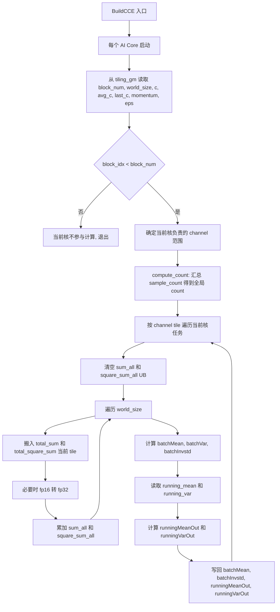
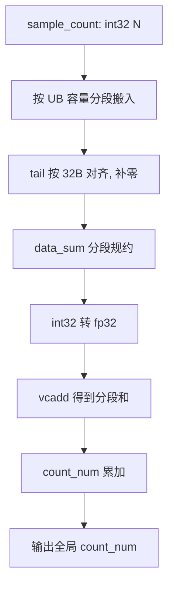
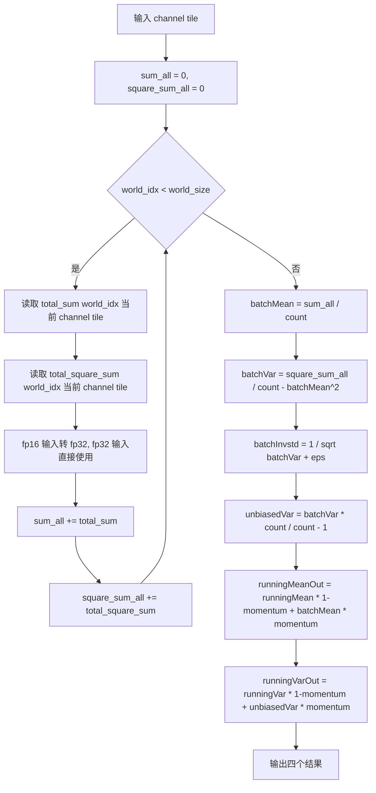
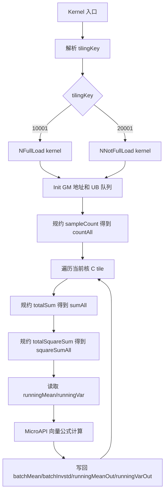

# SyncBatchNormGatherStats 算子设计文档

## 1. 需求来源

### 1.1 任务算子

本设计文档对应 `SyncBatchNormGatherStats` 算子，目标是在 `ops-nn` 仓中补充 AscendC 实现，并验证其计算语义、数据类型、shape 约束和 TBE 参考实现一致。


### 1.2 TBE 源码获取路径

TBE 参考实现来自 CANN 8.5 内置算子包：

```text
/usr/local/Ascend/cann-8.5.0/opp/built-in/op_impl/ai_core/tbe/impl/ops_legacy/dynamic/sync_batch_norm_gather_stats.py
```


### 1.3 参考文件

当前 AscendC 开发工程中的算子信息和接口文件：

```text
norm/sync_batch_norm_gather_stats/docs/aclnnSyncBatchNormGatherStats.md
```

`aclnnSyncBatchNormGatherStats.md` 中描述的公式为：

```text
batchMean  = sum(totalSum) / sum(sampleCount)
batchVar   = sum(totalSquareSum) / sum(sampleCount) - batchMean^2
batchInvstd = 1 / sqrt(batchVar + eps)
runningMean = runningMean * (1 - momentum) + momentum * batchMean
runningVar  = runningVar * (1 - momentum)
            + momentum * batchVar * sum(sampleCount) / (sum(sampleCount) - 1)
```

TBE 源码 `sync_batch_norm_gather_stats.py` 中 `loop_compute` 与 `update_mean_and_var` 执行的也是上述流程：

1. 对 `sample_count` 求和得到全局 `count_num`。
2. 对 `total_sum[world, c]` 按 `world_size` 累加。
3. 对 `total_square_sum[world, c]` 按 `world_size` 累加。
4. 计算 `batch_mean`、`batch_invstd`。
5. 使用 `momentum` 更新 running mean 和 running variance。

因此该 TBE 文件与 aclnn 接口文档的算子名称、输入输出、公式和功能均一致，可以作为 AscendC 实现的参考文件。

## 2. 背景介绍

BatchNorm 训练阶段需要按通道统计当前 batch 的均值和方差，然后使用该统计量对输入做归一化：

```text
mean[c] = sum(x[..., c]) / count
var[c]  = sum(x[..., c]^2) / count - mean[c]^2
y       = (x - mean) / sqrt(var + eps) * gamma + beta
```

单卡 BatchNorm 只使用本卡 mini-batch 的统计量。多卡训练时，如果每张卡独立计算 BatchNorm，等价于把 batch size 拆小，每张卡得到的均值和方差不同，训练稳定性和收敛效果会变差。SyncBatchNorm 的做法是先在每张卡本地规约出每通道统计量，再跨 device 聚合成全局统计量。

`SyncBatchNormGatherStats` 是 SyncBatchNorm 链路里的统计聚合阶段。它不处理原始特征图，而是处理已经准备好的统计输入：

```text
totalSum       : [N, C]
totalSquareSum : [N, C]
sampleCount    : [N]
```

其中 `N` 是参与同步的 device 数或统计组大小，`C` 是通道数。算子输出全局 `batchMean`、`batchInvstd`，并更新推理阶段使用的 running mean 和 running variance。

## 3. TBE 算子支持范围

### 3.1 数据类型和格式

TBE 参考实现 `op_select_format` 中支持：

| 参数 | dtype | format |
| --- | --- | --- |
| `total_sum` | `float32`, `float16` | `ND` |
| `total_square_sum` | `float32`, `float16` | `ND` |
| `sample_count` | `int32` | `ND` |
| `mean` | `float32`, `float16` | `ND` |
| `variance` | `float32`, `float16` | `ND` |
| `batch_mean` | `float32`, `float16` | `ND` |
| `batch_invstd` | `float32`, `float16` | `ND` |
| `running_mean_update` | `float32`, `float16` | `ND` |
| `running_var_update` | `float32`, `float16` | `ND` |


### 3.2 Shape 约束

| 参数 | shape 约束 |
| --- | --- |
| `totalSum` | 2 维，`[N, C]`，`N > 0`，`C > 0` |
| `totalSquareSum` | 2 维，shape 与 `totalSum` 相同 |
| `sampleCount` | 1 维，长度等于 `N` |
| `mean` | 1 维，长度等于 `C` |
| `variance` | 1 维，长度等于 `C` |
| `batchMean` | 1 维，长度等于 `C` |
| `batchInvstd` | 1 维，长度等于 `C` |

## 4. TBE 算子实现描述

### 4.1 TBE tiling 参数

| 下标 | 字段 | 含义 |
| --- | --- | --- |
| 0 | `block_num` | 参与计算的 AI Core 数 |
| 1 | `world_size` | `N` 维长度 |
| 2 | `c` | 通道数 |
| 3 | `avg_c` | 非尾核处理的通道数 |
| 4 | `last_c` | 尾核处理的通道数 |
| 5 | `momentum` | running 统计量更新系数 |
| 6 | `eps` | 方差稳定项 |

### 4.2 TBE 顶层流程图



### 4.3 `compute_count` 流程图



### 4.4 `loop_compute` 流程图




## 5. 外部组件依赖

本算子依赖 CANN 算子开发基础设施 cann9.0.0


## 6. 内部适配模块

| 组件 | 用途 |
| --- | --- |
| `aclnn` 两段式接口 | 对外 API，负责kernel 执行 |
| AscendC 编程接口 | kernel 编写 |

## 7. AscendC 算子原型

### 7.1 aclnn 原型

```cpp
aclnnStatus aclnnSyncBatchNormGatherStatsGetWorkspaceSize(
    const aclTensor *totalSum,
    const aclTensor *totalSquareSum,
    const aclTensor *sampleCount,
    aclTensor *mean,
    aclTensor *variance,
    float momentum,
    float eps,
    aclTensor *batchMean,
    aclTensor *batchInvstd,
    uint64_t *workspaceSize,
    aclOpExecutor **executor);

aclnnStatus aclnnSyncBatchNormGatherStats(
    void *workspace,
    uint64_t workspaceSize,
    aclOpExecutor *executor,
    aclrtStream stream);
```

### 7.2 kernel 逻辑原型

kernel 实际需要 5 个输入和 4 个输出：

```cpp
template <typename T>
__global__ __aicore__ void sync_batch_norm_gather_stats(
    GM_ADDR total_sum,
    GM_ADDR total_square_sum,
    GM_ADDR sample_count,
    GM_ADDR running_mean,
    GM_ADDR running_var,
    GM_ADDR batch_mean,
    GM_ADDR batch_invstd,
    GM_ADDR running_mean_update,
    GM_ADDR running_var_update,
    GM_ADDR workspace,
    GM_ADDR tiling);
```

其中 `T` 根据 `total_sum` dtype 分发为 `float`、`float16_t` 或 `bfloat16_t`。

## 8. AscendC 算子相关约束

### 8.1 数据类型

| 参数 | dtype | format |
| --- | --- | --- |
| `total_sum` | `float32`, `float16` | `ND` |
| `total_square_sum` | `float32`, `float16` | `ND` |
| `sample_count` | `float32`, `float16`, `int32` | `ND` |
| `mean` | `float32`, `float16` | `ND` |
| `variance` | `float32`, `float16` | `ND` |
| `batch_mean` | `float32`, `float16` | `ND` |
| `batch_invstd` | `float32`, `float16` | `ND` |
| `running_mean_update` | `float32`, `float16` | `ND` |
| `running_var_update` | `float32`, `float16` | `ND` |


### 8.2 相关约束

1. `totalSum`、`totalSquareSum` 必须为 2 维，且 shape 完全相同。
2. `sampleCount` 必须为 1 维，长度等于 `totalSum.shape[0]`。
3. `mean`、`variance`、`batchMean`、`batchInvstd` 必须为 1 维，长度等于 `totalSum.shape[1]`。
4. `sampleCount` kernel 当前按 `int32` 处理。
5. dtype 组合需一致：主输入、running 输入和输出应为同一浮点类型。
6. `sum(sampleCount)` 应大于 1，否则无偏方差公式 `count / (count - 1)` 会出现除零或无意义结果。
7. 数据格式为 `ND`。
8. 非连续 tensor 由 aclnn/op_api 层处理，kernel 侧按连续 GM buffer 设计。
9. 算子为确定性计算，不引入随机逻辑。

## 9. 使用方式

用户按 aclnn 两段式接口调用：

```cpp
uint64_t workspaceSize = 0;
aclOpExecutor *executor = nullptr;

auto ret = aclnnSyncBatchNormGatherStatsGetWorkspaceSize(
    totalSum,
    totalSquareSum,
    sampleCount,
    mean,
    variance,
    momentum,
    eps,
    batchMean,
    batchInvstd,
    &workspaceSize,
    &executor);

void *workspace = nullptr;
if (workspaceSize > 0) {
    aclrtMalloc(&workspace, workspaceSize, ACL_MEM_MALLOC_HUGE_FIRST);
}

ret = aclnnSyncBatchNormGatherStats(workspace, workspaceSize, executor, stream);
aclrtSynchronizeStream(stream);
```

输出语义：

```text
batchMean         : 全局 batch 均值
batchInvstd       : 全局 batch 标准差倒数
mean              : 更新后的 running mean
variance          : 更新后的 running variance
```

## 10. Host 侧设计

### 10.1 参数检查

host tiling 阶段完成以下校验：

1. 检查所有输入输出描述和 shape 指针非空。
2. 检查 `totalSum`、`totalSquareSum` 为 2 维且非空。
3. 检查 `sampleCount` 为 1 维且非空。
4. 检查 `mean`、`variance`、`batchMean`、`batchInvstd` 为 1 维且非空。
5. 检查 `totalSquareSum.shape == totalSum.shape`。
6. 检查 `sampleCount.shape[0] == totalSum.shape[0]`。
7. 检查 `mean/variance/batchMean/batchInvstd.shape[0] == totalSum.shape[1]`。
8. 检查 dtype 支持范围和主输入输出 dtype 一致性。

### 10.2 分核策略

算子按 C 维切分，原因是每个 channel 的统计公式相互独立，按 C 切分可以避免跨核写同一输出地址。

设：

```text
N = totalSum.shape[0]
C = totalSum.shape[1]
blockNum = min(可用核数, C 维可切分数量)
```

每个核负责一段连续 C：

```text
core_c_start = 当前核之前所有 C tile 的总和
core_c_len   = 当前核负责的 C 长度
```

尾核处理余数，保证所有 `C` 被覆盖且不重叠。

### 10.3 数据分块与内存优化

核心优化目标是控制 UB 占用并减少 GM 访问：

1. `sampleCount` 只规约一次，结果作为 scalar 在当前核内复用。
2. `totalSum` 和 `totalSquareSum` 按 `[N tile, C tile]` 搬入 UB。
3. 若 `N * C tile` 能进入 UB，选择 full-load 分支，一次 ReduceSum 得到当前 C tile 的 sum。
4. 若 N 维不能完整进入 UB，选择 not-full-load 分支，按 N 分段搬运并折叠缓存中间结果。
5. fp16/bf16 输入搬入后转 fp32 累加，输出时再 cast 到 T。
6. running mean/var 只按当前 C tile 搬入一次。

### 10.4 tilingKey 规划

当前设计两个 tilingKey：

| tilingKey | 分支 | 触发条件 | kernel 文件 |
| --- | --- | --- | --- |
| `10001` | N full load | 当前 `N * C tile` 可放入 UB | `sync_batch_norm_gather_stats_n_full_load.h` |
| `20001` | N not full load | N 维需要分段处理 | `sync_batch_norm_gather_stats_n_not_full_load.h` |


## 11. Kernel 侧设计

### 11.1 总体计算流程



### 11.2 N full load 分支

适用条件：当前 C tile 下，`N * C tile` 的 `totalSum` 与 `totalSquareSum` 能一次放入 UB。

流程：

1. `CopyInN` 搬入全部 `sampleCount`。
2. 使用 `ReduceSum` 得到 `countAll`。
3. 对当前核的每个 C tile：
   - 搬入 `totalSum[N, Ctile]`。
   - 搬入 `totalSquareSum[N, Ctile]`。
   - fp16/bf16 输入先 cast 到 fp32。
   - 使用 `ReduceSum<RA>` 沿 N 维规约，得到 `sumAll[Ctile]` 和 `squareSumAll[Ctile]`。
   - 搬入 `runningMean[Ctile]` 和 `runningVar[Ctile]`。
   - 调用 `NFullLoadBatchNormVF` 完成公式计算。
   - 写回四个输出。

### 11.3 N not full load 分支

适用条件：N 维较大，`N * C tile` 无法一次进入 UB。

流程：

1. `SampleCountProcess` 分段搬入 `sampleCount`，每段转 int64 并累加到缓存，最后得到 `countAll`。
2. 对当前核的每个 C tile：
   - `SumSquareReduceProcess` 分段搬入 `totalSum`，按 N tile 折叠规约到 fp32 cache。
   - `SumSquareReduceProcess` 分段搬入 `totalSquareSum`，同样规约到 fp32 cache。
   - 搬入 `runningMean` 和 `runningVar`。
   - 调用与 full-load 分支相同的向量公式函数。
   - 写回四个输出。

not-full-load 分支和 full-load 分支的数学结果一致，差异只在 N 维规约是否分段以及中间 fp32 cache 的组织方式。


## 12. 测试标准


测试用例覆盖**常规场景、边界场景**等所有功能场景；自验证报告完整、可复现，所有测试用例执行通过。

### 12.1 性能要求

1. 配套Atlas 800T A2，算子整体性能须与现有实现持平，相比TBE性能不劣化（性能不低于原 TBE 算子的 95%）。
2. 如小shape无法达标（100us以下场景超过TBE耗时30%以上），提供性能仿真图和分析结论，证明Ascend C实现与TBE完全一致或优于TBE实现。
3. 配套Atlas 300V Pro，验收算子功能和精度，以配套Atlas 800T A2上性能验证结论为准。

### 12.2 精度要求

Atlas 800T A2和Atlas 300V Pro上的实现，算子计算精度需满足 [AscendOpTest](https://gitcode.com/HIT1920/AscendOpTest) 工具默认阈值。

### 12.3 Atlas 300V Pro，算子接入模型验证

- 验证模型：yolo-world
- 验证数据集：[https://docs.ultralytics.com/zh/datasets/detect/african-wildlife](https://link.gitcode.com/?target=https%3A%2F%2Fdocs.ultralytics.com%2Fzh%2Fdatasets%2Fdetect%2Fafrican-wildlife&from=https%3A%2F%2Fgitcode.com%2Fcann%2Fcann-ops-competitions%2Fblob%2Fmaster%2F04_tasks%2F01_community-task-2026%2Fdocs%2F202605%2FSyncBatchNormGatherStats_task_doc.md&lang=zh&theme=white)
- 模型精度：与Atlas 800T A2 对比，box_loss不超过0.1，cls_loss不超过0.1，dfl_loss不超过0.1