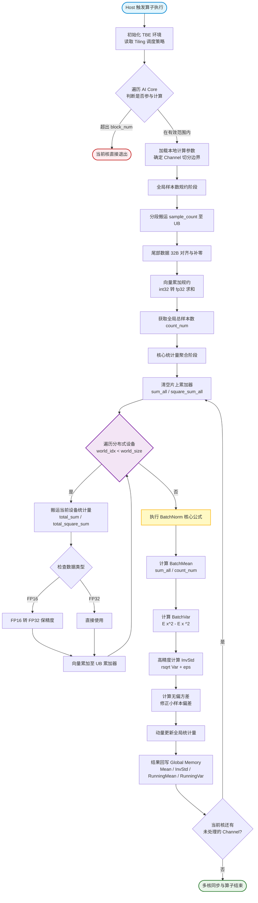
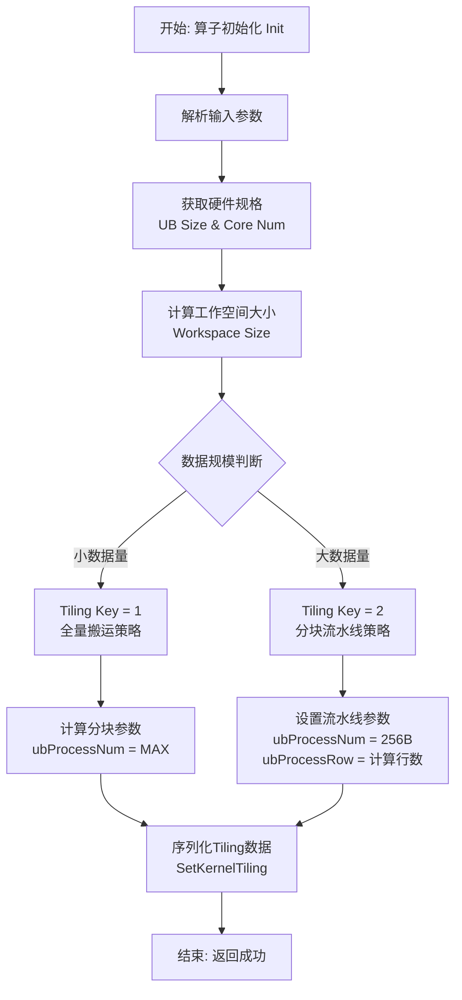
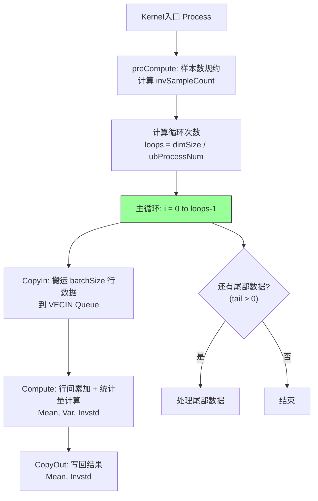
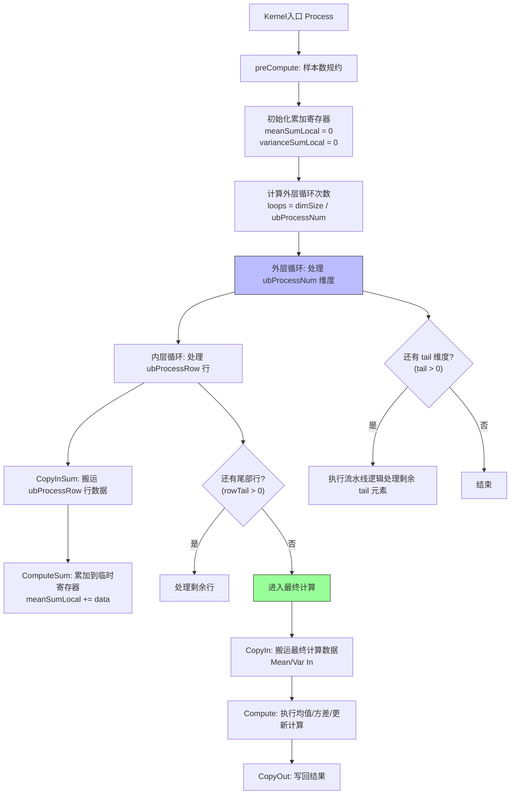

# SyncBatchNormGatherStats 算子开发设计文档

## 一、需求背景

### 1.1 需求来源

参考 `SyncBatchNormGatherStats`算子的功能，在昇腾 NPU 上基于 Ascend C 编程语言实现功能一致的算子，完成算子设计、开发、测试全流程工作，验收通过后将算子提交至昇腾算子开源仓。

### 1.2 背景介绍

#### 1.2.1 算子实现优化

SyncBatchNormGatherStats 算子主要用于分布式训练场景下的同步批归一化层，负责收集所有设备的局部统计量（通道特征和、通道特征平方和、样本计数），计算当前均值和当前方差，并利用动量（momentum）更新运行时的均值和方差。同时，输出当前批次的均值（batchMean）和标准差倒数（batchInvstd），供后续计算使用。

**SyncBatchNormGatherStats算子实现路径和相关API路径**：
- aclnn接口定义：[aclnnSyncBatchNormGatherStats](https://www.hiascend.com/document/detail/zh/CANNCommunityEdition/900/API/aolapi/context/ops-nn/aclnnSyncBatchNormGatherStats.md)；定义算子功能，包含参数说明
- TBE算子实现路径：/usr/local/Ascend/ascend-toolkit/latest/opp/built-in/op_impl/ai_core/tbe/impl/dynamic
- 开源仓Ascend C实现：https://gitcode.com/cann/ops-nn/tree/master/norm/sync_batch_norm_gather_stats

#### 1.2.2 SyncBatchNormGatherStats参数说明

根据PyTorch官方文档，`SyncBatchNormGatherStats`的参数定义如下：

| 名称             | 角色                    | Shape          | 数据类型              | 格式 |
| :--------------- | :---------------------- | :------------- | :-------------------- | :--- |
| total_sum        | 输入                    | [N, C] | FLOAT16、FLOAT        | ND   |
| total_square_sum | 输入                    | [N, C] | FLOAT16、FLOAT        | ND   |
| sample_count     | 输入                    | [N]    | FLOAT16、FLOAT、INT32 | ND   |
| mean             | 输入 | [C]            | FLOAT16、FLOAT        | ND   |
| variance         | 输入  | [C]            | FLOAT16、FLOAT        | ND   |
| momentum         | 属性                    | 标量           | FLOAT(默认0.1)        | -    |
| eps              | 属性                    | 标量           | FLOAT(默认1e-5)       | -    |
| batch_mean       | 输出                    | [C]            | FLOAT16、FLOAT        | ND   |
| batch_invstd     | 输出                    | [C]            | FLOAT16、FLOAT        | ND   |

**约束说明**：
- 参考Ascend C实现，mean和variance在原地更新，只输出batch_mean和batch_invstd两个参数值

#### 1.2.3 SyncBatchNormGatherStats实现描述

根据任务书参数说明及SyncBatchNorm的数学原理，核心计算流程如下：
1.  **当前批次均值和方差计算**：
    *   计算均值：$batchMean = totalSum / sampleCount$
    *   计算方差：$batchVariance = (totalSquareSum - totalSum^2/sampleCount) / sampleCount$
2.  **运行时统计量更新**：
    *   更新均值：$mean = (1-momentum) \times mean + momentum \times batchMean$
    *   更新方差：$variance = (1-momentum) \times variance + momentum \times batchVariance$
3.  **输出计算**：
    *   当前批次均值 `batchMean` 。
    *   当前批次标准差倒数 `batchInvstd` ：$1 / \sqrt{globalVariance + eps}$

#### 1.2.4 TBE算子实现流程

1. 参数校验与初始化：通过@para_check校验输入输出Tensor的合法性（如浮点型与整型匹配）。在__init__中定义GM Tensor映射，并基于硬件规格计算分块参数
2. 全局聚合：在compute入口获取分块信息后，进入loop_compute函数。该函数遍历world_size维度，将各设备的局部total_sum、total_square_sum及sample_count进行累加聚合
3. 统计量计算：基于聚合结果计算全局均值（Mean）和方差（Var），并调用compute_invstd函数计算带平滑项eps的标准差倒数（InvStd）
4. 状态更新与写回：在update_mean_and_var函数中，利用动量公式（Momentum）融合全局统计量与历史Mean/Var，最后将计算结果搬运回GM输出地址

## 二、需求分析

### 2.1 需求描述

使用Ascend C编程语言实现SyncBatchNormGatherStats算子，支持FLOAT16/FLOAT类型的统计量输入与INT32类型的样本计数输入，实现分布式训练中跨设备统计量的全局聚合与滑动平均更新功能，支持momentum和eps属性，适配Atlas 800T A2和Atlas 300V Pro硬件平台。

### 2.2 需求拆解

1. 支持FLOAT16/FLOAT类型total_sum、total_square_sum和INT32类型sample_coun输入
2. 实现全局统计量聚合：遍历N（即设备数）维度，对各设备的局部sum、square_sum及sample_count进行累加，计算全局均值（Mean）与全局方差（Var）
3. 支持数值稳定性保护：在计算标准差倒数时加入eps偏移量，防止浮点精度异常导致的负数开方或除零错误
4. 支持运行时状态更新：根据momentum属性，融合当前批次统计量与历史mean、var，实现原地更新

## 三、需求详细设计

### 3.1 算子分析

本算子主要用于分布式训练中跨设备统计量的全局聚合与滑动平均更新。其核心逻辑是首先遍历所有参与同步的设备，将各设备的局部特征累加和、平方和及样本数进行全局求和，进而计算出当前批次的全局均值与方差。

### 3.2 算子实现

#### 3.2.1 host侧设计

1. **参数初始化**：获取输入张量（total_sum, sample_count等）的形状（Shape）和属性（momentum, eps）。
2. **硬件资源查询**：获取UB（Unified Buffer）大小和可用核心数（CoreNum）。
3. **Tiling策略决策**：根据数据大小选择不同的搬运策略（Key 1 或 Key 2）。
4. **数据分发**：计算每个核负责的数据量（formerDimSize, tailDimSize），并将参数序列化发送给Device侧。

**3.2.1.1 Host侧Tiling流程图**

**3.2.1.2 数据结构和分核策略**

**Tiling数据结构：**
| 字段 | 类型 | 含义 |
| :--- | :--- | :--- |
| batchSize | uint64_t | 统计量的首轴大小（设备数/世界大小） |
| totalDimSize | uint64_t | 通道维度的总大小（C） |
| eps | float | 数值稳定性平滑项 |
| momentum | float | 滑动平均动量系数 |
| formerDimSize | uint64_t | 首核处理的通道数（能被BLOCK_SIZE整除的部分） |
| tailDimSize | uint64_t | 尾核处理的通道数（剩余部分） |
| formerCoreNum | uint64_t | 能完整处理 formerDimSize 的核数 |
| ubProcessNum | int32_t | 单次UB处理的元素个数（宽度） |
| ubProcessRow | int32_t | 单次UB处理的行 |
| countSize | int32_t | 样本计数的维度大小 |

**1. 分核策略：**
按 BLOCK_SIZE对通道维度进行分块，计算formerDimSize和tailDimSize。formerCoreNum表示能完整处理formerDimSize 的核数，确保多核负载均衡。

**2. 数据分块和内存优化策略：**
根据 batchSize * BLOCK_SIZE 的数据量是否能一次性放入 UB 缓存来选择 Tiling Key。
* Key 1 (标准全量搬运)：数据量较小，计算 ubProcessNum 为 UB 能容纳的最大长度，一次性搬运所有数据。
* Key 2 (分块流水线)：数据量较大，固定 ubProcessNum 为 256 字节对齐大小，并计算 ubProcessRow 以适应流水线处理。

**3.2.1.3 TilingKey规划策略**

根据不同的输入输出规模和数据类型，设计不同的 tiling 策略：

| TilingKey | 场景描述 | 分核策略 |
| --- | --- | --- |
| 1 | 小数据量场景，可单次搬运到ub | 一次性将参与计算的所有行（batchSize）的数据全部搬运到UB上进行聚合计算。适用于数据量不大，能充分利用UB带宽的场景 |
| 2 | 大数据量场景 |分多次将数据搬运到UB并进行累加，最后统一计算均值和方差 |

#### 3.2.2 kernel侧设计

**3.2.2.1 kernel侧实现**

核心实现思路分为以下几个步骤：
1. **前置规约计算 (preCompute)**：
   - 将 `sample_count` 从 Global Memory 搬运到 UB，进行 `ReduceSum` 规约求和。
   - 计算 `invSampleCount = 1 / sum`，为后续计算均值做准备（使用乘法代替除法，提升性能）。

2. **全局统计量聚合**：
   - **Key 1 (全量搬运)**：利用双缓冲机制，一次性将 `batchSize` 行数据搬运到 UB。对 `total_sum` 和 `total_square_sum` 进行行间累加（Add），得到全局特征和与全局平方和。
   - **Key 2 (分块流水线)**：采用流水线方式，分多次搬运数据到 UB。使用局部寄存器（Local Tensor）暂存累加结果，循环处理 `ubProcessRow` 行数据，直至所有数据累加完毕。

3. **统计量计算与状态更新**：
   - **计算均值与方差**：
     - `mean = sum * invSampleCount`
     - `var = (square_sum - sum^2 * invSampleCount) * invSampleCount`
   - **计算标准差倒数**：`invstd = 1 / sqrt(var + eps)`，加入 `eps` 偏移量防止除零错误。
   - **动量更新**：融合当前批次统计量与历史 `mean` 和 `variance`，实现原地更新（`running_mean = (1-momentum)*running_mean + momentum*batchMean`）。

4. **数据输出**：
   - 将最终计算得到的 `batch_mean` 和 `batch_invstd` 从 Unified Buffer 写回 Global Memory，处理边界情况确保所有数据正确输出。

**3.2.2.2 AscendC实现流程图**

**策略一：Key 1（全量搬运策略）**

**适用场景**：数据量较小，batchSize * BLOCK_SIZE能一次性放入UB

**核心逻辑**：一次性将所有数据搬入UB，进行行间累加，然后直接计算统计量

**策略二：Key 2 (分块流水线策略)**

**适用场景**：数据量过大，无法一次性放入UB

**核心逻辑**：采用流水线方式，分多次搬运数据到UB，使用局部寄存器（Local Tensor）暂存累加结果，最后进行最终计算

### 3.3 支持硬件

| 支持的芯片版本 | 是否勾选 |
| :-- | :-- |
| Atlas 800T A2 | √ |
| Atlas 300V Pro | √ |

### 3.4 算子约束限制

*   **维度约束**：`total_sum` 和 `total_square_sum` 必须是2维 Tensor ([N, C])，`sample_count` 必须是1维 Tensor ([N])。
*   **数据类型约束**：`total_sum` 和 `total_square_sum` 支持 FLOAT16/FLOAT；`sample_count` 支持 INT32/FLOAT；`mean` 和 `variance` 支持 FLOAT16/FLOAT。
*   **内存约束**：Unified Buffer (UB) 使用量不能超过硬件限制，需通过 Tiling 策略（Key 1 / Key 2）严格控制单次搬运的数据量。
*   **数值稳定性**：在累加过程中需注意浮点数精度丢失问题，计算方差和标准差倒数时必须加入 `eps` 平滑项，防止负数开方或除零异常。
---

## 四、可维可测分析

### 4.1 精度标准/性能标准

| 验收标准 | 描述                                            | 标准来源 |
| ---- | --------------------------------------------- | ---- |
| 精度标准 | 满足AscendOpTest工具默认阈值                          | 任务书  |
| 性能标准 | 性能不低于原 TBE 算子的 95% | 任务书  |

### 4.2 模型验证

- 验证模型：Yolo-world
- 验证数据集：https://docs.ultralytics.com/zh/datasets/detect/african-wildlife
- 精度标准：与Atlas 800T A2 对比，box_loss不超过0.1，cls_loss不超过0.1，dfl_loss不超过0.1