# SyncBatchNormGatherStats 算子设计文档

# 一、需求背景

## 1.1 需求来源

社区任务（任务序号 20260529-7）：基于 `SyncBatchNormGatherStats` 算子的历史 TBE 版本，使用 **Ascend C** 编程语言重新实现并优化，完成设计、开发、测试全流程，验收通过后合入昇腾算子开源仓 `ops-nn` 的 `experimental/norm` 目录。要求功能与原 TBE 算子 / 官方 `aclnnSyncBatchNormGatherStats` 对齐，性能不低于原 TBE 的 95%。

## 1.2 背景介绍

### 1.2.1 SyncBatchNormGatherStats 算子实现优化

`SyncBatchNormGatherStats` 用于数据并行训练中的同步 BatchNorm（SyncBatchNorm）：各设备（world/rank）统计本地的通道特征和、特征平方和与样本计数，本算子汇聚跨设备统计量，计算全局批均值与标准差倒数，并以动量更新全局运行均值/方差。本任务基于其 TBE（TIK）版本，用 Ascend C 重新实现。

**TBE 实现路径与相关 API 路径（含文件名）：**

- 算子实现源码：`/usr/local/Ascend/ascend-toolkit/latest/opp/built-in/op_impl/ai_core/tbe/impl/dynamic/sync_batch_norm_gather_stats.py`（TIK 实现）
- 算子信息库：`/usr/local/Ascend/ascend-toolkit/latest/opp/built-in/op_impl/ai_core/tbe/config/<soc>/aic-<soc>-ops-info.json` 中的 `SyncBatchNormGatherStats`
- 参考 aclnn 接口：`aclnnSyncBatchNormGatherStats`（[官方文档](https://www.hiascend.com/document/detail/zh/CANNCommunityEdition/900/API/aolapi/context/ops-nn/aclnnSyncBatchNormGatherStats.md)）；经核对，上述 TBE 源码与该 aclnn 接口对应（输入 totalSum/totalSquareSum/sampleCount/mean/variance、属性 momentum/eps、输出 batchMean/batchInvstd 且 mean/variance 原地更新），参考文件正确。

### 1.2.2 SyncBatchNormGatherStats 算子 TBE 实现现状分析

#### 1.2.2.1 TBE 支持的数据类型和数据格式（与信息库一致）

| 名称 | 角色 | Shape | 数据类型 | 格式 |
| :-- | :-- | :-- | :-- | :-- |
| total_sum | 输入 | [worldSize, C] | FLOAT16、FLOAT | ND |
| total_square_sum | 输入 | [worldSize, C] | FLOAT16、FLOAT | ND |
| sample_count | 输入 | [worldSize] | INT32 | ND |
| mean（runningMean） | 输入 | [C] | FLOAT16、FLOAT | ND |
| variance（runningVar） | 输入 | [C] | FLOAT16、FLOAT | ND |
| momentum | 属性 | 标量 | FLOAT（默认 0.1） | - |
| eps | 属性 | 标量 | FLOAT（默认 1e-5） | - |
| batch_mean | 输出 | [C] | FLOAT16、FLOAT | ND |
| batch_invstd | 输出 | [C] | FLOAT16、FLOAT | ND |
| mean_update（running_mean_update） | 输出 | [C] | FLOAT16、FLOAT | ND |
| variance_update（running_var_update） | 输出 | [C] | FLOAT16、FLOAT | ND |

> 注：以上为**原 TBE 算子**真实接口（`op_select_format`）：`sample_count` 仅 INT32；`mean`/`variance` 是输入（runningMean/runningVar），TBE 另有 `mean_update`/`variance_update` 两个**独立输出**承载 running 更新（共 5 输入 + 4 输出）。我方 Ascend C 实现按官方 aclnn 接口将 running 更新改为**原地更新**（输出 mean/variance 与输入同名 → 框架自动原地 Ref），并将 `sample_count` 扩展支持 FLOAT16/FLOAT/INT32——见 §3.1.2、§3.2.2.3。

#### 1.2.2.2 TBE 实现描述（与源码逻辑一致）

1. 入口 `sync_batch_norm_gather_stats` → `check_param`：校验 `total_sum/total_square_sum/mean/variance` dtype 一致，`sample_count` 必须 INT32。
2. 创建 `SyncBatchNormGatherStats` 实例，`BuildCCE` 以 `flowtable=tiling_gm` 传入运行期 tiling。
3. `compute()`：`for_range(0, core_num)` 逐核；`get_tiling_params` 从 `tiling_gm` 读 `block_num / world_size / C / avg_c / last_c / momentum / eps`；`block_idx < block_num` 时取 `c_num`（尾核 `last_c`，否则 `avg_c`）。
4. `compute_count`：遍历 world 累加 `sample_count` 得 N，`inv=1/N`、`inv_unbias=N/(N-1)`。
5. `loop_compute`（通道分 tile，`use_num=256×16`）：**逐 world** `data_move` 取 sum/square_sum（fp16 经 `vec_conv` 转 fp32）并 `vec_add` **串行累加** → `sum_all / square_sum_all`。
6. `mean=sum_all×inv`、`E[x²]=square_sum_all×inv`、有偏 `var=E[x²]-mean²`；`invstd=vec_rsqrt_high_preci(var+eps)`；`store` batch_mean / batch_invstd（fp32→fp16）。
7. 无偏 `var×inv_unbias`，`update_mean_and_var`：load running_mean/var，`(1-momentum)×running + momentum×new`；`store` mean_update / var_update。
8. 输出共 4 个：`batch_mean、batch_invstd、mean_update、var_update`。

**TBE tiling 参数**（运行期经 `flowtable=tiling_gm` 传入，`get_tiling_params` 读取）：

| 下标 | 字段 | 含义 |
| :-- | :-- | :-- |
| 0 | block_num | 参与计算的 AI Core 数 |
| 1 | world_size | world（N）维长度，即设备数 |
| 2 | c | 通道数 C |
| 3 | avg_c | 非尾核每核处理的通道数 |
| 4 | last_c | 尾核处理的通道数 |
| 5 | momentum | running 均值/方差更新系数 |
| 6 | eps | 方差稳定项（防除零） |

#### 1.2.2.3 TBE 实现流程图（与 TBE 源码逻辑完全一致）

> 与源码运算步骤一一对应（函数名 / TIK 接口 / UB 张量名均与 `sync_batch_norm_gather_stats.py` 一致）。

```mermaid
flowchart TD
  A(["sync_batch_norm_gather_stats：check_param 校验 sum/square_sum/mean/variance dtype 一致、count＝INT32 → 建实例 compute"]) --> B["compute：tik for_range 0..core_num as block_idx；get_tiling_params 从 tiling_gm 读 block_num、world_size、c、avg_c、last_c、momentum、eps"]
  B --> D{"block_idx 小于 block_num ?"}
  D -- 否 --> DE["该核空转"]
  D -- 是 --> E["c_num ＝ block_idx 小于 block_num−1 取 avg_c，否则 last_c → compute_per_core block_idx,c_num"]
  E --> CC0["compute_per_core：先 compute_count 求全局样本数 N"]

  subgraph CC["compute_count count_num"]
    CC1["loop＝world_size÷use_num；tail＝world_size%use_num；tail_align＝向上对齐 c0；sum_ub＝dup_value 0"]
    CC2["for loop_idx：data_move cum_ub ← count_gm@loop_idx×use_num，num＝use_num"]
    CC3["data_sum cum_ub：iter_num 次 vec_add 折半累加"]
    CC4["data_conv cum_ub_fp ← cum_ub  int32→fp32"]
    CC5["vcadd 16 cum_ub_fp → sum_ub；count_num ＋＝ sum_ub@0"]
    CC6["tail＞0：dup_value cum_ub ＋ data_move 尾块 ＋ 末尾 back_zero 补 0 ＋ data_sum ＋ data_conv ＋ vcadd，count_num ＋＝ 尾块和"]
    CC1 --> CC2 --> CC3 --> CC4 --> CC5 --> CC6
  end

  subgraph LC["loop_compute 单 tile，num＝use_num 或 tail"]
    LC1["for world_idx in world_size：offset ＝ world_idx×c ＋ loop_offset"]
    LC2["data_move sum_ub ← sum_gm@offset，need_conv fp16→fp32；data_move square_sum_ub ← square_sum_gm@offset，need_conv"]
    LC3["data_add sum_all_ub ＋＝ sum_ub；data_add square_sum_all_ub ＋＝ square_sum_ub  vec_add 串行累加"]
    LC4["data_muls sum_all_ub ×＝ inv_count_num ＝ mean；data_muls square_sum_all_ub ×＝ inv_count_num ＝ 平方均值 E_x2"]
    LC5["data_mul mean_2_ub ＝ sum_all_ub × sum_all_ub ＝ mean²；data_sub var_res_ub ＝ 平方均值 − mean_2 ＝ 有偏 var"]
    LC6["compute_invstd：data_adds var_eps_ub ＝ var_res ＋ eps；vec_rsqrt_high_preci var_eps → invstd_ub；back_clear invstd_ub 尾部补 0"]
    LC7["data_move batch_mean_gm@loop_offset ← sum_all_ub，out need_conv fp32→fp16；data_move batch_invstd_gm@loop_offset ← invstd_ub，out"]
    LC8["data_muls var_res_ub ×＝ inv_count_num_unbias ＝ 无偏 var"]
    LC9["update_mean_and_var：data_move running_mean_ub/runing_var_ub need_conv；running_mean ×＝1−momentum；mean_res ×＝momentum；data_add update_mean_ub；running_var ×＝1−momentum；var_res ×＝momentum；data_add update_var_ub"]
    LC10["data_move mean_update_gm@loop_offset ← update_mean_ub，out；data_move var_update_gm@loop_offset ← update_var_ub，out"]
    LC1 --> LC2 --> LC3 --> LC4 --> LC5 --> LC6 --> LC7 --> LC8 --> LC9 --> LC10
  end

  CC0 --> CC1
  CC6 --> F["inv_count_num ＝ 1÷count_num；inv_count_num_unbias ＝ count_num÷count_num−1"]
  F --> G["申请 sum_ub、square_sum_ub、sum_all_ub、square_sum_all_ub、var_res_ub、mean_2_ub、invstd_ub；loop＝c_num÷use_num；tail＝c_num%use_num；base_c＝block_idx×avg_c"]
  G --> H["for 通道 tile：clear_ub_list dup_value 0；loop_offset ＝ base_c ＋ idx×use_num → loop_compute"]
  H --> LC1
  LC10 --> Z(["4 输出：batch_mean、batch_invstd、mean_update、var_update"])
```



### 1.2.3 SyncBatchNormGatherStats 算子功能分析

- **功能**：汇聚各 device 的通道统计量，计算全局批均值 `batchMean`、标准差倒数 `batchInvstd`，并原地更新全局运行均值 `mean`、运行方差 `variance`。
- **输入**：total_sum、total_square_sum、sample_count、mean、variance；**属性**：momentum、eps；**输出**：batch_mean、batch_invstd（mean/variance 原地更新）。
- **计算公式**：见 3.1.1。

# 二、需求分析

## 2.1 需求描述

使用 Ascend C 实现 `SyncBatchNormGatherStats`，对外接口与官方 `aclnnSyncBatchNormGatherStats` 对齐（mean/variance 原地更新 + batchMean/batchInvstd 两输出）；数据类型与任务书一致（浮点 FLOAT16/FLOAT，sample_count FLOAT16/FLOAT/INT32）；支持各类合法 shape 的泛化；精度满足 AscendOpTest 默认阈值；Atlas 800T A2 性能不低于原 TBE 的 95%。

与 [https://www.hiascend.com/document/detail/zh/CANNCommunityEdition/900/API/aolapi/context/ops-nn/aclnnSyncBatchNormGatherStats.md）](https://link.gitcode.com/?target=https%3A%2F%2Fwww.hiascend.com%2Fdocument%2Fdetail%2Fzh%2FCANNCommunityEdition%2F900%2FAPI%2Faolapi%2Fcontext%2Fops-nn%2FaclnnSyncBatchNormGatherStats.md%EF%BC%89&from=https%3A%2F%2Fgitcode.com%2Fcann%2Fcann-ops-competitions%2Fblob%2Fmaster%2F04_tasks%2F01_community-task-2026%2Fdocs%2F202605%2FSyncBatchNormGatherStats_task_doc.md&lang=zh&theme=white) 行为对齐。

## 2.2 需求拆解

1. 支持数据类型：浮点张量 FLOAT16、FLOAT；sample_count FLOAT16、FLOAT、INT32。
2. 接口对齐 aclnn：`mean`/`variance` 原地更新，新增 `batchMean`/`batchInvstd` 输出。
3. 泛化：支持任意合法 worldSize、C、dtype（含非 32B 对齐、单设备、单通道、大 C 等边界）。
4. 精度：满足 AscendOpTest 默认阈值，与 TBE 数值一致。
5. 性能：Atlas 800T A2 上不低于 TBE 的 95%（小 shape < 100us 场景按任务书放宽 30%）。

# 三、详细设计

## 3.1 算子分析

### 3.1.1 数学公式

记全局样本总数 $N=\sum_{w}\text{sampleCount}[w]$，对每个通道 $c$：

$$
\text{sumAll}_c=\sum_w \text{totalSum}[w,c],\quad \text{sqSumAll}_c=\sum_w \text{totalSquareSum}[w,c]
$$
$$
\text{batchMean}_c=\frac{\text{sumAll}_c}{N},\quad \text{var}^{b}_c=\frac{\text{sqSumAll}_c}{N}-\text{batchMean}_c^{2},\quad \text{batchInvstd}_c=\frac{1}{\sqrt{\text{var}^{b}_c+\varepsilon}}
$$
$$
\text{var}^{u}_c=\text{var}^{b}_c\cdot\frac{N}{N-1},\quad
\text{mean}_c\leftarrow(1-m)\text{mean}_c+m\,\text{batchMean}_c,\quad
\text{variance}_c\leftarrow(1-m)\text{variance}_c+m\,\text{var}^{u}_c
$$

`batchInvstd` 用**有偏方差**（除以 $N$），running 更新用**无偏方差**（除以 $N-1$，Bessel 修正），$m$=momentum；`mean`/`variance` 为原地更新——与 TBE 及 PyTorch `batch_norm_gather_stats` 一致。

### 3.1.2 支持数据类型

| 名称 | 角色 | Shape | 数据类型 | 格式 |
| :-- | :-- | :-- | :-- | :-- |
| total_sum | 输入 | [worldSize, C] | FLOAT16、FLOAT | ND |
| total_square_sum | 输入 | [worldSize, C] | FLOAT16、FLOAT | ND |
| sample_count | 输入 | [worldSize] | FLOAT16、FLOAT、INT32 | ND |
| mean | 输入/输出（原地更新） | [C] | FLOAT16、FLOAT | ND |
| variance | 输入/输出（原地更新） | [C] | FLOAT16、FLOAT | ND |
| momentum / eps | 属性 | 标量 | FLOAT（默认 0.1 / 1e-5） | - |
| batch_mean | 输出 | [C] | FLOAT16、FLOAT | ND |
| batch_invstd | 输出 | [C] | FLOAT16、FLOAT | ND |

四个浮点张量（sum/squareSum/mean/variance）dtype 须一致；sample_count 核内统一 `Cast` 到 fp32 后规约。

**接口对齐**：op def 把更新输出命名为与输入同名的 `mean`/`variance`，框架自动识别为原地 Ref，生成的 aclnn 签名为
`aclnnSyncBatchNormGatherStats(totalSum, totalSquareSum, sampleCount, meanRef, varianceRef, momentum, eps, batchMeanOut, batchInvstdOut)`，与官方一致（无需手写 op_api）。

### 3.1.3 支持形状

worldSize（设备数）、C（通道数）均为任意正整数；total_sum/total_square_sum 为 [worldSize, C]，sample_count 为 [worldSize]，mean/variance/batch_mean/batch_invstd 为 [C]；ND 格式。C 无上限（核内 tile 切分），worldSize 典型 ≤128（受 UB 约束）。

## 3.2 算子实现

### 3.2.1 host 侧设计（Tiling）

输出均为按通道 $[C]$ 的向量，各通道计算独立（只在 world 维规约），采用「通道维切核 + 核内 world 维向量化规约」。`TilingData` 字段：worldSize、channelNum(C)、blockNum、avgChannel、lastChannel、tileLength、momentum、eps。

#### 3.2.1.1 分核策略

优先满核但**工作量感知**：`blockNum = min(coreNum, ⌈C / MIN_CHANNELS_PER_CORE⌉)`（`MIN_CHANNELS_PER_CORE=64`，保证每核足够工作量，避免小 C 时大量核各做极小 DMA）；`avgChannel = ⌈C/blockNum⌉`，再以 `avgChannel` 回算 `blockNum` 收紧空核；前 `blockNum-1` 核各 `avgChannel` 通道，末核 `lastChannel = C-avgChannel×(blockNum-1)`。无核间规约、无原子累加，天然**确定性**。

#### 3.2.1.2 数据分块和内存优化策略

核内按 UB 容量将通道切 tile。每 tile 用一次 multi-burst DMA 把 `[world, tile]` 块搬入 UB（连同其 float 拷贝随 worldSize 增长占 UB 主导），故 `tileLength = usable / ((3·worldSize + 24)·sizeof(float))`，**对齐到 64**；不截断到 avgChannel（实际 `len=min(tileLength, 剩余通道)` 已由真实通道数限制，64 对齐确保 multi-burst 行步长 rowStride 不越界）。`usable = ubSize − 16KB` 预留。

#### 3.2.1.3 tilingKey 规划策略

本算子计算路径单一（不依赖 host 侧信息走不同 kernel 分支），仅一种调度 `SBNGS_TPL_SCH_MODE_0`；浮点/计数 dtype 的差异由框架按 6 组 dtype 配置（浮点{FLOAT,FLOAT16}×计数{INT32,FLOAT16,FLOAT}）自动选择并实例化对应 kernel，无需额外 tilingKey。

### 3.2.2 kernel 侧设计

#### 3.2.2.1 kernel 侧实现描述

kernel 以 `<T(浮点), TCount(计数)>` 双模板实例化；分 `Init`（SetGlobalBuffer + InitBuffer）与 `Process`：

```
ComputeCount: load sample_count → Cast→fp32 → 向量 ReduceSum → N; inv=1/N; unbias=N/(N-1)
for each channel-tile [len] (ProcessTile):
    sumAcc = LoadAndReduce(totalSum)        # 1 次 multi-burst DMA[world,len] + log2(world) 树形规约
    sqAcc  = LoadAndReduce(totalSquareSum)
    mean = sumAcc*inv; E[x2] = sqAcc*inv; var = E[x2]-mean^2   # 有偏
    invstd = 1/Sqrt(var+eps)                # Sqrt + Div
    varU = var*unbias                       # 无偏
    load running mean/variance -> fp32
    mean     <- (1-m)*runMean + m*mean      # 原地更新
    variance <- (1-m)*runVar  + m*varU      # 原地更新
    store batch_mean, batch_invstd; 原地写回 mean, variance (cast 回 T)
```

所有累加/逐通道运算全程 fp32（fp16/计数非 fp32 先 `Cast`），与 TBE 数值一致；DMA 用 `DataCopyPad` 支持非 32B 对齐尾块；跨指令依赖由 `TQue`(MTE2↔V/V↔MTE3) 与 `PipeBarrier<PIPE_V>`(V↔V) 保证。

**关键向量化优化**：① 样本计数 `ReduceSum` 向量化；② world 维 **一次 multi-burst DMA + log₂(world) 树形规约**（把原「逐 device DMA + 串行累加，2·world 次 DMA、O(world) barrier」降为 **2 次 DMA + O(log world) barrier**），为吞吐主要来源；③ 工作量感知切核；④ 精简同步、invstd 链与 varU 计算交错隐藏延迟。

#### 3.2.2.2 Ascend C 实现流程图

> 与 Ascend C 源码运算步骤一一对应（函数名 / API / UB 张量名均与 `op_host` tiling 及 `op_kernel` 的 `sync_batch_norm_gather_stats.h` 一致）。

```mermaid
flowchart TD
  subgraph HOST["Host Tiling：SyncBatchNormGatherStatsTilingFunc"]
    H1["GetPlatformInfo：GetCoreNumAiv → coreNum；GetCoreMemSize UB → ubSize"]
    H2["GetInputShape 0：worldSize ＝ dim0；channelNum C ＝ totalSize÷worldSize；GetAttrs momentum、eps"]
    H3["blockNum ＝ min coreNum，⌈C÷64⌉；avgChannel ＝ ⌈C÷blockNum⌉；回算 blockNum 收紧空核；lastChannel"]
    H4["tileLength ＝ ubSize−16KB ÷ 3×world＋24 ×4，向下对齐 64"]
    H5["memset 并写 TilingData；SetBlockDim blockNum；SetTilingKey 0；workspace ＝ GetLibApiWorkSpaceSize"]
    H1 --> H2 --> H3 --> H4 --> H5
  end

  KENTRY(["kernel 入口：GET_TILING_DATA；op＜DTYPE_TOTAL_SUM，DTYPE_SAMPLE_COUNT＞；Init：SetGlobalBuffer ＋ InitBuffer；Process"]) --> KQ{"blockIdx 大于等于 blockNum ?"}
  KQ -- 是 --> KS["return"]
  KQ -- 否 --> KB["baseChannel ＝ blockIdx×avgChannel；coreChannel ＝ 尾核 lastChannel 否则 avgChannel"]
  KB --> CC0["ComputeCount 求全局样本数 N"]

  subgraph CC["ComputeCount"]
    CC1["for off in 0..worldSize step tileLength，len ＝ min"]
    CC2["countQue.AllocTensor cI；DataCopyPad cI ← countGm@off，len；EnQue；DeQue"]
    CC3["TCount＝float：Adds cF ← cI；否则 Cast cF ← cI  int32/half→fp32"]
    CC4["PipeBarrier V；ReduceSum cRes ← cF，cWork"]
    CC5["SetFlag/WaitFlag V_S；count ＋＝ cRes@0"]
    CC1 --> CC2 --> CC3 --> CC4 --> CC5
  end

  subgraph LAR["LoadAndReduce  gm → acc"]
    LR1["blockQue.AllocTensor blk；multi-burst DataCopyPad blk ← gm@channelOffset：blockCount＝world，blockLen＝len，srcStride＝C−len；EnQue；DeQue"]
    LR2["T＝float：直接对 blk 树形规约；否则 Cast fb ← blk 整块 → fp32"]
    LR3["while cur＞1：Add 下半 ＋＝ 上半，half×rowStride；PipeBarrier；cur −＝ half"]
    LR4["Adds acc ← row0 前 len 个；FreeTensor blk"]
    LR1 --> LR2 --> LR3 --> LR4
  end

  subgraph PT["ProcessTile  channelOffset，len"]
    PT0["rowStride ＝ ⌈len÷ELEMS_PER_32B⌉×ELEMS_PER_32B"]
    PT1["LoadAndReduce sumGm → sumAcc；LoadAndReduce sqSumGm → sqAcc"]
    PT2["Muls mean ＝ sumAcc×inv；Muls meanSq ＝ sqAcc×inv；PipeBarrier"]
    PT3["Mul tmp ＝ mean×mean；barrier；Sub varv ＝ meanSq−tmp ＝ 有偏 var；barrier"]
    PT4["Adds invstd ＝ varv＋eps；Muls meanSq ＝ varv×unbias ＝ 无偏 var；barrier"]
    PT5["Sqrt invstd；Duplicate tmp ＝ 1；barrier；Div invstd ＝ tmp÷invstd ＝ 1÷sqrt"]
    PT6["LoadFp32 rmean ← meanGm@off；LoadFp32 rvar ← varGm@off；barrier"]
    PT7["Muls rmean ×＝ 1−m；Muls rvar ×＝ 1−m；barrier"]
    PT8["Muls tmp ＝ mean×m；barrier；Add rmean ＋＝ tmp ＝ meanOut"]
    PT9["Muls tmp ＝ meanSq×m；barrier；Add rvar ＋＝ tmp ＝ varOut"]
    PT10["Store batchMeanGm ← mean；Store batchInvstdGm ← invstd；Store meanOutGm ← rmean 原地；Store varOutGm ← rvar 原地"]
    PT0 --> PT1 --> PT2 --> PT3 --> PT4 --> PT5 --> PT6 --> PT7 --> PT8 --> PT9 --> PT10
  end

  CC0 --> CC1
  CC5 --> INV["inv ＝ 1÷count；unbias ＝ count÷count−1，count≤1 取 1"]
  INV --> LOOP["for ts in 0..coreChannel step tileLength：len ＝ min → ProcessTile baseChannel＋ts，len"]
  LOOP --> PT0
  PT1 -.调用.-> LR1
  PT10 --> Z(["2 新输出 batch_mean、batch_invstd；mean、variance 原地更新"])
  H5 -. TilingData .-> KENTRY
```



#### 3.2.2.3 Ascend C 实现流程图与 TBE 流程图的差异点及原因

| 维度 | 原 TBE (TIK) | 当前 Ascend C | 差异原因 |
| :-- | :-- | :-- | :-- |
| world 维规约 | 逐 device `data_move`+`vec_add` **串行累加**（2·world 次 DMA） | **一次 multi-burst DMA** 读 `[world,len]` + **log₂(world) 树形规约**（2 次 DMA） | 降低 DMA 次数与同步开销，提升带宽利用与吞吐（大 shape 优于 TBE） |
| 样本计数 N | 分块累加 `sample_count`（仅 INT32） | 向量 `ReduceSum`，支持 INT32/FLOAT16/FLOAT | 向量化求和，并覆盖任务书三种计数类型 |
| invstd | `vec_rsqrt_high_preci(var+eps)` | `Sqrt` + `Div(1/·)` | Ascend C 高阶 API 等价稳定实现 |
| 切核/Tiling | `flowtable`(tiling_gm) 运行期 tiling | host `TilingData` + **工作量感知切核**（每核≥64 通道） | 避免小 C 时大量核做极小 DMA、被启动开销主导 |
| 同步 | TIK 隐式/显式同步 | `TQue` 自动同步 + 必要 `PipeBarrier` | 多核时序安全且更快 |
| 输出/接口 | 4 个独立输出（含 mean_update/var_update） | 对齐 aclnn：mean/variance **原地更新** + batchMean/batchInvstd 2 输出 | 与官方 `aclnnSyncBatchNormGatherStats` 接口一致 |
| 数值算法 | 有偏方差求 invstd、无偏方差更新 running、momentum 平滑、**fp32 累加** | **完全相同** | 保证与 TBE 数值一致 |

> 差异均属**工程实现/接口表达**层面；核心数值算法与 TBE 完全一致，精度对齐（自验证 fp32 ~1e-7、fp16 ~4e-4）。

## 3.3 支持硬件

| 支持的芯片版本 | 是否勾选 |
| :-- | :-- |
| Atlas A2 训练系列产品 / Atlas 800I A2 推理产品（ascend910b） | √ |
| Atlas 300V Pro 推理产品 | √（功能/精度） |

## 3.4 算子约束限制

- 四个浮点张量（total_sum/total_square_sum/mean/variance）数据类型须一致（FLOAT16 或 FLOAT）；sample_count 为 FLOAT16/FLOAT/INT32。
- 默认确定性计算（通道静态切核，核内对 world 维固定顺序树形规约）。
- `N=1` 时无偏方差分母为 0，按 `var_unbiased=var_biased`（系数取 1）规避除零（退化输入，泛化用例不涉及）；该点为数值稳健性处理，与 TBE 的 `N/(N-1)=inf` 存在有意差异。
- worldSize 受 UB 容量约束，典型 ≤128；C 无上限。

# 四、可维可测分析

## 4.1 精度标准/性能标准

| 验收标准 | 描述 | 标准来源 |
| :-- | :-- | :-- |
| 精度标准 | 满足 [AscendOpTest](https://gitcode.com/HIT1920/AscendOpTest) 默认阈值；与 TBE 数值一致（fp32 累加、有偏 invstd、无偏 running 更新） | 任务书 |
| 性能标准 | Atlas 800T A2 不低于 TBE 的 95%；小 shape <100us 按放宽 30% | 任务书 |

实测（910B2，aclnn 单算子，100 次平均 kernel 时长）：

| shape (world×C) | 本算子 | 原 TBE | 比值(本/TBE) |
| :-- | :-- | :-- | :-- |
| 32 × 8192 | **21.4 us** | 26.0 us | **0.82（快 21%）** |
| 16 × 4096 | 20.2 us | 20.3 us | 0.99（持平/略快） |
| 4 × 2048 | 18.4 us | 18.5 us | 0.99（持平） |
| 8 × 1024 | 16.5 us | 16.5 us | 1.00（持平） |
| 8 × 256 | 14.9 us | 13.5 us | 1.11 |
| 8 × 64 | 16.2 us | 13.2 us | 1.23 |

结论：大 shape（性能关注区间）持平或优于 TBE，最大 shape 领先约 21%；小 shape 均 <100us 且劣化 ≤30%，符合放宽要求。功能/精度自验证 12/12 全部通过（含 fp32/fp16、sample_count 三种类型、各边界），详见自验证报告。

## 4.2 兼容性分析

新增 experimental 算子，对外接口与官方 `aclnnSyncBatchNormGatherStats` 完全对齐，不改变既有算子行为，不涉及兼容性问题。仓内 `norm/sync_batch_norm_gather_stats`（arch35/apt 下一代实现，面向 950/A3）与本 `experimental/norm` 版本按 SOC/arch 分流共存。
