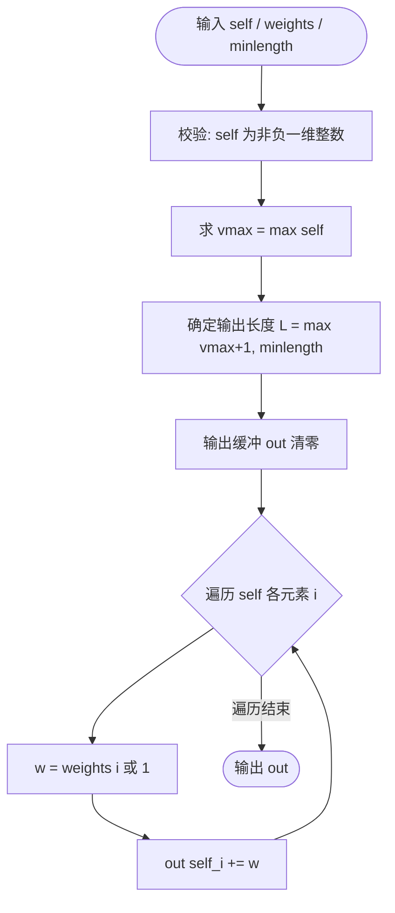
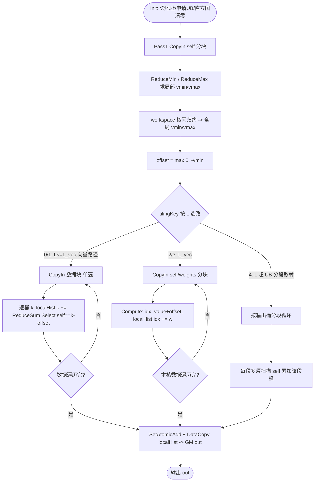

# 【社区任务】Bincount算子设计文档

> 适配硬件：Atlas A2 训练系列产品｜开发语言：Ascend C｜目标开源仓：[ops-math](https://gitcode.com/cann/ops-math) `experimental/math`
>
> 说明：依据任务书要求，本算子**以 PyTorch `torch.bincount` 为设计参照**（不参照 TBE 实现），在昇腾 NPU 上以 Ascend C 实现功能一致的算子，并在原生基础上**扩展支持正、负整数输入**。功能语义基线为 `torch.bincount`，性能基线为原 `aclnnBincount`（任务书要求达成其 10X）。

---

# 一、需求背景（required）

## 1.1 需求来源

通过 CANN 训练营 2026 第一季社区任务完成开源仓算子贡献：参考 `torch.bincount` 功能，使用 Ascend C 在 Atlas A2 上实现功能一致且支持正负整数输入的 `Bincount` 算子，完成设计、开发、测试全流程，验收通过后合入 [ops-math/experimental/math](https://gitcode.com/cann/ops-math/tree/master/experimental/math)。

## 1.2 背景介绍

### 1.2.1 Bincount算子设计参照

依据任务书，本算子以 **PyTorch `torch.bincount`** 为设计参照。Bincount 属于直方图 / 散射累加（scatter-add）类算子，区别于多数逐元素（elementwise）数学算子。

- **功能语义参照**：`torch.bincount(input, weights=None, minlength=0)`（[PyTorch 官方文档](https://pytorch.org/docs/stable/generated/torch.bincount.html)）；
- **性能基线**：原 `aclnnBincount`，任务书要求整体性能达成其 **10X**。

> 设计目标：在 ops-math 标准 Ascend C 算子工程下实现与 `torch.bincount` 功能一致的 Bincount，并**扩展支持正、负整数输入**，整体性能达成原 `aclnnBincount` 的 **10X**。

### 1.2.2 torch.bincount 功能现状分析

#### 1.2.2.1 torch.bincount 支持的数据类型和数据格式

`torch.bincount` 现状（与本任务参数要求保持一致）：

| 参数 | 含义 | 支持数据类型 | 数据格式 | 形状 |
| --- | --- | --- | --- | --- |
| self | 输入张量 | 仅**非负**整数：INT8、INT16、INT32、INT64、UINT8 | ND | 1 维 |
| weights | 权重，可空 | FLOAT、FLOAT16、FLOAT64、INT8、INT16、INT32、INT64、UINT8、BOOL | ND | 1 维，与 self 等长 |
| minlength | 输出最小长度 | int64_t | - | 标量 |
| out | 输出张量 | INT32、INT64（无 weights）/ FLOAT、DOUBLE（有 weights） | ND | 1 维，长度 `max(self最大值+1, minlength)` |

#### 1.2.2.2 torch.bincount 实现描述（功能逻辑）

`torch.bincount` 的计算逻辑：

```
# 无 weights：计数
out[v] = count(i : self[i] == v)
# 有 weights：加权累加，out dtype 跟随 weights
out[v] = Σ_{i : self[i] == v} weights[i]
# 输出长度
L = max(max(self) + 1, minlength)
```

关键约束：`self` 必须为**非负**整数；输出第 `v` 个元素即值 `v` 的统计量；`minlength` 仅在大于 `max(self)+1` 时生效（在尾部补 0 桶）。其计算本质是一次“求最大值 + 散射累加”的过程，本任务在此基础上扩展负数支持，并通过多核并行 + 片上私有直方图优化散射累加阶段的性能。

#### 1.2.2.3 torch.bincount 实现流程图



# 二、需求分析（required）

## 2.1 外部组件依赖

| 依赖 | 说明 |
| --- | --- |
| Ascend C 编程框架与 API | `TPipe`/`TQue`/`GlobalTensor`、`DataCopy`/`DataCopyPad`、`ReduceMax`/`ReduceMin`、`Cast`、原子累加 `SetAtomicAdd` 等 |
| ops-math 标准算子工程 | 沿用 `build.sh --genop` 生成的标准目录结构与编译框架（非自定义算子工程方式） |
| 平台信息接口 | `platform_ascendc::PlatformAscendC`（`GetCoreNumAiv`、`GetCoreMemSize(UB)`）用于分核与 UB 切分 |
| AscendOpTest | 开源算子测试工具，用于精度/性能自验 |

## 2.2 内部适配模块

按 ops-math 标准算子目录组织交付件：

| 模块 | 交付件 | 职责 |
| --- | --- | --- |
| op_host | `bincount_def.cpp` | 算子信息库（名称、输入输出、dtype、format） |
| op_host | `bincount_infershape.cpp` | InferShape（依据 self 值/minlength 推导 out 长度，标记 self 为 ValueDepend） |
| op_host | `bincount_tiling.cpp` | Tiling（分核、UB 切分、tilingKey、workspace） |
| op_kernel | `bincount_tiling_key.h` / `bincount_tiling_data.h` | TilingKey 与 TilingData 定义 |
| op_kernel | `bincount.cpp` / `bincount.h` | Kernel 入口与计算实现 |
| op_api | 复用开源仓已有 aclnn 源码 | aclnn 接口（参考[如何使用已有 ACLNN 源码](https://gitcode.com/org/cann/discussions/37)） |
| examples / tests | `test_aclnn_bincount.cpp`、UT | aclnn 调用样例与 UT |

## 2.3 需求模块设计

### 2.3.1 AscendC算子原型

除任务书不要求适配的部分外，与 `torch.bincount` 原型对齐：

| 参数名 | 输入/输出 | 描述 | 数据类型 | 数据格式 | 维度 | 非连续 |
| --- | --- | --- | --- | --- | --- | --- |
| self（aclTensor*） | 输入 | 输入整数张量（本任务支持正、负） | INT8、INT16、INT32、INT64、UINT8 | 1 维 ND | - | √ |
| weights（aclTensor*） | 输入 | 权重，可为空指针，shape 与 self 一致 | FLOAT、FLOAT16、FLOAT64、INT8、INT16、INT32、INT64、UINT8、BOOL | 1 维 ND | - | √ |
| minlength（int64_t） | 输入 | 输出最小长度 | int64_t | - | - | - |
| out（aclTensor*） | 输出 | 输出张量，长度 `max(vmax+offset+1, minlength)` | INT32、INT64、FLOAT、DOUBLE | 1 维 ND | - | √ |

### 2.3.2 AscendC算子相关约束（相比 torch.bincount 的差异/缺失）

| 维度 | torch.bincount | 本 AscendC 算子 |
| --- | --- | --- |
| 输入取值范围 | 仅非负整数 | **扩展支持正、负整数**（偏移映射） |
| 性能 | 原 aclnnBincount 为基线 | ≥ 基线 10X |
| 功能缺失 | - | 无功能缺失；负数为纯增量扩展，非负输入行为与 torch 完全一致 |
| 维度 | 1 维 | 与 torch 一致，仅支持 1 维 self/weights |

# 三、需求详细设计（required）

## 3.1 使能方式

适配 **ACLNN** 调用框架（当前社区任务主要使能方式）。算子编译后生成 `aclnnBincountGetWorkspaceSize` + `aclnnBincount` 二段式接口；op_api 层复用开源仓已有 aclnn 源码。提供 `examples/test_aclnn_bincount.cpp` 调用样例，aclnn 调用验证参考[算子调用方式](https://gitcode.com/cann/ops-math/blob/master/docs/zh/invocation/quick_op_invocation.md)。

## 3.2 需求总体设计

整体采用「两阶段」流水：**阶段一全局归约**确定 `vmin/vmax` 与偏移量；**阶段二散射累加**完成直方图统计。负数通过**最小值偏移映射**支持：

```
offset = max(0, -vmin)            # vmin = min(self)；全非负时 offset = 0，与 torch 严格一致
idx(i) = self[i] + offset         # 映射到非负输出桶索引
out[k] = Σ_{i: idx(i)==k} w_i     # w_i = weights[i] 或 1；out[k] 对应原值 (k - offset)
L = max(vmax + offset + 1, minlength)
```

### 3.2.1 host侧设计

#### 3.2.1.1 分核策略

遵循「优先满核」原则。设输入元素数 `N`，平台可用核数 `coreNum = GetCoreNumAiv()`：

- **均分**：`tileLen = ceil(N / coreNum)`，若 `N % coreNum == 0`，各核处理数据量一致，无大小核区分；
- **非均分**：余量 `rem = N % coreNum` 逐块分配到前 `rem` 个核（大核多处理 1 个尾块），其余为小核；记 `bigCoreNum = rem`；
- 通过平台信息动态裁剪 `coreNum`，避免空转核（`N` 较小时按 `N` 限定实际启用核数）。

> 散射累加的核间合并：各核先在片上构造**私有直方图**，再以原子方式合并到 GM `out`，因此分核只需对输入 `self` 做一维等分，输出 `out` 由所有核共享并原子累加。

#### 3.2.1.2 数据分块和内存优化策略（含计算公式）

遵循「充分利用 UB」原则。设 UB 可用容量 `UB`（由 `GetCoreMemSize(UB)` 获取，实测较标称少 256B），`BUFFER_NUM` 为 double buffer 数（取 2），单元素输入字节 `Bin = sizeof(self_dtype)`、权重字节 `Bw`、私有直方图单桶字节 `Bh = sizeof(out_dtype)`，输出长度 `L`：

UB 需容纳：输入分块（double buffer）、权重分块（可选 double buffer）、私有直方图，以及归约/cast 临时空间。单次搬运数据量 `tileDataNum` 满足：

```
BUFFER_NUM * tileDataNum * (Bin + hasWeights*Bw)        # CopyIn 队列
  + min(L, segLen) * Bh                                 # 私有直方图常驻
  + tmp                                                 # 归约/cast 临时
  ≤ UB
```

由此反解每核单次搬运量：

```
tileDataNum = floor( (UB - min(L,segLen)*Bh - tmp) / (BUFFER_NUM*(Bin + hasWeights*Bw)) )
tileDataNum 向 BLOCK_SIZE(32B) 对齐
```

每核搬运次数与尾块：

```
coreData      = 该核分得的元素数（大核 = tileLen，小核 = tileLen-1 或按余量）
tileNum       = floor(coreData / tileDataNum)
tailNum       = coreData - tileNum * tileDataNum          # 尾块单独处理，避免数据碎片
```

私有直方图常驻 UB；当 `L*Bh > 可用UB`（max 值极大）时改用**分段散射**：将输出桶切为若干段，每段 `segLen` 桶（`segLen*Bh` 适配 UB），外层循环各段、多遍扫描 `self`，仅累加落入当前段的元素。

> **性能关键：按 L 大小选择计算策略。** 散射（scatter）累加在 SIMD 硬件上无法向量化（多元素命中同桶需串行、且 `localHist[idx]` 存在读改写依赖），是标量瓶颈。为达成 10X，本设计按输出桶数 `L` 分流到两类计算路径：
>
> - **L 较小（`L ≤ L_vec`，bincount 最常见场景，如类别/标签统计）**：走**向量比较累加**——逐桶用 `Compare/Select(self == k-offset)` 取掩码再 `ReduceSum`，全程 SIMD、无 scatter 冲突，对「N 大、L 小」吞吐远高于标量散射；
> - **L 较大**：scatter 不可避免，走**私有直方图散射**（L 适配 UB）或**分段散射**（L 超 UB），保正确性与泛化。
>
> 阈值 `L_vec` 由「`L` 遍向量扫描成本 ≈ 标量散射成本」估算，经验区间约 64~256，最终在真机用 profiling 标定。向量路径成本约 `N*L/vec_width`（单遍数据），故仅在 L 小时启用。

#### 3.2.1.3 tilingKey规划策略

需感知 host 侧信息使 kernel 走不同分支，依据「**输出桶数 L 所处区间**（决定向量比较 / 散射 / 分段散射）」与「是否带 weights」组合设置：

| tilingKey | 设置条件 | 计算策略 |
| --- | --- | --- |
| 0 | `L ≤ L_vec`，无 weights | **向量比较累加**（逐桶 Compare+ReduceSum），整型计数 |
| 1 | `L ≤ L_vec`，有 weights | **向量比较累加**，浮点加权 |
| 2 | `L_vec < L` 且 `L*Bh ≤ UB`，无 weights | **私有直方图散射** + 整型计数，单遍扫描 |
| 3 | `L_vec < L` 且 `L*Bh ≤ UB`，有 weights | **私有直方图散射** + 浮点加权，单遍扫描 |
| 4 | `L*Bh > UB`（max 极大） | **分段散射** + 多遍扫描 + 原子累加 |

是否需要负数偏移由 kernel 在阶段一归约得 `vmin` 后判定（`offset = max(0,-vmin)`），不单独占用 tilingKey；若 host 能确定输入恒非负，可置标志位跳过 min 归约。

`TilingData` 字段（`bincount_tiling_data.h`）：

```cpp
struct BincountTilingData {
    int64_t totalNum;     // N
    int64_t outLength;    // L
    int64_t minlength;
    int64_t coreNum;
    int64_t bigCoreNum;   // 大核数 = N % coreNum
    int64_t tileDataNum;  // 单次搬运量
    int64_t vecThreshold; // L_vec：向量比较 vs 散射的切换阈值（profiling 标定）
    int64_t segLen;       // tilingKey=4 时单段桶数
    int32_t hasWeights;   // 0/1
};
```

### 3.2.2 kernel侧设计

#### 3.2.2.1 kernel侧实现描述

Kernel 经 `Init` 与 `Process` 两阶段，`Process` 含 CopyIn / Compute / CopyOut，核心由「全局归约」与「统计累加」两个 pass 组成。统计累加按 tilingKey 选择**向量比较累加**或**散射累加**两类策略。

**Init**：依据 `TilingData` 设置本核 `self`（及 `weights`）的 GM 起始地址与处理长度；`InitBuffer` 申请 CopyIn 队列（double buffer）与片上直方图 UB；直方图清零。

**Pass 1：全局 min/max 归约（确定 offset）**

1. 各核分块 CopyIn `self` 切片，`ReduceMin`/`ReduceMax` 求局部 `vmin_local/vmax_local`；
2. 经 workspace（GM）做核间归约（或第二轻量归约核）得全局 `vmin/vmax`；
3. `offset = max(0, -vmin)`，有效桶上界 `hi = vmax + offset`。

**Pass 2 — 策略 A：向量比较累加（tilingKey 0/1，`L ≤ L_vec`，性能主路径）**

1. 各核在 UB 维护长度 `L` 的私有直方图 `localHist`（清零）；
2. 分块 CopyIn `self`（及 `weights`，`Cast` 到比较/累加用类型）；数据块**单遍**读入；
3. Compute：对当前数据块，**内层循环逐桶 `k`（0..L-1）**做向量化统计——
   - 计数：`mask = Compare(selfBlock == k - offset)`；`localHist[k] += ReduceSum(mask)`；
   - 加权：`localHist[k] += ReduceSum(Select(selfBlock == k - offset, wBlock, 0))`；
   - 全程 SIMD，无 scatter 冲突；单核成本约 `N*L/vec_width`；
4. 数据遍历完，`SetAtomicAdd` + `DataCopy(localHist → GM out)` 核间原子合并。

**Pass 2 — 策略 B：散射累加（tilingKey 2/3/4，`L > L_vec`）**

1. 各核在 UB 维护长度 `min(L, segLen)` 的私有直方图 `localHist`（清零）；
2. 分块 CopyIn `self`（及 `weights`，按需 `Cast`）；
3. Compute：对块内元素计算 `idx = value + offset`，`localHist[idx] += w`（`w=1` 或 `weights`）；对越界（minlength 扩展产生的高位空桶）做范围保护；
4. `SetAtomicAdd` + `DataCopy(localHist → GM out)` 核间原子合并；
5. tilingKey=4：外层对输出桶分段循环（每段 `segLen` 桶），每段仅累加落入该段元素，多遍扫描数据，规避 UB 容量限制。

**数据类型分支**：无 weights → `localHist` 为 INT32/INT64，+1 计数；有 weights → `weights` Cast 为 FP32/FP64，`localHist` 浮点累加，最终按 `out` dtype 写回。**非连续输入**：CopyIn 按 host 下发 stride 计算地址。

#### 3.2.2.2 AscendC实现流程图



#### 3.2.2.3 AscendC实现流程图与 torch.bincount 流程图的差异点及原因

| 差异点 | torch.bincount | 本 AscendC 实现 | 原因 |
| --- | --- | --- | --- |
| 取值范围 | 仅非负，`idx = value` | 增加 min 归约求 `offset`，`idx = value + offset` | 任务要求扩展负数，偏移映射保证非负输入零开销、行为不变 |
| 并行模型 | CPU/串行语义 | 多核满核 + 片上直方图 + double buffer | 提升并行度与片上复用，达成 10X 性能目标 |
| 统计策略 | 逐元素散射累加 | `L` 小走**向量比较累加**（SIMD、无 scatter 冲突），`L` 大走散射 | 散射在 SIMD 上不可向量化且有读改写依赖，是标量瓶颈；向量路径是达成 10X 的主路径 |
| 累加方式 | 直接累加输出 | 片上私有直方图 + 单次核间原子合并 | 将“每元素一次 GM 原子”降为“每核一次原子合并”，降低原子争用 |
| 大输出处理 | 一次性输出缓冲 | tilingKey=4 输出分段 + 多遍扫描 | 适配 UB 容量限制，保证 max 极大场景泛化正确 |
| 求最值 | 框架求 max | kernel 内 ReduceMax/ReduceMin 自洽求最值 | 利于泛化、减少 host-device 同步 |

## 3.3 支持硬件

| 支持的芯片版本 | 涉及勾选 |
| --- | --- |
| Atlas 800I/T A2 | √ |

## 3.4 算子约束限制

1. `self` 为一维整数张量（INT8/INT16/INT32/INT64/UINT8）；`weights` 若非空须与 `self` 等长且一维；
2. `out` 长度须为 `max(vmax + offset + 1, minlength)`，由调用方按规则分配；
3. 含负数时输出索引与原值映射为 `value = index - offset`，使用方据此解读输出（建议在 README 说明约定）；
4. `self` 取值须在所选整型可表示范围内，避免溢出；
5. 不支持多维输入；不支持浮点型 `self`。

# 四、特性交叉分析

| 交叉维度 | 分析 |
| --- | --- |
| 数据类型 × weights | 无 weights → out 为 INT32/INT64 计数；有 weights → weights Cast 为 FP32/FP64，out 为 FLOAT/DOUBLE 加权和；各 self/weights/out dtype 组合需逐一覆盖 |
| 正负输入 × minlength | offset 由 vmin 决定，minlength 仅在 `L < minlength` 时扩展尾部空桶；负数 + 大 minlength 组合需验证高位补 0 正确 |
| 输出规模 L × 计算策略 | `L ≤ L_vec` 走 tilingKey 0/1 向量比较；`L_vec < L 且适配 UB` 走 2/3 私有直方图散射；`L*Bh > UB` 走 4 分段散射；两处阈值交界（`L_vec`、UB 边界）需重点验证结果一致与分段桶不重不漏 |
| 非连续 tensor × 分核 | 非连续 self/weights 在 CopyIn 按 stride 取址，与分核切分正交，需联合验证 |
| 空输入 / 单元素 / 全同值 | 边界场景：N=0 输出全 0（长度由 minlength 决定）；单元素、全相同值需正确计数 |

# 五、可维可测分析

## 5.1 精度标准/性能标准

| 验收标准 | 描述 | 标准来源 |
| --- | --- | --- |
| 精度标准 | 满足 [AscendOpTest](https://gitcode.com/HIT1920/AscendOpTest) 默认阈值；计数类整型逐位一致，加权类满足浮点相对/绝对误差阈值 | AscendOpTest / 任务书 |
| 性能标准 | 整体性能达成原 aclnnBincount 的 **10X** | 任务书 |

**10X 性能达成路径分析**

性能提升来自三方面叠加：（1）**满核并行**——Atlas A2 多 AIV 核对输入一维等分，相对低并行基线即有数十倍上限；（2）**消除散射标量瓶颈**——`L` 小的常见场景走向量比较累加（SIMD、单遍数据、无 scatter 冲突），这是核心增益来源；（3）**降低原子争用**——片上私有直方图把「每元素一次 GM 原子」降为「每核一次原子合并」，并以 double buffer 隐藏搬运时延。其中向量路径成本约 `N*L/vec_width`，散射路径受标量吞吐约束，故以 `L_vec` 阈值分流取两者更优值。

> 说明：上述为设计阶段的瓶颈与余量分析；最终 10X 须在真机用 AscendOpTest / profiling 对齐基线实测，并据测量结果标定 `L_vec`、`tileDataNum`、`segLen` 等参数。

**测试场景设计（覆盖常规 + 边界）**

| 类别 | 场景 |
| --- | --- |
| 常规 | 全非负计数；带 weights 加权和；多种 self/weights/out dtype 组合 |
| 负数扩展 | 含负数；全负数；正负混合；含 0 |
| minlength | `minlength < max+1`（不生效）；`minlength > max+1`（高位补 0） |
| 边界 | 空输入 N=0；单元素；全相同值；max 极大（触发 tilingKey=2）；非连续 tensor |
| 类型 | INT8/INT16/INT32/INT64/UINT8 输入；FLOAT/FLOAT16/FLOAT64/INT/BOOL 权重 |

自验证报告须含：测试用例执行日志/截图、整体测试通过截图、性能数据截图，可清晰指导算子使用与测试。建议使用 AscendOpTest 自验，并对照 codecheck 与 SIG 审核清单提前检查。

## 5.2 兼容性分析

新增算子，无历史接口依赖，不涉及兼容性问题。输入恒非负时行为与 `torch.bincount` / `aclnnBincount` 严格一致，负数为纯增量扩展，不破坏既有语义。
