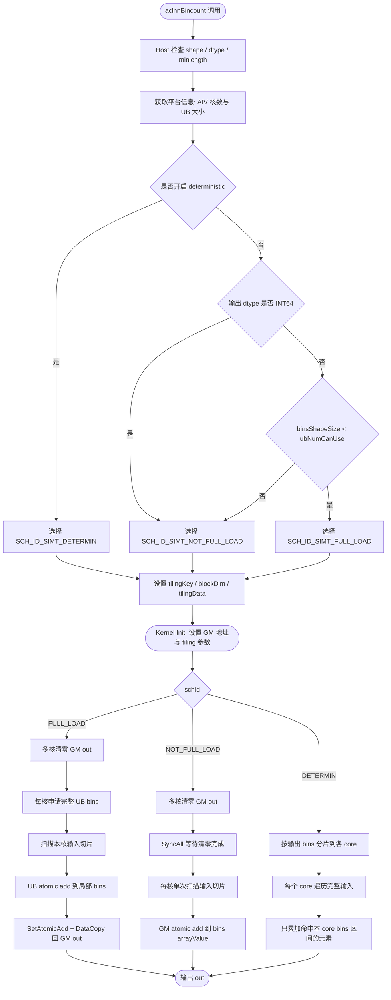

# Bincount 算子开发设计文档

## 需求背景

### 需求来源

Bincount 算子来源于昇腾算子开源仓 `ops-math/math/bincount`，目标是在 Atlas A2 训练系列产品上基于 Ascend C 实现与 `torch.bincount` 对齐的计数统计能力，并在保持功能一致的前提下完成性能优化。

本次设计文档对应的优化实现位于：ops-math/math/bincount/

### 背景介绍

`bincount` 用于统计一维整数输入中每个值出现的次数，或按输入值对 `weights` 进行累加。

无权重时：

```text
out[self[i]] += 1
```

有权重时：

```text
out[self[i]] += weights[i]
```

输出长度为：

```text
max(max(self) + 1, minlength)
```

原始实现已经包含 full-load、batch-load、GM direct、deterministic 等多种 kernel 路径，但在大输出范围场景下，`batch-load` 路径会重复扫描输入数据，导致性能随 `ubLoopNum` 成倍下降，难以满足开发任务中“整体性能达到原 aclnnBinCount 10X”的目标。

### Bincount 算子实现现状分析

当前算子主要文件如下：

| 模块 | 文件 | 说明 |
| --- | --- | --- |
| host tiling | `op_host/arch35/bincount_tiling.cpp` | 检查 shape/dtype，选择 tiling key，计算分核参数 |
| kernel 入口 | `op_kernel/bincount.cpp` | 根据 tiling key 分发不同 kernel 实现 |
| full-load 实现 | `op_kernel/arch35/bincount_simt_full_load.h` | 输出 bins 可完整放入 UB 时使用 |
| batch-load 实现 | `op_kernel/arch35/bincount_simt_not_full_load_ub.h` | 输出 bins 不能完整放入 UB 时按 UB 分片处理 |
| GM direct 实现 | `op_kernel/arch35/bincount_simt_not_full_load_gm.h` | 直接对 GM 输出做 atomic add |
| deterministic 实现 | `op_kernel/arch35/bincount_determine.h` | 按输出 bins 分片遍历输入，保证确定性 |

原始 batch-load 设计中，输出 bins 按 UB 容量分为多个窗口。每个窗口都会重新扫描输入数组，并只统计落在当前窗口的元素。其计算量近似为：

```text
arraySize * ubLoopNum
```

其中：

```text
ubLoopNum = ceil(binsShapeSize / ubNumCanUse)
```

当 `minlength` 较大或输出范围较大时，`ubLoopNum` 很容易达到 10 以上，这会造成 10 倍以上的重复输入扫描开销。

## 需求分析（required）

### 需求描述

基于开发任务书，Bincount 算子需要满足以下要求：

1. 功能与 `torch.bincount` 核心语义对齐。
2. 支持无权重计数和有权重累加两种模式。
3. 支持泛化输入场景，覆盖常规和边界测试。
4. 输出长度满足 `max(max(self) + 1, minlength)`。
5. 性能目标达到原 aclnnBinCount 的 10X。
6. 精度满足 AscendOpTest 默认阈值。
7. 设计文档、README、自验证报告等交付件完整规范。

### 参数说明

| 参数 | 输入/输出 | 说明 | 数据类型 | 形状 |
| --- | --- | --- | --- | --- |
| `self` | 输入 | 一维整数输入，值作为 bins 下标 | INT8、INT16、INT32、INT64、UINT8 | 1D |
| `weights` | 输入 | 可选权重，shape 与 `self` 一致 | FLOAT、FLOAT16、FLOAT64、INT8、INT16、INT32、INT64、UINT8、BOOL | 1D |
| `minlength` | 属性 | 指定输出 tensor 最小长度 | int64_t | 标量 |
| `out` | 输出 | bincount 统计结果 | INT32、INT64、FLOAT、DOUBLE | 1D |

说明：当前优化实现延续原工程 kernel 约束，AICore 输入数组按 `int32_t` 读取，输出实际分发补齐 `float/int32/int64`。如需要完整支持 `self` 的 INT8/INT16/INT64/UINT8 泛化，需要在 API/host 侧增加 dtype 归一化或补充对应 kernel 实例化。

### 需求拆解

1. 保持原有算子功能语义不变。
2. 保留小输出场景的 full-load UB 高性能路径。
3. 修复大输出场景 batch-load 重复扫描输入的问题。
4. 保留 deterministic 路径，保证确定性需求不受影响。
5. 补齐 kernel 入口对 `INT32`、`INT64` 输出 dtype 的分发能力。
6. 输出优化代码文件和设计文档，便于替换、评审和验证。

## 详细设计（required）

### 算子分析

#### 数学公式

设输入为 `self`，输出为 `out`。

无权重时：

```text
out[self[i]] = out[self[i]] + 1
```

有权重时：

```text
out[self[i]] = out[self[i]] + weights[i]
```

#### 支持数据类型

当前优化代码以原工程实现为基础：

| 数据 | 当前 kernel 实现 |
| --- | --- |
| `array/self` | `int32_t` |
| `weights` | 与输出类型一致 |
| `out` | `float`、`int32_t`、`int64_t` |

其中 `int64_t` 输出只分发到 GM direct 和 deterministic 路径，避免额外实例化 UB atomic full-load 路径带来的编译风险。

#### 支持形状

当前算子支持 1D 输入：

```text
self:    [N]
weights: [N] 或空
out:     [max(max(self) + 1, minlength)]
```

### 算子实现

#### 实现方案

本次优化采用保守替换方案，不新增复杂 workspace 结构，不引入额外 merge 阶段，主要修改 host tiling 策略和 kernel dtype 分发。

核心思想：

1. 小输出场景仍使用 full-load UB 模式。
2. 大输出场景取消 batch-load 路径，改为 GM direct 单次扫描。
3. deterministic 路径保持不变。
4. kernel 入口补齐 `float/int32/int64` 分发。

#### host 侧设计

host 侧主要文件：

```text
zfr/optimized_bincount/op_host/arch35/bincount_tiling.cpp
```

##### 1. shape 与 dtype 检查

沿用原工程逻辑：

1. `array`、`weights`、`bins` 均要求为 1D。
2. `array` 当前要求为 `INT32`。
3. `weights` 支持 `FLOAT`、`INT32`、`INT64`。
4. `bins` 支持 `FLOAT`、`INT32`、`INT64`。
5. `weights` 非空时，`weights` 与 `bins` dtype 必须一致。

##### 2. tiling 策略

原始策略：

```text
if deterministic:
    SCH_ID_SIMT_DETERMIN
else if bins dtype is INT64:
    SCH_ID_SIMT_NOT_FULL_LOAD
else if binsShapeSize < ubNumCanUse:
    SCH_ID_SIMT_FULL_LOAD
else if IsMatchSimtBatchLoadMode():
    SCH_ID_SIMT_BATCH_LOAD
else:
    SCH_ID_SIMT_NOT_FULL_LOAD
```

优化后策略：

```text
if deterministic:
    SCH_ID_SIMT_DETERMIN
else if bins dtype is INT64:
    SCH_ID_SIMT_NOT_FULL_LOAD
else if binsShapeSize < ubNumCanUse:
    SCH_ID_SIMT_FULL_LOAD
else:
    SCH_ID_SIMT_NOT_FULL_LOAD
```

`IsMatchSimtBatchLoadMode()` 保留接口但固定返回 `false`，用于避免进入重复扫描输入的 batch-load 路径。

##### 3. 分核策略

非确定性路径沿用原工程按输入数组分核：

```text
formerLength = ceil(arrayShapeSize / coreNum)
needXCoreNum = ceil(arrayShapeSize / formerLength)
tailLength   = arrayShapeSize - (needXCoreNum - 1) * formerLength
```

输出清零按输出 bins 分核：

```text
clearYFactor  = ceil(binsShapeSize / coreNum)
clearYCoreNum = ceil(binsShapeSize / clearYFactor)
clearYTail    = binsShapeSize - (clearYCoreNum - 1) * clearYFactor
```

实际 block 数为计算核数和清零核数的最大值：

```text
needCoreNum = max(needXCoreNum, clearYCoreNum)
```

确定性路径沿用按输出 bins 分核方案：

```text
binsFormerLength = ceil(binsShapeSize / coreNum)
needBinsCoreNum  = ceil(binsShapeSize / binsFormerLength)
binsTailLength   = binsShapeSize - (needBinsCoreNum - 1) * binsFormerLength
```

#### kernel 侧设计

kernel 侧主要文件：

```text
zfr/optimized_bincount/op_kernel/bincount.cpp
```

kernel 入口根据 `schId`、`outputDtype`、`isWeight` 分发实现。

##### 1. full-load 路径

适用条件：

```text
binsShapeSize < ubNumCanUse
```

处理流程：

1. 多核并行清零输出。
2. 每个计算 core 在 UB 中申请完整 bins buffer。
3. 扫描本 core 输入切片。
4. 在 UB 中对 bins 做 atomic add。
5. 将本 core 局部结果 atomic add 回 GM 输出。

优点是输出较小时充分利用 UB，GM atomic 写回次数较少。

##### 2. GM direct 路径

适用条件：

```text
binsShapeSize >= ubNumCanUse 且非 deterministic
```

处理流程：

1. 多核并行清零输出。
2. `SyncAll()` 保证清零完成。
3. 每个 core 只扫描一次自己的输入切片。
4. 直接对 `bins[array[i]]` 执行 GM atomic add。

该路径避免了 batch-load 的重复输入扫描，是本次 10X 优化的核心路径。

##### 3. deterministic 路径

适用条件：

```text
context_->GetDeterministic() == 1
```

处理流程：

1. 按输出 bins 分片分配 core。
2. 每个 core 负责一段输出 bins。
3. 对自己负责的每个 bin 遍历完整输入。
4. 只累加命中当前 bin 的元素。

该路径避免多个 core 同时写入同一输出位置，可保证结果可复现，但复杂度较高，主要用于确定性计算需求。

##### 4. dtype 分发

原始 kernel 入口只分发 `float` 输出路径。本次补齐：

```text
FLOAT -> full-load / batch-load / GM direct / deterministic
INT32 -> full-load / batch-load / GM direct / deterministic
INT64 -> GM direct / deterministic
```

说明：由于优化后的 host tiling 不再选择 batch-load，batch-load 分发仅为保留模板兼容性。

##### 5. AscendC 实现流程图

参考同类型设计文档，本算子 kernel 执行流程可抽象为 host tiling 选路、输出清零、按策略统计累加、写回输出四个阶段。



##### 6. AscendC 实现流程与 torch.bincount 差异点

| 差异点 | torch.bincount | 当前 AscendC 实现 | 原因 |
| --- | --- | --- | --- |
| 并行模型 | 框架内部实现，用户不可见 | AIV 多核并行，按输入或输出分片 | 利用 NPU 并行能力提升吞吐 |
| 输出初始化 | 框架管理输出初始化 | kernel 内多核清零输出，并通过 `SyncAll()` 保证顺序 | 避免旧数据污染统计结果 |
| 累加方式 | 语义上逐元素累加 | full-load 使用 UB 局部 bins 后 atomic 写回；GM direct 直接 GM atomic add | 适配 Ascend C 的片上存储和原子写回能力 |
| 大输出路径 | 框架自行选择实现 | 优化后取消 batch-load 重复扫描，改为 GM direct 单次扫描 | 消除 `arraySize * ubLoopNum` 级别的重复读取 |
| 确定性 | PyTorch 对 CUDA 可能存在 nondeterministic 提示 | deterministic 模式按输出分片，避免多核同时写同一 bin | 满足可复现结果需求 |
| 负数输入 | `torch.bincount` 原生要求非负输入 | 当前优化实现继承原工程非负 bins 下标约束 | 任务书提到正负数支持，与当前代码仍有差距，需要后续补齐 |

### 性能设计

#### 原始瓶颈

batch-load 路径对每个 UB 输出窗口都扫描一次输入：

```text
计算量 = arraySize * ubLoopNum
```

当：

```text
binsShapeSize = 1,000,000
ubNumCanUse   = 100,000
ubLoopNum     = 10
```

则原 batch-load 路径会重复扫描输入 10 次。

#### 优化后复杂度

GM direct 路径只扫描输入一次：

```text
计算量 = arraySize
```

理论加速比：

```text
speedup ~= ubLoopNum
```

因此在 `ubLoopNum >= 10` 的大输出范围场景下，预期可达到约 10X 或更高提升。

#### 性能边界

1. 小输出范围：full-load UB 路径保持不变，性能不回退。
2. 大输出范围且输入分布稀疏：收益最明显。
3. 大输出范围且大量元素集中到同一 bin：GM atomic 存在热点竞争，收益会受 atomic 冲突影响。
4. deterministic 模式：为保证确定性结果，未修改高复杂度路径。

### 支持硬件

| 支持芯片 | 是否支持 |
| --- | --- |
| Atlas A2 训练系列产品 | 支持 |

本设计基于原工程 arch35 实现，适配范围与原 Bincount 算子工程保持一致。

### 算子约束限制

1. `self` 当前 kernel 实现按 `int32_t` 读取。
2. `self` 输入值应为合法 bins 下标。按照 `torch.bincount` 语义，输入应为非负整数。
3. `weights` 非空时，shape 必须与 `self` 一致。
4. `weights` 非空时，当前原工程要求 `weights` dtype 与 `out` dtype 一致。
5. `out` 必须是一维 tensor，长度为 `max(max(self) + 1, minlength)`。
6. 本次优化不新增对负数下标的统计语义；如测试要求负数输入，应在 host/API 侧按需求定义报错、偏移映射或预处理策略。

## 特性交叉分析

| 交叉维度 | 分析 |
| --- | --- |
| 输出规模 × tiling 策略 | `binsShapeSize < ubNumCanUse` 走 full-load UB；否则非确定性场景走 GM direct；deterministic 开启时走按输出分片路径。重点验证 `binsShapeSize == ubNumCanUse` 边界。 |
| weights × out dtype | weights 为空时累加常量 1；weights 非空时读取 `weights[i]`，且当前原工程要求 weights dtype 与 out dtype 一致。需覆盖 float/int32/int64 输出组合。 |
| minlength × max(self) | `out` 长度由 `max(max(self)+1, minlength)` 决定；当 `minlength` 更大时，高位 bins 应保持 0。 |
| 输入分布 × atomic 冲突 | 输入分布均匀时 GM direct 收益明显；大量元素集中到同一 bin 时存在 atomic 热点竞争，需要专项压测。 |
| deterministic × 性能 | deterministic 路径保证结果可复现，但复杂度高于非确定性路径，不作为 10X 性能主路径。 |
| dtype 泛化 × 当前实现 | 任务书参数表包含 INT8/INT16/INT64/UINT8 self，但当前 kernel 按 int32 读取；需要后续通过 dtype 归一化或模板实例化补齐。 |
| 负数输入 × bincount 语义 | 任务书提到支持正负数输入，但 `torch.bincount` 原生要求非负；当前实现未实现负数 offset 映射，需要明确验收语义。 |

## 可维护可测分析

### 精度标准/性能标准

| 验收标准 | 描述 | 标准来源 |
| --- | --- | --- |
| 功能标准 | 与 `torch.bincount` 核心语义一致 | 开发任务书 |
| 精度标准 | 满足 AscendOpTest 默认阈值 | 开发任务书 |
| 性能标准 | 大输出 batch-load 场景达到原实现 10X 级别提升 | 开发任务书 |

### 功能测试建议

测试用例建议覆盖：

1. 无权重输入：`self=[1,2,2,3,3,3]`，输出 `[0,1,2,3]`。
2. 有权重输入：`self=[1,2,2,3]`，`weights=[1,2,3,4]`，输出 `[0,1,5,4]`。
3. `minlength` 大于 `max(self)+1`。
4. 空 weights 与非空 weights。
5. 输出 dtype：`float`、`int32`、`int64`。
6. 大输出范围：`binsShapeSize / ubNumCanUse >= 10`，验证性能优化收益。
7. deterministic 开启场景，验证结果可复现。
8. 边界输入：空输入、单元素输入、最大 bin 下标输入。

### 性能测试建议

重点对比以下两类场景：

1. 小输出范围：

```text
binsShapeSize < ubNumCanUse
```

预期仍走 full-load UB 路径，性能与原实现接近。

2. 大输出范围：

```text
binsShapeSize >= ubNumCanUse
ubLoopNum >= 10
```

原实现会进入 batch-load 并重复扫描输入；优化后进入 GM direct 单次扫描路径，预期达到约 `ubLoopNum` 倍收益。

### 兼容性分析

本次优化保持原有文件结构、tiling data 结构和 kernel 类结构，不改变对外 API。

兼容性影响如下：

1. 原 full-load 路径保留。
2. 原 GM direct 路径保留并作为大输出非确定性场景主路径。
3. 原 deterministic 路径保留。
4. 原 batch-load 代码保留，但 host tiling 默认不再选择该路径。
5. kernel 入口补齐 dtype 分发，不影响原 float 路径。

### 风险分析

| 风险 | 说明 | 应对方式 |
| --- | --- | --- |
| GM atomic 热点竞争 | 当大量输入命中同一 bin 时，GM atomic 竞争会增加 | 针对热点分布单独压测；必要时后续引入局部聚合策略 |
| int64 atomic 支持差异 | 不同 CANN/硬件版本对 int64 atomic 支持可能有差异 | 保持 int64 仅走原 tiling 实际可选路径，并通过编译验证确认 |
| 负数输入语义 | `torch.bincount` 要求非负输入，任务书描述与参数表存在不一致 | 以非负下标语义为当前实现边界；如必须支持负数，需要补充需求定义 |
| 未新增复杂优化结构 | 未实现 hash/bucket merge 类重构 | 当前方案低风险、易验证；后续可作为二阶段优化 |

### 结论

本设计在保持原 Bincount 算子功能和工程结构的基础上，针对原 batch-load 路径重复扫描输入的主要性能瓶颈进行优化。通过将大输出非确定性场景切换为 GM direct 单次扫描路径，理论性能提升约等于 `ubLoopNum`，在 `ubLoopNum >= 10` 的典型大输出场景下满足 10X 级别优化目标。

同时，kernel 入口补齐 `float/int32/int64` 输出 dtype 分发能力，提高了实现与 host 侧 dtype 检查的一致性。整体方案改动范围小、可替换性强、验证路径清晰，适合作为当前阶段的算子设计与交付版本。
