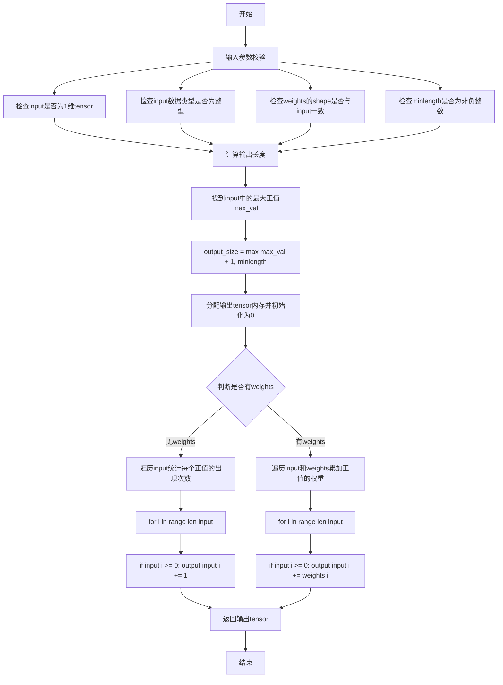
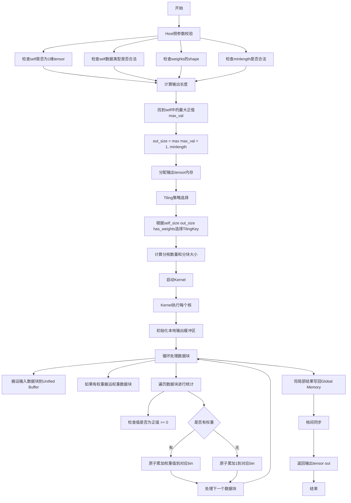

# Bincount 算子开发设计文档

## 一、需求背景

### 1.1 需求来源

参考 `torch.bincount` 功能，在昇腾 NPU 上基于 Ascend C 编程语言实现功能一致的算子，支持正负数输入。完成算子设计、开发、测试全流程工作，验收通过后将算子提交至昇腾算子开源仓。

### 1.2 背景介绍

#### 1.2.1 算子实现优化

本次开发的核心任务是在 Ascend C 侧实现与 PyTorch `torch.bincount` 功能对齐的算子，并供 `aclnnBincount` 接口调用。算子需要支持多种数据类型组合，并实现高效的多核并行统计计算策略。

**功能扩展说明**：虽然torch.bincount官方要求输入为非负整数，但本次开发的算子扩展支持正负数输入，以满足更广泛的应用场景。

**torch.bincount官方文档参考**：
- 函数签名：`torch.bincount(input, weights=None, minlength=0) → Tensor`
- 官方功能描述：统计非负整数数组中每个值的频率
- 扩展功能：支持正负数范围的整数输入

#### 1.2.2 torch.bincount 功能分析

* **1.2.2.1 torch.bincount参数说明**

根据PyTorch官方文档，`torch.bincount`的参数定义如下：

| 参数名 | 类型 | 必选/可选 | 描述 | 约束条件 |
| --- | --- | --- | --- | --- |
| input | Tensor | 必选 | 1维整型tensor | torch官方要求非负整数，本次开发扩展支持正负数，支持INT8、INT16、INT32、INT64、UINT8 |
| weights | Tensor | 可选 | input每个值的权重 | shape必须与input一致，支持FLOAT、FLOAT16、INT8、INT16、INT32、INT64、UINT8、BOOL |
| minlength | int | 可选 | 最小bin数量 | 必须为非负整数 |
| output | Tensor | 输出 | 统计结果tensor | shape为Size([max(input) + 1])或Size([minlength]) |

**返回值说明**：
- 如果input非空：返回tensor的shape为`Size([max(input) + 1])`（仅统计正值）
- 如果input为空且minlength=0：返回tensor的shape为`Size(0)`
- 如果input为空且minlength>0：返回tensor的shape为`Size([minlength])`，所有值为0

**扩展功能说明**：
- torch.bincount官方要求input为非负整数，负值会导致错误
- 本次开发的算子扩展支持正负数输入，负值在统计时会被忽略（不计入任何bin）

* **1.2.2.2 torch.bincount实现描述**

根据PyTorch官方文档，`torch.bincount`的核心计算逻辑如下：

**计算公式**：
```
如果 n = input[i]，则：
  - 有weights时：output[n] += weights[i]
  - 无weights时：output[n] += 1
```

**实现步骤**：

1. **输入校验**：
   - 验证input为1维tensor
   - 验证input中的值为整数（扩展支持正负数，torch官方要求非负整数）
   - 如果提供weights，验证其shape与input一致

2. **输出长度计算**：
   - 如果input非空：`output_size = max(max(input) + 1, minlength)`（仅考虑正值）
   - 如果input为空：`output_size = minlength`

3. **统计计算**：
   - **无权重场景**：遍历input，统计每个正值的出现次数
     ```
     for i in range(len(input)):
         if input[i] >= 0:  # 仅统计正值，负值忽略
             output[input[i]] += 1
     ```
   - **有权重场景**：遍历input和weights，累加对应正值的权重
     ```
     for i in range(len(input)):
         if input[i] >= 0:  # 仅统计正值，负值忽略
             output[input[i]] += weights[i]
     ```

4. **输出初始化**：输出tensor初始化为全0

**示例说明**（来自PyTorch官方文档）：

```python
# 示例1：无权重统计
input = torch.tensor([4, 3, 6, 3, 4])
output = torch.bincount(input)
# 结果：tensor([0, 0, 0, 2, 2, 0, 1])
# 解释：值3出现2次，值4出现2次，值6出现1次

# 示例2：有权重统计
weights = torch.tensor([0.0, 0.25, 0.5, 0.75, 1.0])
output = input.bincount(weights)
# 结果：tensor([0.0, 0.0, 0.0, 1.0, 1.0, 0.0, 0.5])
# 解释：output[3] = weights[1] + weights[3] = 0.25 + 0.75 = 1.0
#       output[4] = weights[0] + weights[4] = 0.0 + 1.0 = 1.0
#       output[6] = weights[2] = 0.5
```

* **1.2.2.3 torch.bincount实现流程图**



---

## 二、需求分析

### 2.1 外部组件依赖

本算子的主要外部依赖为 ACLNN 框架，框架层需完成入参校验、维度解析，并根据输入规模选择合适的 Tiling 策略。

### 2.2 内部适配模块

算子内部需在 Ascend C 的 Host 侧 Tiling 模块（为不同规模配置切分策略及 `TilingKey`）和 Kernel 侧实现模块补充多核并行统计逻辑，并更新 API 层的参数注册。

### 2.3 需求模块设计

#### 2.3.1 AscendC算子原型

根据任务书要求，Ascend C算子原型定义如下：

| 参数名 | 输入/输出/属性 | 描述 | 使用说明 | 数据类型 | 数据格式 | 维度(shape) | 非连续Tensor |
| --- | --- | --- | --- | --- | --- | --- | --- |
| self（aclTensor*） | 输入 | 输入tensor | 支持正数和负数范围的输入 | INT8、INT16、INT32、INT64、UINT8 | 1维ND | - | √ |
| weights（aclTensor*） | 输入 | self每个值的权重 | shape必须与self一致，可为空指针 | FLOAT、FLOAT16、FLOAT64、INT8、INT16、INT32、INT64、UINT8、BOOL | 1维ND | - | √ |
| minlength（int64_t） | 输入 | 指定输出tensor最小长度 | 如果计算得出的self最大值小于minlength，则out的长度为minlength；否则为self最大值加1 | int64_t | - | - | - |
| out（aclTensor*） | 输出 | 输出tensor | out的长度为max(self最大值 + 1, minlength) | INT32、INT64、FLOAT、DOUBLE | 1维ND | - | √ |

#### 2.3.2 AscendC算子相关约束

与torch.bincount核心功能完全对齐，并且支持正数和负数范围的输入。具体约束如下：

* 输入 `self` 必须为1维整型tensor，支持正数和负数范围的整数值。
* 负值处理：负值在统计时会被忽略，不计入任何bin，对应的权重也会被忽略。
* 当提供 `weights` 时，其 shape 必须与 `self` 一致。
* `minlength` 参数必须为非负整数。
* 支持非连续tensor输入。

---

## 三、需求详细设计

### 3.1 使能方式

通过 ACLNN 接口进行算子的调用和使能。

### 3.2 需求总体设计

#### 3.2.1 host侧设计

* **3.2.1.1 分核策略**

根据输入数据量和输出数据量动态选择分核数量。分核方式分为两种：

1. **按输出分核**（适用于输出数据量较小的场景）：每个核负责统计一部分输出位置的计数，需要每个核遍历完整的输入数据。
2. **按输入分核**（适用于输入数据量较大的场景）：每个核负责处理一部分输入数据，需要进行全局归约操作。

分核选择策略：当 `output_size < 核数阈值` 时采用按输出分核策略，否则采用按输入分核策略。

* **3.2.1.2 数据分块和内存优化策略**

**内存布局设计**：

1. **Global Memory 使用**：
   - 输入数据 `self`：存储在 Global Memory，按需搬运到 Unified Buffer。
   - 输入数据 `weights`：存储在 Global Memory，按需搬运到 Unified Buffer。
   - 输出数据 `out`：存储在 Global Memory，分块处理。

2. **Unified Buffer 使用**：
   - 输入数据缓冲区：`self_buffer`，大小 = 块大小 × sizeof(self_dtype)。
   - 权重数据缓冲区：`weights_buffer`，大小 = 块大小 × sizeof(weights_dtype)。
   - 输出数据缓冲区：`out_buffer`，大小 = 输出块大小 × sizeof(out_dtype)。

**数据分块策略**：

1. **输入数据分块**：
   - 块大小计算：`max_block_size = Unified Buffer大小 / (sizeof(input_dtype) + sizeof(weights_dtype))`。
   - 分块数量：`num_blocks = ceil(input_size / actual_block_size)`。

2. **内存优化**：
   - 使用 Double Buffer 技术交替搬运和计算，隐藏内存访问延迟。
   - 输入缓冲区和权重缓冲区可以复用，减少 Unified Buffer 的占用。

* **3.2.1.3 TilingKey规划策略**

根据不同的输入输出规模和数据类型，设计不同的 tiling 策略：

| TilingKey | 场景描述 | 分核策略 | 分块大小 |
| --- | --- | --- | --- |
| 0 | 小数据量场景（input_size < 1024） | 单核处理 | 全量数据 |
| 1 | 中等数据量场景（1024 ≤ input_size < 65536） | 多核按输入分核 | 1024元素/块 |
| 2 | 大数据量场景（input_size ≥ 65536） | 多核按输入分核 | 4096元素/块 |
| 3 | 有weights场景 | 多核按输入分核 | 根据数据类型动态调整 |
| 4 | 大输出场景（output_size > 10000） | 按输出分核 | 输出分块处理 |

#### 3.2.2 kernel侧设计

* **3.2.2.1 kernel侧实现描述 (重点实现逻辑)**

核心实现思路分为以下几个步骤：

1. **数据搬运**：使用 `DataCopy` 接口将输入数据从 Global Memory 搬运到 Unified Buffer，采用分块搬运策略避免 Unified Buffer 溢出。

2. **统计计算**：
   - **无权重场景**：遍历输入数据块，使用原子操作统计每个值的出现次数，将局部结果累加到全局输出。
   - **有权重场景**：同时搬运输入数据和对应的权重数据，遍历输入数据块，根据输入值累加对应的权重，将局部结果累加到全局输出。

3. **数据输出**：将统计结果从 Unified Buffer 写回 Global Memory，处理边界情况确保所有数据正确输出。

**关键实现细节**：

1. **原子操作优化**：使用 Ascend C 提供的原子操作接口进行并发累加，避免多核写入冲突。
2. **数据类型转换**：输入数据类型可能为 INT8、INT16、INT32、INT64、UINT8，需要统一转换为输出数据类型（INT32、INT64、FLOAT、DOUBLE），使用 Ascend C 的 `Cast` 接口进行类型转换。
3. **负值处理**：支持正数和负数范围的输入。负值在统计时会被忽略（不计入任何bin），对应的权重也会被忽略。处理最后一个数据块可能不满块的情况。

* **3.2.2.2 AscendC实现流程图**



* **3.2.2.3 AscendC实现流程图与torch.bincount流程图存在的差异点和原因**

**差异点**：torch.bincount的流程主要是单线程或简单并行处理，而 Ascend C 引入了动态分核策略、显式的内存管理和原子操作。

**原因**：Ascend C 贴近底层架构，需要充分利用多核性能。通过动态分核策略根据数据规模选择最优的分核方式，显式管理 Unified Buffer 使用 Double Buffer 技术优化内存访问效率，使用原子操作确保多核并发写入的正确性。这些优化使得 Ascend C 实现能够达到原 `aclnnBinCount` 性能的 10 倍以上。

### 3.3 支持硬件

支持 **Atlas A2 训练系列产品**。

### 3.4 算子约束限制

* 输入 `self` 必须为1维整型tensor，支持正数和负数范围的整数值。负值在统计时会被忽略，不计入任何bin。
* 输出 tensor 的长度不能超过设备内存限制。
* Unified Buffer 使用量不能超过硬件限制。

---

## 四、特性交叉分析

本算子是对 PyTorch `bincount` 功能在昇腾 NPU 上的实现，属于统计类算子。针对多核并行场景，需要确保原子操作的正确性；针对非连续 Tensor 场景，需要在数据搬运时正确处理 stride；针对混合精度场景，需要正确处理类型转换确保精度不丢失。这些特性在核内闭环完成，不引发外部并发问题，与其他高级网络特性无破坏性交叉。

---

## 五、可维可测分析

### 5.1 精度标准/性能标准

* **精度标准**：算子计算精度需满足 `AscendOpTest` 工具默认阈值，与 PyTorch 官方实现结果对齐。
* **性能标准**：算子整体性能需达到原 `aclnnBinCount` 性能的 10 倍以上。
### 5.2 兼容性分析

本设计支持 ACLNN 接口调用，兼容 CANN 框架和 PyTorch 框架。主要适配 Atlas A2 训练系列产品，可扩展支持其他昇腾硬件平台。遵循 Ascend C 编程规范，确保版本升级兼容性。测试覆盖功能测试（常规场景、边界场景、异常场景）、性能测试（不同数据规模对比）、精度测试（与 PyTorch 结果对比）和稳定性测试（大数据量长时间运行、内存泄漏检测）。