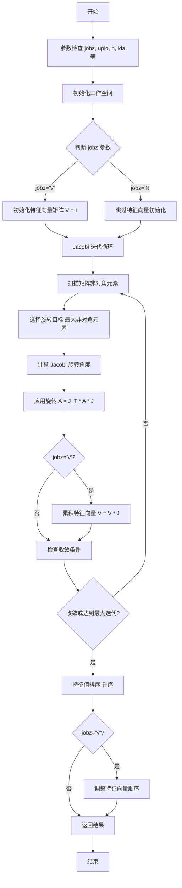
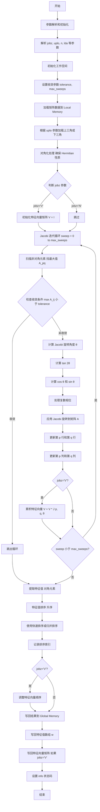

# aclsolverCheevj 算子开发设计文档

## 一、需求背景

### 1.1 需求来源

通过社区任务完成开源仓算子贡献的需求。本次任务旨在在昇腾 NPU 上基于 Ascend C 编程语言实现与 cuSOLVER 库中 `cusolverDnCheevj` 接口功能一致的算子，完成算子设计、开发、测试全流程工作，验收通过后将算子提交至昇腾算子开源仓。

### 1.2 背景介绍

本算子是线性代数求解器中的重要算子，用于计算 Hermitian 矩阵的特征值和特征向量。在科学计算、机器学习、量子计算等领域有广泛应用。当前昇腾算子开源仓缺少该算子的实现，需要基于 Ascend C 进行开发，以满足用户在昇腾平台上的线性代数计算需求。

**cuSOLVER cusolverDnCheevj 算子现状：**

**数据类型：**

- 输入矩阵 A：单精度复数浮点数（cuComplex，即 complex64）
- 特征值 w：单精度浮点数（float32）
- 特征向量：单精度复数浮点数（cuComplex）
- 工作空间：cuComplex 和 float

**数据格式：**

- 矩阵存储格式：列主序（Column-Major）
- 矩阵类型：Hermitian 矩阵（可以是上三角或下三角存储）

**算法实现描述：**

`cusolverDnCheevj` 使用 Jacobi 方法计算 Hermitian 矩阵的特征值和特征向量。Jacobi 方法是一种迭代算法，通过一系列平面旋转（Jacobi 旋转）将矩阵对角化。

**核心算法流程：**

初始化阶段根据 `uplo` 参数确定使用上三角或下三角部分，如果 `jobz='V'` 则初始化特征向量矩阵为单位矩阵。Jacobi 迭代阶段扫描矩阵的非对角元素寻找最大非对角元素，计算 Jacobi 旋转角度使得旋转后该非对角元素为零，应用 Jacobi 旋转 A = J^T * A * J，如果 `jobz='V'` 则累积特征向量 V = V * J，重复迭代直到收敛或达到最大迭代次数。收敛判断阶段计算非对角元素的 Frobenius 范数，当范数小于容忍度或达到最大扫描次数时停止迭代。特征值排序阶段将对角元素（特征值）按升序排列，如果 `jobz='V'` 则相应调整特征向量的顺序。

**参数说明：**

- `jobz`：'N' 仅计算特征值，'V' 计算特征值和特征向量
- `uplo`：'U' 使用上三角部分，'L' 使用下三角部分
- `params`：Jacobi 算法参数配置，包括容忍度、最大扫描次数等

**cuSOLVER 算子实现流程图：**



---

## 二、需求分析

### 2.1 外部组件依赖

本算子的主要外部依赖为 ACLNN 框架，框架层需完成以下工作：

- 入参校验：检查 `jobz`、`uplo`、`n`、`lda` 等参数的合法性
- 维度解析：验证矩阵维度和前导维度的正确性
- 工作空间分配：根据矩阵大小分配足够的工作空间
- 参数配置：将 `syevjInfo_t` 参数转化为算子内部可用的配置

### 2.2 内部适配模块

算子内部需实现 Host 侧 Tiling 模块（包括矩阵分块策略、TilingKey 规划和内存管理）和 Kernel 侧实现模块（包括 Jacobi 迭代核心算法实现、特征值排序模块、特征向量累积模块和收敛判断模块）。Host 侧 Tiling 模块负责根据矩阵大小和可用内存确定分块方案，根据 `jobz`、`uplo` 参数生成对应的 TilingKey，以及计算并分配所需的工作空间大小。Kernel 侧实现模块负责 Jacobi 迭代核心算法实现、特征值排序、特征向量累积（当 `jobz='V'` 时）以及收敛判断。

### 2.3 需求模块设计

**AscendC 算子原型：**

更新后的算子原型如下：

| 参数名 | 输入/输出/属性 | 描述           | 使用说明                                     | 数据类型  | 数据格式 | 维度(shape) | 非连续Tensor |
| ------ | -------------- | -------------- | -------------------------------------------- | --------- | -------- | ----------- | ------------ |
| jobz   | 属性           | 计算模式       | 'N': 仅计算特征值, 'V': 计算特征值和特征向量 | CHAR      | -        | -           | -            |
| uplo   | 属性           | 三角模式       | 'U': 上三角, 'L': 下三角                     | CHAR      | -        | -           | -            |
| n      | 属性           | 矩阵阶数       | 矩阵 A 的阶数                                | INT32     | -        | -           | -            |
| a      | 输入           | Hermitian 矩阵 | 列主序存储的 Hermitian 矩阵 A                | COMPLEX64 | ND       | [n, n]      | ×            |
| lda    | 属性           | 前导维度       | 矩阵 A 的前导维度，lda >= max(1, n)          | INT32     | -        | -           | -            |
| w      | 输出           | 特征值数组     | 按升序排列的特征值                           | FLOAT32   | ND       | [n]         | ×            |
| work   | 工作空间       | 工作空间数组   | 复数工作空间                                 | COMPLEX64 | ND       | [lwork]     | ×            |
| lwork  | 属性           | 工作空间大小   | 工作空间数组的大小                           | INT32     | -        | -           | -            |
| rwork  | 工作空间       | 实数工作空间   | 实数工作空间数组                             | FLOAT32   | ND       | [n]         | ×            |
| info   | 输出           | 输出信息       | 0=成功, >0=未收敛, <0=参数错误               | INT32     | ND       | [1]         | ×            |
| params | 输入           | Jacobi 参数    | Jacobi 算法参数配置                          | STRUCT    | -        | -           | -            |

**syevjInfo_t 参数结构：**

| 参数名           | 描述           | 数据类型  | 默认值 |
| ---------------- | -------------- | --------- | ------ |
| tolerance        | 收敛容忍度     | FLOAT32   | 1e-6   |
| max_sweeps       | 最大扫描次数   | INT32     | 100    |
| sort_eigenvalues | 是否排序特征值 | BOOL      | true   |
| reserved         | 保留字段       | INT32[64] | -      |

**算子相关约束：**

矩阵维度约束包括矩阵阶数 n ≥ 1、前导维度 lda ≥ max(1, n)、矩阵必须是 Hermitian 矩阵（A = A^H）。参数约束包括 jobz 只能是 'N' 或 'V'、uplo 只能是 'U' 或 'L'、工作空间大小 lwork 需满足最小要求（待实现时确定具体值）。数据类型约束为当前版本仅支持单精度复数（COMPLEX64），不支持其他数据类型（如双精度复数、单精度实数等）。性能约束为对于大矩阵（n > 2048），可能需要特殊的分块策略以适应有限的内存。

---

## 三、需求详细设计

### 3.1 使能方式

通过 ACLNN 接口进行算子的调用和使能。用户通过调用 `aclnnCheevj` 接口来使用本算子，接口内部会完成参数校验、内存分配、算子调用等流程。

### 3.2 需求总体设计

#### 3.2.1 Host 侧设计

**分核策略：**

由于 Jacobi 算法的迭代性质，矩阵的不同部分之间存在数据依赖关系，难以进行简单的并行分核。采用以下策略：

- 小矩阵策略（n ≤ 512）：采用单核处理整个矩阵以避免核间通信开销
- 中大矩阵策略（512 < n ≤ 2048）：将矩阵分为多个块，每个核处理一部分行/列，在每次迭代后进行核间同步和归约操作
- 大矩阵策略（n > 2048）：采用分块 Jacobi 方法，使用流水线技术隐藏内存访问延迟

**数据分块和内存优化策略：**

LocalMemory 使用规划包括：

- 输入缓冲区：存储矩阵 A 的当前处理块，大小为 `block_size × block_size × sizeof(complex64)`
- 工作缓冲区：Jacobi 旋转矩阵存储和中间计算结果存储，大小为 `block_size × block_size × sizeof(complex64) × 3`
- 特征向量缓冲区：当 jobz='V' 时存储当前处理的特征向量块，大小为 `block_size × block_size × sizeof(complex64)`

**内存计算公式：**

```
总 LocalMemory 需求 = 
  输入缓冲区 + 工作缓冲区 + 特征向量缓冲区（可选）
  
对于 block_size = 64：
- 输入缓冲区 = 64 × 64 × 8 = 32KB
- 工作缓冲区 = 64 × 64 × 8 × 3 = 96KB
- 特征向量缓冲区 = 64 × 64 × 8 = 32KB
- 总计 = 160KB（jobz='V'）或 128KB（jobz='N'）
```

**TilingKey 规划策略：**

根据不同的参数组合生成 TilingKey：

| TilingKey | jobz | uplo | 矩阵大小范围   | 说明                        |
| --------- | ---- | ---- | -------------- | --------------------------- |
| 0         | N    | U    | n ≤ 512        | 小矩阵，仅特征值，上三角    |
| 1         | N    | U    | 512 < n ≤ 2048 | 中矩阵，仅特征值，上三角    |
| 2         | N    | U    | n > 2048       | 大矩阵，仅特征值，上三角    |
| 3         | N    | L    | n ≤ 512        | 小矩阵，仅特征值，下三角    |
| 4         | N    | L    | 512 < n ≤ 2048 | 中矩阵，仅特征值，下三角    |
| 5         | N    | L    | n > 2048       | 大矩阵，仅特征值，下三角    |
| 6         | V    | U    | n ≤ 512        | 小矩阵，特征值+向量，上三角 |
| 7         | V    | U    | 512 < n ≤ 2048 | 中矩阵，特征值+向量，上三角 |
| 8         | V    | U    | n > 2048       | 大矩阵，特征值+向量，上三角 |
| 9         | V    | L    | n ≤ 512        | 小矩阵，特征值+向量，下三角 |
| 10        | V    | L    | 512 < n ≤ 2048 | 中矩阵，特征值+向量，下三角 |
| 11        | V    | L    | n > 2048       | 大矩阵，特征值+向量，下三角 |

**TilingKey 计算公式：**

```
TilingKey = (jobz == 'V' ? 6 : 0) + (uplo == 'L' ? 3 : 0) + size_level
其中 size_level = (n <= 512 ? 0 : (n <= 2048 ? 1 : 2))
```

#### 3.2.2 Kernel 侧设计

**Kernel 侧实现描述：**

**核心算法实现：**

初始化阶段从 Global Memory 加载矩阵块到 Local Memory，使用 CopyIn 操作将矩阵数据搬运到核内缓存，如果 jobz 参数为 'V'（需要计算特征向量）则初始化特征向量矩阵为单位矩阵，使用 InitIdentityMatrix 函数完成初始化。Jacobi 迭代核心进入迭代循环，循环次数从 0 到 max_sweeps（最大扫描次数），在每次迭代中首先扫描矩阵的非对角元素，使用 FindMaxOffDiagonal 函数找到最大的非对角元素及其位置 (p, q)，检查收敛条件，如果最大非对角元素小于容忍度 tolerance 则跳出循环表示已收敛，如果未收敛则计算 Jacobi 旋转角度，使用 ComputeJacobiRotation 函数计算旋转参数 c 和 s，应用 Jacobi 旋转到矩阵 A，使用 ApplyJacobiRotation 函数更新矩阵的第 p 行、第 q 行、第 p 列和第 q 列，如果 jobz 参数为 'V' 则累积特征向量，使用 AccumulateEigenvectors 函数将当前的 Jacobi 旋转应用到特征向量矩阵上，继续下一次迭代直到收敛或达到最大迭代次数。特征值排序提取矩阵的对角元素作为特征值，使用 ExtractEigenvalues 函数从 Local Memory 中读取对角元素，对特征值按升序进行排序，使用 SortEigenvalues 函数完成排序并记录排序后的索引，如果 jobz 参数为 'V' 则根据排序索引调整特征向量的顺序，使用 ReorderEigenvectors 函数重新排列特征向量矩阵的列。

**关键函数实现细节：**

ComputeJacobiRotation 计算旋转角度使得 A[p][q] 变为零，对于复数 Hermitian 矩阵需要处理复数相位，使用数值稳定的公式避免精度损失。ApplyJacobiRotation 更新矩阵的第 p 行和第 q 行以及第 p 列和第 q 列，利用 Ascend C 的向量化指令加速矩阵更新。AccumulateEigenvectors 累积 Jacobi 旋转到特征向量矩阵，使用矩阵乘法 V = V * J(p, q, θ)。

**AscendC 实现流程图：**



**AscendC 实现流程图与 cuSOLVER 流程图存在的差异点和原因：**

**差异点：**

并行化策略方面，cuSOLVER 在 GPU 上使用多线程并行处理，每个线程处理矩阵的一部分，而 Ascend C 使用 AI Core 的向量化指令，通过 Tiling 分块处理，块内使用向量化指令并行。内存访问模式方面，cuSOLVER 直接访问全局内存利用 GPU 的高带宽，而 Ascend C 使用 Local Memory（UB）作为缓存，需要显式的数据搬运（CopyIn/CopyOut）。旋转计算实现方面，cuSOLVER 使用 CUDA 核函数逐元素计算，而 Ascend C 使用向量化指令（如 `vadd`、`vmul`、`vsub`）批量处理数据。收敛判断方面，cuSOLVER 使用原子操作或归约操作计算全局最大值，而 Ascend C 使用专用的归约指令（如 `ReduceMax`）进行计算。

**原因分析：**

硬件架构差异方面，GPU 采用 SIMT（单指令多线程）架构适合大量线程并行，而 Ascend AI Core 采用 SIMD（单指令多数据）架构适合向量化计算。内存层次差异方面，GPU 有全局内存、共享内存、寄存器文件等层次，而 Ascend 有 Global Memory、Local Memory（UB）、寄存器等层次，需要显式管理数据搬运。指令集差异方面，GPU 使用 CUDA 指令支持复杂的控制流，而 Ascend C 使用专用向量指令，需要将算法向量化以发挥性能优势。性能优化重点方面，GPU 优化重点在于减少全局内存访问和线程同步开销，而 Ascend C 优化重点在于提高 Local Memory 利用率和向量化效率。

### 3.3 支持硬件

支持 **Atlas A2 训练系列产品**。

### 3.4 算子约束限制

数据类型限制为当前版本仅支持单精度复数（COMPLEX64），不支持双精度复数（COMPLEX128）和实数类型。矩阵大小限制包括矩阵阶数 n ≥ 1、受限于 Local Memory 大小单次处理的块大小有限制、对于超大矩阵（n > 4096）可能需要特殊的分块策略。收敛性限制为 Jacobi 方法对于某些特殊矩阵（如重特征值矩阵）收敛较慢，最大迭代次数限制可能导致未收敛的情况。内存限制为需要足够的工作空间存储中间结果，工作空间大小与矩阵阶数的平方成正比。参数限制为矩阵必须是 Hermitian 矩阵否则结果不正确，前导维度 lda 必须满足 lda ≥ max(1, n)。

---

## 四、特性交叉分析

本算子是线性代数求解器的基础算子，与其他算子可能存在的交叉情况包括：

- 与矩阵分解算子的交叉：本算子计算特征值分解，与 Cholesky 分解、LU 分解等算子无直接冲突，可作为其他线性代数算子的基础组件
- 与矩阵运算算子的交叉：本算子内部使用矩阵乘法、矩阵转置等操作，可复用现有的矩阵运算算子实现
- 并发执行：多个独立的特征值计算任务可以并发执行，算子内部采用迭代算法难以进一步并行化
- 精度影响：本算子对数值精度敏感，需要特别注意浮点运算的精度问题，与其他高精度算子配合使用时需注意精度传递

---

## 五、可维可测分析

### 5.1 精度标准/性能标准

**精度标准：**

相对误差标准包括特征值相对误差 |λ_computed - λ_reference| / |λ_reference| < 1e-5、特征向量正交性 ||V^H * V - I||_F < 1e-5、特征方程满足度 ||A * V - V * diag(λ)||_F / ||A||_F < 1e-5。

测试方法包括：

- 使用 NumPy/SciPy 的 `numpy.linalg.eigh` 作为参考实现
- 对比 Ascend C 实现与 Python 参考实现的结果
- 测试不同矩阵大小和不同条件数的矩阵

测试用例包括常规矩阵（随机生成的 Hermitian 矩阵）、边界矩阵（单位矩阵、对角矩阵、稀疏矩阵）以及特殊矩阵（重特征值矩阵、病态矩阵）。

**性能标准：**

性能基准为算子整体性能需与 0.8 倍 GPU（A100）持平，具体性能指标如下表所示。

| N    | jobz | uplo | GPU A100 耗时(ms) | GPU A100 GFLOPS | 目标性能（0.8倍） |
| ---- | ---- | ---- | ----------------- | --------------- | ----------------- |
| 512  | V    | U    | 21.130            | 16.9            | 13.52 GFLOPS      |
| 1024 | V    | U    | 87.717            | 32.6            | 26.08 GFLOPS      |
| 2048 | V    | L    | 483.208           | 47.4            | 37.92 GFLOPS      |
| 1024 | N    | U    | 8.293             | 172.6           | 138.08 GFLOPS     |

性能测试方法包括使用 CANN Profiler 工具分析算子性能、测量算子执行时间、AI Core 利用率、内存带宽利用率以及对比不同矩阵大小的性能表现。

性能优化方向包括：

- 提高 Local Memory 利用率，减少 Global Memory 访问
- 优化 Jacobi 旋转的计算，使用向量化指令
- 优化特征值排序算法，减少排序开销

### 5.2 兼容性分析

- **向下兼容性：** 本算子是新开发算子无向下兼容性问题，接口设计参考 cuSOLVER 便于用户迁移
- **框架兼容性：** 支持 ACLNN 框架调用，可集成到 PyTorch、TensorFlow 等深度学习框架，提供标准的算子注册接口
- **硬件兼容性：** 支持 Atlas A2 训练系列产品、支持 Atlas A3 系列产品，对于不同硬件版本可能需要调整 Tiling 策略
- **精度兼容性：** 与 cuSOLVER 的计算结果在数值精度范围内一致，与 NumPy/SciPy 的计算结果在数值精度范围内一致，支持标准的浮点数精度要求

---

## 六、开发计划

**开发阶段划分：**

- **第一阶段：算子原型开发（预计 2 周）** - 主要实现 Jacobi 迭代核心算法、完成基本的特征值计算功能以及实现特征值排序功能
- **第二阶段：算子优化（预计 1 周）** - 主要优化 Local Memory 使用、向量化关键计算步骤以及优化 Tiling 策略
- **第三阶段：测试验证（预计 1 周）** - 主要编写测试用例、进行精度验证以及进行性能测试
- **第四阶段：文档和提交（预计 0.5 周）** - 主要完善算子文档、准备提交材料以及提交到开源仓

**验收标准：**

- **功能验收：** 所有测试用例通过，与参考实现结果一致
- **性能验收：** 达到 0.8 倍 GPU A100 性能，无明显的性能瓶颈
- **代码质量：** 代码符合 Ascend C 编码规范，有充分的注释和文档

---

## 七、风险评估

**技术风险：**

- **算法复杂度风险：** Jacobi 方法的时间复杂度为 O(n³)，对于大矩阵可能较慢，缓解措施为优化迭代过程提前终止收敛
- **数值稳定性风险：** 对于病态矩阵可能出现数值不稳定，缓解措施为使用数值稳定的算法增加误差检测
- **内存限制风险：** 大矩阵可能超出 Local Memory 限制，缓解措施为采用分块策略优化内存使用

**进度风险：**

- **开发时间风险：** 算法复杂可能需要更多调试时间，缓解措施为提前进行算法验证分阶段开发
- **测试时间风险：** 需要大量测试用例验证正确性，缓解措施为使用自动化测试工具并行测试