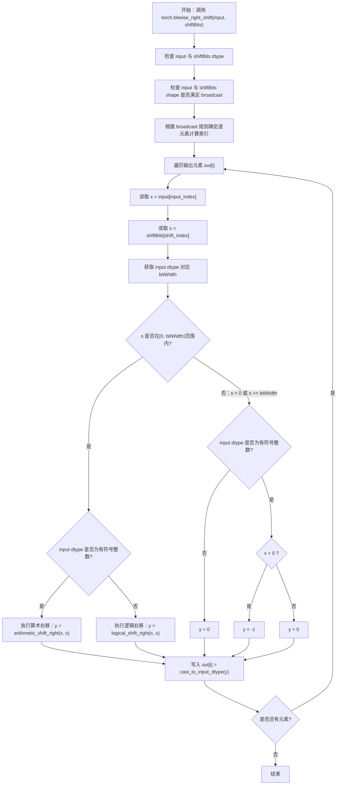
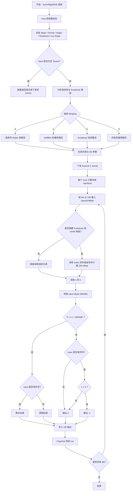

# RightShift 算子设计方案

## 需求背景

### 需求来源

- 通过社区任务完成昇腾开源算子仓算子贡献需求。
- 任务来源于 `RightShift` 算子开发任务书，目标是在昇腾 NPU 上基于 Ascend C 实现与 `torch.bitwise_right_shift` 精度一致的右移算子。

### 背景介绍

算子功能：实现按位右移算子 `RightShift`，对输入张量 `input` 按照 `shiftBits` 指定的位数执行逐元素右移计算，并输出到 `out`。

当前已有 `aclnnRightShift` 在 `shiftBits` 为负数时与 PyTorch 行为不一致。本任务需要参考 `aclnnRightShift` 的接口与原有支持范围，重新实现一个与 `torch.bitwise_right_shift` 行为一致的 Ascend C 算子。

计算公式：

```text
out = input >> shiftBits
```

按元素展开后：

```text
out[i] = right_shift(input[i], shiftBits_broadcast[i])
```

其中：

- `input`：待右移的整数张量。
- `shiftBits`：右移位数张量，需要满足与 `input` 的 broadcast 关系。
- `out`：输出张量，shape 与 `input` 保持一致。

### PyTorch 对齐语义

与 `torch.bitwise_right_shift` 的结果保持一致。

对每个元素，设：

- `x` 为 `input` 当前元素。
- `s` 为 `shiftBits` broadcast 后的当前元素。
- `bitWidth` 为 `input` dtype 的位宽，取值为 8、16、32 或 64。

右移计算规则设计如下：

1. 当 `0 <= s < bitWidth` 时：
   - 有符号整数执行算术右移，保留符号位。
   - 无符号整数执行逻辑右移，高位补 0。
2. 当 `s < 0` 或 `s >= bitWidth` 时：
   - 对有符号整数：
     - 若 `x < 0`，输出 `-1`。
     - 若 `x >= 0`，输出 `0`。
   - 对无符号整数：
     - 输出 `0`。

该规则等价于 PyTorch 对右移越界场景的饱和式处理：对有符号负数右移足够多位后得到 `-1`，对非负数或无符号数右移足够多位后得到 `0`。

## RightShift 算子现状分析

### 原算子支持方式

1. 原 `aclnnRightShift` 已支持整数类型输入，包含：
   - `INT8`、`INT16`、`INT32`、`INT64`
   - `UINT8`、`UINT16`、`UINT32`、`UINT64`
2. 原算子数据格式为 `ND`。
3. 输入 shape 维度范围为 0 到 8。
4. `input`、`shiftBits`、`out` 均要求支持非连续 Tensor。
5. `input` 支持空 Tensor。
6. `input` 与 `shiftBits` 需要满足 broadcast 关系。

### 原算子问题

当前第二个输入 `shiftBits` 为负数时，原实现与 `torch.bitwise_right_shift` 的输出不一致。常见风险包括：

1. 直接使用硬件或 C/C++ 位移指令，未显式处理负位移。
2. 对 `shiftBits >= bitWidth` 的情况没有统一处理。
3. 有符号右移和无符号右移路径没有区分。
4. 小位宽类型在计算过程中被提升后，未正确回转到原 dtype 语义。
5. broadcast 和非连续输入场景下，索引映射与 PyTorch 不一致。

### 设计目标

1. 功能上支持 `aclnnRightShift` 原有所有 dtype、format、shape 和非连续 Tensor 场景。
2. 精度上与 `torch.bitwise_right_shift` 保持一致。
3. 性能上尽量达到或超过原 `aclnnRightShift`，并以任务要求的 10X 性能目标为优化方向。
4. 实现泛化能力，覆盖常规场景、边界场景、broadcast 场景、空 Tensor 场景和非连续 Tensor 场景。
5. 文档、测试、自验证报告与 README 满足社区任务验收规范。

## torch.bitwise_right_shift 计算流程图

`RightShift` 算子的参考行为以 `torch.bitwise_right_shift` 为准。本节描述 PyTorch 侧参考计算流程，后续 Ascend C kernel 需要按照该流程实现一致行为。



## 需求详细设计

### 使能方式

创建并注册 `aclnnRightShift` 或社区任务要求的 RightShift 相关接口，通过 aclnn 调用路径使能该算子。

### 需求总体设计

RightShift 是二元逐元素整数算子。整体实现分为 host 侧参数检查与 tiling、device 侧 kernel 计算两部分。

#### host 侧设计

##### 1. 参数校验

host 侧需要完成以下检查：

1. `input`、`shiftBits`、`out` 指针合法。
2. `input` dtype 属于：
   - `INT8`、`INT16`、`INT32`、`INT64`
   - `UINT8`、`UINT16`、`UINT32`、`UINT64`
3. `shiftBits` dtype 属于：
   - `INT8`、`INT16`、`INT32`、`INT64`
   - `UINT8`、`UINT16`、`UINT32`、`UINT64`
4. `out` dtype 与 `input` dtype 一致。
5. format 为 `ND`。
6. shape 维度范围为 0 到 8。
7. `shiftBits` 可 broadcast 到 `input`。
8. `out` shape 与 `input` shape 保持一致。
9. 支持空 Tensor，若元素总数为 0，host 侧可以直接返回成功或下发空处理 kernel。

##### 2. shape 与 broadcast 处理

设计上以 `input` shape 作为输出 shape。`shiftBits` 需要满足 broadcast 到 `input` 的条件。

broadcast 判断规则：从最后一维向前对齐，对每一维：

```text
shift_dim == input_dim 或 shift_dim == 1 或 shiftBits 在该维缺省
```


对于非连续 Tensor，需要根据实际 stride 信息计算 GM 访问偏移，不能默认输入物理内存连续。

##### 3. 分核策略

1. 总元素数为 `totalLength = numel(input)`。
2. 优先按可用 AI Core 数进行均匀分核。
3. 每个 core 处理一个连续的逻辑输出区间：

```text
blockLength = ceil(totalLength / blockNum)
start = blockIdx * blockLength
end = min(start + blockLength, totalLength)
```

4. 当 `totalLength` 较小或小于单次处理粒度时，可减少使用核数，避免多核启动与尾块开销。
5. 当存在 broadcast 或非连续访问时，仍按输出逻辑线性 index 分核，在 kernel 内部将线性 index 转换为多维坐标，再映射到 `input` 和 `shiftBits` 的物理偏移。

##### 4. tilingKey 规划

建议设计如下 tilingKey：

| tilingKey | 场景 | 说明 |
| :---: | :--- | :--- |
| 0 | 连续同 shape 快路径 | `input`、`shiftBits`、`out` 均连续，且 shape 完全一致 |
| 1 | shiftBits 标量快路径 | `shiftBits` 为标量或 numel 为 1，input/out 连续 |
| 2 | broadcast 连续路径 | input/out 连续，shiftBits 需要 broadcast |
| 3 | 非连续通用路径 | input、shiftBits、out 中任一 Tensor 非连续 |
| 4 | 空 Tensor 路径 | totalLength 为 0 |

其中：

- `tilingKey = 0` 是主要性能优化路径。
- `tilingKey = 1` 适合常见的标量位移场景，可以减少 `shiftBits` 重复读取。
- `tilingKey = 2` 用于满足 broadcast 泛化要求。
- `tilingKey = 3` 用于满足非连续 Tensor 验收要求，性能优先级低于连续路径。
- `tilingKey = 4` 可以不下发有效计算。

##### 5. UB 切块策略

RightShift 是低计算强度、访存主导型算子。UB 规划应尽量减少中间 buffer 和多余搬运。

连续快路径建议：

1. 每次搬入一段 `input` 数据。
2. 每次搬入对应一段 `shiftBits` 数据；若 `shiftBits` 为标量，只搬入一次或使用标量寄存器缓存。
3. 在 UB 中完成向量化右移与边界处理。
4. 将结果搬回 `out`。

切块长度需要满足：

- GM 到 UB 搬运 32 Byte 对齐要求。
- UB 容量限制。
- dtype 大小差异。
- double buffer 需求。

可按如下方式估算单次 tile 元素数：

```text
inputBytes = sizeof(input_dtype)
shiftBytes = sizeof(shift_dtype)
outBytes = sizeof(input_dtype)
workspaceBytesPerElement = inputBytes + shiftBytes + outBytes + tempBytes
```

在 uint/int8 与 uint/int16 场景中，如果硬件右移指令不直接支持小位宽向量计算，可考虑在 UB 中提升到 int32/uint32 计算，再 cast 回原 dtype。

#### kernel 侧设计

##### 连续同 shape 快路径

适用条件：

- `input` 连续。
- `shiftBits` 连续。
- `out` 连续。
- `input.shape == shiftBits.shape == out.shape`。

该路径不需要多维索引换算，性能最好。

##### shiftBits 标量快路径

适用条件：

- `shiftBits` 为标量或只有一个元素。
- `input` 和 `out` 连续。

优化策略：

1. host 侧识别 `shiftBits.numel == 1`。
2. kernel 侧只读取一次 `shiftBits[0]`。
3. 若 `s` 为合法范围 `[0, bitWidth)`，整段 input 使用同一 shift 计算。
4. 若 `s` 为负数或超出 bitWidth，可直接将输出按 input 符号生成：
   - unsigned：整段输出 0。
   - signed：根据 input 是否小于 0 生成 -1 或 0。

##### broadcast 连续路径

适用条件：

- `input` 和 `out` 连续。
- `shiftBits` 需要 broadcast，但没有非连续 stride。

计算步骤：

1. 当前输出线性 index 转换为多维坐标。
2. 根据 broadcast 规则计算 `shiftBits` 线性偏移。
3. 读取 `input[index]` 和 `shiftBits[shiftOffset]`。
4. 执行右移边界处理。
5. 写回 `out[index]`。

broadcast offset 计算规则：

```text
shiftOffset = sum(coord[d] * shiftStride[d])
若 shiftShape[d] == 1，则该维 coord 对 shiftOffset 的贡献为 0
```

##### 非连续通用路径

适用条件：

- `input`、`shiftBits` 或 `out` 中任意一个 Tensor 非连续。

计算步骤：

1. 以输出逻辑 index 为主循环。
2. 将输出逻辑 index 转换为多维坐标。
3. 通过 `inputStride` 计算 input GM 偏移。
4. 通过 `shiftStride` 和 broadcast 规则计算 shiftBits GM 偏移。
5. 通过 `outStride` 计算 out GM 偏移。
6. 读取、计算、写回。

该路径访存不连续，性能较低，但可以满足泛化与非连续 Tensor 要求。


## Ascend C 实现流程图



## Ascend C 实现流程图与 torch 计算流程图差异点和原因

1. torch 流程图描述的是参考语义，重点在 dtype、broadcast 和越界 shift 处理。
2. Ascend C 流程图描述的是实际落地流程，需要额外包含 host 侧 tiling、分核、UB 搬运和 GM 写回。

## 支持硬件

| 产品 | 是否支持 |
| :--- | :---: |
| Atlas A2 训练系列产品 | √ |

## 算子原型

### 输入输出说明

| 参数名 | 输入/输出/属性 | 描述 | 数据类型 | 数据格式 | 维度(shape) | 非连续 Tensor |
| :--- | :--- | :--- | :--- | :---: | :---: | :---: |
| input | 输入 | 需要进行按位右移的张量 | INT8、INT16、INT32、INT64、UINT8、UINT16、UINT32、UINT64 | ND | 0-8 | √ |
| shiftBits | 输入 | 右移操作数张量，可 broadcast 到 input | INT8、INT16、INT32、INT64、UINT8、UINT16、UINT32、UINT64 | ND | 0-8 | √ |
| out | 输出 | 输出张量，shape 与 input 保持一致 | INT8、INT16、INT32、INT64、UINT8、UINT16、UINT32、UINT64 | ND | 0-8 | √ |

### shape 约束

1. `input` 支持空 Tensor。
2. `shiftBits` 需要满足 broadcast 到 `input` 的关系。
3. `out.shape == input.shape`。
4. `input`、`shiftBits`、`out` 均支持 0 到 8 维。

### dtype 约束

1. `input` 与 `out` dtype 必须一致。
2. `shiftBits` 可以与 `input` dtype 不一致，但必须属于支持的整数类型集合。
3. 不支持浮点、复数、bool 类型。

## 算子约束限制

1. 仅支持 ND 格式。
2. 仅支持整数输入类型。
3. `shiftBits` 必须可 broadcast 到 `input`。
4. 对负数 shift 和大于等于 bitWidth 的 shift，必须按照 PyTorch 行为进行显式处理。
5. 非连续 Tensor 场景需要使用 stride 进行地址映射，不能假设物理连续。

## 精度标准

1. 算子输出需要与 `torch.bitwise_right_shift` 保持一致。
2. 使用 AscendOpTest 默认阈值验收时，应全部通过。


## 性能设计

### 性能目标

任务要求算子整体性能达到原 `aclnnRightShift` 性能的 10X。


