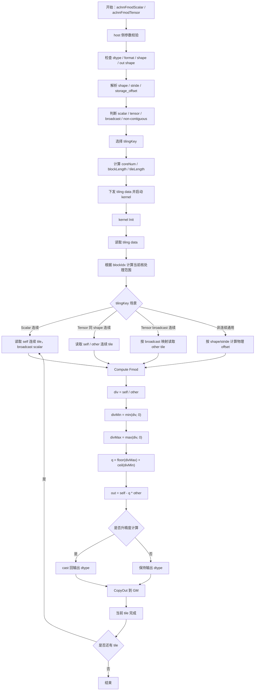

# FmodScalar / FmodTensor 算子设计文档

## 需求背景

### 需求来源

- 通过社区任务完成昇腾开源算子贡献的需求。
- 参考昇腾 CANN 内置 TBE `Mod` 算子实现，在 Atlas A2 / Atlas A3 系列产品上使用 Ascend C 实现功能一致的 `aclnnFmodScalar` 与 `aclnnFmodTensor` 算子。
- 算子交付目标包括：算子工程代码、README、自验证报告、设计文档，以及多组 aclnn 调用测试代码。

### 背景介绍

`Fmod` 算子用于执行逐元素取模计算。该算子的语义是基于向 0 截断除法的取余，而不是基于向下取整的取余。参考 TBE 源码中的注释：

```text
truncate_mod(x, y) = x - truncate_div(x, y) * y
```

其中：

- `x` 对应 `self` / `input_x`；
- `y` 对应 `other` / `input_y`；
- `truncate_div(x, y)` 表示 `x / y` 后向 0 截断得到的商；
- 输出结果与 `x` 同号或为 0。

计算公式为：

```text
out = self - trunc(self / other) * other
```

当 `self / other` 大于等于 0 时，`trunc(self / other)` 等价于 `floor(self / other)`；当 `self / other` 小于 0 时，`trunc(self / other)` 等价于 `ceil(self / other)`。因此 TBE 实现中通过 `vmin`、`vmax`、`floor`、`ceil` 组合实现向 0 截断。

本任务包含两个 aclnn 接口：

1. `aclnnFmodScalar`
   - `self` 为输入 Tensor；
   - `other` 为 Scalar；
   - `out` 的 shape 与 `self` 一致。

2. `aclnnFmodTensor`
   - `self` 为输入 Tensor；
   - `other` 为输入 Tensor；
   - `out` 的 shape 与 `self` 一致；
   - `other` 需要满足与 `self` 的合法广播关系，或在同 shape 场景下逐元素计算。

### 算子实现信息

1. TBE 参考实现
   - kernel 实现：
     - `/usr/local/Ascend/ascend-toolkit/latest/opp/built-in/op_impl/ai_core/tbe/impl/ops_legacy/dynamic/mod.py`
   - 算子原型：
     - `/usr/local/Ascend/ascend-toolkit/latest/opp/built-in/op_proto/inc/ops_proto_math.h`
   - 算子信息库：
     - `/usr/local/Ascend/ascend-toolkit/latest/opp/built-in/op_impl/ai_core/tbe/config/ascend910b/aic-ascend910b-ops-info-legacy.json`

2. 开源仓路径
   - 开源仓：`https://gitcode.com/cann/ops-math`
   - 参考样例：`https://gitcode.com/cann/ops-math/tree/master/math/mod`
   - 目标合入路径：`experimental/math`

3. 目标硬件与语言
   - 适配硬件：Atlas A2 训练系列产品 / Atlas A3 系列产品
   - 开发语言：Ascend C
   - 支持格式：ND
   - 支持 dtype：`BFLOAT16`、`FLOAT16`、`FLOAT32`、`INT16`

---

## TBE 算子现状分析

### TBE 算子支持方式

参考 `mod.py`，TBE 版本通过如下方式实现动态 shape、广播、融合和 bfloat16 支持：

```python
@register_operator_compute("Mod", op_mode="dynamic", support_fusion=True, support_bfp16=True)
def mod_compute(input_x, input_y, output_z, kernel_name="mod"):
    ...
```

TBE 入口函数通过：

```python
ins = classify([input_x, input_y], OpPatternMode.ELEWISE_WITH_BROADCAST)
```

对输入进行 `ELEWISE_WITH_BROADCAST` 分类，再对每一组分类结果创建 TVM placeholder、构造计算图并自动调度。

TBE 源码支持的 dtype 为：

```python
check_list = ("float16", "float32", "int8", "uint8", "int32", "bfloat16")
```

本任务的目标 dtype 为：

```text
BFLOAT16、FLOAT16、FLOAT32、INT16
```

因此 Ascend C 设计以任务书要求为准，同时参考 TBE 的核心计算语义与升精度策略。

### TBE 参数校验与 shape 处理

TBE 入口函数 `mod(input_x, input_y, output_z, kernel_name="mod")` 的主要处理流程如下：

1. 通过 `@para_check.check_op_params` 检查两个输入、一个输出以及 `kernel_name`。
2. 通过 `shape_util.compare_tensor_dict_key(input_x, input_y, "dtype")` 要求两个输入 dtype 一致。
3. 通过 `para_check.check_dtype(input_dtype, check_list, param_name="input_x")` 检查输入 dtype 是否在支持列表中。
4. 通过 `classify([input_x, input_y], OpPatternMode.ELEWISE_WITH_BROADCAST)` 对动态 shape 与广播场景进行分类。
5. 对每组分类结果：
   - 调用 `shape_util.variable_shape([input_x_dict, input_y_dict])` 获取动态 shape；
   - 调用 `shape_util.refine_shapes_for_broadcast(shape_x, shape_y)` 对广播 shape 进行规整；
   - 创建 `data_x`、`data_y` 两个 placeholder；
   - 调用 `mod_compute` 构造计算图；
   - 调用 `tbe.auto_schedule(res)` 自动调度；
   - 最终通过 `tbe.build(schedule, config)` 编译生成算子。

### TBE 核心计算逻辑

TBE `mod_compute` 的核心逻辑如下：

1. 读取输入 shape 与 dtype。
2. 若输入 dtype 不是 `float32` 且平台支持 `float32` 的 `vdiv`，则将 `input_x` 与 `input_y` 升精度到 `float32`。
3. 若两个输入 shape 不一致，则调用 `shape_util.broadcast_shapes` 获取广播后的 shape，并对两个输入执行 `tbe.broadcast`。
4. 计算除法：

```python
data_div = tbe.vdiv(input_x, input_y)
```

5. 构造 0 常量向量：

```python
data_zero = tbe.broadcast(tvm.const(0, "float32"), shape_broadcast, "float32")
```

6. 将 `data_div` 拆分为非正部分与非负部分：

```python
data_div_min = tbe.vmin(data_div, data_zero)
data_div_max = tbe.vmax(data_div, data_zero)
```

7. 对非负部分取 `floor`，对非正部分取 `ceil`：

```python
data_div_max_floor = tbe.floor(data_div_max, "float32")
data_div_min_ceil = tbe.ceil(data_div_min, "float32")
```

8. 两部分相加得到向 0 截断后的商：

```python
data_div_res = tbe.vadd(data_div_max_floor, data_div_min_ceil)
```

9. 将截断商转换为 `input_y` 的 dtype，执行乘法和减法：

```python
data_div_res = tbe.cast_to(data_div_res, input_y.dtype.lower())
data_mul = tbe.vmul(data_div_res, input_y)
res = tbe.vsub(input_x, data_mul)
```

10. 若前面做过升精度，则将结果转回原始 dtype。

### TBE 计算语义说明

TBE 的核心公式可等价表示为：

```text
q_pos = floor(max(self / other, 0))
q_neg = ceil(min(self / other, 0))
q = q_pos + q_neg
out = self - q * other
```

该实现等价于：

```text
out = self - trunc(self / other) * other
```

其中 `trunc` 表示向 0 截断。

### TBE 算子实现流程图

```mermaid
graph TD
    R0["@register_operator('Mod') / @register_operator_compute('Mod', op_mode='dynamic', support_fusion=True, support_bfp16=True)"] --> A["开始：执行 Mod 入口函数 mod"]
    A --> B["@para_check.check_op_params 参数校验"]
    B --> B1["检查 REQUIRED_INPUT / REQUIRED_INPUT / REQUIRED_OUTPUT / KERNEL_NAME"]
    B1 --> B2["shape_util.compare_tensor_dict_key 校验 input_x 与 input_y 的 dtype 一致"]
    B2 --> B3["para_check.check_dtype 检查 input_x dtype 在支持列表中"]
    B3 --> C["classify([input_x, input_y], ELEWISE_WITH_BROADCAST)"]
    C --> D["遍历每组分类结果 ins"]
    D --> E["tbe.compute() 计算域"]
    E --> F["shape_util.variable_shape 获取动态 shape"]
    F --> G["shape_util.refine_shapes_for_broadcast 规整广播 shape"]
    G --> H["创建 data_x / data_y TVM placeholder"]
    H --> I["调用 mod_compute(data_x, data_y, output_z)"]
    I --> J["tvm.target.cce() 进入调度域"]
    J --> K["tbe.auto_schedule(res)"]
    K --> L["收集 schedule 与 tensors"]
    L --> M["循环结束后构造 config"]
    M --> N["tbe.build(schedule, config)"]
    N --> O["结束入口函数"]

    I --> P["进入 mod_compute"]
    P --> P1["读取 input_x.shape / input_y.shape / input_x.dtype"]
    P1 --> P2["初始化 has_improve_precision = False"]
    P2 --> Q{"dtype != float32 且支持 te.lang.cce.vdiv(float32)"}
    Q -->|是| Q1["input_x / input_y cast_to float32，并置 has_improve_precision = True"]
    Q -->|否| Q2["保持原始 dtype"]
    Q1 --> R{"input_x.shape 与 input_y.shape 是否一致"}
    Q2 --> R

    R -->|否| R1["shape_util.broadcast_shapes 计算 shape_broadcast"]
    R1 --> R2["tbe.broadcast(input_x, shape_broadcast, float32)"]
    R2 --> R3["tbe.broadcast(input_y, shape_broadcast, float32)"]
    R -->|是| R4["shape_broadcast = shape_x"]

    R3 --> S["data_div = tbe.vdiv(input_x, input_y)"]
    R4 --> S
    S --> T["data_zero = tbe.broadcast(tvm.const(0, float32), shape_broadcast, float32)"]
    T --> U["data_div_min = tbe.vmin(data_div, data_zero)"]
    U --> V["data_div_max = tbe.vmax(data_div, data_zero)"]
    V --> W{"支持 tbe.dsl.ceil(f322f32)"}
    W -->|是| W1["data_div_max_floor = tbe.floor(data_div_max, float32)"]
    W1 --> W2["data_div_min_ceil = tbe.ceil(data_div_min, float32)"]
    W -->|否| W3["data_div_max_floor = tbe.floor(data_div_max)"]
    W3 --> W4["data_div_min_ceil = tbe.ceil(data_div_min)"]

    W2 --> X{"dtype != int32 且支持 te.lang.cce.vmul(float32)"}
    W4 --> X
    X -->|是| X1["data_div_max_floor / data_div_min_ceil cast_to float32"]
    X -->|否| X2["保持当前 dtype"]
    X1 --> Y["data_div_res = tbe.vadd(data_div_max_floor, data_div_min_ceil)"]
    X2 --> Y
    Y --> Z["data_div_res cast_to input_y.dtype.lower()"]
    Z --> AA["data_mul = tbe.vmul(data_div_res, input_y)"]
    AA --> AB["res = tbe.vsub(input_x, data_mul)"]
    AB --> AC{"是否做过升精度"}
    AC -->|是| AD["res cast_to 原始 dtype"]
    AC -->|否| AE["保持当前 dtype"]
    AD --> AF["return res"]
    AE --> AF
```



---

## 需求详细设计

### 使能方式

通过 aclnn 接口调用本算子：

1. `aclnnFmodScalar`
   - 用于 Tensor 与 Scalar 的逐元素 fmod 计算。

2. `aclnnFmodTensor`
   - 用于 Tensor 与 Tensor 的逐元素 fmod 计算。
   - Tensor 版本需要支持同 shape 与合法广播场景。

### 算子原型

#### aclnnFmodScalar

| 参数名 | 类别 | 描述 | 数据类型 | 数据格式 | shape | 非连续 Tensor |
| :--- | :--- | :--- | :--- | :--- | :--- | :---: |
| self | 输入 Tensor | 待进行 Fmod 的输入 Tensor | BFLOAT16、FLOAT16、FLOAT32、INT16 | ND | 0~8 维 | √ |
| other | 输入 Scalar | 待进行 Fmod 的 Scalar | BFLOAT16、FLOAT16、FLOAT32、INT16 | - | - | - |
| out | 输出 Tensor | Fmod 输出结果，shape 与 self 一致 | BFLOAT16、FLOAT16、FLOAT32、INT16 | ND | 与 self 一致 | 按接口要求 |

#### aclnnFmodTensor

| 参数名 | 类别 | 描述 | 数据类型 | 数据格式 | shape | 非连续 Tensor |
| :--- | :--- | :--- | :--- | :--- | :--- | :---: |
| self | 输入 Tensor | 待进行 Fmod 的左操作数 | BFLOAT16、FLOAT16、FLOAT32、INT16 | ND | 0~8 维 | √ |
| other | 输入 Tensor | 待进行 Fmod 的右操作数 | BFLOAT16、FLOAT16、FLOAT32、INT16 | ND | 0~8 维 | √ |
| out | 输出 Tensor | Fmod 输出结果，shape 与 self 一致 | BFLOAT16、FLOAT16、FLOAT32、INT16 | ND | 与 self 一致 | √ |

### 功能约束与语义约束

1. 输出 shape
   - `FmodScalar`：`out.shape == self.shape`。
   - `FmodTensor`：`out.shape == self.shape`，`other` 需要能够广播到 `self.shape`，或与 `self.shape` 完全一致。

2. dtype 支持
   - 支持 `BFLOAT16`、`FLOAT16`、`FLOAT32`、`INT16`。
   - `self`、`other`、`out` 的 dtype 需要满足 aclnn 原型侧的类型推导与可转换规则。
   - kernel 实现中优先按输出 dtype 写回。

3. 数据格式
   - 支持 ND。

4. shape 范围
   - 支持 0~8 维。
   - 需要覆盖 0 维标量 Tensor、空 Tensor、小 shape、大 shape、广播 shape、非连续 Tensor 等泛化场景。

5. 除 0 行为
   - 本设计不在 kernel 内额外定义除 0 特殊规则，行为以 CANN/TBE 内置算子实际行为为准。
   - 测试阶段需要覆盖 `other == 0` 场景，并与 TBE 结果保持一致。

6. 负数行为
   - 必须按向 0 截断取余实现，保证结果与 TBE `Mod` 语义一致。
   - 例如：
     - `fmod(5.3, 2.0) = 1.3`
     - `fmod(-5.3, 2.0) = -1.3`
     - `fmod(5.3, -2.0) = 1.3`
     - `fmod(-5.3, -2.0) = -1.3`

---

## 需求总体设计

### 总体实现思路

本算子属于 elementwise 二元算子，整体实现分为 host 侧 tiling 与 kernel 侧计算两部分：

1. host 侧
   - 解析输入 shape、stride、dtype、数据量、广播关系；
   - 判断是否为连续 Tensor；
   - 根据 shape、广播、非连续情况选择 `tilingKey`；
   - 计算分核策略、单核处理长度、尾块长度、UB 分块大小；
   - 将必要的 tiling 参数写入 tiling data。

2. kernel 侧
   - 根据 `tilingKey` 选择连续、广播、非连续或 scalar 路径；
   - 按 block 维度分配 GM 数据范围；
   - 将输入数据搬入 UB；
   - 对当前 tile 执行 fmod 计算；
   - 将结果搬出到 GM。

### host 侧设计

#### 1. 输入参数解析

host 侧需要解析如下信息：

1. `self` 的 shape、stride、storage offset、dtype、元素个数；
2. `other` 的 shape、stride、storage offset、dtype，或 scalar 值；
3. `out` 的 shape、stride、storage offset、dtype；
4. `self` 与 `other` 的广播关系；
5. `self`、`other`、`out` 是否为连续 Tensor；
6. 当前 dtype 对应的元素字节数；
7. 总元素数 `totalLength = NumElements(self)`。

#### 2. 分核策略

1. 优先采用满核参与计算策略。
2. 设可用 AI Core 数为 `coreNum`，总元素数为 `totalLength`。
3. 当 `totalLength >= coreNum` 时，按如下方式分配：

```text
blockLength = ceil(totalLength / coreNum)
usedCoreNum = coreNum
```

4. 当 `totalLength < coreNum` 时：

```text
blockLength = 1
usedCoreNum = totalLength
```

5. 每个核根据 `blockIdx` 计算自己的起始逻辑下标：

```text
start = blockIdx * blockLength
end = min(start + blockLength, totalLength)
```

6. 对于空 Tensor，host 侧可直接返回或生成 `totalLength = 0` 的 tiling，由 kernel 快速退出。

#### 3. UB 分块策略

Fmod 计算至少需要以下 UB buffer：

- `xLocal`：self tile；
- `yLocal`：other tile 或 scalar broadcast 后 tile；
- `tmpDiv`：除法中间结果；
- `tmpMin` / `tmpMax`：截断商计算中间结果，或复用临时 buffer；
- `tmpFloor` / `tmpCeil`：floor / ceil 结果，或复用临时 buffer；
- `qLocal`：截断商；
- `outLocal`：输出 tile。

为降低 UB 占用，建议进行 buffer 复用：

1. `tmpDiv` 保存 `x / y`。
2. `tmpMax` 可在计算 `floor(max(div, 0))` 后复用。
3. `tmpMin` 可在计算 `ceil(min(div, 0))` 后复用。
4. `qLocal = tmpMax + tmpMin`。
5. `outLocal = xLocal - qLocal * yLocal`。

对于 `FLOAT16`、`BFLOAT16`、`INT16`，若升精度到 `FLOAT32` 计算，则 UB 中间 buffer 需要按 `float` 规划，tile 长度需要相应减小。

#### 4. tilingKey 规划

建议使用如下 `tilingKey`：

| tilingKey | 场景 | 说明 |
| :---: | :--- | :--- |
| 0 | Scalar + 连续 self/out | `FmodScalar` 高性能路径，other 为 scalar，self/out 连续 |
| 1 | Tensor + 同 shape 连续输入输出 | `FmodTensor` 高性能路径，self/other/out 连续且 shape 一致 |
| 2 | Tensor + broadcast 连续输入输出 | other 可广播到 self，逻辑连续访问 |
| 3 | Scalar + 非连续 self 或 out | scalar 场景的通用 stride 路径 |
| 4 | Tensor + 非连续输入或输出 | tensor 场景的通用 stride / broadcast 路径 |

首版实现若需要控制风险，可优先完成 `tilingKey = 0/1/2`，再补齐非连续路径。但任务验收要求覆盖非连续 Tensor，因此最终版本必须实现 `tilingKey = 3/4` 或通过框架侧连续化机制保证非连续场景正确。

#### 5. 非连续 Tensor 处理策略

对于非连续 Tensor，逻辑下标到物理 GM offset 的转换如下：

```text
physical_offset = storage_offset + sum(index[d] * stride[d])
```

其中：

- `index[d]` 是逻辑多维下标；
- `stride[d]` 是对应维度的物理步长；
- `storage_offset` 是 Tensor 起始偏移。

host 侧需要将 0~8 维的 shape 与 stride 写入 tiling data。kernel 侧根据线性逻辑下标还原多维下标，再计算 `self`、`other`、`out` 的物理地址。

对于广播维度：

```text
if other_shape[d] == 1 and self_shape[d] != 1:
    other_index[d] = 0
else:
    other_index[d] = self_index[d]
```

### kernel 侧设计


#### 连续 Tensor 高性能路径

连续路径中，每个核处理一段连续逻辑区间：

#### Scalar 路径

Scalar 路径中，`other` 是 aclScalar。host 侧需要将 scalar 值写入 tiling data 或通过 kernel 参数传入。kernel 侧将 scalar 转换为 `CalcT` 后，在 UB 内 broadcast 为向量：

```text
yLocal = broadcast(otherScalar)
outLocal = fmod(xLocal, yLocal)
```

Scalar 路径不需要处理 `other` 的 GM 读入，因此性能通常优于 Tensor 路径。

#### Tensor broadcast 路径

Tensor broadcast 路径需要根据逻辑下标计算 `other` 的读取位置。对于连续但 broadcast 的场景，可按以下方式优化：

1. 若 `other` 是 0 维或元素数为 1，可退化为 Scalar-like 路径。
2. 若 broadcast 只发生在外层维度，内层连续维与 `self` 一致，可按内层连续块批量搬运。
3. 若 broadcast 发生在内层维度，需要按维度切分，避免逐元素 scalar 搬运导致性能下降。
4. 对一般 0~8 维 broadcast，可实现通用 index 映射路径，作为保底正确性路径。

#### 非连续通用路径

非连续路径优先保证正确性：


为提升性能，可将连续子段识别为小块批量搬运；无法形成连续块时，使用 DataCopyPad / Gather-like 标量读写或循环处理。

### Ascend C 实现流程图



### Ascend C 实现与 TBE 实现差异点

1. TBE 通过 `classify(..., ELEWISE_WITH_BROADCAST)` 与 `auto_schedule` 自动处理广播与调度；Ascend C 需要显式实现 tiling、分核、UB 分配、搬运和广播索引映射。
2. TBE 中 `tbe.broadcast` 是逻辑表达式图操作；Ascend C 中需要根据不同场景选择 scalar broadcast、连续搬运、按维映射或非连续通用路径。
3. TBE 根据平台能力在计算前对非 `float32` 类型升精度到 `float32`；Ascend C 需要通过模板参数与 Cast 指令显式实现对应策略。
4. TBE 的 `floor` / `ceil` 由 DSL 表达式描述；Ascend C 需要确认对应 Vector API 能力，并在不支持某 dtype 的情况下通过 `float32` 中间类型实现。
5. TBE 的非连续 Tensor 通常由上层图编译和 Tensor 描述协同处理；Ascend C 实现需要明确处理 stride、storage offset 与输出非连续写回。

---

## 精度设计

### 精度目标

精度要求满足 AscendOpTest 工具默认阈值，并与内置 TBE 算子结果对齐。


## 性能设计

### 性能目标

1. 所有核参与计算场景下，性能不低于原 TBE 算子的 95%。
2. 小 shape 如果无法达标，10us 以下场景允许通过性能仿真图和分析结论说明 Ascend C 实现与 TBE 一致或优于 TBE。

---

## 支持硬件

| 产品 | 是否支持 |
| :--- | :---: |
| Atlas A2 训练系列产品 | √ |
| Atlas A3 系列产品 | √ |

---

## README 使用示例建议

README 中建议提供如下内容：

1. 算子功能说明；
2. 计算公式；
3. 支持 dtype / shape / format；
4. `aclnnFmodScalar` 调用示例；
5. `aclnnFmodTensor` 调用示例；
6. 编译方法；
7. 运行测试方法；
8. 精度和性能对比说明。

---
