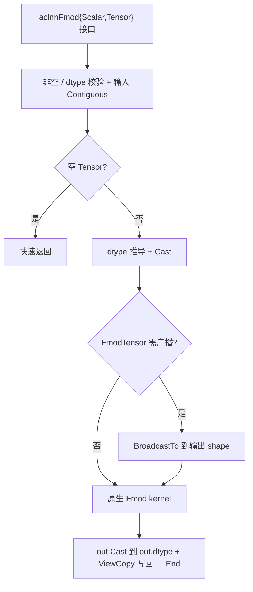
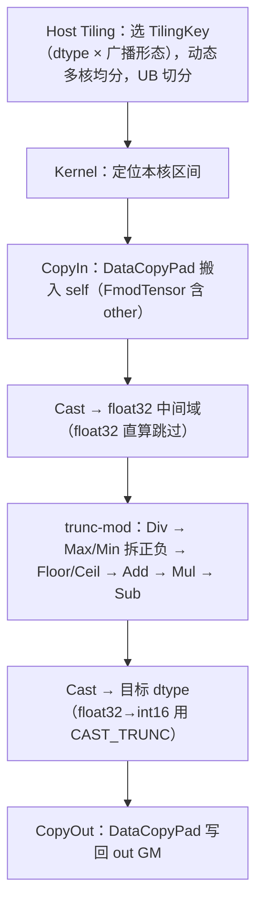

# FmodScalar & FmodTensor 算子设计文档

> 本文档一份覆盖一对镜像算子 `FmodScalar`（`aclnnFmodScalar`：self=Tensor、other=Scalar）与 `FmodTensor`（`aclnnFmodTensor`：self=Tensor、other=Tensor，支持广播），二者共享同一套截断取余（trunc-mod）计算核，差异处分别说明。

## 一、需求背景

### 1.1 需求来源

社区任务 `第 11 题 FmodScalar & FmodTensor` 要求参考昇腾版本内置 `aclnnFmodScalar` 与 `aclnnFmodTensor` 算子的 TBE 实现，在昇腾 NPU 上基于 Ascend C 编程语言实现**功能一致**的原生算子，完成算子设计、开发、测试和验收交付。两者的原 TBE 功能实现均对应内部 `Mod` 算子（截断取余）。验收通过后将算子提交至昇腾算子开源仓 **ops-math** 的 `experimental/math`。

- 语义对标：C 库 `fmod` / PyTorch `torch.fmod` / numpy `np.fmod`，即**截断取余**，结果符号随被除数 `self`。
- 任务类型：基于内置 TBE `Mod` 再开发为 Ascend C 原生算子。
- 目标仓：ops-math（gitcode `cann/ops-math`），最终 PR 至 `experimental/math`。

### 1.2 背景介绍

#### 1.2.1 算子目标

`Fmod` 计算 `self` 对 `other` 的 C 风格取余，逐元素二元运算，结果符号随被除数。数学定义：

$$out_i = self_i - trunc\!\left(\frac{self_i}{other_i}\right)\times other_i$$

其中 `trunc(·)` 为朝零截断。区别于 floor-mod（`%` / `remainder`，符号随除数）：例如 `fmod(-7, 3) = -1`（符号随 -7），而 floor-mod 为 `2`。

本次设计目标如下：

1. 功能语义与任务环境内置 TBE `Mod`（截断取余）保持一致。
2. 对外提供 `aclnnFmodScalar` 与 `aclnnFmodTensor` 两段式接口；`FmodScalar` 的 `other` 为标量、隐式全广播至 `self.shape`，`FmodTensor` 的 `other` 为张量、与 `self` 满足 broadcast 关系。
3. 原生算子工程交付 `FmodScalar` 与 `FmodTensor` 的 Host 定义、InferShape、Tiling 与 AiCore Kernel。
4. 支持任务书要求的 `BFLOAT16`、`FLOAT16`、`FLOAT32`、`INT16` 四类输入 dtype，format 为 `ND`，rank 范围为 `[0, 8]`。
5. 当前设计适配任务书要求的 Atlas A2 训练系列产品/Atlas A3 系列产品。

#### 1.2.2 TBE 基线来源说明

本任务以内置 TBE 算子作为功能、精度与性能对齐基线。对外 `aclnnFmodScalar` / `aclnnFmodTensor` 接口的底层功能实现为内部 `Mod`（截断取余）。设计分析参考路径如下：

| 基线层次 | 直接路径 | 作用 |
| --- | --- | --- |
| TBE Kernel 实现层 | `/usr/local/Ascend/ascend-toolkit/latest/opp/built-in/op_impl/ai_core/tbe/impl/ops_legacy/dynamic/mod.py` | 查看 `Mod` 截断取余主体计算流程，作为功能 ground truth |
| 算子原型层 | `/usr/local/Ascend/ascend-toolkit/latest/opp/built-in/op_proto/inc/elewise_calculation_ops.h` | 核对内部 `Mod` 的输入、输出定义（`x1`、`x2` → `y`） |
| 算子信息库层 | `/usr/local/Ascend/ascend-toolkit/latest/opp/built-in/op_impl/ai_core/tbe/config/ascend910b/aic-ascend910b-ops-info-legacy.json` | 核对 `Mod` 注册条目、dtype、format、动态 shape/rank 能力与 broadcast slice pattern |

外部 `aclnn` 接口与内部原生算子的职责不同：`aclnn` 接口层负责参数校验、dtype 推导/Cast、非连续输入规整、输出 ViewCopy 与执行器组装；内部原生算子负责连续 ND Tensor 上的截断取余计算。设计文档按这两层分别描述。

> **op_type 命名说明**：内置 TBE 已注册 `Mod` / `FloorMod` / `TruncateMod`（无 `Fmod`）。为避免与内置 `Mod` 原型遮蔽，本任务新建原生算子的 op_type 命名为 `FmodScalar` / `FmodTensor`（与 aclnn 接口同名），功能对标内置 `Mod`。

#### 1.2.3 TBE Mod 算子现状分析

内置 TBE `Mod` 为逐元素二元截断取余算子，入口 `mod(input_x, input_y, output_z)`，输入 `x1`、`x2`，输出 `y`，`op.pattern=broadcast`。入口经 `classify([input_x, input_y], ELEWISE_WITH_BROADCAST)` 分类后逐组创建 placeholder、调用 `mod_compute` 构图、`auto_schedule` 自动调度、`tbe.build` 编译。支持 dtype 校验列表为 `float16/float32/int8/uint8/int32/bfloat16`。结合任务书要求，本文交付范围与现状的差异如下：

| 维度 | 内置 TBE `Mod` 现状 | 本任务交付范围 |
| --- | --- | --- |
| 数据类型 | `float16`、`float`、`int32`、`int8`、`uint8`、`bfloat16`（信息库注册，**不含 int16**） | `BFLOAT16`、`FLOAT16`、`FLOAT32`、`INT16`（其中 **INT16 为内置未覆盖、本设计自实现**） |
| 计算精度 | 非 `float32` 输入升精度到 `float32` 中间域计算 | 一致：非 `float32` 一律 Cast 到 `float32` 中间域计算后回写 |
| 标量除数 | 通过 `tbe.broadcast` 将标量广播为张量 | `FmodScalar` 标量经 Host 侧承载，免一路搬运/广播 |
| 张量广播 | `tbe.broadcast` 到 broadcast shape | `FmodTensor` 经 `aclnn` 侧 `BroadcastTo` 规整到输出 shape，kernel 见同 shape |

**TBE `mod_compute` 核心计算逻辑（逐步还原 mod.py 主体，含升精度/类型转换边界）**：

1. 读取 `input_x.shape` / `input_y.shape` / `input_x.dtype`，初始化 `has_improve_precision = False`。
2. **升精度**：若 `dtype != "float32"` 且平台支持 `vdiv(float32)`，则 `input_x` / `input_y` 经 `cast_to` 升精度到 `float32`，并置 `has_improve_precision = True`。
3. **广播**：若两输入 shape 不一致，`broadcast_shapes` 求广播 shape，`input_x` / `input_y` 经 `tbe.broadcast` 展开到该 shape。
4. **求商**：`data_div = vdiv(input_x, input_y)`。
5. 构造零向量：`data_zero = broadcast(const(0, "float32"), shape_broadcast)`。
6. **拆正负**：`data_div_min = vmin(data_div, data_zero)`（非正部分）、`data_div_max = vmax(data_div, data_zero)`（非负部分）。
7. **取整**：`data_div_max_floor = floor(data_div_max[, "float32"])`、`data_div_min_ceil = ceil(data_div_min[, "float32"])`（正分量向下、负分量向上，合并即朝零截断；floor/ceil 输出类型按平台是否支持 `f32→f32` 取 `float32` 或 `int32`）。
8. **★精度对齐（红框上半）**：若 `dtype != "int32"` 且平台支持 `vmul(float32)`，则将 `data_div_max_floor` / `data_div_min_ceil` 各 `cast_to("float32")`；随后 `data_div_res = vadd(data_div_max_floor, data_div_min_ceil)`（= 截断商 `trunc(self/other)`）。
9. **★乘减（红框下半）**：`data_div_res = cast_to(data_div_res, input_y.dtype.lower())`（**截断商在做乘法前转回 `input_y` 的当前 dtype**）→ `data_mul = vmul(data_div_res, input_y)` → `res = vsub(input_x, data_mul)`（即 `self - trunc(self/other)*other`，符号随被除数）。
10. **降精度回写**：若 `has_improve_precision == True`，则 `res = cast_to(res, 原始 dtype)`。

> ★ 第 8–9 步即评审重点关注的精度边界：floor/ceil 结果按 `dtype != int32` 条件升 `float32` 后再 `vadd`，且截断商在 `vmul` / `vsub` 前经 `cast_to(input_y.dtype)` 转回当前类型——这是 mod.py 与抽象「全程一种精度」叙述的关键差异点，本设计完整还原以保证与基线逐位对齐（等价性见 §3.2.2 说明）。

TBE `mod_compute` 计算流程（忠实还原 mod.py，含升精度与红框精度转换分支）：

```mermaid
flowchart TD
    A["读取 input_x.shape / input_y.shape / input_x.dtype；has_improve_precision = False"] --> B{"dtype != float32 且 api_check_support(te.lang.cce.vdiv, float32)?"}
    B -- 是 --> B1["input_x / input_y = cast_to(·, float32)；has_improve_precision = True"]
    B -- 否 --> B2["保持原始 dtype"]
    B1 --> C{"list(shape_x) != list(shape_y)?"}
    B2 --> C
    C -- 是 --> C1["shape_broadcast = broadcast_shapes(shape_x, shape_y)；input_x / input_y = tbe.broadcast(·, shape_broadcast, float32)"]
    C -- 否 --> C2["shape_broadcast = shape_x"]
    C1 --> D["data_div = tbe.vdiv(input_x, input_y)"]
    C2 --> D
    D --> E["data_zero = tbe.broadcast(tvm.const(0, float32), shape_broadcast, float32)"]
    E --> F["data_div_min = tbe.vmin(data_div, data_zero)；data_div_max = tbe.vmax(data_div, data_zero)"]
    F --> G{"api_check_support(tbe.dsl.ceil, f322f32)?"}
    G -- 是 --> G1["data_div_max_floor = tbe.floor(data_div_max, float32)；data_div_min_ceil = tbe.ceil(data_div_min, float32)"]
    G -- 否 --> G2["data_div_max_floor = tbe.floor(data_div_max)；data_div_min_ceil = tbe.ceil(data_div_min)"]
    G1 --> H{"dtype != int32 且 api_check_support(te.lang.cce.vmul, float32)?（红框）"}
    G2 --> H
    H -- 是 --> H1["data_div_max_floor / data_div_min_ceil = cast_to(·, float32)"]
    H -- 否 --> H2["保持当前 dtype"]
    H1 --> I["data_div_res = tbe.vadd(data_div_max_floor, data_div_min_ceil)（= 截断商 trunc(self/other)）"]
    H2 --> I
    I --> J["data_div_res = tbe.cast_to(data_div_res, input_y.dtype.lower())（红框：乘减前转回 input_y 类型）"]
    J --> K["data_mul = tbe.vmul(data_div_res, input_y)"]
    K --> L["res = tbe.vsub(input_x, data_mul)（符号随被除数）"]
    L --> M{"has_improve_precision?"}
    M -- 是 --> M1["res = tbe.cast_to(res, 原始 dtype)"]
    M -- 否 --> M2["保持当前 dtype"]
    M1 --> N["return res"]
    M2 --> N
```

## 二、需求分析

### 2.1 外部组件依赖

不引入新的第三方组件，复用 CANN 社区任务已有的算子编译框架、`aclnn` 两段式接口、`opdev` / `l0op` 接口（含 `Contiguous` / `BroadcastTo` / `Cast` / `ViewCopy`）、Host Tiling 与 Ascend C Kernel 运行环境。

### 2.2 内部适配模块

| 模块 | 计划文件 | 设计职责 |
| --- | --- | --- |
| API 文档 | `docs/aclnnFmodScalar.md`、`docs/aclnnFmodTensor.md` | 说明两段式接口、参数、返回值、约束与示例 |
| `aclnn` 接口层 | `op_api/aclnn_fmod_scalar.cpp`、`op_api/aclnn_fmod_tensor.cpp` | 参数校验、dtype 推导/Cast、非连续输入 Contiguous、张量广播 `BroadcastTo`、输出 ViewCopy、执行器组装 |
| Host 定义 | `op_host/fmod_scalar_def.cpp`、`op_host/fmod_tensor_def.cpp` | 注册输入输出、dtype/format、动态 shape/rank 与 AICore 配置 |
| Shape 推导 | `op_host/fmod_scalar_infershape.cpp`、`op_host/fmod_tensor_infershape.cpp` | `FmodScalar` 输出 shape 同 `self`；`FmodTensor` 输出 shape 为 `broadcast(self, other)` |
| Tiling 层 | `op_host/fmod_tiling.cpp` | 计算分核策略、UB 切分与 tiling key（scalar / tensor 共享） |
| Kernel 数据 | `op_kernel/fmod_tiling_data.h` | 定义 Kernel 侧所需 tiling 字段 |
| Kernel 入口 | `op_kernel/fmod_scalar_arch22.cpp`、`op_kernel/fmod_tensor_arch22.cpp` | 按 dtype 与 scalar/tensor 模式进入共享 Ascend C Kernel |
| 测试与样例 | `examples/`、`tests/` | 覆盖接口调用、功能正确性、广播、非连续 Tensor、边界 shape 与性能对比 |

### 2.3 需求模块设计

#### 2.3.1 `aclnnFmodScalar` 算子原型

| 名称 | 类别 | 含义 | 数据类型 | format | shape | 非连续 Tensor |
| --- | --- | --- | --- | --- | --- | --- |
| `self` | 输入 | 待进行 Fmod 计算的被除数 | `BFLOAT16`、`FLOAT16`、`FLOAT32`、`INT16` | `ND` | `[0, 8]` 维 | √ |
| `other` | 输入 | 待进行 Fmod 计算的除数（标量） | `BFLOAT16`、`FLOAT16`、`FLOAT32`、`INT16` | `ND` | 标量 | - |
| `out` | 输出 | 取余结果 | `BFLOAT16`、`FLOAT16`、`FLOAT32`、`INT16` | `ND` | `[0, 8]` 维 | - |

> `out` 的数据类型为 `self` 与 `other` 推导之后可转换的数据类型，shape 与 `self` 一致。

#### 2.3.2 `aclnnFmodTensor` 算子原型

| 名称 | 类别 | 含义 | 数据类型 | format | shape | 非连续 Tensor |
| --- | --- | --- | --- | --- | --- | --- |
| `self` | 输入 | 待进行 Fmod 计算的被除数 | `BFLOAT16`、`FLOAT16`、`FLOAT32`、`INT16` | `ND` | `[0, 8]` 维 | √ |
| `other` | 输入 | 待进行 Fmod 计算的除数（与 `self` 满足广播） | `BFLOAT16`、`FLOAT16`、`FLOAT32`、`INT16` | `ND` | `[0, 8]` 维 | √ |
| `out` | 输出 | 取余结果 | `BFLOAT16`、`FLOAT16`、`FLOAT32`、`INT16` | `ND` | `[0, 8]` 维 | √ |

> `out` 的数据类型为 `self` 与 `other` 推导之后可转换的数据类型，shape 与 `self`（broadcast 后）一致。

#### 2.3.3 设计范围与约束

| 类别 | 约束项 | 约束内容 |
| --- | --- | --- |
| 验收范围 | 功能对齐基线 | 以内置 TBE `Mod`（截断取余）为准 |
| 验收范围 | 适配硬件 | Atlas A2 训练系列产品/Atlas A3 系列产品 |
| dtype | 输入输出 | `BFLOAT16`、`FLOAT16`、`FLOAT32`、`INT16`；`out` dtype 为推导后可转换类型 |
| format | 输入输出 | `ND` |
| rank | 输入 | `[0, 8]` |
| 广播 | `FmodScalar` | `other` 为标量，隐式全广播 |
| 广播 | `FmodTensor` | `self` 与 `other` 满足 broadcast，`out.shape = broadcast(self, other)` |
| 非连续 Tensor | `FmodScalar` | `self` 支持非连续；`out` 不要求 |
| 非连续 Tensor | `FmodTensor` | `self` / `other` / `out` 均支持非连续 |
| 约束限制 | — | 无 |

## 三、需求详细设计

### 3.1 使能方式

本设计面向 Ascend C 原生算子工程与 `aclnn` 两段式接口直调场景。

| 上层调用/工具链 | 状态 |
| --- | --- |
| `aclnn` 直调 | 支持 |

### 3.2 需求总体设计

整体链路分为四层：

1. `aclnn` 接口层：完成参数校验、空 Tensor 处理、dtype 推导/Cast、非连续输入连续化、张量广播（`BroadcastTo`）、输出 ViewCopy。
2. L0 原生调用层：将 AiCore 任务加入执行器。
3. Host Tiling 层：读取 shape、dtype、广播形态与平台信息，推导分核与 UB 切分参数、选择 tiling key。
4. AiCore Kernel 层：按 tiling 数据完成截断取余计算并写回 `out`。

整体策略图如下：

#### 3.2.1 Host 侧设计

1. **接口校验与规整**：校验 `self` / `other` / `out` 非空、`self` dtype 在支持集内；`out` dtype 按 `self` 与 `other` 推导后可转换类型校验；非连续 `self`（及 `FmodTensor` 的 `other`）经 `Contiguous` 规整，非连续 `out` 经 `ViewCopy` 写回；空 Tensor 在基础参数合法时快速返回。
2. **dtype 推导**：对齐内置实现——`self` 与 `other` 按推导类型各自 Cast，`out` 在写回前 Cast 到 `out.dtype`。这样最常见的 PyTorch 调用（如 `torch.fmod(halfTensor, 2.5)`，标量为 `float`）可正常推导执行。
3. **标量承载（FmodScalar）**：`other` 为 Host 侧标量，经 Tiling 常量传入 kernel，省去 GM→UB 搬运与广播。
4. **张量广播（FmodTensor）**：广播在 `aclnn` 侧由 `BroadcastTo` 完成（与本仓 `div_v2` / `floor_mod` 等二元广播算子一致），kernel 恒见同 shape，避免 kernel 内双 stride 的高劣化路径。
5. **分核策略**：使用平台接口动态获取可用核数（**禁止写死核数**），将输出总元素按 32B 对齐块在各核间均分，余数块分给前若干核（former/tail 均衡模型）；小 shape 时按块数退化开核，避免空核浪费。
6. **UB 切分与 TilingKey**：按 `float32` 中间域字节统一规划单次 UB tile 元素数（窄 dtype 升精度后中间量翻倍已计入预算，保证不超 UB）；开启 double buffer 三级流水。TilingKey 按 `dtype × 广播形态` 划分。

#### 3.2.2 Kernel 侧设计

Kernel 为共享的截断取余核，`FmodScalar` / `FmodTensor` 两个入口分别以编译期模板参数固定 scalar / tensor 输入路径后调用同一核类，`if constexpr` 裁剪 `other` 加载分支（标量路径无 `other` 搬运/广播开销）。

**计算路径（全程 `float32` 中间域，逐行对齐 mod.py）**：

| 步骤 | 计算 | 说明 |
| --- | --- | --- |
| 1 | `Cast(self, other → float32)` | 非 `float32` 升精度；`float32` 跳过 |
| 2 | `div = self / other` | 求商 |
| 3 | `dmax = max(div, 0)`，`dmin = min(div, 0)` | 拆正负分量 |
| 4 | `trunc = floor(dmax) + ceil(dmin)` | 正分量向下、负分量向上，相加即朝零截断 |
| 5 | `prod = trunc × other` | 乘回除数 |
| 6 | `out = self − prod` | 符号随被除数 `self` |
| 7 | `Cast(out → 目标 dtype)` | 非 `float32` 回写；`float32→int16` 用 `CAST_TRUNC`（整数取余精确） |

> 全程纯算术、无任何特判与 Select：`other = 0` 时 `div = ±Inf`，经 `max/min`、`floor/ceil` 后传播为 `NaN`，与内置 `Mod` 一致（除零 / `NaN` / `Inf` 按 IEEE-754 自然传播）。`INT16` 值域 `±32767` 在 `float32` 24 位尾数内可精确表示，整数取余结果与 CPU golden 逐元素一致（bitwise）。

> **与 TBE 精度边界（§1.2.3 红框）的等价性**：TBE `mod_compute` 对非 `float32` 输入先升精度（`has_improve_precision`）把 `input_x` / `input_y` 转为 `float32`，故第 8–9 步中 floor/ceil 升 `float32`、截断商 `cast_to(input_y.dtype)`（此时 `input_y.dtype` 已是 `float32`）以及 `vmul` / `vsub` 实际均在 `float32` 域执行，仅末步降回原 dtype。本设计对 `bfloat16` / `float16` / `int16` 同样统一升 `float32` 中间域、`vmul` / `vsub`（即 `Mul` / `Sub`）在 `float32` 域完成、末步 Cast 回目标 dtype，与 TBE 该精度结构逐元素等价；`float32` 输入两者皆全程 `float32`。`int16` 出口用 `CAST_TRUNC` 对齐整数截断语义。

Kernel 计算流程如下：

#### 3.2.3 现有 TBE 实现与本任务新实现的差异点和原因

| 维度 | 现有 TBE `Mod` 实现 | 本任务新 AscendC 实现 | 原因 |
| --- | --- | --- | --- |
| 编程方式 | TBE/DSL（Python），算子 schedule 由 DSL 自动编排 | Ascend C 手写 Kernel，单融合核完成搬入/Cast/取余/搬出 | 任务要求 Ascend C 原生实现，减少多 kernel 启动开销 |
| 计算流程 | `vdiv → vmax/vmin → floor/ceil → vadd → vmul → vsub`（DSL 元算子） | 同步骤映射到 Ascend C `Div / Maxs / Mins / Floor / Ceil / Add / Mul / Sub`（逐元素等价） | 保持与基线逐元素一致，符号随被除数 |
| 精度边界（§1.2.3 红框） | 非 fp32 升精度后，floor/ceil 条件升 `float32`、截断商 `cast_to(input_y.dtype)` 再 `vmul`/`vsub`、末步降回原 dtype | 4 种 dtype 统一升 `float32` 中间域、`Mul`/`Sub` 在 `float32` 完成、末步 Cast 回目标 dtype（`int16` 用 `CAST_TRUNC`） | 升精度路径下 TBE 的中间 `cast_to(input_y.dtype)` 实为 fp32（no-op），两者在 fp32 域逐元素等价 |
| dtype 覆盖 | `float16`、`float`、`int32`、`int8`、`uint8`、`bfloat16`（无 `int16`） | `bfloat16`、`float16`、`float32`、`int16`（`int16` 经 `float32` 中间域自实现） | 任务书要求 `int16`，内置基线未覆盖 |
| 标量除数 | `tbe.broadcast` 将标量广播为张量参与计算 | `FmodScalar` 标量经 Host 承载，免一路搬运/广播 | 减少 MTE2 搬运与一次 Cast |
| 张量广播 | DSL 内部 `tbe.broadcast` | `aclnn` 侧 `BroadcastTo` 规整后 kernel 见同 shape | 复用本仓二元广播范式，规避 kernel 内双 stride 劣化 |

### 3.3 支持硬件

| 支持的芯片版本 | 硬件类型 | 涉及勾选 |
| --- | --- | --- |
| Atlas A2 训练系列产品 | AI Core（Ascend910B，DAV_2201） | √ |
| Atlas A3 系列产品 | AI Core（Ascend910_93，DAV_2201） | √ |
| Ascend 950PR / Ascend 950DT | AI Core（DAV_3510） | × |
| Atlas 推理系列产品 / Atlas 训练系列产品 / Atlas 200I/500 A2 | AI Core | × |

> 说明：本任务开发与验收目标硬件为 **Atlas A2 训练系列产品（Ascend910B）/ Atlas A3 系列产品（Ascend910_93）**（与任务书「基础信息·适配硬件」一致），两者均勾选 √。当前自验证在 Atlas A2（910B3）完成；Atlas A3（Ascend910_93）与 Atlas A2 同属 **DAV_2201** 架构，指令集与内存模型一致，由架构等价保证支持，算子定义注册 `ascend910b` + `ascend910_93` 两套 config 覆盖 A2 与 A3 二进制。Ascend 950PR / 950DT 等其余产品不在本任务范围，标记 ×。

### 3.4 算子约束限制

1. 支持 `BFLOAT16`、`FLOAT16`、`FLOAT32`、`INT16` 输入 dtype，`out` dtype 为 `self` 与 `other` 推导之后可转换类型。
2. 支持 `ND` format，输入 rank 支持 `[0, 8]`。
3. `FmodScalar` 的 `other` 为标量、隐式全广播；`FmodTensor` 的 `self` 与 `other` 满足 broadcast，`out.shape = broadcast(self, other)`。
4. 非连续 Tensor：`FmodScalar` 的 `self` 支持非连续（`out` 不要求）；`FmodTensor` 的 `self` / `other` / `out` 均支持非连续，由 `aclnn` 接口层通过 `Contiguous` 与 `ViewCopy` 适配。
5. 计算语义为截断取余（C 风格 `fmod`），结果符号随被除数 `self`；除零 / `NaN` / `Inf` 按 IEEE-754 传播，与内置 `Mod` 一致。
6. 内部原生路径以连续 ND Tensor 为输入。

## 四、特性交叉分析

`FmodScalar` 与 `FmodTensor` 为逐元素二元算子，特性交叉集中在 dtype、广播形态、非连续 Tensor 与特殊值上：

| 交叉维度 | 设计关注点 | 应对策略 |
| --- | --- | --- |
| `dtype` × 中间精度 | 非 `float32` 直接取余会在商值截断临界出错 | 统一升 `float32` 中间域计算后回写 |
| `INT16` × 整数取余 | 内置基线无 `int16`，需保证整数语义精确 | `float32` 中间域（`±32767` 可精确表示）+ 出口 `CAST_TRUNC`，bitwise 比对 |
| `FmodScalar` × 标量除数 | 标量参与逐元素计算 | 标量经 Host 承载为 Tiling 常量，免搬运/广播 |
| `FmodTensor` × 广播形态 | 同 shape / 维度为 1 / 不同 rank / 中间维广播 | 统一经 `aclnn` `BroadcastTo` 规整，kernel 见同 shape |
| 广播 × 非连续 | 两者叠加是访存劣化高发区 | 非连续在 `aclnn` 层 `Contiguous`、广播由 `BroadcastTo` 承担，kernel 仅处理连续同 shape |
| 除零 / `NaN` / `Inf` | 需与内置 `Mod` 一致传播 | 纯算术、无特判，IEEE-754 自然传播 |
| 空 Tensor / 含 1 维度 / 高 rank | 边界 shape | Host 早退处理空 Tensor，rank 在 `[0, 8]` 内统一展平计算 |
| 全核满载 | 全核参与的性能场景 | 输出总元素按 32B 对齐块均分到全部可用核 |

## 五、可维可测分析

### 5.1 验收标准与验证口径

| 验收项 | 标准 | 说明 |
| --- | --- | --- |
| 功能标准 | 与任务环境内置 TBE `Mod` 功能一致 | 合法输入下 `aclnnFmodScalar` / `aclnnFmodTensor` 两段式接口可正常执行 |
| 精度标准 | 满足 AscendOpTest 工具默认阈值 | 浮点（`fp32`/`fp16`/`bf16`）按默认容差评估；`INT16` 与 golden 逐元素精确比对（bitwise，含取整/特殊值一致） |
| 性能标准 | 所有核参与计算场景下，性能不低于原 TBE 算子的 95% | 以任务环境内置 TBE `Mod` 计时为基线 |
| 小 shape 例外 | 10us 以下场景若相差 3us 内，按任务书例外条款提供性能仿真图和分析结论，证明 Ascend C 实现与 TBE 完全一致或优于 TBE | 需保留性能数据与分析结论 |
| 泛化标准 | 覆盖合法泛化输入 | 包括 dtype、rank、广播形态、非连续 Tensor、特殊值 |

### 5.2 验证矩阵

| 验证项 | 典型场景 | 验证方式 / 产出 |
| --- | --- | --- |
| dtype 覆盖 | `BFLOAT16`、`FLOAT16`、`FLOAT32`、`INT16` | 参考内置 TBE 输出设计自验证对比 |
| rank 覆盖 | `0` 到 `8` 维 | 构造不同 rank 的合法输入 |
| 广播覆盖（FmodScalar） | 标量除数 + 各 dtype | 校验隐式全广播数值正确 |
| 广播覆盖（FmodTensor） | 同 shape、维度为 1、不同 rank、中间维广播、双向广播 | 校验 `broadcast(self, other)` 输出 shape 与数值 |
| 非连续 Tensor | 非连续 `self` / `other` / `out`（FmodTensor）、非连续 `self`（FmodScalar） | 验证 `Contiguous` 与 `ViewCopy` |
| 特殊值 | 除零、`NaN`、`Inf`、负被除数、`INT16` 满值域与跨 0 | 与内置 `Mod` 实测对账（`equal_nan`） |
| 边界场景 | 单元素、含 1 维度、高 rank、空 Tensor 合法场景 | 校验接口返回与输出 |
| 非法输入 | dtype 不支持、推导不可转换、广播不满足、rank 超限、空指针 | 校验错误码与报错路径 |
| 性能场景 | 全核大 shape、多 dtype、无广播 / 标量广播 / 一般广播、连续 / 非连续 | 输出 custom 与 TBE 的性能对比 |

### 5.3 兼容性分析

本算子为新增原生算子（op_type `FmodScalar` / `FmodTensor`，与内置 `Mod` 原型不同名、不遮蔽内置算子），不涉及存量算子的兼容性影响。`aclnn` 接口层兼容连续与非连续 Tensor，内部原生算子在连续 ND Tensor 上完成计算。任务书范围外的 dtype、rank、format 或广播关系由接口层和 Host 侧校验拒绝并返回相应错误码。

---

## 修订记录

| 版本 | 修订内容 | 修订时间 | 修订人(gitId) |
| --- | --- | --- | --- |
| v1.0 | 竞赛交付初版：需求背景 / TBE 基线与现状分析 / 算子原型 / 总体与 Host/Kernel 设计 / 差异点 / 支持硬件 / 约束 / 特性交叉 / 可维可测。 | 2026-06-10 | Admin05210 |
| v1.1 | 按评审意见修订 §1.2.3 TBE 流程图，使其与 mod.py 源码逐行一致：① `data_div_min/max` 节点恢复 `tbe.vmin/vmax(data_div, data_zero)` 操作数（原写成字面量 `0`）；② floor/ceil 前补 `api_check_support(tbe.dsl.ceil, f322f32)?` 条件分支（`是` 带 `float32` 参数、`否` 不带），不再塌缩为单节点；③ 其余节点对齐源码真实标识符（`broadcast_shapes` / `tbe.broadcast(·, shape_broadcast, float32)` / `cast_to(input_y.dtype.lower())` 等）。 | 2026-06-11 | Admin05210 |
