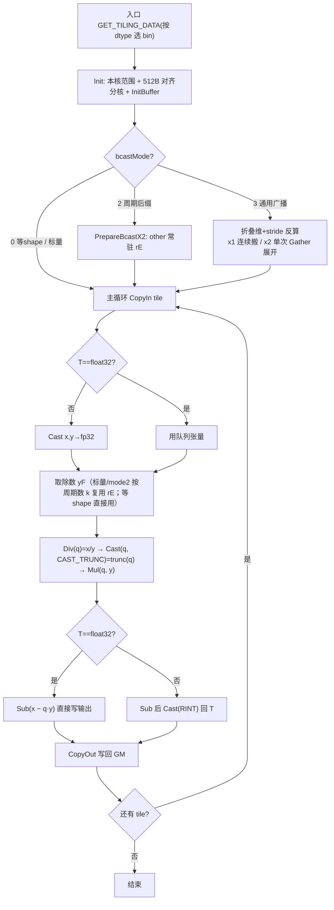

# FmodScalar & FmodTensor 算子设计文档

---

# 一、需求背景

## 1.1 需求来源

通过 CANN 开源社区任务，参考内置 `aclnnFmodScalar`/`aclnnFmodTensor` 的 TBE 实现，在 A2/A3 上用 Ascend C 实现功能一致的算子并贡献至 ops-math。交付件：算子工程代码、README、aclnn API 文档、自验证报告、设计文档、多组 aclnn 调用测试代码。

## 1.2 背景介绍

`Fmod` 逐元素取模，语义是**基于向零截断（trunc）的取余**，而非向下取整（floor）。`aclnnFmodScalar`/`aclnnFmodTensor` 在 A2/A3 最终落到内置 TBE **`Mod`** 算子。计算公式：

```text
out = self - trunc(self / other) * other
```

`self/other ≥ 0` 时 `trunc=floor`，`< 0` 时 `trunc=ceil`，结果与 `self` 同号或 0。

### 1.2.1 TBE 源码与 API 路径

| 类别 | 路径 |
|---|---|
| TBE kernel | `opp/built-in/op_impl/ai_core/tbe/impl/ops_legacy/dynamic/mod.py` |
| 算子原型 | `opp/built-in/op_proto/inc/ops_proto_math.h` |
| 算子信息库 | `opp/built-in/op_impl/ai_core/tbe/config/ascend910b/aic-ascend910b-ops-info-legacy.json` |
| 开源仓/样例 | `gitcode.com/cann/ops-math` ; `.../math/mod` |

### 1.2.2 TBE 现状分析

**支持能力**：`mod_compute` 由 `@register_operator_compute("Mod", op_mode="dynamic", support_fusion=True, support_bfp16=True)` 注册（动态 shape/融合/bf16）；入口 `mod()` 用 `classify([x,y], ELEWISE_WITH_BROADCAST)` 分类。源码 dtype `(fp16,fp32,int8,uint8,int32,bf16)`、格式 ND。**本任务取 bf16/fp16/fp32/int16**，以任务书为准、对齐 TBE 计算语义与升精度策略。

**入口流程**：`check_op_params` 校验 → `compare_tensor_dict_key` 要求两输入 dtype 一致 → `check_dtype` 校验支持列表 → `classify` 分类 → 每组 `variable_shape`/`refine_shapes_for_broadcast` → 建 placeholder → `mod_compute` → `auto_schedule` → `tbe.build`。

**核心计算（与 mod.py `mod_compute` 逐行对应，见下方流程图）**：①`dtype≠fp32 且支持 vdiv(fp32)` → `cast_to` x,y→fp32 并置 `has_improve_precision`；②`shape_x≠shape_y` → `broadcast_shapes`+`broadcast(x)/broadcast(y)`；③`q=vdiv(x,y)`；④物化 `zero=broadcast(0)`，`min=vmin(q,zero)`、`max=vmax(q,zero)`，再按 `api_check_support('tbe.dsl.ceil','f322f32')` 真/假取 `floor(max,'float32')`·`ceil(min,'float32')` 或 `floor(max)`·`ceil(min)`；⑤`dtype≠'int32' 且支持 vmul(float32)` 则把 floor/ceil 各 `cast_to(float32)`；⑥`trunc(q)=vadd(floor,ceil)`，再 `cast_to(trunc(q), input_y.dtype)`；⑦`res=vsub(x, vmul(trunc(q), y))`；⑧`has_improve_precision` 则 `cast_to(res, 原 dtype)`。关键：TBE 用**同一 1-ulp `vdiv`、无修正**，故 `fmod(5.5,1.1)=0.0` 等 1-ulp 边界即为 TBE 正确行为，须 **bit 对齐复刻**。

### 1.2.3 TBE 实现流程图

```mermaid
graph TD
A["mod() 入口"] --> A1["compare_tensor_dict_key(x,y,'dtype')：两输入 dtype 必须一致"]
A1 --> A2["check_shape(x) / check_shape(y)<br/>check_dtype ∈ {float16,float32,int8,uint8,int32}"]
A2 --> A3["classify([x,y], ELEWISE_WITH_BROADCAST)<br/>每组：variable_shape + refine_shapes_for_broadcast → placeholder → mod_compute"]
A3 --> B1{"分支①升精度：<br/>dtype≠float32 且 api_check_support(vdiv,float32)?"}
B1 -->|是| B1Y["cast_to x→fp32; cast_to y→fp32<br/>has_improve_precision=True"]
B1 -->|否| B1N["保持原 dtype"]
B1Y --> B2{"分支②广播：list(shape_x)≠list(shape_y)?"}
B1N --> B2
B2 -->|是| B2Y["broadcast_shapes→公共 shape<br/>broadcast(x)、broadcast(y)"]
B2 -->|否| B2N["shape_broadcast = shape_x"]
B2Y --> C1["data_div = vdiv(x, y) ＝ q"]
B2N --> C1
C1 --> C2["data_zero = broadcast(const 0, float32)"]
C2 --> C3["data_div_min = vmin(q, zero) ＝ min(q,0)"]
C3 --> C4["data_div_max = vmax(q, zero) ＝ max(q,0)"]
C4 --> B3{"分支③floor/ceil 精度：<br/>api_check_support('tbe.dsl.ceil','f322f32')?"}
B3 -->|是| B3Y["data_div_max_floor = floor(data_div_max, 'float32')<br/>data_div_min_ceil = ceil(data_div_min, 'float32')"]
B3 -->|否| B3N["data_div_max_floor = floor(data_div_max)<br/>data_div_min_ceil = ceil(data_div_min)"]
B3Y --> B4{"分支④回 cast：dtype≠'int32' 且<br/>api_check_support('tbe.dsl.vmul','float32')?"}
B3N --> B4
B4 -->|是| B4Y["cast_to floor→float32<br/>cast_to ceil→float32"]
B4 -->|否| B4N["floor/ceil 不回 cast"]
B4Y --> C7["data_div_res = vadd(floor, ceil) ＝ trunc(q)"]
B4N --> C7
C7 --> C7b["data_div_res = cast_to(data_div_res, input_y.dtype.lower())"]
C7b --> C8["data_mul = vmul(trunc(q), y)"]
C8 --> C9["res = vsub(x, data_mul) ＝ x − trunc(q)·y"]
C9 --> B5{"分支⑤回精度：has_improve_precision?"}
B5 -->|是| B5Y["cast_to res→原 dtype"]
B5 -->|否| B5N["保持 float32 结果"]
B5Y --> ZR["mod_compute return res"]
B5N --> ZR
ZR --> SCH["入口续 with tvm.target.cce()：sch = auto_schedule(res)"]
SCH --> BLD["config{name, tensor_list:[data_x,data_y,res]} → tbe.build(sch, config)"]
```


> 流程图逐行对应 `mod_compute`（`mod.py`），**五个判断分支无省略**：①升精度（非 fp32 且支持 fp32 vdiv 才升）、②广播（shape 不等才广播）、③`api_check_support('tbe.dsl.ceil','f322f32')` 决定 floor/ceil 是否带 `'float32'` 参数、④`dtype≠'int32' 且支持 vmul(float32)` 才把 floor/ceil 回 cast 到 float32、⑤`has_improve_precision` 才把结果 cast 回原 dtype。中间量 `data_zero` 及 vmin/vmax/floor/ceil/vadd/`cast_to`/vmul/vsub 全部独立列出。

---

# 二、需求分析

内部适配 **ACLNN** 两段式（`GetWorkspaceSize` + 执行），不涉外部依赖。

## 2.1 算子原型

**aclnnFmodScalar**

| 参数 | 类别 | 数据类型 | 格式 | shape | 非连续 |
|---|---|---|---|---|:--:|
| self/x | 输入 Tensor | bf16/fp16/fp32/int16 | ND | 0–8 维 | √ |
| other/value | 属性(float 标量除数，按 self dtype 舍入) | float | - | 标量 | - |
| out/y | 输出 Tensor | bf16/fp16/fp32/int16 | ND | 同 self | - |

**aclnnFmodTensor**

| 参数 | 类别 | 数据类型 | 格式 | shape | 非连续 |
|---|---|---|---|---|:--:|
| self/x1 | 输入 Tensor | bf16/fp16/fp32/int16 | ND | 0–8 维 | √ |
| other/x2 | 输入 Tensor(向 self 广播) | bf16/fp16/fp32/int16 | ND | 0–8 维 | √ |
| out/y | 输出 Tensor | bf16/fp16/fp32/int16 | ND | 同 self | √ |

> FmodScalar 标量除数用 **float 属性**建模，kernel 内向量 `Cast` 按 self dtype 舍入（对齐 promoteType，如 fp16 除数 1.1→1.0996）。

## 2.2 算子约束限制

- **输出 shape**：`out.shape==self.shape`；FmodTensor 的 other 须能广播到 self 或同 shape。
- **dtype** bf16/fp16/fp32/int16，**格式** ND，**shape** 0–8 维（含 0 维标量/单元素/空 Tensor）；kernel 按输出 dtype 写回。
- **非连续**：OpDef `.AutoContiguous()` 入 kernel 前连续化。
- **除 0**：同 IEEE/TBE（inf/nan）；**负数**：按 trunc，与 TBE 一致。
- **广播范围**：支持**任意维双向广播**（numpy 规则，rank 0–8，x1/x2 任一侧、任一轴均可广播）；host 分 mode0/2/3 三路（详见 3.2.1）。

---

# 三、需求详细设计

## 3.1 使能方式

**仅 ACLNN 两段式直调**（`GetWorkspaceSize`+执行），不涉 ATC 图/框架注册。host 解析 shape/dtype/广播 → 检测广播模式 → 算分核与 UB 分块 → 下发 TilingData；kernel 三段式复刻 TBE `mod_compute`。

## 3.2 host 侧设计

### 3.2.1 输入参数解析

host 解析 shape/dtype/元素数；FmodScalar 读 float 属性 `value`；FmodTensor 据 shape 判广播模式写 `bcastMode`：`shape(x1)==shape(x2)`→**0 等 shape**；x2 为 x1 右对齐纯周期后缀→**2 周期**（写 `period`）；其余任意维/双向广播→**3 通用**（折叠维 + 各维 broadcast stride 写入 TilingData）。非连续输入由 OpDef `.AutoContiguous()` 连续化，host 只见连续 shape。

### 3.2.2 分核策略

按输出总元素做 **former/tail 双核切分**优先满核。等 shape 走 **512B 对齐分核**：每核数据量取 `512B/dtype`（fp32=128/fp16=256）整数倍、余量并入末核，各核 GM 基址 512B 对齐（A2 满带宽，32B 仅 ~70%）；周期广播 `unit=period`；`totalLength=0` 快退。

### 3.2.3 数据分块与 UB 内存优化

`tileCap = (ubSize − padBytes) / (sizeof(T)·OP_INOUT + 4·opCalc)`，tile 向下取整到 512B。`OP_INOUT`=队列区数（Scalar 4/Tensor 6）、`opCalc`=workBuf fp32 中间区数(2~5)。tile 512B 对齐、区间 64-float padding 错开 bank、fp32 等 shape 直接在队列张量算省拷贝。UB ≤192KB、张量 ≤8（Scalar 5/Tensor 7）。

### 3.2.4 tilingKey 规划

模板 `SetTilingKey(GET_TPL_TILING_KEY(ELEMENTWISE_TPL_SCH_MODE_0))`，按 dtype 分 bin（`binary.json` 每 dtype 一 bin，910b/910_93 各一套）；FmodTensor 用 TilingData 的 **`bcastMode`+`period`+折叠维 stride** 在 kernel 内分支，不另占 tilingKey。

## 3.3 kernel 侧设计

**计算路径四类**（非连续经 `.AutoContiguous()` 连续化后复用）：① **Scalar**——标量除数 `Duplicate` 成向量、跨 tile 只备一次；② **等 shape(mode0)**——x1/x2 队列张量逐元素算；③ **周期广播(mode2)**——other 常驻 `rE`，按 `k=tile/period` 复用；④ **通用广播(mode3)**——折叠相邻同模式维，输出下标经各维 broadcast stride（广播维=0）反算 x1/x2 偏移，x1 连续搬入、x2 单次 Gather 展开，省 TBE 整张物化。

三段式 `CopyIn`(`DataCopyPad` 尾块自动 32B 补齐)/`Compute`/`CopyOut`，TQue 自动管同步。**Compute 与 TBE 语义等价、bit 对齐**——trunc 用单算子 `Cast(CAST_TRUNC)`（float→float 向零取整，A2 支持）替 TBE 的 `floor(max(q,0))+ceil(min(q,0))`，矢量算子 **8→4**：①非 fp32 先 `Cast`→fp32；②`Div`=q→`Cast(CAST_TRUNC)`=trunc(q)→`Mul(·,y)`→`Sub(x−·)`；③非 fp32 再 `Cast(RINT)` 回 T。单 `workBuf` offset 切分，区间 64-float padding 错开 bank。

### Ascend C 实现流程图


### Ascend C 与 TBE 差异点

| 项 | TBE | AscendC（本实现） | 原因 |
|---|---|---|---|
| 调度/广播 | classify + auto_schedule 自动；广播先 `broadcast` 物化整张大张量 | 显式 tiling/分核；mode0 等 shape / mode2 周期后缀 / **mode3 通用广播**(折叠维+stride 反算) | 范式差异；广播侧省物化、HBM 友好（实测反超 TBE） |
| 截断商 | DSL vmin/vmax/floor/ceil/vadd（≈5 算子） | 单个 `Cast(CAST_TRUNC)` | **逐元素等价、bit 对齐**，但矢量算子更省（trunc 5→1，整体 8→4） |
| 升精度 | 运行期 api_check_support | 编译期 `if constexpr` + Cast | dtype 编译期已知 |
| 标量除数 | 内部 promoteType | float 属性 + 向量 Cast 按 dtype 舍入、跨 tile 缓存 | 自定义算子标量建模 |
| 非连续 | 上层图协同 | `.AutoContiguous()` 框架连续化 | 同仓 elementwise 一致 |
| 切分/性能 | DSL 自动 | 双核 + **512B 对齐分核** + 放大 tile + bank 错开 + fp32 直算 | 满带宽 + 减循环/拷贝/bank 冲突 |

## 3.4 支持硬件

Atlas A2 训练系列（ascend910b）√　Atlas A3 系列（ascend910_93）√

## 3.5 README 与调用示例

算子 README + aclnn API 文档 + 多 dtype 两段式调用示例（`examples/test_aclnn_fmod_*.cpp`）随 fork 代码仓交付。

---

# 四、特性交叉分析

自验证叉乘覆盖：**dtype(bf16/fp16/fp32/int16) × 数据量(1K~16M) × 维度(1D–8D 含 0 维/单元素/空) × 对齐/非对齐(d7/d33/d4097) × 广播(等 shape/周期/标量/通用·双向) × 1.1·other==0·非连续**。

---

# 五、可维可测分析

## 5.1 精度标准与实测

精度不低于 TBE、满足 AscendOpTest 默认阈值。**实测全 PASS**（4 dtype × 等 shape/周期/通用广播 × 1D–8D × 对齐/非对齐，含 `fmod(5.5,1.1)=0.0` 1-ulp 边界），bit 对齐 TBE Mod。

## 5.2 性能标准与实测

所有核参与场景 ≥ TBE 95%。**实测（msprof 910b，ratio=TBE/ours）**：大 shape（≥4M）各 dtype **全反超**（1.1–1.4×）；**通用广播 mode3 全反超**（末/中/首轴 1.1–1.7×，省 TBE 物化）；**FmodScalar 快 18–381×**（TBE 落 AICPU、我们 AICORE）；少量 1M~2M 等 shape 访存 bound 略低 1.0（带宽近峰值、算法同 TBE）。int16 无内置 baseline，随 fp16/bf16 达标。

## 5.3 兼容性分析

新增 experimental 算子，OpType 加 `Custom` 后缀避免与系统同名冲突，不涉存量。
