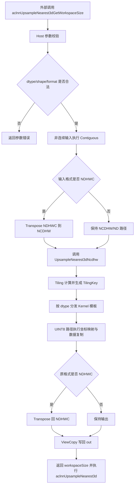
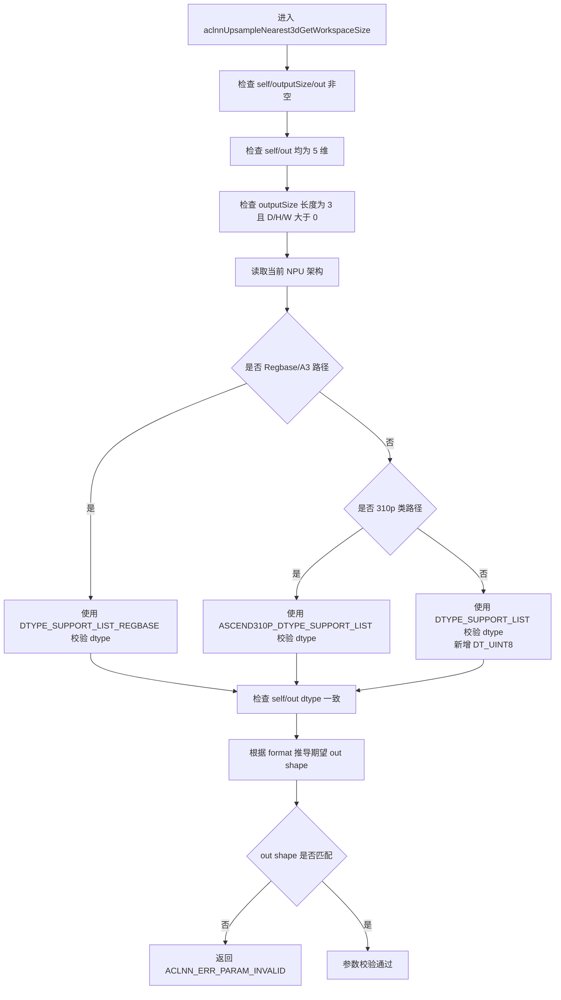
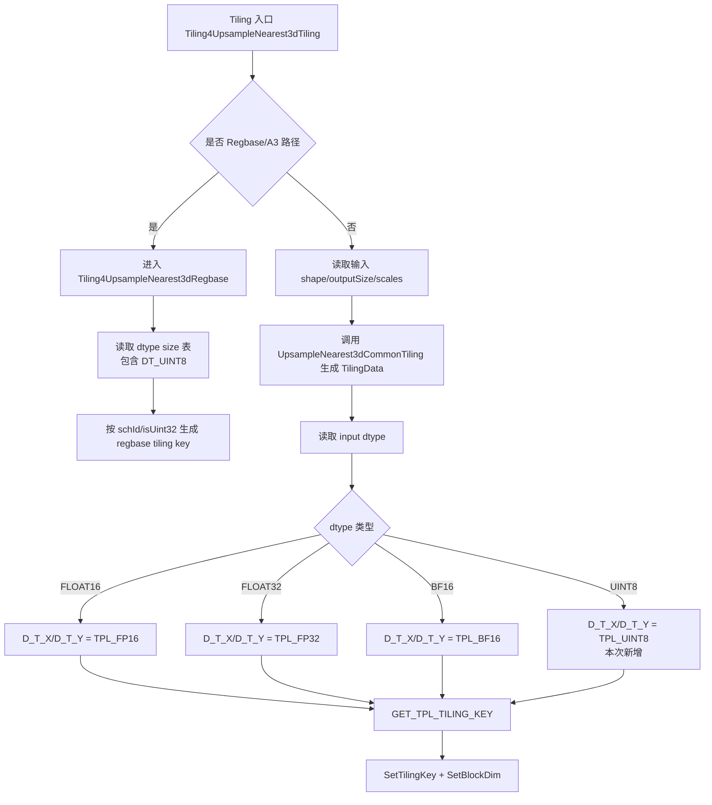
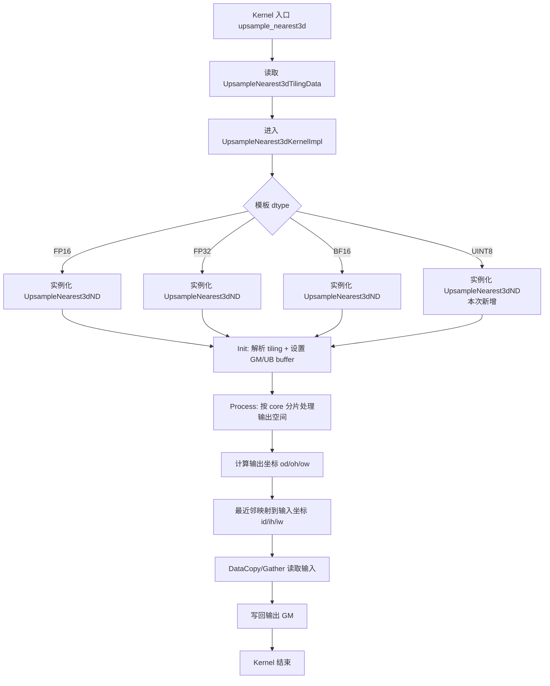
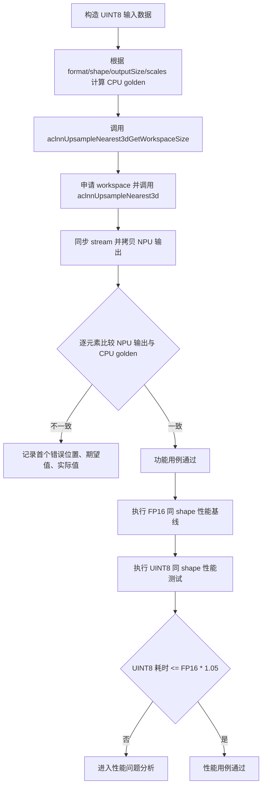

# aclnnUpsampleNearest3d 支持 UINT8 数据类型设计文档

## 需求背景（required）

### 需求来源

社区任务《UpsampleNearest3d 算子开发任务书》。本任务要求在 CANN `ops-cv` 开源仓现有 `aclnnUpsampleNearest3d` 算子基础上进行再开发，使其新增支持 `UINT8` 数据类型，并完成算子设计、算子开发、算子测试、README/API 文档和自验证报告。

### 背景介绍

#### aclnnUpsampleNearest3d 算子功能介绍

`aclnnUpsampleNearest3d` 用于对 5 维 Tensor 执行三维最近邻上采样。算子根据输出空间坐标 `(od, oh, ow)` 反向映射到输入空间坐标 `(id, ih, iw)`，读取输入 Tensor 对应位置的数据并写入输出 Tensor。

算子支持数据格式：

- `NCDHW`
- `NDHWC`
- `ND`，默认按照 `NCDHW` 处理

输入 `self` 与输出 `out` 的数据类型和数据格式需要保持一致。

#### aclnnUpsampleNearest3d 现状分析

通过分析 `/root/task/ops-cv/image/upsample_nearest3d` 目录，当前仓库中已经存在部分 `UINT8` 相关声明，但整体链路尚未完整打通。本任务需要补齐 `UINT8` 从 API 校验、算子注册、tiling key、kernel 模板分发、测试到文档的完整闭环。

| 模块 | 文件 | 当前状态 | 本任务关注点 |
| --- | --- | --- | --- |
| Graph 原型注册 | `op_graph/upsample_nearest3d_proto.h` | 已声明 `DT_UINT8` | 保持与最终能力一致 |
| 算子定义 | `op_host/upsample_nearest3d_def.cpp` | `ascend950` regbase 配置已包含 `DT_UINT8`，默认配置与 310p 配置未统一支持 | 按 Atlas A2/A3 范围补齐 dtype/format 注册 |
| aclnn API 校验 | `op_host/op_api/aclnn_upsample_nearest_3d.cpp` | regbase dtype 白名单已包含 `DT_UINT8`，非 regbase 白名单未包含 | 补齐 Atlas A2 路径 `DT_UINT8` 校验 |
| 普通 tiling key | `op_host/upsample_nearest3d_tiling.cpp` | 仅处理 `FLOAT/FLOAT16/BF16`，`UINT8/DOUBLE` 未见显式分支 | 新增 `UINT8` tiling key 分支，并将 `DOUBLE` 作为原 dtype 回归核查点 |
| 普通 kernel 模板声明 | `op_kernel/upsample_nearest3d_struct.h` | 仅声明 `FP16/FP32/BF16` 模板枚举 | 新增 `UINT8` 模板枚举和模板选择 |
| 普通 kernel 类型分发 | `op_kernel/upsample_nearest3d.h` | 仅分发 `half/float/bfloat16_t` | 新增 `uint8_t` 分发 |
| 310p kernel 路径 | `op_kernel/upsample_nearest3d_310p.h` | 仅分发 `half/float` | 不作为本任务主要扩展目标；若注册扩展到 310p 需同步补齐 |
| A3/regbase tiling | `op_host/upsample_nearest3d_tiling_arch35.cpp` | dtype size 表已包含 `DT_UINT8` | 验证 A3 regbase 路径可达和性能 |
| A3/regbase kernel | `op_kernel/arch35/*` | 已存在 `uint8_t` data copy 相关代码 | 验证功能、边界和尾块 |
| 测试 | `tests/st/aclnnUpsampleNearest3d`、`tests/ut` | 需补充 `UINT8` 用例 | 覆盖常规、边界、泛化、非连续和性能场景 |
| 文档 | `README.md`、`docs/aclnnUpsampleNearest3d.md` | 需更新支持类型 | 明确 `UINT8` 支持范围和约束 |

#### aclnnUpsampleNearest3d 当前能力表

| 参数 | 参数含义 | 数据类型 | 当前支持数据类型 | 目标支持数据类型 | 约束 | 形状 |
| --- | --- | --- | --- | --- | --- | --- |
| self | 输入 tensor | tensor | FLOAT32、FLOAT16、BFLOAT16、DOUBLE；部分路径已有 UINT8 声明 | FLOAT32、FLOAT16、BFLOAT16、DOUBLE、UINT8 | 不支持空 Tensor；数据格式为 ND 时默认按 NCDHW 处理；各维度不超过 `2^31 - 1` | 5 维 |
| outputSize | 输出空间尺寸 | aclIntArray | INT64 | INT64 | 长度为 3，各元素大于 0 | `[outD, outH, outW]` |
| scalesD | D 方向缩放因子 | double | double | double | 与 `outputSize` 共同决定输出尺寸和映射比例 | 标量 |
| scalesH | H 方向缩放因子 | double | double | double | 与 `outputSize` 共同决定输出尺寸和映射比例 | 标量 |
| scalesW | W 方向缩放因子 | double | double | double | 与 `outputSize` 共同决定输出尺寸和映射比例 | 标量 |
| out | 输出 tensor | tensor | FLOAT32、FLOAT16、BFLOAT16、DOUBLE；部分路径已有 UINT8 声明 | FLOAT32、FLOAT16、BFLOAT16、DOUBLE、UINT8 | dtype/format 与 self 一致；N、C 轴与 self 一致 | 5 维 |

#### aclnnUpsampleNearest3d 功能分析

- 算子功能：对 5D Tensor 执行 3D 最近邻上采样。
- 输入：`self`、`outputSize`、`scalesD`、`scalesH`、`scalesW`。
- 输出：`out`。
- 支持格式：`NCDHW`、`NDHWC`、`ND`。
- 支持非连续 Tensor：aclnn 路径通过 `Contiguous` 规整输入，通过 `ViewCopy` 写回输出。
- 本次新增能力：`self/out` 支持 `UINT8`。
- 性能要求：`UINT8` 性能相较 `FP16` 劣化不超过 5%。
- 精度要求：满足 AscendOpTest 默认阈值；由于最近邻采样为索引复制，`UINT8` 期望逐元素完全一致。

## 需求分析（required）

### 需求描述

在 `ops-cv/image/upsample_nearest3d` 现有实现基础上，补齐 `aclnnUpsampleNearest3d` 对 `UINT8` 数据类型的完整支持，使 `UINT8` 能够通过 Host 参数校验、算子注册、tiling key 生成、kernel 类型分发、NPU 执行、测试验证和文档说明。

本任务适配硬件为 Atlas A2 训练系列产品和 Atlas A3 系列产品，开发语言为 Ascend C。

### 需求拆解

1. 支持 `self/out` 为 `UINT8`，并保持输入输出 dtype 一致。
2. 支持 `NCDHW`、`NDHWC`、`ND` 三类格式；其中 `ND` 默认按照 `NCDHW` 处理。
3. 支持非连续 Tensor，沿用 aclnn 现有 `Contiguous + ViewCopy` 数据路径。
4. 补齐 Atlas A2 普通路径的 dtype 白名单、算子注册、tiling key 和 kernel 分发。
5. 校验 Atlas A3 regbase 路径中已有 `UINT8` 声明、tiling、kernel、binary 配置是否可达。
6. 保持原有 FLOAT16、FLOAT32、BFLOAT16、DOUBLE 路径功能不变。
7. 补充 `UINT8` 常规场景、边界场景、泛化场景、非连续场景和性能对比测试。
8. 更新 README 与 API 文档，明确 `UINT8` 支持情况。

## 详细设计（required）

### 算子分析

#### 数学公式

设输入空间尺寸为：

```text
inputD x inputH x inputW
```

输出空间尺寸为：

```text
outputD x outputH x outputW
```

对输出空间中任意坐标 `(od, oh, ow)`，最近邻映射输入坐标为：

```text
id = floor(od * inputD / outputD)
ih = floor(oh * inputH / outputH)
iw = floor(ow * inputW / outputW)
```

当输入输出格式为 `NCDHW` 时：

```text
out[n, c, od, oh, ow] = self[n, c, id, ih, iw]
```

当输入输出格式为 `NDHWC` 时：

```text
out[n, od, oh, ow, c] = self[n, id, ih, iw, c]
```

对于 `UINT8`，计算语义仍然是索引映射和数据复制：

```text
out[outputIndex] = self[inputIndex]
```

不涉及类型转换、插值运算、浮点舍入或饱和截断。

#### 支持数据类型

| 数据路径 | self/out 支持类型 | 本次变更 |
| --- | --- | --- |
| Atlas A2 普通路径 | FLOAT16、FLOAT32、BFLOAT16、DOUBLE、UINT8 | 补齐 `UINT8` 校验、注册、tiling key 和 kernel 分发 |
| Atlas A3 regbase 路径 | FLOAT16、FLOAT32、BFLOAT16、DOUBLE、UINT8 | 验证已有 `UINT8` 配置和执行路径，补充测试与文档 |
| 310p/kirinx90/kirin9030 路径 | 当前主要为 FLOAT16、FLOAT32 | 不作为本任务主要验收硬件；若后续扩展注册，需同步补齐 kernel 分发 |

#### 支持形状与格式

| 格式 | 输入 shape | 输出 shape | 说明 |
| --- | --- | --- | --- |
| NCDHW | `(N, C, inputD, inputH, inputW)` | `(N, C, outputD, outputH, outputW)` | 默认主路径 |
| NDHWC | `(N, inputD, inputH, inputW, C)` | `(N, outputD, outputH, outputW, C)` | aclnn 路径内部转置为 NCDHW 执行后再转回 |
| ND | 5 维 | 5 维 | 默认按照 NCDHW 处理 |

约束：

- `self` 和 `out` 均为 5 维。
- `outputSize` 长度为 3，元素均大于 0。
- `self/out` 的 dtype 和 format 保持一致。
- 输入输出 N、C 轴一致。
- 输入输出 Tensor 元素个数不超过 `int32_t` 最大值。
- `self` 的 C、D、H、W 维 size 大于 0。

### 算子实现

#### 实现方案

##### 3.2.0 整体执行流程图



##### 3.2.1 Host 侧设计

**Host 参数校验与 dtype 分发流程图：**



**参数校验策略：**

Host 侧沿用现有 `CheckParams` 结构，重点检查：

- `self`、`outputSize`、`out` 非空。
- `self/out` 维度均为 5。
- `outputSize` 长度为 3。
- 输入 D/H/W 与输出 D/H/W 均大于 0。
- `self/out` dtype 一致。
- `out` shape 等于根据 `self` 和 `outputSize` 推导出的期望 shape。

**dtype 支持策略：**

现有 aclnn API 中 dtype 白名单存在平台差异，本次按以下策略处理：

| 白名单 | 当前状态 | 设计变更 |
| --- | --- | --- |
| `DTYPE_SUPPORT_LIST` | 不含 `DT_UINT8` | 新增 `DT_UINT8`，用于 Atlas A2 普通路径 |
| `DTYPE_SUPPORT_LIST_REGBASE` | 已含 `DT_UINT8` | 保持并验证 A3 regbase 路径 |
| `ASCEND310P_DTYPE_SUPPORT_LIST` | 仅 `DT_FLOAT/DT_FLOAT16` | 不纳入本任务主要扩展范围 |

**格式处理策略：**

- `NCDHW` 和 `ND` 直接进入 `UpsampleNearest3dNcdhw`。
- `NDHWC` 沿用现有路径，先 `Transpose` 为 `NCDHW`，执行算子后再 `Transpose` 回 `NDHWC`。
- `UINT8` 路径不得破坏现有转置和拷贝流程。

**非连续 Tensor 策略：**

本任务不在 kernel 中新增 stride 寻址分支。aclnn 路径沿用现有机制：

- 输入通过 `l0op::Contiguous(self, executor)` 转为连续 Tensor。
- 计算结果通过 `l0op::ViewCopy(result, out, executor)` 写回输出。

因此 `UINT8` 支持需要保证 `Contiguous -> UpsampleNearest3dNcdhw -> ViewCopy` 链路 dtype 可达。

##### 3.2.2 算子注册设计

需要检查并补齐以下注册位置：

| 文件 | 设计修改点 |
| --- | --- |
| `op_graph/upsample_nearest3d_proto.h` | 已声明 `DT_UINT8`，保持不变并与最终能力一致 |
| `op_host/upsample_nearest3d_def.cpp` | 默认 `Input/Output` dtype 补齐 `DT_UINT8`；Atlas A2 配置需能触达 `UINT8`；Atlas A3 regbase 配置已通过 `xDtype` 覆盖 `ND/NCDHW` 的 `UINT8` |
| `op_host/config/ascend910b/*`、`op_host/config/ascend910_93/*` | 如存在 binary/simplified key dtype 配置限制，需要补充 `UINT8` |
| `op_host/config/ascend950/*` | 已存在 `uint8` 配置，需在测试中验证 |

注册侧目标是保证 `UINT8` 输入不会在图原型、op def 或 binary 配置阶段被拒绝。

##### 3.2.3 Tiling 侧设计

普通路径当前 `GetTilingKey()` 仅根据 `DT_FLOAT`、`DT_FLOAT16`、`DT_BF16` 生成模板 key，未见 `DT_UINT8` 显式分支。由于任务主目标是新增 `UINT8`，本次设计重点补齐 `UINT8` 模板枚举与分发逻辑；同时将 `DOUBLE` 作为原有 dtype 回归核查点，避免 dtype 分发修改影响既有能力。

**Tiling key 生成流程图：**



设计修改：

1. 在 `op_kernel/upsample_nearest3d_struct.h` 中新增：

```cpp
#define UPSAMPLE_NEAREST3D_TPL_UINT8 40
```

2. 在 `ASCENDC_TPL_DTYPE_DECL` 中加入 `UPSAMPLE_NEAREST3D_TPL_UINT8`。
3. 在 `ASCENDC_TPL_SEL` 中加入 `D_T_X/D_T_Y` 均为 `UINT8` 的组合。
4. 在 `op_host/upsample_nearest3d_tiling.cpp::GetTilingKey()` 中新增 `DT_UINT8` 到 `UPSAMPLE_NEAREST3D_TPL_UINT8` 的映射。
5. 原有 tiling 数据结构和 `UpsampleNearest3dCommonTiling` 可复用。`UINT8` 不改变坐标映射和分核策略，仅改变元素字节数及 kernel 模板类型。

Atlas A3 regbase 路径当前 `upsample_nearest3d_tiling_arch35.cpp` 的 dtype size 表已包含 `DT_UINT8`，其 tiling key 主要由调度模式和偏移宽度组成，不需要新增普通路径的 dtype 模板 key，但需要通过 ST/性能测试验证 `uint8` 配置可达。

##### 3.2.4 Kernel 侧设计

普通 kernel 入口保持现有结构：

```cpp
template <int D_T_X, int D_T_Y>
__global__ __aicore__ void upsample_nearest3d(...)
```

本次不改变入口参数和 tiling data 结构，仅补齐模板分发。

**Kernel dtype 分发与执行流程图：**



设计修改：

1. 在 `op_kernel/upsample_nearest3d.h::UpsampleNearest3dKernelImpl` 中新增 `UINT8` 分支：

```cpp
else if constexpr (
    D_T_X == UPSAMPLE_NEAREST3D_TPL_UINT8 &&
    D_T_Y == UPSAMPLE_NEAREST3D_TPL_UINT8) {
    UpsampleNearest3d::UpsampleNearest3dND<uint8_t> op;
    op.Init(x, y, isNearestExact, userWS, tilingData);
    op.Process();
}
```

2. `UpsampleNearest3dND<T>` 中的 `GlobalTensor<T>`、`LocalTensor<T>`、`DataCopyExtParams` 和 `Gather` 逻辑复用模板类型 `T`，`uint8_t` 路径执行元素级复制，不进行数值转换。
3. `UINT8` 单元素大小为 1 Byte，需重点验证 GM/UB 搬运 32 Byte 对齐、输出尾块不足 32 Byte、`outputW` 非 32 对齐、小 shape 调度开销和 D/H/W 某一维为 1 的边界。
4. 310p 路径当前仅支持 `FP16/FP32` 分发。本任务硬件范围为 Atlas A2/A3，不将 310p 作为主要扩展目标；若后续将 `DT_UINT8` 注册到 310p，需要同步补齐 `UpsampleNearest3d310pKernelImpl<uint8_t>`。

##### 3.2.5 NDHWC 与 ND 格式设计

`NDHWC` 当前通过 Host 侧转置适配：

```text
NDHWC -> NCDHW -> UpsampleNearest3dNcdhw -> NDHWC
```

本任务保持该路径不变，新增 `UINT8` 后需要验证：

- `Transpose` 是否支持 `UINT8`。
- `UpsampleNearest3dNcdhw` 是否支持 `UINT8`。
- 转回 `NDHWC` 后 `ViewCopy` 写回输出是否正确。

`ND` 格式默认按照 `NCDHW` 解释，不新增独立 kernel 分支。

##### 3.2.6 算子泛化功能设计

为满足验收阶段泛化数据要求，本设计覆盖以下场景：

- 多 batch、多 channel。
- D/H/W 任意一维为 1。
- 输入输出空间尺寸相同，即纯复制场景。
- 非整数倍上采样，例如 `3x5x7 -> 8x9x13`。
- `NCDHW`、`NDHWC`、`ND` 三类格式。
- 输入或输出为非连续 Tensor。
- 输出元素数非 32 Byte 对齐。
- 中小 shape 和较大 shape。
- `scalesD/scalesH/scalesW` 大于 0 的路径。

### 数据检测

| 检测项 | 检测策略 |
| --- | --- |
| 空指针 | `self`、`outputSize`、`out` 均不能为空 |
| dtype | `self/out` dtype 一致，且属于支持列表 |
| 维度 | `self/out` 均为 5 维 |
| 输出尺寸 | `outputSize` 长度为 3，D/H/W 均大于 0 |
| 输入尺寸 | C/D/H/W 均大于 0 |
| shape 一致性 | `out` shape 与 `self + outputSize` 推导结果一致 |
| 元素个数 | 不超过 `int32_t` 最大值 |
| format | `NCDHW/NDHWC/ND` 合法，且输入输出 format 一致 |

### 支持硬件

| 支持的芯片版本 | 涉及勾选 |
| --- | --- |
| Atlas A2 训练系列产品 | √ |
| Atlas A3 系列产品 | √ |

### 算子约束限制

- 输入 `self` 不支持空 Tensor。
- 输出 `out` 不支持空 Tensor。
- `self/out` 均为 5 维 Tensor。
- `outputSize` 长度必须为 3。
- `outputSize` 各元素必须大于 0。
- 输入输出 dtype 必须一致。
- 输入输出 format 必须一致。
- 输入输出 N、C 轴必须一致。
- 输入输出元素个数不超过 `int32_t` 最大值。
- `ND` 格式默认按照 `NCDHW` 处理。
- `UINT8` 路径不进行类型转换，输出应逐元素等于 CPU golden。

## 可维可测分析

### 精度标准/性能标准

| 验收标准 | 描述 | 标准来源 |
| --- | --- | --- |
| 精度标准 | `UINT8` 最近邻采样结果与 CPU golden 逐元素一致，满足 AscendOpTest 默认阈值 | 任务书要求 |
| 性能标准 | `UINT8` 性能相较 `FP16` 劣化不超过 5% | 任务书要求 |

### 精度分析

`UpsampleNearest3d` 最近邻上采样仅执行坐标映射与数据复制。对于 `UINT8`：

- 不涉及浮点运算。
- 不涉及舍入误差。
- 不涉及类型转换。
- 不涉及饱和截断。

因此 NPU 输出应与 CPU 参考实现逐元素一致。

CPU golden 伪代码如下：

```python
for n in range(N):
    for c in range(C):
        for od in range(outputD):
            id = int(od * inputD / outputD)
            for oh in range(outputH):
                ih = int(oh * inputH / outputH)
                for ow in range(outputW):
                    iw = int(ow * inputW / outputW)
                    out[n, c, od, oh, ow] = self[n, c, id, ih, iw]
```

`NDHWC` 场景按通道后置方式生成 golden。

### 性能分析

`UINT8` 单元素字节数为 1 Byte，理论访存量低于 `FP16`。但实际性能可能受到以下因素影响：

- 单次搬运粒度较小。
- 尾块不足 32 Byte 的概率更高。
- 小 shape 下 kernel launch 和地址计算开销占比更高。
- 最近邻坐标映射的计算开销与 dtype 无关。

性能测试采用同 shape、同 format、同执行环境下的 `UINT8` 与 `FP16` 对比：

```text
UINT8 平均耗时 <= FP16 平均耗时 * 1.05
```

建议测试方式：

- 每个 case warmup 10 次。
- 正式运行不少于 100 次。
- 记录平均耗时和中位数耗时。
- 对比时保持输入输出 shape、format、outputSize/scales 完全一致。

### 测试用例规划

**测试验证流程图：**



| 测试场景分类 | 用例描述 | 输入 Shape 与属性 | Format | Dtype | 预期结果 |
| --- | --- | --- | --- | --- | --- |
| 基础功能 | 常规 2 倍上采样 | `(1, 3, 4, 4, 4) -> (1, 3, 8, 8, 8)` | NCDHW | UINT8 | 与 CPU golden 逐元素一致 |
| 基础功能 | 多 batch 多 channel | `(2, 3, 5, 6, 7) -> (2, 3, 10, 12, 14)` | NCDHW | UINT8 | 与 CPU golden 逐元素一致 |
| 格式覆盖 | 通道后置 | `(1, 4, 4, 4, 3) -> (1, 8, 8, 8, 3)` | NDHWC | UINT8 | 转置路径结果正确 |
| 格式覆盖 | ND 默认 NCDHW | `(1, 3, 4, 4, 4) -> (1, 3, 8, 8, 8)` | ND | UINT8 | 按 NCDHW 解释 |
| 边界场景 | 最小 shape | `(1, 1, 1, 1, 1) -> (1, 1, 1, 1, 1)` | NCDHW | UINT8 | 结果一致，无越界 |
| 边界场景 | 输入输出尺寸相同 | `(1, 3, 4, 4, 4) -> (1, 3, 4, 4, 4)` | NCDHW | UINT8 | 等价复制 |
| 边界场景 | D 维为 1 | `(1, 3, 1, 8, 8) -> (1, 3, 4, 8, 8)` | NCDHW | UINT8 | D 方向映射正确 |
| 边界场景 | H 维为 1 | `(1, 3, 8, 1, 8) -> (1, 3, 8, 4, 8)` | NCDHW | UINT8 | H 方向映射正确 |
| 边界场景 | W 维为 1 | `(1, 3, 8, 8, 1) -> (1, 3, 8, 8, 4)` | NCDHW | UINT8 | W 方向映射正确 |
| 泛化场景 | 非整数倍上采样 | `(1, 3, 3, 5, 7) -> (1, 3, 8, 9, 13)` | NCDHW | UINT8 | floor 映射正确 |
| 对齐场景 | 输出元素非 32 Byte 对齐 | `(1, 1, 3, 5, 7) -> (1, 1, 4, 6, 9)` | NCDHW | UINT8 | 尾块正确 |
| 非连续输入 | 输入经过 transpose/slice | 逻辑 shape 为 5D | NCDHW/NDHWC | UINT8 | `Contiguous` 后结果正确 |
| 非连续输出 | out 为非连续视图 | 逻辑 shape 匹配输出 | NCDHW/NDHWC | UINT8 | `ViewCopy` 写回正确 |
| scales 路径 | 使用 `scalesD/H/W > 0` | outputSize 与 scales 推导一致 | NCDHW | UINT8 | 与 CPU golden 一致 |
| 回归测试 | 原有 dtype 回归 | 典型 shape，并重点核查普通路径 `DOUBLE` 是否已有可达分支 | NCDHW | FP16/FP32/BF16/DOUBLE | 原有功能不退化 |
| 性能测试 | A2 普通路径性能 | `(1, 16, 16, 32, 32) -> (1, 16, 32, 64, 64)` | NCDHW | UINT8 vs FP16 | 劣化不超过 5% |
| 性能测试 | A3 regbase 路径性能 | `(1, 16, 32, 32, 16) -> (1, 32, 64, 64, 16)` | NDHWC | UINT8 vs FP16 | 劣化不超过 5% |

### 兼容性分析

本任务为既有算子的 dtype 能力扩展，不改变 API 原型、参数含义、shape 推导规则和已有 dtype 语义。

兼容性策略：

- 原 FLOAT16、FLOAT32、BFLOAT16、DOUBLE 路径保持原有分支。
- 新增 `UINT8` 分支仅在 dtype 为 `UINT8` 时触发。
- `NDHWC`、非连续 Tensor 仍复用现有 aclnn 数据路径。
- 不降低现有平台配置能力。

### 风险与降级预案

| 风险 | 说明 | 解决方案 |
| --- | --- | --- |
| A2 普通路径 tiling key 缺失 | 当前普通模板枚举不含 `UINT8` | 新增 `UPSAMPLE_NEAREST3D_TPL_UINT8`、模板选择和 `GetTilingKey` 分支 |
| kernel 类型分发缺失 | 当前普通 kernel 未实例化 `uint8_t` | 在 `UpsampleNearest3dKernelImpl` 中新增 `uint8_t` 分支 |
| A3 regbase 路径声明存在但测试不足 | regbase 配置已有 `uint8`，但需确认可执行 | 增加 A3/ascend950 ST 与性能用例 |
| 32 Byte 尾块问题 | `UINT8` 更容易出现非对齐尾块 | 增加非 32 对齐 shape 测试，复用 DataCopy 尾块处理 |
| NDHWC 转置链路问题 | `UINT8` 需经过 Transpose 两次 | 增加 NDHWC `UINT8` 功能和性能测试 |
| 非连续 Tensor 写回问题 | 输出可能为非连续视图 | 增加非连续输入/输出测试，验证 `Contiguous + ViewCopy` |
| 影响原 dtype | 修改模板和注册可能影响原有路径 | 增加 FP16/FP32/BF16/DOUBLE 回归测试 |

## 附录：修订记录

| 日期 | 修订版本 | 修改描述 | 作者 |
| --- | --- | --- | --- |
| 2026-06-03 | v1.0.0 | 按社区任务设计模板重构文档，补充 `UINT8` 现状分析、A2/A3 路径差异、Host/Tiling/Kernel 修改方案和测试规划 | - |
