# UpsampleNearest3d uint8 算子设计方案

# 需求背景

## 需求来源

本设计文档对应 CANN 社区任务 `20260529-12`：在开源仓已有 `aclnnUpsampleNearest3d` 实现基础上补齐 `uint8` 数据类型支持。

任务书验收目标如下：

| 维度 | 任务要求 | 本设计方式 |
| --- | --- | --- |
| 数据类型 | `FLOAT32`、`FLOAT16`、`BFLOAT16`、`DOUBLE`、`UINT8` | ACLNN / op_graph 保持既有 dtype 兼容并新增 `UINT8`；本次增量聚焦 A2/A3 AICore `UINT8` 支持，`DOUBLE` 维持既有 ACLNN 接口兼容与回归校验口径 |
| 数据格式 | `NCDHW`、`NDHWC`、`ND` | `ND` 默认按 `NCDHW` 处理；`UINT8` 覆盖 `NCDHW/NDHWC/ND` |
| Shape | 5D，输入输出 N、C 轴一致 | ACLNN 参数校验、tiling 与 infershape 均按 5D 处理 |
| 非连续 Tensor | 输入/输出支持非连续 Tensor | ACLNN 入口先 `Contiguous`，输出通过 `ViewCopy` 写回 |
| 参数约束 | 不支持空 Tensor；元素数不超过 `int32_t`；`outputSize` 长度为 3 且元素大于 0 | ACLNN、tiling、infershape 分层校验 |
| 泛化 | 验收会使用泛化数据 | kernel 提供快路径、泛化 slice/row 路径和 fallback，测试覆盖常规、边界、非连续、NDHWC、下采样、scale、大 shape |
| 精度 | 满足 AscendOpTest 默认阈值 | `uint8` 与 CPU nearest golden 逐元素一致 |
| 性能 | `uint8` 相比 `fp16` 劣化 5% 以内 | 2x、3/2、下采样、NCDHW 泛化、非连续、NDHWC 同格式、wide-channel 等场景均完成性能验证 |

## 背景介绍

### UpsampleNearest3d算子实现优化

`UpsampleNearest3d` 对 5D 输入 Tensor 的 D/H/W 三个空间维度执行最近邻上采样，输出 Tensor 的 N、C 轴与输入保持一致，空间尺寸由 `outputSize` 或 scale 推导。最近邻映射公式为：

```text
srcD = min(floor(dstD * scaleD_real), inD - 1)
srcH = min(floor(dstH * scaleH_real), inH - 1)
srcW = min(floor(dstW * scaleW_real), inW - 1)
```

其中 `scale*_real` 在未显式指定正 scale 时由 `inSize / outSize` 得到；当 ACLNN 入参提供正 scale 时，沿用既有实现口径转换为输入侧比例。

本次开发基于以下路径进行设计和实现：

| 类型 | 路径 |
| --- | --- |
| 任务目标目录 | `ops-cv/image/upsample_nearest3d` |
| ACLNN 3D 接口 | `ops-cv/image/upsample_nearest3d/op_host/op_api/aclnn_upsample_nearest_3d.cpp` |
| lower op 接口 | `ops-cv/image/upsample_nearest3d/op_host/op_api/upsample_nearest_3d.cpp` |
| 算子原型 | `ops-cv/image/upsample_nearest3d/op_host/upsample_nearest3d_def.cpp` |
| 图模式原型 | `ops-cv/image/upsample_nearest3d/op_graph/upsample_nearest3d_proto.h` |
| 图模式 infershape | `ops-cv/image/upsample_nearest3d/op_host/upsample_nearest3d_infershape.cpp` |
| A2/A3 tiling | `ops-cv/image/upsample_nearest3d/op_host/upsample_nearest3d_tiling.cpp` |
| regbase/ascend950 tiling | `ops-cv/image/upsample_nearest3d/op_host/upsample_nearest3d_tiling_arch35.cpp` |
| Kernel | `ops-cv/image/upsample_nearest3d/op_kernel/upsample_nearest3d.h`、`upsample_nearest3d.cpp`、`upsample_nearest3d_struct.h` |
| binary config | `ops-cv/image/upsample_nearest3d/op_host/config/ascend910b/upsample_nearest3d_binary.json`、`ascend910_93/upsample_nearest3d_binary.json`、`ascend950/upsample_nearest3d_binary.json` |
| ACLNN 样例 | `ops-cv/image/upsample_nearest3d/examples/test_aclnn_upsample_nearest3d.cpp` |
| UT/ST | `ops-cv/image/upsample_nearest3d/tests/ut`、`tests/st/aclnnUpsampleNearest3d` |

历史/基线实现和算子信息库参考路径如下：

| 类型 | 路径 |
| --- | --- |
| CANN 内置 TBE 动态入口 | `/home/developer/Ascend/cann-9.0.0/opp/built-in/op_impl/ai_core/tbe/impl/ops_cv/dynamic/upsample_nearest3d.py` |
| CANN 内置 Ascend C kernel 入口 | `/home/developer/Ascend/cann-9.0.0/opp/built-in/op_impl/ai_core/tbe/impl/ops_cv/ascendc/upsample_nearest3d/upsample_nearest3d.cpp` |
| CANN 内置 Ascend C kernel 实现 | `/home/developer/Ascend/cann-9.0.0/opp/built-in/op_impl/ai_core/tbe/impl/ops_cv/ascendc/upsample_nearest3d/upsample_nearest3d.h`、`upsample_nearest3d_struct.h` |
| CANN 内置 arch35 实现 | `/home/developer/Ascend/cann-9.0.0/opp/built-in/op_impl/ai_core/tbe/impl/ops_cv/ascendc/upsample_nearest3d/arch35/upsample_nearest3d_simt.h`、`upsample_nearest3d_data_copy.h` |
| CANN 内置 kernel config | `/home/developer/Ascend/cann-9.0.0/opp/built-in/op_impl/ai_core/tbe/kernel/config/ascend910b/ops_cv/upsample_nearest3d.json` |
| CANN 内置 ops-info | `/home/developer/Ascend/cann-9.0.0/opp/built-in/op_impl/ai_core/tbe/config/ascend910b/aic-ascend910b-ops-info-cv.json` |
| custom 包安装后 op_proto | `/home/developer/Ascend/cann-9.0.0/opp/vendors/custom_cv/op_proto/inc/upsample_nearest3d_proto.h` |
| custom 包安装后 Ascend C 实现 | `/home/developer/Ascend/cann-9.0.0/opp/vendors/custom_cv/op_impl/ai_core/tbe/custom_cv_impl/ascendc/upsample_nearest3d` |
| custom 包安装后 ops-info | `/home/developer/Ascend/cann-9.0.0/opp/vendors/custom_cv/op_impl/ai_core/tbe/config/ascend910b/aic-ascend910b-ops-info.json` |

Ascend API 文档参考根据：

| 文档 | 结论 |
| --- | --- |
| `docs/asc-devkit/9.1.0-beta.1-docs/api/context/DataCopyPad(ISASI).md` | A2/A3/950 支持 `uint8_t`，`blockLen` 单位为 byte，适合本算子的 `uint8` 搬运 |
| `docs/asc-devkit/9.1.0-beta.1-docs/api/context/Gather-51.md` | `Gather` 的 `uint8_t` 支持范围不覆盖 A2/A3，因此本实现不依赖 Gather 来实现 `uint8` 主链路 |

### UpsampleNearest3d算子实现现状分析

#### 基线支持的数据类型和数据格式

本任务开始前，开源仓已有 `aclnnUpsampleNearest3d`，但 3D ACLNN dtype 校验和 A2/A3 binary config 未完整支持 `UINT8`。既有实现主要支持 `FLOAT32/FLOAT16/BFLOAT16/DOUBLE` 的 ACLNN 口径，支持 `NCDHW/NDHWC/ND` 和非连续 Tensor。

本次改造后支持口径如下：

| 层级 | `FLOAT32` | `FLOAT16` | `BFLOAT16` | `DOUBLE` | `UINT8` |
| --- | --- | --- | --- | --- | --- |
| ACLNN dtype 校验 | 支持 | 支持 | 支持 | 支持 | 支持 |
| op_graph 原型 | 支持 | 支持 | 支持 | 支持 | 支持 |
| A2/A3 AICore binary | 支持 | 支持 | 支持 | 维持既有调度口径 | 支持 |
| `ascend950`/regbase binary | 支持历史配置 | 支持历史配置及 `NDHWC` 回归 | 支持历史配置 | 不在本次新增范围 | 支持 `ND/NCDHW/NDHWC` |

`DOUBLE` 说明：任务书参数表包含 `DOUBLE`；本次不改变既有 `DOUBLE` 行为，保留 ACLNN 入口校验与回归用例，主要增量为 `UINT8` 在 A2/A3 AICore 路径的支持。

#### 基线实现描述

基线实现由 ACLNN 入口、lower op、tiling、kernel 四层组成：

1. ACLNN 入口校验 dtype、format、shape、`outputSize`，对非连续输入做 `Contiguous`。
2. `NDHWC` 历史浮点路径通过 `Transpose(NDHWC->NCDHW)`、调用 lower op、再 `Transpose(NCDHW->NDHWC)` 得到输出。
3. lower op `UpsampleNearest3dNcdhw` 进入 op_host tiling，生成 `UpsampleNearest3dTilingData` 和 tilingKey。
4. kernel 按 tilingKey 分发到 `fp16/fp32/bf16` 模板，执行最近邻索引映射、数据搬运和写回。

#### 基线实现流程图

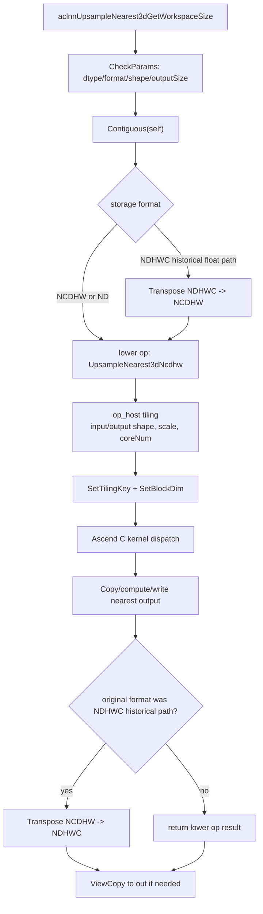

#### 本次增量设计总览图

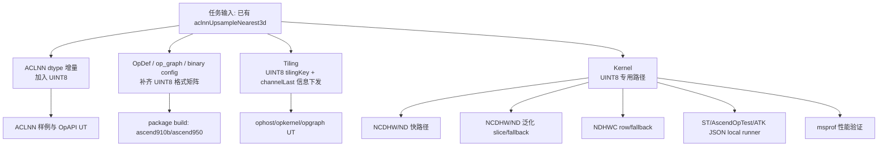

# 需求分析

## 需求描述

使用 Ascend C 在已有 `aclnnUpsampleNearest3d` 开源实现基础上进行增量适配，使 3D 最近邻上采样支持 `UINT8`。

本设计需要同时满足以下验收目标：

1. `self/out` 支持 `UINT8`，并保持与任务书已有 `FLOAT32/FLOAT16/BFLOAT16/DOUBLE` 接口口径一致。
2. `UINT8` 覆盖 `NCDHW`、`NDHWC`、`ND` 三种数据格式，`ND` 默认按 `NCDHW` 处理。
3. 输入输出均支持 5D、非连续 Tensor、显式 `outputSize` 与合法 scale 参数。
4. 泛化 shape、边界 shape、下采样、非整数比例、wide-channel 等合法场景均能正确执行。
5. `uint8` 精度满足 AscendOpTest 默认阈值；本设计中 `uint8` 期望与 CPU nearest golden 逐元素一致。
6. `uint8` 性能相比同 shape、同 format 的 `fp16` 不劣化超过 5%。

## 需求拆解

| 子任务 | 设计拆解 |
| --- | --- |
| ACLNN 接口 | 放开 3D ACLNN `UINT8` dtype 校验，保持 dtype/format/shape/outputSize/非空/元素数检查；非连续输入继续走 `Contiguous`，输出按需 `ViewCopy` |
| 原型与配置 | `op_graph`、`op_host`、A2/A3 binary config 和 regbase/ascend950 配置补齐 `UINT8 + ND/NCDHW/NDHWC` |
| Tiling | 复用 `UpsampleNearest3dCommonTiling`，补充 `UINT8` tilingKey，向 kernel 下发 `isChannelLast/channelCount` |
| Kernel | 为 `UINT8` 增加专用线性路径，覆盖 NCDHW/ND 的快路径、slice 泛化、fallback，以及 NDHWC row/fallback |
| 性能优化 | 使用输入 slice 复用、输出 slice/row 缓冲、整数比例快路径和 `DataCopyPad`，避免针对单一样例硬编码 |
| 测试验证 | 扩展 ACLNN 样例、UT、ST/AscendOpTest、ATK JSON local runner、性能 profiling 和静态检查 |
| 文档交付 | README、接口文档、设计文档、自验证报告和命令记录同步更新，确保代码实现与文档口径一致 |

## 外部组件依赖

| 组件 | 用途 | 是否新增 |
| --- | --- | --- |
| CANN 9.0.0 | 本机编译、安装、ACLNN 运行环境 | 否 |
| Ascend C | AICore kernel 开发与编译 | 否 |
| Ascend API 文档 9.1.0-beta.1 | 核对 `DataCopyPad`、`Gather` 支持范围 | 否 |
| AscendOpTest | ST/精度真实 runner | 否 |
| ATK JSON local runner | 将 ATK JSON case 转为真实 ACLNN/custom op 执行 | 是，测试辅助脚本 |
| msprof | 性能数据采集 | 否 |
| OAT / clang-format / py_compile / json.tool | 合规、格式、安全和配置检查 | 否 |

未找到可以用于个人开发的官方 ATK wheel/CLI ，因此自验证使用 ATK JSON local runner 走真实 ACLNN/custom op 后端验证链路。

## 内部适配模块

| 模块 | 适配内容 |
| --- | --- |
| `op_host/op_api` | `aclnnUpsampleNearest3d` dtype 支持列表加入 `DT_UINT8`；参数异常用例补齐；`uint8/fp16 + NDHWC` 直接调用 lower op |
| `op_graph` | 3D 原型支持 `DT_UINT8`；图模式 infershape 增加 attr 和 data 指针空指针防护 |
| `op_host` | `OpDef` 的 A2/A3 和 regbase dtype/format 矩阵补齐 `UINT8`；tiling 增加 `UINT8` tilingKey；下发 `isChannelLast/channelCount` |
| `op_host/config` | `ascend910b`、`ascend910_93`、`ascend950` binary config 补齐 `uint8 + ND/NCDHW/NDHWC`，并同步 `fp16 + NDHWC` 性能对比口径 |
| `op_kernel` | 新增 `UPSAMPLE_NEAREST3D_TPL_UINT8` 模板选择；新增 `UpsampleNearest3dUint8Linear`；补充 NCDHW/NDHWC 泛化与快路径 |
| `examples` | ACLNN 样例支持 `uint8/fp16` 与 21 个模式入口 |
| `tests/ut` | opapi 参数/dtype、ophost tiling/infershape、opkernel uint8 case 扩展 |
| `tests/st` | AscendOpTest case、CPU golden、ATK JSON local runner、ATK JSON 回归 case |
| `README/docs` | 更新 dtype/format/DOUBLE/A2/A3 口径 |

## 需求模块设计

### Ascend C 算子原型

| 名称 | 类别 | dtype | format | shape | 说明 |
| --- | --- | --- | --- | --- | --- |
| `x/self` | 输入 | `FLOAT32/FLOAT16/BFLOAT16/DOUBLE/UINT8` | `NCDHW/NDHWC/ND` | 5D | 不支持空 Tensor；`ND` 按 `NCDHW` 处理；非连续输入由 ACLNN 转连续 |
| `outputSize` | 输入 | `INT64` | - | size=3 | 分别表示输出 D/H/W，均需大于 0 |
| `scalesD/H/W` | 输入 | `double` | - | 标量 | ACLNN 入口转为 float array 下发 |
| `out/y` | 输出 | 与 `x/self` 一致 | 与 `x/self` 一致 | 5D | N、C 与输入一致，D/H/W 与 `outputSize` 一致 |

### Ascend C 算子相关约束

| 约束 | 说明 |
| --- | --- |
| 维度 | 输入、输出均为 5D |
| 空 Tensor | 不支持空 Tensor；各维度需大于 0 |
| 元素数 | 输入、输出元素个数均不超过 `int32_t` 最大值 |
| 格式 | 支持 `NCDHW/NDHWC/ND`，其中 `ND` 默认按 `NCDHW` 处理 |
| dtype/format 一致 | `self/out` 的 dtype 与 format 必须一致 |
| N/C 轴 | 输入输出 N、C 轴必须相同 |
| outputSize | size 必须为 3，元素均大于 0，输出 D/H/W 必须等于 `outputSize` |
| `DOUBLE` | 保持既有 ACLNN 接口兼容与回归校验，不作为本次 `UINT8` 增量改动项 |

# 详细设计

## 算子分析

### 数学公式

`UpsampleNearest3d` 对输入 Tensor 的 D/H/W 三个空间维度执行最近邻映射。对于输出坐标 `(od, oh, ow)`，对应输入坐标为：

```text
id = min(floor(od * scaleD_real), inD - 1)
ih = min(floor(oh * scaleH_real), inH - 1)
iw = min(floor(ow * scaleW_real), inW - 1)
```

输出值按原始布局写回：

```text
NCDHW: out[n, c, od, oh, ow] = self[n, c, id, ih, iw]
NDHWC: out[n, od, oh, ow, c] = self[n, id, ih, iw, c]
```

当 ACLNN 入参没有提供正 scale 时，`scale*_real = inputSize / outputSize`；当提供正 `scalesD/H/W` 时，沿用已有实现口径转换为输入侧比例并下发 tiling/kernel。`uint8` 只改变数据搬运与模板分发，不改变最近邻索引语义。

### 支持数据类型和格式

| 参数 | dtype | format | shape |
| --- | --- | --- | --- |
| `self/x` | `FLOAT32/FLOAT16/BFLOAT16/DOUBLE/UINT8` | `NCDHW/NDHWC/ND` | 5D |
| `out/y` | 与 `self/x` 一致 | 与 `self/x` 一致 | 5D |
| `outputSize` | `INT64` | - | size=3 |
| `scalesD/H/W` | `double` | - | 标量 |

本次新增主链路是 `UINT8`。`DOUBLE` 保持既有 ACLNN 接口兼容与回归校验口径；A2/A3 AICore binary 的新增范围聚焦 `UINT8 + ND/NCDHW/NDHWC`，并同步补齐 `fp16 + NDHWC` 用于同格式性能对比。

### Shape 与布局分析

`NCDHW/ND` 的线性访问按 `[N,C,D,H,W]` 展开，`batches = N*C`；`NDHWC` 的线性访问按 `[N,D,H,W,C]` 展开，`channelCount = C`。Host 侧统一将空间维度写入 `inputShapes[3]`、`outputShapes[3]`，Kernel 侧通过 `isChannelLast` 区分线性地址反解方式。

这种设计避免为 `NDHWC` 引入额外 transpose，也避免在 `uint8` kernel 中混入 stride 解释。非连续 Tensor 仍由 ACLNN 层完成 `Contiguous` 和 `ViewCopy`，与既有实现保持一致。

### 设计边界

1. 只修改 `ops-cv/image/upsample_nearest3d` 目录及配套文档、样例、测试，不改动无关算子。
2. 不改变 1D/2D nearest v2 共享目录下的既有行为。
3. 不针对单一验收 shape 写固定输出或参数特判；所有快路径均以比例、布局和缓冲容量为条件，不能命中时走泛化 slice/row/fallback。
4. 不使用 A2/A3 不覆盖 `uint8_t` 的 `Gather` 作为主链路，`uint8` 搬运与写回基于 `DataCopyPad` 和局部缓冲完成。

## 使能方式

| 上层框架/方式 | 是否涉及 | 说明 |
| --- | --- | --- |
| PyTorch 训练/推理 | 间接涉及 | 上层可经 ACLNN 调用 |
| ATC 图模式 | 涉及 | `op_graph` 原型与 infershape 保持可用 |
| ACLNN 直调 | 涉及 | 本任务主验证入口 |
| OPAT 调优 | 不涉及 | 本任务无调优交付 |
| SGAT 子图切分 | 不涉及 | 本任务无子图切分交付 |

## 算子实现

### 实现方案总览

本实现采用ACLNN 校验与连续化 + Host 统一 tiling + Kernel dtype/layout 分层分发的设计。`uint8` 不改变既有最近邻数学语义，只在 dtype 注册、binary config、tilingKey、Kernel 模板和布局快路径上增量补齐。

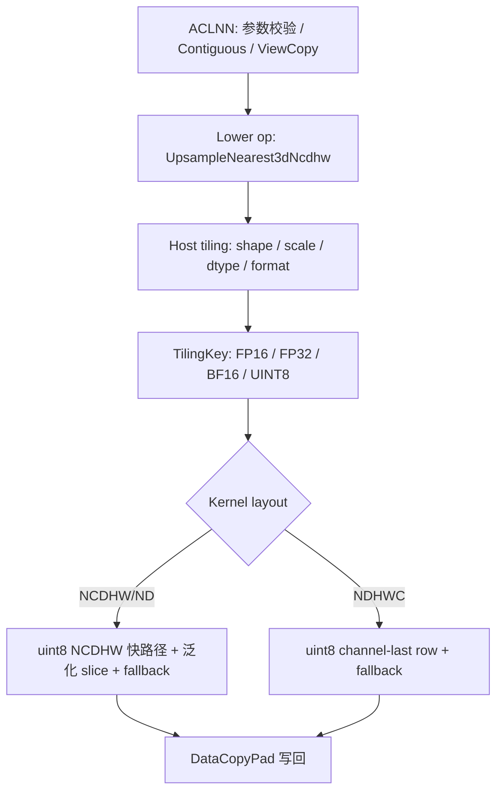

### ACLNN 参数校验与调用链设计

ACLNN 入口负责把非法输入挡在 lower op 之前，并把非连续 Tensor 转为连续 Tensor。`NDHWC` 方面，本次只对 `UINT8` 和 `FLOAT16` 走 direct lower op；其他 dtype 仍沿用历史 transpose 路径，避免扩大行为变更范围。

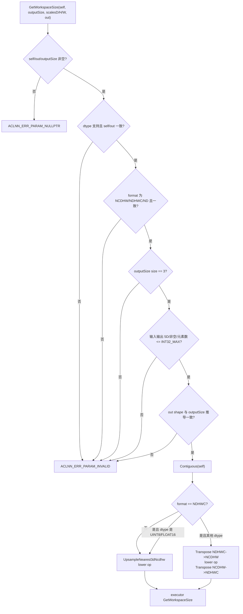

### host侧设计

#### 参数和 Shape 处理

Host tiling 读取 `outputSize`、`scaleD/H/W`、输入 origin shape、输入 format、输入 dtype 和平台信息。`NCDHW/ND` 按 `[N,C,D,H,W]` 读取，`NDHWC` 按 `[N,D,H,W,C]` 读取。下发到 kernel 的空间维度统一存放为：

```text
inputShapes[3]  = {inD, inH, inW}
outputShapes[3] = {outD, outH, outW}
batches         = N * C
channelCount    = C
isChannelLast   = input format == NDHWC
```

`NDHWC` 时 kernel 通过 `isChannelLast/channelCount` 还原 `[N,D,H,W,C]` 线性布局。

#### 分核策略

`UpsampleNearest3dCommonTiling` 复用既有按输出滑块/行切分的分核框架，Host 根据平台 `coreNum` 计算实际使用核数并设置 `BlockDim = needCoreNum`。`uint8` 没有新建孤立分核算法，复用统一 tilingData 字段并在 kernel 内选择具体计算路径。

设计原则：

1. `NCDHW/ND` 快路径以输入 slice、输出 slice 或输出 row 为基本任务单元。
2. `NDHWC` row 路径以 `(N, outD, outH)` 为任务单元，每个任务生成一整行 `outW * C`。
3. fallback 路径以固定 `UINT8_SCALAR_BUFFER_SIZE` 个输出元素为 chunk，对 chunk 进行核间均分。
4. `needCoreNum <= 0` 或 `channelCount <= 0` 的异常兜底在 kernel 初始化中修正为 1；合法输入下不会触发。

#### 数据分块和 Local Memory 优化策略

`uint8` 单元素 1 byte。根据 `DataCopyPad(ISASI)` 文档，`DataCopyPad` 的 `blockLen` 使用 byte 单位，且支持 `uint8_t`，因此 `uint8` 输出块使用 `LocalTensor<uint8_t>` 聚合后写回 GM。

| 路径 | 分块条件 | Local Memory 使用 | 优化目标 |
| --- | --- | --- | --- |
| NCDHW 2x 快路径 | D/H/W 均为 2 倍上采样，scale 约为 0.5，`outW * 2 <= 2048` | 一行或一 slice 输出缓冲 | 一个输入值填充 2x2x2 邻域，减少重复索引 |
| NCDHW 3/2 快路径 | D/H/W 满足 `out * 2 == in * 3`，scale 约为 2/3，`outH*outW <= 2048` | 一 slice 输出缓冲 | 使用整数相位推进替代浮点索引 |
| NCDHW 1/2 下采样 | D/H/W 满足 `out * 2 == in`，scale 约为 2，`outH*outW <= 2048` | 一 slice 输出缓冲 | 直接按 2 步长读取输入 |
| shape-scale input slice | `inputH*inputW <= 2048` 且 `outputH*outputW <= 2048`，D/H/W 均满足 shape scale | 一输入 slice 生成一个输出 slice | 输入切片复用，减少输出 D 维重复计算 |
| NCDHW general slice | `outputH*outputW <= 2048` | 一输出 slice 缓冲 | 泛化上采样/下采样 |
| NDHWC row | `outW * C <= 2048` | 一输出 row 缓冲 | channel-last 连续写回 |
| fallback chunk | 其他合法场景 | 固定 2048 元素缓冲 | 保证泛化功能覆盖 |

#### TilingKey 规划策略

`upsample_nearest3d_struct.h` 中已有模板常量：

| 模板常量 | 数值 | dtype |
| --- | ---: | --- |
| `UPSAMPLE_NEAREST3D_TPL_FP16` | 10 | `FLOAT16` |
| `UPSAMPLE_NEAREST3D_TPL_FP32` | 20 | `FLOAT32` |
| `UPSAMPLE_NEAREST3D_TPL_BF16` | 30 | `BFLOAT16` |
| `UPSAMPLE_NEAREST3D_TPL_UINT8` | 40 | `UINT8` |

Host 根据输入 dtype 设置 `D_T_X/D_T_Y`，再通过 `GET_TPL_TILING_KEY(D_T_X, D_T_Y)` 生成 tilingKey。`uint8` 的 tilingKey 不使用散落式魔法数字。

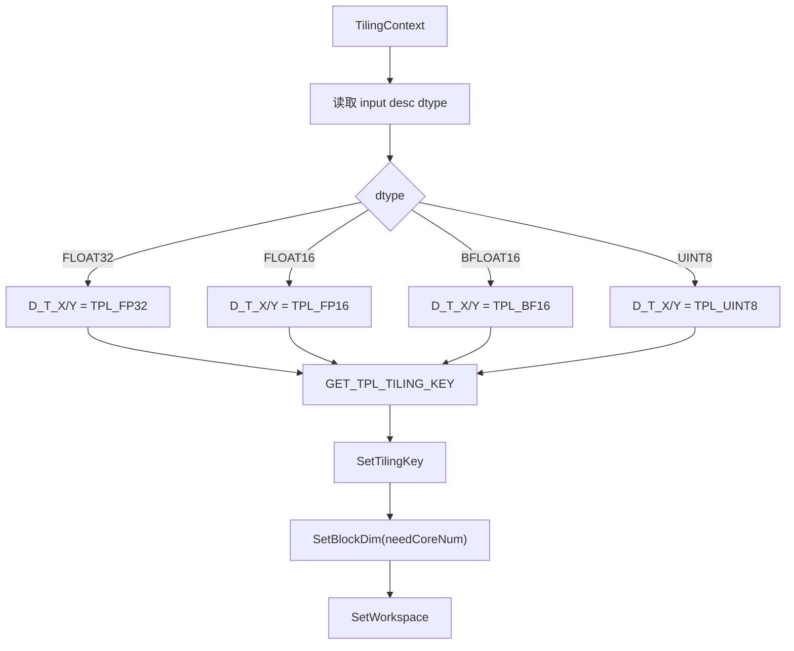

#### dtype/format/binary 配置矩阵

| SoC 配置 | `uint8 + ND` | `uint8 + NCDHW` | `uint8 + NDHWC` | `fp16 + NDHWC` | 说明 |
| --- | --- | --- | --- | --- | --- |
| `ascend910b` | 支持 | 支持 | 支持 | 支持 | A2/A3 主验证 SoC |
| `ascend910_93` | 支持 | 支持 | 支持 | 支持 | A3 口径同步 |
| `ascend950` | 支持 | 支持 | 支持 | 支持 | 同步补齐 regbase/950 口径，已完成 package 构建验证 |

由于代码中存在 regbase/950 配置，本设计也同步纳入构建和配置校验，避免配置断层。

#### Host/Tiling 总流程图

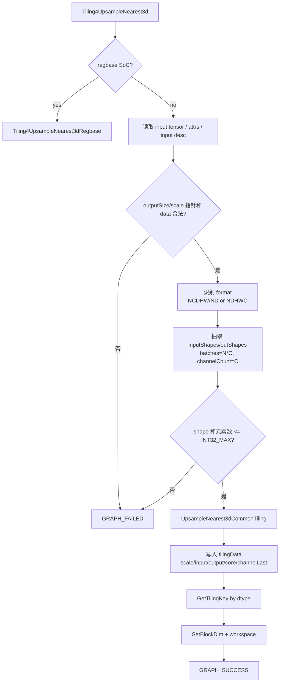

### kernel侧设计

#### Kernel 分发

Kernel 入口根据 tilingKey 分发到不同 dtype 模板。`UINT8` 使用专用 `UpsampleNearest3dUint8Linear`，避免 `uint8 -> uint8` 冗余 Cast；`FLOAT16 + NDHWC` 使用 `UpsampleNearest3dChannelLastLinear<half>`，用于和 `uint8 + NDHWC` 做同格式性能对比。

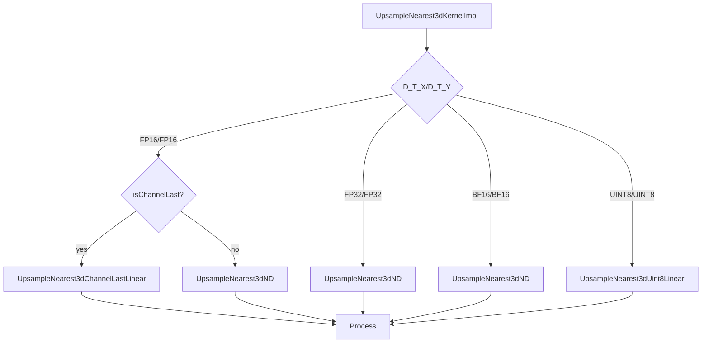

#### `uint8 + NCDHW/ND` 计算路径

`ND` 在 ACLNN/tiling 中按 `NCDHW` 处理。`uint8` 的 NCDHW/ND 路径按从专用到泛化的顺序选择：

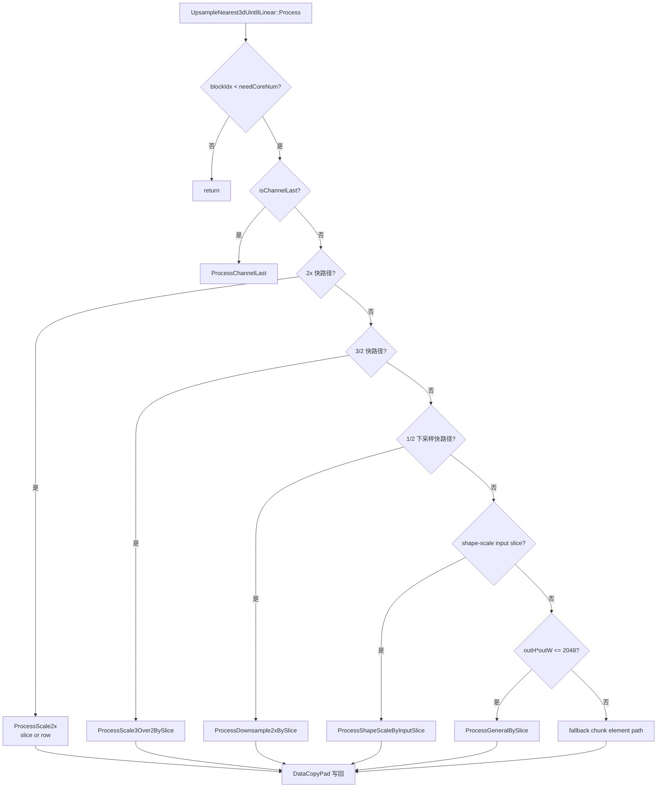

核心索引逻辑：

```text
NCDHW linear input  = (((n*C + c) * inD + id) * inH + ih) * inW + iw
NCDHW linear output = (((n*C + c) * outD + od) * outH + oh) * outW + ow
```

其中 `batches = N*C`，kernel 内使用 `batch` 表示 `n*C+c` 的合并维。

#### `uint8 + NDHWC` 计算路径

`NDHWC` 的线性布局为 `[N,D,H,W,C]`，channel 维在内层连续。`outW * C <= 2048` 时按 row 处理，否则按 chunk fallback 处理。

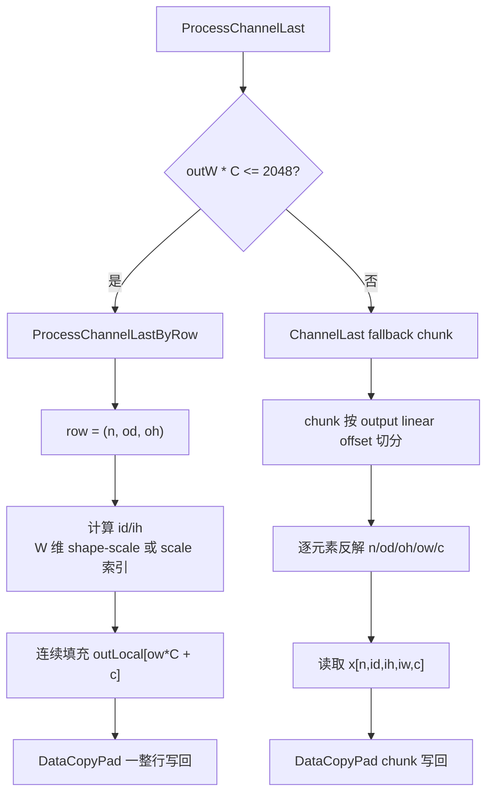

核心索引逻辑：

```text
NDHWC linear input  = ((((n * inD + id) * inH + ih) * inW + iw) * C + c)
NDHWC linear output = ((((n * outD + od) * outH + oh) * outW + ow) * C + c)
```

#### 非连续 Tensor 处理流程

非连续 Tensor 不在 kernel 中直接解释 stride，而是在 ACLNN 层复用框架的 contiguous/view-copy 能力：

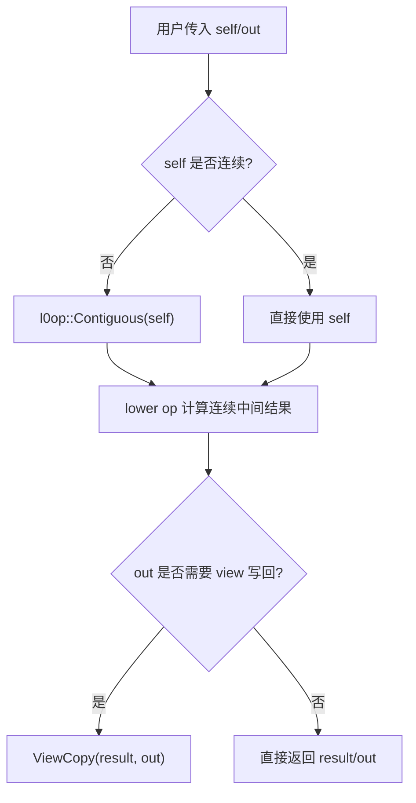

这种设计避免在 `uint8` kernel 中为 stride 单独增加复杂分支，同时保持任务书要求的非连续输入输出支持。

#### Ascend C 实现与基线/TBE 口径差异

| 差异点 | 基线/历史口径 | 本次 Ascend C 设计 | 原因 |
| --- | --- | --- | --- |
| `UINT8` dtype | 3D ACLNN/A2/A3 binary 未完整支持 | ACLNN、OpDef、tilingKey、kernel、binary config 全链路补齐 | 满足任务书核心要求 |
| `UINT8 + NDHWC` | 容易走 transpose 或缺 config | `uint8` 直接 lower op，kernel 内识别 `isChannelLast` | 避免额外 transpose，保证同格式性能 |
| `FLOAT16 + NDHWC` | 历史可能经 transpose | 补齐 direct/binary/OpDef 口径 | 为 `uint8` vs `fp16` 同格式性能比较提供真实基线 |
| `Gather` | 部分历史模板可能使用 Gather | `uint8` 主链路不依赖 Gather | Ascend 文档显示 A2/A3 不覆盖 `uint8_t` Gather |
| 泛化性能 | 单一逐元素 fallback 可保证功能但性能弱 | 快路径 + slice/row + fallback 分层 | 满足泛化验收和 5% 性能要求 |
| 图模式异常防御 | attr/data 指针风险 | infershape 对 `output_size/scales` 指针和 data 指针均做空指针检查 | 设计中的健壮性问题 |

## 支持硬件

| 产品 | 支持范围 |
| --- | --- |
| Atlas A2 训练系列产品 | 本任务主支持范围，`ascend910b` package 构建和本机 910B3 验证通过 |
| Atlas A3 系列产品 | 本任务主支持范围，`ascend910_93` binary config 同步补齐并通过 JSON 校验 |

## 算子约束限制

1. 输入 `self` 和输出 `out` 必须是 5D Tensor。
2. `self/out` 支持 `NCDHW/NDHWC/ND`，`ND` 默认按 `NCDHW` 处理。
3. `self/out` dtype 和 format 必须一致。
4. `self/out` 不支持空 Tensor。
5. `self/out` 元素个数均不超过 `int32_t` 最大值。
6. `self` 的 C、D、H、W 维必须大于 0；`out` 的 N、C 轴与 `self` 一致。
7. `outputSize` size 必须为 3，D/H/W 均大于 0。
8. `out` 的 D/H/W 必须与 `outputSize` 一致。
9. 没有官方 ATK CLI ；已用 ATK JSON local runner 执行真实 ACLNN/custom op 后端。

# 特性交叉分析

| 特性 | 设计处理 | 覆盖情况 |
| --- | --- | --- |
| `uint8 + NCDHW` | `UpsampleNearest3dUint8Linear` NCDHW 快路径/泛化/fallback | ACLNN、UT、ST、性能覆盖 |
| `uint8 + ND` | 按 NCDHW 逻辑处理 | ACLNN、ST 覆盖 |
| `uint8 + NDHWC` | direct lower op + channel-last row/fallback | ACLNN、ST、性能覆盖 |
| 非连续 Tensor | ACLNN `Contiguous` + `ViewCopy` | ACLNN `noncontig`、`ndhwc_noncontig`、性能泛化覆盖 |
| 显式正 scale | ACLNN 转 float scales，下发 kernel | ACLNN/ST 覆盖 |
| 下采样 | `ProcessDownsample2xBySlice` 和泛化 fallback | ACLNN/ST/性能覆盖 |
| singleton/identity | 走泛化路径或直接最近邻映射 | ACLNN/ST 覆盖 |
| `fp16 + NDHWC` | direct lower op 用于同格式性能对比 | 非恒定 fp16 NDHWC 精度回归、性能覆盖 |
| `DOUBLE` | 保持既有 ACLNN dtype/API 兼容与回归校验口径 | `case_double_get_workspace_normal` 回归 |
| 1D/2D nearest v2 | 共享目录但非本任务目标 | 保持既有逻辑，不做无关改动 |

# 可维可测分析

## 精度标准和性能标准

| 标准 | 要求 | 当前证据 |
| --- | --- | --- |
| 精度 | 满足 AscendOpTest 默认阈值；`uint8` 应与 CPU nearest golden 逐元素一致 | AscendOpTest 17 case 全部 `compare passed`；ATK JSON local runner 16/16 pass |
| 性能 | `uint8` 相比 `fp16` 劣化 5% 以内 | 代表性快路径、泛化 NCDHW、非连续、NDHWC 同格式、wide-channel NDHWC 均未劣化超过 5% |
| 泛化 | 覆盖常规、边界和反馈泛化 shape | ACLNN 42 个入口、UT/ST 多维覆盖 |

性能结果摘要：

| 场景 | shape | uint8 Avg(us) | fp16 Avg(us) | 相对 fp16 | 结论 |
| --- | --- | ---: | ---: | ---: | --- |
| 2x | `{1,8,16,16,16}->{1,8,32,32,32}` | 24.44 | 45.84 | -46.68% | 通过 |
| 非 2x | `{1,8,16,16,16}->{1,8,24,24,24}` | 41.14 | 49.94 | -17.62% | 通过 |
| 下采样 | `{1,8,32,32,32}->{1,8,16,16,16}` | 23.38 | 39.12 | -40.24% | 通过 |
| 泛化 NCDHW | `{1,8,13,17,19}->{1,8,21,29,31}` | 44.22 | 51.76 | -14.57% | 通过 |
| 泛化非连续 NCDHW | `{1,4,6,10,12}->{1,4,11,17,19}` | 16.92 | 24.68 | -31.44% | 通过 |
| 泛化 NDHWC | `perf_ndhwc_general` | 52.08 | 59.68 | -12.73% | 通过 |
| wide-channel NDHWC | `perf_ndhwc_wide_channel` | 33.82 | 38.30 | -11.70% | 通过 |

## 自验证矩阵

| 类型 | 数量/结果 | 说明 |
| --- | --- | --- |
| ACLNN 样例入口 | `2 dtypes x 21 modes = 42` | `uint8/fp16` 覆盖 NCDHW、ND、NDHWC、非连续、scale、downsample、identity、singleton、性能 shape |
| opapi UT | 79 tests / 3 suites | 3D ACLNN suite 32 tests，含 `uint8` dtype/format/参数异常 |
| ophost UT | 14 tests / 2 suites | 含 `uint8/fp16 NDHWC` tiling、downsample、scale、infershape 异常防御 |
| opkernel UT | 7 tests / 1 suite | 含 `uint8`、`uint8_3d`、downsample、odd、identity |
| opgraph | 构建命令退出码 0 | 图模式构建链路验证 |
| AscendOpTest | 17 case 全部通过 | 16 个 `uint8` + 1 个 `fp16 NDHWC` 非恒定回归 |
| ATK JSON local runner | 16/16 pass | ATK JSON 转真实 ACLNN/custom op 后端执行 |
| package build | `ascend910b`、`ascend950` 通过 | `ascend950 -j1` 串行构建验证通过 |
| 静态/合规 | 通过 | `json.tool`、`py_compile`、`clang-format`、`git diff --check`、OAT |

验证流程图：

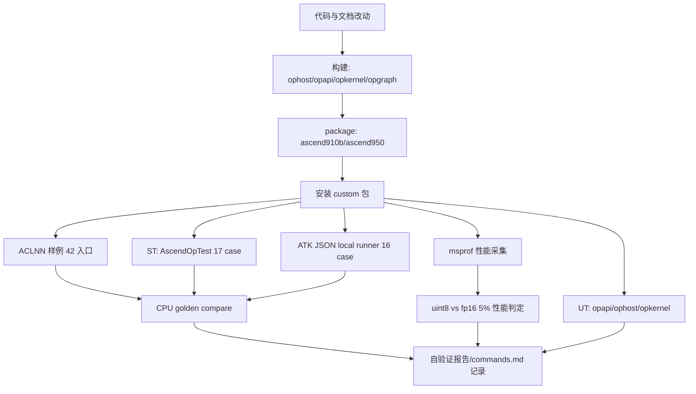

## 兼容性分析

本次是已有算子的 dtype 增量适配：

1. 不删除既有 `FLOAT32/FLOAT16/BFLOAT16/DOUBLE` ACLNN dtype 校验。
2. 不改变 `NCDHW/ND/NDHWC` 的合法 format 判断。
3. 不改变 1D/2D nearest v2 共享目录下的接口行为。
4. `NDHWC` direct lower op 只新增到 `uint8/fp16`，其他 dtype 继续走历史 transpose 路径，降低兼容性风险。
