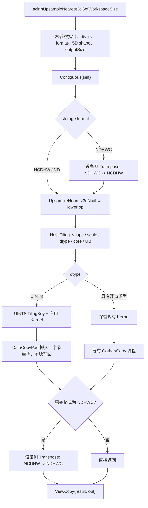

# aclnnUpsampleNearest3d 支持 UINT8 数据类型设计文档

# 需求背景（required）

## 需求来源

本需求来源于 2026 年昇腾算子社区任务《UpsampleNearest3d 算子开发任务书》。任务要求在 `cann/ops-cv` 现有 `aclnnUpsampleNearest3d` 实现上新增 `UINT8` 支持，并完成设计、开发、测试、README/API 文档和自验证报告。

本文分析基于 `cann/ops-cv` 的 `master@24cade243cb03012d61706bf8c937ff16329a24e`，目标源码目录为：

```text
image/upsample_nearest3d/
```

目标硬件为 Atlas A2 训练系列产品和 Atlas A3 系列产品，分别对应仓内 `ascend910b`、`ascend910_93` 配置。`ascend950` 的 arch35/regbase 实现保留现状，不作为本任务新增能力的替代路径。

## 背景介绍

### 算子功能

`aclnnUpsampleNearest3d` 对五维 Tensor 的 D、H、W 三个空间维度执行最近邻采样。输入、输出的 N、C 维保持不变，每个输出坐标只读取一个输入坐标，不做加权插值。

支持的逻辑布局为：

- `NCDHW`；
- `NDHWC`；
- `ND`，按 `NCDHW` 语义处理。

ACLNN 接口原型如下：

```cpp
aclnnStatus aclnnUpsampleNearest3dGetWorkspaceSize(
    const aclTensor* self,
    const aclIntArray* outputSize,
    double scalesD,
    double scalesH,
    double scalesW,
    aclTensor* out,
    uint64_t* workspaceSize,
    aclOpExecutor** executor);

aclnnStatus aclnnUpsampleNearest3d(
    void* workspace,
    uint64_t workspaceSize,
    aclOpExecutor* executor,
    aclrtStream stream);
```

### 现有实现分析

当前代码已经具备浮点类型的 ACLNN、Host Tiling 和 Ascend C Kernel 链路，arch35/regbase 侧也已有部分 `UINT8` 声明，但 Atlas A2/A3 的普通路径尚未形成 `UINT8` 闭环。

| 层级 | 当前状态 | 本任务设计动作 |
| --- | --- | --- |
| Graph 原型 | `op_graph/upsample_nearest3d_proto.h` 已声明 `DT_UINT8` | 保持并加入回归检查 |
| ACLNN dtype 校验 | 普通 `DTYPE_SUPPORT_LIST` 不含 `DT_UINT8`；regbase 列表已包含 | 为 A2/A3 普通路径加入 `DT_UINT8` |
| OpDef | A2/A3 默认配置仅声明 FLOAT/FLOAT16/BFLOAT16；arch35 配置已有 `UINT8` | 补齐 `ascend910b`、`ascend910_93` 的 dtype/format 能力 |
| 普通 TilingKey | 只有 FP16/FP32/BF16 模板 | 新增 `UINT8` 模板和映射 |
| 普通 Kernel | 仅实例化 `half`、`float`、`bfloat16_t` | 新增 A2/A3 `uint8_t` 自有 Kernel 路径 |
| arch35 Kernel | 已有独立 SIMD/SIMT/DataCopy 实现 | 保留并做静态回归，不用其冒充 A2/A3 实现 |
| 非连续 Tensor | ACLNN 使用 `Contiguous`，结果使用 `ViewCopy` | 沿用现有设备侧链路 |
| NDHWC | ACLNN 通过设备侧 Transpose 转换到 NCDHW，再转回 | 保持语义；验证 `UINT8` 链路可达 |
| 文档与测试 | API 文档声明 UINT8，但 A2/A3 限制说明仍显示不支持；缺少完整 UINT8 用例 | 统一文档口径并补齐 UT/ST/样例 |

### 参数与目标能力

| 参数 | 输入/输出/属性 | 数据类型 | 格式 | Shape 与约束 |
| --- | --- | --- | --- | --- |
| `self` | 输入 | FLOAT32、FLOAT16、BFLOAT16、DOUBLE、UINT8 | NCDHW、NDHWC、ND | 5D；不支持空 Tensor；C、D、H、W 大于 0 |
| `outputSize` | 输入 | INT64 | - | 长度为 3，分别为 outD/outH/outW，元素大于 0 |
| `scalesD/H/W` | 属性 | double | - | 沿用已有接口语义；正值时参与有效反向比例计算 |
| `out` | 输出 | 与 `self` 一致 | 与 `self` 一致 | 5D；N、C 与输入一致，D/H/W 与 `outputSize` 一致 |

输入和输出 Tensor 的元素总数均不得超过 `int32_t` 最大值。非连续 Tensor 由 ACLNN 执行器完成连续化和写回。

# 需求分析（required）

## 需求描述

在不改变 ACLNN 接口、不改变既有浮点路径语义的前提下，为 Atlas A2/A3 的 `aclnnUpsampleNearest3d` 增加完整 `UINT8` 支持，使其能够通过参数校验、OpDef/binary 选择、TilingKey 生成、Ascend C Kernel 执行、测试和文档验收。

`UINT8` 最近邻采样仅做索引映射和字节复制，不发生类型转换、舍入、饱和或插值运算，因此正确结果应与 CPU 真值逐元素完全一致。

## 需求拆解

1. ACLNN 普通路径允许 `self/out=UINT8`，并保持二者 dtype/format 一致。
2. `ascend910b` 和 `ascend910_93` 配置支持 `UINT8 + ND/NCDHW/NDHWC`。
3. 新增 `UINT8` TilingKey，避免错误落入 FP32 模板。
4. 新增 A2/A3 `uint8_t` Kernel；不依赖目标 SoC 不支持的 `Gather<uint8_t>` 组合。
5. 支持上采样、下采样、等尺寸、整数与非整数比例、小 Shape、大 Shape和 32 字节非对齐尾块。
6. 支持非连续输入和输出，沿用 `Contiguous + ViewCopy`。
7. 保持 FLOAT16、FLOAT32、BFLOAT16、DOUBLE 的既有接口和执行行为。
8. 补齐 UT、ST、ACLNN 样例、文档和自验证报告。
9. 在相同 Shape、Layout 和测试环境下验证 `UINT8` 相比 FP16 的性能劣化不超过 5%。

## 范围与非目标

本任务只修改 `image/upsample_nearest3d` 及其直接配置、测试和文档，不改变同目录中的 1D/2D V2 接口。

`ascend310p`、`kirinx90`、`kirin9030` 不属于任务书目标硬件，不在本次扩展 `UINT8` 能力。`ascend950` 已有独立 arch35/regbase 路径，本任务只保证其原有配置不被破坏，不以该路径替代 A2/A3 验收。

# 详细设计（required）

## 算子分析

### 数学公式

设空间维度为 `inD/inH/inW` 和 `outD/outH/outW`。沿用现有实现得到三个有效反向比例 `scaleD/scaleH/scaleW`。对于输出坐标 `(od, oh, ow)`：

```text
id = min(floor(od * scaleD), inD - 1)
ih = min(floor(oh * scaleH), inH - 1)
iw = min(floor(ow * scaleW), inW - 1)
```

输出关系为：

```text
NCDHW:
out[n, c, od, oh, ow] = self[n, c, id, ih, iw]

NDHWC:
out[n, od, oh, ow, c] = self[n, id, ih, iw, c]
```

`UINT8` 路径不改变上述坐标计算，输出值为输入字节的原样复制。

### Shape、布局与数据所有权

`NCDHW/ND` 按 `[N,C,D,H,W]` 展开，独立批次为 `N*C`。`NDHWC` 由 ACLNN 现有设备侧 Transpose 转换为 NCDHW 后进入同一 lower op，再转换回原布局。

每个 AI Core 只写自己分配的输出 slide/row/chunk，输出区间互不重叠，不需要原子操作。Host 只依据 dtype、format、shape、比例和平台资源进行分派，不依据任务 case id、输入值或输出内容分派。

## 总体执行流程



## Host 侧设计

### ACLNN 参数校验

在 `op_host/op_api/aclnn_upsample_nearest_3d.cpp` 中：

- 向 A2/A3 使用的 `DTYPE_SUPPORT_LIST` 增加 `DT_UINT8`；
- 保持 `ASCEND310P_DTYPE_SUPPORT_LIST` 不变；
- 保持 `DTYPE_SUPPORT_LIST_REGBASE` 现有行为；
- 保持 `self/out` dtype 一致检查；
- 保持 5D、`outputSize.size()==3`、正空间维度和输出 Shape 检查；
- 保持输入 `Contiguous` 与输出 `ViewCopy`。

校验只保护接口契约和安全边界，不重复堆叠无行为差异的 dtype/shape 判断。

### OpDef 与 binary 配置

`op_host/upsample_nearest3d_def.cpp` 中为 `ascend910b`、`ascend910_93` 配置显式加入 `UINT8`。对应 binary JSON 和 simplified key 同步增加 `UINT8 + ND/NCDHW`；`NDHWC` 由 ACLNN 转换到 NCDHW lower op，配置口径与实际下沉格式保持一致。

`op_graph/upsample_nearest3d_proto.h` 已声明 `DT_UINT8`，仅验证原型、OpDef、binary 配置三层一致性。

### TilingData

现有 TilingData 中的 shape、scale、slide 和分核字段可以复用。`UINT8` 单元素为 1 byte，Host 需要按 `sizeof(uint8_t)` 重新计算 UB 容量、单次搬运长度和 32 字节对齐空间。

新增或明确下发的关键语义：

| 字段 | 含义 |
| --- | --- |
| `inputShapes[3]` | inD/inH/inW |
| `outputShapes[3]` | outD/outH/outW |
| `batches` | N*C |
| `scaleD/H/W` | 输出坐标到输入坐标的有效反向比例 |
| `needCoreNum` | 实际启用 AI Core 数 |
| `eachCoreSlideNum/remainder` | 核间 slide 分配与尾核工作量 |
| `slideSizeW/tensorSizeW` | W 方向分块与 UB 容量约束 |
| `dataType` | 用于自检和调试的 dtype 标识 |

### TilingKey

在 `op_kernel/upsample_nearest3d_struct.h` 中新增：

```cpp
#define UPSAMPLE_NEAREST3D_TPL_UINT8 40
```

并把 `UINT8` 加入 `ASCENDC_TPL_DTYPE_DECL` 和 `ASCENDC_TPL_SEL`。在 `op_host/upsample_nearest3d_tiling.cpp::GetTilingKey()` 中增加：

```text
DT_UINT8 -> D_T_X = UPSAMPLE_NEAREST3D_TPL_UINT8
         -> D_T_Y = UPSAMPLE_NEAREST3D_TPL_UINT8
```

未识别 dtype 必须返回 Host 侧错误，不能沿用当前默认 FP32 key 静默执行。

### 分派表

| 条件 | 选择路径 | 说明 | 失败行为 |
| --- | --- | --- | --- |
| `ascend910b/ascend910_93 + UINT8` | 新增 arch22 `uint8_t` Kernel | 本任务主路径 | 配置或编译不支持时明确失败 |
| `ascend910b/ascend910_93 + 既有浮点类型` | 现有普通 Kernel | 不改变历史行为 | 沿用现有错误处理 |
| `ascend950` | 现有 arch35/regbase 路径 | 仅回归，不替代 A2/A3 | 沿用现有错误处理 |
| `ascend310p/kirin* + UINT8` | 不支持 | 不在任务范围 | ACLNN/配置层明确拒绝 |
| `NCDHW/ND` | 直接 lower op | 主执行布局 | 非法 5D/shape 明确失败 |
| `NDHWC` | 设备侧 Transpose + lower op + Transpose | 保持现有接口语义 | Transpose/lower op 失败则返回错误 |
| 常见比例且块可放入 UB | 连续区间/重复段快路径 | 减少重复索引与搬运 | 不满足条件转泛化路径 |
| 其他合法 Shape/比例 | 通用 row/slide/chunk 路径 | 保证泛化正确性 | 不允许 CPU 或高层算子 fallback |

## Kernel 侧设计

### 实现族

新增 `UpsampleNearest3dUint8` 专用实现，并在 `UpsampleNearest3dKernelImpl` 中按 `UPSAMPLE_NEAREST3D_TPL_UINT8` 实例化。已有浮点模板继续使用 `UpsampleNearest3dND<T>`。

不直接把 `uint8_t` 塞入现有 `Gather` 模板：目标 A2/A3 上必须先满足原语 dtype 能力。`UINT8` 路径采用 `DataCopyPad` 加字节安全的 UB 重排，确保完整契约可表达。

### 数据流

1. 根据 block id 取得本核负责的 slide/row/chunk。
2. 根据输出 D/H/W 区间计算单调的输入索引区间。
3. 将最小连续输入区间从 GM 搬入 UB。
4. 在 UB 中按最近邻索引生成输出字节序列。
5. 对映射到同一输入坐标的连续输出段复用已加载字节。
6. 使用 `DataCopyPad` 按真实 byte 长度写回本核独占的 GM 区间。
7. 处理完当前块后复用 UB，继续下一个块。


### 快路径与通用路径

快路径只由合法运行时 metadata 选择，且每条路径对其完整 metadata 域正确：

- 等尺寸：连续块直接复制；
- 整数倍上采样：复用输入字节并生成连续重复段；
- 整数倍下采样：按固定步长选择输入；
- W 行可完整放入 UB：按 row 处理，减少重复坐标计算；
- 其他比例或大行：按 chunk 处理，每个 chunk 独立计算精确源坐标。

任何快路径不能命中时都进入本算子源码内的通用 `UINT8` 路径；不读取 case id，不依赖输入值分布，不写固定输出。

### UB 与流水

UB 按输入块、输出块、索引/临时区划分。输入输出队列使用双缓冲的前提是 UB 容量允许；容量不足时降低 tile 长度，不改变算法语义。

`UINT8` 搬运长度以 byte 计。UB 分配向 32 byte 对齐，GM 写回只使用真实有效 byte 数，避免尾块越界。MTE2、Vector/Scalar 和 MTE3 的事件同步保持最小必要集合。

### 尾块处理

- W 尾块不足 32 byte 时使用 `DataCopyPad`；
- 最后一个 slide、row 或 core 只处理实际剩余元素；
- 输入区间和输出区间均做 64 位中间乘法与 `INT32_MAX` 契约检查；
- 不读取输入逻辑范围之外的字节，不覆盖输出逻辑范围之外的地址；
- N/C/D/H/W 任一边界为 1 时仍走合法路径。

## 计划修改文件

| 文件或目录 | 计划变更 |
| --- | --- |
| `op_host/op_api/aclnn_upsample_nearest_3d.cpp` | A2/A3 dtype 白名单加入 UINT8，补参数 UT |
| `op_host/upsample_nearest3d_def.cpp` | A2/A3 OpDef dtype/format 配置补齐 |
| `op_host/upsample_nearest3d_tiling.cpp` | UINT8 TilingKey 和非法 dtype fail-closed |
| `op_kernel/upsample_nearest3d_struct.h` | 新增 UINT8 模板声明和选择 |
| `op_kernel/upsample_nearest3d.h` 或独立 UINT8 头文件 | 新增 arch22 UINT8 Kernel 与分发 |
| `op_host/config/ascend910b/*` | 补齐 A2 binary/simplified key |
| `op_host/config/ascend910_93/*` | 补齐 A3 binary/simplified key |
| `tests/ut` | API、OpHost Tiling、Kernel UINT8 单测 |
| `tests/st/aclnnUpsampleNearest3d` | UINT8 泛化、边界和非连续用例 |
| `examples/test_aclnn_upsample_nearest3d.cpp` | reviewer 可运行的 UINT8 ACLNN 样例 |
| `README.md`、`docs/aclnnUpsampleNearest3d.md` | 更新 UINT8 支持范围、平台和约束 |

# 支持硬件

| 支持的芯片版本 | 本任务状态 |
| --- | --- |
| Atlas A2 训练系列产品（`ascend910b`） | 新增并重点验证 |
| Atlas A3 系列产品（`ascend910_93`） | 新增并重点验证 |
| Ascend 950（`ascend950`/arch35） | 保留原路径并回归，不作为本任务验收替代 |
| Ascend 310P、Kirin 系列 | 不新增 UINT8 |

# 算子约束限制

1. 输入和输出均为 5D，且 dtype、format 一致。
2. `outputSize` 长度为 3，元素均大于 0。
3. 输入 C/D/H/W 和输出 D/H/W 均大于 0。
4. 输入、输出 N/C 轴一致。
5. 输入、输出元素总数均不超过 `int32_t` 最大值。
6. `ND` 按 `NCDHW` 语义解释。
7. 非连续 Tensor 通过 ACLNN `Contiguous/ViewCopy` 支持。
8. `UINT8` 值域为 0 到 255，采样过程不做数值转换。
9. 不支持的 SoC、dtype、format 或非法 shape 必须明确报错，不能静默 fallback。

# 可维可测分析

## 精度标准/性能标准

| 验收标准 | 描述 | 标准来源 |
| --- | --- | --- |
| 精度标准 | `UINT8` 输出与 CPU 最近邻真值逐元素一致；其他 dtype 不低于现有回归标准 | 社区任务书与 AscendOpTest 默认阈值 |
| 性能标准 | 同一设备、Shape、Layout 和测量方式下，`T_uint8 <= 1.05 * T_fp16` | 社区任务书 |
| 泛化标准 | 覆盖常规、边界、非整数比例、非连续和多布局合法输入 | 社区任务书 |
| 安全标准 | 无越界、无未初始化读写、非法输入 fail-closed | 算子开发规范 |

设计阶段不填写未经实测的性能数字。性能结论只从后续原始日志和 profiler 证据生成。

## 测试矩阵

| 类别 | 覆盖内容 | 预期 |
| --- | --- | --- |
| dtype | UINT8 主测；FLOAT16/FLOAT32/BFLOAT16/DOUBLE 回归 | UINT8 可达，既有类型无回归 |
| layout | NCDHW、NDHWC、ND | 输出 Shape、格式和值正确 |
| scale | 等尺寸、2 倍/3 倍上采样、下采样、非整数比例 | 坐标映射逐元素正确 |
| Shape | N/C/D/H/W 为 1、普通 5D、大 C、多 batch | 所有合法 Shape 正确 |
| tail | W 和输出元素数位于 31/32/33、63/64/65 等边界 | 无越界，尾块正确 |
| values | 0、1、127、128、254、255 与随机全值域 | 逐元素完全一致 |
| non-contiguous | 输入切片/转置视图、非连续输出视图 | Contiguous/ViewCopy 正确 |
| invalid | 空指针、错误 dtype/format、非 5D、错误 outputSize、零/负维度、元素数越界 | 返回明确错误 |
| SoC | A2、A3 主测；arch35 静态/构建回归 | 目标硬件闭环，保留路径不回归 |

## 验证层级

1. 静态检查：clang-format、OAT、codespell、JSON 解析、diff check。
2. OpAPI UT：dtype、shape、outputSize、非连续和错误码。
3. OpHost UT：OpDef、TilingKey、分核、UB 和尾块参数。
4. OpKernel UT：小 Shape、尾块、快路径和通用路径。
5. ACLNN ST：真实设备上与 CPU golden 对比。
6. reviewer 样例：从源码仓构建、安装并运行多组 ACLNN case，输出唯一 PASS 标记。
7. 性能验证：A2/A3 上对相同 Shape/Layout 的 UINT8 与 FP16 进行预热和多次测量，记录 ACLNN 端到端时间；必要时用 msprof 定位 Kernel/MTE 开销。

## 性能测量口径

性能比较使用成对 case：

```text
ratio = median(uint8_us) / median(fp16_us)
pass  = ratio <= 1.05
```

两组 case 使用相同设备、N/C/D/H/W、outputSize、layout、预热次数和重复次数。原始微秒时间与无量纲 ratio 同时记录。设备型号、physical/card/chip、CANN 版本、分支 head 和测量命令写入自验证报告。

## 无 fallback 边界

正式候选路径只执行本源码树中编译出的 ACLNN/Host Tiling/Ascend C Kernel。CPU 实现仅生成测试真值，FP16 仅作为性能基线。不得在运行时调用 CPU、PyTorch、高层框架等价算子、外部自定义算子或 arch35 路径替代 A2/A3 `UINT8` 实现。

# 兼容性分析

1. ACLNN 函数签名、属性含义和输出 Shape 规则不变。
2. FLOAT16、FLOAT32、BFLOAT16、DOUBLE 的历史路径不改算法，仅做回归。
3. 1D/2D V2 共享目录文件不改变行为。
4. `ascend950` arch35/regbase 路径保持独立。
5. 新增 `UINT8` 是向后兼容的能力扩展；非法输入仍按既有 ACLNN 错误机制返回。
6. README、API 文档、OpDef、binary 配置和测试必须在同一提交中保持一致。

# 交付件

1. 本设计文档；
2. `ops-cv` 个人 fork 中的实现分支；
3. 算子源码、README/API 文档和多组 ACLNN 调用测试；
4. 可复现的自验证报告及原始日志；
5. A2/A3 精度、泛化和性能验收证据。
