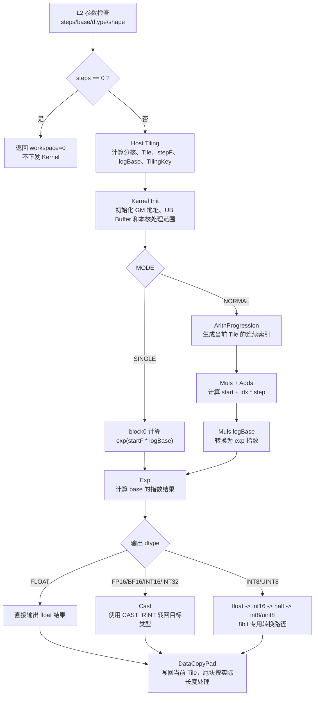

# Logspace 算子 AscendC 实现设计文档

## 一、需求背景

### 1.1 需求来源

通过社区任务完成开源仓算子贡献的需求。

## 二、需求分析

额外支持 int16、int32、uint8、int8，性能不劣于 fp32。

`aclnnLogSpace` 基于 AscendC 实现，使 `log_space` 支持 int16、int32、int8、uint8 数据类型。

### 2.1 外部组件依赖

不涉及外部组件适配。

### 2.2 内部适配模块

aclnn 接口、op_host tiling、AscendC kernel、UT 和示例。

### 2.3 支持的硬件

Atlas A2 训练系列产品 / Atlas A3 系列产品。

代码中对应 SOC：

- A2：`ascend910b`
- A3：`ascend910_93`

### 2.4 需求模块设计

#### 2.4.1 AscendC 算子原型

| 参数名 | 输入/输出/属性 | 描述 | 使用说明 | 数据类型 | 数据格式 | 维度(shape) | 非连续 Tensor |
| --- | --- | --- | --- | --- | --- | --- | --- |
| start (aclScalar*) | 输入 | 表示 LogSpace 的第一个输入，对数序列的起始指数。 | - | FLOAT、FLOAT16、DOUBLE、BFLOAT16、INT8、UINT8、INT16、INT32 | - | - | - |
| end (aclScalar*) | 输入 | 表示 LogSpace 的第二个输入，对数序列的结束指数。 | - | FLOAT、FLOAT16、DOUBLE、BFLOAT16、INT8、UINT8、INT16、INT32 | - | - | - |
| steps (int64_t) | 输入 | 序列中的元素数量。 | `steps >= 0` 且 `steps <= UINT32_MAX` | int64_t | - | - | - |
| base (double) | 输入 | 对数空间的底数。 | `base > 0` | double | - | - | - |
| result (aclTensor*) | 输出 | 表示 LogSpace 的输出，对数间隔序列张量。 | 输出必须为一维，且 `shape[0] == steps` | FLOAT、FLOAT16、BFLOAT16、INT8、UINT8、INT16、INT32 | ND | `[steps]` | × |

相关约束：

- Atlas A2 训练系列产品 / Atlas A3 系列产品支持 FLOAT、FLOAT16、BFLOAT16、INT8、UINT8、INT16、INT32。
- `steps == 0` 时返回空 Tensor，不下发 Kernel。
- 当前 Kernel 按连续一维输出写回，调用侧应传入一维连续输出 Tensor。

## 三、需求详细设计

### 3.1 使能方式

| 上层框架 | 涉及的框架勾选 |
| --- | --- |
| **TF 训练/推理** | |
| **PyTorch 训练/推理** | |
| **ATC 推理** | |
| **Aclnn 直调** | ✔ |
| **OPAT 调优** | |
| **SGAT 子图切分** | |

### 3.2 需求总体设计

#### 3.2.1 Host 侧设计

##### Tiling 策略

算子输出固定为一维序列，不涉及广播。Host 侧将输出视为一维连续向量，仅根据 `steps`、输出 dtype 和平台信息计算分核、Tile 切分和 TilingKey。

##### 任务均分

`coreNum` 根据输出长度和平台 AIV 核数动态调整。当前实现中每核最少处理元素数为 `MIN_PER_CORE = 64`，小规模输入会缩减使用核数。

##### 批量搬运

当前 Kernel 使用 `UB_CHUNK_ELEMS = 2048` 作为单次 Tile 处理粒度。每个核按连续区间处理，多次 Tile 循环覆盖本核负责的数据，尾段按实际长度写回。

##### 分核策略

优先使用满核原则，但保证每核处理的数据量不低于最小粒度：

- `steps == 0`：L2 侧短路，不下发 Kernel。
- `steps == 1`：单核处理。
- `steps >= 2`：根据 `steps` 和平台核数计算使用核数，前 `useCores - 1` 个核处理相同长度，最后一个核处理尾段。

##### 输入数据大小计算

本算子没有输入 Tensor，`start/end/base/steps` 均作为 scalar/attr 传入。Host 侧主要根据输出 `result` 的 dtype 和 `steps` 计算输出元素数、分核信息和 TilingKey。

##### UB 内存大小和核心数量获取

通过平台信息获取 UB 内存大小和 AIV 核数。当前实现固定 `UB_CHUNK_ELEMS = 2048`，并校验平台返回的 UB 和核数有效。

##### 数据分块和内存优化策略

Kernel 侧使用两个 VECCALC buffer：

- `idxBuf_`：保存 fp32 index，8bit 输出时复用为 int16 临时 buffer。
- `valBuf_`：保存 fp32 计算结果，8bit 输出时复用为 mask/half 临时 buffer。

输出使用 `outQueue_`，按目标 dtype 分配。该设计兼顾 fp32 计算精度和整型输出转换。

##### Tiling Key 规划策略

当前不是固定 TilingKey。TilingKey 由输出 dtype 和 mode 共同决定：

| 维度 | 取值 |
| --- | --- |
| `D_T_Y` | FLOAT、FLOAT16、BFLOAT16、INT16、INT32、INT8、UINT8 |
| `MODE` | `0 = NORMAL`、`1 = SINGLE` |

共 `7 dtype × 2 mode = 14` 条路径。

##### 数据检测

Host/L2 侧检测内容包括：

- `start/end/result/workspaceSize/executor` 非空。
- `steps >= 0` 且不超过 `UINT32_MAX`。
- `base > 0`。
- `start/end/result` dtype 在支持列表内。
- `result` 必须为一维，且 `shape[0] == steps`。
- AICore 仅支持 `ASCEND910B` 和 `ASCEND910_93`。

#### 3.2.2 Kernel 侧设计

Kernel 侧进行 `Init` 和 `Process` 两个阶段，其中 `Process` 按 Tile 循环执行计算和写回。由于本算子没有输入 Tensor，不存在传统意义上的输入 `CopyIn`。

`MODE = 0` 表示 `steps >= 2` 的 NORMAL 路径，`MODE = 1` 表示 `steps == 1` 的 SINGLE 路径。`steps == 0` 已在 L2 侧短路。

会用到的主要 API 有：`ArithProgression`、`Muls`、`Adds`、`Exp`、`Cast`、`Duplicate`、`And`、`DataCopyPad` 等。

AscendC 的 Logspace 算子 Kernel 侧实现流程如下。整体计算语义为先生成线性指数序列 `start + idx * step`，再计算 `base ^ exponent`；Kernel 内部统一在 `float` 域计算，输出前再 Cast 回目标类型。

`INT8/UINT8` 在当前 CANN/A2 上不支持 `float -> int8/uint8` 直接 Cast，因此采用：

```text
float -> int16(CAST_RINT) -> mask/sign adjust -> half(CAST_NONE) -> int8/uint8(CAST_NONE)
```



### 3.3 支持硬件

| 支持的芯片版本 | 是否支持 |
| --- | --- |
| 香橙派 OrangePi AIpro | 不支持 |
| A3 系列产品 | 支持 |
| A2 训练系列产品 | 支持 |

### 3.4 算子约束限制

- 输出必须为一维 Tensor，且 `shape[0] == steps`。
- 调用侧应传入连续一维输出 Tensor。
- `base > 0`。
- `steps >= 0`。
- `INT8/UINT8` 精度验证用例应避免超出 dtype 可表示范围，否则溢出口径需要单独定义。

## 四、特性交叉分析

暂无。

## 五、可维可测分析

### 5.1 精度标准/性能标准

精度标准：

- fp32 输出与 `pow(base, exponent)` golden 对比，误差满足浮点容差。
- 整型输出以 `pow(base, exponent)` 后按 `CAST_RINT` 转为目标 dtype 的结果为 golden。

性能标准：

新增的 int16、int32、int8、uint8 数据类型，性能不劣于原 `aclnnLogSpace` float32 数据类型的性能。

性能指标使用：

```text
ratio_to_float32 = int_dtype_avg_us / float32_avg_us
```

验收判断：

```text
ratio_to_float32 <= 1
```