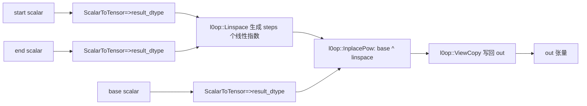
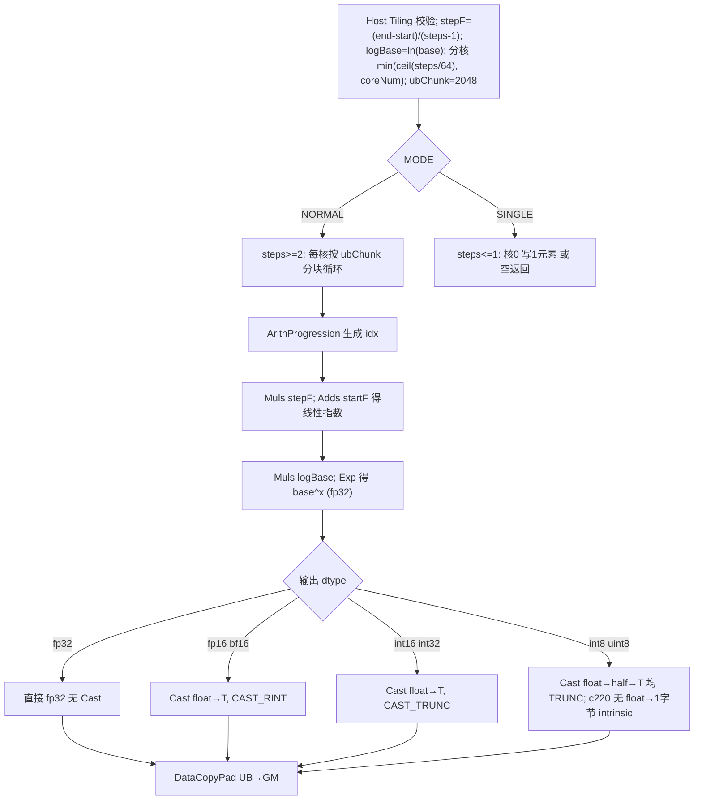

# 【社区任务】LogSpace 算子设计文档

> 任务：使 `aclnnLogSpace` 输出在原 FLOAT/FLOAT16/BFLOAT16 基础上新增 **INT8 / INT16 / INT32 / UINT8**，
> 适配 Atlas A2/A3，性能不劣于原 fp32，验收通过后合入
> <https://gitcode.com/cann/ops-math/tree/master/experimental/math>。

---

## 一、需求背景

### 1.1 需求来源

通过社区任务完成开源仓算子贡献。当前 `aclnnLogSpace` 仅支持浮点输出（FLOAT/FLOAT16/BFLOAT16），
不支持整型。需在既有 Ascend C 代码上再开发，新增 INT8/INT16/INT32/UINT8 输出并适配 Atlas A2/A3。

### 1.2 背景介绍

#### 1.2.1 LogSpace 实现优化（参考实现路径）

LogSpace 为 **aclnn 原生算子，无历史 TBE 版本**。参考实现取自开源仓内既有代码（按 CheckList，无 TBE 时附
baseline aclnn / 小算子源码路径）：

| 内容 | 路径 |
| --- | --- |
| 原 aclnnLogSpace 入口（baseline，拼接） | `math/logspace/op_api/aclnn_logspace.cpp` |
| baseline 拼接管线 | `l0op::Linspace`(`math/lin_space/`) → `l0op::InplacePow`(`math/pow/`) → `l0op::ViewCopy` |
| 既有融合实现（本次扩展对象） | `experimental/math/log_space/{op_host,op_kernel,op_api}/` |
| 整型 Cast 中转先例 | `math/lin_space/op_kernel/lin_space_need_cast.h`（int8/uint8/int16 经 half 中转） |

计算语义：`out[i] = base^(start + i·(end−start)/(steps−1))`，`i ∈ [0, steps)`。

#### 1.2.2 现状分析

##### 1.2.2.1 baseline 支持的数据类型和数据格式

| 参数 | 类型 | baseline 支持 dtype | 格式 |
| --- | --- | --- | --- |
| start / end | aclScalar* | FLOAT / FLOAT16 / BFLOAT16 / DOUBLE | ND |
| steps | int64_t | int64 | - |
| base | double | double | - |
| out | aclTensor* | **FLOAT / FLOAT16 / BFLOAT16**（无整型） | ND |

##### 1.2.2.2 baseline 实现描述（拼接管线）

原 `aclnnLogSpace`（`math/logspace`）为**小算子拼接**：①`ScalarToTensor` 把 start/end/base 转成 `result_dtype`
张量 → ②`l0op::Linspace` 生成 steps 个线性指数 → ③`l0op::InplacePow(base, linspace)` 求 `base^指数` →
④`l0op::ViewCopy` 写回 out。共 3 个 kernel + 中间张量。

> 该路径**先把指数转成 result_dtype 再算 linspace**：若 result_dtype 为整型，指数会被提前截断（如 0.5→0），
> `base^0` 语义错误。故 baseline 不适合直接出整型——这正是本任务需在融合算子上扩展整型的原因。

##### 1.2.2.3 baseline 实现流程图 ⭐



---

## 二、需求分析

额外支持 INT8 / INT16 / INT32 / UINT8 输出，性能不劣于 fp32；并适配 Atlas A2/A3。

### 2.1 外部组件依赖

不涉及外部组件适配。

### 2.2 内部适配模块

aclnn 接口（两段式 `aclnnLogSpaceGetWorkspaceSize` + `aclnnLogSpace`）。

### 2.3 需求模块设计

#### 2.3.1 AscendC 算子原型

| 参数名 | 输入/输出/属性 | 描述 | 数据类型 | 数据格式 | 维度(shape) | 非连续 |
| --- | --- | --- | --- | --- | --- | --- |
| start (aclScalar*) | 输入 | 对数序列起始指数 | FLOAT/FLOAT16/BFLOAT16/DOUBLE + INT8/INT16/INT32/UINT8 | ND | 标量 | √ |
| end (aclScalar*) | 输入 | 对数序列结束指数 | FLOAT/FLOAT16/BFLOAT16/DOUBLE + INT8/INT16/INT32/UINT8 | ND | 标量 | √ |
| steps (int64_t) | 输入 | 序列元素数量 | int64 | - | - | - |
| base (double) | 输入 | 对数空间底数 | double | - | - | - |
| out (aclTensor*) | 输出 | 对数间隔序列 | **FLOAT/FLOAT16/BFLOAT16 + INT8/INT16/INT32/UINT8** | ND | 1-D[steps]（见 3.4） | √ |

> 按任务书要求，**out 新增 INT8/INT16/INT32/UINT8**，且 **start/end 输入标量同步支持 INT8/INT16/INT32/UINT8**
> （标量统一以 `aclScalar::ToFloat()` 读为 float 参与计算，与浮点标量等价）；steps/base 不变。

#### 2.3.2 AscendC 算子相关约束

- 相比 baseline **新增整型输出（out: INT8/INT16/INT32/UINT8），并让 start/end 输入标量同步支持
  INT8/INT16/INT32/UINT8**，无功能缺失；浮点路径与原实现等价。
- 整型采用「全程 fp32 计算 `base^x`，末步 Cast 落整型」，向零取整（与 torch `.to(int)` 一致）。
- start/end 整型标量仅作为**指数数值**参与计算（如 int8 值 3 表示指数 3），内部经 `aclScalar::ToFloat()`
  统一转 float，与同值浮点标量结果完全一致；故新增整型输入不引入新计算路径，只放开 L2 入参 dtype 校验。

---

## 三、需求详细设计

### 3.1 使能方式

| 上层框架 | 勾选 |
| --- | --- |
| TF 训练/推理 | |
| PyTorch 训练/推理 | |
| ATC 推理 | |
| **Aclnn 直调** | ✔ |
| OPAT 调优 | |
| SGAT 子图切分 | |

### 3.2 需求总体设计

本算子为**独立融合算子**（无输入 tensor，start/end/steps/base 以 attr 传入），单 kernel 完成
`生成线性指数 → base^x → 落型`，避免 baseline 的 3-kernel 拼接与中间张量。

#### 3.2.1 host 侧设计

##### 3.2.1.1 分核策略

满核 + 行间独立（逐元素无依赖、无 barrier）：`maxCores = ceil(steps / MIN_PER_CORE)`（`MIN_PER_CORE=64`），
`useCores = min(maxCores, coreNum)`；`tileLen = steps / useCores`，余量并入尾核 `tailTileLen`。
host 侧只见元素总数 `steps`，不涉及维度信息。

##### 3.2.1.2 数据分块和内存优化策略

单次粒度 `UB_CHUNK_ELEMS = 2048`（fp32 元素数），核内循环分块。UB 占用（输出队列双缓冲）：

```
idxBuf_   : 2048 * 4B (fp32)                 = 8 KB
valBuf_   : 2048 * 4B (fp32)                 = 8 KB
outQueue_ : 2(double buffer) * 2048 * sizeof(T)
            fp32 16KB / int8 4KB / int16 8KB / int32 16KB
合计 ≤ 32 KB ≪ 192 KB（UB 上限）；tensor 数 3 ≤ 8
```

整型路径 UB 占用 ≤ fp32 路径（输出更窄），int8/uint8 借 `idxBuf_` 复用为 half 中转区，无额外内存。

##### 3.2.1.3 tilingKey 规划策略

二维模板键 `(D_T_Y, MODE)`：

- `D_T_Y`：输出 dtype，7 档（fp32/fp16/bf16/int8/int16/int32/uint8），由 `ASCENDC_TPL_OUTPUT(0)` 自动取。
- `MODE`：`0=NORMAL(steps≥2)` / `1=SINGLE(steps≤1)`。

共 **7×2=14** 键，`ASCENDC_TPL_SEL_PARAM(context, dTypeY, mode)` 下发。tiling 数值逻辑（stepF/logBase/分核）
与 dtype 无关。

> 数据检测：steps<0 / steps>UINT32_MAX / base≤0 在 tiling 直接 `OP_LOGE` 返回失败；steps==0 短路返回空 tensor。

#### 3.2.2 kernel 侧设计

##### 3.2.2.1 kernel 侧实现描述

`Init`（解析 tiling、按 blockIdx 取本核区间、InitBuffer）+ `Process`：

- **NORMAL**：分块循环 `ComputeChunk`：`ArithProgression(idx)` → `Muls(*stepF)`→`Adds(+startF)`（线性指数）
  → `Muls(*logBase)`→`Exp`（得 `base^x`，fp32）→ **末步落输出 dtype** → `DataCopyPad(UB→GM)`。
- **SINGLE**：核 0 `Duplicate(start·logBase)`→`Exp`→落型→写 1 元素（steps==1）；steps==0 空返回。

**末步落输出 dtype（关键设计点，编译期 `if constexpr` 选择）**：

| 输出 dtype | 落型路径 | RoundMode | 依据 |
| --- | --- | --- | --- |
| fp32 | 直接 fp32 计算输出 | - | 无精度转换 |
| fp16 / bf16 | `float → T` 直接 Cast | `CAST_RINT` | IEEE 就近，PyTorch 默认浮点舍入 |
| int16 / int32 | `float → T` 直接 Cast | `CAST_TRUNC` | c220 有 `float→int16/int32` intrinsic；向零取整对齐 torch |
| int8 / uint8 | `float --TRUNC--> half --TRUNC--> T` | 两步 `CAST_TRUNC` | **c220 无 `float→1字节` 直接 intrinsic**，借 half 中转（lin_space 同款）；half 对 ≤255 整数精确，两次向零截断 == 一次 |

> 性能优先**保留 Exp**（`exp(x·ln base)`），不使用高阶 `Power`（需 tmp buffer、更慢）。

##### 3.2.2.2 AscendC 实现流程图 ⭐



##### 3.2.2.3 AscendC 流程图与 baseline 流程图的差异点和原因 ⭐

| # | 差异点 | 原因 |
| --- | --- | --- |
| 1 | **单 kernel 融合** vs baseline **3-kernel 拼接**（Linspace→Pow→ViewCopy + 中间张量） | 省 kernel 下发与 HBM 往返 → 全 shape 快 1.6×~3.7×（见五）|
| 2 | 全程 **fp32** 算 `base^x`，**末步才 Cast** 落输出 dtype | baseline 先把指数转 result_dtype 再算（整型会截断指数→语义错）；本算子末步落型，整型语义正确 |
| 3 | 整型新增分支：int16/int32 直接 `float→T`(TRUNC)；int8/uint8 经 `float→half→T` | c220 无 `float→1字节` intrinsic；向零取整对齐 torch |
| 4 | `Exp(x·ln base)` 求幂 vs baseline `Pow` | Exp 性能更优；精度同为 fp32 档位 |
| 5 | arch 由 baseline 多档 → 本算子 `AddConfig(ascend910b)+AddConfig(ascend910_93)`，L0 gate `==DAV_2201` | 适配任务书目标硬件 Atlas A2/A3 |

### 3.3 支持硬件

| 支持的芯片版本 | 是否支持 |
| --- | --- |
| Atlas A2 训练系列产品（ascend910b, DAV_2201） | 支持 |
| Atlas A3 系列产品（ascend910_93, DAV_2201） | 支持 |
| 香橙派 OrangePi AIpro | 不支持 |

### 3.4 算子约束限制

- **输出维度**：logspace 数学上为一维序列，输出建模为 1-D `[steps]`。任务书参数表所列 out 维度 "2-8" 为通用
  模板项；如需接收多维输出张量（`numel==steps`，连续 ND），放开 aclnn 的 shape 维度校验即可（kernel 按
  `steps` 个连续元素写出，与 out 维度无关），不影响 kernel。
- **整型溢出**：AscendC `Cast` 对整型溢出按**饱和**处理（与 numpy/torch 回绕不同）→ 合法输入应使 `base^x` 落在
  输出 dtype 范围内（int8∈[-128,127] / uint8∈[0,255] 等）。
- **uint8**：要求 `base^x ≥ 0`（base>0 时恒成立）。
- 约束：`base > 0`，`0 ≤ steps ≤ UINT32_MAX`。

---

## 四、特性交叉分析

验收按泛化数据测，自测覆盖下列叉乘：

| 维度 | 取值 |
| --- | --- |
| 输入标量 dtype (start/end) | fp32 / fp16 / bf16 / **int8 / int16 / int32 / uint8**（+ double）|
| 输出 dtype | fp32 / fp16 / bf16 / **int8 / int16 / int32 / uint8** |
| shape(steps) | 小(8/13/15/16/21/33/41) · 大(1000/2000/4096/8192) · 超大(1e6) · 超超大(**10M / 100M**) · 边界(steps=1 SINGLE / steps=0 空) |
| base | 2 / 10 |
| start,end | 正 / 负 / 跨零 / 递减 |

整型用**精确（默认相对 1e-4）**比对，浮点用 AscendOpTest 默认阈值；详见五。

---

## 五、可维可测分析

### 5.1 精度标准 / 性能标准（910b 实机实测）

测试工具：官方 **AscendOpTest**（单算子 aclnn 真实路径，非自造脚本）。golden = `torch.logspace(...,fp32)`
按输出 dtype 落型（整型 numpy 向零截断，与算子 CAST_TRUNC 同语义）。判据 = **AscendOpTest 默认阈值**
（`AccuracyConfig.default_acc`：int32 相对 1e-4 / fp32 1e-4 / fp16 1e-3 / bf16 4e-3 / int8·int16·uint8 绝对 1）。

**精度：29 / 29 全 PASS**（默认阈值）：≤1e6 共 20 例（7 dtype × 小/大/超大 + steps=1/0 边界）+ 超大补充 9 例
（10M：fp32/fp16/bf16/int32/int8/uint8；100M：fp32/fp16/int32）。

**输入标量 dtype：21 / 21 全 PASS**——start/end ∈ {fp32,fp16,bf16,**int8,int16,int32,uint8**,double} × out dtype
矩阵（aclnn 两段式真实路径，链接 vendor `libcust_opapi`）；int/fp16/bf16/double 标量经 `aclScalar::ToFloat()` 读为
float，与同值 fp32 标量结果完全一致（整型标量按整数取值，不引入新计算路径）。

**性能：custom int vs 原 aclnnLogSpace fp32（拼接 baseline），全 shape 扫描（µs/call，越小越快）**：

| steps | 量级 | baseline fp32 | custom fp32 | int32 | int16 | int8 | uint8 | int÷baseline |
| --- | --- | --- | --- | --- | --- | --- | --- | --- |
| 8 | 小 | 11.79 | 6.12 | 6.18 | 6.10 | 5.96 | 5.69 | 1.8–2.1× |
| 41 | 小 | 10.36 | 5.63 | 5.70 | 5.65 | 5.61 | 5.55 | 1.8–1.9× |
| 1024 | 中 | 9.35 | 5.68 | 5.71 | 5.69 | 5.56 | 5.55 | 1.6–1.7× |
| 4096 | 大 | 9.69 | 5.61 | 5.66 | 5.68 | 5.53 | 5.62 | 1.7× |
| 16384 | 大 | 10.69 | 5.59 | 5.67 | 5.54 | 5.63 | 5.60 | 1.9× |
| 65536 | 大 | 14.02 | 5.62 | 5.59 | 5.58 | 5.61 | 5.63 | 2.5× |
| 262144 | 超大 | 25.06 | 7.32 | 6.82 | 6.86 | 6.88 | 6.90 | 3.6–3.7× |
| 1000000 | 超大 | 46.10 | 15.40 | 13.12 | 13.29 | 13.33 | 13.38 | 3.4–3.6× |
| 10000000 | 超大(10M) | 294.4 | 114.2 | 89.1 | 90.9 | 91.8 | 91.9 | 3.2–3.3× |
| 100000000 | 超大(100M) | 3031.1 | 1175.9 | 847.3 | 865.2 | 873.6 | 873.8 | 3.5–3.6× |

**结论：全部 shape 下新增 int dtype 均比原 fp32 baseline 快 1.6×~3.7×（最差 1.64×），远高于 ≥0.95× 门槛。**
小/中 shape 受 dispatch 约束（单 kernel vs 3-kernel）；超大转计算约束差距拉大。

**精度补充（int32 的 fp32 精度档位）**：全程 fp32 `exp` 在整数边界有 ~1 ULP 误差，与高精度参考个别点截断差 1，
**相对误差极小（如值 32768 处 3e-5）落在 int32 默认 1e-4 内** → 默认阈值通过；这是 fp32 logspace 的固有精度
档位（baseline 若支持 int32 亦同档），非实现缺陷。

### 5.2 兼容性分析

新增 dtype + 适配 A2/A3，向后兼容：既有 fp32/fp16/bf16 路径不回退（dtype 列表为追加）；接口签名
`aclnnLogSpace(start, end, steps, base, result, …)` 不变。
