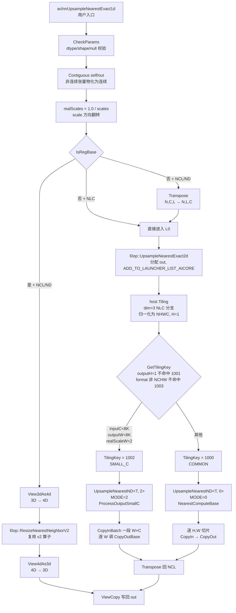
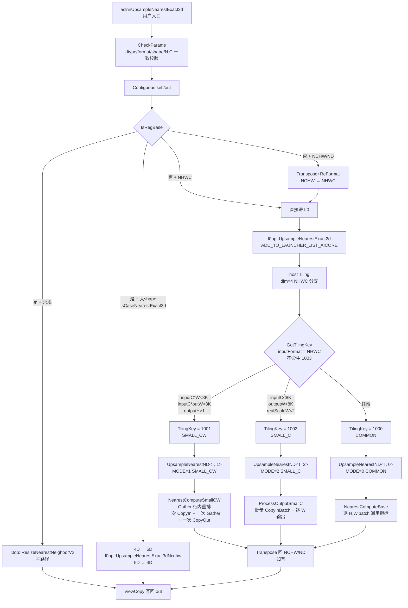
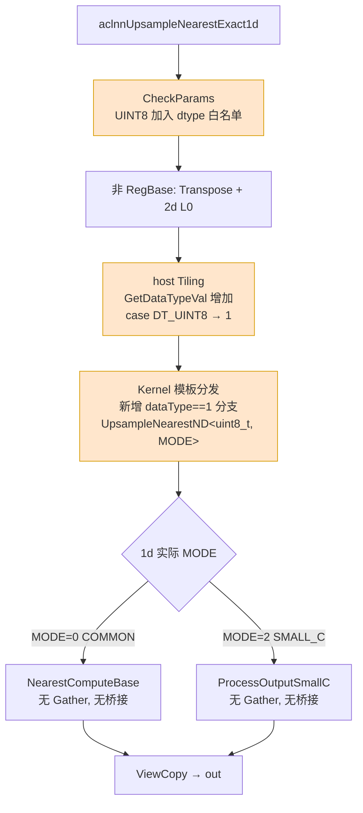
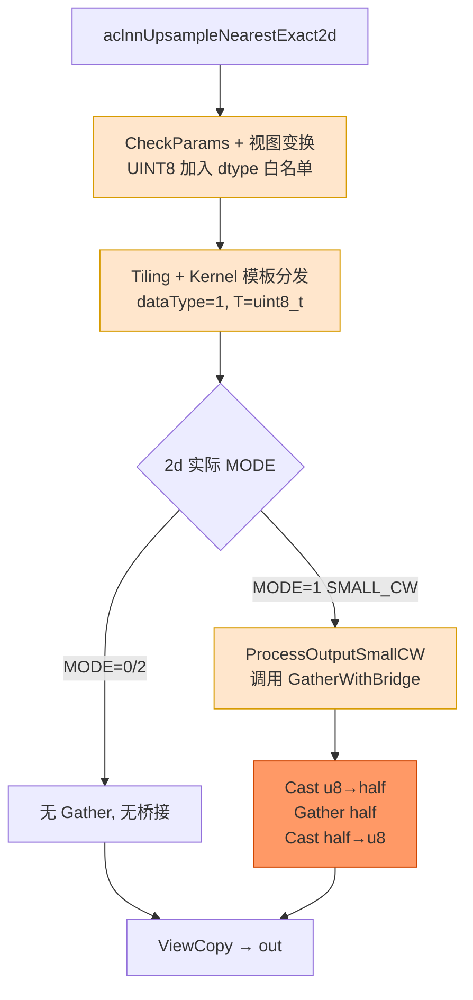

# 需求背景（required）

## 需求来源

aclnnUpsampleNearestExact1d/aclnnUpsampleNearestExact2d算子不支持uint8数据类型，需要在原来的代码上进行再开发，使其支持uint8数据类型。

- 开源仓地址：[https://gitcode.com/cann/ops-cv](https://gitcode.com/cann/ops-cv)
- 算子目录：`image/upsample_nearest`
- 适配硬件：Atlas A2 训练系列产品/Atlas A3 系列产品
- 开发语言：Ascend C

## 背景介绍

### 算子现状分析

当前 `aclnnUpsampleNearestExact1d` / `aclnnUpsampleNearestExact2d` 基于 Ascend C 实现，底层为同一个 `UpsampleNearest` 算子（`op_kernel/upsample_nearest.cpp`），通过 aclnn 层的视图变换（NCL→NCHW、NCHW↔NHWC、转置）复用同一套 kernel/tiling 逻辑。

当前已支持的数据类型如下：

| 参数 | 参数含义 | 支持数据类型 | 数据格式 | 维度 |
| --- | --- | --- | --- | --- |
| self/x | 输入 tensor | FLOAT32、FLOAT16、BFLOAT16 | NCL、ND（1d）；NCHW、NHWC、ND（2d） | 3（1d）/ 4（2d） |
| out/y | 输出 tensor | FLOAT32、FLOAT16、BFLOAT16 | 同输入 | 同输入 |

- 属性：`output_size`（必选，ListInt）、`scales_h`/`scales_w`（可选，float）、`exact_mode`（可选，bool）。
- 计算语义：最近邻（nearest / nearest-exact）插值上采样，**输出元素是对输入元素的拷贝**，不涉及对元素值的算术运算。

**算子整体调用链路**：本次方案不改变 aclnn 层、L0 包装层、Tiling 层与各链路分发，仅在底层 `UpsampleNearest` kernel 的 MODE=1/3 路径上对 UINT8 接入 Cast 桥接。

下图一是 1d 接口的完整调用路径，下图二是 2d 接口的完整调用路径，两张图都向下延伸到了 kernel 内部的 MODE 分发。

**图一：aclnnUpsampleNearestExact1d 流程图*

> **1d 不可达的 kernel MODE**：MODE=1（SMALL_CW）要求 `outputH > 1`，1d 归一化后 H=1；MODE=3（SMALL_NCH）要求 `inputFormat == NCHW`，1d 走 NLC/ND 路径。因此 1d 经 aclnn 入口只能命中 MODE=0/2。

**图二：aclnnUpsampleNearestExact2d 流程图**

> **2d 不可达的 kernel MODE**：MODE=3（SMALL_NCH，NCHW 直入路径）经 aclnn 入口不可达——NCHW 输入会被 Transpose+ReFormat 改为 NHWC 再进 kernel。MODE=3 保留给图模式或直调 kernel 等其它入口使用。

### 现状问题

`aclnnUpsampleNearestExact1d` / `aclnnUpsampleNearestExact2d` 不支持 UINT8 数据类型。在图像类业务（如分割掩码、调色板图、量化前的 8bit 图像）中，UINT8 上采样是常见诉求，缺失该类型会导致业务侧需先 Cast 到 FP16/FP32 再上采样，增加额外的搬运与转换开销。

# 需求分析（required）

## 需求描述

在不破坏既有 FLOAT32/FLOAT16/BFLOAT16 功能与性能的前提下，使用 Ascend C 在 `image/upsample_nearest` 目录新增对 **UINT8** 数据类型的支持，覆盖 `aclnnUpsampleNearestExact1d` 与 `aclnnUpsampleNearestExact2d` 两个接口，并同步更新算子文档（README、aclnn 接口文档）。

## 需求拆解

1. **aclnn 入口校验**：在两个 aclnn 接口的 dtype 支持列表中加入 UINT8。
2. **算子原型**：在 `op_def` 中为 Atlas A2/A3（ascend910b / ascend910_93）增加 UINT8 的输入/输出 DataType 与 Format 组合。
3. **Tiling**：使 `GetDataTypeVal()` 能识别 UINT8（按 1 字节返回），分核/切分逻辑自然适配 1 字节元素。
4. **Kernel（核心）**：解决 `Gather` 在 A2/A3 不支持 b8 的硬件约束。本方案采用 **Cast 桥接**：UINT8 → half → Gather → half → UINT8。
5. **二进制配置**：在 ascend910b / ascend910_93 的 `*_binary.json` 中新增 UINT8 编译条目。
6. **泛化**：满足各类合法输入场景（常规/边界），验收以泛化数据为准。
7. **文档**：README、aclnn 文档补充 UINT8 支持说明；提供 UINT8 aclnn 调用样例与 UT 测试用例。
8. **性能**：UINT8 相对 FP16 性能劣化控制在 5% 之内。
9. **精度**：满足 AscendOpTest 工具默认阈值。

# 详细设计（required）

## 算子分析

### 数学公式

最近邻插值（与既有类型完全一致，仅元素 dtype 不同）：

- exact 模式（nearest-exact）：

$$
h_{src} = min(floor((h_{dst} + 0.5) \cdot scalesH),\ H - 1)
$$

$$
w_{src} = min(floor((w_{dst} + 0.5) \cdot scalesW),\ W - 1)
$$

- 普通模式（nearest）：

$$
h_{src} = min(floor(h_{dst} \cdot scalesH),\ H - 1),\quad w_{src} = min(floor(w_{dst} \cdot scalesW),\ W - 1)
$$

- 取值（拷贝）：

$$
out(N, C, h_{dst}, w_{dst}) = self(N, C, h_{src}, w_{src})
$$

1d 接口将 L 维视作 W 维（H=1）处理，公式同上。

### 支持数据类型

FLOAT32、FLOAT16、BFLOAT16、UINT8。

- UINT8 仅在 Atlas A2 训练系列产品/Atlas A2 推理系列产品、Atlas A3 训练系列产品/Atlas A3 推理系列产品 上支持。
- 310P / Kirin 系列保持原状（不新增 UINT8）。

### 支持形状

- 1d：(N, C, L)，3 维，NCL / ND。
- 2d：(N, C, H, W)，4 维，NCHW / NHWC / ND。
- 输入、输出 tensor 元素个数不超过 int32_t 最大值。
- 不支持空 Tensor（1d）；2d 接口空 Tensor 走 workspaceSize=0 的快速返回分支。

## 算子实现

### 实现方案

UINT8 的最近邻上采样与现有浮点类型走**相同的算法主链**，本方案采用 **MODE=1/3 的 Gather 路径上对 UINT8 采用 half 桥接**，即在 Gather 前后插入一对 Cast。

**核心原理**：

- `Gather` API 在 Atlas A2/A3 不支持 b8（uint8_t），但支持 half。
- half 的整数精度上限为 $2^{11} = 2048$，远大于 UINT8 值域 [0, 255]，因此 `uint8 → half → uint8` 是**比特级无损**变换。
- 在 Gather 前后插入 `Cast(uint8→half)` 与 `Cast(half→uint8)`，把 b8 的 Gather 转换为 half 的 Gather，硬件即可正确执行。

#### host 侧设计

**1. 算子原型（upsample_nearest_def.cpp）**

为主 AICore 配置（ascend910b、ascend910_93）的输入 `x`、输出 `y` 的 dtype 列表中追加 `ge::DT_UINT8`，并相应追加 `ge::FORMAT_ND`。config310p（ascend310p / kirinx90 / kirin9030）保持 `{FLOAT16, FLOAT}` 不变。

**2. Tiling（upsample_nearest_tiling.cpp）**

`tilingData.dataType` 字段语义为"元素字节数"（FLOAT=4、FLOAT16/BF16=2）。在 `GetDataTypeVal()` 的 switch 中新增 `case ge::DT_UINT8` 分支，返回 1。

**3. 二进制配置**

在 `op_host/config/ascend910b/upsample_nearest_binary.json`、`.../ascend910_93/upsample_nearest_binary.json` 中各新增一条 UINT8（`dtype: "uint8"`, `format: "ND"`）编译条目。

#### kernel 侧设计

**1. 模板实例化（upsample_nearest.cpp）**

非 310P 分支（910b/910_93 走 `upsample_nearest.h`）下，为 4 个 TilingKey（1000/1001/1002/1003）的 if/else 分发块中各新增 `dataType == 1` 的实例化分支，构造 `UpsampleNearestND<uint8_t, MODE>` 并调用 `Init/Process`，与原 `half` / `float` 分支并列。

**2. Cast 桥接核心（upsample_nearest.h）**

新增模板成员函数 `GatherWithBridge(dst, src, offset, count)`，函数体内用 `if constexpr (std::is_same_v<T, uint8_t>)` 做编译期分发。

`ProcessOutputSmallCW`（MODE=1）和 `NearestComputeSmallNCH`（MODE=3）中原本对 `Gather(...)` 的调用统一替换为 `GatherWithBridge(...)`，其余流水线保持不变。

### 算子实现流程图（UINT8 修改点）

下两张图把"图一/图二"的链路结构精简到与 UINT8 改动相关的关键节点上，并把新增/修改位置用橙色高亮（深橙为本次新增逻辑，浅橙为本次扩展点）。

**图三：aclnnUpsampleNearestExact1d UINT8 增加流程图**

**图四：aclnnUpsampleNearestExact2d UINT8 增加流程图**

## 支持硬件

| 支持的芯片版本 | 是否勾选 | UINT8 |
| --- | --- | --- |
| Atlas A2 训练系列产品/Atlas A2 推理系列产品（ascend910b） | √ | √ |
| Atlas A3 训练系列产品/Atlas A3 推理系列产品（ascend910_93） | √ | √ |
| Atlas 推理系列产品（ascend310p） | √ | ×（不在本任务范围） |
| Kirin X90 / Kirin 9030 | √ | × |

## 算子约束限制

1. 输入、输出 tensor 元素个数不超过 int32_t 最大值。
2. 不支持空 Tensor（1d 接口）。
3. 输出 dtype/format 须与输入一致。
4. **UINT8 不在 310P / Kirin 上支持**：310P 走 `upsample_nearest_310p.h`，其 `ComputeNearest` 使用 `Duplicate`/`Add`/`SetAtomicAdd<T>` 等**算术与原子累加**指令完成清零累加，这些指令不支持 b8(UINT8) 类型；且本任务适配硬件为 Atlas A2/A3，故 310P/Kirin 保持原 `{FLOAT16, FLOAT}` 不变。
5. UINT8 取值范围 [0, 255]，最近邻为纯拷贝，不存在溢出/截断。
6. **Atlas A2/A3 上 Gather API 不支持 b8**：本方案通过 Cast(uint8→half) 桥接，将 Gather 在 half 域执行后回 Cast 到 uint8。half 整数精度上限 2048 远大于 255，桥接过程零误差。

## 兼容性分析

- 对既有 FLOAT32/FLOAT16/BFLOAT16 功能与性能**无影响**：
  - `GatherWithBridge` 中 `if constexpr (std::is_same_v<T, uint8_t>)` 分支在 fp16/fp32 编译期消除，直接降为原 `Gather` 调用，无任何运行时开销
  - `GatherElemSize<T>()` 对 fp16/fp32 返回 `sizeof(T)`，offset 计算与原代码完全一致
  - 仅 `T == uint8_t` 时编译期才把桥接分支编译进 kernel
- 仅新增 UINT8 能力，属于能力增强，无接口/ABI 破坏。

## 精度标准/性能标准

| 验收标准 | 描述(不涉及说明原因) | 标准来源 |
| --- | --- | --- |
| 精度标准 | 满足AscendOpTest默认值 |  |
| 性能标准 | 对比fp16数据类型性能相比，劣化5%之内 |  |