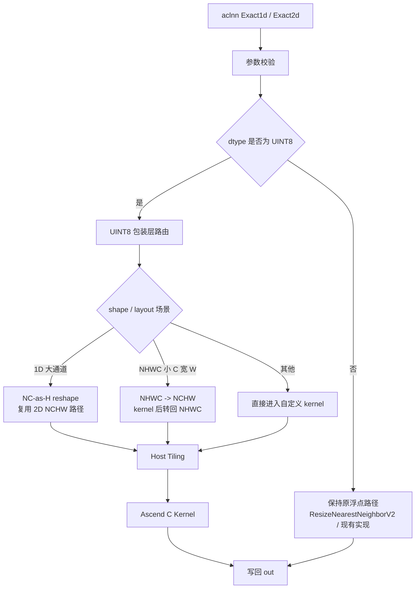
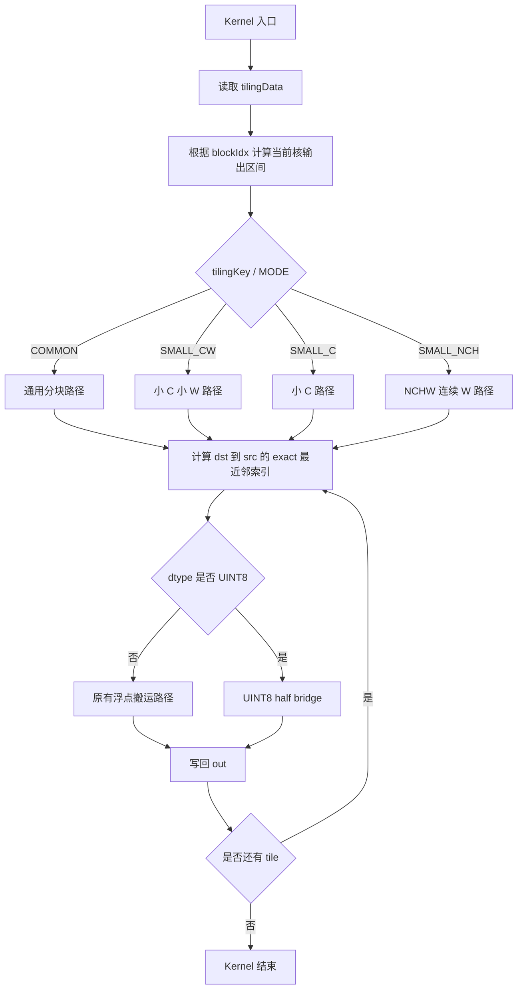

# UpsampleNearestExact1d / UpsampleNearestExact2d UINT8 算子设计文档

## 1. 需求来源

### 1.1 任务算子

本设计文档对应社区任务 `UpsampleNearestExact1d&UpsampleNearestExact2d`。任务目标是在 `ops-cv` 仓库 `image/upsample_nearest/` 目录内，对现有 `aclnnUpsampleNearestExact1d` 和 `aclnnUpsampleNearestExact2d` 算子进行 Ascend C 再开发，新增 `UINT8` 数据类型支持，并保证原有 `FLOAT32`、`FLOAT16`、`BFLOAT16` 场景不退化。

| 项目 | 内容 |
| --- | --- |
| 目标仓库 | `ops-cv` |
| 目标目录 | `image/upsample_nearest/` |
| 目标接口 | `aclnnUpsampleNearestExact1d`、`aclnnUpsampleNearestExact2d` |
| 新增能力 | `UINT8` 输入/输出支持 |
| 目标硬件 | Atlas A2 训练系列产品、Atlas A3 系列产品 |
| 开发语言 | Ascend C |

### 1.2 计算语义

`UpsampleNearestExact` 使用 nearest-exact 规则进行最近邻采样。对输出空间坐标，按半像素中心对齐计算源坐标：

```text
scale = input_size / output_size
src   = min(floor((dst + 0.5) * scale), input_size - 1)
```

1D 在 `L` 维采样：

```text
out[n, c, l_out] = self[n, c, src_l(l_out)]
```

2D 在 `H`、`W` 维分别采样：

```text
out[n, c, h_out, w_out] = self[n, c, src_h(h_out), src_w(w_out)]      # NCHW / ND
out[n, h_out, w_out, c] = self[n, src_h(h_out), src_w(w_out), c]      # NHWC
```

该算子本质是确定性索引搬运，不改变源元素数值。对于 `UINT8`，输出应与源元素逐字节一致。

### 1.3 参考文件

本任务基于 `ops-cv` 现有 `image/upsample_nearest/` 实现扩展，不新建独立算子目录。主要参考：

```text
image/upsample_nearest/op_host/op_api/aclnn_upsample_nearest_exact1d.cpp
image/upsample_nearest/op_host/op_api/aclnn_upsample_nearest_exact2d.cpp
image/upsample_nearest/op_host/upsample_nearest_tiling.cpp
image/upsample_nearest/op_kernel/upsample_nearest.cpp
image/upsample_nearest/op_kernel/upsample_nearest.h
```

非 `UINT8` 浮点路径继续复用现有 RegBase/L0 流程；`UINT8` 路径进入自定义 Ascend C kernel。

## 2. 背景介绍

最近邻上采样/下采样常用于图像预处理、检测/分割网络、特征金字塔以及 mask 缩放等场景。现有 `UpsampleNearestExact1d/2d` 已覆盖浮点数据类型，但量化图像、分割掩码、索引图和部分预处理链路常以 `UINT8` 保存。若接口不支持 `UINT8`，业务侧需要额外执行 `Cast` 到浮点、上采样、再 `Cast` 回 `UINT8`，会增加显存搬运和调度开销。

新增 `UINT8` 支持时需要重点处理三个问题：

1. `UINT8` 元素宽度为 1B，非 32B 对齐读写和小通道 NHWC 场景容易形成大量小块搬运。
2. Atlas A2/A3 的 `Gather` 通用类型列表不以 `uint8_t` 作为默认高效路径，不能直接假设 `Gather<uint8_t>` 可用于正式方案。
3. 1D 大通道和 2D NHWC 小通道宽行场景容易出现并行度不足，需要在 aclnn 包装层做 shape/layout 路由。

设计目标是在保持现有接口和目录结构的前提下，让 `UINT8` 与已有浮点类型共享最近邻索引语义，并通过 `half` 桥接和包装层路由满足泛化与性能要求。

## 3. 现有算子支持范围

### 3.1 数据类型和格式

任务完成后，接口支持范围如下：

| 算子 | 参数 | 数据类型 | 数据格式 | shape |
| --- | --- | --- | --- | --- |
| `aclnnUpsampleNearestExact1d` | `self` / `out` | `FLOAT32`、`FLOAT16`、`BFLOAT16`、`UINT8` | `NCL`、`ND` | 3 维 |
| `aclnnUpsampleNearestExact2d` | `self` / `out` | `FLOAT32`、`FLOAT16`、`BFLOAT16`、`UINT8` | `NCHW`、`NHWC`、`ND` | 4 维 |
| `outputSize` | 输入属性 | `INT64` | - | 1D size=1；2D size=2 |
| `scales` / `scalesH` / `scalesW` | 输入属性 | `double` | - | 标量 |

`out` 的数据类型和数据格式必须与 `self` 一致。1D 的 `ND` 按 `NCL` 处理；2D 的 `ND` 按 `NCHW` 处理。

### 3.2 Shape 约束

| 约束项 | 要求 |
| --- | --- |
| 维度 | 1D 输入输出为 3 维；2D 输入输出为 4 维 |
| 空 Tensor | 不支持 |
| `outputSize` | 每个空间维度大于 0 |
| `scales` | 不传负值 |
| 元素个数 | 输入、输出 Tensor 元素个数不超过 `int32_t` 最大值 |
| 非连续 Tensor | 支持，由 aclnn/op_api 层完成连续化或视图写回 |
| 确定性 | 纯索引搬运，无随机逻辑 |

## 4. 总体方案

整体方案分为 aclnn 包装层、Host Tiling 层和 Kernel 层三部分：



设计原则：

1. 不新增独立算子目录，所有修改限定在 `image/upsample_nearest/`。
2. 非 `UINT8` 浮点路径保持原逻辑，避免影响已有功能和性能。
3. `UINT8` 使用 `uint8 -> half -> Gather/GatherMask<half> -> uint8` 的桥接方案，规避 A2/A3 上直接 `Gather<uint8_t>` 的类型限制。
4. 对并行度不足的形状在 aclnn 包装层做等价 shape/layout 变换，使底层 kernel 处理更连续、更易多核切分的数据布局。

## 5. 外部组件依赖

| 组件 | 用途 |
| --- | --- |
| CANN 算子开发基础设施 | 算子编译、打包、安装和 aclnn 两段式调用 |
| `l0op::ResizeNearestNeighborV2` | 非 `UINT8` 浮点路径 |
| `l0op::Reshape` | 1D 大通道场景的等价 shape 路由 |
| `l0op::Transpose` / `l0op::ReFormat` | NHWC/NCHW 转换和格式归一 |
| Ascend C `DataCopyPad` / `Cast` / `GatherMask` | `UINT8` kernel 搬运和桥接计算 |

## 6. 内部适配模块

| 模块 | 设计职责 |
| --- | --- |
| `op_host/op_api/aclnn_upsample_nearest_exact1d.cpp` | 1D 参数校验、`UINT8` dtype 接入、1D 性能路由 |
| `op_host/op_api/aclnn_upsample_nearest_exact2d.cpp` | 2D 参数校验、`UINT8` dtype 接入、NHWC/NCHW 路由 |
| `op_host/upsample_nearest_tiling.cpp` | shape 解析、tilingKey 选择、元素字节宽度、分核参数生成 |
| `op_kernel/upsample_nearest.cpp` | 按 dtype 和 tilingKey 分发 kernel 模板 |
| `op_kernel/upsample_nearest.h` | 最近邻索引计算、UB 搬运、`UINT8` half bridge 实现 |
| `op_host/config/*/upsample_nearest_binary.json` | A2/A3 `UINT8` 二进制配置 |
| README / aclnn 接口文档 | 补充 `UINT8` 支持范围和使用说明 |

## 7. Ascend C 算子原型

### 7.1 aclnnUpsampleNearestExact1d 原型

| 参数名 | 输入/输出/属性 | 描述 | 使用说明 | 数据类型 | 数据格式 | 维度(shape) | 非连续 Tensor |
| --- | --- | --- | --- | --- | --- | --- | --- |
| self | 输入 | 待进行最近邻精确上采样的输入 Tensor | 不支持空 Tensor；当数据格式为 ND 时，默认按 NCL 格式处理 | FLOAT32、FLOAT16、BFLOAT16、UINT8 | NCL、ND | 3 | 支持 |
| outputSize | 属性 | 指定输出在 L 维度上的空间大小 | size 为 1，取值大于 0 | INT64 | - | - | - |
| scales | 属性 | 指定 L 方向空间大小的缩放乘数 | 不能传入负值；通常由 outputSize 推导实际 scale | double | - | - | - |
| out | 输出 | 最近邻精确上采样后的输出 Tensor | 不支持空 Tensor；shape 按 outputSize 计算；数据类型和数据格式需要与 self 一致 | FLOAT32、FLOAT16、BFLOAT16、UINT8 | NCL、ND | 3 | 支持 |

### 7.2 aclnnUpsampleNearestExact2d 原型

| 参数名 | 输入/输出/属性 | 描述 | 使用说明 | 数据类型 | 数据格式 | 维度(shape) | 非连续 Tensor |
| --- | --- | --- | --- | --- | --- | --- | --- |
| self | 输入 | 待进行最近邻精确上采样的输入 Tensor | 不支持空 Tensor；当数据格式为 ND 时，默认按 NCHW 格式处理 | FLOAT32、FLOAT16、BFLOAT16、UINT8 | NCHW、NHWC、ND | 4 | 支持 |
| outputSize | 属性 | 指定输出在 H、W 维度上的空间大小 | size 为 2，各维取值大于 0 | INT64 | - | - | - |
| scalesH | 属性 | 指定 H 方向空间大小的缩放乘数 | 不能传入负值；通常由 outputSize 推导实际 scale | double | - | - | - |
| scalesW | 属性 | 指定 W 方向空间大小的缩放乘数 | 不能传入负值；通常由 outputSize 推导实际 scale | double | - | - | - |
| out | 输出 | 最近邻精确上采样后的输出 Tensor | 不支持空 Tensor；shape 按 outputSize 计算；数据类型和数据格式需要与 self 一致 | FLOAT32、FLOAT16、BFLOAT16、UINT8 | NCHW、NHWC、ND | 4 | 支持 |

### 7.3 Kernel 实现入口

```cpp
template <typename T, uint8_t MODE>
__global__ __aicore__ void upsample_nearest(
    GM_ADDR self,
    GM_ADDR out,
    GM_ADDR workspace,
    GM_ADDR tiling);
```

`T` 按输入 dtype 分发为 `float`、`half`、`bfloat16_t`、`uint8_t`。`MODE` 由 tilingKey 决定，用于选择不同 shape/layout 下的搬运组织。

## 8. Ascend C 算子相关约束

1. `self` 与 `out` 的 dtype、format 必须一致。
2. 1D 支持 `NCL`、`ND`；2D 支持 `NCHW`、`NHWC`、`ND`。
3. `outputSize` 中每个空间维度必须大于 0。
4. `scales`、`scalesH`、`scalesW` 不传负值。
5. 输入、输出元素数不超过 `INT32_MAX`。
6. 不支持空 Tensor。
7. 非连续 Tensor 在 aclnn/op_api 层处理，kernel 按连续 GM 地址执行。
8. `UINT8` 路径要求 `tilingData.dataType` 按元素字节数设置为 1。
9. `uint8 -> half` 使用无损转换；`half -> uint8` 使用整数值保持的转换模式，保证最近邻搬运不改变源元素值。
10. 算子无随机行为，输出由输入值、shape、format、outputSize 和 scales 唯一决定。

## 9. 使用方式

用户按 aclnn 两段式接口调用。以 2D 为例：

```cpp
uint64_t workspaceSize = 0;
aclOpExecutor *executor = nullptr;

aclnnStatus ret = aclnnUpsampleNearestExact2dGetWorkspaceSize(
    self,
    outputSize,
    scalesH,
    scalesW,
    out,
    &workspaceSize,
    &executor);

void *workspace = nullptr;
if (workspaceSize > 0) {
    aclrtMalloc(&workspace, workspaceSize, ACL_MEM_MALLOC_HUGE_FIRST);
}

ret = aclnnUpsampleNearestExact2d(workspace, workspaceSize, executor, stream);
aclrtSynchronizeStream(stream);
```

## 10. Host 侧设计

### 10.1 参数检查

Host/op_api 层负责完成以下检查：

1. 检查输入输出 Tensor 描述、shape、`outputSize`、`workspaceSize`、`executor` 非空。
2. 检查 1D 输入输出为 3 维，2D 输入输出为 4 维。
3. 检查 dtype 在 `FLOAT32`、`FLOAT16`、`BFLOAT16`、`UINT8` 支持列表内。
4. 检查 `self` 与 `out` 的 dtype、format 一致。
5. 检查 `outputSize` 长度与取值合法。
6. 检查 `scales` 非负。
7. 检查输入输出元素数不超过 `INT32_MAX`。
8. 对非连续 Tensor 走连续化或视图写回流程。

### 10.2 dtype 接入

`UINT8` 的 Host 侧接入点如下：

| 接入位置 | 设计 |
| --- | --- |
| aclnn dtype 白名单 | 1D/2D 接口均加入 `UINT8` |
| op_def | A2/A3 配置加入 `DT_UINT8` 输入输出组合 |
| tiling 数据 | `GetDataTypeVal()` 对 `DT_UINT8` 返回 1 |
| binary 配置 | `ascend910b`、`ascend910_93` 增加 `uint8` 编译条目 |

### 10.3 tilingKey 规划

| tilingKey | 场景 | 设计目的 |
| --- | --- | --- |
| `1000` COMMON | 通用 shape | 覆盖默认行列分块路径 |
| `1001` SMALL_CW | 小 C、小 W | 降低小块搬运开销，提升 UB 复用 |
| `1002` SMALL_C | 小 C、W 维较小 | 减少跨步小搬运和重复读 |
| `1003` SMALL_NCH | NCHW 或 1D reshape 后的连续 W 场景 | 利用连续 W 行进行高效搬运 |

### 10.4 包装层性能路由

`UINT8` 路由规则：

| 场景 | 条件 | 路由 |
| --- | --- | --- |
| 1D 大通道 | `N*C` 较大，原 `[N,C,1,L]` 并行不足 | reshape 为 `[1,1,N*C,L]`，复用 2D NCHW 路径 |
| NHWC 小 C 宽 W | `0<C<32`、`outputH<=64`、`outputW>=4096` | NHWC 转 NCHW 执行，再转回 NHWC |
| 其他 `UINT8` | 不满足上述条件 | 直接进入自定义 kernel |

上述变换不改变最近邻 exact 语义，只改变底层执行时的数据布局或可切分维度。

## 11. Kernel 侧设计

### 11.1 总体流程



### 11.2 UINT8 half bridge

A2/A3 上不直接依赖 `Gather<uint8_t>`，而是使用 `half` 作为中间类型：

```text
GM uint8 -> UB uint8 -> Cast to half
half Gather / GatherMask by source index
half -> Cast to uint8
UB uint8 -> GM out
```

该方案成立的原因：

1. `UINT8` 值域为 `[0, 255]`，可被 `half` 精确表示。
2. 最近邻上采样只做索引搬运，不需要对元素做算术变换。
3. `Gather/GatherMask<half>` 是 A2/A3 上可用的搬运组织。
4. 非 32B 对齐搬运使用 `DataCopyPad` 处理尾块，避免越界读写。

### 11.3 UB Buffer 规划

`UINT8` 路径按输入块、中间 half 块和输出块规划 UB：

| Buffer | 类型 | 用途 |
| --- | --- | --- |
| `inU8` | `uint8_t` | 搬入源窗口或源行 |
| `tmpHalfIn` | `half` | `uint8` 转 half 后参与 Gather/GatherMask |
| `tmpHalfOut` | `half` | Gather/GatherMask 输出 |
| `outU8` | `uint8_t` | Cast 回 `uint8` 后写出 |
| offset / index | `int32_t` 或 tiling 计算值 | 保存或计算源索引 |

UB 使用需满足：

```text
Align32(inU8) + Align32(tmpHalfIn) + Align32(tmpHalfOut) + Align32(outU8) + branch_tmp <= UB 可用空间
```

尾块按实际有效元素数写回，保证不会写出目标 Tensor 边界。

### 11.4 各分支处理策略

| 分支 | 处理策略 |
| --- | --- |
| COMMON | 按输出空间分块，逐 tile 计算源坐标并搬运 |
| SMALL_CW | 针对小 C、小 W 增强 UB 复用，减少多次小搬运 |
| SMALL_C | 针对小通道场景压缩搬运组织，降低跨步开销 |
| SMALL_NCH | 针对 NCHW 连续 W 行批量处理，适合 1D 大通道 reshape 后路径 |

所有分支共享同一 nearest-exact 源索引公式，差异仅在搬运和分块组织。

## 12. 与现有实现的差异点

| 项 | 现有浮点路径 | 新增 UINT8 路径 |
| --- | --- | --- |
| dtype 支持 | `FLOAT32`、`FLOAT16`、`BFLOAT16` | 新增 `UINT8` |
| 算法语义 | nearest-exact 源索引搬运 | 完全一致 |
| 元素处理 | 浮点搬运 / L0 路径 | `uint8 -> half -> Gather/GatherMask -> uint8` |
| 性能优化 | 依赖现有浮点路径 | 对 1D 大通道、NHWC 小 C 宽 W 做包装层路由 |
| 非连续 Tensor | op_api 层处理 | 与浮点路径一致 |

新增逻辑只扩展 `UINT8`，不改变浮点类型的数学语义和接口行为。

## 13. 测试标准

### 13.1 功能与精度

测试用例需要覆盖常规场景、边界场景和泛化场景。`UINT8` 精度以 byte-exact 为标准，同时满足 AscendOpTest 默认阈值。

| 覆盖维度 | 说明 |
| --- | --- |
| dtype | `UINT8` 主测；`FLOAT32`、`FLOAT16`、`BFLOAT16` 回归 |
| 1D format | `NCL`、`ND` |
| 2D format | `NCHW`、`NHWC`、`ND` |
| shape | 上采样、下采样、恒等、非整除、非对称 H/W |
| 通道数 | 小 C、对齐 C、非对齐 C、大 C |
| 连续性 | 连续 Tensor、非连续 Tensor |
| tilingKey | COMMON、SMALL_CW、SMALL_C、SMALL_NCH |
| 异常输入 | dtype 不支持、format 不匹配、outputSize 非法、空 Tensor |

### 13.2 性能

任务书要求：`UINT8` 相对同 shape `FLOAT16` 性能劣化不超过 5%。性能测试应满足：

1. 同 shape、同 layout、同输出大小比较 `UINT8` 与 `FLOAT16`。
2. 同一设备、同一 harness、同一运行方式采集数据。
3. 覆盖 1D/2D、NCL/NCHW/NHWC/ND、小 shape、大 shape、非对齐 shape。
4. 单个小 shape 的 launch 抖动需结合多次重复运行判断，不以一次波动作为结论。

### 13.3 交付文档

交付时同步提供：

1. 算子工程代码和 README。
2. 多组 aclnn 调用测试代码。
3. 自验证报告，包含功能、精度、性能结果和复现方式。
4. 本设计文档评审记录。

## 14. 支持硬件

本设计面向任务书指定硬件：

| 硬件 | 编译目标 | 说明 |
| --- | --- | --- |
| Atlas A2 训练系列产品 | `ascend910b` | 支持 `UINT8` 新增路径 |
| Atlas A3 系列产品 | `ascend910_93` | 支持 `UINT8` 新增路径 |
