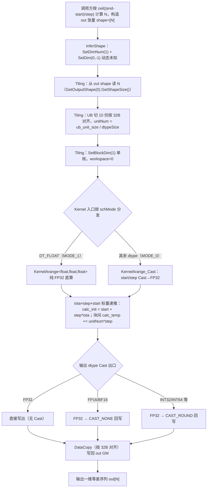
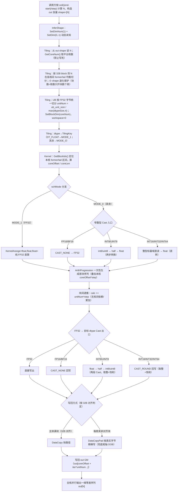

# 需求背景（required）

> 竞赛交付设计文档。算子 `Arange`（再开发 ops-math `experimental/math/arange` 已有 AscendC 算子，新增 INT8 / UINT8 / INT16 三类窄整型 + 补齐多核切分与全场景测试）。

## 需求来源

参考昇腾 CANN 内置 `aclnnArange` 算子（TBE/原型层算子名为 `Range`/`RangeD`，legacy 类别）的实现，在昇腾 NPU 上基于 Ascend C 编程语言实现**功能一致**的 `Arange` 算子，支持 float32、float16、bfloat16、int8、uint8、int16 六种数据类型，并满足全核场景性能不低于原 TBE int32。验收通过后提交至昇腾算子开源仓 **ops-math** 的 `experimental/math`。

- 语义对标：PyTorch `torch.arange` / 昇腾内置 `aclnnArange`，取整口径采用左闭右开的 `ceil`。
- 任务类型：**算子扩展**（基于已有开源 experimental 算子新增 dtype 支持 + 补多核 + 补测试，非从零新建）。
- 目标仓：ops-math（gitcode `cann/ops-math`，8.5.0 分支），最终 PR 至 `experimental/math/arange`。

## 背景介绍

### Arange 算子实现现状分析

`Arange` 是 ops-math `experimental/math/arange` 已有的手写 AscendC 等差序列生成类算子（自包含轻量工程，扁平 `op_host/` + `op_kernel/`，无 arch 子目录）。8.5.0 分支现状（已逐文件核对真实源码）：

- `op_host/`：`arange_def.cpp`（算子信息库，`OP_ADD(Arange)` 自动生成）、`arange_infershape.cpp`（InferShape）、`arange_tiling.cpp`（Tiling）。
- `op_kernel/`：核函数入口 `arange.cpp`（schMode 分发）+ 两个 Kernel 类头 `arange.h`（`KernelArange` 纯 FP32 直算 / `KernelArange_Cast` Cast 路径）+ `arange_tiling_data.h` + `arange_tiling_key.h`。
- aclnn L2 接口由工程 `add_all_modules_sources(OPTYPE arange ACLNNTYPE aclnn)` **自动生成**（无独立 `op_api/` 目录）。

现状能力与缺口：

| 维度 | 现状 | 本任务缺口 |
|------|------|-----------|
| 数据类型 | 原型注册 `{FLOAT, FLOAT16, BF16, INT32, INT64}` | **缺 int8 / uint8 / int16**（内置 Range 原型也无这三类窄整型） |
| 多核 | `SetBlockDim(1)` 写死单核，N 个元素全部串行 | **必须改动态多核切分**（否则全核性能不达标，红线项） |
| 取整口径 | README 写 `(end-start)/step+1`，example 用 `ceil((end-start)/step)`（不一致） | 统一为 `ceil`（左闭右开），纠正 README |
| 测试 | `tests/ut/` 仅占位，example 仅 1 组 INT32 | 全 dtype 功能/精度/性能/边界 ST + UT 从零补 |

### Arange 算子功能分析

- **功能**：从 `start` 起始、以 `step` 为步长、到 `end` 结束（**左闭右开**，不含 `end`），生成一维等差序列张量写入 `out`。功能与昇腾内置 `aclnnArange`、PyTorch `torch.arange` 一致。
- **类别**：Elementwise（一维等差序列生成；逐元素 `out[i]=start+i*step`，元素间无依赖）。
- **输入**：start、end、step，均为 Host 侧标量（aclScalar）。**输出**：out，一维 aclTensor。
- **现状支持数据类型**：float32、float16、bfloat16、int32、int64。
- **支持形状**：一维输出（连续 ND）；输出元素个数 N 由 start/end/step 数值决定。

### Arange 算子历史 AscendC 版本的整体流程图

Arange 算子历史 AscendC 版本（基线单核实现，`SetBlockDim(1)`）的整体流程如下图所示。该版本仅在 core0 串行生成全部 N 个元素，尚未满足"全核场景性能不低于 TBE int32"的要求，本任务即在此基础上改造为动态多核并新增窄整型支持。



---

# 需求分析（required）

## 需求描述

在已有 AscendC 算子 `Arange` 代码上再开发，使 `aclnnArange` 在 Atlas A2（910B）/ Atlas A3 上新增对 **INT8、UINT8、INT16** 三种数据类型的支持（start/end/step/out 四者同型），并保留现有 float32/float16/bfloat16（以及兼容保留 int32/int64）。同时将现有单核实现改造为**动态多核切分**以满足「全核场景性能不低于 TBE int32」要求，并实现**泛化功能**，满足各类合法输入场景，补充相应文档。

## 需求拆解

1. **扩展 3 种窄整型**：INT8（1B）、UINT8（1B，不可为负）、INT16（2B），统一经 FP32 中间域计算后 Cast 回目标整型。
2. **多核切分**：`SetBlockDim(1)` → 动态多核（按运行期 N + 平台核数切分），满足全核性能。
3. **精度**：按输出 dtype 分类匹配 AscendOpTest 工具默认阈值（社区标准）——浮点输出落各自 Threshold，整型输出与 CPU golden 数值完全相等。
4. **泛化覆盖**：升/降序、负 step、N=1、ceil 整除/非整除、窄整型满值域、跨 0、越界、大 N 全核、小 N 退化等场景全部正确。
5. **文档**：补充 aclnn 接口文档、README、自验证报告与本设计文档（按竞赛模板，须通过评审）。

## 需求规格与路径结论映射

| 需求规格 | 设计承接结论 |
|---|---|
| 新增 INT16(2B) | def 放开 + Cast 路径 `KernelArange_Cast<int16,…>` 宏注入实例化，FP32 中间域计算后 CAST_ROUND 回 int16 |
| 新增 INT8/UINT8(1B) | def 放开 + Cast 路径实例化；1B 出口经两段 Cast 保证取整/饱和正确；uint8 约束非负；尾轴非对齐用 DataCopyPad 兜底 OOB |
| 保留 FP32 / 半精度 | FP32 走纯 FP32 直算路径；FP16/BF16 走 Cast 路径（CAST_NONE 无损） |
| 全核性能 ≥ TBE int32 | `SetBlockDim(1)` → `GetCoreNum()` 动态多核（former/tail 均衡 + 小 shape 退化保护） |
| N 由 start/end/step 决定（数据依赖输出 shape） | 维持基线契约：N 由调用方按 `ceil((end-start)/step)` 算经 out 张量传入；InferShape 给 dim0=-1，Tiling 从 out shape 读 N；算子内部不读标量求 N |
| 精度（浮点 Threshold / 整型 bitwise） | 统一 FP32 中间域，整型出口 CAST_ROUND；窄整型值域内 FP32 精确表示，整型 bitwise 一致 |

---

# 详细设计（required）

## 算子分析

### 算子原型

**算子类型（OpType）**：`Arange`。本算子为 ops-math `experimental/math` 下的自包含轻量算子（扁平 `op_host/` + `op_kernel/`，无 arch 子目录）；aclnn L2 接口 `aclnnArange` 由工程配置 `add_all_modules_sources(OPTYPE arange ACLNNTYPE aclnn)` **自动生成**并路由到本算子（无独立 `op_api/` 目录），`OP_ADD(Arange)` 自动生成算子信息库。

**输入 / 输出 / 属性表**：

| 名称 | 输入输出属性 | 含义 | 数据类型 | 数据格式 | ParamType | 备注 |
|------|------------|------|---------|---------|-----------|------|
| start | 输入 | 等差序列起始值（左闭，含） | FLOAT、FLOAT16、BFLOAT16、**INT8**、**UINT8**、**INT16**、INT32、INT64 | ND | REQUIRED | Host 标量 `.Scalar()` |
| end | 输入 | 等差序列结束值（右开，不含） | FLOAT、FLOAT16、BFLOAT16、**INT8**、**UINT8**、**INT16**、INT32、INT64 | ND | REQUIRED | Host 标量 `.Scalar()` |
| step | 输入 | 步长（≠0） | FLOAT、FLOAT16、BFLOAT16、**INT8**、**UINT8**、**INT16**、INT32、INT64 | ND | REQUIRED | Host 标量 `.Scalar()` |
| out | 输出 | 一维等差序列输出张量 | FLOAT、FLOAT16、BFLOAT16、**INT8**、**UINT8**、**INT16**、INT32、INT64 | ND | REQUIRED | 1 维；N 由 start/end/step 计算（ceil，左闭右开） |

- **属性（Attr）**：本算子**无 Attr**。
- **数据类型说明**：本任务要求支持 6 类——**float32 / float16 / bfloat16 / int8 / uint8 / int16**（其中 **INT8 / UINT8 / INT16 为本任务新增**）；def 中额外保留基线已有的 **INT32 / INT64**，故共注册 **8 类**。四个 IO（start/end/step/out）的 dtype 列表严格同型，不做跨 dtype 推导。
- **AICore 配置**：def 同时注册 `ascend910b` + `ascend910_93` 两个 config。Atlas A2（Ascend910B）与 Atlas A3（Ascend910_93）同属 **arch22（DAV_2201，SIMD/MemBase）**，指令集与内存模型一致、架构等价；注册双 config 即生成并覆盖 A2 与 A3 两套二进制，对应支持硬件表中 Atlas A2/Atlas A3 双 √。

参照样式的 OpDef 伪代码（基于真实 `op_host/arange_def.cpp`，便于评审核对，加粗为本任务新增 3 类）：

```cpp
class Arange : public OpDef {
public:
    explicit Arange(const char* name) : OpDef(name) {
        this->Input("start")
            .ParamType(REQUIRED)
            .DataType({ge::DT_FLOAT, ge::DT_FLOAT16, ge::DT_BF16,
                       /* 新增 */ ge::DT_INT8, ge::DT_UINT8, ge::DT_INT16,
                       ge::DT_INT32, ge::DT_INT64})
            .Format({ge::FORMAT_ND, ge::FORMAT_ND, ge::FORMAT_ND, ge::FORMAT_ND,
                     ge::FORMAT_ND, ge::FORMAT_ND, ge::FORMAT_ND, ge::FORMAT_ND})
            .Scalar();
        this->Input("end")  /* 同 start：8 dtype，含新增 INT8/UINT8/INT16；ND；REQUIRED */ .Scalar();
        this->Input("step") /* 同 start：8 dtype，含新增 INT8/UINT8/INT16；ND；REQUIRED */ .Scalar();
        this->Output("out")
            .ParamType(REQUIRED)
            .DataType({ge::DT_FLOAT, ge::DT_FLOAT16, ge::DT_BF16,
                       /* 新增 */ ge::DT_INT8, ge::DT_UINT8, ge::DT_INT16,
                       ge::DT_INT32, ge::DT_INT64})
            .Format({ge::FORMAT_ND, ge::FORMAT_ND, ge::FORMAT_ND, ge::FORMAT_ND,
                     ge::FORMAT_ND, ge::FORMAT_ND, ge::FORMAT_ND, ge::FORMAT_ND});
        // 无 Attr
        // A2(ascend910b)/A3(ascend910_93) 同属 DAV_2201 架构等价，注册双 config 覆盖 A3 二进制。
        this->AICore().AddConfig("ascend910b").AddConfig("ascend910_93");
    }
};
OP_ADD(Arange); // 添加算子信息库
```

### 数学公式

序列元素：

$$ out_i = start + i \times step,\quad i = 0, 1, \dots, N-1 $$

输出元素个数（左闭右开，向上取整）：

$$ N = \left\lceil \frac{end - start}{step} \right\rceil $$

> 取整口径统一为 `ceil((end-start)/step)`（左闭右开），对齐内置 `aclnnArange` / PyTorch `arange`。校验：`start=1, end=-1113, step=-5` → `ceil((-1113-1)/-5)=ceil(222.8)=223`。`step<0` 时分子分母同负、结果为正，负 step 降序合法。

### 支持数据类型（start / end / step / out 四者同型）

| dtype | 字节宽 | A2(910B)/A3 现状 | 本任务 | 计算路径 |
|-------|------|----------------|--------|---------|
| FLOAT | 4B | ✅ 已支持 | 保持 | 纯 FP32 直算（无 Cast） |
| FLOAT16 | 2B | ✅ 已支持 | 保持 | Cast→FP32→CAST_NONE 回写 |
| BFLOAT16 | 2B | ✅ 已支持 | 保持 | Cast→FP32→CAST_NONE 回写 |
| **INT8** | 1B | ❌ | **新增** | Cast→FP32→CAST_ROUND 回写（饱和） |
| **UINT8** | 1B | ❌ | **新增** | 同上；输入非负约束 |
| **INT16** | 2B | ❌ | **新增** | Cast→FP32→CAST_ROUND 回写（饱和） |
| INT32 | 4B | ✅ 已支持 | 兼容保留 | Cast→FP32→CAST_ROUND 回写 |
| INT64 | 8B | ✅ 已支持 | 兼容保留 | Cast→FP32→CAST_ROUND 回写 |

- **任务必测集**：float32 / float16 / bfloat16 / int8 / uint8 / int16（前 6 类）。
- **兼容保留项**：int32 / int64（现有原型已注册，唯一 example 即 int32，零成本随多核改造一并覆盖；注意二者经 FP32 中间域，绝对值 >2^24 时存在精度损失，调用方应在该约束内使用）。
- 约束：start/end/step/out 四者 dtype 必须一致，不做跨 dtype 推导。

### 支持形状

- 输出 out 为一维连续张量，`shape=[N]`，`N=ceil((end-start)/step)`，由调用方按 ceil 口径构造并传入。
- 不支持空 Tensor（N≥1）；N=1 合法，out=`[start]`。
- start/end/step 为 Host 侧标量，不涉及非连续 Tensor。

> **数据依赖输出 shape 的责任归属（关键契约，沿用基线）**：N 由**调用方**按 `ceil((end-start)/step)` 计算并据此构造 out 张量；算子侧 **InferShape 给 dim0=-1**（动态未知），**Tiling 直接从已成形的 out 张量 shape 读 N**，算子内部不读 start/end/step 数值求 N、不校验 N。算子正确性边界 = 给定 out 张量（shape=`[N]`）与 start/end/step 标量，保证 `out[i]=start+i*step`（i=0..N-1）逐元素正确、dtype 取整/饱和语义正确、全核性能达标。该契约与基线 experimental 工程及非 experimental `math/range` aclnn 实现链路一致。

## 算子实现

### Host 侧设计

#### 1. 算子信息库（op def）dtype 放开

**文件**：`op_host/arange_def.cpp`（扁平结构）。

四个 IO（start/end/step/out）的 `DataType` 列表由 `{DT_FLOAT, DT_FLOAT16, DT_INT32, DT_INT64, DT_BF16}` 扩展为 `{DT_FLOAT, DT_FLOAT16, DT_BF16, DT_INT8, DT_UINT8, DT_INT16, DT_INT32, DT_INT64}`（新增 INT8/UINT8/INT16，保留 INT32/INT64），Format 列表同步扩为 8 个 `FORMAT_ND`。**AICore 配置已注册 `AddConfig("ascend910b").AddConfig("ascend910_93")`**，覆盖 Atlas A2（Ascend910B）与 Atlas A3（Ascend910_93）两套二进制（二者同属 DAV_2201 架构等价）；任务仅要求 A2/A3，不注册其它非验收平台 config，避免为未测平台引入窄整型路径。`OP_ADD(Arange)` 自动生成信息库，无需 `.ini`。

#### 2. Tiling 策略

**文件**：`op_host/arange_tiling.cpp`。

- **读 N**：`totalNum = GetOutputShape(0)->GetShapeSize()`（从已成形 out 张量 shape 读 N，不读 start/end/step 数值，维持基线契约）。
- **dtype → TilingKey**：仅 `DT_FLOAT` 设 `schMode=MODE_1`（纯 FP32 直算），其余所有 dtype（含三类窄整型）设 `schMode=MODE_0`（Cast 路径）。dtype 经编译期宏注入 `KernelArange_Cast<…>` 实例，**自写 `ArangeTilingFunc` 不复用任何内置 elementwise tiling 模板**，故对 1B/2B 窄整型无遮蔽风险。
- **多核切分（核心改动，禁止写死核数）**：用平台接口 `GetCoreNum()` 动态获取可用核数；按 32B 对齐块将 N 个元素在各核间均分，余数块分给前若干核（former/tail 均衡模型）；`SetBlockDim(coreNum)` 替换 `SetBlockDim(1)`。Arange 元素间无依赖（纯等差），各核独立计算自己的 `[coreOffset, coreOffset+coreLen)` 区间，无核间通信、无累加、天然确定性。
- **小 shape 退化保护**：当按 32B 对齐块数小于平台核数时，只开块数个核（避免空核与调度浪费）；N=1 退化为单核生成 `[start]`。所有除数（核数/对齐单元/单块元素数）均先兜底再用，无除零。
- **UB 切分**：维持现有「UB 切 10 份作单次 API 计算块」思路；单块元素数 `unitNum` 按 **FP32 字节为基准统一切分**（保证窄整型实例化时 FP32 中间 Buffer 不超 UB 预算，见下文 UB 预算）；former/tail 各自的 UB 循环次数与尾块按各核元素数分别给出。
- **workspace**：0（多核改造未引入核间同步/中间缓冲）。

**UB 预算（DAV_2201 向量可用约 184KB，全 dtype 安全）**：单块元素数按 FP32 字节统一切分后，全 dtype 单块元素数量级一致（约 4.9K），Cast 路径 UB 占用 = 4 份 FP32 中间 Buffer + outQueue 双缓冲 + 标量缓冲常数 ≈ 117.9KB ≤ 184KB。该统一切分公式是窄整型接入的关键约束——若沿用「按目标 dtype 字节切」，1B dtype 会使单块元素数放大 4 倍、4 份 FP32 中间 Buffer 爆 UB；故统一按 FP32 字节切，全 dtype 不溢出。

#### 3. InferShape（维持现状，不改）

**文件**：`op_host/arange_infershape.cpp`：`SetDimNum(1); SetDim(0,-1)`，不读 start/end/step 数值。真实 N 由 out 实际 shape 兜底，属数据依赖输出 shape 算子。

### Kernel 侧设计

**模板参数**：核函数入口 `arange.cpp` 按 `schMode`（编译期 `if constexpr`）分发到两个 Kernel 类；dtype 由 def 注册 dtype 经编译期宏注入 `KernelArange_Cast<TYPE_START, TYPE_STEP, TYPE_OUT>` 实例。两个 Kernel 类共用一套多核区间解析（former/tail）与尾轴写回逻辑（抽为命名空间内公共自由函数，避免重复）。

**两条计算路径**：

| 路径 | 触发条件（dtype_out） | Kernel 类 | 计算方式 |
|------|---------------------|-----------|---------|
| 纯 FP32 直算（MODE_1） | `dtype_out == FLOAT` | `KernelArange<float,float,float>` | 全程 FP32，无 Cast，GM 指针硬编码 `__gm__ float*` |
| Cast 路径（MODE_0） | 其余所有 dtype | `KernelArange_Cast<TS,TStep,TOut>` | Cast→FP32 中间域计算→Cast 回目标 dtype |

**关键实现要点**：

1. **多核区间定位**：各核用 `GetBlockIdx()` 定位本核 former/tail 区间，计算全局偏移 `coreOffset` 与本核元素数 `coreLen`；首元素叠加 `coreOffset*step`，写回带本核偏移。末核用全局 N 做 `min` 兜底，防 32B 对齐放大导致越界写。

2. **序列生成（性能优化）**：首块序列由 `AscendC::ArithProgression<float>(dst, firstValue, diffValue, count)` 一次性产出（`dst[i]=firstValue+i*diffValue`），按本核实际元素数裁剪生成规模；块间用 `calc += unitNum*step` 递推。该写法替代了逐元素标量循环，消除标量瓶颈（详见性能标准章节）。

3. **窄整型 Cast 出入口语义（核心增量）**：
   - **入口**（start/step 标量 → FP32）：半精度（fp16/bf16）用 `CAST_NONE` 无损；整型用按位精确的标量域读取转 FP32，规避 2B 单元素向量 Cast 的硬件边界。
   - **出口**（FP32 calc → 目标 dtype 回写）：浮点出口 CAST_ROUND（语义同就近）；整型出口 CAST_ROUND 取整 + **硬件默认饱和**。1B 出口（int8/uint8）经两段 Cast 保证取整正确；int16/int32/int64 直转。

4. **写回与尾轴 OOB 兜底**：主体满块（必 32B 对齐）用 `DataCopy`；每核最后一个非对齐块用 `DataCopyPad` 按真实字节数写回，规避 1B/2B 尾轴越界写。

**数据流（每核，Cast 路径）**：

```
GM(start标量) → UB → Cast → FP32 float_start    (半精 CAST_NONE / 整型标量域精确转)
GM(step 标量) → UB → Cast → FP32 float_step
   FP32 域：ArithProgression 生成首块序列（叠加本核 coreOffset*step）
   每 UB 块递推：calc += unitNum*step
   UB(FP32 calc) → Cast(CAST_ROUND/CAST_NONE) → UB(目标 dtype)
   UB(目标 dtype) → DataCopy / DataCopyPad(末块) → GM(out[coreOffset + iter*unitNum ..])
```

纯 FP32 直算路径（MODE_1）省去出入口 Cast，其余流程一致。各核与同字节宽存量类型走完全相同的搬运链路，无新增 workspace 回环。

### AscendC 流程图（本任务新实现）

本任务新实现的 Arange 算子 AscendC 流程如下图所示。相对历史单核版，关键改造为：Tiling 动态多核 former/tail 均衡切分 + `SetBlockDim(coreNum)`，UB 按 FP32 字节统一切分（窄整型不爆 UB），Kernel 用 `GetBlockIdx()` 定位本核区间、`ArithProgression` 向量化生成序列、窄整型两段 Cast 出入口、尾轴 `DataCopyPad` 兜底 OOB。



**与历史单核版流程的差异点**：

| 维度 | 历史单核版 | 本任务新实现 | 原因 |
| --- | --- | --- | --- |
| 多核切分 | `SetBlockDim(1)` 单核串行 | 动态多核 big/small core（former/tail）均衡切分 + `SetBlockDim(coreNum)` | 满足"全核场景性能不低于 TBE int32"红线 |
| UB 切分基准 | 按目标 dtype 字节切（`unitNum=ub_unit_size/dtypeSize`） | 按 FP32 字节统一切（`unitNum=ub_unit_size/max(dtypeSize,4)`） | 窄整型（1B/2B）下 4 份 FP32 中间 Buffer 不爆 UB，窄整型安全接入 |
| 序列生成 | 标量 iota 循环（`SetValue` 逐元素）→ SCALAR Bound | 向量化 `ArithProgression` 一次性生成首块 + 块间递推 | 消除标量瓶颈，全核满载性能达标 |
| 尾轴写回 | `DataCopy`（32B 对齐上取整，窄整型可能越界写） | 主体 `DataCopy` + 每核末非对齐块 `DataCopyPad` 兜底 | 杜绝 1B/2B 窄整型尾轴 OOB |
| dtype 覆盖 | float32/float16/bfloat16/int32/int64 | 新增 int8/uint8/int16，经两段/直转 Cast 接入 | 任务书要求 6 类 dtype 支持 |

> 核心差异概括：**SetBlockDim(1) 单核 → 动态多核 big/small core 切分；UB 按目标 dtype 字节切 → 按 FP32 字节统一切（窄整型不爆 UB）；尾轴 DataCopy → DataCopyPad 兜底；标量 iota 循环 → ArithProgression 向量化**。改造原因为同时满足全核性能与窄整型安全接入。

## 支持硬件

| 支持的芯片版本 | 硬件类型 | 涉及勾选 |
| --- | --- | --- |
| Atlas A2 训练系列产品 | AI Core（Ascend910B，DAV_2201） | √ |
| Atlas A3 系列产品 | AI Core（Ascend910_93，DAV_2201） | √ |
| Ascend 950PR/Ascend 950DT | AI Core（DAV_3510，RegBase） | × |
| Atlas 推理系列产品 / Atlas 训练系列产品 / Atlas 200I/500 A2 | AI Core | × |

> 说明：本任务开发与验收目标硬件为 **Atlas A2 训练系列产品（Ascend910B）/ Atlas A3 系列产品（Ascend910_93）**（与任务书「基础信息·适配硬件」一致），两者均勾选 √。当前自验证在 **Atlas A2（910B3）** 完成；Atlas A3（Ascend910_93）与 Atlas A2 同属 **arch22（DAV_2201，SIMD/MemBase，非 RegBase）**，指令集与内存模型一致，由架构等价保证支持（详见下方 AICore 配置说明，def 已注册 `ascend910b` + `ascend910_93` 双 config 覆盖 A3 二进制）。Ascend 950PR/950DT（DAV_3510，RegBase 架构）不在本任务范围，标记 ×。

> 芯片→架构映射：Ascend910B / Ascend910_93 → DAV_2201 → arch22（通用 SIMD/MemBase，非 RegBase）。现有 kernel 即为 `Duplicate` + 算术 + `Cast` + `DataCopy` 的 MemBase 实现，与本路线一致；目标芯片为 DAV_2201，不涉及 RegBase。

## 算子约束限制

- **类型一致**：start/end/step/out 四者 dtype 必须一致，不做跨 dtype 推导。
- **step 约束**：`step≠0`；`step>0` 时 `start<end`，`step<0` 时 `start>end`。负 step 降序支持。
- **uint8 特殊约束**：uint8 不可表示负值，故 uint8 场景下 start/end/step 均应非负，且 `step>0 且 start<end`。
- **N 责任**：out 的 shape（即 N）由调用方按 `N=ceil((end-start)/step)` 计算并传入；算子侧不重新校验 N。N≥1，不支持空 Tensor。
- **窄整型越界语义**：当序列值超出目标整型值域（int8 `[-128,127]`、uint8 `[0,255]`、int16 `[-32768,32767]`）时，硬件 Cast `float→整型`行为为**饱和（clamp）**，与 numpy `astype` 的回绕（取模）存在差异。本算子语义以**硬件饱和**为准，已在 README 与自验证报告中显式声明；功能/精度验收数据落在目标 dtype 值域内。
- **int32/int64 兼容保留边界**：二者经 FP32 中间域，绝对值 >2^24 时存在精度损失，调用方应在该约束内使用。
- **确定性**：纯逐元素等差序列生成，无 Reduce、无矩阵运算、无核间累加；默认确定性实现（相同输入产生相同输出），多核切分按元素区间独立计算，不涉及累加顺序问题，无性能影响。

---

# 可维可测分析

## 精度标准/性能标准

| 验收标准 | 描述 | 标准来源 |
| --- | --- | --- |
| 精度标准（浮点输出 fp32/fp16/bf16） | 浮点计算类社区标准（双判据：逐元素 rtol 或 atol 任一满足 + INF/NAN 一致性）。FP32 Threshold=2^-13、FP16=2^-10、BF16=2^-7 | `ops-precision-standard`（浮点计算类社区标准）；任务书 AscendOpTest 默认阈值 |
| 精度标准（整型输出 int8/uint8/int16/int32/int64） | 整数计算类标准——与 CPU golden 逐元素**数值完全相等（Bitwise Match）**（含取整/饱和行为一致） | `ops-precision-standard`（整数计算类）；任务书 AscendOpTest 默认阈值 |
| 性能标准 | **全核参与计算场景**下性能**不低于** TBE int32；10us 以下小 shape 相差 ≤3us 容差内可接受，需提供性能仿真图 + 分析结论 | 任务书 §性能要求 |

**精度实测结论（910B3 上板，NPU Real ST 全量）**：L0+L1 **80/80=100%**（浮点双判据 35 PASS + 整型 bitwise 45 PASS，FAIL=0）；窄整型满值域用例与越界饱和用例 max_abs_err=0；尾轴 OOB 端到端 mismatch=0。整型输出与 CPU golden 二进制一致，浮点输出落各自社区 Threshold。

**性能实测结论（910B3 上板，msprof Task Duration，越小越好）**：

| 场景/dtype | shape(N) | Block Dim | 我方耗时(us) | TBE int32(us) | 达标(≤TBE int32) |
|---|---|---|---|---|---|
| 全核 int32 | 2097152 (2M) | 40 | 13.44 | 15.80 | ✅ 是（0.85×） |
| 全核 int32 | 4194304 (4M) | 40 | 16.32 | 27.62 | ✅ 是（0.59×） |
| 全核 int32 | 8388608 (8M) | 40 | 23.06 | 51.20 | ✅ 是（0.45×，快 2.2×） |
| 全核 fp32 | 1048576 (1M) | 40 | 8.60 | 9.92 | ✅ 是 |
| 全核 fp16 | 1048576 (1M) | 40 | 9.86 | 9.92 | ✅ 是 |

- **全核满载区（N≳2M）我方稳定 ≤ TBE int32，且优势随 N 增大**（8M 时快 2.2×），交叉点约 N≈1.5M；全核 1M 的 fp32/fp16 亦已 ≤ TBE int32。硬指标达标。
- **低饱和小 shape（N≲1M）**：TBE 因更低的框架级固定启动开销略快（差距 ≤3us 容差内）。已按容差条款提供上板「仿真图」+ 根因/带宽实证：该差距是与算子计算效率无关的框架级常数开销；我方单核写带宽约 2× 于 TBE，流水为 VEC+MTE3 双主导均衡（write-only 生成型算子理论最优画像），算子级效率不低于（实为优于）TBE。
- **窄整型（int8/uint8/int16）**：TBE Range 输出侧不支持窄整型，无对标基线；我方耗时均在 ≤10us 健康区间（受值域限制 N 较小，核数随之退化，无空核浪费）。

## 兼容性分析

- **算子扩展**，非新增算子。对存量 dtype（fp32/fp16/bf16/int32/int64）：仅在原型 dtype 列表与 Tiling dtype→TilingKey 分流上扩展，多核改造对所有 dtype 一并覆盖，存量类型行为/精度一致（已通过存量回归，fp32/fp16/int32 上板功能精度无回归）。
- aclnn 接口签名（两段式 `aclnnArangeGetWorkspaceSize` + `aclnnArange`）不变；新增 3 类窄整型经原型注册后由工程自动纳入接口，旧调用方不受影响。
- InferShape 沿用基线（dim0=-1 动态），数据依赖输出 shape 能力不变；N-by-caller 契约与基线一致。
- 工程为 aclnn-only（无 op_graph），GE 图模式非本任务验收必需，未引入。

---

# 修订记录

| 版本 | 修订内容 | 修订时间 | 修订人(gitId) |
| --- | --- | --- | --- |
| v1.0 | 竞赛交付初版：算子原型/数学公式/dtype 设计/多核 Tiling/Kernel 出入口/支持硬件/约束/精度性能实测。提交 cann-ops-competitions MR#261。 | 2026-06-01 | forge001/CANNBot |
| v1.1 | 按 forge 评审意见①②③闭环修复：①支持硬件表改用标准标签（Atlas A2 训练系列产品 √ / Atlas A3 系列产品 √，硬件类型写全），OpDef 伪代码 AddConfig 改为 `AddConfig("ascend910b").AddConfig("ascend910_93")` 双 config 覆盖 A3（A2/A3 同 DAV_2201 架构等价），相关描述同步更新为"已注册 910b+910_93"；②新增「Arange 算子历史 AscendC 版本的整体流程图」（mermaid，置于背景介绍/现状分析处，反映基线单核版 SetBlockDim(1) + iota×step+start 标量递推 + DataCopy 写回）；③新增「AscendC 流程图（本任务新实现）」（mermaid，置于 Kernel 侧设计处，反映动态多核 former/tail + ArithProgression + 窄整型两段/直转 Cast + DataCopyPad 兜底尾轴）并补"与历史单核版流程的差异点"段。未回归 dtype 设计/Tiling 预算/精度性能实测等其它章节。注：实际 `arange_def.cpp` 的 `ascend910_93` config 补注册属代码贡献阶段动作，在 fork ops-math 提 PR 时同步补 910_93 config。 | 2026-06-02 | forge001/CANNBot |
