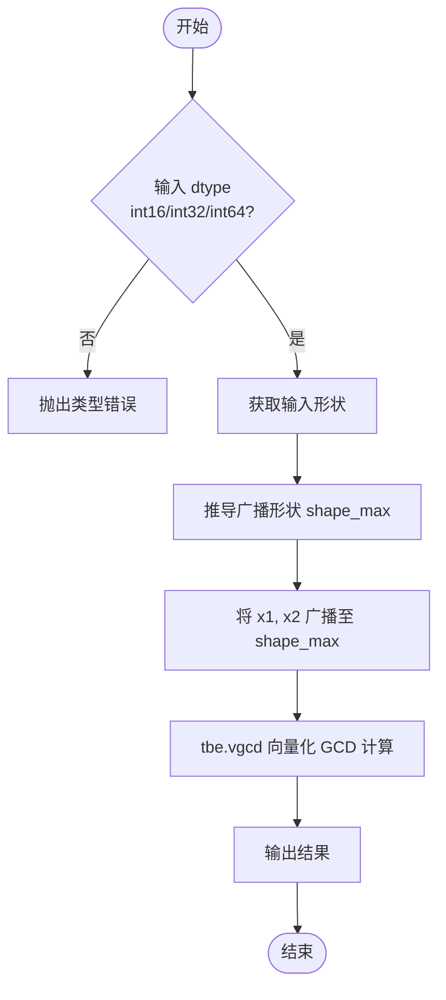
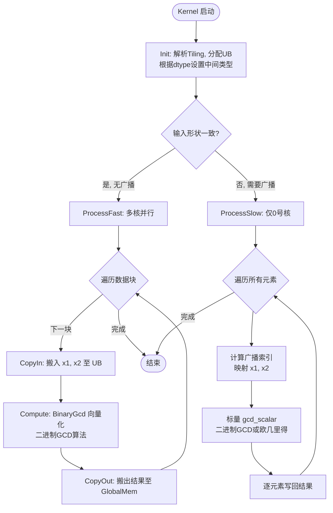

# Gcd 算子开发设计文档

## 一、需求背景

### 1.1 需求来源

通过社区任务完成昇腾 CANN 算子开源仓贡献需求。当前昇腾 TBE 算子库已提供仅支持部分整型的 `Gcd` 算子，为提升泛化能力并适配 Ascend C 编程语言生态，需要在 Atlas A2/A3 训练系列产品上基于 Ascend C 重新实现功能一致且支持更多数据类型的 `aclnnGcd` 算子。

### 1.2 背景介绍

#### 1.2.1 Gcd 算子实现优化

本次任务要求参考昇腾内置 TBE 算子 `Gcd`（路径：`impl/ops_legacy/…/gcd.py`），使用 Ascend C 实现功能一致的 `aclnnGcd` 算子。

- **主要扩展**：原 TBE 算子仅支持 `int16`、`int32`、`int64` 三种整型。本次实现需进一步扩展支持 `int8`、`uint8`，并增加浮点类型 `float16`、`float32`、`bfloat16` 的泛化处理，同时对广播机制提供完整支持。
- **TBE 参考路径**：
1. kernel 实现：/usr/local/Ascend/ascend-toolkit/latest/opp/built-in/op_impl/ai_core/tbe/impl/dynamic/
2. 算子原型：/usr/local/Ascend/ascend-toolkit/latest/opp/built-in/op_proto/inc/
3. 算子信息库：/usr/local/Ascend/ascend-toolkit/latest/opp/built-in/op_impl/ai_core/tbe/config/ascend910b

#### 1.2.2 Gcd 算子现状分析

- **1.2.2.1 TBE 算子支持的数据类型和功能**  
  TBE 原型定义为 `Gcd`，通过参数校验限定输入只能为 `int16`, `int32`, `int64`。算子支持广播，内部调用 `tbe.broadcast` 对齐形状后，通过 `tbe.vgcd` 完成向量化最大公约数计算。该实现依赖 TBE 的自动调度，不支持浮点输入。

- **1.2.2.2 TBE 算子实现描述**  
  TBE 实现逻辑清晰：
  1. 利用 `shape_util.broadcast_shapes` 计算广播目标形状。
  2. 将两个输入广播至目标形状。
  3. 调用 `tbe.vgcd` 进行逐元素 GCD 计算。
  4. 算子注册为 `OpPatternMode.ELEWISE_WITH_BROADCAST`，支持自动融合。

- **1.2.2.3 TBE 算子实现流程图**  

## 二、需求分析

### 2.1 外部组件依赖

需要适配算子调用框架 ACLNN，完成算子注册、形状推导及内存管理。

### 2.2 内部适配模块

算子内部需完成 Ascend C Host 侧的 Tiling 切分模块设计（`op_host/gcd_tiling.cpp`）和 Kernel 侧运算模块（`op_kernel/gcd.cpp`），并更新相应算子信息库。

### 2.3 需求模块设计

#### 2.3.1 Ascend C 算子原型

| 参数名 | 输入/输出/属性 | 描述 | 使用说明 | 数据类型 | 数据格式 | 维度(shape) | 非连续Tensor |
| --- | --- | --- | --- | --- | --- | --- | --- |
| x1 | 输入 | 第一个输入张量，用于进行GCD计算。 | 支持空Tensor，shape需与x2可广播一致。 | INT8, UINT8, INT16, INT32, INT64, FLOAT32, FLOAT16, BFLOAT16 | ND | 0-8 | √ |
| x2 | 输入 | 第二个输入张量。 | 支持广播。 | 同上 | ND | 0-8 | √ |
| out | 输出 | 计算结果张量，shape由广播规则决定。 | 非原地运算。 | 同上 | ND | 0-8 | √ |

#### 2.3.2 Ascend C 算子相关约束

- 算子默认使用确定性实现。
- **浮点类型处理约束**：浮点输入不具备数学上的“最大公约数”定义，但为满足泛化测试要求，算子需将其**视为定点整数进行转换计算**。具体转换逻辑：
  - `float32`/`bfloat16` → 取绝对值 → 向下取整转为 `int64` → 计算 GCD → 将结果转回原浮点类型。
  - `float16` → 先提升为 `float32`，重复上述过程。
  - 该转换可能导致大数值精度损失，仅用于泛化兼容，不承诺数学正确性。
- 对整型 `int8`/`uint8` 的中间计算统一提升为 `int32` 进行，避免溢出并利用向量化加速路径。

---

## 三、需求详细设计

### 3.1 使能方式

根据实际开发任务，使用 ACLNN 框架调用算子。

### 3.2 需求总体设计

#### 3.2.1 Host 侧设计

- **3.2.1.1 分核策略**  
  获取广播后输出的总元素个数 `totalNum`。当两个输入形状完全一致（无广播）时，采用多核均分策略：基于设备可用 AI Core 数量和每个核单次能处理的最大块大小 `TILE_SIZE`，计算每核处理数据量，剩余数据归入尾块。  
  当存在广播（即输入形状不一致）时，为避免复杂的跨核广播下标同步，仅将任务分配给 0 号核，其余核跳过。

- **3.2.1.2 数据分块和内存优化策略**  
  每个核内部采用单缓冲流水线：`inX1`、`inX2`、`outY` 各配备一个长度为 1 的 `TQue`，以 `TILE_SIZE` 为单位搬入搬出。  
  对于向量化快速路径，额外申请两块 TBuf：
  - `tBufCalc`：存放中间变量（如绝对值、半值、差值、常量 0/1、临时结果等），大小按 `TILE_SIZE` 和数据类型计算。
  - `tBufMask`：存放 8‑bit 掩码，用于奇偶、零值等条件的 SIMD 选择，以 `TILE_SIZE / 8` 的块大小分配，节省 UB 空间。

- **3.2.1.3 tilingKey 规划策略**  
  根据输入张量的 `dtype` 和是否存在广播，生成对应的 `tilingKey`，使得 Kernel 侧能够直接实例化对应数据类型的计算模板，并选择快速/慢速路径。Tiling 数据还携带广播掩码、各维度尺寸等元信息。

#### 3.2.2 Kernel 侧设计

- **3.2.2.1 Kernel 侧实现描述**  
  Kernel 实现完全基于 Ascend C，消除 TBE 中的 Python 调度与 TVM 依赖，采用“快速向量化路径 + 慢速标量广播路径”架构，并遵循 TBE 的 `vgcd` 语义。

  **1. 数据类型适配策略**  
  针对不同数据类型，设计统一处理流：

  | 原始数据类型 | 中间计算类型 | 转换方法 |
  | --- | --- | --- |
  | `int8` / `uint8` | `int32` | 提升为 `int32` 向量，计算 GCD 后截断回原类型。 |
  | `int16` | `int16` | 直接使用本类型向量化算法（二进制 GCD）。 |
  | `int32` | `int32` | 直接使用本类型向量化算法。 |
  | `int64` | `int64` | Ascend C 若支持则直接向量化；否则回退标量路径。 |
  | `float32` / `bfloat16` | `int64` | 取绝对值 → 向量转换 `RoundToInt64`（向下取整）→ GCD → 转回原浮点型。 |
  | `float16` | `int64` | 先提升为 `float32`，再与 `float32` 路径一致。 |

  **2. 快速路径（形状一致）**  
  所有 AI Core 参与，每个核循环处理多个 `TILE_SIZE` 块。核心计算函数 `BinaryGcd` 实现向量化二进制 GCD（Stein 算法），关键步骤：
  - **初始化**：计算 `a`、`b` 的绝对值（整型时取反加一选较大值；浮点时已预先转换为整数）。记录 `c = 1`，并生成常量向量 `zeros` 和 `ones`。计算当前块中 `max(a,b)` 的最大值，用于确定迭代次数上限（`int16` 为 30 次，`int32` 为 62 次，对应位宽的两倍）。
  - **主循环**（每次迭代）：
    1. 分离奇偶性：`even = (value & 1) == 0`，利用位与和比较生成掩码。
    2. 分四种情况通过掩码 + `Select` 并行更新：
       - **同偶**：`a >>= 1; b >>= 1; c <<= 1`。
       - **一奇一偶**：仅对偶数执行右移 1 位。
       - **同奇**：`a = |a - b| >> 1`，并保持 `b` 为较小值。
       - **遇零处理**：若 `b == 0`，则结果 `= c * a`，同时将 `a,b` 置零以退出循环。
    3. 更新完后重新评估最大值，若最大值右移后为 0 则提前退出。
  - **收尾**：输出 `c` 即为 GCD，必要时按原类型转换回 `int8` 等。
  所有分支均通过 `Select` 和位掩码实现，无标量跳转，保证向量流水线满负荷。

  **3. 慢速路径（形状不一致 / 广播）**  
  仅 0 号核执行，逐元素计算。对于每个输出位置，根据广播规则映射 `x1` 和 `x2` 的索引，调用标量 `gcd_scalar` 函数。标量函数同样采用二进制 GCD 算法，但处理为单个元素操作。该路径也可处理 `int64` 等向量化暂不支持的整型。

  **4. 与 TBE 实现的差异说明**  
  - **差异点 1**：不再使用 `tbe.broadcast` 和 `tbe.vgcd`，转而用自研的 Ascend C 向量化内核。
  - **差异点 2**：扩展支持浮点及 8 位整型，通过明确的类型提升与转换策略实现泛化。
  - **差异点 3**：广播策略采用“形状一致则多核并行，不一致则单核处理”的简化方案，避免 TBE 中复杂的自动调度开销。
  - **原因**：Ascend C 提供了更底层的控制能力，允许针对二进制 GCD 算法进行极致优化；类型扩展满足社区对算子泛化的测试要求。

- **3.2.2.2 Ascend C 实现流程图**

#### 3.2.3 原 TBE 流程图与 Ascend C 实现流程图的差异汇总

| 模块 | TBE 实现 | Ascend C 实现 | 差异原因 |
| --- | --- | --- | --- |
| 广播 | 先广播再统一计算，依赖 tbe.broadcast 自动处理 | 分快速/慢速路径，无广播时直接多核计算，有广播时单核逐元素处理 | 减少中间内存占用，避免额外的广播张量分配 |
| 计算核心 | 调用闭源 `tbe.vgcd` | 自研二进制 GCD 向量化算法，全开源可控 | 提高可维护性，便于后续优化和适配新硬件 |
| 数据类型支持 | `int16/int32/int64` | `int8/uint8/int16/int32/int64` 及 `fp32/fp16/bf16` (通过转整型桥接) | 满足社区泛化测试需求 |
| 调度方式 | TVM Auto Schedule | 手工编排分核与流水线 | 更精确控制 UB 使用，提升极端规模性能 |

### 3.3 支持硬件

适配 **Atlas A2 训练系列产品 / Atlas A3 系列产品**。

### 3.4 算子约束限制

- 支持 0-8 维（ND）及非连续 Tensor，广播维度遵循标准广播规则。
- 输出为非 Inplace 操作，与输入使用独立内存空间。
- 对于 `int64`，若硬件向量化支持不足，将自动回退为标量路径，性能可能下降。
- 浮点输入的结果仅用于框架泛化验证，无实际数学意义，用户应避免在业务模型中对浮点数使用 GCD 算子。

---

## 四、特性交叉分析

该算子为 Element-wise 二元算术运算，输出 Shape 由广播规则确定，不会改变张量布局，也不涉及梯度或网络结构变更。  
- **融合支持**：算子注册为 `ELEWISE_WITH_BROADCAST` 模式，可与相邻 Element-wise 算子自动融合，提升执行效率。
- **精度特性**：整型输入结果绝对精确，浮点“伪 gcd”结果由于取整转换，可能存在舍入差异，不作为精度评估对象。
- **动态 Shape**：当前设计基于静态 Shape 的 tiling，动态 Shape 需框架层面补全形状信息后方可执行。

---

## 五、可维可测分析

### 5.1 精度标准/性能标准

- **精度**：
  - 对 `int8/uint8/int16/int32/int64` 输入，输出必须与 Python 标准库 `math.gcd` 或 PyTorch 参考实现的元素级结果完全一致（包括 0 和负数处理：GCD 取绝对值后的结果）。
  - 浮点输入的“精度”不纳入严格验证，只要求不出现崩溃、非预期溢出或类型错误，且计算结果与参考实现（将浮点转 `int64` 后求 GCD 再转回浮点）在误差范围内对齐。
- **性能**：
  1. 暂仅要求**所有核参与计算场景**下，性能不低于原 TBE 算子。
  2. 如小shape无法达标（10us以下场景相差3us），提供性能仿真图和分析结论证明Ascend C实现与TBE完全一致或优于TBE实现。

### 5.2 兼容性分析

本算子基于 Ascend C 全新开发，替代原有 TBE 算子，作为功能超集（增加 `int8/uint8` 及浮点泛化支持），向后完全兼容原有 `Gcd` 接口，对现有模型业务无破坏性影响。