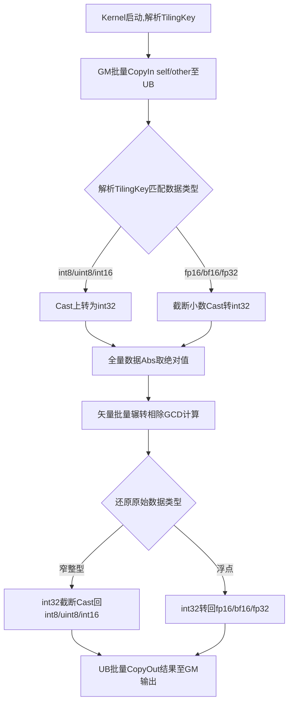

# Gcd 算子开发设计文档

## 一、需求背景

### 1.1 需求来源

当前 `aclnnGcd` 算子基于 TBE 实现，仅支持有限整型数据类型，不满足模型泛化与多精度计算需求。本次任务旨在基于 Ascend C 编程语言全新实现 `Gcd` 算子，扩展支持 `fp32`、`fp16`、`bf16`、`int8`、`uint8`、`int16` 数据类型，对齐 TBE 算子功能与精度，并将成果贡献至昇腾 CANN 算子开源仓（ops-math）。

### 1.2 背景介绍

#### 1.2.1 算子实现优化

本次开发的核心任务是在 Ascend C 侧实现完整的逐元素最大公约数（GCD）计算逻辑，并支持广播与非连续张量场景。由于底层 NPU 对不同数据类型的指令支持差异，新增类型需要统一采用**类型上转 + int32 计算 + 类型还原**的策略：
- 小整型（int8/uint8/int16）上转为 int32 计算；
- 浮点类型（fp16/bf16/fp32）先截断取整为 int32，计算 GCD 后转回浮点；
- 所有类型均遵循 TBE 计算规则：负数取绝对值、0 值直接返回另一数绝对值。

 - **TBE 参考路径**：
 	  1. kernel 实现：/usr/local/Ascend/ascend-toolkit/latest/opp/built-in/op_impl/ai_core/tbe/impl/ops_legacy/dynamic/gcd.py
 	  2. 算子原型：/usr/local/Ascend/ascend-toolkit/latest/opp/built-in/op_proto/inc/
 	  3. 算子信息库：/usr/local/Ascend/ascend-toolkit/latest/opp/built-in/op_impl/ai_core/tbe/config/ascend910b

#### 1.2.2 Gcd 算子现状分析 (基于 TBE 现有实现)

`aclnnGcd` 是 OPAPI 基于 TBE 算子封装的 aclnn 接口。当前 TBE 实现依靠内置矢量指令 `tbe.vgcd` 完成计算，仅支持 `int16`、`int32`、`int64`，其底层逻辑如下：
1. **输入校验**：校验类型、维度、广播合法性；
2. **广播对齐**：自动将两个输入广播至同一输出 shape；
3. **矢量 GCD**：调用 `tbe.vgcd` 逐元素计算最大公约数；
4. **输出回写**：自动调度写回结果。

TBE 实现不支持小整型与浮点，无法满足本次泛化需求。

#### 1.2.3 TBE 算子实现流程图

---

## 二、需求分析

### 2.1 外部组件依赖

本算子的主要外部依赖为 ACLNN 框架，框架层需完成入参校验、广播维度解析，并将广播逻辑在 Host 侧完成计算，由 Kernel 侧直接执行元素级 GCD。

### 2.2 内部适配模块

算子内部需在 Ascend C 的 Host 侧 Tiling 模块（为新类型配置切分策略及 TilingKey）和 Kernel 侧实现模块补充新增类型的特化逻辑，并更新 API 层的参数注册。

### 2.3 需求模块设计

#### 2.3.1 AscendC 算子原型

更新后的算子原型如下，已明确增加对 `fp32`、`fp16`、`bf16`、`int8`、`uint8`、`int16` 的支持：

| 参数名 | 输入/输出/属性 | 描述 | 使用说明 | 数据类型 | 数据格式 | 维度(shape) | 非连续Tensor |
| --- | --- | --- | --- | --- | --- | --- | --- |
| x1 | 输入 | 输入张量。 | 与 x2 满足广播关系 | fp32、fp16、bf16、int8、uint8、int16 | ND | 1-8 | √ |
| x2 | 输入 | 输入张量。 | 与 x1 满足广播关系 | fp32、fp16、bf16、int8、uint8、int16 | ND | 1-8 | √ |
| out | 输出 | GCD 计算结果 | 与广播后 shape 一致 | 与 x1 一致 | ND | 与 x1 一致 | √ |

#### 2.3.2 算子相关约束

* 浮点类型输入会自动**截断小数部分**，按整数计算 GCD，与 TBE 行为完全对齐；
* 负数自动取绝对值后计算；
* 任一输入为 0 时，结果为另一数绝对值；
* 所有输入输出数据类型必须一致。

---
### 3.2 需求总体设计
#### 3.2.1 host侧设计
##### 3.2.1.1 入参合法性前置校验
Host在Tiling计算前优先完成三层参数校验，提前拦截非法输入，避免内核运行异常：
1. **数据类型校验**：校验self、other、out三者DataType完全一致，仅允许`fp32/fp16/bf16/int8/uint8/int16`，非法类型直接返回ACLNN_ERR_PARAM_INVALID；
2. **维度校验**：限制输入维度范围1~8维，超出维度直接报错；
3. **广播合法性校验**：解析self、other各维度尺寸，按照CANN标准广播规则逐维校验，无法广播则抛出参数异常；
4. **输出shape校验**：预先推导广播后输出shape，和out张量原生shape比对不一致则报错。

##### 3.2.1.2 分核策略
1. 依托仓库`BroadcastSch`广播组件自动计算**广播后全局总元素数量total_elem**；
2. 调用设备接口获取当前A2/A3硬件有效AI Core物理核数core_cnt；
3. 依据单元素字节宽度差异化计算单核负载`core_elem_num`：
    - int8/uint8：单元素1Byte，单核可分配更大数据量，`core_elem_num = ceil(total_elem / core_cnt)`；
    - int16：单元素2Byte，单核数据量减半配置，防止UB缓存占用超标；
    - fp16/bf16：单元素2Byte，同int16分块规则；
    - fp32：单元素4Byte，内存占用最高，进一步缩小单核处理元素，避免UB溢出；
4. 余数补齐：无法均等整除时，最后一个核心承接剩余所有尾元素，保证全量数据无遗漏。

##### 3.2.1.3 TilingKey规划策略
1. TilingKey编码规则：**低3bit=数据类型编码，高位预留扩展**，编码映射：
    | 编码 | 0 | 1 | 2 | 3 | 4 | 5 |
    | ---- | ---- | ---- | ---- | ---- | ---- | ---- |
    | Dtype | int8 | uint8 | int16 | fp16 | bf16 | fp32 |
2. Host根据输入dtype生成唯一TilingKey，随Tiling结构体下发至Kernel；
3. Kernel运行时解析TilingKey的类型字段，自动路由至对应数据类型的计算分支，实现多类型一套内核入口、多分支独立运算。

#### 3.2.2 kernel侧设计
* **3.2.2.1 kernel侧实现描述 **
Kernel单批次流水线：`GM批量CopyIn→UB缓存驻留→按TilingKey分支类型转换→全量Abs取绝对值→矢量批量辗转GCD运算→Cast还原原始数据类型→UB批量CopyOut回GM`，所有中间运算在片上UB闭环，减少GM频繁交互。
1. **int8 / uint8 / int16 窄整型分支**
受AI Core无原生窄整型矢量取模、乘加硬件指令限制，统一向上转换int32运算：
    ① GM→UB：按分块长度批量加载self、other数据至UB；
    ② 类型上转：`Cast(原类型 → int32)`，uint8无符号整型做无符号位扩展，int8/int16有符号符号位扩展；
    ③ 逐元素Abs取绝对值，对齐TBE负数取模规则；
    ④ 矢量批量欧几里得GCD循环：`gcd(a,b)=gcd(b,a%b)`，任意一数为0直接取另一数绝对值；
    ⑤ 结果下转：`Cast_RINT(int32 → 原窄整型)`，数值溢出自动截断至对应类型值域；
    ⑥ UB→GM：结果批量写回输出张量对应位置。

2. **fp16 / bf16 / fp32 浮点分支**
浮点无原生GCD硬件指令，遵循TBE「截断小数取整再求GCD」规则：
    ① GM→UB：批量载入浮点数据至UB；
    ② 小数截断：直接舍去小数部分、不四舍五入，`Cast(浮点 → int32)`；
    ③ Abs取绝对值后执行矢量GCD运算，规则同整型；
    ④ 整型结果转回原始浮点格式；
    ⑤ 结果CopyOut回GM输出。

3. **通用数学约束**
    - `gcd(x,0)=abs(x)、gcd(0,y)=abs(y)`；
    - 负数输入全部先取绝对值再运算。
4. **AscendC 实现与 TBE 实现的差异点和原因**
- **差异点：**
TBE 使用内置黑盒指令 `tbe.vgcd`，仅支持整型；
Ascend C 实现自主实现全类型分支、类型转换、GCD 循环、广播调度。
- **原因：**
Ascend C 贴近硬件底层，需手动处理类型适配、内存搬运、指令流水，从而支持 TBE 无法覆盖的小整型与浮点类型，同时保证精度与性能。

##### 3.2.2.2 AscendC实现流程图

### 3.3 支持硬件

支持 **Atlas A2 训练系列产品 / Atlas A3 系列产品**。

### 3.4 算子约束限制

* 浮点类型仅截断小数，不四舍五入；
* uint8 输出保证非负；
* 大 shape 场景下 Tiling 需自动调整单核数据块大小，避免 UB 溢出。

---

## 四、特性交叉分析

本算子是逐元素 + 广播类算子，属于 Element-wise 计算。所有类型转换、GCD 计算、内存搬运均在核内闭环完成，不依赖其他算子，不产生并发冲突，与现有框架、调度、内存管理完全兼容。

---

## 五、可维可测分析

### 5.1 精度标准/性能标准

* **精度标准：** 计算结果与 TBE 参考实现完全一致，满足 AscendOpTest 默认阈值；
* **性能标准：** 暂仅要求所有核参与计算场景下，性能不低于原 TBE 算子。如小shape无法达标（10us以下场景相差3us），提供性能仿真图和分析结论证明Ascend C实现与TBE完全一致或优于TBE实现。

### 5.2 兼容性分析

本设计向下兼容 TBE 原有功能与类型。新增类型通过 TilingKey 自动分发，上层 aclnn 接口无需修改，可直接被 PyTorch 等框架调用，兼容性与扩展性大幅增强。