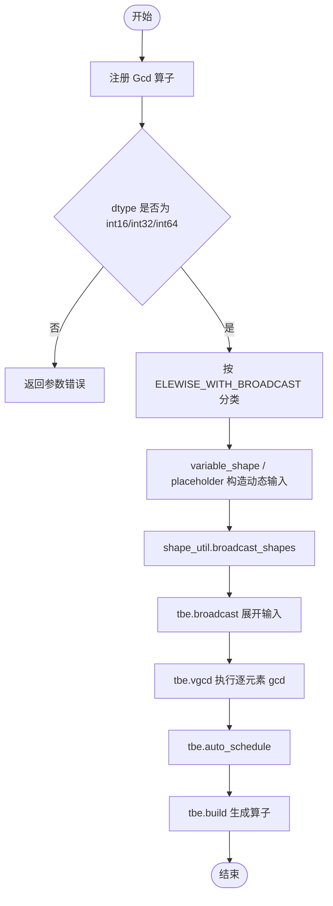
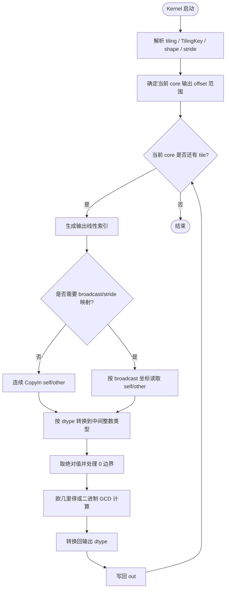

# Gcd 算子开发设计文档

## 一、需求背景

### 1.1 需求来源

为完成社区任务 2026 年 5 月 `Gcd` 算子开发任务，需要在 Atlas A2 训练系列产品 / Atlas A3 系列产品上，基于 Ascend C 实现与内置 `aclnnGcd` 功能一致并满足任务书扩展要求的算子，最终贡献到昇腾算子开源仓 `cann/ops-math`。

### 1.2 背景介绍

#### 1.2.1 Gcd 算子实现优化

`Gcd` 算子用于对 `self` 与 `other` 两个输入张量逐元素计算最大公约数，两个输入需要满足 broadcast 关系，输出 shape 为 broadcast 后的 shape。本任务要求在原有整数 GCD 能力基础上，覆盖任务书指定的数据类型、维度、广播和非连续 Tensor 场景。

**本次设计覆盖范围**：

- 支持 `fp32`、`fp16`、`bf16`、`int8`、`uint8`、`int16`。
- 支持 ND 格式，rank 范围为 1-8。
- 支持输入 Tensor 非连续。
- 支持 `self`、`other` 按标准 broadcast 规则推导输出 shape。
- 适配硬件按任务书覆盖 Atlas A2 训练系列产品 / Atlas A3 系列产品，`int8`、`uint8` 同样纳入 A2/A3 验证矩阵。

**本次设计采用“基线 + 交付”双方案描述**：

1. 现有 TBE 基线：内置 `gcd.py` 的动态算子注册与 `tbe.vgcd` 路径，用于说明当前参考实现的真实入口和能力边界；
2. 本次 Ascend C 交付：按当前实现落地的 ACLNN 两段式 + Ascend C kernel 方案，用于覆盖任务书扩展 dtype、broadcast 和非连续场景。

#### 1.2.2 现有 TBE 基线实现

现有内置 `Gcd` 参考实现位于动态 TBE 算子 `gcd.py`，其真实流程为：

1. `register_operator` / `register_operator_compute` 完成算子注册；
2. 通过 dtype 校验限定 `int16`、`int32`、`int64`；
3. 使用 `classify(..., OpPatternMode.ELEWISE_WITH_BROADCAST)` 处理 broadcast 分组；
4. 使用 `shape_util.variable_shape` 和 `tvm.placeholder` 构造动态输入；
5. 在 compute 阶段执行 `shape_util.broadcast_shapes`、`tbe.broadcast` 和 `tbe.vgcd`；
6. 通过 `tbe.auto_schedule` 和 `tbe.build` 生成最终算子。

该路径仅作为基线与能力边界参考，不代表本次任务的最终交付实现。对于浮点类型，基线实现并不覆盖任务书要求的 `fp32`、`fp16`、`bf16` 合同。

#### 1.2.3 现有 TBE 基线流程图



#### 1.2.4 本次 Ascend C 交付概览

本次交付方案不复用上述 TBE 计算图，而是按当前实现采用 ACLNN 两段式接口 + Ascend C kernel。Host 侧负责参数校验、broadcast 关系与连续化准备、tiling 数据生成和分核；Kernel 侧通过输出线性坐标与 `OffsetCursor` 完成 broadcast 偏移映射，并按当前实现的 float 截断语义和整数 GCD 语义完成计算。详细设计见 3.2 节。

## 二、需求分析

### 2.1 外部组件依赖

算子需要接入 ACLNN 两段式接口与 `ops-math` 算子工程，依赖组件包括：

- ACLNN 参数校验、executor、workspace 管理和 stream 执行框架；
- GE/OpDef 注册体系，用于声明输入输出 dtype、format、shape 能力；
- Ascend C Kernel 运行时，用于 GM/UB 搬运、矢量计算、分核执行；
- Broadcast 调度组件或等价的 Host/Kernel 侧索引映射逻辑，用于处理非同形输入。

### 2.2 内部适配模块

内部需要完成以下模块：

1. `op_api`：实现 `aclnnGcdGetWorkspaceSize` 与 `aclnnGcd` 接口，完成空指针、dtype、shape、broadcast 和 out shape 校验。
2. `op_host`：实现算子原型注册、shape 推导、tiling 数据结构、分核策略和 TilingKey 编码。
3. `op_kernel`：实现 Ascend C 计算内核，根据 dtype 和是否广播进入不同计算路径。
4. `tests`：提供 UT/ST、ACLNN 调用样例和自验证脚本，覆盖 dtype、broadcast、非连续、边界值和 A2/A3 硬件矩阵。

### 2.3 算子原型定义

| 参数名 | 输入/输出 | 描述 | 使用说明 | 数据类型 | 数据格式 | 维度(shape) | 非连续 Tensor |
| --- | --- | --- | --- | --- | --- | --- | --- |
| self | 输入 | 第一个输入张量 | shape 需与 other 满足 broadcast 关系 | fp32, fp16, bf16, int8, uint8, int16 | ND | 1-8 | 是 |
| other | 输入 | 第二个输入张量 | shape 需与 self 满足 broadcast 关系 | fp32, fp16, bf16, int8, uint8, int16 | ND | 1-8 | 是 |
| out | 输出 | 最大公约数结果 | shape 为 self 与 other broadcast 后 shape | 与输入推导 dtype 一致 | ND | 1-8 | 是 |

### 2.4 主要约束

- `self`、`other` 与 `out` 的 dtype 需要满足任务书和 ACLNN 数据类型推导规则。
- 输入 rank 必须在 1-8 范围内。
- `self` 与 `other` 必须满足标准 broadcast 关系。
- `out` 的 shape 必须等于 broadcast 后 shape。
- 整型语义为 `gcd(abs(self), abs(other))`，其中 `gcd(0, 0) = 0`。
- 浮点类型按任务扩展语义处理：输入为有限浮点值，先按向 0 截断转换到整数语义，再计算 GCD 并 cast 回原 dtype；非有限浮点不作为合法精度用例。

## 三、详细设计

### 3.1 使能方式

算子通过 ACLNN 两段式接口使能：

```cpp
aclnnStatus aclnnGcdGetWorkspaceSize(
    const aclTensor* self,
    const aclTensor* other,
    aclTensor* out,
    uint64_t* workspaceSize,
    aclOpExecutor** executor);

aclnnStatus aclnnGcd(
    void* workspace,
    uint64_t workspaceSize,
    aclOpExecutor* executor,
    aclrtStream stream);
```

### 3.2 总体设计

#### 3.2.1 Host 侧设计

**入参校验**

Host 侧在 tiling 前完成以下校验：

1. 空指针校验：`self`、`other`、`out`、`workspaceSize`、`executor` 不能为空；
2. dtype 校验：仅允许任务书指定 dtype，并校验输入输出 dtype 推导关系；
3. rank 校验：输入输出 rank 均在 1-8 范围内；
4. broadcast 校验：逐维检查 `self` 与 `other` 能否 broadcast；
5. out shape 校验：推导得到的 broadcast shape 必须与 `out` shape 一致；
6. 非连续 Tensor：使用 view shape / stride 信息完成逻辑 shape 校验，Kernel 侧按逻辑索引或框架准备后的连续视图处理。

**分核策略**

Host 根据 broadcast 后总元素数 `totalNum`、dtype 字节数、UB 大小和可用 AI Core 数量生成切分参数：

- 无广播或 broadcast 后可线性连续访问的场景：按 `totalNum` 满核均分，尾块由末尾或前若干核心承接；
- 一般 broadcast 场景：保留多核切分，Kernel 侧根据输出线性 index 反推 `self` 与 `other` 的逻辑偏移；
- 小 shape 场景：减少核数或合并 tile，避免启动与同步开销超过计算收益；
- 大 shape 场景：按 UB 容量选择 tile 长度，确保输入、中间 buffer、输出 buffer 不超过 UB。

**TilingKey 规划**

TilingKey 用于 Kernel 侧快速选择 dtype 与 broadcast 分支：

| 字段 | 说明 |
| --- | --- |
| 低 3 bit | dtype 编码：int8、uint8、int16、fp16、bf16、fp32 |
| bit 3 | 是否存在 broadcast |
| bit 4 | 是否存在非连续访问 |
| 高位 | 预留硬件或算法扩展 |

Tiling 数据中同时保存输出总元素数、各输入 shape、stride、broadcast 后 shape、每核起止 offset、tile 长度等信息。

#### 3.2.2 Kernel 侧设计

Kernel 采用 `Init -> Process -> CopyIn -> Compute -> CopyOut` 的流水线结构。每个核心处理一段输出线性空间，必要时根据 broadcast 规则计算输入 offset。

**数据类型处理策略**

| 输入 dtype | 中间计算 dtype | 处理方式 |
| --- | --- | --- |
| int8 | int32 | 符号扩展到 int32，取绝对值后计算 GCD，再 cast 回 int8 |
| uint8 | int32 | 零扩展到 int32，计算 GCD 后 cast 回 uint8 |
| int16 | int32 | 扩展到 int32，计算 GCD 后 cast 回 int16 |
| fp16 | int32/int64 | cast 到 float32 后校验/截断到整数语义，计算 GCD 后 cast 回 fp16 |
| bf16 | int32/int64 | cast 到 float32 后按整数语义计算，结果 cast 回 bf16 |
| fp32 | int32/int64 | 按整数语义计算 GCD，结果 cast 回 fp32 |

**GCD 计算核心**

整型核心逻辑采用欧几里得算法或二进制 GCD 算法：

1. 对输入取绝对值；
2. 若 `a == 0`，结果为 `b`；若 `b == 0`，结果为 `a`；
3. 循环计算 `gcd(a, b) = gcd(b, a % b)`，直到 `b == 0`；
4. 将中间结果转换回输出 dtype。

对于向量化路径，可使用 mask 和 select 表达分支，减少标量跳转；对于复杂 broadcast 或尾块，使用标量索引映射保证 correctness。

**广播索引映射**

对于输出线性索引 `out_idx`：

1. 按 broadcast 后 shape 反解多维坐标；
2. 若某输入对应维度为 1，则该维输入坐标取 0；
3. 否则使用输出坐标；
4. 根据输入 stride 计算 GM 偏移；
5. 读取 `self` 与 `other` 对应元素参与计算。

#### 3.2.3 Ascend C 实现流程图



### 3.3 支持硬件

支持 Atlas A2 训练系列产品 / Atlas A3 系列产品。`int8`、`uint8`、`int16`、`fp16`、`bf16`、`fp32` 均按任务书进入支持与测试范围，不因某一历史文档或现有实现的窄化描述从 A3 验证矩阵中移除。

### 3.4 算子约束限制

- 不支持 rank 0 或 rank 大于 8 的输入。
- 不支持无法 broadcast 的输入 shape。
- 不支持输出 shape 与 broadcast 推导结果不一致的调用。
- 浮点输入按有限浮点值、向 0 截断后的整数语义验证；非有限浮点不作为合法精度验收场景。
- 不使用 CPU fallback、Python fallback、PyTorch 高层等价算子或 vendor 整算子作为被测路径。

## 四、特性交叉分析

- **类型泛化**：覆盖任务书指定的 6 类 dtype，并通过 TilingKey 区分不同计算路径。
- **形状泛化**：覆盖 rank 1-8、同形、单边 broadcast、多维 broadcast 和尾块。
- **非连续 Tensor**：通过逻辑 shape/stride 或框架准备后的连续视图处理，保证结果按逻辑 Tensor 语义计算。
- **硬件兼容**：A2/A3 均纳入验证矩阵，按硬件 UB、核数和 dtype 字节数生成 tiling。
- **实现边界**：最终被测路径为 Ascend C 自有实现，不依赖参考实现或框架高层算子完成核心计算。

## 五、可维可测分析

### 5.1 精度标准

精度按任务书要求满足 AscendOpTest 默认阈值：

- 整型：与手写参考实现逐元素完全一致；
- 浮点：与任务定义的有限浮点、向 0 截断后的整数参考实现一致，并满足对应 dtype 默认阈值；
- 覆盖 `0`、负数、`gcd(0, 0)`、broadcast、非连续 Tensor、rank 边界和 dtype 边界。

参考实现需要手写，不能直接使用 `torch.gcd` 覆盖浮点场景。推荐参考逻辑为：

1. 将 `self` 与 `other` broadcast 到输出 shape；
2. 对浮点输入先校验 `isfinite` 且为整数值；
3. 转换到 `int64` 后计算 `gcd(abs(a), abs(b))`；
4. 将结果转换回输出 dtype。

### 5.2 性能标准

性能按任务书要求：

- 所有核参与计算场景下，性能不低于原 TBE 算子；
- 小 shape 若无法达标，需提供性能仿真图和分析结论，说明 Ascend C 实现与 TBE 实现一致或优于 TBE；
- 性能测试覆盖连续、broadcast、不同 dtype、不同 rank、不同数据规模和 A2/A3 硬件。

### 5.3 兼容性分析

本设计对齐 ACLNN 两段式接口、ND 格式、broadcast 规则和 ops-math 工程组织方式。对于既有整数 GCD 场景保持兼容；对于任务书新增 dtype，通过显式 dtype 分支和测试矩阵保证扩展能力可维护、可验证。
