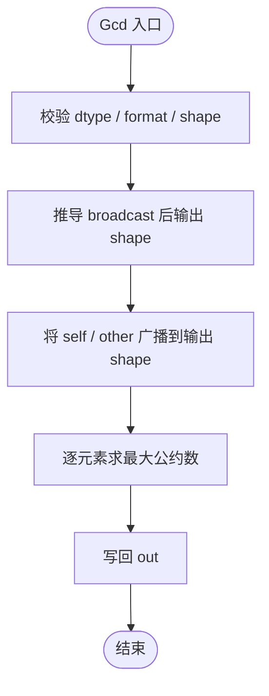
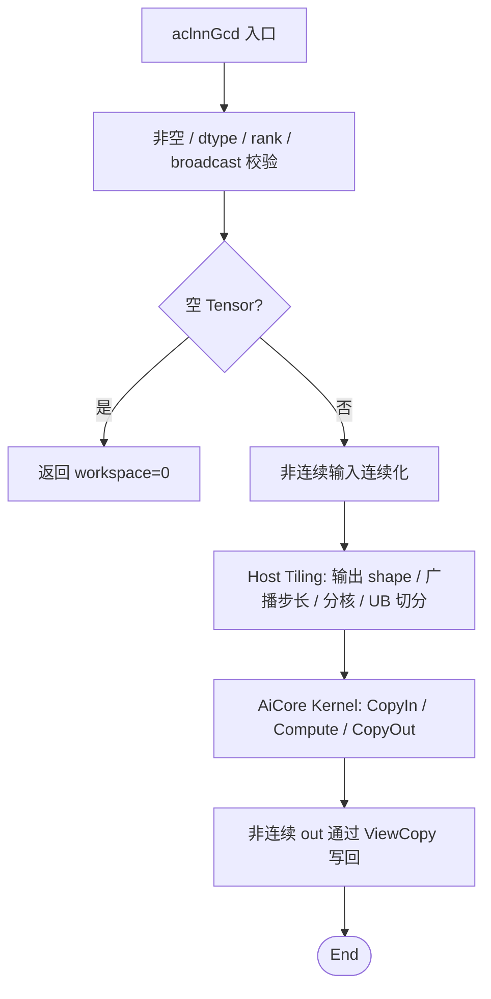
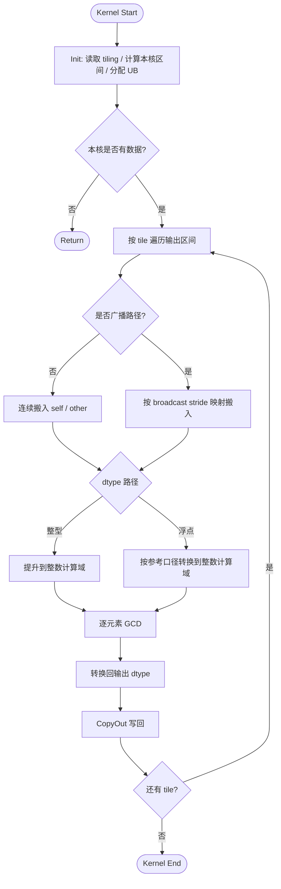

# Gcd 算子设计文档

> 适配硬件：Atlas A2 训练系列产品 / Atlas A3 系列产品 | 开发语言：Ascend C

# 需求背景

## 需求来源

社区任务 `202605-16 Gcd`：参考昇腾版本内置 `aclnnGcd` 算子的 TBE 实现，在昇腾 NPU 上基于 Ascend C 编程语言实现功能一致的算子。交付内容包括算子设计、开发、测试和自验证报告，验收通过后提交至昇腾算子开源仓 `experimental/math`。

## 背景介绍

### Gcd 算子实现优化

`Gcd` 算子用于对两个输入 Tensor 按元素求最大公约数。两个输入满足 broadcast 关系时，输出 shape 为 broadcast 后的 shape。

设广播后的两个输入为 `A`、`B`，输出为 `Y`，计算语义为：

```text
Y[i] = gcd(A[i], B[i])
```

边界语义按参考算子对齐：

1. 输入为负值时先按绝对值参与最大公约数计算。
2. `gcd(x, 0) = abs(x)`，`gcd(0, y) = abs(y)`，`gcd(0, 0) = 0`。
3. 浮点输入没有严格数学意义上的 GCD，本设计按参考算子验收口径处理：浮点值先转换到整数计算域，求 GCD 后再转换回输出 dtype。

相关参考路径：

| 类别 | 路径 / 链接 |
| --- | --- |
| TBE Kernel 实现 | `/usr/local/Ascend/ascend-toolkit/latest/opp/built-in/op_impl/ai_core/tbe/impl/dynamic/` |
| 算子原型 | `/usr/local/Ascend/ascend-toolkit/latest/opp/built-in/op_proto/inc/` |
| 算子信息库 | `/usr/local/Ascend/ascend-toolkit/latest/opp/built-in/op_impl/ai_core/tbe/config/ascend910b` |
| 开源仓参考 | `https://gitee.com/ascend/cann-ops/tree/master/src/math/gcd` |

### Gcd 算子 TBE 实现现状分析

内置 TBE 版本为带 broadcast 的双输入逐元素算子，整体流程为：参数校验 -> broadcast shape 推导 -> 输入广播对齐 -> 逐元素 GCD 计算 -> 输出写回。

当前任务书要求 Ascend C 实现支持如下能力：

| 参数 | 类别 | 支持数据类型 | format | shape | 约束 |
| --- | --- | --- | --- | --- | --- |
| `self` | 输入 | FLOAT、FLOAT16、BFLOAT16、INT8、UINT8、INT16 | ND | 1-8 维 | 与 `other` 满足 broadcast 关系，支持非连续 Tensor |
| `other` | 输入 | FLOAT、FLOAT16、BFLOAT16、INT8、UINT8、INT16 | ND | 1-8 维 | 与 `self` 满足 broadcast 关系，支持非连续 Tensor |
| `out` | 输出 | 与输入一致 | ND | broadcast 后 shape | 支持非连续 Tensor |

TBE 参考流程如下：



# 需求分析

## 需求描述

使用 Ascend C 实现 `aclnnGcd`，功能与内置 TBE 参考算子一致，支持 FLOAT、FLOAT16、BFLOAT16、INT8、UINT8、INT16 六种数据类型，支持 ND 格式、1-8 维输入、broadcast、空 Tensor 和非连续 Tensor。

## 需求拆解

1. 支持任务书要求的 6 种 dtype，`self`、`other` 和 `out` 的 dtype 保持一致。
2. 支持 rank `[1,8]` 的 ND Tensor，输出 shape 等于 `self` 与 `other` broadcast 后的 shape。
3. 支持非连续输入和非连续输出，由 aclnn 接口层完成连续化和 ViewCopy 写回。
4. 支持空 Tensor，空 Tensor 在接口层快速返回，不下发 Kernel。
5. 结果与参考算子保持一致，性能在所有核参与计算场景下不低于原 TBE 算子。

## 外部组件依赖

不引入第三方组件，依赖 CANN 提供的 aclnn / opdev / l0op 框架、Host Tiling 机制、Ascend C Kernel 基础库和平台信息接口。

## 内部适配模块

| 模块 | 设计职责 |
| --- | --- |
| aclnn 接口层 | 参数校验、dtype 校验、broadcast shape 校验、空 Tensor 快速返回、非连续 Tensor 规整和输出 ViewCopy |
| Host Shape / Tiling | 推导输出元素数、广播步长、分核参数、UB 切分参数和 dtype 路径 |
| Kernel TilingData | 保存总元素数、输入输出 shape/stride、每核处理区间、tile 长度、dtype 路径等字段 |
| Ascend C Kernel | 按 dtype 分支完成数据搬入、整数域 GCD 计算、结果转换和搬出 |
| 测试与样例 | 覆盖 aclnn 直调、dtype、broadcast、非连续 Tensor、边界值和性能对比 |

## 算子原型

| 名称 | 类别 | 数据类型 | format | shape | 说明 |
| --- | --- | --- | --- | --- | --- |
| `self` | 输入 | FLOAT / FLOAT16 / BFLOAT16 / INT8 / UINT8 / INT16 | ND | 1-8 维 | 第一个输入 Tensor，支持非连续 Tensor |
| `other` | 输入 | FLOAT / FLOAT16 / BFLOAT16 / INT8 / UINT8 / INT16 | ND | 1-8 维 | 第二个输入 Tensor，支持非连续 Tensor |
| `out` | 输出 | 与输入一致 | ND | broadcast 后 shape | 最大公约数结果，支持非连续 Tensor |

约束：

1. `self` 与 `other` 必须满足 CANN broadcast 规则。
2. `out` shape 必须等于 broadcast 后 shape。
3. 三个 Tensor 的 dtype 必须一致。
4. rank 支持 1-8 维。
5. 不承诺任务书范围外 dtype。

# 详细设计

## 算子分析

### 数学公式

对每个输出元素 `i`，根据 broadcast 映射得到输入下标 `idxSelf(i)` 和 `idxOther(i)`：

```text
a = self[idxSelf(i)]
b = other[idxOther(i)]
out[i] = gcd(abs(to_integer(a)), abs(to_integer(b)))
```

其中 `to_integer` 对整型保持数值，对 FLOAT / FLOAT16 / BFLOAT16 按参考算子验收口径转换到整数计算域。

### 支持数据类型

FLOAT、FLOAT16、BFLOAT16、INT8、UINT8、INT16。

### 支持形状

ND，rank `[1,8]`，支持 broadcast。输出 shape 由 `self` 和 `other` 逐维按 broadcast 规则推导。

## 使能方式

| 上层调用 / 工具链 | 涉及勾选 | 说明 |
| --- | :---: | --- |
| Aclnn 直调 | √ | 两段式接口，作为自验证和集成主入口 |
| ATC 推理 | √ | 注册算子原型后支持图模式调用 |

## 总体架构

整体链路分为四层：

1. aclnn 接口层：完成参数、dtype、shape、broadcast、空 Tensor 和非连续 Tensor 处理。
2. L0 原生调用层：将规整后的输入和输出加入执行器。
3. Host Tiling 层：基于输出 shape、输入 broadcast 关系、dtype 和平台信息生成 TilingData。
4. AiCore Kernel 层：按 TilingData 分核处理输出元素，完成逐元素 GCD。



## 算子实现

### Host 侧设计

#### 参数校验与 shape 推导

Host / aclnn 层完成以下检查：

1. `self`、`other`、`out` 非空。
2. dtype 在 FLOAT、FLOAT16、BFLOAT16、INT8、UINT8、INT16 范围内，且三者 dtype 一致。
3. 输入 rank 在 `[1,8]` 范围内。
4. `self` 与 `other` 满足 broadcast 规则。
5. 推导出的 broadcast shape 与 `out` shape 一致。
6. 空 Tensor 直接返回，不申请 Kernel 执行任务。

#### 分核策略

以输出元素空间为分核主轴。Host 侧读取输出元素总数 `totalNum`、平台 AIV 核数 `coreNum` 和 UB 大小后，确定实际参与计算的 `usedCoreNum`。

1. 大 shape 优先使用全部可用核心，保证所有核参与计算场景下吞吐。
2. 小 shape 根据 `totalNum` 缩减 `usedCoreNum`，避免空核和过度调度开销。
3. 输出元素不能均分时，前若干核多处理一个 block 或由尾核处理剩余元素，保证区间连续且无遗漏。
4. 分核边界按 32B 搬运粒度对齐，减少跨核写回冲突。

#### 广播映射策略

Host 将 `self`、`other` 和 `out` shape 统一补齐到 8 维，计算每一维的输入 stride：

1. 若输入某维为 1 且输出该维大于 1，该维 stride 置 0，Kernel 访问时复用同一元素。
2. 若输入某维与输出维相同，按连续 ND Tensor 的 stride 计算线性偏移。
3. 若输入 shape 与输出 shape 完全一致，设置无广播快速路径，Kernel 可直接按线性地址读取。

#### 数据分块和 UB 策略

Kernel 每个 tile 至少包含 `self`、`other`、`out` 三段 UB 缓冲。对需要类型提升的 dtype 额外预留 INT32 或 FLOAT 中间缓冲。

| dtype | 计算域 | UB 设计 |
| --- | --- | --- |
| INT8 / UINT8 / INT16 | INT32 | 输入搬入后提升到 INT32，计算后转换回原 dtype |
| FLOAT16 / BFLOAT16 | FLOAT -> INT32/INT64 参考计算域 | 先 Cast 到 FLOAT，再转换到整数计算域 |
| FLOAT | INT32/INT64 参考计算域 | 直接按参考口径转换到整数计算域 |

tile 长度根据 UB 可用空间、dtype size、是否需要中间 buffer 和 double buffer 策略共同确定。

#### TilingKey 规划

TilingKey 仅表达 Kernel 必须感知的计算路径：

| TilingKey | 路径 |
| --- | --- |
| 0 | 无广播整型路径 |
| 1 | 广播整型路径 |
| 2 | 无广播浮点路径 |
| 3 | 广播浮点路径 |

dtype 具体类型通过 TilingData / 模板实例共同确定，避免为每个 dtype 和 broadcast 组合拆出过多入口。

### Kernel 侧设计

Kernel 分为 `Init` 和 `Process` 两个阶段，`Process` 按 CopyIn -> Compute -> CopyOut 组织。

1. `Init`：读取 TilingData，计算当前核输出区间，初始化 GM 地址、UB 队列和中间缓冲。
2. `CopyIn`：根据当前 tile 的输出线性下标，映射到 `self` / `other` 的输入线性地址；无广播路径使用连续 DataCopy，广播路径按映射搬入。
3. `Compute`：将输入转换到计算域，执行逐元素最大公约数计算。
4. `CopyOut`：将结果转换为原 dtype 后写回 `out`。

GCD 计算采用 Binary GCD 或欧几里得算法实现。核心规则：

```text
gcd(a, b):
    a = abs(a)
    b = abs(b)
    while b != 0:
        a, b = b, a % b
    return a
```

实际 Kernel 中可按 dtype 和硬件指令能力选择向量化掩码循环或标量回退。标量回退仅作为复杂 dtype / 小 tile 的保底路径，不改变输出语义。



### Ascend C 实现与 TBE 实现差异点和原因

| 差异点 | TBE 实现 | Ascend C 实现 | 原因 |
| --- | --- | --- | --- |
| 调度方式 | DSL / TVM 自动调度 | Host Tiling + 手写 Kernel | Ascend C 需显式控制分核、UB 和搬运 |
| broadcast | TBE DSL broadcast | Host 计算 stride，Kernel 按映射读取 | 支持泛化 shape，同时避免提前展开大 Tensor |
| dtype 扩展 | 以参考算子能力为基准 | 覆盖任务书要求 6 种 dtype | 满足社区任务验收 |
| 浮点 GCD | 按参考算子语义 | 先进入整数计算域再回写 | 浮点无数学 GCD，需固定验收口径 |
| 非连续 Tensor | 框架侧处理 | aclnn 层连续化 / ViewCopy | Kernel 仅处理连续 ND，降低地址复杂度 |

## 支持硬件

| 支持的芯片版本 | 涉及勾选 |
| --- | :---: |
| Atlas A2 训练系列产品 / Atlas A3 系列产品 | √ |

## 算子约束限制

1. 支持 dtype：FLOAT、FLOAT16、BFLOAT16、INT8、UINT8、INT16。
2. format 支持 ND。
3. rank 支持 1-8 维。
4. `self` 与 `other` 必须满足 broadcast 关系。
5. `out` shape 必须等于 broadcast 后 shape。
6. `self`、`other`、`out` 支持非连续 Tensor，非连续由 aclnn 接口层适配。
7. 浮点输入中的 NaN、Inf、超出整数计算域范围的值不作为本设计的主要性能和精度承诺场景，若验收覆盖则以参考算子行为为准。

# 特性交叉分析

| 交叉维度 | 设计关注点 | 应对策略 |
| --- | --- | --- |
| dtype 与计算域 | 小整型和浮点都需要进入整数 GCD 计算域 | 统一转换到中间计算域，结果再转换回原 dtype |
| broadcast 与连续访问 | broadcast 会导致输入下标非连续 | Host 下发 stride，Kernel 区分无广播快速路径和广播通用路径 |
| 非连续 Tensor 与 broadcast | view stride 与 broadcast stride 叠加复杂 | aclnn 层先连续化输入，输出通过 ViewCopy 写回 |
| 空 Tensor | 不应下发无效 Kernel | 接口层快速返回 |
| 0 和负数 | GCD 边界语义需要稳定 | 计算前取绝对值，显式处理 0 值 |
| 小 shape 性能 | 调度开销可能大于计算 | 按 `totalNum` 缩减 usedCoreNum，并提供小 shape 性能分析 |
| 大 shape 性能 | 需要所有核参与并减少 GM 访问 | 输出空间分核、tile 化搬运、UB 内完成计算 |

# 可维可测分析

## 精度标准 / 性能标准

| 验收标准 | 描述 | 标准来源 |
| --- | --- | --- |
| 精度标准 | 满足 AscendOpTest 工具默认阈值，结果与内置 TBE / 参考实现一致 | 任务书 / AscendOpTest |
| 性能标准 | 所有核参与计算场景下性能不低于原 TBE 算子；小 shape 例外场景按任务书提供性能仿真图和分析结论 | 任务书 |

## 验证矩阵

| 验证项 | 典型场景 | 验证方式 / 产出 |
| --- | --- | --- |
| dtype 覆盖 | FLOAT、FLOAT16、BFLOAT16、INT8、UINT8、INT16 | 与参考算子逐元素比对 |
| rank 覆盖 | 1-8 维 | 构造不同 rank 的合法输入 |
| broadcast 覆盖 | 无广播、单输入广播、双输入不同维度广播、首维补 1 广播 | 校验输出 shape 和数值 |
| shape 覆盖 | 单元素、小 shape、大 shape、非 32B 对齐 shape | 覆盖分核、尾块和搬运边界 |
| 数据形态 | 正数、负数、0、互质、倍数关系、随机数据 | 校验 GCD 边界语义 |
| 浮点输入 | 整数值浮点、带小数浮点、正负混合 | 与参考口径比对 |
| 非连续 Tensor | 非连续 `self`、非连续 `other`、非连续 `out` | 校验连续化和 ViewCopy |
| 空 Tensor | broadcast 后元素数为 0 的合法场景 | 校验快速返回 |
| 非法输入 | dtype 不支持、rank 超限、无法 broadcast、out shape 不匹配 | 校验错误码与报错路径 |
| 性能场景 | 全核大 shape、广播大 shape、不同 dtype | 与 TBE 参考算子性能对比 |

## 兼容性分析

本算子对外保持 `aclnnGcdGetWorkspaceSize` / `aclnnGcd` 两段式接口，功能范围严格对齐社区任务书。任务书范围外 dtype、format、rank 或 shape 关系由接口层拒绝，避免产生未定义行为。
