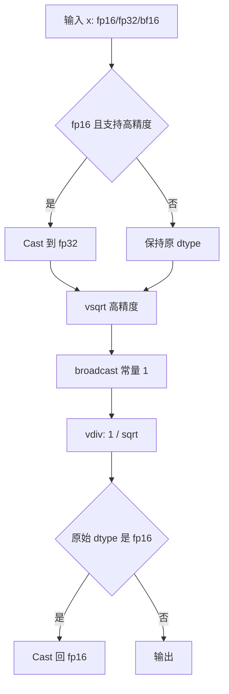
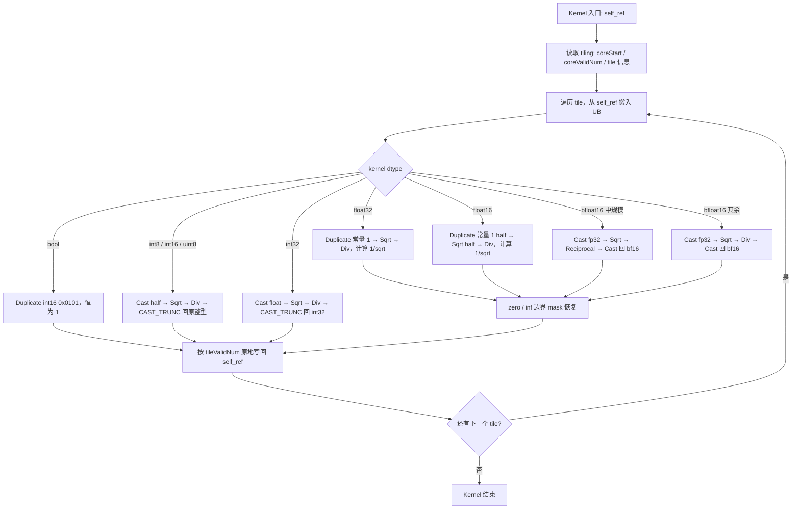

# InplaceRsqrt 算子设计文档

## 1. 需求来源

### 1.1 任务算子

本设计文档对应社区任务 `InplaceRsqrt`，目标是在 `ops-math` 仓 `experimental/math/inplace_rsqrt/` 中以 Ascend C 实现与内置 `aclnnInplaceRsqrt` 功能一致的算子，并验证其计算语义、数据类型、shape 约束与 TBE 参考实现一致。

`InplaceRsqrt` 对 `selfRef` 执行原地倒平方根（reciprocal square root）：

```text
selfRef_i = 1 / sqrt(selfRef_i)
```

`selfRef` 为输入输出复用 Tensor（in-place）。

### 1.2 TBE 源码获取路径

内置 TBE 没有独立的 `InplaceRsqrt` 算子。其计算核心等价于内置 `Rsqrt`，参考实现来自 CANN 内置算子包：

```text
/usr/local/Ascend/ascend-toolkit/latest/opp/built-in/op_impl/ai_core/tbe/impl/ops_legacy/dynamic/rsqrt.py
```

`aclnnInplaceRsqrt` 的对外语义 = `Contiguous` → （非浮点 dtype）`Cast` 到 `float32` → `Rsqrt` 核 → `Cast` 回原 dtype → `ViewCopy` 原地写回 `selfRef`。

### 1.3 参考文件

接口文档：`experimental/math/inplace_rsqrt/docs/aclnnInplaceRsqrt.md`。

## 2. 背景介绍

倒平方根 `1/sqrt(x)` 是归一化（LayerNorm/RMSNorm/BatchNorm 的 invstd）、向量单位化等场景的高频基础算子。in-place 形态直接覆盖输入存储，省去额外输出 tensor 的显存与拷贝。

边界语义（与内置 `Rsqrt`/`aclnnInplaceRsqrt` 对齐，无人工截断）：

| 输入 | 输出 |
| --- | --- |
| `x > 0` | `1/sqrt(x)` |
| `x == +0` / `x == -0` | `+Inf` |
| `x < 0` | `NaN` |
| `x == +Inf` | `+0` |
| `x == NaN` | `NaN` |
| 整型 | Cast 计算后向零截断（trunc）写回原整型 |
| `bool` | 非零视为 `1`（`1/sqrt(1)=1`），即恒为 `1` |

## 3. TBE 算子支持范围

> 内置（TBE）算子现状取证来源（CANN 9.1.0-beta.1）：
> - 算子实现：`opp/built-in/op_impl/ai_core/tbe/impl/ops_legacy/dynamic/rsqrt.py`、`.../ops_legacy/rsqrt.py`；
> - 算子信息库：`opp/built-in/op_impl/ai_core/tbe/config/ascend910b/aic-ascend910b-ops-info-legacy.json`。

### 3.1 内置没有独立的 InplaceRsqrt 算子

在 built-in `opp` 中检索（impl / op-info / op_proto）：**没有任何名为 `InplaceRsqrt`（或 `inplace_rsqrt`）的算子**，只有 `Rsqrt`（及反向 `RsqrtGrad`）。也就是说，内置 `aclnnInplaceRsqrt` 不对应一个独立的“inplace”底层算子，其“原地”语义并不在 TBE 算子层。

### 3.2 内置 `Rsqrt` 算子原型与计算

`Rsqrt` 是**非原地（out-of-place）逐元素算子**，输入输出为两个独立张量：

| 角色 | 名称 | 说明 |
| --- | --- | --- |
| 输入 | `x` | 待计算张量 |
| 输出 | `y` | 结果张量（与 `x` 独立） |

计算：`y = 1 / sqrt(x)`，逐元素，`support_fusion=True, support_bfp16=True`（见 `register_operator_compute("Rsqrt", op_mode="dynamic", ...)`）。

### 3.3 内置 `Rsqrt` 支持的 dtype / format

来自 `aic-ascend910b-ops-info-legacy.json` 的 `Rsqrt` 条目：

| 参数 | dtype | format |
| --- | --- | --- |
| `x`（输入） | `float16`, `float`, `bfloat16` | `ND`（逐元素，format-agnostic） |
| `y`（输出） | `float16`, `float`, `bfloat16` | `ND` |

即内置 `Rsqrt` TBE 算子**仅支持 `float16` / `float32` / `bfloat16`**；`bool`、`int8`、`int16`、`uint8`、`int32` 不在内置算子的直接支持范围内。

### 3.4 “inplace” 语义的真实来源（aclnn L2 层）

由于 TBE 层不存在 inplace 算子，内置 `aclnnInplaceRsqrt` 的“原地”是 **aclnn L2 接口层**的行为：对 `selfRef` 计算 `Rsqrt` 后，将结果写回 `selfRef` 自身的存储（输入即输出），底层仍调用非原地的 `Rsqrt` 算子。

### 3.5 内置 `aclnnInplaceRsqrt` 对整型/bool 的实测行为

当前 CANN 9.1.0-beta.1 的 built-in `aclnnInplaceRsqrt` 对 `bool` / `int8` / `int16` / `uint8` / `int32` 在 `GetWorkspaceSize` 阶段返回 `161002`（dtype 不支持，拒绝）。

> 说明：本任务书要求新算子额外支持整型/bool，属于在内置能力之上的扩展；扩展实现与对应的覆盖/校准口径见本文相应章节。

## 4. TBE 算子实现描述

`rsqrt.py` 计算流程：



## 5. 外部组件依赖

本算子依赖 CANN 算子开发基础设施与 aclnn 两段式接口。

```text
目标仓库:   ops-math
目标目录:   experimental/math/inplace_rsqrt/
验证 CANN:  /usr/local/Ascend/cann-9.1.0-beta.1
目标 SoC:   ascend910b（Atlas A2 训练系列 / Atlas A3 系列）
```

**Public ABI 归属（按算子目录完全分离）**：

```text
experimental/math/rsqrt/          -> 只导出 aclnnRsqrt*
experimental/math/inplace_rsqrt/  -> 只导出 aclnnInplaceRsqrt*
```

`experimental/math/rsqrt/op_api/` 中不保留任何 `aclnnInplaceRsqrt*` 声明或 weak fallback；`experimental/math/inplace_rsqrt/op_api/` 独立提供 `aclnnInplaceRsqrtGetWorkspaceSize` 与 `aclnnInplaceRsqrt`。这样 `rsqrt` standalone、`inplace_rsqrt` standalone 与 `rsqrt,inplace_rsqrt` 双算子合建时符号归属一致，不依赖 weak/strong 覆盖，也不会在 `libcust_opapi.so` 中出现同名 public ABI。

**SoC 等价口径**：实现与 tiling 不硬编码核数、UB 大小等硬件参数，均经平台/tiling 接口获取。满足该条件时，910B/A2 真机功能、精度、性能证据按等价口径覆盖 A3；若后续引入固定核数/UB 或 A2/A3 分支差异，则须补对应 SoC 证据。

## 6. 内部适配模块

| 组件 | 用途 |
| --- | --- |
| `aclnn` 两段式接口 | 对外 API，负责 workspace 计算与 kernel 执行 |
| op_host（proto / tiling） | 参数校验、分核与 tilingKey 选择 |
| op_kernel（AscendC） | 倒平方根计算与原地写回 |

## 7. AscendC 算子原型

| 参数名 | 输入/输出/属性 | 描述 | 使用说明 | 数据类型 | 数据格式 | 维度(shape) | 非连续Tensor |
| --- | --- | --- | --- | --- | --- | --- | --- |
| selfRef | 输入 | 待进行 InplaceRsqrt 原地计算的 Tensor | 支持空 Tensor；shape 需要与 out 一致 | FLOAT、FLOAT16、BFLOAT16、BOOL、INT8、INT16、UINT8、INT32 | ND | 0-8 | 支持 |
| out | 输出 | 计算结果 Tensor | shape 需要与 selfRef 一致；Inplace 语义下与 selfRef 指向同一逻辑输出，执行后原内存被计算结果覆盖 | FLOAT、FLOAT16、BFLOAT16、BOOL、INT8、INT16、UINT8、INT32 | ND | 0-8 | 支持 |

`selfRef` 逐元素计算 `selfRef_i = 1 / sqrt(selfRef_i)`。非连续 Tensor 在 aclnn 层转连续后通过 ViewCopy 写回原视图。代码实现中为适配 IR / OpDef 的标准单输入单输出建模，内部 kernel 输出 `out` 与 `selfRef` 绑定到同一 GM 存储，不改变 inplace 语义。

## 8. AscendC 算子相关约束

| 约束项 | 约束 |
| --- | --- |
| 空指针 | `selfRef` 不能为空 |
| dtype | `float32`, `float16`, `bfloat16`, `bool`, `int8`, `int16`, `uint8`, `int32` |
| shape | 0–8 维 |
| 空 Tensor | 支持（aclnn 第一段接口短路） |
| 非连续 Tensor | 支持（op_api 层转连续后写回原视图） |
| format | `ND` |
| 确定性 | 纯 elementwise，无随机逻辑，结果确定 |

## 9. 使用方式

```cpp
uint64_t workspaceSize = 0;
aclOpExecutor *executor = nullptr;

auto ret = aclnnInplaceRsqrtGetWorkspaceSize(selfRef, &workspaceSize, &executor);

void *workspace = nullptr;
if (workspaceSize > 0) {
    aclrtMalloc(&workspace, workspaceSize, ACL_MEM_MALLOC_HUGE_FIRST);
}

ret = aclnnInplaceRsqrt(workspace, workspaceSize, executor, stream);
aclrtSynchronizeStream(stream);
// 结果原地写回 selfRef
```

## 10. Host 侧设计

### 10.1 参数检查

host tiling 阶段完成：

1. 校验 `selfRef` 描述、shape 指针非空。
2. 校验 dtype 在支持范围内。
3. 空 Tensor 走第一段接口短路，不下发 kernel。

### 10.2 分核策略

将连续输入视为一维数组，按真实元素数 `totalNum = selfRef.numel()` 分核：

```text
coreNum      = min(平台可用核数, totalNum 可切分数)
coreStart    = 当前核起始元素下标
coreValidNum = 当前核负责的元素数
tileValidNum = 单 tile 元素数（含尾块处理）
tailValidNum = 尾 tile 元素数
```

纯 elementwise，按元素切分，各核无写冲突；核数经平台接口获取，不硬编码。

### 10.3 数据分块与 UB 预算

UB 按 dtype 分支规划（保留 double-buffer 的输入/输出 TQue + 计算所需中间缓冲）：

| dtype | 计算精度 | UB 主要缓冲 |
| --- | --- | --- |
| `float32` | fp32 | 输入/输出，sqrt 结果，常量 1 |
| `float16` | **fp16（直算，H026a）** | 输入/输出，sqrt 结果，常量 1（half） |
| `bfloat16` | fp32 中间 | 输入/输出，fp32 中间，fp32 sqrt 结果，fp32 常量 1 |
| `bool` | — | 输入/输出，int16 视图填充 |
| `int8` / `int16` / `uint8` | half 中间 | 输入/输出，half 中间，half sqrt 结果，half 常量 1 |
| `int32` | float 中间 | 输入/输出，float 中间，float sqrt 结果，float 常量 1 |

### 10.4 tilingKey 规划

tilingKey 按 **dtype** 分发到对应计算 kernel；对 `float16` / `bfloat16` 另按 **数据规模 regime** 选择已验证的性能优化分支：

| 维度 | 取值 | 说明 |
| --- | --- | --- |
| dtype key | 8 个 dtype 各一类计算路径 | 见 §11 |
| `float16` regime | 全规模走 direct-half `Duplicate + Sqrt + Div`（H026a） | 去除 fp32 cast bridge，消除 CAST_CONV，保留 double-buffer 交叠 |
| `bfloat16` regime | 中规模（约 8M–32M）走 `Cast(fp32) + Sqrt + Reciprocal`（H020b）；其余走 `Cast(fp32) + Sqrt + Div` | 中规模 reciprocal 缩短 relation 链路 |
| 大规模 fallback | 统一 key0（`Sqrt + Div`） | 大 shape 带宽主导 |

> 阈值与 regime 边界经平台/tiling 接口与 UB 预算推导，不硬编码 A2/A3 差异；性能优化分支均以 AscendOpTest 默认阈值正确性为前置门禁。

## 11. Kernel 侧设计

### 11.1 总体计算流程

kernel 从 `self_ref` 搬入 tile，计算后写回同一段 `self_ref`：



### 11.2 浮点路径

- **float32**：`Duplicate(1.0)` → `Sqrt(x)` → `Div(1, sqrt)`，fp32 全程直算。
- **float16（H026a）**：直接在 half 上 `Duplicate(1.0h)` → `Sqrt(x)` → `Div(1, sqrt)`，**不经 fp32 cast bridge**，省去 CAST_CONV 并保留输入/输出 double-buffer 交叠。
- **bfloat16**：`Cast` 到 fp32 计算后 `Cast` 回 bf16；中规模（约 8M–32M）用 `Sqrt + Reciprocal`（H020b），其余用 `Sqrt + Div`，二者数值均满足 AscendOpTest 默认阈值。

### 11.3 整型 / bool 路径

- **int8 / int16 / uint8**：`Cast` 到 half → `Sqrt` → `Div` → `CAST_TRUNC` 回原整型（向零截断）。
- **int32**：`Cast` 到 float → `Sqrt` → `Div` → `CAST_TRUNC` 回 int32。
- **bool**：非零即 `1`，结果恒为 `1`，用 `Duplicate` 写 `int16` 视图 `0x0101` 实现。

### 11.4 zero / inf 边界处理

浮点（fp16/bf16）在 Newton/计算路径下，`x == 0` 可能被 `0 * Inf` 污染为 `NaN`。kernel 先保存原始 `Rsqrt` 结果，计算后用 mask 恢复：`x == 0` → `±Inf`，原始 `Rsqrt == 0`（来自 `+Inf` 输入）→ `+0`。该处理与 builtin float/fp16/bf16 边界行为对齐。

## 12. 测试标准

测试用例覆盖常规场景与边界场景等全部功能场景；自验证报告完整、可复现，所有用例执行通过。

### 12.1 性能要求

1. 仅要求**所有核参与计算场景**下，性能不低于原 TBE 算子。
2. 若小 shape 无法达标（10us 以下场景相差 3us），提供性能仿真图与分析结论，证明 Ascend C 实现与 TBE 完全一致或优于 TBE。
3. 性能主分析范围限定为可与 builtin/TBE 稳定同场对标的浮点 dtype（`float32` / `float16` / `bfloat16`）；整型/bool 仅作功能、精度与接口覆盖，不计入性能达标分析（正确性由 UT、AscendOpTest 自定义 golden、aclnn example 证明）。

### 12.2 精度要求

算子计算精度需满足 [AscendOpTest](https://gitcode.com/HIT1920/AscendOpTest) 工具默认阈值。

### 12.3 文档与交付

1. 设计文档（本文件）按竞赛模板填写，需通过华为评审。
2. 自验证报告覆盖全部功能场景，含执行日志/截图、整体通过截图、性能数据截图。
3. README 完整规范；fork 仓 `dev_inplace_rsqrt` 含工程代码、README、多组 aclnn 调用测试代码。

> 性能与精度的具体数值结论以自验证报告与证据为准。
