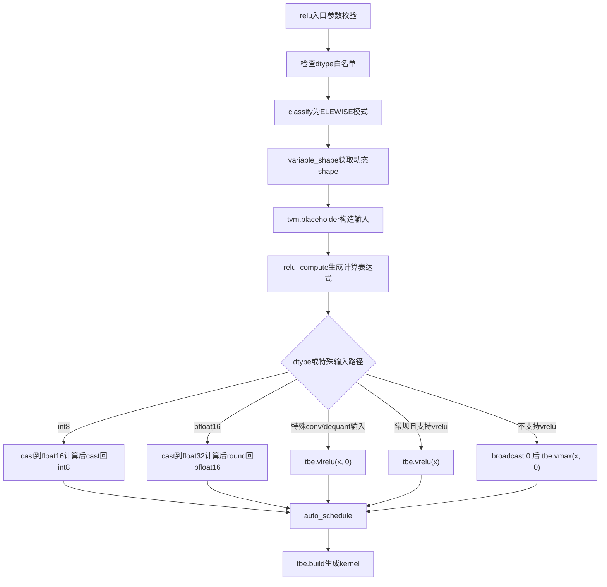
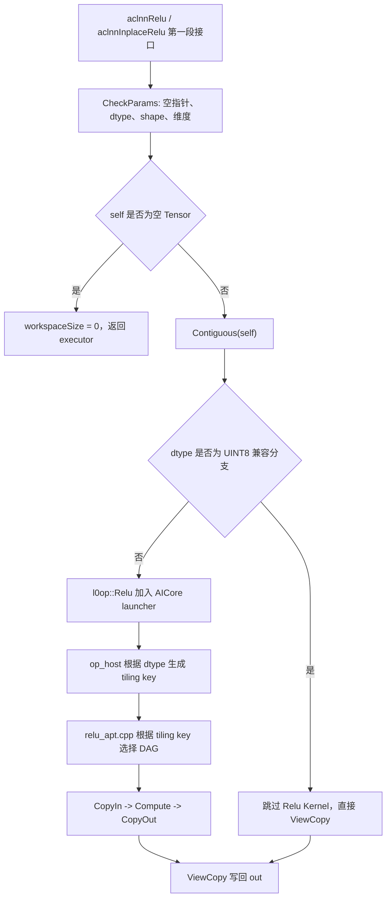

# 【社区任务】Relu算子设计文档

# 一、需求背景（required）

## 需求来源

本需求来源于 CANN 社区任务 2026 中的 `20260529-18 Relu算子开发` 任务。任务要求参考昇腾 CANN 内置 `aclnnRelu` 算子的 TBE 实现，在昇腾 NPU 上基于 Ascend C 编程语言实现功能一致的 Relu 算子，并在原有能力基础上扩展支持 `int16` 数据类型。

任务对应开源仓为 `https://gitcode.com/cann/ops-nn`，目标算子目录为 `activation/relu`。

## 背景介绍

### Relu算子实现优化

Relu 是常用激活函数，逐元素计算输入 Tensor 中每个元素与 0 的最大值。其计算逻辑简单，但在神经网络推理和训练中调用频繁，因此算子实现需要兼顾功能泛化、数据类型覆盖、非连续 Tensor 适配和性能表现。

本次任务基于 Ascend C 对 Relu 算子进行实现与完善，目标是与 CANN 内置 TBE 版本 `aclnnRelu` 的核心功能保持一致，并扩展支持 `INT16` 数据类型。

Relu算子（TBE）实现路径和相关API路径：

Relu算子实现路径为：`/usr/local/Ascend/ascend-toolkit/latest/opp/built-in/op_impl/ai_core/tbe/impl/dynamic`

Relu算子实现中的API路径：`/usr/local/Ascend/ascend-toolkit/latest/python/site-packages/tbe/dsl`


### Relu算子TBE实现现状分析

通过对Relu算子TBE版本的功能分析，当前支持的能力如下：

| 参数 | 参数含义 | 数据类型 | 支持数据类型 | 约束 | 形状 |
| --- | --- | --- | --- | --- | --- |
| self | 输入tensor | tensor | FLOAT、FLOAT16、INT8、INT32、INT64、BFLOAT16 | 默认确定性实现 | 0~8维，(N, ...) |
| out | 输出tensor | tensor | FLOAT、FLOAT16、INT8、INT32、INT64、BFLOAT16 | 默认确定性实现 | shape 与 self 一致，0-8维，(N, ...) |

说明：上表为当前 TBE 版本 Relu 算子的支持能力，当前 TBE 动态实现未包含本任务新增扩展类型 `INT16`。

### Relu算子目标原型

由于当前 TBE 版本 Relu 算子支持的数据类型与本任务要求存在差异，TBE 现状能力不包含 `INT16`，而任务书要求在 Ascend C 实现中扩展支持 `INT16`。因此本任务目标算子原型如下：

| 参数名 | 输入/输出/属性 | 描述 | 使用说明 | 数据类型 | 数据格式 | 维度(shape) | 非连续Tensor |
| --- | --- | --- | --- | --- | --- | --- | --- |
| self | 输入 | 待进行 Relu 计算的入参。 | 支持空 Tensor，shape 需要与 out 一致。 | FLOAT、FLOAT16、INT8、INT16、INT32、INT64、BFLOAT16 | ND | 0-8 | √ |
| out | 输出 | 计算的出参。 | shape 需要与 self 一致。 | FLOAT、FLOAT16、INT8、INT16、INT32、INT64、BFLOAT16 | ND | 0-8 | √ |

计算公式：

$$
relu(self)=
\begin{cases}
self, & self > 0 \\
0, & self \le 0
\end{cases}
$$


### Relu算子功能分析

Relu算子功能：激活函数，返回与输入tensor shape相同的tensor，tensor中value大于等于0时，取该value，小于0，取0。

计算公式：

$$
relu(self)=
\begin{cases}
self, & self > 0 \\
0, & self \le 0
\end{cases}
$$
输入：self

输出：out

原 TBE/开源仓已有 ACLNN 路径支持数据类型：FLOAT、FLOAT16、INT8、INT32、INT64、BFLOAT16。

本任务目标支持数据类型：FLOAT、FLOAT16、INT8、INT16、INT32、INT64、BFLOAT16，其中 INT16 为本次新增扩展类型。

支持广播：不支持


### TBE算子实现描述

根据云开发环境 `cann-8.5.2` 中 `/home/developer/Ascend/cann-8.5.2/opp/built-in/op_impl/ai_core/tbe/impl/ops_legacy/dynamic/relu.py` 源码，TBE版本Relu的核心实现逻辑如下：

1. `relu` 入口函数通过 `para_check.check_op_params` 校验输入、输出和 `kernel_name` 参数。
2. 获取输入 `x` 的 dtype，并通过 `para_check.check_dtype` 校验 dtype。TBE动态实现当前白名单为 `float16`、`float32`、`int8`、`int32`、`bfloat16`、`int64`。
3. 通过 `classify([x], OpPatternMode.ELEWISE)` 按逐元素模式对动态shape输入进行分类。
4. 在每组分类输入中，调用 `shape_util.variable_shape([x])` 获取动态shape，并使用 `tvm.placeholder` 构造输入 Tensor。
5. 调用 `relu_compute` 生成逐元素计算表达式。
6. `relu_compute` 中，若输入 dtype 为 `int8` 且平台支持 `tbe.dsl.cast_to` 的 `s82f16` 能力，则先将输入 cast 到 `float16` 计算，计算后再 cast 回 `int8`。
7. 若输入 dtype 为 `bfloat16`，则先将输入 cast 到 `float32` 计算，计算后通过 `tbe.round` 回写为 `bfloat16`。
8. 对特定 `res_conv2d` 或 `dequant_remove_pad` 输入且平台支持 `tik.vcopy`、非 `int64` 类型时，TBE实现走 `tbe.vlrelu(x, 0)` 路径。
9. 常规场景下，若平台支持 `tbe.dsl.vrelu` 对应 dtype，则调用 `tbe.vrelu(x)` 实现 Relu；否则构造与输入同shape的0常量 Tensor，并通过 `tbe.vmax(x, tensor_zero)` 实现 `max(x, 0)`。
10. 使用 `tbe.auto_schedule(res)` 生成调度，最终通过 `tbe.build(schedules, config)` 生成可执行kernel。

TBE逻辑不涉及广播、归约和跨元素依赖，计算过程本质是逐元素单输入单输出映射。云环境 `cann-8.5.2` 中的TBE动态实现白名单未包含 `int16`，而任务书要求扩展支持 `INT16`，因此本任务需要在Ascend C开源算子实现中补齐对应dtype校验、tiling key和kernel计算路径。

### TBE算子实现流程图



# 二、需求分析（required）

## 需求描述

使用 Ascend C 编程语言实现 Relu 算子，功能与内置 TBE 版本 `aclnnRelu` 保持一致，并扩展支持 `INT16` 数据类型。算子需支持 ND 格式、0-8 维 shape、空 Tensor、非连续 Tensor，以及任务书中列出的全部合法数据类型。

## 需求拆解

1. 对齐原 TBE Relu 算子已有数据类型能力，支持 `FLOAT`、`FLOAT16`、`INT8`、`INT32`、`INT64`、`BFLOAT16` 数据类型。
2. 在原 TBE Relu 算子能力基础上扩展支持`INT16`数据类型
3. 支持 ND 数据格式，支持 0-8 维输入。
4. 支持空 Tensor，支持连续 Tensor 和非连续 Tensor。
5. 输出 shape 与输入 shape 保持一致。
6. 算子为默认确定性实现。
7. 在所有核参与计算场景下，性能不低于原 TBE 算子的 95%；若小 shape 场景无法达标，需补充性能仿真图和分析结论。

## 外部组件依赖

| 组件 | 作用 |
| --- | --- |
| CANN Toolkit | 提供 Ascend C 编译、算子注册、tiling、kernel 构建和运行能力 |
| ACLNN 框架 | 提供两段式 API、executor、workspace 管理和算子调用框架 |
| AscendOpTest | 用于功能、精度和性能自验证 |
| GitCode CANN 开源仓 | 提供算子目录结构、构建框架和 PR 合入流程 |

## 内部适配模块

| 模块 | 适配内容 |
| --- | --- |
| `op_api` | 适配 `aclnnRelu` / `aclnnInplaceRelu` 参数校验、非连续 Tensor 处理和执行器构造 |
| `op_host` | 适配 Relu 算子定义、dtype 注册、tiling key 设置和切分参数生成 |
| `op_kernel` | 适配 Ascend C AICore kernel，实现逐元素 Relu 计算 |
| `op_graph` | 保持 Relu 算子原型与图模式描述一致 |
| `activation/relu/CMakeLists.txt` | 保持 `ACLNNTYPE aclnn_exclude`，使用开源仓已有 ACLNN 接口源码 |
| `tests` | 增加 `INT16` 及泛化场景测试 |

# 三、详细设计（required）

##  算子分析

### 数学公式

Relu 的逐元素公式如下：

$$
relu(self)=
\begin{cases}
self, & self > 0 \\
0, & self \le 0
\end{cases}
$$

### 支持数据类型

FLOAT、FLOAT16、INT8、INT16（本任务新增扩展类型）、INT32、INT64、BFLOAT16

###  支持形状

1. 支持 ND 格式。
2. 支持 0-8 维 Tensor。
3. 支持 scalar，即 0 维 Tensor。
4. 支持空 Tensor。
5. 支持非连续 Tensor。

Relu 不涉及广播，输入和输出 shape 必须一致。

## 算子实现

### 实现方案

本算子在 `ops-nn/activation/relu` 现有实现基础上进行最小增量适配，不重新设计 ACLNN 接口和算子工程结构。整体链路保持为 `aclnn` API 层、L0 算子封装层、Host Tiling 层和 AICore Kernel 层分层实现，重点补齐 `INT16` 从接口校验到 kernel 执行的完整路径。

结合 `ops-nn/activation/relu` 当前目录，计划涉及的主要文件和改动如下：

| 层级 | 参考文件 | 设计改动点 |
| --- | --- | --- |
| ACLNN API | `op_api/aclnn_relu.cpp` | 在 `DTYPE_SUPPORT_LIST` 与 `DTYPE_SUPPORT_LIST_INCLUDE_BF16` 中补充 `DT_INT16`，保留空 Tensor、非连续 Tensor 和 inplace 既有逻辑 |
| L0 封装 | `op_api/relu.cpp` | 沿用 `l0op::Relu`，不新增接口，不改变 launcher 调用方式 |
| 算子定义 | `op_host/relu_def.cpp` | 在输入 `x`、输出 `y` 的 dtype 列表中增加 `ge::DT_INT16`，format 保持 `ND` |
| Host Tiling | `op_host/arch35/relu_tiling_arch35.cpp` | 增加 `INT16` tiling 分支，设置新增 tiling key |
| Kernel DAG | `op_kernel/arch35/relu_dag.h` | 复用现有 `GraphRelu<U, T>` 模板，新增 `GraphRelu<int16_t, int32_t>` 实例化路径 |
| AICore Kernel | `op_kernel/relu_apt.cpp` | 增加 `INT16` tiling key 对应的 `ElementwiseSch16B` dispatch 分支 |
| 二进制配置 | `op_host/config/ascend950/relu_binary.json` | 增加 `INT16`、`ND` 对应配置，使其匹配 `relu_apt` kernel |
| 文档与测试 | `README.md`、`docs/aclnnRelu&aclnnInplaceRelu.md`、`tests` | 同步补充 `INT16` 能力说明和自验证用例 |

### 使能方式

本算子主要通过 ACLNN 两段式接口使能。`ops-nn` 开源仓中 `activation/relu/op_api` 已提供 `aclnnRelu` 和 `aclnnInplaceRelu` 源码，因此本任务不重新生成 ACLNN 接口代码，而是在既有源码基础上做增量适配。

开源仓当前 `activation/relu/README.md` 和 `docs/aclnnRelu&aclnnInplaceRelu.md` 中列出的 ACLNN 支持类型为 `FLOAT`、`FLOAT16`、`INT8`、`INT32`、`INT64`、`BFLOAT16`；`op_api/aclnn_relu.cpp` 中 `DTYPE_SUPPORT_LIST` 与 `DTYPE_SUPPORT_LIST_INCLUDE_BF16` 当前未包含 `DT_INT16`。图模式原型 `op_graph/relu_proto.h` 已包含 `DT_INT16`。因此本任务的重点是补齐 ACLNN/Ascend C 执行链路的 `INT16` 支持，并同步 README、API 文档和测试用例。

已有 ACLNN 接口如下：

```cpp
aclnnReluGetWorkspaceSize(self, out, workspaceSize, executor);
aclnnRelu(workspace, workspaceSize, executor, stream);
```

原地接口通过 `selfRef` 同时作为输入和输出：

```cpp
aclnnInplaceReluGetWorkspaceSize(selfRef, workspaceSize, executor);
aclnnInplaceRelu(workspace, workspaceSize, executor, stream);
```

L0 层通过 `l0op::Relu` 将 Relu AICore kernel 加入执行器调度列表。

`activation/relu/CMakeLists.txt` 中保持 `ACLNNTYPE aclnn_exclude` 配置，避免构建流程重新生成 ACLNN 接口并覆盖既有 `op_api` 源码。

```cmake
add_modules_sources(
    HOSTNAME ${OPHOST_NAME}
    MODE PRIVATE
    DIR ${CMAKE_CURRENT_SOURCE_DIR}
    OPTYPE relu
    ACLNNTYPE aclnn_exclude
    COMPUTE_UNIT ${SUPPORT_COMPUTE_UNIT}
    TILING_DIR ${SUPPORT_TILING_DIR}
    DISABLE_IN_OPP TRUE
)
```

#### 3.2.1 host侧设计

##### API参数校验

`op_api/aclnn_relu.cpp` 中 `aclnnRelu` 与 `aclnnInplaceRelu` 均进入 `ExecReluGetWorkspaceSize`。API 层沿用当前校验顺序，仅扩展 dtype 支持列表：

1. `self` 和 `out` 不为空。
2. `self` 的 dtype 在支持列表中。
3. `self` 与 `out` 的 dtype 保持一致。
4. `self` 与 `out` 的 shape 保持一致。
5. `self` 和 `out` 的维度数不超过 8。

支持 dtype 列表：

```text
FLOAT, FLOAT16, INT8, INT16, INT32, INT64, BFLOAT16
```

其中 `BFLOAT16` 继续沿用现有平台能力判断逻辑；`INT16` 新增到 `DTYPE_SUPPORT_LIST` 与 `DTYPE_SUPPORT_LIST_INCLUDE_BF16`。已有 `DT_UINT8` 兼容逻辑保持不变，但 `UINT8` 不作为本任务新增验收类型。

##### 空Tensor和非连续Tensor处理

若 `self` 为空 Tensor，则无需加入 AICore Kernel 计算，workspace size 返回 0，并直接构造执行器返回。

API 层对输入 `self` 调用 `Contiguous`，将非连续输入转换为连续 Tensor 后送入 Relu 计算。计算完成后通过 `ViewCopy` 将结果写回 `out`，以支持输出为非连续 Tensor 的场景。

```text
self -> Contiguous(self) -> l0op::Relu -> ViewCopy(reluOut, out)
```

因此 Kernel 侧只需要处理连续 ND 数据，非连续输入和非连续输出语义由 ACLNN 层保证。

##### 算子定义与二进制配置

`op_host/relu_def.cpp` 中 `Input("x")` 和 `Output("y")` 的 dtype 列表需要同步增加 `ge::DT_INT16`，对应 `Format` 和 `UnknownShapeFormat` 继续使用 `ge::FORMAT_ND`。该修改用于保证 Host 注册能力与任务书中的 `INT16 + ND + 0-8维` 要求一致。

`op_host/config/ascend950/relu_binary.json` 中增加 `INT16` 条目，使 `INT16` 输入可以匹配到 `relu_apt` kernel。已有 `FLOAT`、`FLOAT16`、`INT8`、`INT32`、`INT64`、`BFLOAT16` 配置保持不变。

##### Tiling策略

Relu 是逐元素单输入单输出算子，不涉及广播、归约和轴参数。Host Tiling 将 Tensor 展平为一维连续数据，根据总元素数、UB 大小、硬件核数和 elementwise 调度模板生成切分参数。

记输入总元素个数为：

```text
totalLength = NumElements(self)
```

`op_host/arch35/relu_tiling_arch35.cpp` 中继续使用 `EleBaseTilingData16B` 和 `ElewiseBaseTiling`：

```text
tilingData = EleBaseTilingData16B
blockDim = ElewiseBaseTiling.GetBlockDim()
workspaceSize = 16 MB
```

分核、UB 分块、尾块处理由 `ElewiseBaseTiling.DoTiling<...>()` 与 `ElementwiseSch16B` 模板统一完成。Host 侧仅根据输出 dtype 选择对应 DAG，并设置 tiling key。

对 `INT16` 路径，LocalMemory 使用与 tile 大小可按输入、输出和中间计算类型估算：

```text
tileElements <= floor(availableUbBytes / (sizeof(int16_t) + sizeof(int32_t) + sizeof(int16_t)))
```

##### tiling key规划

Kernel 侧根据 dtype 选择不同 DAG 路径，tiling key 规划如下：

| tiling key | 数据类型 | Host Tiling DAG | Kernel DAG |
| --- | --- | --- | --- |
| 101 | FLOAT16 | `GraphRelu<half, half>` | `GraphRelu<half, half>` |
| 102 | BFLOAT16 | `GraphRelu<half, float>` | `GraphRelu<bfloat16_t, float>` |
| 103 | FLOAT | `GraphRelu<float, float>` | `GraphRelu<float, float>` |
| 104 | INT8 | `GraphRelu<int8_t, half>` | `GraphRelu<int8_t, half>` |
| 105 | INT32 | `GraphRelu<int32_t, int32_t>` | `GraphRelu<int32_t, int32_t>` |
| 106 | INT64 | `GraphReluMax<int64_t>` | `GraphReluMax<int64_t>` |
| 107 | INT16 | `GraphRelu<int16_t, int32_t>` | `GraphRelu<int16_t, int32_t>` |

`INT16` 使用 `INT32` 作为中间计算类型，主要原因是 `INT16` 的数值范围大于 `FLOAT16` 的整数精确表示范围，使用 `INT32` 可避免大整数在 cast 过程中产生精度损失。

#### 3.2.2 kernel侧设计

Kernel 入口沿用 `op_kernel/relu_apt.cpp`：

```cpp
extern "C" __global__ __aicore__ void relu(GM_ADDR x, GM_ADDR y, GM_ADDR workspace, GM_ADDR tiling)
```

Kernel 读取 `EleBaseTilingData16B`，设置 `KERNEL_TYPE_AIV_ONLY`，再根据 tiling key 选择对应的 `ElementwiseSch16B` 调度分支。新增 `INT16` 后，dispatch 逻辑增加：

```cpp
ElementwiseSch16B<0UL, GraphRelu<int16_t, int32_t>::OpDag> sch(tilingData);
sch.Init(x, y);
sch.Process();
```

对 FLOAT、FLOAT16、BFLOAT16、INT8、INT16、INT32 类型，使用统一的 `GraphRelu<U, T>` 计算图：

```text
CopyIn<U> -> Cast<T, U> -> Relu<T> -> Cast<U, T> -> CopyOut<U>
```

其中 `U` 为输入输出 dtype，`T` 为中间计算 dtype。

对 INT64 类型，继续使用现有 `GraphReluMax<int64_t>` 计算图：

```text
CopyIn<int64_t> -> Maxs<int64_t>(0) -> CopyOut<int64_t>
```

`INT16` 不新增独立 DAG，只实例化现有 `GraphRelu` 模板，减少改动范围，并使搬运、尾块处理、对齐处理继续由 `ElementwiseSch16B` 统一管理。

### AscendC实现流程图



### AscendC实现流程图与TBE流程图差异点和原因

| 差异点 | TBE 实现 | Ascend C 实现 | 原因 |
| --- | --- | --- | --- |
| 计算描述方式 | TBE DSL 中通过 `vrelu` 或 `vmax(x, 0)` 表达 | Ascend C 中通过 `GraphRelu` / `GraphReluMax` DAG 表达 | 开源仓当前 Relu 已采用 elementwise DAG 框架 |
| 调度方式 | `classify` + `auto_schedule` + `tbe.build` | Host Tiling 设置 `EleBaseTilingData16B`、`blockDim` 和 tiling key | Ascend C 需要显式区分 dtype kernel 分支 |
| `INT16` 支持 | 云环境 TBE 动态实现白名单未覆盖 `int16`，任务要求扩展 | 新增 API dtype、op_host dtype、tiling key 107 和 kernel dispatch | 补齐社区任务要求的新增 dtype |
| 非连续 Tensor | 由 ACLNN/TBE 调用链适配 | `Contiguous(self)` + `ViewCopy(reluOut, out)` | 保持对非连续输入输出的支持，同时简化 Kernel 侧逻辑 |
| 空 Tensor | 不进入实际计算 | API 层短路返回，workspace 为 0 | 避免无效 kernel launch，保持确定性 |
| 整型中间计算 | TBE 已有 `INT8` 特殊 cast，`INT64` 独立处理 | `INT16` 使用 `INT32` 中间类型，`INT64` 保持 `Maxs` 路径 | 保证整型结果精确，避免 `FLOAT16` 中间类型导致误差 |

## 支持硬件

Atlas A2 训练系列产品/Atlas A3 系列产品


## 算子约束限制

1. `self` 与 `out` 的 dtype 必须一致。
2. `self` 与 `out` 的 shape 必须一致。
3. 支持 ND 格式，不支持广播。
4. 支持 0-8 维输入，超过 8 维返回参数错误。
5. 支持空 Tensor，支持非连续 Tensor。
6. 默认确定性实现。

# 四、可维可测分析

## 精度标准/性能标准

| 验收标准 | 描述 | 标准来源 |
| --- | --- | --- |
| 精度标准 | 精度满足 AscendOpTest 默认阈值；整型按精确结果比对，浮点按工具默认阈值。 | Relu 算子开发任务书性能要求；TBE Relu 算子实现 |
| 性能标准 | 在所有核参与计算场景下，Ascend C 实现性能不低于原 TBE Relu 算子的 95%；若小 shape 场景无法达标，需补充性能仿真图和分析结论。 | Relu 算子开发任务书性能要求 |


## 兼容性分析

新算子，不涉及兼容性分析
