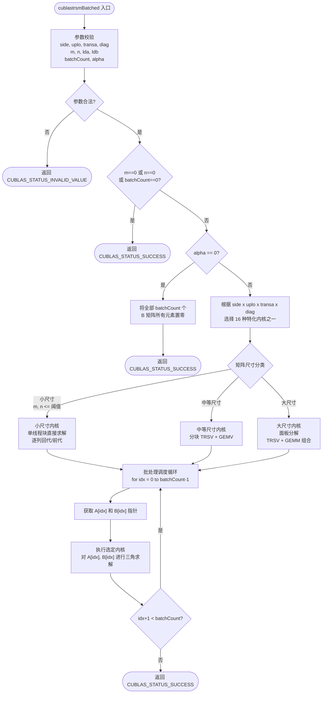
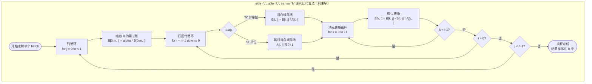
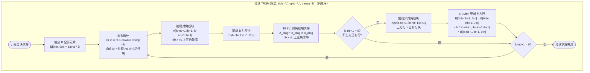
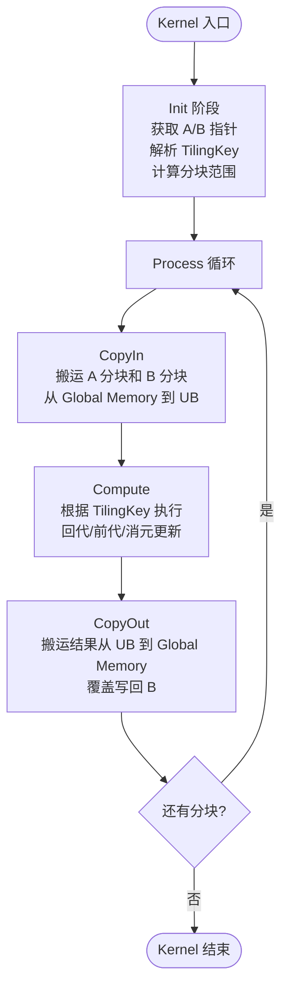

# 需求背景（required）

## 需求来源

基于昇腾算子开源仓社区任务需求，实现三角矩阵求解运算系列算子 `aclblasStrsmBatched`（单精度实数）和 `aclblasCtrsmBatched`（单精度复数），对标 cuBLAS 库中 `cublasStrsmBatched` / `cublasCtrsmBatched` 接口。

## 背景介绍

### TRSM Batched 算子实现

三角矩阵求解（TRSM, Triangular Solving Matrix）是 BLAS Level 3 标准操作之一，广泛应用于科学计算、数值线性代数和深度学习等领域。在深度学习训练推理过程中，涉及大量的矩阵运算，其中三角矩阵求解是 Cholesky 分解求逆、LU 分解回代等关键算法的核心步骤。TRSM Batched 批量版本允许同时处理多个相同尺寸的三角求解问题，显著提升计算效率。

cuBLAS 库中的 `cublas<t>trsmBatched` 接口提供了 GPU 上高效的批量三角矩阵求解实现（https://docs.nvidia.com/cuda/cublas/index.html#2.7.12）。本任务旨在将该功能移植到昇腾 NPU 平台上，使用 Ascend C 编程语言实现功能一致的算子。

TRSM Batched 算子相关资源路径：

- 算子开源仓：https://gitcode.com/cann/ops-blas/tree/master/experimental
- 参考代码样例：https://gitcode.com/cann/ops-blas/tree/master/experimental
- Ascend C 开发文档：https://www.hiascend.com/document/detail/zh/CANNCommunityEdition/850/opdevg/Ascendcopdevg/atlas_ascendc_map_10_0002.html
- Ascend C API 文档：https://www.hiascend.com/document/detail/zh/canncommercial/850/API/ascendcopapi/atlasascendc_api_07_0003.html

### TRSM Batched 算子功能分析

TRSM Batched 算子功能：批量求解三角线性方程组。

- **左乘模式**（side='L'）：求解 op(A) · X = alpha · B
- **右乘模式**（side='R'）：求解 X · op(A) = alpha · B

输入：三角矩阵 A（批处理指针数组）、矩阵 B（批处理指针数组）、标量 alpha、模式参数（side/uplo/transa/diag）

输出：求解结果矩阵 X，结果覆盖写回 B

支持数据类型：float32（StrsmBatched）、complex64 / complex\<float\>（CtrsmBatched）

数据格式：行主序（Row-Major）

| 参数 | 参数含义 | 数据类型 | 支持数据类型 | 约束 | 形状 |
| --- | --- | --- | --- | --- | --- |
| side | 乘法方向 | char | 'L', 'R' | 必选 | - |
| uplo | 三角矩阵类型 | char | 'U', 'L' | 必选 | - |
| transa | 转置模式 | char | 'N', 'T' | 必选 | - |
| diag | 对角线模式 | char | 'U', 'N' | 必选 | - |
| m | 矩阵 B 行数 | int | - | m >= 0 | - |
| n | 矩阵 B 列数 | int | - | n >= 0 | - |
| alpha | 标量乘子 | float / complex | - | 无 | 标量 |
| a[] | 三角矩阵 A 批处理 | 指针数组 | float32 / complex64 | - | A: m x m(L) 或 n x n(R) |
| lda | A 的前导维度 | int | - | lda >= max(1,m)(L) 或 >= max(1,n)(R) | - |
| b[] | 矩阵 B 批处理 | 指针数组 | float32 / complex64 | - | B: m x n |
| ldb | B 的前导维度 | int | - | ldb >= max(1,n) | - |
| batchCount | 批处理数量 | int | - | batchCount >= 0 | - |

# 需求分析（required）

## 需求描述

使用 Ascend C 编程语言实现 `aclblasStrsmBatched`（单精度实数）和 `aclblasCtrsmBatched`（单精度复数）算子，对标 cuBLAS `cublasStrsmBatched` / `cublasCtrsmBatched`，支持全部 16 种模式组合（side x uplo x transa x diag），支持批处理功能，数据格式为行主序。

## 需求拆解

1. 支持 float32 和 complex\<float\>（complex64）两种数据类型
2. 支持 16 种模式组合：side('L','R') x uplo('U','L') x transa('N','T') x diag('U','N')
3. 支持批处理功能（batchCount > 0）
4. 数据格式为行主序（Row-Major）
5. 实现算子泛化功能，满足各类合法输入场景的计算需求，验收阶段将采用泛化数据进行验收
6. 算子整体性能需与 0.8 倍 GPU（A100）持平
7. 精度需满足 AscendOpTest 工具默认阈值

# 详细设计（required）

## 算子分析

### 数学公式

TRSM 求解批量三角线性方程组：

**左乘模式（side='L'）**：

```
op(A) · X = alpha · B
```

其中：
- A 为 m x m 三角矩阵（行主序存储，前导维度 lda）
- B 为 m x n 矩阵（行主序存储，前导维度 ldb）
- X 为 m x n 未知矩阵（结果覆盖写回 B）
- op(A) = A（transa='N'）或 op(A) = A^T（transa='T'）

**右乘模式（side='R'）**：

```
X · op(A) = alpha · B
```

其中：
- A 为 n x n 三角矩阵（行主序存储，前导维度 lda）
- B 为 m x n 矩阵（行主序存储，前导维度 ldb）
- X 为 m x n 未知矩阵（结果覆盖写回 B）
- op(A) = A（transa='N'）或 op(A) = A^T（transa='T'）

### 支持数据类型

| 算子名称 | 输入数据类型 | 输出数据类型 |
| --- | --- | --- |
| aclblasStrsmBatched | float32 | float32 |
| aclblasCtrsmBatched | complex64 (complex\<float\>) | complex64 (complex\<float\>) |

### 支持形状/模式组合

算子支持 side、uplo、transa、diag 四个维度的模式组合，共 16 种：

| side | uplo | transa | diag | 说明 |
| --- | --- | --- | --- | --- |
| 'L' | 'U' | 'N' | 'U' / 'N' | 左乘，上三角，不转置 |
| 'L' | 'U' | 'T' | 'U' / 'N' | 左乘，上三角，转置 |
| 'L' | 'L' | 'N' | 'U' / 'N' | 左乘，下三角，不转置 |
| 'L' | 'L' | 'T' | 'U' / 'N' | 左乘，下三角，转置 |
| 'R' | 'U' | 'N' | 'U' / 'N' | 右乘，上三角，不转置 |
| 'R' | 'U' | 'T' | 'U' / 'N' | 右乘，上三角，转置 |
| 'R' | 'L' | 'N' | 'U' / 'N' | 右乘，下三角，不转置 |
| 'R' | 'L' | 'T' | 'U' / 'N' | 右乘，下三角，转置 |

## cuBLAS trsmBatched 实现流程分析

以下流程图描述了 cuBLAS 库中 `cublas<t>trsmBatched` 的实现流程，包括总体调度流程、核心求解算法流程和分块求解算法流程。cuBLAS 内部采用列主序（Column-Major）存储，以下算法描述基于列主序视角。本算子在 Ascend C 上的实现将适配为行主序（Row-Major）。

### 总体调度流程图



### 核心求解算法流程图

以 `side='L', uplo='U', transa='N', diag='N'` 为例（列主序视角），展示 cuBLAS 逐列回代求解的核心算法流程。此为上三角矩阵回代（back substitution），从矩阵最后一行向前逐行消元：



### 分块求解算法流程图

cuBLAS 对大尺寸矩阵采用分块（Blocked / Panel-based）算法，将 TRSM 分解为 TRSV（三角向量求解）和 GEMM（通用矩阵乘法）子操作，以提高数据重用和计算效率。以下以 `side='L', uplo='U', transa='N'` 为例：



### 各模式组合求解方向总结

cuBLAS trsmBatched 根据 side、uplo、transa 的组合确定求解方向和循环顺序，以下为 8 种核心组合（diag 仅影响是否执行对角线除法）：

| 组合 | side | uplo | transa | 求解方向 | 循环顺序 | 算法类型 |
| --- | --- | --- | --- | --- | --- | --- |
| 1 | L | U | N | 自底向上（按行） | j:0->n-1, i:m-1->0 | 回代 |
| 2 | L | U | T | 自顶向下（按行） | j:0->n-1, i:0->m-1 | 前代 |
| 3 | L | L | N | 自顶向下（按行） | j:0->n-1, i:0->m-1 | 前代 |
| 4 | L | L | T | 自底向上（按行） | j:0->n-1, i:m-1->0 | 回代 |
| 5 | R | U | N | 自右向左（按列） | i:0->m-1, j:n-1->0 | 回代 |
| 6 | R | U | T | 自左向右（按列） | i:0->m-1, j:0->n-1 | 前代 |
| 7 | R | L | N | 自左向右（按列） | i:0->m-1, j:0->n-1 | 前代 |
| 8 | R | L | T | 自右向左（按列） | i:0->m-1, j:n-1->0 | 回代 |

## 算子实现

### 实现方案

#### host 侧设计

##### 1. Tiling 策略

TRSM Batched 算子的 Tiling 需要考虑三个维度的切分：**批处理维度（batchCount）**、**求解维度（B 的列/行）**和 **三角矩阵维度（A 的分块）**。

**批处理维度切分**：

- 将 batchCount 个求解任务分配到多个 AI Core 上
- 每个 AI Core 处理一个或多个 batch
- 优先均分，余数分配到前几个 Core

**矩阵维度切分**：

- 左乘模式（side='L'）：对 B 的列维度（n）进行切分，不同列可以独立求解
- 右乘模式（side='R'）：对 B 的行维度（m）进行切分，不同行可以独立求解
- 三角矩阵 A 的行/列维度切分需要保证数据依赖关系（回代/前代的顺序性）

**UB 空间规划**：

- 需要在 UB 中存储：三角矩阵 A 的分块数据、矩阵 B 的分块数据、临时计算结果
- UB 空间分配需考虑：A 的分块（nb x nb）、B 的分块（nb x n_col_tile 或 m_row_tile x nb）、临时向量

##### 2. 分核策略

优先使用满核的原则。

**分配方式**：

- Level 1（外层）：按 batchCount 均分到各 AI Core
- Level 2（内层）：单个 batch 内，按 B 的可并行维度（左乘为列维度 n，右乘为行维度 m）切分

如果 batchCount >= AI Core 数量，每个 Core 处理一个或多个 batch；
如果 batchCount < AI Core 数量，多个 Core 协作处理同一个 batch 的不同列/行。

输入数据大小计算：根据 m、n、lda、ldb、batchCount 和数据类型长度，计算输入数据总字节数。

UB 内存大小和核心数量获取：通过平台信息接口获取 UB 内存大小和核心数量。

##### 3. 数据分块和内存优化策略

充分使用 UB 空间的原则。

**分块大小计算**：

- 根据 UB 总大小，计算可容纳的最大分块大小 nb
- UB 需要容纳：A 分块（nb x nb）、B 分块（nb x n_tile 或 m_tile x nb）、临时结果空间
- nb 的计算需综合考虑：Double Buffer 占用、临时数据存储、不同硬件的 UB 大小差异

**Double Buffer 优化**：

- 使用 Double Buffer 重叠计算和数据搬运
- 当前分块计算的同时，预取下一个分块的数据

**尾块处理**：

- 对于不能整除的分块，最后一个分块可能小于 nb
- 尾块处理逻辑确保不完整分块也能正确计算

设置切分参数：将计算出的切分参数（batch 维度、列/行维度、分块大小 nb 等）设置到 TilingData 对象中。

##### 4. TilingKey 规划策略

需要感知 host 侧信息对 kernel 侧走不同分支。通过 TilingKey 编码 side x uplo x transa x diag 的 16 种组合，kernel 侧根据 TilingKey 选择对应的求解内核。

**TilingKey 编码方案**：

`tilingKey = (side_code << 3) | (uplo_code << 2) | (transa_code << 1) | diag_code`

其中 side_code: L=0, R=1；uplo_code: U=0, L=1；transa_code: N=0, T=1；diag_code: N=0, U=1。

| TilingKey | side | uplo | transa | diag | 求解算法 |
| --- | --- | --- | --- | --- | --- |
| 0 | L | U | N | N | 上三角回代（非单位） |
| 1 | L | U | N | U | 上三角回代（单位） |
| 2 | L | U | T | N | 上三角转置前代（非单位） |
| 3 | L | U | T | U | 上三角转置前代（单位） |
| 4 | L | L | N | N | 下三角前代（非单位） |
| 5 | L | L | N | U | 下三角前代（单位） |
| 6 | L | L | T | N | 下三角转置回代（非单位） |
| 7 | L | L | T | U | 下三角转置回代（单位） |
| 8 | R | U | N | N | 右乘上三角回代（非单位） |
| 9 | R | U | N | U | 右乘上三角回代（单位） |
| 10 | R | U | T | N | 右乘上三角转置前代（非单位） |
| 11 | R | U | T | U | 右乘上三角转置前代（单位） |
| 12 | R | L | N | N | 右乘下三角前代（非单位） |
| 13 | R | L | N | U | 右乘下三角前代（单位） |
| 14 | R | L | T | N | 右乘下三角转置回代（非单位） |
| 15 | R | L | T | U | 右乘下三角转置回代（单位） |

#### kernel 侧设计

进行 Init 和 Process 两个阶段，其中 Process 包括数据搬入（CopyIn）、计算（Compute）、搬出（CopyOut）三个阶段。

##### 1. Init 阶段

- 从 Global Memory 获取当前 batch 的 A 和 B 矩阵指针
- 根据 TilingKey 确定当前分支的求解模式（side/uplo/transa/diag 组合）
- 计算当前 Core 负责的分块范围

##### 2. CopyIn 阶段

- **左乘模式**：从 Global Memory 搬入当前分块对应的 A 行数据和 B 列数据到 UB
- **右乘模式**：从 Global Memory 搬入当前分块对应的 A 列数据和 B 行数据到 UB
- 使用 Double Buffer 预取下一分块数据

##### 3. Compute 阶段

根据 TilingKey 执行对应的求解算法：

**回代算法（back substitution）**：

用于 uplo='U', transa='N'（左乘）或 uplo='L', transa='T'（左乘）等情况。从最后一行/列开始，逐行/列向前求解，每步执行：对角线除法 + 秩-1 更新。

**前代算法（forward substitution）**：

用于 uplo='L', transa='N'（左乘）或 uplo='U', transa='T'（左乘）等情况。从第一行/列开始，逐行/列向后求解，每步执行：对角线除法 + 秩-1 更新。

**复数运算处理（CtrsmBatched）**：

- 复数乘法：(a+bi)(c+di) = (ac-bd) + (ad+bc)i
- 复数除法：(a+bi)/(c+di) = ((ac+bd) + (bc-ad)i) / (c^2+d^2)
- 使用 Ascend C 向量化 API 进行复数运算以提高效率

##### 4. CopyOut 阶段

- 将 UB 中计算完成的 B 分块结果写回 Global Memory
- 确保结果覆盖写入原 B 矩阵的正确位置

##### 5. Kernel 侧流程图



## 支持硬件

| 支持的芯片版本 | 涉及勾选 |
| --- | --- |
| Atlas 800I/T A2 | √ |

## 算子约束限制

1. 仅支持行主序（Row-Major）数据格式
2. batchCount >= 0，m >= 0，n >= 0
3. lda >= max(1, m)（左乘）或 lda >= max(1, n)（右乘）
4. ldb >= max(1, n)
5. 当 batchCount = 0 或 m = 0 或 n = 0 时，直接返回
6. 当 alpha = 0 时，将 B 所有元素置零后返回

# 可维可测分析

## 精度标准/性能标准

| 验收标准 | 描述 | 标准来源 |
| --- | --- | --- |
| 精度标准 | 需满足 AscendOpTest 工具默认阈值 | AscendOpTest |
| 性能标准 | 算子整体性能需与 0.8 倍 GPU（A100）持平 | 任务要求 |

**性能基准数据（GPU A100）**：

StrsmBatched（单精度实数）：

| M | N | batchCount | side | uplo | transa | diag | GPU A100 耗时(ms) | GPU A100 GFLOPS | NPU 目标 GFLOPS |
| --- | --- | --- | --- | --- | --- | --- | --- | --- | --- |
| 64 | 64 | 32 | L | U | N | N | 0.035 | 80.1 | 64.1 |
| 128 | 128 | 16 | L | U | N | N | 0.076 | 147.8 | 118.2 |
| 64 | 64 | 32 | R | L | T | U | 0.021 | 133.0 | 106.4 |
| 128 | 128 | 16 | R | L | T | U | 0.058 | 194.4 | 155.5 |

CtrsmBatched（单精度复数）：

| M | N | batchCount | side | uplo | transa | diag | GPU A100 耗时(ms) | GPU A100 GFLOPS | NPU 目标 GFLOPS |
| --- | --- | --- | --- | --- | --- | --- | --- | --- | --- |
| 64 | 64 | 32 | L | U | N | N | 0.031 | 366.2 | 293.0 |
| 128 | 128 | 16 | L | U | N | N | 0.076 | 591.5 | 473.2 |
| 64 | 64 | 32 | R | L | T | U | 0.023 | 485.0 | 388.0 |
| 128 | 128 | 16 | R | L | T | U | 0.062 | 726.8 | 581.4 |

## 兼容性分析

新算子，不涉及兼容性分析。
