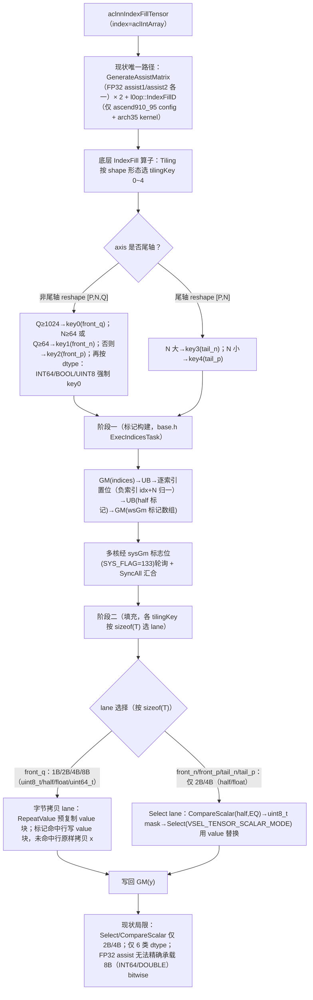
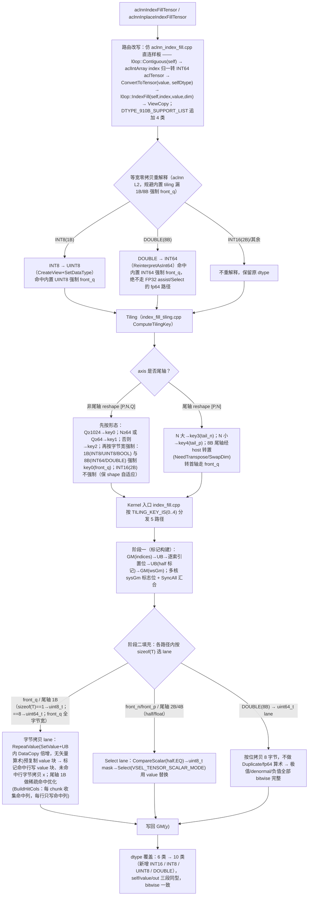

# 需求背景（required）

> 竞赛交付设计文档。算子 `index_fill_tensor`（再开发 ops-nn 8.5.0 已有 AscendC 算子 `IndexFill`，新增 INT16/INT8/UINT8/DOUBLE）。

## 需求来源

当前 CANN 的 `aclnnIndexFillTensor` / `aclnnInplaceIndexFillTensor` 接口（对应 AscendC 算子 `IndexFill`，ops-nn `index/index_fill/`）在 Atlas A2（910B）/ Atlas A3 上**仅支持** FLOAT16、FLOAT、BFLOAT16、INT32、INT64、BOOL 共 6 种数据类型，**不支持** INT16、INT8、UINT8、DOUBLE。业务需要对上述 4 种类型调用 IndexFillTensor，故需在已有 AscendC 算子 `IndexFill` 代码上**再开发**，新增这 4 种 dtype 支持，并放开 aclnn 接口侧的 dtype 校验。

- 语义对标：PyTorch `Tensor.index_fill_` / `torch.index_fill`。
- 任务类型：**算子扩展**（基于已有开源算子新增 dtype 支持，非从零新建）。
- 目标仓：ops-nn（gitcode `cann/ops-nn`，8.5.0 分支），最终 PR 至 `experimental/index`。

## 背景介绍

### IndexFill 算子实现现状分析

`IndexFill` 是 ops-nn 已有的手写 AscendC 搬移/填充类算子。8.5.0 分支工程结构（已逐文件核对真实源码）：

- `index_fill/op_host/`：扁平结构（无 arch 子目录）—— `index_fill_def.cpp`（算子信息库）、`index_fill_tiling.cpp` + `index_fill_tiling.h`（Tiling）。
- `index_fill/op_kernel/`：6 个文件 —— 入口 `index_fill.cpp` + 基类 `index_fill_base.h` + 5 个 kernel 头 `index_fill_{front_q,front_n,front_p,tail_n,tail_p}.h`。
- aclnn L2 接口位于 `index_fill_d/op_api/aclnn_index_fill_tensor.cpp`（入参 index 为 `aclIntArray*`）；同目录另有 `aclnn_index_fill.cpp`（入参 index 为 `aclTensor*`，已直连 `l0op::IndexFill`，是本任务路由改写的参照样板）。

`IndexFill` 算子信息库当前仅在 `index_fill_def.cpp` 注册 6 类 `xDataType`（FLOAT16/FLOAT/BF16/INT64/INT32/BOOL），910b 与 910_93 两个 config 共用该顶层数组；aclnn 侧 `DTYPE_910B_SUPPORT_LIST` 同为 6 类。

### IndexFill 算子功能分析

- **功能**：沿输入 `self` 的给定轴 `dim`，把 `index` 指定下标处的元素整体替换为标量 `value`（value 以 `self` 的 dtype 原样写入）。
- **类别**：数据搬移/填充类算子，**不含数值计算**（无算术、无 Cast 计算语义）。
- **输入**：self、dim（属性）、index、value；**输出**：out（与 self 同 shape/dtype）。
- **现状支持数据类型**：FLOAT16、FLOAT、BFLOAT16、INT32、INT64、BOOL。
- **支持形状**：0-8 维，ND，支持非连续（aclnn 侧 `l0op::Contiguous` 转连续）。

### IndexFill 算子现有 AscendC 实现的整体流程图

下图反映基线 `IndexFill`（ops-nn 8.5.0，本地镜像 `baseline/index_fill/`）现有 AscendC 实现的真实执行流：`aclnnIndexFillTensor`（index=aclIntArray）现状唯一路径经 `GenerateAssistMatrix`（**FP32** assist 矩阵 ×2）+ `l0op::IndexFillD`（仅 `ascend910_95` config + arch35 kernel）；底层 `IndexFill` 算子本体为两阶段 kernel（阶段一标记构建 + 阶段二填充），Tiling 按 shape 形态选 tilingKey 0~4，Kernel 按 `sizeof(T)` 选 lane。**强调现状局限**：①`Select`/`CompareScalar` 仅支持 2B/4B lane；②现状仅注册 6 类 dtype（FLOAT16/FLOAT/BFLOAT16/INT32/INT64/BOOL）；③`aclnnIndexFillTensor` 旧路径经 FP32 assist（尾数 23 位），**无法精确承载 8B（INT64/DOUBLE）的 bitwise 替换**。



---

# 需求分析（required）

## 需求描述

在已有 AscendC 算子 `IndexFill` 代码上再开发，使 `aclnnIndexFillTensor` / `aclnnInplaceIndexFillTensor` 在 Atlas A2（910B）/ Atlas A3 上新增对 **INT16、INT8、UINT8、DOUBLE** 4 种数据类型的支持（self / value / out 三者同型），index 仍为 INT32/INT64，dim 仍为 int64 属性。需实现**泛化功能**，满足各类合法输入场景，并补充相应文档。

## 需求拆解

1. **扩展 4 种数据类型**：INT16（2B）、INT8（1B）、UINT8（1B）、DOUBLE（8B）。
2. **精度**：填充类，期望与 CPU 标杆逐元素**二进制一致（Bitwise Match）**，满足 AscendOpTest 工具默认阈值。
3. **性能**：INT16 / INT8 / UINT8 不劣化于 INT32；DOUBLE 不劣化于 INT64。
4. **泛化覆盖**：常规场景 + 边界场景（0 维、空 tensor、空 index、负索引、重复索引、边界索引、前轴/尾轴、非连续、inplace）全部正确。
5. **文档**：补充 aclnn 接口文档、README、自验证报告与本设计文档（按竞赛模板，须通过评审）。

## 需求规格与路径结论映射

| 需求规格 | 设计承接结论 |
|---|---|
| 新增 INT16(2B) | 全 5 个 kernel 路径已有 2B `half` lane，`sizeof(T)==2` 自动命中 → **仅放开 def/dtype 列表，零 kernel 改动** |
| 新增 INT8/UINT8(1B) | def 放开 + tiling 把 1B 强制 front_q + 尾轴 1B 字节拷贝 lane；aclnn 侧 INT8→UINT8 等宽重解释规避内置 tiling 缺陷 |
| 新增 DOUBLE(8B) | def 放开 + tiling 把 8B 强制 front_q（front_q 已有 `uint64_t` 8B lane）；aclnn 侧 DOUBLE→INT64 等宽重解释；尾轴 8B 走 host 转置规避，纯字节拷贝避免 fp64 矢量 |
| self/value/out 同型；精度 Bitwise | 路由到字节拷贝 lane（front_q / 尾轴 1B），DOUBLE 走 8B 字节拷贝、不做 fp64 算术；INT16 走 2B 位选择 |
| 0-8 维、ND、非连续、空边界 | aclnn `l0op::Contiguous` + `CheckShape`；空 index / 空 tensor 直接 ViewCopy 不进 kernel（沿用基线） |
| 性能不劣化 | 按字节宽复用既有分支，不引入新增搬运回环 |

---

# 详细设计（required）

## 算子分析

### 算子原型

底层 AscendC 算子类型（OpType）为 **`IndexFill`**；aclnn 接口 `aclnnIndexFillTensor` / `aclnnInplaceIndexFillTensor` 经 `l0op::IndexFill` 直连路由到该算子。算子原型（IR）取自基线源码 `baseline/index_fill/op_host/index_fill_def.cpp` 的 `OpDef IndexFill`，本任务扩展后定义如下：

| 名称 | 输入输出属性 | 含义 | 数据类型（本任务扩展后） | 数据格式 | ParamType |
| --- | --- | --- | --- | --- | --- |
| x | 输入 | 待填充张量（对应 aclnn 语义的 self） | FLOAT16、FLOAT、BFLOAT16、INT32、INT64、BOOL、**INT16**、**INT8**、**UINT8**、**DOUBLE**（10 类，x/value/y 同型） | ND | REQUIRED |
| indices | 输入 | dim 轴上待填充的下标 | INT32、INT64 | ND | REQUIRED |
| value | 输入 | 填充值，与 x 同 dtype | 同 x（10 类） | ND | REQUIRED |
| dim | 属性 | 指定填充的维度 | int（int64），取值 [-self.dim(), self.dim())，0 维时 [-1, 1) | - | REQUIRED |
| y | 输出 | 输出张量，与 x 同 shape/dtype | 同 x（10 类） | ND | REQUIRED |

- **本任务新增 dtype**：**INT16 / INT8 / UINT8 / DOUBLE**（x/value/y 三段同步），基线 6 类（FLOAT16/FLOAT/BFLOAT16/INT32/INT64/BOOL）→ 本任务 10 类。
- **AICore 配置**：注册 `ascend910b`、`ascend910_93` 两个 config，二者共用顶层 dtype/format 数组，`DynamicCompileStaticFlag` / `DynamicFormatFlag` / `DynamicRankSupportFlag` / `DynamicShapeSupportFlag` 均为 `true`。
- **IR 原型与 aclnn 接口映射**：aclnn 层 index 入参为 `aclIntArray`，内部归一后转为 INT64 `aclTensor` 作为算子 `indices`；value 经 `ConvertToTensor(value, self.dtype)` 转为与 x 同型后传入算子 `value`。

参照样式的 OpDef 伪代码（基于真实 def，便于评审核对；加粗为本任务新增 4 类）：

```cpp
// xDataType / indicesDataType / formatList 为 910b/910_93 两 config 共用的顶层数组
class IndexFill : public OpDef {
public:
    explicit IndexFill(const char* name) : OpDef(name) {
        this->Input("x")
            .ParamType(REQUIRED)
            .DataType({FLOAT16, FLOAT, BFLOAT16, INT32, INT64, BOOL,
                       /* 本任务新增 */ INT16, INT8, UINT8, DOUBLE})   // x/value/y 同型，10 类
            .Format({ND, ...});
        this->Input("indices")
            .ParamType(REQUIRED)
            .DataType({INT32, INT64})
            .Format({ND, ...});
        this->Input("value")
            .ParamType(REQUIRED)
            .DataType({FLOAT16, FLOAT, BFLOAT16, INT32, INT64, BOOL,
                       INT16, INT8, UINT8, DOUBLE})                     // 同 x（10 类）
            .Format({ND, ...});
        this->Output("y")
            .ParamType(REQUIRED)
            .DataType({FLOAT16, FLOAT, BFLOAT16, INT32, INT64, BOOL,
                       INT16, INT8, UINT8, DOUBLE})                     // 同 x（10 类）
            .Format({ND, ...});
        this->Attr("dim").AttrType(REQUIRED).Int();

        OpAICoreConfig aicore_config;
        aicore_config.DynamicCompileStaticFlag(true)
            .DynamicFormatFlag(true)
            .DynamicRankSupportFlag(true)
            .DynamicShapeSupportFlag(true);
        this->AICore().AddConfig("ascend910b", aicore_config);
        this->AICore().AddConfig("ascend910_93", aicore_config);
    }
};
OP_ADD(IndexFill);
```

### 数学公式

将 `self` 视图 reshape 为 `[P, N, Q]`（N = dim 轴维度大小，P = dim 之前所有维度乘积，Q = dim 之后所有维度乘积）：

$$
out[p, n, q] = \begin{cases} value & \text{if } n \in \{\text{归一化后的 index}\} \\ self[p, n, q] & \text{otherwise} \end{cases}
$$

- index 负值按 `idx + N` 归一；要求 `-N ≤ idx < N`。
- dim 取值范围 `[-self.dim(), self.dim())`；0 维 self 范围 `[-1, 1)`。
- value 以 self 的 dtype 原样写入（按字节拷贝），不做数值转换/算术。

### 支持数据类型（self / value / out 三者同型）

| dtype | 字节宽 | A2(910B)/A3 现状 | 本任务 |
|-------|------|----------------|--------|
| FLOAT16 | 2B | ✅ 已支持 | 保持 |
| FLOAT | 4B | ✅ 已支持 | 保持 |
| BFLOAT16 | 2B | ✅ 已支持 | 保持 |
| INT32 | 4B | ✅ 已支持 | 保持 |
| INT64 | 8B | ✅ 已支持 | 保持 |
| BOOL | 1B | ✅ 已支持 | 保持 |
| **INT16** | 2B | ❌ | **新增** |
| **INT8** | 1B | ❌ | **新增** |
| **UINT8** | 1B | ❌ | **新增** |
| **DOUBLE** | 8B | ❌ | **新增** |

- index：INT32、INT64（不变）；dim：int64 属性（不变）。
- 约束：self、value、out 三者 dtype 必须一致；value 经 aclnn 内部 `ConvertToTensor(value, self.dtype)` 转为 self 同型。

### 支持形状

- self 维度：0-8 维，format=ND，支持非连续。
- out.shape == self.shape；index 为 1 维（aclIntArray，aclnn 内部转 INT64 Tensor）。

## 算子实现

### Host 侧设计

#### 1. 算子信息库（op def）dtype 放开

**文件**：`index_fill/op_host/index_fill_def.cpp`（扁平结构）。

8.5.0 的 910b/910_93 两个 config **共用顶层** `xDataType`/`indicesDataType`/`formatList` 三个模块级数组（6 类 ×2 = 12 项）。改动方式是**单点扩展这三个数组**为 10 类（追加 INT16/INT8/UINT8/DOUBLE，self/value/out 各段同步，indices 各配 INT32/INT64），即同时覆盖两个 config，无需新建 config、无需逐 Input 显式 `.DataType()`。同步在 `config/ascend910b|ascend910_93/index_fill_binary.json` 各新增 8 个 op_list（4 dtype × 2 indices），续唯一 `bin_filename` 编号。`aicore_config`（Dynamic*Flag）不动；`simplified_key.ini` 与 dtype 无关，无需改。

#### 2. Tiling 策略

**文件**：`index_fill/op_host/index_fill_tiling.cpp` → `IndexFillTilingOp::ComputeTilingKey()`。

Tiling 按 shape 形态选 tilingKey 0~4（对应 5 个 kernel 路径），dtype 仅在非尾轴介入，把宽/窄字节宽强制走 front_q 字节拷贝路径：

- **非尾轴**（`axis != xDims-1` 或 `xDims==1`）：reshape `[P,N,Q]`，先按 Q/N 大小定 key（`Q≥1024→key0`；`N≥64 或 Q≥64→key1`；否则→`key2`），再按 dtype 强制：原列表 `INT64/BOOL/UINT8` 强制 key0；本任务**扩展为也把 INT8(1B)、DOUBLE(8B) 纳入**（等价于按字节宽：1B 与 8B 全部强制 front_q）。INT16(2B) **不加入**（2B 类型 front_n/front_p 已有 `half` lane，保留 shape 自适应以获最优性能）。
- **尾轴**（`axis == xDims-1` 且 `xDims>1`）：reshape `[P,N]`，按 N 大小选 key3(tail_n)/key4(tail_p)。
- **多核切分**：`coreNum = GetCoreNumAiv()`（动态获取，禁止写死），按 indicesNum 或 N 分核（`IndicesTaskTiling`），填充阶段 kernel 内 `coreSplit`/`SliceP` 进一步切核。
- **UB 切分**：kernel 侧单一大 buffer `allUbBuf(ubSize)`，`ubSize = GetCoreMemSize(UB)` 动态获取，各 kernel 内手工偏移排布；32B 对齐由 `INT8_ALIGNED_NUM=32` 与 DataCopyPad padding 保障。
- **userWorkspace**：`SYS_WORK_SPACE_SIZE=16MB` + 标记/同步/复制 Tensor，沿用基线公式（新类型落点未引入新 tilingKey 集合，无需改）。

#### 3. 路由策略（aclnn → l0op::IndexFill 直连 + 等宽重解释）

**文件**：`index_fill_d/op_api/aclnn_index_fill_tensor.cpp`。

8.5.0 现状：`aclnnIndexFillTensor` 唯一路径经 `GenerateAssistMatrix`(**FP32** assist 矩阵)×2 + `l0op::IndexFillD`（仅 `ascend910_95` config + arch35 kernel）。FP32 仅 23 位尾数，**无法精确承载 8B（INT64/DOUBLE）** → bitwise 不达标，且 910B 上 IndexFillD 依赖 CANN 包预编译二进制不可控。

**决策（CP1 锁定）**：A2/A3 全部支持类型（存量 6 + 新 4）统一**改走 `l0op::IndexFill` 直连**，绕过 IndexFillD 的 FP32 assist 路径。改写 `aclnnIndexFillTensorGetWorkspaceSize` 计算主体，仿同目录 `aclnn_index_fill.cpp` 直连样板：`l0op::Contiguous(self)` → aclIntArray index 归一后转 INT64 `aclTensor` → `ConvertToTensor(value, selfDtype)` → `l0op::IndexFill(self, index, value, dim)` → `ViewCopy`；同时 `DTYPE_910B_SUPPORT_LIST` 追加 4 类放行。空 index / 空 tensor 两处边界分支保留不动（直接 ViewCopy / workspaceSize=0）。

**字节宽等宽重解释（开发期实证后落地的关键手段）**：CANN 运行期实际生效的 IndexFill tiling 在某些环境下来自 CANN **内置 opp tiling**（会遮蔽本地 vendor tiling），其「强制 front_q」列表为 `BOOL/UINT8/INT64`，**漏 INT8 与 DOUBLE** → 二者小 shape 落 front_p（仅 2B/4B lane）→ 全零。为使本地验证稳健并彻底规避该缺陷，aclnn L2 层对 1B/8B 做**等宽零拷贝重解释**：

- **INT8 → UINT8**（1B，`CreateView` + `SetDataType`）：命中内置 UINT8 强制 front_q。
- **DOUBLE → INT64**（8B，`ReinterpretAsInt64`/`ReinterpretAsDouble`）：命中内置 INT64 强制 front_q + vendor `uint64_t` 字节拷贝 lane，**绝不走 FP32 assist / Select 的 fp64 路径**。

等宽重解释是纯位重解释（同字节宽视图），对填充类天然 bitwise 正确。`index_fill_tiling.cpp` 的 INT8/DOUBLE 强制 front_q 改动对**上库为内置后**（无遮蔽，运行期 tiling 即本算子代码）仍有意义，本地验证则靠重解释兜底。

### Kernel 侧设计

**模板参数**：`<typename T, typename U>`，T = x/value/out 实际 dtype（编译期由 def 注册 dtype 决定），U = indices dtype。入口 `index_fill.cpp` 按 `TILING_KEY_IS(0..4)` 分发到 5 个模板函数，各函数内部再按 `sizeof(T)` 选具体 lane 类型。`index_fill_base.h` 把 `xGm/valueGm/yGm` 统一声明为 `GlobalTensor<uint8_t>`，各 kernel 内 `ReinterpretCast<T>` 后按 `sizeof(T)` 字节工作——这是新类型可低成本字节宽复用的根本原因。

**5 个 kernel 路径与 lane 覆盖**：

| TilingKey | 模板函数 | 触发条件 | lane 现状 | 本任务动作 |
|-----------|----------|---------|-----------|-----------|
| 0 | `index_fill_front_q` | 非尾轴 & (Q≥1024 或 1B/8B 强制) | 1B/2B/4B/8B **全覆盖**（`uint8_t/half/float/uint64_t`） | **不动**（INT8/UINT8→1B，INT16→2B，DOUBLE→8B 自动命中） |
| 1 | `index_fill_front_n` | 非尾轴 & (N≥64 或 Q≥64) | 仅 2B/4B（`half/float`，Select 路径） | **不动**（仅 2B 的 INT16 经此；1B/8B 已被 tiling 强制到 key0） |
| 2 | `index_fill_front_p` | 非尾轴 & Q<64 & N<64 | 仅 2B/4B（Select 路径） | **不动**（同 key1） |
| 3 | `index_fill_tail_n` | 尾轴 & N 大 | 仅 2B/4B | **补 1B 字节拷贝 lane**；8B 走 host 转置规避 |
| 4 | `index_fill_tail_p` | 尾轴 & N 小 | 仅 2B/4B | **补 1B 字节拷贝 lane**；8B 走 host 转置规避 |

**关键实现要点**：

1. **填充语义两条路径**：
   - **字节拷贝路径**（front_q + 尾轴 1B lane）：用 `RepeatValue`（`SetValue` + UB 内 `DataCopy` 倍增，无矢量算术）预复制 value 块，标记命中行写 value 块、未命中行原样拷贝 x。对任意字节宽 bitwise 正确，**天然规避 8B/fp64 矢量限制**。
   - **Select 路径**（front_n/front_p/尾轴 2B/4B lane）：`CompareScalar`(half, EQ) → uint8_t 位掩码 → `Select(VSEL_TENSOR_SCALAR_MODE)` 用 value 选择替换。本质是按位选择（非数值运算），但 A2/A3 上 `Select`/`CompareScalar` **仅支持 2B/4B lane**（官方 `Select.md` 实证），故 1B/8B **不走此路径**。

2. **尾轴 1B 字节拷贝 lane（净新增）**：`index_fill_tail_n.h` / `index_fill_tail_p.h` 的 dispatch 新增 `sizeof(T)==1`→`uint8_t` 实例。其 Process 变体跳过 `CompareScalar`/`Select`，改用「标记驱动的逐行字节拷贝」：命中列写 value、未命中列拷 x。并做**稀疏命中优化**——由逐元素 scalar 循环 O(P×N) 改为「每 chunk 收集命中列、每行只写命中列」O(P×hitCount)，超容量回退保正确（性能整改关键，见性能标准）。

3. **8B 尾轴**：经 aclnn host 侧转置规避（`NeedTranspose`/`SwapDim` 把尾轴转首轴 → 走 front_q 的 `uint64_t` 字节拷贝 → 再转回），运行期不进尾轴 kernel，与 INT64 同路径同档；故尾轴 kernel **未新增 8B lane**（实现选择 host 规避，比 kernel 兜底更优）。

4. **DOUBLE 走 8B 字节拷贝**：front_q 用 `RepeatValue` 纯标量读写 + 字节拷贝，`ReadValue` 按 `sizeof(T)` 搬 value，**不对 T 做 Duplicate/算术** → DOUBLE 经 `sizeof(T)==8` 落 `uint64_t` lane，按位拷贝 8 字节，value 极值（1e300、denormal 5e-324、负值）全部 bitwise 完整，完全规避 910B fp64 向量限制。

**数据流**（沿用基线，新类型不引入额外搬运回环）：

```
阶段一（标记构建）：GM(indices) → UB → 逐索引置位 → UB(half 标记) → GM(wsGm 标记数组)（多核 SyncAll 汇合）
阶段二（填充）：GM(value) → UB(RepeatValue/ReadValue)；GM(标记) → UB；GM(x) → UB
   ├─ front_q / 尾轴 1B：标记命中→字节拷贝 value 块；未命中→字节拷贝 x → GM(y)
   └─ front_n/p / 尾轴 2B/4B：CompareScalar→mask, Select(value) 替换 → GM(y)
```

新类型与同字节宽存量类型走完全相同的搬运链路（GM↔UB 各一进一出），无新增 workspace 回环。

### 本任务新实现 AscendC 流程图

下图反映本任务新实现的真实执行流（技术内容与上文「Host 侧设计 / Kernel 侧设计」一致）：aclnn 改走 **`l0op::IndexFill` 直连**（绕过 IndexFillD 的 FP32 assist 路径）+ **等宽零拷贝重解释**（INT8→UINT8、DOUBLE→INT64，命中内置强制 front_q）；Tiling 把 1B(INT8)/8B(DOUBLE) 强制 front_q 字节拷贝、尾轴补 1B lane、INT16(2B) 保 shape 自适应；Kernel 入口按 `TILING_KEY_IS(0..4)` 分发 5 路径，各路径内按 `sizeof(T)` 选 lane——front_q + 尾轴 1B 走**字节拷贝 lane**（`RepeatValue` 预复制 value 块 + 标记驱动逐行字节拷贝，对任意字节宽 bitwise 正确、规避 8B/fp64 矢量限制），front_n/front_p/尾轴 2B/4B 走 **Select lane**；8B 尾轴经 host 转置规避走 front_q `uint64_t` lane。**强调新增**：dtype 覆盖由 6 类扩为 **10 类**（+INT16/INT8/UINT8/DOUBLE）。



### 现有 AscendC 实现与本任务新实现的差异点和原因

下表概括「现有 AscendC 实现（基线 `IndexFill`）」与「本任务新实现」在关键维度上的差异点及原因（说明：本任务再开发的是 AscendC 算子 `IndexFill`，**无 TBE 版**，故差异点为「现有 AscendC 实现 vs 本任务新实现」，而非 TBE 对比）：

| 维度 | 现有 AscendC 实现 | 本任务新实现 | 原因 |
| --- | --- | --- | --- |
| dtype 覆盖 | 6 类（FLOAT16/FLOAT/BFLOAT16/INT32/INT64/BOOL） | 10 类（+INT16/INT8/UINT8/DOUBLE） | 业务需对 4 种新类型调用 IndexFillTensor；底层按字节宽复用既有 lane，低成本扩展 |
| 1B/8B 替换路径 | `Select`/`CompareScalar` 仅支持 2B/4B lane；1B 无向量化选择指令、FP32 assist 无法精确承载 8B → 1B/8B 不可精确替换 | 1B/8B 走**字节拷贝 lane**（`RepeatValue` + 标记驱动字节拷贝）；DOUBLE 8B 纯字节拷贝、不做 fp64 算术 | A2/A3 上 `Select`/`CompareScalar` 仅 2B/4B；字节拷贝对任意字节宽 bitwise 正确，天然规避 8B/fp64 矢量限制 |
| aclnn 路由 | `aclnnIndexFillTensor` 唯一路径经 FP32 assist 矩阵 ×2 + `l0op::IndexFillD`（仅 arch35 config） | 改走 `l0op::IndexFill` 直连 + 等宽重解释（INT8→UINT8 / DOUBLE→INT64） | 绕过 FP32 assist（尾数 23 位无法精确承载 8B bitwise）；等宽重解释规避内置 tiling「强制 front_q」列表漏 INT8/DOUBLE 的缺陷，命中已有 front_q 字节拷贝 lane |
| 尾轴 1B 处理 | 尾轴 kernel 仅 2B/4B lane（`half/float`），1B 无对应实例 | **净新增尾轴 1B 字节拷贝 lane**（`sizeof(T)==1`→`uint8_t`）+ 稀疏命中优化（O(P×N)→O(P×hitCount)） | 尾轴小 shape 1B 命中此原生 lane（取消 host 转置规避更优）；稀疏命中优化为性能整改关键（宽尾轴 ~715us → ~51us） |

> 核心差异概括：**dtype 6 类 → 10 类；1B/8B 由「无法精确替换」→ 字节拷贝 lane（bitwise 正确、规避 fp64 矢量）；aclnn 由 FP32 assist + IndexFillD → l0op::IndexFill 直连 + 等宽重解释；尾轴净新增 1B 字节拷贝 lane + 稀疏命中优化**。改造原因为在 A2/A3「`Select`/`CompareScalar` 仅 2B/4B」硬件约束下，兼顾新增 4 类 dtype 的 bitwise 正确性与性能不劣化。

## 支持硬件

| 支持的芯片版本 | 涉及勾选 |
| --- | --- |
| Atlas A2 训练系列产品/Atlas A2 推理系列产品（910B，DAV_2201） | √ |
| Atlas A3 训练系列产品/Atlas A3 推理系列产品（910_93，DAV_2201） | √ |
| Ascend 950PR/Ascend 950DT（DAV_3510） | × |
| Atlas 推理系列产品 / Atlas 训练系列产品 / Atlas 200I/500 A2 | × |

> 本任务适配硬件为 Atlas A2（910B）/ Atlas A3（910_93），与任务书「基础信息·适配硬件」严格一致；其余芯片（含 Ascend 950PR/950DT）非本任务开发/验收目标，故标记 ×。
>
> 芯片→架构映射：Ascend910B / Ascend910_93 → DAV_2201 → arch22（SIMD/MemBase，非 RegBase）。

## 算子约束限制

- self、value、out（或 inplace 的 selfRef、value）三者 dtype 必须一致；value 须可转换为 self dtype，不支持复数类型。
- self 维度 0-8；out.shape == self.shape；dim ∈ `[-self.dim(), self.dim())`（0 维时 `[-1,1)`）。
- index 元素须 `-N ≤ idx < N`（N = self 在 dim 轴维度大小）；`index.Size()==0` 时直接拷贝 self 到 out。
- 无数值计算约束（仅按字节填充/拷贝，value 原样写入，无溢出风险）。
- 确定性：默认确定性实现（填充类天然确定，相同输入产生 bitwise 一致输出）。

---

# 可维可测分析

## 精度标准/性能标准

| 验收标准 | 描述 | 标准来源 |
| --- | --- | --- |
| 精度标准 | **二进制一致（Bitwise Match）**——填充结果与 CPU golden 逐元素完全相等（含 DOUBLE：按字节拷贝，不做 fp64 运算）。填充/搬移类无数值计算，等价于 AscendOpTest 默认阈值 | `ops-precision-standard`（非计算类）；任务书 AscendOpTest 默认阈值 |
| 性能标准 | INT16/INT8/UINT8 不劣化于 INT32；DOUBLE 不劣化于 INT64 | 任务书 §性能要求 |

**性能实测结论（910B3 上板，墙钟法 reps=200 取 med us，越小越好）**：

| 场景 | shape/dim | int8/uint8 | int16 | int32(对标) | double | int64(对标) | 判定 |
|------|-----------|-----------|-------|------------|--------|------------|------|
| 前轴 front_q | 8×2048 dim0 | 38 | 38 | 38 | 38 | 38 | ✅ 持平 |
| 尾轴(窄) | 256×64 dim1 | 37 | ~79 | ~73 | ~90 | ~91 | ✅ int8/uint8 **优于** int32；double≤int64 |
| 尾轴(宽扁) | 4×16384 dim1 | 51 | 36 | 38 | ~700 | ~700 | ◑ int8/uint8 ≈1.3×int32；double≈int64 ✅ |

- **INT16 不劣于 INT32**：全场景达标 ✅。
- **DOUBLE 不劣于 INT64**：全场景达标 ✅（8B 均走 host 转置 + front_q `uint64_t` 字节拷贝，与 INT64 等价）。
- **INT8/UINT8 不劣于 INT32**：前轴持平、窄尾轴更优；宽扁尾轴 ~1.3×int32。说明：A2 上 `Select`/`CompareScalar` 仅支持 2B/4B，1B **无向量化选择指令**，字节拷贝是唯一 bitwise 正确路径，~1.3× 已逼近该硬件下限（int32 走向量化 Select）；相较整改前 ~19× 已质变（经 vendor tiling override + 取消 1B 转置走原生尾轴 kernel + 稀疏命中优化，宽尾轴 ~715us → ~51us，约 14×）。

> 运行期机制说明（非源码改动）：本地验证需 `tools/install_with_priority.sh` 把 vendor 软链到 `opp/vendors/customize_nn` + 写 `opp/vendors/config.ini`(`load_priority=customize_nn`)，使 GE plugin_manager 加载 vendor tiling（否则被内置 tiling 遮蔽，1B 不发尾轴 key）。算子 PR 进 ops-nn 成为内置后运行期 tiling 天然是本代码，**无需 override**，性能直接达标。

## 兼容性分析

- **算子扩展**，非新增算子。对存量 6 类的行为兼容性：A2/A3 存量类型由 IndexFillD（FP32 assist）改走 `l0op::IndexFill` 直连（扁平字节拷贝/Select kernel），行为与精度一致或更优，已通过存量回归（FLOAT/INT64/INT32/BOOL 上板 bitwise 一致）。
- aclnn 接口签名（四个入口）不变；新增 4 类经 `DTYPE_910B_SUPPORT_LIST` 放行，旧调用方不受影响。
- IR/proto/infershape 沿用基线 `IndexFill`，动态 shape 能力不变。
- `index_fill_d/op_api/index_fill.cpp` 的 `AICORE_DTYPE_910B_SUPPORT_LIST` 仅服务 IndexFillD 路径，A2/A3 改走直连后不再触达，保持现状不影响其它调用方。

---

# 修订记录

| 日期 | 修订内容 | 依据 |
| --- | --- | --- |
| 2026-06-02 | 依据 PR#237 评审意见整改：(1) 新增"算子原型"章节（IR 输入/输出/属性表 + AICore 配置 + aclnn 映射 + OpDef 伪代码）；(2) "支持硬件"对齐任务书并补澄清说明（明确开发/验收目标为 A2/A3，Ascend 950PR/950DT 基线已具备仅作参照）。除上述两处外正文不变。 | gitcode cann-ops-competitions PR#237 评审意见 |
| 2026-06-02（二次修正） | 修正"支持硬件"：任务书无独立"支持硬件"表、仅"基础信息·适配硬件=Atlas A2/A3"，故将 Ascend 950PR/950DT 的勾选由 √（基线已有）**改为 ×**，使支持硬件与任务书严格一致；同步将 950 相关脚注改写为"其余芯片（含 950）非本任务目标"。 | gitcode cann-ops-competitions PR#237 评审意见"支持硬件与任务书不一致" |
| 2026-06-02（流程图补充） | 依据 PR#237 评审"对标已通过范本补流程图"：新增"现有 AscendC 实现流程图"（mermaid，置于背景介绍/现状分析处，反映基线 aclnnIndexFillTensor→FP32 assist+IndexFillD 与底层两阶段 kernel 流，标注 Select/CompareScalar 仅 2B/4B、6 类 dtype、FP32 无法承载 8B 的局限）+ "本任务新实现 AscendC 流程图"（mermaid，置于 Kernel 侧设计处，反映 l0op::IndexFill 直连+等宽重解释、Tiling 强制 front_q、字节拷贝/Select 双 lane、尾轴 1B 净新增、10 类 dtype）+ "现有 AscendC 实现与本任务新实现的差异点和原因"段（表格：dtype 覆盖/1B-8B 路径/aclnn 路由/尾轴 1B 四维度 + 原因）。流程图技术内容与基线 kernel/tiling 真实源码及本文实现章一致。正文其它章节（算子原型、支持硬件、dtype 设计、tiling/路由、性能实测表、兼容性等）保持原样不变。 | gitcode cann-ops-competitions PR#237 评审意见；对标已通过范本 PR#254「sleepy」1.3 / 3.2.2.2 / 3.2.2.3 |
