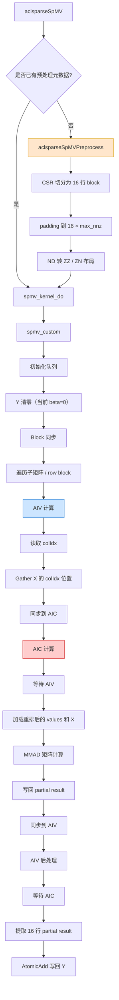
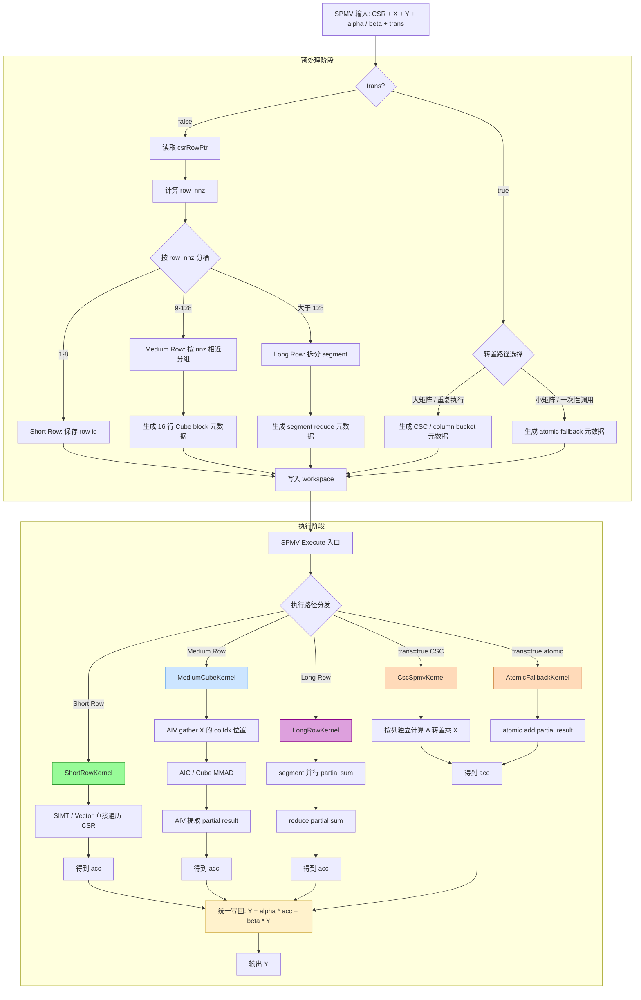

# SPMV 算子开发分桶混合实现方案设计文档


# 1. 需求背景（required）

## 1.1 需求来源

参考 cusparse SPMV 实现，在昇腾 NPU 上基于 Ascend C 编程语言实现功能一致的算子，完成算子设计、开发、测试全流程工作，验收通过后将算子提交至昇腾算子开源仓。

SPMV（Sparse Matrix-Vector Multiplication）用于计算稀疏矩阵与稠密向量的乘法，是稀疏线性代数、图计算、科学计算和部分模型稀疏化场景中的基础算子。目标算子需要支持 CSR 格式输入，并实现如下计算：

```text
Y = alpha * op(A) * X + beta * Y
```

其中 `A` 为 CSR 稀疏矩阵，`X` 为稠密输入向量，`Y` 为稠密输出向量，`op(A)` 支持非转置和转置两种模式。

SPMV 的主要难点不在公式本身，而在于 CSR 输入带来的不规则性：每行非零元素数量不同，`x[colIdx]` 是间接随机访存，转置场景还会产生多个元素累加到同一输出位置的问题。因此，如果直接采用统一的 CSR 遍历方式，容易出现负载不均衡、访存效率低、atomic 开销大等问题。

本设计文档提出一种面向 Ascend 950PR 的分桶混合 SPMV 实现方案。核心思想是在 preprocess 阶段分析 CSR 行非零元分布，根据 `row_nnz` 将行划分为短行、中等行、长行三类，然后分别采用不同执行路径，以提高不同稀疏分布下的泛化性能。

---

# 2. 背景介绍

## 2.1 CSR 格式特点

CSR 使用三个数组描述稀疏矩阵：

```text
csrRowPtr : 每行非零元素的起止位置，长度 M + 1
csrColInd : 每个非零元素对应的列索引，长度 NNZ
csrVal    : 每个非零元素的数值，长度 NNZ
```

非转置 SPMV 的计算过程为：

```text
for row in M:
    acc = 0
    for p in csrRowPtr[row] ... csrRowPtr[row + 1] - 1:
        acc += csrVal[p] * X[csrColInd[p]]
    Y[row] = alpha * acc + beta * Y[row]
```

该计算存在三个典型问题：

1. **行长度不均衡**：不同 row 的 `row_nnz` 差异可能很大，统一按行并行会导致部分计算单元空闲，部分计算单元拖尾。
2. **间接访存**：`X[csrColInd[p]]` 不是连续访问，访存合并和缓存复用较差。
3. **转置写冲突**：`A^T * X` 场景下，不同 row 的非零元素可能写入同一个 `Y[col]`，容易引入 atomic 开销。


## 2.2 算子现状分析

现有16 行 Cube 方案通常会将 CSR 输入处理成固定形状的小块：

```text
CSR 原始行
  -> 每 16 行组成 row block
  -> 统计该 block 内最大 row_nnz
  -> padding 成 16 × max_nnz
  -> ND 转 ZZ / ZN 布局
  -> AIV gather X[colIdx]
  -> AIC / Cube 执行 MMAD
  -> AIV 提取结果并写回 Y
```


该方案适合中等长度且行非零元数量相对接近的场景，可以将不规则 CSR 转换成 Cube 友好的规则小矩阵乘。但如果全部 row 都统一使用该路径，会带来两个问题：

1. 短行会产生较高的 padding 和布局转换开销，收益不明显。
2. 行长度差异较大时，16 行 block 内会出现大量无效 padding，降低实际计算效率。

因此需要在现有 16 行 Cube 方案基础上，引入分桶策略。

---

# 3. 需求分析

## 3.1 功能需求

算子需要支持以下功能：

| 需求项 | 说明 |
|---|---|
| CSR 输入 | 支持 `csrRowPtr`、`csrColInd`、`csrVal` 描述的稀疏矩阵 |
| 非转置计算 | 支持 `Y = alpha * A * X + beta * Y` |
| 转置计算 | 支持 `Y = alpha * A^T * X + beta * Y` |
| alpha / beta | 支持不同 alpha、beta 组合，包括 0、1 和一般值 |
| 多 dtype | 支持 float32、float16、bfloat16、int8 等组合 |
| compute_type | 支持 float32 或 int32 中间累加 |
| 非连续 Tensor | 支持输入输出向量存在 stride 的情况 |
| preprocess | 支持预处理生成执行元数据，以提升重复执行场景性能 |


### 3.1.1 算子数据类型需求分析

在现有功能基础上，当前 SPMV 算子需要补充支持不同输入数据类型、计算累加类型以及输出数据类型的组合。数据类型需求如下：

| 输入 A、X 类型 | 计算类型 (computeType) | 输出 Y 类型 | 说明 |
|---|---|---|---|
| float32 | float32 | float32 | 当前已支持的基础浮点路径，A、X、Y 以及中间累加均为 float32。 |
| int8 | int32 | int32 | 面向整型稀疏计算场景，A 与 X 使用 int8 存储，乘加过程使用 int32 累加，输出 Y 为 int32。 |
| int8 / float16 / bfloat16 | float32 | float32 | 混合精度输入、float32 高精度累加路径。输入可为 int8、float16 或 bfloat16，内部统一转换到 float32 computeType 后完成乘加，输出为 float32。 |
| float16 | float32 | float16 | 半精度输入输出路径，计算过程使用 float32 累加以保证精度，最终转换为 float16 写回 Y。 |
| bfloat16 | float32 | bfloat16 | bfloat16 输入输出路径，计算过程使用 float32 累加以保证精度，最终转换为 bfloat16 写回 Y。 |

从实现角度看，上述 dtype 组合会影响三个关键位置：

1. **乘法输入转换**：`csrVal[p]` 和 `X[csrColInd[p]]` 在进入乘加前需要按 computeType 做类型提升或转换。
2. **中间累加精度**：float16、bfloat16 和 int8 输入不应直接用输入类型累加，避免精度损失或溢出；其中 int8 路径使用 int32 累加，浮点低精度路径使用 float32 累加。
3. **写回 Y 类型转换**：统一完成 `Y = alpha * acc + beta * Y` 后，需要按输出 Y 类型做 cast，再写回 GM。

因此，算子模板设计建议将 `inputType`、`computeType` 和 `outputType` 解耦，避免把 A/X/Y 类型和内部累加类型强绑定。Short Row、Medium Row、Long Row 以及 trans=true 路径均应复用同一套 dtype 分发规则，只在具体计算 kernel 内根据模板参数选择对应的数据加载、类型转换、累加和写回逻辑。

## 3.2 性能需求

SPMV 是典型 memory-bound 和 irregular workload。性能优化重点不是提高单次乘加的吞吐，而是：

1. 降低 CSR 行长度不均带来的负载不均衡。
2. 降低 `X[csrColInd]` 随机访存带来的访存损失。
3. 降低短行场景下的 padding 和格式转换开销。
4. 降低长行场景下的拖尾问题。
5. 降低转置场景下的全局 atomic 累加开销。

## 3.3 数据分布需求

不同稀疏矩阵的 row_nnz 分布差异很大，因此不应使用单一路径处理所有 row。本设计文档方案将 row 按 `row_nnz` 分为三类：

| 类型 | row_nnz 范围 | 处理方式 |
|---|---:|---|
| Short Row | 1 ~ 8 | SIMT / Vector 直接计算 |
| Medium Row | 9 ~ 128 | 16 行 block + Cube/MMAD |
| Long Row | > 128 | Segment 并行计算 + Reduce |


---

# 4. 总体设计思想

本设计文档方案采用“preprocess 分析 + execute 分桶执行”的两阶段设计。

## 4.1 Preprocess 阶段

Preprocess 阶段主要完成 CSR 结构分析和执行元数据生成：

```text
1. 读取 csrRowPtr，计算每行 row_nnz
2. 根据 row_nnz 将行划分为 Short / Medium / Long 三类
3. Short Row 仅保存 row id
4. Medium Row 按 row_nnz 相近原则组成 16 行 block
5. Long Row 按固定 segment size 拆分为多个 segment
6. trans=true 场景可选择生成 CSC 或 column bucket 元数据
7. 将所有执行元数据写入 workspace
```

Preprocess 的目标是将 CSR 的不规则结构提前分析出来，避免执行阶段重复判断，并为不同类型的 row 选择合适的 kernel。

## 4.2 Execute 阶段

Execute 阶段根据 preprocess 生成的元数据启动不同执行路径：

```text
ShortRowKernel:
    处理 row_nnz 较小的短行，直接遍历 CSR 做乘加

MediumCubeKernel:
    处理中等行，沿用 16 行 block + AIV gather + AIC/Cube MMAD

LongRowKernel:
    处理长行，将一行拆成多个 segment 并行计算 partial sum，再做规约

TransposePath:
    trans=true 时优先使用 CSC / column bucket，减少全局 atomic
```

该设计的核心是：**不再强制所有 CSR 行都走 Cube 路径，而是根据 row_nnz 分布选择最合适的执行方式。**

---

## 4.3 接口设计

接口命名、参数顺序和描述符语义参考 cuSPARSE，统一使用小写 `aclsparse` 前缀，并采用 `Status_t`、`Handle_t`、`Descr_t` 等类型命名方式。SpMV 对外提供 buffer size、preprocess 和 compute 三阶段接口，调用流程与 cuSPARSE 保持一致。

### 4.3.1 句柄与描述符接口

```c
aclsparseStatus_t aclsparseCreate(aclsparseHandle_t *handle);
aclsparseStatus_t aclsparseDestroy(aclsparseHandle_t handle);

aclsparseStatus_t aclsparseSetPointerMode(
    aclsparseHandle_t handle, aclsparsePointerMode_t mode);
aclsparseStatus_t aclsparseGetPointerMode(
    aclsparseHandle_t handle, aclsparsePointerMode_t *mode);

aclsparseStatus_t aclsparseCreateDnVec(
    aclsparseDnVecDescr_t *dnVecDescr,
    int64_t size,
    void *values,
    aclDataType valueType);

aclsparseStatus_t aclsparseCreateDnVecEx(
    aclsparseDnVecDescr_t *dnVecDescr,
    int64_t size,
    int64_t stride,
    void *values,
    aclDataType valueType);

aclsparseStatus_t aclsparseDestroyDnVec(
    aclsparseDnVecDescr_t dnVecDescr);

aclsparseStatus_t aclsparseCreateCsr(
    aclsparseSpMatDescr_t *spMatDescr,
    int64_t rows,
    int64_t cols,
    int64_t nnz,
    void *csrRowOffsets,
    void *csrColInd,
    void *csrValues,
    aclsparseIndexType_t csrRowOffsetsType,
    aclsparseIndexType_t csrColIndType,
    aclsparseIndexBase_t idxBase,
    aclDataType valueType);

aclsparseStatus_t aclsparseDestroySpMat(
    aclsparseSpMatDescr_t spMatDescr);
```

`aclsparseHandle_t` 内部保存执行 stream 和 `alpha/beta` 的指针模式；`aclsparseSpMatDescr_t` 保存矩阵格式、shape、NNZ、CSR 数据指针、索引类型和数值类型；`aclsparseDnVecDescr_t` 保存向量长度、数据指针和数据类型。基础接口 `aclsparseCreateDnVec` 与 cuSPARSE 的稠密向量描述符接口对齐；`aclsparseCreateDnVecEx` 是为非连续向量增加的扩展接口，通过 stride 描述元素间隔。

### 4.3.2 SpMV 三阶段接口

接口参数顺序与 cuSPARSE SpMV 保持一致：依次传入 handle、矩阵操作类型、`alpha`、稀疏矩阵描述符、输入向量描述符、`beta`、输出向量描述符、计算类型、算法类型和外部 workspace。

```c
/**
 * @brief 获取稀疏矩阵向量乘法（SpMV）所需的缓冲区大小
 */
aclsparseStatus_t aclsparseSpMVGetBufferSize(
    aclsparseHandle_t           handle,
    aclsparseOperation_t        opA,
    const void                 *alpha,
    aclsparseConstSpMatDescr_t  matA,
    aclsparseConstDnVecDescr_t  vecX,
    const void                 *beta,
    aclsparseDnVecDescr_t       vecY,
    aclDataType                 computeType,
    aclsparseSpMVAlg_t          alg,
    size_t                     *bufferSize);

/**
 * @brief 对稀疏矩阵结构和算法路径进行预处理
 */
aclsparseStatus_t aclsparseSpMVPreprocess(
    aclsparseHandle_t           handle,
    aclsparseOperation_t        opA,
    const void                 *alpha,
    aclsparseConstSpMatDescr_t  matA,
    aclsparseConstDnVecDescr_t  vecX,
    const void                 *beta,
    aclsparseDnVecDescr_t       vecY,
    aclDataType                 computeType,
    aclsparseSpMVAlg_t          alg,
    void                       *externalBuffer);

/**
 * @brief 执行稀疏矩阵向量乘法（SpMV）
 */
aclsparseStatus_t aclsparseSpMV(
    aclsparseHandle_t           handle,
    aclsparseOperation_t        opA,
    const void                 *alpha,
    aclsparseConstSpMatDescr_t  matA,
    aclsparseConstDnVecDescr_t  vecX,
    const void                 *beta,
    aclsparseDnVecDescr_t       vecY,
    aclDataType                 computeType,
    aclsparseSpMVAlg_t          alg,
    void                       *externalBuffer);
```

三阶段职责如下：

1. `aclsparseSpMVGetBufferSize`：完成参数、shape、索引类型和 dtype 组合检查，计算预处理元数据、中间结果及转置结构所需的 workspace 大小，并通过 `bufferSize` 返回。
2. `aclsparseSpMVPreprocess`：分析 CSR 行分布，生成 Short/Medium/Long Row 元数据；转置场景按算法选择直接转置或 CSR 转 CSC；将预处理结果及其签名写入 `externalBuffer`。
3. `aclsparseSpMV`：检查 workspace 与当前矩阵、`opA`、dtype、stride 和算法是否匹配；未执行 preprocess 或签名失效时重新生成预处理信息，随后在 handle 绑定的 stream 上启动 kernel。

`alpha` 和 `beta` 支持 HOST、DEVICE 两种指针模式，其指向的数据类型必须与 `computeType` 一致。`ACLSPARSE_SPMV_CSR_ALG1` 使用直接转置路径，`ACLSPARSE_SPMV_CSR_ALG2` 强制生成 CSC；默认算法在转置且 `NNZ > 4096` 时使用 CSC，否则使用直接转置路径。

## 4.4 算子实现

代码实现分为 Host 预处理和 Device 执行两部分，主要文件如下：

```text
include/cann_ops_sparse.h                     对外接口
include/cann_ops_sparse_common.h              句柄和描述符内部结构
src/spmv/spmv_host.cpp                        参数校验、三阶段接口和 kernel 分发
src/spmv/spmv_hybrid.h                        workspace 与分桶元数据定义
src/spmv/arch35/spmv_hybrid_preprocess.cpp    CSR 分析、分桶及 CSC 构造
src/spmv/arch35/spmv_hybrid_kernel.cpp        Ascend C kernel 实现
```

### 4.4.1 Host 侧实现

Host 侧首先检查 handle、描述符、workspace、op、alg、shape 和 stride，并限制 CSR 行偏移、列索引为 int32。当前支持以下 dtype 组合：

| A/X 类型 | computeType | Y 类型 |
|---|---|---|
| float32 | float32 | float32 |
| float16 | float32 | float16 |
| bfloat16 | float32 | bfloat16 |
| int8 | int32 | int32 |
| int8 | float32 | float32 |

preprocess 阶段将 CSR 结构复制到 Host 侧完成合法性校验和分桶，并按 64B 对齐将元数据写入 `SpmvHybridWorkspace`：

- `row_nnz = 0`：记录为空行；
- `1 <= row_nnz <= 8`：记录到 direct row 列表，由 Vector 直接计算；
- `9 <= row_nnz <= 128`：按 9~16、17~32、33~64、65~128 分组，每 16 行组成一个 Medium Block；最大行长按 8 对齐，若 padding 后元素数超过真实 NNZ 的 2 倍，则回退到 direct row；
- `row_nnz > 128`：按 512 个非零元拆成 segment；超过 2048 个非零元的行使用二级归约标记。

转置计算中，`CSR_ALG2` 或默认算法的大规模场景会生成 CSC，并将其作为 `A^T` 的等价 CSR 结构复用非转置路径；小规模或 `CSR_ALG1` 使用直接转置路径。workspace 通过 signature 绑定矩阵地址、shape、dtype、op、alg 和 X/Y stride，相关信息变化后会自动重新 preprocess。

### 4.4.2 Kernel 侧实现

执行入口 `spmv_hybrid_kernel_do` 根据输入类型、计算类型和输出类型选择模板实例，kernel 按以下顺序执行：

```text
SpmvScaleYKernel
    -> 先完成 Y = beta * Y
SpmvDirectRowsKernel
    -> 处理 Short Row 和从 Medium 回退的行
Medium Row 路径
    -> FP32: Gather X -> Cube/MMAD -> Apply Result
    -> FP16/BF16/INT8: 当前使用 Vector 路径计算
SpmvLongPartialKernel
    -> 各 segment 计算 partial sum
SpmvLongReduceKernel
    -> 按 row 归约 partial sum 并写回
SpmvDirectTransposeKernel
    -> 处理未转换 CSC 的直接转置场景
```

各计算路径统一先转换到 `computeType` 完成累加，再执行 `Y += alpha * sum`。由于 `SpmvScaleYKernel` 已提前处理 `beta`，最终结果满足：

```text
Y = alpha * op(A) * X + beta * Y
```

X、Y 地址均使用描述符中的 stride 计算，因此支持连续和非连续稠密向量。FP32 Medium Row 使用 AIV Gather 与 AIC Cube/MMAD 协同计算；其他 dtype 当前采用 Vector 回退路径，后续可在保持外部接口不变的情况下扩展对应 Cube 实现。

---

# 5. 关键方案设计

## 5.1 Short Row 路径

短行的 row_nnz 很小，如果强行组成 16 行 block 并进行 padding、布局转换和 Cube 计算，额外开销可能大于真实计算量。因此短行直接使用 SIMT / Vector 路径：

```text
每个执行单元处理一个或多个 short row
直接读取 csrVal 和 csrColInd
通过 colIdx 读取 X
完成局部乘加
最终写回 Y[row]
```

该路径的目标是减少短行场景下的调度、padding 和 layout transform 开销。

## 5.2 Medium Row 路径

中等行继续使用 16 行 block + Cube/MMAD 方案，但需要增加一个关键优化：**按 row_nnz 相近程度分组后再组成 16 行 block**。

原始直接每 16 行成块可能出现：

```text
row0  : 2 nnz
row1  : 3 nnz
...
row15 : 120 nnz
```

此时整个 block 需要 padding 到 120，浪费大量计算。优化后先将 row_nnz 接近的行分到同一 bucket，再组成 16 行 block，例如：

```text
9~16 nnz bucket
17~32 nnz bucket
33~64 nnz bucket
65~128 nnz bucket
```

这样可以降低 padding ratio，提高 Cube 实际有效计算比例。

Medium Row 的执行流程为：

```text
AIV:
    读取 colIdx，gather X[colIdx]

AIC / Cube:
    读取重排后的 values 和 gather 后的 X
    使用 MMAD 计算 16 行 partial result

AIV:
    提取结果，结合 alpha/beta 写回 Y
```

## 5.3 Long Row 路径

长行如果由单个执行单元处理，会产生明显拖尾。因此 Long Row 采用 segment 并行策略：

```text
一行 long row 拆成多个 segment
每个 segment 计算一段 nnz 的 partial sum
最后将同一 row 的 partial sum 做 reduce
写回 Y[row]
```

例如：

```text
row i 有 4096 个 nnz
拆成 8 个 segment，每个 segment 处理 512 个 nnz
得到 8 个 partial sum
最终 reduce 成 Y[i]
```

该路径的目标是提高长行并行度，避免长行成为整个 kernel 的尾部瓶颈。

## 5.4 trans=true 路径

转置 SPMV 的问题是：

```text
Y[col] += A[row, col] * X[row]
```

多个 row 可能同时写同一个 `Y[col]`。如果直接基于 CSR 做 atomic add，性能可能较差。

因此推荐两种路径：

1. **CSC preprocess 路径**：将 CSR 转换为 CSC，使 `A^T * X` 转换为按列独立计算，减少 atomic。
2. **atomic fallback 路径**：对于小矩阵或一次性调用场景，直接使用 atomic add，避免过重 preprocess。

默认策略可以根据矩阵规模、NNZ 和是否重复执行选择。



# 6. 支持硬件

| 支持的芯片版本 | 涉及勾选 | 说明 |
| --- | --- | --- |
| Ascend 950PR | √ | 本任务书指定适配硬件，算子设计、开发、测试和性能验收均以 Ascend 950PR 为准 |


# 7. 可维可测分析

## 7.1 可维护性分析

分桶混合方案将不同 row 类型拆成独立路径：

```text
Short Row  : 简单 CSR 直接计算
Medium Row : 16 行 Cube/MMAD 计算
Long Row   : segment reduce 计算
Transpose  : CSC 或 atomic fallback
```

这种拆分方式有利于后续维护：

1. 每条路径职责清晰，便于单独调试和替换。
2. Short / Medium / Long 的阈值可配置，便于后续调优。
3. Medium Row 可以复用当前已有 16 行 Cube 方案，降低改造成本。
4. Long Row 逻辑独立，不影响中短行性能路径。
5. trans=true 可以先提供 atomic fallback，再逐步优化 CSC 路径。

## 7.2 可测试性与精度验证

测试覆盖 Short Row、Medium Row、Long Row、Mixed Row、空行、NNZ=0、转置/非转置、不同 `alpha/beta`、全部 dtype 组合、不同 shape 和稀疏率，以及尾行不足 16 行等边界场景。

### 7.2.1 单标杆精度验证

以高精度 CPU 计算结果作为 `golden`，对 NPU 输出 `actual` 进行误差评估。浮点输出采用平均相对误差 MERE 和最大相对误差 MARE：

$$
\mathrm{MERE}=\operatorname{avg}\left(\frac{|actual-golden|}{|golden|+10^{-7}}\right)
$$

$$
\mathrm{MARE}=\max\left(\frac{|actual-golden|}{|golden|+10^{-7}}\right)
$$

通过条件为：

```text
MERE < Threshold
且 MARE < 10 × Threshold
```

| 输出 Y 类型 | Threshold |
|---|---:|
| float32 | $2^{-13}$ |
| float16 | $2^{-10}$ |
| bfloat16 | $2^{-7}$ |

`int8 -> int32` 路径要求 NPU 输出与 CPU golden 逐元素完全一致。

### 7.2.2 双标杆精度验证

浮点用例未通过单标杆且排除功能错误后，使用 cuSPARSE 结果进行双标杆复核。CPU 结果仍作为统一 `golden`，分别计算 NPU 和 GPU 相对 CPU 的 MARE、MERE 和 RMSE，并计算：

```text
MARE_Ratio = MARE_NPU / MARE_GPU
MERE_Ratio = MERE_NPU / MERE_GPU
RMSE_Ratio = RMSE_NPU / RMSE_GPU
```

双标杆通过条件为：

| 指标 | 阈值 |
|---|---:|
| MARE_Ratio | <= 2 |
| MERE_Ratio | <= 1.2 |
| RMSE_Ratio | <= 1.2 |

三项指标均满足要求时判定精度通过。`int8 -> int32` 路径不使用双标杆兜底。CPU、NPU 和 GPU 必须使用相同输入数据、`alpha/beta`、dtype、computeType 和随机种子。
