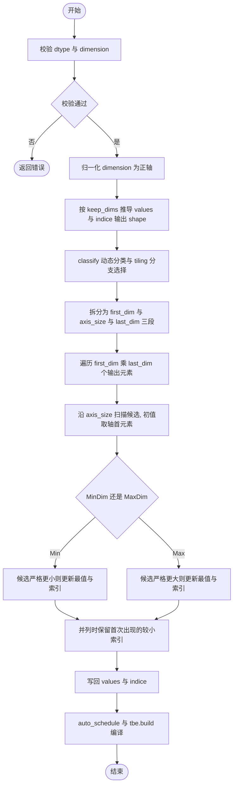
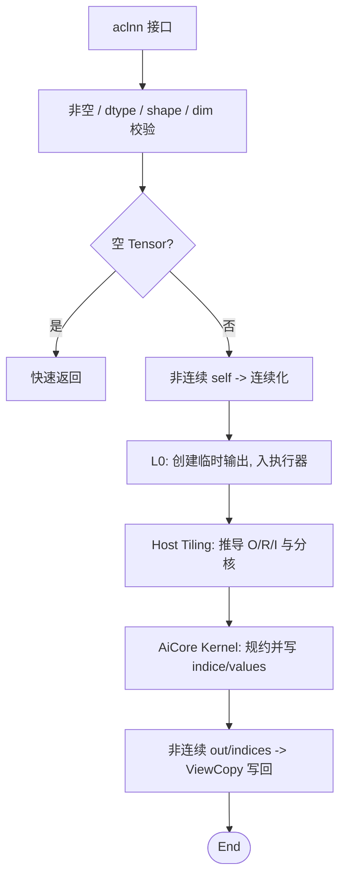
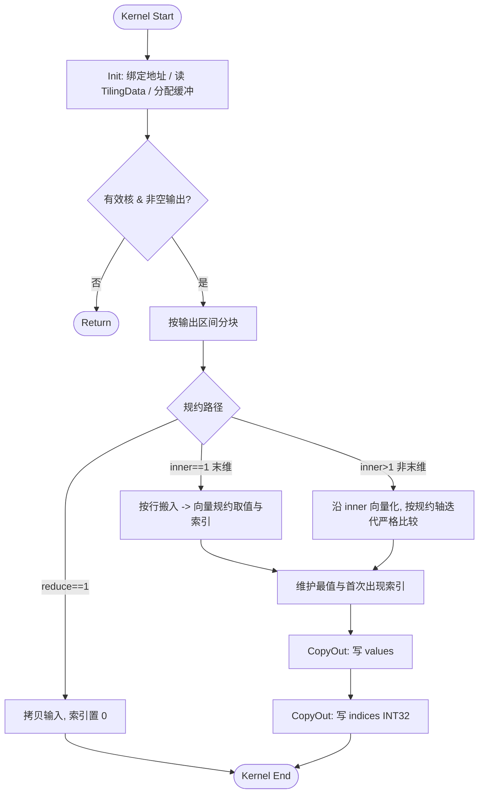

# MinDim & MaxDim 算子设计文档

> 适配硬件：Atlas A2 训练系列产品 / Atlas A3 系列产品　|　开发语言：Ascend C
> 内部原生算子：`ArgMinWithValue`（对应 `aclnnMinDim`）、`ArgMaxWithValue`（对应 `aclnnMaxDim`）

# 需求背景

## 需求来源

社区任务 `20260529-6 MinDim&MaxDim`：参考昇腾版本内置 `aclnnMinDim` / `aclnnMaxDim` 算子（原 TBE 实现分别对应内部 `ArgMinWithValue` / `ArgMaxWithValue`），在昇腾 NPU 上基于 Ascend C 编程语言实现功能一致的原生算子，完成算子设计、开发、测试全流程，验收通过后提交至昇腾算子开源仓 `experimental/math`。

## 背景介绍

### MinDim/MaxDim 算子实现优化

基于内置 TBE 历史版本，使用 Ascend C 编程语言重新实现并优化。相关参考路径：

- TBE Kernel 实现：`/usr/local/Ascend/ascend-toolkit/latest/opp/built-in/op_impl/ai_core/tbe/impl/ops_legacy/dynamic/arg_min_with_value`
- 算子原型：`/usr/local/Ascend/ascend-toolkit/latest/opp/built-in/op_graph/inc/ops_proto_math.h`
- 算子信息库：`/usr/local/Ascend/ascend-toolkit/latest/opp/built-in/op_impl/ai_core/tbe/config/ascend910b/aic-ascend910b-ops-info-legacy.json`

`aclnn` 外部接口与内部原生算子职责分层：`aclnn` 接口层负责参数/dtype/shape 校验、非连续输入连续化、输出 ViewCopy 与执行器组装；内部原生算子在连续 ND Tensor 上完成按维度规约。

### MinDim/MaxDim 算子 TBE 实现现状分析

内置 TBE 的 `ArgMinWithValue` / `ArgMaxWithValue` 为带 value 输出的 arg-reduce 类算子：输入 `x` 按 `dimension` 指定轴做最小/最大规约，同时输出最值索引 `indice` 与最值 `values`。当前支持的能力如下：

| 参数 | 参数含义 | 类别 | 支持数据类型 | format | 形状 | 约束 |
| --- | --- | --- | --- | --- | --- | --- |
| `x` | 待规约的输入张量 | 输入 | FLOAT16, FLOAT, BFLOAT16, INT16 | ND | [1,8] 维 | 支持非连续 Tensor |
| `dimension` | 规约轴 | 属性 | INT64 | - | 标量 | 取值范围 `[-rank, rank)` |
| `keep_dims` | 是否保留规约轴 | 属性 | BOOL | - | 标量 | - |
| `indice` | 最值索引 | 输出 | INT32 | ND | 与 `values` 一致 | 固定 INT32 |
| `values` | 最值 | 输出 | 与 `x` 一致 | ND | 按 `dimension`/`keep_dims` 推导 | - |

计算语义：`values` = 沿 `dimension` 轴的最小值（MinDim）/最大值（MaxDim）；`indice` = 该最值在规约轴上的索引，相同最值出现多次时取首次出现的位置。

#### TBE 算子实现流程图

内置 TBE（`arg_common.py`，基于 DSL/TVM 实现，支持动态 shape）的整体实现流程如下：输入校验 → 轴归一化与输出 shape 推导 → 动态分类与 tiling → 三段式拆分 → 沿规约轴扫描求最值与索引 → 写回结果 → TVM 调度与编译。

### MinDim/MaxDim 算子功能分析

- 功能：在指定维度上求张量的最小值/最大值及其索引位置。
- 输入：`self`（待规约张量）、`dim`（规约轴）、`keepdim`（是否保留规约轴）。
- 输出：`out`（最值，dtype 与 `self` 一致）、`indices`（最值索引，INT32）。
- 支持数据类型：FLOAT16、FLOAT、BFLOAT16、INT16。
- 支持广播：不支持（输入输出 shape 严格匹配）。

# 需求分析

## 需求描述

使用 Ascend C 编程语言实现 `MinDim` / `MaxDim`（内部 `ArgMinWithValue` / `ArgMaxWithValue`），功能与内置 TBE 一致：支持 FLOAT16、FLOAT、BFLOAT16、INT16 四种数据类型，支持 1–8 维输入、任意合法规约轴、`keepdim`，以及非连续 Tensor。

## 需求拆解

1. 支持 FLOAT16、FLOAT、BFLOAT16、INT16 四种输入数据类型，`indices` 固定 INT32。
1. 支持 rank `[1,8]`、规约轴 `dim ∈ [-rank, rank)`、`keepdim` 两态，输出 shape 正确推导。
1. 相同最值时返回首次出现（最小索引）的位置，值与索引均与 TBE 对齐。
1. 支持非连续 Tensor。
1. 精度满足 AscendOpTest 工具默认阈值，性能不低于 TBE 版本。

## 外部组件依赖

不引入第三方组件，完全基于 CANN 提供的 Ascend C 基础库（`kernel_operator.h`、Tiling / Platform 接口）与 `aclnn` / `opdev` / `l0op` 框架。

## 内部适配模块

| 模块 | 计划文件 | 设计职责 |
| --- | --- | --- |
| Host 定义 | `op_host/arg_min_with_value.cpp`、`op_host/arg_max_with_value.cpp` | 注册输入/输出/属性、dtype/format、动态 shape 与 AICore 配置 |
| Shape 推导 | 同上（InferShape） | 按 `dim` 与 `keepdim` 推导 `indices` / `values` 输出 shape |
| Tiling | 同上（Tiling） | 计算规约三段、分核参数、UB 规划与路径标识 |
| Kernel TilingData | `op_kernel/arg_with_value_tiling_data.h` | 定义 Kernel 侧所需 tiling 字段 |
| Kernel 入口 | `op_kernel/arg_min_with_value.cpp`、`op_kernel/arg_max_with_value.cpp` | 按 dtype 与 Min/Max 模式进入 Ascend C Kernel |
| aclnn 接口 | `aclnnMinDim` / `aclnnMaxDim`（两段式接口） | 参数/ dtype / shape 校验、非连续输入连续化、输出 ViewCopy、执行器组装 |
| 测试与样例 | `examples/`、`tests/` | 覆盖接口调用、功能正确性、非连续 Tensor、边界 shape 与性能对比 |

## 需求模块设计

### `aclnnMinDim` / `aclnnMaxDim` 算子原型

| 名称 | 类别 | 数据类型 | format | shape | 说明 |
| --- | --- | --- | --- | --- | --- |
| `self` | 输入 | FLOAT16/FLOAT/BFLOAT16/INT16 | ND | [1,8] | 待计算张量，支持非连续 Tensor |
| `dim` | 输入参数 | INT64 | - | 标量 | 规约轴，`[-self.dim(), self.dim())` |
| `keepdim` | 输入参数 | BOOL | - | 标量 | 是否保留规约轴 |
| `out` | 输出 | 与 `self` 一致 | ND | 按 `keepdim` 推导 | 最值输出，支持非连续 Tensor |
| `indices` | 输出 | INT32 | ND | 与 `out` 一致 | 最值索引，支持非连续 Tensor |

`aclnnMaxDim` 原型与 `aclnnMinDim` 一致，仅语义由「最小」改为「最大」。

### 内部 `ArgMinWithValue` / `ArgMaxWithValue` 原型

内部原生算子输出顺序为 `indice`（索引）在前、`values`（值）在后，与 `aclnn` 对外顺序相反，由接口层适配：

| 名称 | 类别 | 数据类型 | format | shape | 说明 |
| --- | --- | --- | --- | --- | --- |
| `x` | 输入 | FLOAT16/FLOAT/BFLOAT16/INT16 | ND | [1,8] | 连续 ND 输入 |
| `dimension` | 属性 | INT64 | - | 标量 | 规约轴 |
| `keep_dims` | 属性 | BOOL | - | 标量 | 是否保留规约轴 |
| `indice` | 输出 | INT32 | ND | 与 `values` 一致 | 最值索引 |
| `values` | 输出 | 与 `x` 一致 | ND | 按 `dimension`/`keep_dims` 推导 | 最值 |

# 详细设计

## 算子分析

### 数学公式

设输入 `self` 秩为 `r`、shape 为 $(S_0,\dots,S_{r-1})$，归一化轴 $a=(dim<0)\,?\,dim+r:dim$。将输入逻辑展开为三段：

$$ outer=\prod_{i<a}S_i,\qquad reduce=S_a,\qquad inner=\prod_{i>a}S_i $$

对每个输出位置 $(o\in[0,outer),\ t\in[0,inner))$：

$$ out[o,t]=\operatorname*{min/max}_{0\le k<reduce} self[o,k,t],\qquad indices[o,t]=\operatorname*{arg\,min/max}_{0\le k<reduce}{}^{(\text{first})} self[o,k,t] $$

候选元素在输入中的线性地址为 $(o\cdot reduce + k)\cdot inner + t$。

### 支持数据类型

FLOAT16、FLOAT、BFLOAT16、INT16；`out` 与 `self` 一致，`indices` 固定 INT32。

### 支持形状

ND，rank `[1,8]`，规约轴 `[-r,r)`，`keepdim` 两态；不支持广播。非连续 Tensor 由接口层适配。

## 使能方式

| 上层调用 / 工具链 | 涉及勾选 | 说明 |
| --- | --- | --- |
| Aclnn 直调 | √ | 两段式单算子接口，便于测试与集成 |
| ATC 推理 | √ | 注册算子原型，支持图模式 |

## 总体架构

整体链路分为四层：

1. `aclnn` 接口层：参数/ dtype / shape / dim 校验、空 Tensor 快速返回、非连续输入连续化、输出形状校验与 ViewCopy。
2. L0 原生调用层：创建 `ArgMinWithValue` / `ArgMaxWithValue` 临时输出并加入执行器。
3. Host Tiling 层：读取 shape、dtype、`dim`、`keepdim` 与平台信息，推导规约三段与分核参数。
4. AiCore Kernel 层：按 tiling 数据完成规约计算并写回 `indice` 与 `values`。

## 算子实现

### 实现方案

#### 3.4.1 host 侧设计：

tiling 策略：Host 侧读取输入 shape、dtype、`dim`、`keepdim` 与平台信息（UB 大小、核数），将规约轴归一化后计算 `outer / reduce / inner` 与输出元素总数 `outSize = outer × inner`，据此完成分核与单核内切分，并将相关参数写入 TilingData 传给 Kernel。

##### 1. 分核策略：

优先使用满核原则，以**输出元素空间**为分核主轴，每个核负责一段连续的输出区间。若核间能均分则大小核一致；不能均分时将余量分配到前几个核。分核需结合 32B 内存对齐规则，保证不同核写回 GM 时不共享同一最小搬运块，避免跨核写冲突。

##### 2. 数据分块和内存优化策略：

充分使用 UB 空间原则。根据 UB 大小、数据类型与 Kernel 计算所需的临时缓冲，综合确定单核内对规约维度 / inner 维度的切分量；低精度类型在 UB 内通过向量转换为 FLOAT 计算，相应预留转换缓冲。各缓冲在初始化阶段一次性分配。

##### 3. tilingkey 规划策略：

需感知 host 侧形状信息使 kernel 走不同分支。按规约轴位置与形状划分主路径：

- `reduce == 1`：输出等于输入切片、索引恒为 0，走快速拷贝分支；
- `inner == 1`（末维规约）：每个输出对应输入上一整段连续规约行；
- `inner > 1`（非末维规约）：规约候选间存在 inner 步长，走通用规约分支。

TilingData 主要字段：

| 字段 | 含义 |
| --- | --- |
| `outer` | 规约轴之前所有维度的乘积 |
| `reduce` | 规约轴长度 |
| `inner` | 规约轴之后所有维度的乘积 |
| `outSize` | 输出元素总数（`outer × inner`） |
| `coreNum` | 实际参与计算的核数 |
| `blockFactor` | 普通核负责的输出元素数 |
| `tailBlockFactor` | 尾核负责的输出元素数 |
| `ubTile` | 单核 UB 内对规约 / inner 维度的切分量 |
| `tilingMode` | 路径标识（拷贝 / 末维 / 非末维） |

#### 3.4.2 kernel 侧设计：

Kernel 入口按数据类型与 Min/Max 模式实例化，分 Init 与 Process 两阶段。**正确性优先**：阶段间做流水同步，搬入前对 UB 缓冲尾部做哨兵值（min 取 +∞、max 取 −∞）初始化，避免越界脏数据影响比较。

1. 计算时统一以 FLOAT 精度比较：FLOAT16、BFLOAT16、INT16 在搬入后通过**向量转换**升为 FLOAT，规约/比较在 FLOAT 上完成，输出 `values` 时再转换回原数据类型；`indices` 经 FLOAT 中转后转换为 INT32 写回。
2. Init 阶段完成输入/输出 GM 地址绑定、TilingData 参数读取与 UB 缓冲分配。
3. Process 阶段按 CopyIn → Compute → CopyOut 组织：CopyIn 按当前输出区间与切分量从 GM 搬入规约数据；Compute 沿规约轴维护当前最值与索引——以规约轴第 0 个元素初始化，遍历后续候选，**仅当候选严格优于当前最值时更新值与索引**（min 用严格小于、max 用严格大于），并列时保留较早索引，实现首次出现语义；CopyOut 将该输出区间的最值与索引写回 GM。
4. 末维规约分支按规约行组织搬运与向量规约；非末维规约分支沿 inner 方向向量化、按规约轴迭代比较；二者均复用上述「严格比较 + 首次出现」的统一索引维护逻辑。
5. Kernel 计算流程见下图。

##### 性能设计考虑

1. `reduce==1` 走快速拷贝分支，避免无意义规约。
2. 末维规约按完整连续行组织搬运，减少 strided 访存与地址计算。
3. 小 `reduce`、大 `outer` 场景让单核处理多行，摊薄 kernel 内固定开销。
4. 非末维规约按输出 tile 组织，使同一规约位置的 inner 方向尽量连续。
5. 半精度 / BF16 在中间比较时控制 cast 与同步粒度，避免逐元素小粒度向量操作。
6. `indices` 固定 INT32，内部避免不必要的 INT64 临时索引。

## 支持硬件

| 支持的芯片版本 | 涉及勾选 |
| --- | --- |
| Atlas A2 训练系列产品 / Atlas A3 系列产品 | √ |

## 算子约束限制

1. 输入数据类型为 FLOAT16、FLOAT、BFLOAT16、INT16，`out` 与 `self` 一致，`indices` 固定 INT32。
2. format 为 ND；rank 支持 `[1,8]`；`dim ∈ [-rank, rank)`。
3. `keepdim=false` 时输出 rank 为输入 rank 减 1；`keepdim=true` 时规约轴维度置 1。
4. 不支持广播，输入输出 shape 严格匹配。
5. `self`/`out`/`indices` 支持非连续 Tensor，由 `aclnn` 接口层通过连续化与 ViewCopy 适配；内部原生算子以连续 ND Tensor 为输入。

# 特性交叉分析

| 交叉维度 | 设计关注点 | 应对策略 |
| --- | --- | --- |
| `dim` 正 / 负表达 | 同一规约轴有正负两种表示 | Host 侧统一归一化到 `[0, rank)` |
| `keepdim` true / false | 输出 rank 与 shape 不同 | InferShape 统一推导，接口层校验 out / indices |
| 末维规约（inner=1） | 规约段连续 | 末维规约分支，按行搬运与规约 |
| 非末维规约（inner>1） | 候选间存在 inner 步长 | 通用规约分支，沿 inner 向量化、按规约轴迭代 |
| `reduce==1` | 输出等于输入切片、索引恒 0 | 快速拷贝分支 |
| 低精度 dtype | FLOAT16 / BFLOAT16 比较与输出 dtype 需分离 | 中间向量转 FLOAT 比较，输出还原原 dtype |
| `INT16` | 整数顺序比较 | 转 FLOAT 中间比较（值域精确），输出原始 INT16 |
| 相同最值（ties） | 多个位置取得相同最值 | 严格比较，仅严格更优时更新，保留首次出现索引 |
| 非连续输入 / 输出 | 逻辑 view 与物理连续不一致 | 接口层先连续化，结果再 ViewCopy 写回 |
| 多核边界 | 相邻核可能共享同一 32B 搬运块 | 输出空间按内存对齐切分，避免跨核写冲突 |

# 可维可测分析

## 精度标准 / 性能标准

| 验收标准 | 描述 | 标准来源 |
| --- | --- | --- |
| 精度标准 | 满足 AscendOpTest 工具默认阈值，最值与索引与内置 TBE 一致 | 任务书 / AscendOpTest |
| 性能标准 | 全核参与计算场景下不低于内置 TBE 的 95%；小 shape 例外场景按任务书条款提供分析 | 任务书 |

## 验证矩阵

参考内置 TBE 自行设计全场景自验证用例，与基线逐元素比对最值与索引（含首次出现语义）。验证场景规划如下：

| 验证项 | 典型场景 | 验证方式 / 产出 |
| --- | --- | --- |
| dtype 覆盖 | FLOAT16、FLOAT、BFLOAT16、INT16 | 对照基线比对 values / indices |
| rank 覆盖 | 1 ~ 8 维 | 构造不同 rank 的合法输入 |
| dim 覆盖 | 首维、中间维、末维、正轴、负轴 | 校验 shape 推导、数值与索引 |
| keepdim 覆盖 | true / false | 校验输出 rank 与规约轴维度 |
| shape 覆盖 | `reduce=1`、小 / 大 reduce、小 / 大输出、非 32B 对齐 shape | 覆盖拷贝 / 末维 / 非末维路径 |
| 数据形态 | 随机、大量并列（ties）、单调有序 | 重点验证首次出现语义 |
| 非连续 Tensor | 非连续 `self` / `out` / `indices` | 验证连续化与 ViewCopy |
| 边界场景 | 单元素、含 1 维、高 rank、空 Tensor 合法场景 | 校验接口返回与输出 |
| 非法输入 | dtype 不支持、indices dtype 错误、dim 越界、输出 shape 不匹配 | 校验错误码与报错路径 |
| 性能场景 | 全核大输出、多 dtype、末维 / 非末维规约 | 与内置 TBE 性能对比 |

## 兼容性分析

新增算子，不涉及历史兼容性。功能语义与内置 TBE 保持一致：按 `dim` 指定维度求最值，`out` 保存最值、`indices` 保存首次出现的最值索引，`keepdim` 控制输出 shape；任务书范围外的 dtype、rank、format 或 shape 关系由接口层与 Host 侧校验拒绝。
