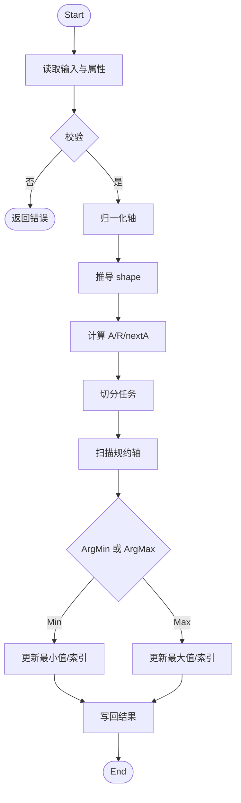
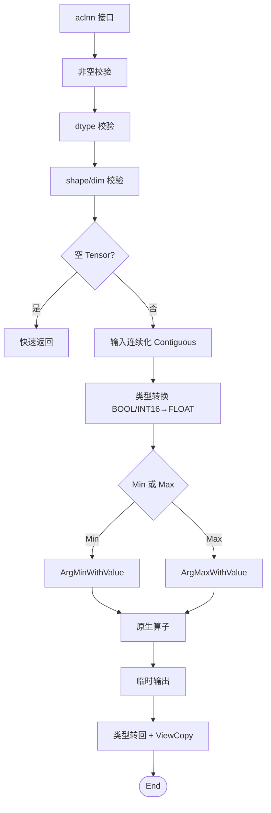
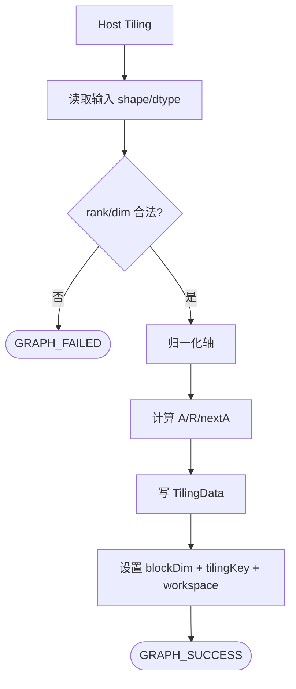
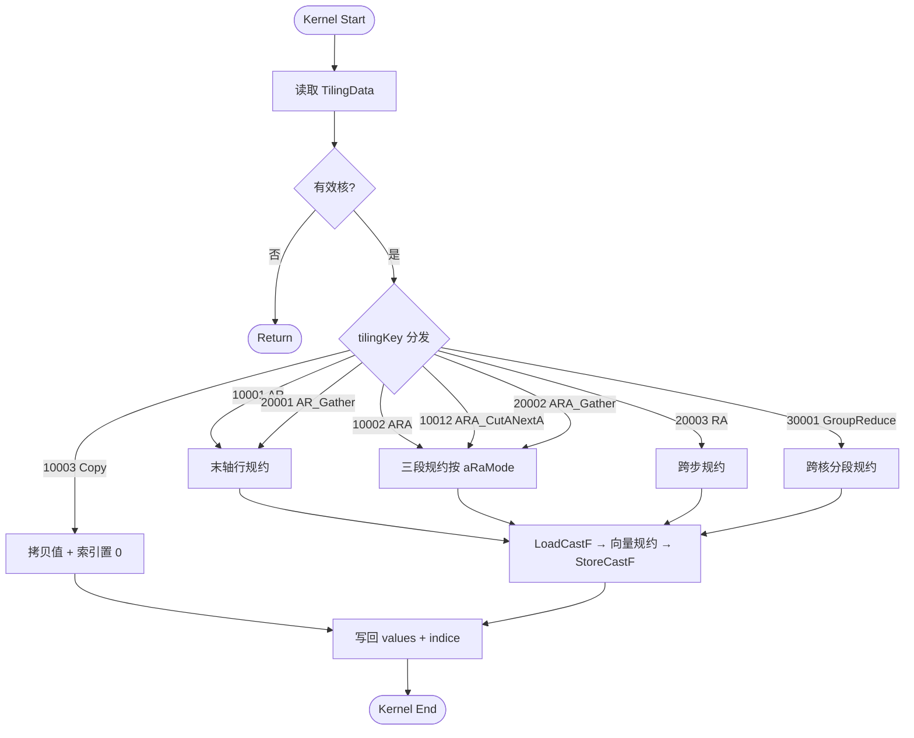

# MinDim&MaxDim 算子设计文档

## 一、需求背景

### 1.1 需求来源

社区任务 `20260529-6` 要求参考昇腾版本内置 `aclnnMinDim` 与 `aclnnMaxDim` 算子，在昇腾 NPU 上基于 Ascend C 编程语言实现功能一致的原生算子，完成算子设计、开发、测试和验收交付。`aclnnMinDim` 的原 TBE 实现对应内部 `ArgMinWithValue`，`aclnnMaxDim` 的原 TBE 实现对应内部 `ArgMaxWithValue`。

验收通过后，在昇腾算子开源仓提交 PR 申请，将开发完成的算子合入 [cann/ops-math:experimental/math](https://gitcode.com/cann/ops-math/tree/master/experimental/math)。

### 1.2 背景介绍

#### 1.2.1 算子目标

`MinDim` 与 `MaxDim` 是按指定维度做规约并同时返回数值与索引的算子。设输入 `self` 的秩为 $r$，逻辑 shape 为

$$
\mathbf{S}=(S_0,S_1,\ldots,S_{r-1})

$$

参数 `dim` 指定规约轴，`keepdim` 指定输出是否保留规约轴。对归一化后的规约轴

$$
a=\begin{cases}

dim+r, & dim < 0 \\

dim, & dim \ge 0

\end{cases}

$$

输出 `out` 保存每个输出位置沿 $a$ 轴得到的最小值或最大值，输出 `indices` 保存对应最值在规约轴上的 `INT32` 索引。相同最值出现多次时，索引按首次出现的位置返回，与 PyTorch 及 TBE 语义对齐。

本次设计目标如下：

1. 功能语义与任务环境内置 TBE `ArgMinWithValue` / `ArgMaxWithValue` 保持一致。

2. 对外提供 `aclnnMinDim` 与 `aclnnMaxDim` 两段式接口，支持 `dim`、`keepdim`、非连续 Tensor 与输出 ViewCopy。

3. 原生算子工程交付 `ArgMinWithValue` 与 `ArgMaxWithValue` 的 Host 定义、InferShape、Tiling 与 AiCore Kernel。

4. 支持任务书要求的 `FLOAT16`、`FLOAT`、`BFLOAT16`、`INT16` 四类输入 dtype，输入与 value 输出 dtype 一致，索引输出 dtype 为 `INT32`，format 为 `ND`，rank 范围为 `[1, 8]`。

5. 适配 Arch32（Atlas A2 训练系列 ascend910b / Atlas A3 系列 ascend910_93）硬件架构。

#### 1.2.2 TBE 基线来源说明

本任务以内置 TBE 算子作为功能、精度与性能对齐基线。设计分析参考路径如下（`$L` = `.../ascend-toolkit/latest`）：

| 基线层次           | 直接路径                                                                                                  | 作用                                                   |
| -------------- | ----------------------------------------------------------------------------------------------------- | ---------------------------------------------------- |
| TBE Kernel 实现层 | `$L/opp/built-in/op_impl/ai_core/tbe/impl/ops_legacy/dynamic/arg_max_with_value`、`arg_min_with_value` | 查看 TBE 主体实现与公共调度结构                                   |
| 算子原型层          | `$L/opp/built-in/op_graph/inc/ops_proto_math.h`                                                       | 核对 `ArgMinWithValue` / `ArgMaxWithValue` 的输入、输出与属性定义 |
| 算子信息库层         | `$L/opp/built-in/op_impl/ai_core/tbe/config/ascend910b/aic-ascend910b-ops-info-legacy.json`           | 核对注册条目、dtype、format、动态 shape/rank 能力                 |

外部 `aclnnMinDim` / `aclnnMaxDim` 接口与内部 `ArgMinWithValue` / `ArgMaxWithValue` 的职责不同：`aclnn` 接口层负责参数校验、非连续输入规整、输出 ViewCopy 与执行器组装；内部原生算子负责连续 ND Tensor 上的按维度规约。设计文档按这两层分别描述。

#### 1.2.3 TBE 算子现状分析

内置 TBE 的 `ArgMinWithValue` 与 `ArgMaxWithValue` 均属于带 value 输出的 arg reduce 类算子。其基本语义为：输入 `x` 按 `dimension` 属性指定的轴做最小值或最大值规约，同时输出 `indice` 与 `values`。

结合任务书要求，本文交付范围如下：

| 层次                                       | 输入 dtype                             | `indices` dtype | `out` / `values` dtype | format | rank     |
| ---------------------------------------- | ------------------------------------ | --------------- | ---------------------- | ------ | -------- |
| `aclnnMinDim` / `aclnnMaxDim`            | `FLOAT16`、`FLOAT`、`BFLOAT16`、`INT16` | `INT32`         | 与 `self` 一致            | `ND`   | `[1, 8]` |
| 内部 `ArgMinWithValue` / `ArgMaxWithValue` | `FLOAT16`、`FLOAT`、`BFLOAT16`、`INT16` | `INT32`         | 与 `x` 一致               | `ND`   | `[1, 8]` |

参数/属性约束如下：

| 属性                      | 类型      | 约束                                                           |
| ----------------------- | ------- | ------------------------------------------------------------ |
| `dim` / `dimension`     | `INT64` | 取值范围为 `[-rank, rank)`，Host 侧归一化到 `[0, rank)`                 |
| `keepdim` / `keep_dims` | `BOOL`  | `false` 时输出 rank 为输入 rank 减 1；`true` 时输出 rank 与输入一致且规约轴维度为 1 |

TBE 基线语义流程如下：

## 二、需求分析

### 2.1 外部组件依赖

不引入新的第三方组件，复用 CANN 社区任务已有的算子编译框架、`aclnn` 两段式接口、`opdev` / `l0op` 接口、Host Tiling 与 Ascend C Kernel 运行环境。

### 2.2 内部适配模块

`ArgMinWithValue` 与 `ArgMaxWithValue` 共享绝大部分代码，仅在比较方向和填充值上存在差异。Min 算子由 Max 算子经 token 替换生成，Kernel 模板通过 `IS_MAX` 编译期参数分化。

| 模块                | 计划文件                                                                                              | 设计职责                                                              |
| ----------------- | ------------------------------------------------------------------------------------------------- | ----------------------------------------------------------------- |
| API 文档            | `docs/aclnnMinDim.md`、`docs/aclnnMaxDim.md`                                                       | 说明两段式接口、参数、返回值、约束与示例                                              |
| `aclnn` 接口层       | `op_api/aclnn_min_dim.cpp`、`op_api/aclnn_max_dim.cpp`                                             | 参数校验、dtype 校验、shape 校验、非连续输入 Contiguous、类型转换、输出 ViewCopy          |
| 原生调用层             | `op_api/argmin_with_value.cpp`、`op_api/argmax_with_value.cpp`                                     | 将 `aclnn` 路径调度到内部 `ArgMinWithValue` / `ArgMaxWithValue` AiCore 算子 |
| Host 定义           | `op_host/arg_min_with_value_def.cpp`、`op_host/arg_max_with_value_def.cpp`                         | 注册输入输出、属性、dtype/format、动态 shape/rank、多 SoC 配置                     |
| Shape 推导          | `op_host/arg_common_base_infershape.cpp`                                                          | 按 `dimension` 与 `keep_dims` 推导 `indice` 与 `values` 输出 shape       |
| Tiling 层（Arch32）  | `op_host/arch32/arg_common_base_tiling.cpp`                                                       | 简化 tiling：维度建模 + 分核，tilingKey 固定 0                                |
| Tiling 层（Arch35）  | `op_host/arch35/arg_common_base_tiling.cpp`                                                       | 完整 tiling：路径选择、UB 容量感知分块、8 种 tilingKey 分发                         |
| 公共 TilingData     | `op_host/arch32/arg_common_base_tiling_arch32.h`、`op_host/arch35/arg_common_base_tiling_arch35.h` | TilingData 结构体定义（18 字段）                                           |
| Kernel 入口（Arch32） | `op_kernel/arg_max_with_value.cpp`                                                                | Arch32 标量循环 Kernel                                                |
| Kernel 入口（Arch35） | `op_kernel/arg_max_with_value_apt.cpp`                                                            | Arch35 多路径分发 Kernel                                               |
| Kernel 实现（Arch35） | `op_kernel/arch35/arg_max_with_value_ar.h` 等 8 个头文件                                               | 8 条 Kernel 路径的具体实现                                                |
| 测试与样例             | `examples/`、`tests/`                                                                              | 覆盖接口调用、功能正确性、非连续 Tensor、边界 shape 与性能对比                            |

### 2.3 需求模块设计

#### 2.3.1 `aclnnMinDim` 算子原型

| 名称        | 类别   | 数据类型                                 | format | shape              | 说明                                     |
| --------- | ---- | ------------------------------------ | ------ | ------------------ | -------------------------------------- |
| `self`    | 输入   | `FLOAT16`、`FLOAT`、`BFLOAT16`、`INT16` | `ND`   | `[1, 8]` 维         | 待计算的输入 Tensor，支持非连续 Tensor             |
| `dim`     | 输入参数 | `INT64`                              | -      | 标量                 | 指定规约维度，范围为 `[-self.dim(), self.dim())` |
| `keepdim` | 输入参数 | `BOOL`                               | -      | 标量                 | 是否保留规约轴                                |
| `out`     | 输出   | 与 `self` 一致                          | `ND`   | 与 `keepdim` 推导结果一致 | 最小值输出，支持非连续 Tensor                     |
| `indices` | 输出   | `INT32`                              | `ND`   | 与 `out` 一致         | 最小值索引输出，支持非连续 Tensor                   |

#### 2.3.2 `aclnnMaxDim` 算子原型

| 名称        | 类别   | 数据类型                                 | format | shape              | 说明                                     |
| --------- | ---- | ------------------------------------ | ------ | ------------------ | -------------------------------------- |
| `self`    | 输入   | `FLOAT16`、`FLOAT`、`BFLOAT16`、`INT16` | `ND`   | `[1, 8]` 维         | 待计算的输入 Tensor，支持非连续 Tensor             |
| `dim`     | 输入参数 | `INT64`                              | -      | 标量                 | 指定规约维度，范围为 `[-self.dim(), self.dim())` |
| `keepdim` | 输入参数 | `BOOL`                               | -      | 标量                 | 是否保留规约轴                                |
| `out`     | 输出   | 与 `self` 一致                          | `ND`   | 与 `keepdim` 推导结果一致 | 最大值输出，支持非连续 Tensor                     |
| `indices` | 输出   | `INT32`                              | `ND`   | 与 `out` 一致         | 最大值索引输出，支持非连续 Tensor                   |

#### 2.3.3 设计范围与约束

| 类别         | 约束项                        | 约束内容                                                     |
| ---------- | -------------------------- | -------------------------------------------------------- |
| 验收范围       | 功能对齐基线                     | 以内置 TBE `ArgMinWithValue` / `ArgMaxWithValue` 为准         |
| 验收范围       | 适配硬件                       | Atlas A2 训练系列 / Atlas A3 训练系列（ascend910b / ascend910_93） |
| dtype      | 输入与 value 输出               | `FLOAT16`、`FLOAT`、`BFLOAT16`、`INT16`                     |
| dtype      | 索引输出                       | `INT32`                                                  |
| format     | 输入输出                       | `ND`                                                     |
| rank       | 输入                         | `[1, 8]`                                                 |
| shape      | 输出                         | `keepdim=false` 时删除规约轴；`keepdim=true` 时规约轴维度置为 1         |
| 非连续 Tensor | `self` / `out` / `indices` | `aclnn` 接口层支持，内部原生算子按连续 ND 输入设计                          |
| 规约轴        | `dim`                      | 范围为 `[-rank, rank)`                                      |

## 三、需求详细设计

### 3.1 使能方式

本设计面向 Ascend C 原生算子工程与 `aclnn` 两段式接口直调场景。

| 上层调用/工具链   | 状态  |
| ---------- | --- |
| `aclnn` 直调 | 支持  |

### 3.2 需求总体设计

整体链路分为四层：

1. `aclnn` 接口层：完成参数校验、空 Tensor 处理、非连续输入连续化、类型转换、输出形状校验与 ViewCopy。

2. L0 原生调用层：创建 `ArgMinWithValue` / `ArgMaxWithValue` 临时输出，并将 AiCore 任务加入执行器。

3. Host Tiling 层：读取 shape、dtype、`dimension`、`keep_dims` 和平台信息，推导规约三元组和分核参数。Arch32 与 Arch35 走各自独立的 Tiling 实现。

4. AiCore Kernel 层：按 tiling 数据完成规约计算并写回 `indice` 与 `values`。Arch32 走简化标量循环，Arch35 按 tilingKey 分发到 8 条专用路径。

Min 与 Max 共享同一套 Kernel 模板，仅在编译期通过 `IS_MAX` 模板参数分化比较方向（`>` vs `<`）和填充值（`-inf` vs `+inf`）。

整体策略图如下：

### 3.2.1 Host 侧设计

#### 3.2.1.1 接口校验与规整策略

`aclnnMinDim` 与 `aclnnMaxDim` 第一段接口执行以下校验与规整：

1. 校验 `self`、`out`、`indices`、`workspaceSize`、`executor` 非空。

2. 校验 `self` dtype 在支持范围内（按 SoC 版本区分：910 支持 FP32/FP16/INT64/BOOL/INT16；910B+ 增加 BF16；RegBase 增加 INT32）。

3. 校验 `out` dtype 与 `self` 一致，`indices` dtype 为 `INT32`。

4. 校验 `self`、`out`、`indices` rank 不超过 8，`dim` 在 `[-rank, rank)` 内。

5. 空 Tensor 在基础参数合法时快速返回。

6. 非连续 `self` 通过 `Contiguous` 规整。

7. 类型转换：`BOOL→FLOAT`、`INT16→FLOAT`、`INT64→FLOAT`（非 910 平台）后进入原生算子。

8. 原生算子返回的临时输出经 `Cast` 转回目标 dtype，再通过 `ViewCopy` 写回用户输出。

#### 3.2.1.2 Shape 推导

设输入 rank 为 $r$，归一化后的规约轴为 $a$。当 `keepdim=false` 时，输出 shape 为：

$$
(S_0,\ldots,S_{a-1},S_{a+1},\ldots,S_{r-1})

$$

当 `keepdim=true` 时，输出 shape 为：

$$
(S_0,\ldots,S_{a-1},1,S_{a+1},\ldots,S_{r-1})

$$

`indice` 与 `values` shape 完全一致。`values` dtype 与输入一致，`indices` dtype 固定为 `INT32`。

#### 3.2.1.3 Tiling 策略

Host Tiling 将输入按规约轴拆成三个逻辑量（A/R/nextA 建模）：

$$
aSize = \prod_{i=0}^{a-1} S_i \quad \text{（outer 维度积）}

$$

$$
rSize = S_a \quad \text{（规约轴长度）}

$$

$$
nextASize = \prod_{i=a+1}^{r-1} S_i \quad \text{（inner 维度积）}

$$

基于 UB 容量感知的多路径分块方案。Host 侧根据 A/R/nextA 的相对大小关系和 UB 可用空间选择最优路径。UB 可用空间估算公式：

$$
ubElement = \left\lfloor \frac{ubSize/2 - 1024 \times (eleLenInBytes + eleLenIndiceBytes) \times 2 - 256}{eleLenInBytes} \right\rfloor

$$

其中 BF16 内部按 FP32 处理（`eleLenInBytes *= 2`）。

初始路径选择逻辑（`SetShapeInfo`）：

| 条件                    | tilingKey         |
| --------------------- | ----------------- |
| $rSize = 1$           | COPY_ONLY (10003) |
| $nextASize = 1$（末轴规约） | AR_CUT_A (10001)  |
| 其他（非末轴规约）             | ARA_CUT_A (10002) |

随后 `SetShapeInfoHighPerf` 根据性能特征进行路径升级：

| 升级条件                                                                                                  | 目标 tilingKey                 | 说明                  |
| ----------------------------------------------------------------------------------------------------- | ---------------------------- | ------------------- |
| $aSize=1$ 且 $nextASize \geq coreNum \times 256$ 或 $rSize < 256$                                       | RA_CUT_A (20003)             | A=1 场景，按 nextA 分核   |
| $nextASize=1$ 且 $rSize \times eleLen < vRegSize$ 且 $aSize \times eleLen \geq coreNum \times vRegSize$ | AR_GATHER (20001)            | R 较小，适合向量寄存器 gather |
| $allA \times eleLen \geq coreNum \times vRegSize$ 且 R 较小或 R×nextA 超 UB                                | ARA_GATHER (20002)           | ARA gather 变体       |
| $rSize \times eleLen \geq coreNum \times 256$ 且 $rSize < INT32\_MAX$ 且 A 较小                           | GROUP_REDUCE (30001)         | R 极大，跨核分段规约         |
| ARA_CUT_A 且 $allA \times eleLen \geq coreNum \times 128$ 且 $nextA \times eleLen \geq 128$             | ARA_CUT_A_AND_NEXT_A (10012) | 双轴切分                |

ARA 子模式（tilingKey=10002 时，由 `aRaMode` 进一步细分）：

| aRaMode | 条件                                                                                     | 切分策略                                                     |
| ------- | -------------------------------------------------------------------------------------- | -------------------------------------------------------- |
| 101     | $aSize \geq coreNum$ 且 $R \times nextA \leq ubElement$ 且 $nextA \times eleLen < 32$    | 切 A，nextA 整体入 UB                                         |
| 102     | $aSize \geq coreNum$ 且 $R \times nextA \leq ubElement$ 且 $nextA \times eleLen \geq 32$ | 切 A，R×nextA 整体入 UB                                       |
| 103     | $aSize \geq coreNum$ 且 $nextA \times eleLen \leq 32$ 但 $R \times nextA$ 超 UB           | 切 A + 切 R                                                |
| 104     | $allA > coreNum$ 且上述均不满足                                                               | 切 R + 切 nextA，可能重路由到 ARA_CUT_A_AND_NEXT_A 或 GROUP_REDUCE |
| 105     | $R < ubElement$ 且 $R < UINT16\_MAX$                                                    | 切 nextA，R 整体入 UB                                         |
| 106     | 兜底                                                                                     | $aSize \times nextASize$ 每核，R 动态切分                       |

CalcSplitInfo 按 tilingKey 分发到对应的分块计算函数，计算 `cutASize`、`cutRSize`、`cutNextASize`、`blkFactor`、`blkTailFactor` 等参数。

TilingData 共 18 个字段：

| 字段                 | 类型     | 含义                     |
| ------------------ | ------ | ---------------------- |
| `aSize`            | uint64 | 规约轴之前所有维度的乘积           |
| `cutASize`         | uint16 | UB 沿 A 方向的分块大小         |
| `rSize`            | uint64 | 规约轴长度                  |
| `cutRSize`         | uint16 | UB 沿 R 方向的分块大小         |
| `nextASize`        | uint64 | 规约轴之后所有维度的乘积           |
| `cutNextASize`     | uint16 | UB 沿 nextA 方向的分块大小     |
| `realCoreNum`      | uint64 | 实际参与计算的 AICore 数       |
| `blkFactor`        | uint64 | 主分轴每核输出元素数             |
| `blkTailFactor`    | uint64 | 主分轴尾核余数                |
| `blkFactor2nd`     | uint64 | 次分轴每核元素数（双轴切分）         |
| `blkTailFactor2nd` | uint64 | 次分轴尾核余数                |
| `blkNum2nd`        | uint64 | 次分轴核数                  |
| `tilingKey`        | uint64 | Kernel 路径选择标识          |
| `aRaMode`          | uint64 | ARA 子模式（101-106）       |
| `loopANum`         | uint16 | GroupReduce 外层 A 循环次数  |
| `cutAPerLoop`      | uint16 | GroupReduce 每循环 A 元素数  |
| `isRaSplit`        | uint8  | GroupReduce RA/AR 分支标识 |
| `gatherBlockSize`  | uint16 | GroupReduce gather 块大小 |
| `workSpaceSize`    | uint64 | 额外 workspace 大小        |

Host-Tiling-Kernel 流程如下：

### 3.2.2 Kernel 侧设计

#### 3.2.2.1 统一索引模型

Kernel 按输出线性下标 $outOffset$ 工作。输出下标可拆为：

$$
outerIndex = \left\lfloor \frac{outOffset}{nextASize} \right\rfloor

$$

$$
innerIndex = outOffset \bmod nextASize

$$

沿规约轴第 $k$ 个候选元素在输入中的线性地址为：

$$
inputOffset = (outerIndex \times rSize + k) \times nextASize + innerIndex

$$

Kernel 初始化 `bestValue = x[inputOffset(k=0)]`，`bestIndex = 0`，随后遍历 $k=1..rSize-1$。`MaxDim` 在候选值严格大于当前最值时更新（`>`），`MinDim` 在候选值严格小于当前最值时更新（`<`）；相等时不更新，从而保留首次出现的索引。

#### 3.2.2.3 Kernel 路径

Arch35 Kernel 按 tilingKey 分发到 8 条专用路径。Kernel 入口通过 `TILING_KEY_IS()` 宏选择路径，模板参数为 `<DTYPE_X, IndexType, DTYPE_INDICE, IS_MAX, IS_ARG>`，其中 `IS_MAX=true` 为 Max 模式，`IS_MAX=false` 为 Min 模式。IndexType 由 `ORIG_DTYPE_X` 决定：INT64 输入时为 `int64_t`，否则为 `int32_t`。

| 路径                | tilingKey | 触发条件       | 设计说明                              |
| ----------------- | --------- | ---------- | --------------------------------- |
| Copy              | 10003     | $rSize=1$  | 输出值等于输入值，索引全部为 0                  |
| AR                | 10001     | 末轴规约       | 按 A 分核，每核处理多行，行内沿 R 向量规约          |
| AR Gather         | 20001     | 末轴 + R 小   | R 适合向量寄存器，用 gather 操作减少搬运         |
| ARA               | 10002     | 非末轴规约      | 标准三段规约，按 aRaMode 子模式细化切分          |
| ARA CutA+CutNextA | 10012     | ARA + 双轴切分 | 同时沿 A 和 nextA 分核，适用于 A×nextA 大的场景 |
| ARA Gather        | 20002     | ARA + R 小  | ARA 的 gather 变体                   |
| RA                | 20003     | $aSize=1$  | 按 nextA 分核，每核沿 R 方向遍历             |
| Group Reduce      | 30001     | R 极大 + A 小 | 跨核分段规约，通过 workspace 合并中间结果        |

所有路径共享公共基础设施（`arg_max_with_value_base.h`）：

- `LoadCastF`：入口 dtype 归一化，非 FP32 类型 Cast 到 FP32（`Cast<float, T>`），FP32 直通（`Adds 0.0f`）。

- `StoreCastF`：出口将 FP32 结果 Cast 回原始 dtype（`Cast<T, float>(RINT)`），indices 恒 INT32。

- UB Buffer 管理：双缓冲（`BUFFER_NUM=2`），按 VL_SIZE=256B、BLOCK_SIZE=32B 对齐。

不同 dtype 的处理策略：

| dtype      | 入口处理                    | 比较类型 | 出口处理                             |
| ---------- | ----------------------- | ---- | -------------------------------- |
| `FLOAT`    | `Adds 0.0f` 直通          | FP32 | 直接写回                             |
| `FLOAT16`  | `Cast<float, half>`     | FP32 | `Cast<half, float>(RINT)` 写回     |
| `BFLOAT16` | `Cast<float, bfloat16>` | FP32 | `Cast<bfloat16, float>(RINT)` 写回 |
| `INT16`    | `Cast<float, int16_t>`  | FP32 | `Cast<int16_t, float>(RINT)` 写回  |

#### 3.2.2.4 Kernel 计算流程

#### 3.2.2.5 性能优化策略

1. **多路径自路由**：Host 侧根据 A/R/nextA 相对大小和 UB 容量选择最优 tilingKey，Kernel 侧按 tilingKey 分发到专用路径，避免运行时条件分支开销。

2. **Copy 快速路径**：$rSize=1$ 单独走 Copy 路径，避免无意义规约。

3. **Gather 优化**：R 较小时使用向量寄存器 gather 操作替代逐行搬运，减少 MTE2 延迟。

4. **Group Reduce 跨核合并**：R 极大时按 R 方向分核，每核处理一段 R 区间，通过 workspace 存储中间结果后合并。

5. **双轴切分**：$aSize \times nextASize$ 足够大时，同时沿 A 和 nextA 两个维度切分任务，提高负载均衡。

6. **ARA 子模式细化**：6 种 aRaMode 覆盖不同的 A/R/nextA 比例关系，避免单一模式在极端 shape 下性能退化。

7. **dtype 归一化**：半精度/INT16 统一 Cast 到 FP32 进行比较，保证精度一致性；BF16 内部按 FP32 大小分配 UB。

8. **双缓冲**：所有 Arch35 路径采用 `BUFFER_NUM=2` 双缓冲，计算与搬运重叠。

### 3.3 支持硬件

| 支持的芯片版本                       | 架构     | 涉及勾选 |
| ----------------------------- | ------ | ---- |
| Atlas A2 训练系列产品（ascend910b）   | Arch32 | √    |
| Atlas A3 训练系列产品（ascend910_93） | Arch32 | √    |

### 3.4 算子约束限制

1. 支持 `FLOAT16`、`FLOAT`、`BFLOAT16`、`INT16` 输入 dtype，`out` dtype 与 `self` 一致。

2. `indices` dtype 固定为 `INT32`。

3. 支持 `ND` format。

4. 输入 rank 支持 `[1, 8]`。

5. `dim` 范围为 `[-self.dim(), self.dim())`。

6. `keepdim=false` 时输出 rank 为输入 rank 减 1；`keepdim=true` 时输出 rank 与输入一致且规约轴维度为 1。

7. `self`、`out`、`indices` 支持非连续 Tensor，非连续场景由 `aclnn` 接口层通过 Contiguous 和 ViewCopy 适配。

8. `ArgMinWithValue` / `ArgMaxWithValue` 内部原生路径以连续 ND Tensor 为输入。

## 四、特性交叉分析

`MinDim` 与 `MaxDim` 的特性交叉主要集中在 dtype、规约轴位置、输出 shape、非连续 Tensor 和边界 shape 上：

| 交叉维度                   | 设计关注点                     | 应对策略                                    |
| ---------------------- | ------------------------- | --------------------------------------- |
| `dim` 正负表达             | 同一规约轴可能有正轴和负轴两种表示         | Host 侧统一归一化到 `[0, rank)`                |
| `keepdim` true/false   | 输出 rank 和 shape 不同        | InferShape 统一推导，接口层校验 out/indices shape |
| 末维规约                   | 输入规约段连续，适合批量搬入和行内规约       | AR / AR_Gather 路径专门处理                   |
| 非末维规约                  | 候选值之间有 stride，地址计算更复杂     | ARA / ARA_Gather / RA 路径按 A/R/nextA 映射  |
| $rSize=1$              | 输出等于输入切片，索引恒为 0           | Copy 快速路径                               |
| 小 reduce × 大输出         | 全核参与但单行工作量小，固定开销占比高       | AR_Gather / ARA_Gather 用向量寄存器减少搬运       |
| 大 reduce               | 单个输出元素规约量大，UB 容量与循环次数成为瓶颈 | Group Reduce 跨核分段规约 + workspace 合并      |
| Arch32 vs Arch35       | 硬件能力差异                    | 双架构独立 Tiling + Kernel 实现                |
| `FLOAT16` / `BFLOAT16` | 低精度类型比较和输出 dtype 需要分离     | 中间比较统一转为 `FLOAT`，输出保留原 dtype            |
| `INT16`                | 整数比较和浮点 dtype 路径不同        | Cast 到 FP32 比较，输出 Cast 回 INT16          |
| 非连续输入                  | 逻辑 view 与物理连续存储不一致        | `aclnn` 层先 Contiguous，再进入原生算子           |
| 非连续输出                  | 用户输出 Tensor 可能有 stride    | 先生成连续临时结果，再 ViewCopy 写回                 |
| 相同最值                   | 多个位置具有相同最小值或最大值           | 比较时仅在严格更优时更新，保留首次出现索引                   |

## 五、可维可测分析

### 5.1 验收标准与验证口径

| 验收项        | 标准                              | 说明                                             |
| ---------- | ------------------------------- | ---------------------------------------------- |
| 功能标准       | 与任务环境内置 TBE 功能一致                | 合法输入下 `aclnnMinDim` / `aclnnMaxDim` 两段式接口可正常执行 |
| 精度标准       | 满足 AscendOpTest 默认阈值            | 浮点按默认容差评估，`INT16` 与 `indices` 逐元素精确比对          |
| 性能标准       | 所有核参与计算场景下性能不低于原 TBE 的 95%      | 以任务环境内置 TBE 计时为基线                              |
| 小 shape 例外 | 10us 以下场景若相差 3us 内，提供性能仿真图和分析结论 | 证明 Ascend C 实现与 TBE 一致或优于 TBE                  |
| 泛化标准       | 覆盖合法泛化输入                        | 包括 dtype、rank、dim、keepdim、非连续 Tensor、不同规约轴位置   |

### 5.2 验证矩阵

| 验证项        | 典型场景                                  | 验证方式 / 产出                            |
| ---------- | ------------------------------------- | ------------------------------------ |
| dtype 覆盖   | `FLOAT16`、`FLOAT`、`BFLOAT16`、`INT16`  | 参考内置 TBE 输出 values / indices 设计自验证对比 |
| rank 覆盖    | `1` 到 `8` 维                           | 构造不同 rank 的合法输入                      |
| dim 覆盖     | 正轴、负轴、首维、中间维、末维                       | 校验 shape 推导、数值和索引                    |
| keepdim 覆盖 | `true`、`false`                        | 校验输出 rank 与规约轴维度                     |
| shape 覆盖   | $rSize=1$、小 reduce、大 reduce、小输出、大输出   | 覆盖 Copy、AR、ARA、RA、GroupReduce 路径     |
| 非连续 Tensor | 非连续 `self`、非连续 `out`、非连续 `indices`    | 验证 Contiguous 与 ViewCopy             |
| 边界场景       | 单元素、含 1 维度、高 rank、空 Tensor 合法场景       | 校验接口返回和输出                            |
| 非法输入       | dtype 不支持、dim 越界、输出 shape 不匹配、rank 超限 | 校验错误码与报错路径                           |
| 性能场景       | all-core 大输出、多 dtype、末维/非末维规约         | 输出 custom 与 TBE 的性能对比表               |

### 5.3 兼容性分析

本设计与内置 TBE 的正式语义保持一致：输入 `self` 为 `ND` Tensor，按 `dim` 指定维度做最小值或最大值规约，输出 `out` 保存最值，输出 `indices` 保存最值索引；`keepdim` 控制输出 shape 是否保留规约轴。`aclnn` 接口层兼容连续与非连续 Tensor，内部原生算子在连续 ND Tensor 上完成计算。任务书范围外 dtype、rank、format 或 shape 关系由接口层和 Host 侧校验拒绝。

### 5.4 参考资料

CANN 内置 TBE 参考实现（`$L` = `.../ascend-toolkit/latest`）：

- kernel 实现：`$L/opp/built-in/op_impl/ai_core/tbe/impl/ops_legacy/dynamic/arg_max_with_value`、`arg_min_with_value`

- 算子原型：`$L/opp/built-in/op_graph/inc/ops_proto_math.h`

- 算子信息库：`$L/opp/built-in/op_impl/ai_core/tbe/config/ascend910b/aic-ascend910b-ops-info-legacy.json`

- 合入目标仓：<https://gitcode.com/cann/ops-math/tree/master/experimental/math>
